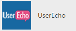
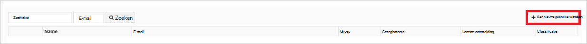

<properties
    pageTitle="Zelfstudie: Azure Active Directory-integratie met UserEcho | Microsoft Azure"
    description="Leer hoe u eenmalige aanmelding tussen Azure Active Directory en UserEcho configureren."
    services="active-directory"
    documentationCenter=""
    authors="jeevansd"
    manager="femila"
    editor=""/>

<tags
    ms.service="active-directory"
    ms.workload="identity"
    ms.tgt_pltfrm="na"
    ms.devlang="na"
    ms.topic="article"
    ms.date="10/20/2016"
    ms.author="jeedes"/>

# Zelfstudie: Azure Active Directory-integratie met UserEcho

Het doel van deze zelfstudie is om aan te geven hoe u UserEcho integreren met Azure Active Directory (Azure AD).  
UserEcho integreren met Azure AD biedt de volgende voordelen: 

- U kunt bepalen in Azure AD wie toegang tot UserEcho heeft 
- U kunt dat uw gebruikers kunnen automatisch ophalen die zijn aangemeld voor toegang tot UserEcho (eenmalige aanmelding) met hun Azure AD-accounts
- U kunt uw accounts op één centrale locatie - de Azure klassieke-portal beheren

Als u weten meer informatie over SaaS app-integratie met Azure AD wilt, raadpleegt u [Wat is toegang tot toepassingen en eenmalige aanmelding met Azure Active Directory](active-directory-appssoaccess-whatis.md).

## Vereisten voor 

Als u wilt configureren Azure AD-integratie met UserEcho, moet u de volgende items:

- Een Azure AD-abonnement
- Een UserEcho eenmalige aanmelding ingeschakeld abonnement

> [AZURE.NOTE] Als u wilt testen de stappen in deze zelfstudie, niet aangeraden een productieomgeving gebruiken.

Als u wilt testen de stappen in deze zelfstudie, moet u deze aanbevelingen volgt:

- Gebruik niet uw productieomgeving, tenzij dit nodig is.
- Als u een proefabonnement Azure AD-omgeving niet hebt, kunt u een één maand proefabonnement [hier](https://azure.microsoft.com/pricing/free-trial/)verkrijgen. 

 
## Scenario beschrijving
Het doel van deze zelfstudie is om te kunnen eenmalige aanmelding Azure AD testen in een testomgeving.  
Het scenario die worden beschreven in deze zelfstudie bestaat uit twee belangrijkste bouwstenen:

1. UserEcho toevoegen vanuit de galerie 
2. Configureren en testen van Azure AD eenmalige aanmelding

## UserEcho toevoegen vanuit de galerie
Als u wilt de integratie van UserEcho in Azure AD configureren, moet u UserEcho uit de galerie toevoegen aan uw lijst met beheerde SaaS-apps.

**Als u wilt toevoegen UserEcho vanuit de galerie, moet u de volgende stappen uitvoeren:**

1. Klik in de **klassieke Azure-portal**op het linker navigatiedeelvenster, klikt u op **Active Directory**. 

    ![Active Directory][1]

2. Selecteer de map waarvoor u wilt inschakelen directory-integratie in de lijst **Directory** .

3. De toepassingen om weergave te openen, in de directoryweergave, klikt u in het bovenste menu op **toepassingen** .

    ![Toepassingen][2]

4. Klik op **toevoegen** aan de onderkant van de pagina.

    ![Toepassingen][3]

5. Klik in het dialoogvenster **Wat wilt u doen** , klikt u op **toevoegen een toepassing in de galerie**.

    ![Toepassingen][4]

6. Typ in het zoekvak **UserEcho**.

    

7. Selecteer **UserEcho**in het deelvenster met resultaten en klik vervolgens op **voltooid** als de toepassing wilt toevoegen.

    

##  Configureren en testen van Azure AD eenmalige aanmelding
Het doel van dit gedeelte is om aan te geven hoe configureren en test eenmalige aanmelding Azure AD met UserEcho op basis van een testgebruiker 'Britta Simon' genoemd.

Eenmalige aanmelding om te werken, moet Azure AD duidelijk de gebruiker die beschikbaar zijn in UserEcho aan een gebruiker in Azure AD is. Een relatie koppeling tussen een Azure AD-gebruiker en de gerelateerde gebruiker in UserEcho moet met andere woorden, tot stand worden gebracht.  
Deze relatie koppeling tot stand is gebracht door het toewijzen van de waarde van de **gebruikersnaam in te voeren** in Azure AD als de waarde van de **gebruikersnaam** in UserEcho.
 
Als u wilt configureren en te testen Azure AD eenmalige aanmelding met UserEcho, die u moet uitvoeren van de volgende elementen:

1. **[Eenmalige aanmelding configureren Azure AD](#configuring-azure-ad-single-single-sign-on)** - zodat uw gebruikers kunnen deze functie gebruiken.
2. **[Gebruiker maken van een Azure AD test](#creating-an-azure-ad-test-user)** - test Azure AD eenmalige aanmelding met Britta Simon.
4. **[Gebruiker maken van een UserEcho testen](#creating-a-userecho-test-user)** - hebben een tegenhanger van Britta Simon in UserEcho dat is gekoppeld aan de Azure AD-weergave van haar.
5. **[Het toewijzen van de Azure AD testen gebruiker](#assigning-the-azure-ad-test-user)** - Britta Simon gebruik eenmalige aanmelding Azure AD inschakelen.
5. **[Testen van eenmalige aanmelding](#testing-single-sign-on)** - om te controleren of de configuratie werkt.

### Azure AD voor eenmalige aanmelding configureren

Het doel van dit gedeelte is Azure AD eenmalige aanmelding in de portal van Azure klassieke inschakelen en configureren eenmalige aanmelding in uw toepassing UserEcho. 

**Als u wilt configureren eenmalige aanmelding Azure AD met UserEcho, moet u de volgende stappen uitvoeren:**

1. Klik in de klassieke Azure portal, klik op de pagina **UserEcho** toepassing integratie op **eenmalige aanmelding configureren** om het dialoogvenster **Configureren eenmalige aanmelding** .

    ![Eenmalige aanmelding configureren][6] 

2. Klik op de pagina **Hoe wilt u dat gebruikers aanmelden bij UserEcho** Selecteer **Azure AD eenmalige aanmelding**en klik vervolgens op **volgende**.

     

3. Klik op de pagina **App-instellingen configureren** dialoogvenster kunt u de volgende stappen uitvoeren:

     

    een. Typ in het tekstvak **Aanmeldingsadres op URL** de URL die wordt gebruikt door uw gebruikers aanmelden bij uw UserEcho-toepassing (bijvoorbeeld: *https://fabrikam.UserEcho.com/*).

    b. Klik op **volgende**.
 
 
4. Klik op de pagina **configureren eenmalige aanmelding bij UserEcho** de volgende stappen uitvoeren:

     

    een. Klik op **certificaat downloaden**en sla het bestand op uw computer.

    b. Klik op **volgende**.

1. In een ander browservenster, meldt u zich op bij uw bedrijfssite UserEcho als beheerder.

1. Op de werkbalk op de voorgrond, klikt u op uw gebruikersnaam in te voeren om het menu te openen en klik vervolgens op **indeling**.

     

1. Klik op **integraties**.

     

1. Klik op **Website**en klik vervolgens op **eenmalige aanmelding (SAML2)**.

     

1. Klik op de pagina **eenmalige aanmelding (SAML)** de volgende stappen uitvoeren:

     

    een. Als het **SAML is ingeschakeld**, selecteert u **Ja**. 

    b. In de klassieke Azure portal, klik op de configureren eenmalige aanmelding bij UserEcho dialoogvenster pagina de waarde voor **Eenmalige aanmelding Service URL** kopiëren en plak deze in **Op SAML SSO URL** tekstvak.

    c. Kopieer de **URL van externe afmelden** -waarde in de klassieke Azure portal, klik op de configureren eenmalige aanmelding bij UserEcho dialoogvenster pagina en plak deze in het tekstvak **URL van externe logoout** . 

    d. Open uw gedownloade certificaat in Kladblok, Kopieer de inhoud en plak deze in het tekstvak **X.509-certificaat** .    

    e. Klik op **Opslaan**.

6. In de klassieke Azure portal, selecteert u de Configuratiebevestiging voor eenmalige aanmelding en klik vervolgens op **volgende**. 

    ![Azure AD voor eenmalige aanmelding][10]

7. Klik op de pagina **confirmation voor eenmalige aanmelding** op **voltooid**.  

    ![Azure AD voor eenmalige aanmelding][11]

### Maken van een gebruiker Azure AD-test
Het doel van dit gedeelte is het opzetten van een testgebruiker in de Azure klassieke portal Britta Simon genoemd.

![Azure AD-gebruiker maken][20]

**Als u wilt maken van een testgebruiker in Azure AD, moet u de volgende stappen uitvoeren:**

1. Klik in de **klassieke Azure-portal**op het linker navigatiedeelvenster, klikt u op **Active Directory**.

      

2. Selecteer de map waarvoor u wilt inschakelen directory-integratie in de lijst **Directory** .

3. De lijst met gebruikers, in het menu aan de bovenkant, klikt u op **gebruikers**.

     
 
4. U opent het dialoogvenster **Gebruiker toevoegen** in de werkbalk op de onderkant, op **Gebruiker toevoegen**. 

     

5. Klik op de pagina dialoogvenster **Vertel ons over deze gebruiker** , moet u de volgende stappen uitvoeren: 

      

    een. Als het Type van gebruiker, selecteert u nieuwe gebruiker in uw organisatie.

    b. Typ in de gebruikersnaam in te voeren **tekstvak** **BrittaSimon**.

    c. Klik op **volgende**.

6.  Klik op de pagina **Gebruikersprofiel** dialoogvenster kunt u de volgende stappen uitvoeren: 

     
 
    een. Typ in het tekstvak **Voornaam** **Britta**.  

    b. Klik in het **Laatste** tekstvak type **Simon**.

    c. Typ in het tekstvak **Naam weer te geven** **Britta Simon**.

    d. Selecteer de **gebruiker**in de lijst **functie** .
    e. Klik op **volgende**.

7. Klik op **maken**op de pagina dialoogvenster **krijgen tijdelijke wachtwoord** .

     
 
8. Klik op de pagina dialoogvenster **tijdelijke wachtwoord krijgen** kunt u de volgende stappen uitvoeren:

     
  
    een. Noteer de waarde van het **Nieuwe wachtwoord**in.

    b. Klik op **Voltooien**.   

  
 
### Maken van een gebruiker UserEcho testen

Het doel van dit gedeelte is het opzetten van een gebruiker Britta Simon in UserEcho genoemd.

**Als u wilt maken van een gebruiker Britta Simon in UserEcho genoemd, moet u de volgende stappen uitvoeren:**

1. Eenmalige aanmelding bij de site van uw UserEcho bedrijf als beheerder.

1. Op de werkbalk op de voorgrond, klikt u op uw gebruikersnaam in te voeren om het menu te openen en klik vervolgens op **indeling**.

     

1. Klik op **gebruikers**, om uit te vouwen van de sectie **gebruikers** .

     

1. Klik op **gebruikers**.

     

1. Klik op **uitnodiging van een nieuwe gebruiker**.

    

1. Klik in het dialoogvenster **een nieuwe gebruiker uitnodigen** , moet u de volgende stappen uitvoeren:

     

    een. Typ in **het tekstvak** **Britta Simon**.

    b. Typ in het tekstvak **e** Britta van e-mailadres in de portal van Azure klassieke.

    c. Klik op **uitnodigen**.

Een uitnodiging wordt verzonden naar Britta, waarmee u ze aan de slag met UserEcho. 

### Het toewijzen van de gebruiker Azure AD-test

Het doel van dit gedeelte is aan het inschakelen van Britta Simon gebruiken Azure eenmalige aanmelding door het verlenen van toegang aan UserEcho.

![Gebruiker toewijzen][200] 

**Als u wilt toewijzen Britta Simon aan UserEcho, moet u de volgende stappen uitvoeren:**

1. Klik in de klassieke Azure portal, de toepassingen om weergave te openen, in de mapweergave, **toepassingen** in het bovenste menu.

    ![Gebruiker toewijzen][201] 

2. Selecteer in de lijst met toepassingen **UserEcho**.

     

1. In het menu aan de bovenkant, klikt u op **gebruikers**.

    ![Gebruiker toewijzen][203] 

1. Selecteer in de lijst gebruikers **Britta Simon**.

2. In de werkbalk op de onderkant, klikt u op **toewijzen**.

    ![Gebruiker toewijzen][205]

### Testen van eenmalige aanmelding

Het doel van deze sectie is uw Azure AD eenmalige aanmelding configuratie testen met het deelvenster Access.  
Wanneer u op de tegel UserEcho in het deelvenster Access, u moet krijgen automatisch aangemeld voor toegang tot uw UserEcho-toepassing.

## Aanvullende informatie

* [Lijst met zelfstudies over het SaaS Apps integreren met Azure Active Directory](active-directory-saas-tutorial-list.md)
* [Wat is de toepassing toegang en eenmalige aanmelding met Azure Active Directory?](active-directory-appssoaccess-whatis.md)

<!--Image references-->

[1]: ./media/active-directory-saas-userecho-tutorial/tutorial_general_01.png
[2]: ./media/active-directory-saas-userecho-tutorial/tutorial_general_02.png
[3]: ./media/active-directory-saas-userecho-tutorial/tutorial_general_03.png
[4]: ./media/active-directory-saas-userecho-tutorial/tutorial_general_04.png

[6]: ./media/active-directory-saas-userecho-tutorial/tutorial_general_05.png
[10]: ./media/active-directory-saas-userecho-tutorial/tutorial_general_06.png
[11]: ./media/active-directory-saas-userecho-tutorial/tutorial_general_07.png
[20]: ./media/active-directory-saas-userecho-tutorial/tutorial_general_100.png

[200]: ./media/active-directory-saas-userecho-tutorial/tutorial_general_200.png
[201]: ./media/active-directory-saas-userecho-tutorial/tutorial_general_201.png
[203]: ./media/active-directory-saas-userecho-tutorial/tutorial_general_203.png
[204]: ./media/active-directory-saas-userecho-tutorial/tutorial_general_204.png
[205]: ./media/active-directory-saas-userecho-tutorial/tutorial_general_205.png

