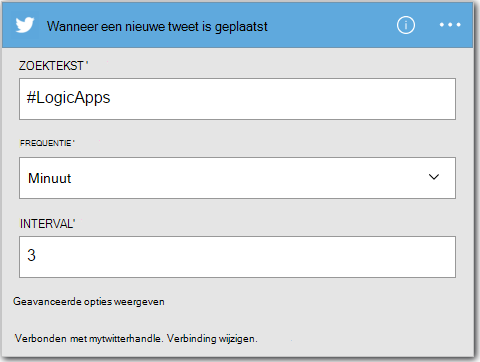
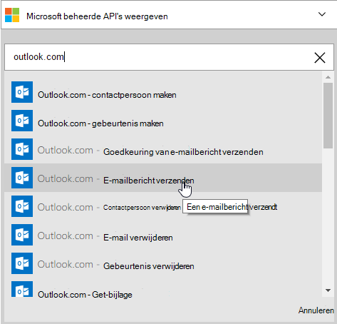
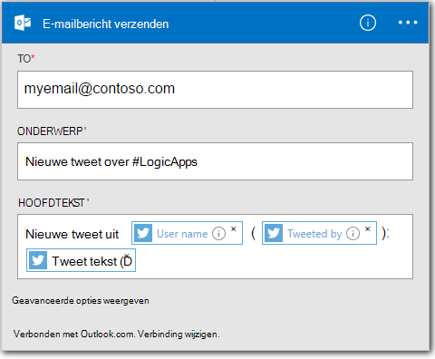

<properties
    pageTitle="Een App logica maakt | Microsoft Azure"
    description="Informatie over het maken van een verbinding SaaS services logica-App"
    authors="jeffhollan"
    manager="dwrede"
    editor=""
    services="logic-apps"
    documentationCenter=""/>

<tags
    ms.service="logic-apps"
    ms.workload="na"
    ms.tgt_pltfrm="na"
    ms.devlang="na"
    ms.topic="get-started-article"
    ms.date="10/18/2016"
    ms.author="jehollan"/>

# Een nieuwe logica app SaaS services verbinding maakt

Dit onderwerp wordt beschreven hoe, in slechts een paar minuten, u kunt aan de slag met [Azure logica Apps](app-service-logic-what-are-logic-apps.md). We gaat een eenvoudige werkstroom waarmee u interessant tweets verzenden naar uw e-mail doorlopen.

Als u wilt gebruiken in dit scenario, hebt u het volgende nodig:

- Een Azure-abonnement
- Een Twitter-account
- Een Outlook.com- of gehoste Office 365-Postvak

## Een nieuwe app logica naar e-u tweets maken

1. Selecteer **Nieuw**op het [dashboard van Azure portal](https://portal.azure.com). 
2. Zoeken naar 'logica app' in de zoekbalk, en selecteer **Logica-App**. U kunt ook Selecteer **Nieuw** **Web + Mobile**, en selecteer **Logica-App**. 
3. Voer een naam voor uw app logica, selecteer een locatie, de resourcegroep en selecteer **maken**.  Als u **vastmaken aan Dashboard** selecteert wordt automatisch de logica-app geopend na implementatie.  
4. Na het openen van uw app logica voor het eerst kunt u van een sjabloon selecteren om te beginnen.  Klik op **Lege logica App** om op te bouwen dit helemaal voorlopig. 
1. Het eerste item dat u wilt maken, is de trigger.  Dit is de gebeurtenis die de logica-app wordt gestart.  Zoeken naar **twitter-** in het zoekvak trigger, en selecteer deze.
7. Nu kunt u een zoekterm om te activeren op typen.  De **frequentie** en **Interval** bepaalt hoe vaak uw app logica voor nieuwe tweets (en alle tweets gedurende die tijd reeks return) moeten worden gecontroleerd.
    

5. Selecteer de knop **nieuwe stap** en kies vervolgens **een actie toevoegen** of **toevoegen een voorwaarde**
6. Wanneer u **een actie toevoegen**selecteert, kunt u zoeken vanuit de [Beschikbare connectors](../connectors/apis-list.md) een actie te kiezen. U kunt bijvoorbeeld, **Outlook.com - e-mailbericht verzenden** om e-mail te verzenden vanaf een outlook.com-adres selecteren:  
    

7. U beschikt nu om de parameters voor het gewenste e-mailbericht in te vullen:  

8. Tot slot kunt u **Opslaan** zodat uw app logica live.

## Uw app logica beheren na het maken

Nu is uw app logica actief. Deze controleert regelmatig op tweets met de zoekterm ingevoerd. Wanneer er een overeenkomende tweet, stuurt deze u een e-mailbericht. U wordt ten slotte, leest u het uitschakelen van de app of zien hoe dit doet.

1. Ga naar de [Portal van Azure](https://portal.azure.com)

1. Klik op **Bladeren** aan de linkerkant van het scherm en selecteer **Logica Apps**.

2. Klik op de nieuwe logica-app die u zojuist hebt gemaakt om te zien van de huidige status en algemene informatie.

3. Als u wilt bewerken in de nieuwe logica-app, klikt u op **bewerken**.

5. Als u wilt uitschakelen de app, klik op in de opdrachtenbalk **uitschakelen** .

1. Bekijk uitvoeren en de inwerkingtreding Geschiedenis om te controleren wanneer uw logica-app wordt uitgevoerd.  U kunt klikken op **vernieuwen** als u wilt zien van de meest recente gegevens.

Meer dan 5 minuten kon u voor het instellen van een eenvoudige logica app uitgevoerd in de cloud. Zie voor meer informatie over het gebruik van functies van de logica Apps, [logica app-functies gebruiken]. Meer informatie over de logica App definities zelf, Zie [logica App definities van de auteur](app-service-logic-author-definitions.md).

<!-- Shared links -->
[Azure portal]: https://portal.azure.com
[Logica app-functies gebruiken]: app-service-logic-create-a-logic-app.md
