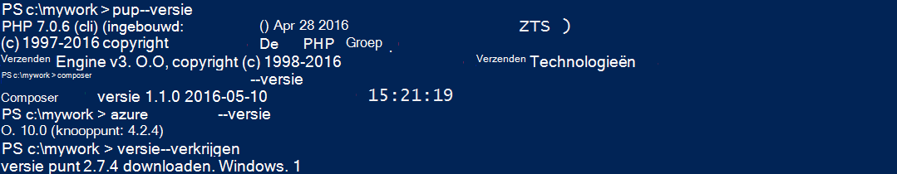
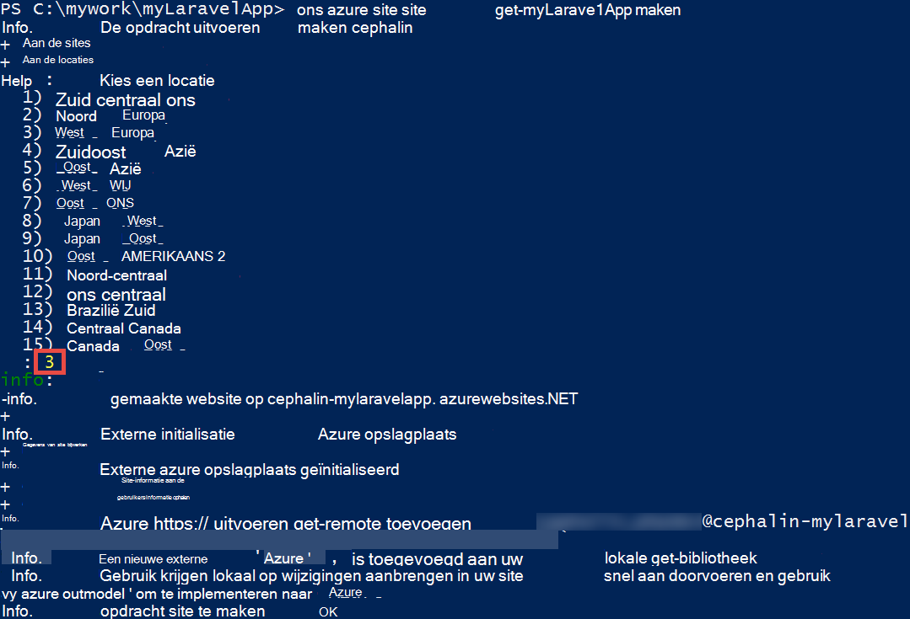
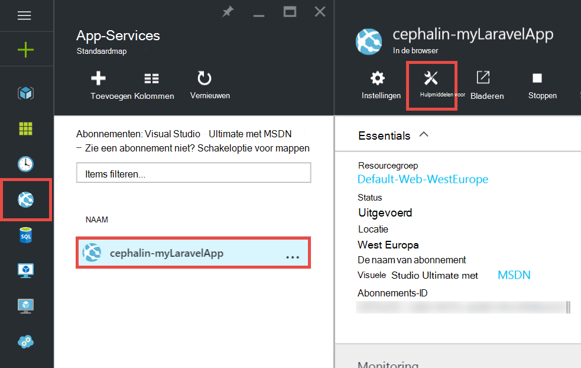
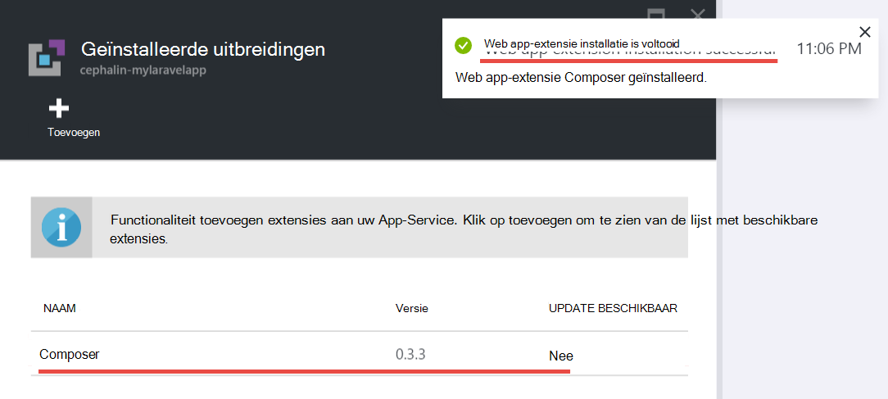
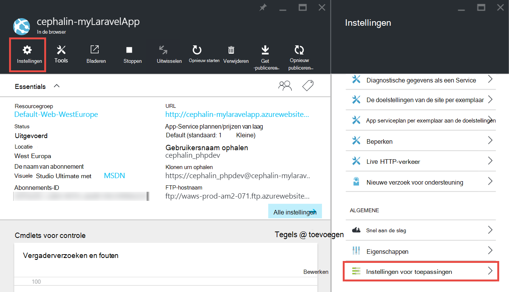
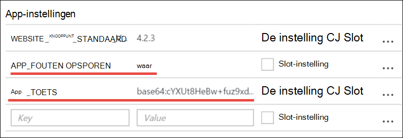
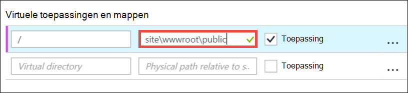
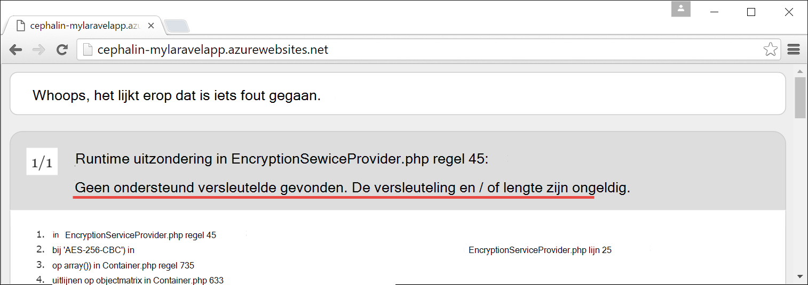

<properties
    pageTitle="Maken en implementeren van een PHP web-app naar Azure configureren"
    description="Een zelfstudie waarin wordt uitgelegd hoe u een PHP (Laravel) web-app uitvoeren in Azure App-Service. Informatie over het configureren van Azure App-Service om te voldoen aan de vereisten van het PHP framework die u kiest."
    services="app-service\web"
    documentationCenter="php"
    authors="cephalin"
    manager="wpickett"
    editor=""
    tags="mysql"/>

<tags
    ms.service="app-service-web"
    ms.workload="web"
    ms.tgt_pltfrm="na"
    ms.devlang="PHP"
    ms.topic="article"
    ms.date="06/03/2016" 
    ms.author="cephalin"/>

# Maken en implementeren van een PHP web-app naar Azure configureren

[AZURE.INCLUDE [tabs](../../includes/app-service-web-get-started-nav-tabs.md)]

Deze zelfstudie ziet u hoe maken, configureren en implementeer een PHP web-app voor Azure en het configureren van Azure App-Service om te voldoen aan de vereisten van uw PHP web-app. Aan het einde van de zelfstudie hebt u een werkende [Laravel](https://www.laravel.com/) WebApp met live in [Azure App-Service](../app-service/app-service-value-prop-what-is.md).

U kunt uw favoriete PHP framework als ontwikkelaar PHP overbrengen naar Azure. Deze zelfstudie gebruikt Laravel gewoon als een voorbeeld Betonnen app. U leert: 

- Distribueren met het cijfer
- Set PHP versie
- Een begin-bestand dat zich niet in de hoofdmap van de toepassing gebruiken
- Access-omgeving / regiospecifieke variabelen
- Bijwerken van uw app in Azure wordt aangegeven

U kunt toepassen wat u hebt geleerd hier aan andere PHP web-apps die u dashboard naar Azure implementeren.

>[AZURE.INCLUDE [app-service-linux](../../includes/app-service-linux.md)] 

## Vereisten voor

- Installeer [PHP 5.6.x](http://php.net/downloads.php) (PHP 7-ondersteuning is beta)
- [Composer](https://getcomposer.org/download/) installeren
- [Azure CLI](../xplat-cli-install.md) installeren
- [Cijfer](http://www.git-scm.com/downloads) installeren
- Een Microsoft Azure-account aanschaffen. Als u geen account hebt, kunt u [registreren voor een gratis proefversie](/pricing/free-trial/?WT.mc_id=A261C142F) of [activeren van de voordelen van uw Visual Studio-abonnee](/pricing/member-offers/msdn-benefits-details/?WT.mc_id=A261C142F).

>[AZURE.NOTE] Zie een web-app in actie. [App-Service probeert](http://go.microsoft.com/fwlink/?LinkId=523751) direct en een tijdelijk starter-app maken, geen creditcard vereist, niet verplichtingen.

## Een PHP (Laravel)-app op uw computer ontwikkelaar maken

1. Open een nieuwe opdrachtprompt van Windows, PowerShell-venster, Linux shell of terminal OS X. Voer de volgende opdrachten om te controleren of de vereiste hulpmiddelen juist zijn geïnstalleerd op uw computer. 

        php --version
        composer --version
        azure --version
        git --version

    

    Als u de hulpmiddelen voor dit nog niet hebt geïnstalleerd, raadpleegt u de [vereisten](#Prerequisites) voor het van downloadkoppelingen.
    
2. Installatie Laravel zoals hier:

        composer global require "laravel/installer

3. `CD`in een werkmap en maak een nieuwe Laravel-toepassing zoals in dit voorbeeld:

        cd <working_directory>
        laravel new <app_name>

4. `CD`naar het zojuist gemaakte `<app_name>` gids en test de app als volgt:

        cd <app_name>
        php artisan serve
        
    U moet mogelijk zijn nu Navigeer naar http://localhost:8000 in een browser en ziet u het beginscherm Laravel.
    
    
    
Dus uiterst, alleen de normale Laravel-werkstroom en u niet bent hier voor <a href="https://laravel.com/docs/5.2" rel="nofollow">meer informatie over Laravel</a>. Op zodat we verplaatsen.

## Een Azure WebApp maken en cijfer implementatie instellen

>[AZURE.NOTE] "Wacht! Wat gebeurt er als ik wil implementeren met FTP?" Er is een [FTP-zelfstudie](web-sites-php-mysql-deploy-use-ftp.md) voor uw behoeften. 

Met de CLI Azure, kunt u een web-app in Azure App Service maken en instellen voor cijfer-implementatie waarbij één regel van de opdracht. Laten we dit doen.

1. Wijzigen in de modus ASM en meld u aan bij Azure:

        azure config mode asm
        azure login
    
    Het helpbericht kunt doorgaan met de aanmelding te volgen.
    
    

4. De opdracht om te maken van de Azure WebApp met cijfer implementatie uitvoeren. Wanneer u wordt gevraagd, geeft u het aantal het gewenste gebied.

        azure site create --git <app_name>
    
    
    
    >[AZURE.NOTE] Als u hebt nooit implementatie referenties ingesteld voor uw Azure-abonnement, wordt u gevraagd om deze te maken. Deze referenties, niet Azure referenties van uw account, worden gebruikt door de App Service alleen voor cijfer implementaties en FTP-aanmeldingen. 
    
    Deze opdracht Hiermee maakt u een nieuwe cijfer opslagplaats aan de huidige map (met `git init`) en verbindt u deze naar de bibliotheek in Azure wordt aangegeven als een externe cijfer (met `git remote add`).

<a name="configure"/>
## De Azure WebApp configureren

Voor de app Laravel om te werken in Azure, moet u aandacht besteden aan verschillende dingen. U doen deze vergelijkbare oefening voor uw PHP kader van keuze.

- PHP 5.5.9 configureren of hoger. Zie [Nieuwste Laravel 5,2 serververeisten](https://laravel.com/docs/5.2#server-requirements) voor de hele lijst met serververeisten. De rest van de lijst zijn uitbreidingen die al zijn ingeschakeld door van Azure PHP installaties. 
- Stel de omgevingsvariabelen uw app nodig heeft. Laravel gebruikt de `.env` bestand voor eenvoudig instellen van de omgevingsvariabelen. Echter omdat deze niet moet worden doorgevoerd in het besturingselement voor gegevensbronnen (Zie [Configuratie van Laravel-omgeving](https://laravel.com/docs/5.2/configuration#environment-configuration), wordt u in plaats hiervan de instellingen voor de app van uw Azure WebApp instellen.
- Zorg ervoor dat de Laravel-app ingangspunt, `public/index.php`, eerst is geladen. Zie [overzicht van de levenscyclus van de Laravel](https://laravel.com/docs/5.2/lifecycle#lifecycle-overview). Met andere woorden, u nodig hebt voor het instellen van de URL van de hoofdmap van de web-app zodat deze verwijzen naar de `public` directory.
- De extensie Composer in Azure wordt aangegeven, aangezien er een composer.json inschakelen Op deze manier kunt u Composer zorgen maken over het verkrijgen van uw vereiste pakketten wanneer u implementeert in met de werkdruk `git push`. Dit is een kwestie van gemak. Als u geen Composer automatisering inschakelt, moet u gewoon verwijderen `/vendor` uit het `.gitignore` bestand zodat cijfer bevat ("un-worden genegeerd") alles in de `vendor` directory wanneer u vastlegt en code wordt geïmplementeerd.

Laten we opeenvolging deze taken configureren.

4. Stel de PHP-versie die moeten worden uw Laravel-app.

        azure site set --php-version 5.6

    U klaar bent met het instellen van de versie PHP! 
    
4. Een nieuw genereren `APP_KEY` voor uw Azure web app en dit als een app-instelling voor uw Azure WebApp instellen.

        php artisan key:generate --show
        azure site appsetting add APP_KEY="<output_of_php_artisan_key:generate_--show>"

4. Ook inschakelen voor foutopsporing Laravel in om te kunnen voorrang ieder cryptische `Whoops, looks like something went wrong.` pagina.

        azure site appsetting add APP_DEBUG=true

    U bent klaar instelling omgevingsvariabelen.
    
    >[AZURE.NOTE] Wacht, laten we eens iets vertragen en wordt uitgelegd wat Laravel betekent en wat Azure betekent hier. Laravel gebruikt de `.env` bestand in de hoofdmap te leveren omgeving variabelen waarmee u de app daar u de regel vindt `APP_DEBUG=true` (en ook `APP_KEY=...`). Deze variabele wordt geopend `config/app.php` door de code     `'debug' => env('APP_DEBUG', false),`. [env()](https://laravel.com/docs/5.2/helpers#method-env) is een Laravel waarin de PHP [getenv()](http://php.net/manual/en/function.getenv.php) achter de.
    >
    >Echter `.env` wordt genegeerd door cijfer omdat deze wordt aangeroepen door de `.gitignore` bestand in de hoofdmap. Kortom, `.env`  
 in uw lokale cijfer opslagplaats is niet doorgevoerd in de Azure met de rest van de bestanden. Uiteraard kunt u alleen die regel uit verwijderen `.gitignore`, maar we dat u dit bestand in een besturingselement voor gegevensbronnen vastlegt wordt niet aanbevolen al hebt gedefinieerd. Toch, moet u ook een manier om op te geven van deze omgevingsvariabelen in Azure wordt aangegeven. 
    >
    >Het goede nieuws is dat de instellingen van de app in Azure App Service [getenv()](http://php.net/manual/en/function.getenv.php) ondersteunt 
 in PHP. Dat het geval is terwijl u FTP of op andere wijze gebruiken kunt voor het uploaden van handmatig een `.env` bestand in Azure, kunt u alleen de variabelen die u wilt opgeven als de instellingen van de Azure app zonder een `.env` in Azure wordt aangegeven, zoals u zojuist hebben gedaan. Bovendien als een variabele in beide een `.env` bestand en in Azure app-instellingen, de instelling Azure app wins.     

4. De laatste twee taken (de virtuele map instelt en inschakelen van Composer) is vereist voor de [Azure-portal](https://portal.azure.com), dus Meld u aan bij de [portal](https://portal.azure.com) met uw Azure-account.

4. Klik met de vanaf het linkermenu op **App-Services** > **&lt;Naam_toepassing >** > **hulpmiddelen**.

    
    
    >[AZURE.TIP] Als u op **Instellingen** , in plaats van **Hulpmiddelen voor**, u kunt wel voor toegang tot de **Toepassingsinstellingen**  
 blade, waarmee u de PHP versies, app-instellingen, instellen en virtuele mappen zoals u zojuist hebt gedaan. 
    
4. Klik op **extensies** > **toevoegen** aan een uitbreiding toevoegen.

4. Selecteer **Composer** in de **kiezen extensie** [blade](../azure-portal-overview.md) (*blade*: een pagina in de portal dat wordt geopend horizontaal).

4. Klik op **OK** in het blad **de juridische voorwaarden accepteren** . 

5. Klik op **OK** in het blad **extensie toevoegen** .

    Als Azure klaar is met de extensie toevoegt, moet er een beschrijvende pop-bericht wordt weergegeven in de hoek, alsmede  **Composer** vermeld in het blad **uitbreidingen** .

    

    U bent klaar inschakelen Composer.
    
4. Klik op **Instellingen**terug in uw web-app blade, > **Toepassingsinstellingen**.

    

    Houd rekening met de PHP-versie die u eerder hebt ingesteld in het blad **Toepassingsinstellingen** :

    

    en de instellingen voor de app die u hebt toegevoegd:
    
    

4. Schuif naar de onderkant van het blad en wijzig de virtuele hoofdmap zodat deze verwijzen naar **site\wwwroot\public** in plaats van **site\wwwroot**.

    

4. Klik op **Opslaan** aan de bovenkant van het blad.

    U klaar bent met het virtuele map instelt! 

## Implementeer de WebApp met cijfer (en een instelling omgevingsvariabelen)

U bent klaar nu uw code-implementatie. U doet dit terug in uw opdrachtprompt of terminal.

4. Alle wijzigingen doorvoeren en implementeren van uw code naar de Azure WebApp, zoals u zou in een bibliotheek cijfer doen:

        git add .
        git commit -m "Hurray! My first commit for my Azure app!"
        git push azure master 

    Wanneer u zich `git push`, wordt u gevraagd uw cijfer implementatie-wachtwoord op te geven. Als u gevraagd of implementatie-referenties bij maken `azure site create` eerder, typ het wachtwoord die u hebt gebruikt.
    
5. Laten we eens kijken deze uitgevoerd in de browser door deze opdracht uit te voeren:

        azure site browse

    Uw browser moet u het beginscherm Laravel weergeven.
    
    
    
    Gefeliciteerd, u nu een Laravel web-app uitvoert in Azure wordt aangegeven.
             
## Oplossen van veelvoorkomende fouten

Hier volgen enkele de fouten die mogelijk optreden kunnen wanneer deze zelfstudie te volgen:

- [Azure CLI geeft "'locatie' is niet een azure-opdracht"](#clierror)
- [HTTP 403 fout wordt weergegeven in de browser](#http403)
- [WebApp wordt weergegeven "Whoops, weergaven, zoals is een fout opgetreden."](#whoops)
- [WebApp wordt weergegeven "Geen ondersteunde coderen gevonden."](#encryptor)

### Azure CLI geeft "'locatie' is niet een azure-opdracht"

Wanneer u zich `azure site *` in de opdrachtregel terminal en ziet u de fout`error:   'site' is not an azure command. See 'azure help'.` 

Dit is meestal overschakelen naar de modus "ARM" (Azure resourcemanager) als resultaat. U lost dit op door schakelen weer in de modus "ASM" (Azure servicebeheer) door te voeren `azure config mode asm`.

### HTTP 403 fout wordt weergegeven in WebApp

U hebt uw web-app naar Azure geïmplementeerd, maar als u naar uw Azure web-app zoeken, krijgt u een `HTTP 403` of`You do not have permission to view this directory or page.`

Dit is meestal omdat de web-app het ingangspunt bij de app Laravel niet vinden. Zorg ervoor dat u hebt ingesteld dat de virtuele hoofdmap zodat deze verwijzen naar `site\wwwroot\public`, waarbij de Laravel `index.php` is (Zie [configureren de Azure WebApp](#configure)).

### WebApp wordt weergegeven "Whoops, weergaven, zoals is een fout opgetreden."

U hebt uw web-app naar Azure geïmplementeerd, maar als u naar uw Azure web-app zoeken, krijgt u het cryptische bericht`Whoops, looks like something went wrong.`

Als u een meer betekenisvolle fout, Laravel foutopsporing inschakelen door in te stellen `APP_DEBUG` omgevingsvariabele `true` (Zie [configureren de Azure WebApp](#configure)).

### WebApp wordt weergegeven "Geen ondersteunde coderen gevonden."

U hebt uw web-app naar Azure geïmplementeerd, maar wanneer u naar uw Azure web-app zoeken, u het volgende foutbericht:

    
Die een vervelende fout is, maar ten minste het is niet cryptische sinds u ingeschakeld voor foutopsporing Laravel in. Een snelle zoeken met de fouttekenreeks op de forums Laravel ziet u dat dit is vanwege de APP_KEY niet instellen in `.env`, of in de zaak, niet steeds `.env` in Azure helemaal. U kunt dit probleem oplossen door de instelling toe te voegen `APP_KEY` instellen als een Azure-app (Zie [configureren de Azure WebApp](#configure)).
    
## Volgende stappen

Leer hoe u gegevens toevoegen aan uw app door te [maken van een MySQL-database in Azure wordt aangegeven](../store-php-create-mysql-database.md). Ook, raadplegen meer handige koppelingen voor PHP in Azure wordt hieronder aangegeven:

- [PHP Developer Center](/develop/php/).
- [Een WebApp maken van Azure Marketplace](app-service-web-create-web-app-from-marketplace.md)
- [PHP in WebApps Azure App-Service configureren](web-sites-php-configure.md)
- [WordPress converteren naar meerdere locaties in Azure App-Service](web-sites-php-convert-wordpress-multisite.md)
- [Enterprise-klasse WordPress op Azure App-Service](web-sites-php-enterprise-wordpress.md)
