<properties 
    pageTitle="Azure CDN gebruiken in Azure App-Service" 
    description="Een zelfstudie waarin u u hoe leert u een WebApp implementeren naar Azure-Service voor App dat inhoud van een geïntegreerde Azure CDN-eindpunt fungeert" 
    services="app-service\web,cdn" 
    documentationCenter=".net" 
    authors="cephalin" 
    manager="wpickett" 
    editor="jimbe"/>

<tags 
    ms.service="app-service" 
    ms.workload="tbd" 
    ms.tgt_pltfrm="na" 
    ms.devlang="dotnet" 
    ms.topic="article" 
    ms.date="07/01/2016" 
    ms.author="cephalin"/>


# <a name="use-azure-cdn-in-azure-app-service"></a>Azure CDN gebruiken in Azure App-Service

[App-Service](http://go.microsoft.com/fwlink/?LinkId=529714) kan worden geïntegreerd met [Azure CDN](/services/cdn/), toe te voegen aan de globale schaal mogelijkheden inherent aan [App Service Web Apps](http://go.microsoft.com/fwlink/?LinkId=529714) door de inhoud van uw web-app globaal van serverknooppunten in de buurt van uw klanten (een bijgewerkte lijst met alle huidige knooppunt locaties vindt u [hier](http://msdn.microsoft.com/library/azure/gg680302.aspx)). In scenario's zoals statische afbeeldingen ophalen, worden deze integratie kunt de prestaties van uw Web-Apps van Azure App Service aanzienlijk vergroten en aanzienlijk verbetert de gebruikerservaring voor uw web-app overal ter wereld. 

Web Apps integreren met Azure CDN, kunt u de volgende voordelen:

- Inhoudsdistributie (afbeeldingen, scripts en opmaakmodellen) integreren als onderdeel van uw web-app [continue implementatie](app-service-continuous-deployment.md) proces
- Eenvoudige upgrade NuGet pakketten in uw web-app in Azure App-Service, zoals jQuery of Bootstrap versies 
- Uw webtoepassing en uw inhoud CDN served beheren vanuit de dezelfde Visual Studio-interface
- ASP.NET bundeling en minification integreren met Azure CDN

[AZURE.INCLUDE [app-service-web-to-api-and-mobile](../../includes/app-service-web-to-api-and-mobile.md)] 

## <a name="what-you-will-build"></a>Wat u wordt maken ##

U een WebApp implementeren Azure App-service met behulp van de standaard ASP.NET MVC sjabloon in Visual Studio, code toevoegen om te dienen inhoud uit een geïntegreerde Azure CDN, zoals een afbeelding, controller actie resultaten, en de standaard JavaScript en CSS-bestanden, en ook code schrijven om te configureren de fallback om pakketten served in het geval dat de CDN offline is.

## <a name="what-you-will-need"></a>Wat u nodig hebt ##

Deze zelfstudie heeft de volgende vereisten:

-   Een actieve [Microsoft Azure-account](/account/)
-   Visual Studio-2015 met de [Azure SDK voor .NET](http://go.microsoft.com/fwlink/p/?linkid=323510&clcid=0x409). Als u Visual Studio gebruikt, worden de stappen kunnen variëren.

> [AZURE.NOTE] U hebt een Azure-account om te voltooien van deze zelfstudie nodig:
> + U kunt [een Azure-account gratis openen](/pricing/free-trial/) - u tegoeden krijgt u kunt uitproberen betaalde Azure services en zelfs nadat ze omhoog gebruikt kunt u het account en gebruik vrij te geven Azure services, zoals Web Apps.
> + U kunt [Visual Studio abonnee voordelen activeren](/pricing/member-offers/msdn-benefits-details/) : uw Visual Studio abonnement geeft u tegoeden elke maand die u voor betaalde Azure-services gebruiken kunt.
>
> Als u aan de slag met Azure App Service wilt voordat u zich registreert voor een Azure-account, gaat u naar de [App-Service probeert](http://go.microsoft.com/fwlink/?LinkId=523751), waar u direct een tijdelijk starter in de browser in de App-Service maken kunt. Geen creditcards vereist; geen verplichtingen.

## <a name="deploy-a-web-app-to-azure-with-an-integrated-cdn-endpoint"></a>Een web-app implementeren naar Azure met een geïntegreerde CDN-eindpunt ##

In deze sectie, wordt u standaard ASP.NET MVC toepassingssjabloon in Visual Studio-2015 implementeren naar App Service en vervolgens integreren met een nieuw CDN-eindpunt. Volg de onderstaande instructies:

1. Maak in Visual Studio-2015 verlengt, een nieuwe ASP.NET-webtoepassing in het menu door te gaan naar **Bestand > Nieuw > Project > Web > ASP.NET-webtoepassing**. Een naam geven en klik op **OK**.

    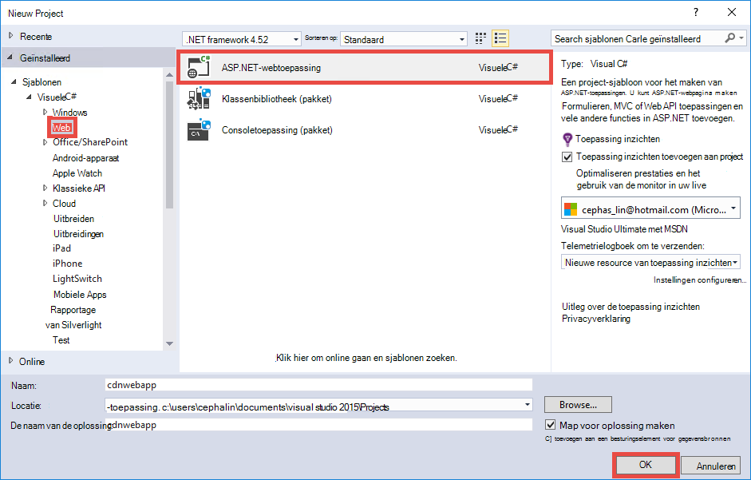

3. Selecteer **MVC** en klik op **OK**.

    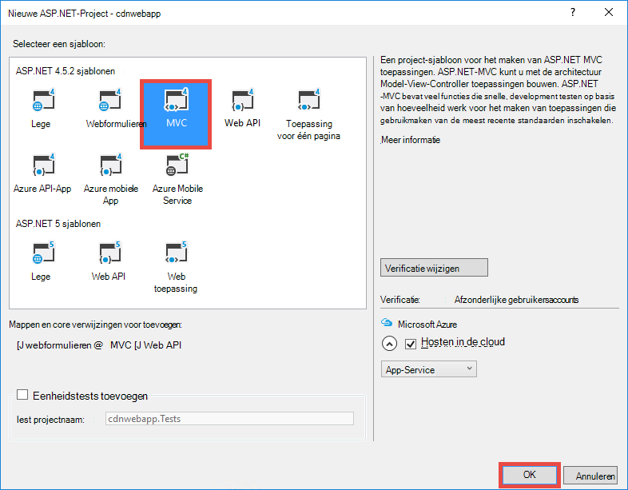

4. Als u nog niet hebt aangemeld bij uw Azure-account, klikt u op het pictogram van het account in de rechterbovenhoek en volgt u het dialoogvenster aan te melden bij uw Azure-account. Zodra u klaar bent, uw app configureren, zoals hieronder wordt weergegeven en vervolgens klikt u op **Nieuw** om een nieuwe App Service-plan voor de app te maken.  

    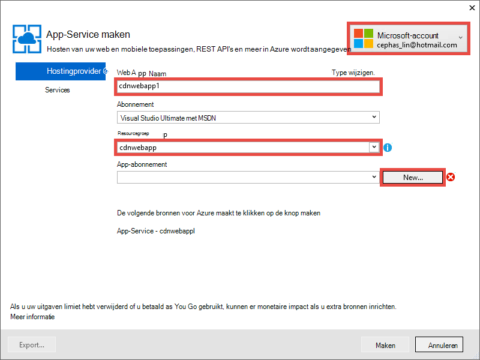

5. Een nieuw abonnement van de App-Service configureren in het dialoogvenster, zoals hieronder wordt weergegeven en klik op **OK**. 

    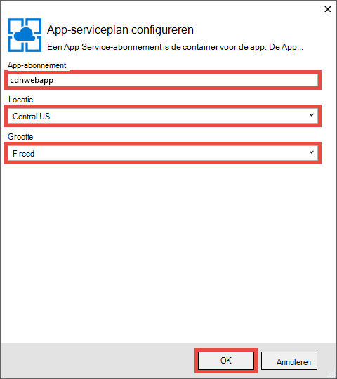

8. Klik op **maken** om te maken van de web-app.

    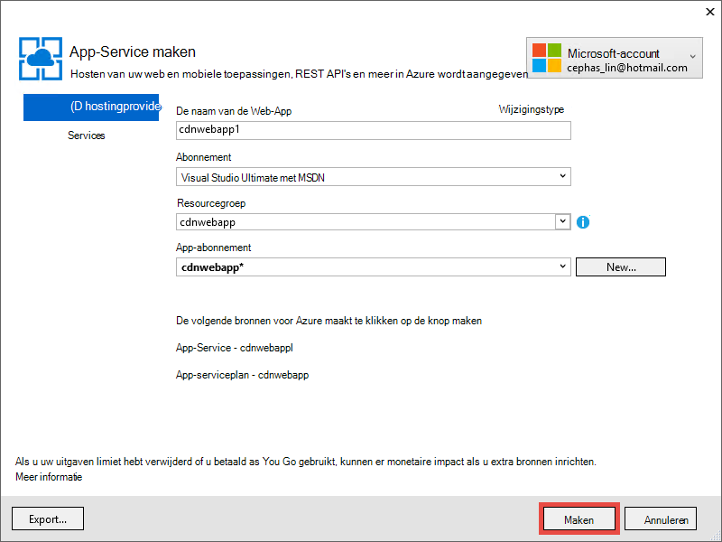

9. Nadat uw ASP.NET-toepassing is gemaakt, publiceren naar Azure in het deelvenster Azure App serviceactiviteit door te klikken op **publiceren `<app name>` voor deze Web-App nu**. Klik op **publiceren** om het proces te voltooien.

    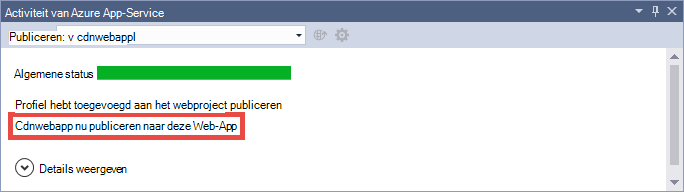

    U ziet uw gepubliceerde web-app in de browser wanneer publiceren voltooid is. 

1. Als u wilt een CDN-eindpunt maken, meld u aan bij de [portal van Azure](https://portal.azure.com). 
2. Klik op **+ nieuwe** > **Media + CDN** > **CDN**.

    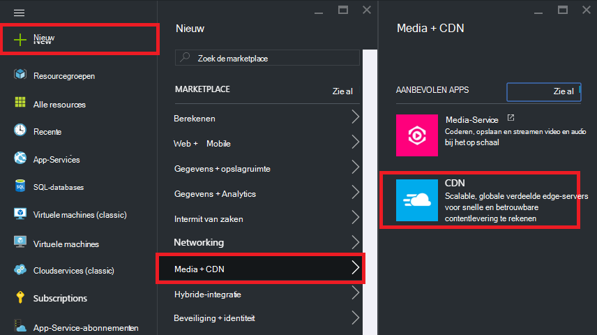

3. Geef het **CDN**, de **locatie**, de **resourcegroep**, de **prijzen laag**en klik op **maken**

    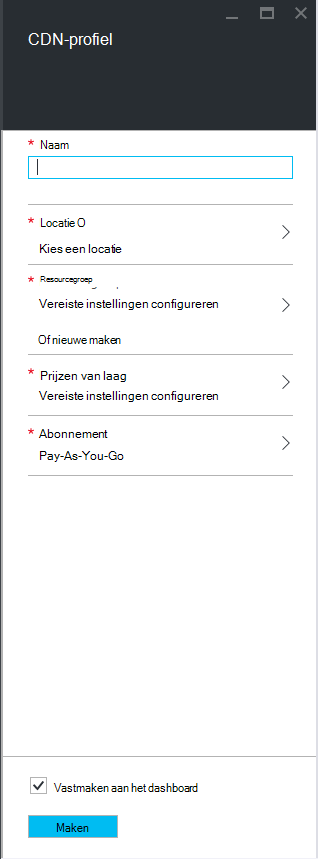   

4. Klik in het **CDN-profiel** op blade op de knop **+ eindpunt** . Een naam geven, selecteert u **Web App** in de vervolgkeuzelijst **Origin Type** en uw web-app in de vervolgkeuzelijst **Origin hostname** aan en klik vervolgens op **toevoegen**.  

    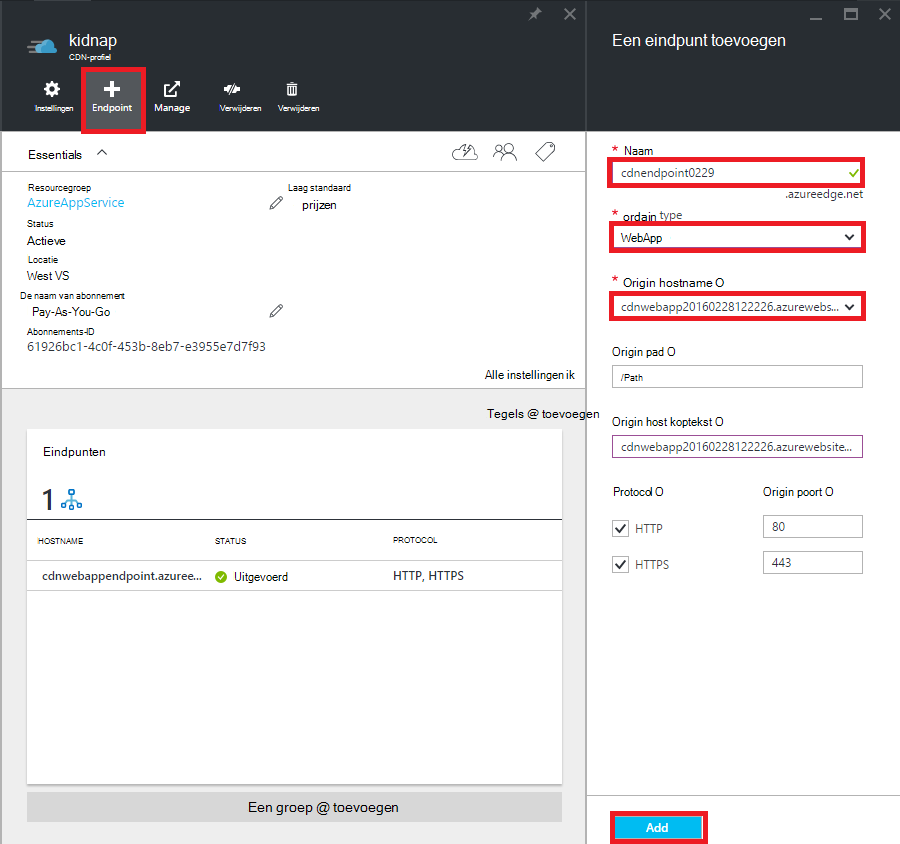


    > [AZURE.NOTE] Nadat uw CDN-eindpunt is gemaakt, ziet het **eindpunt** blad u de URL CDN en het oorspronkelijke domein die deze geïntegreerd met. Echter, kan dit een tijdje voor de configuratie van het nieuwe CDN endpoint volledig worden doorgegeven naar de locaties voor de knooppunt CDN duren. 

3. Klik op de naam van het CDN-eindpunt dat u zojuist hebt gemaakt in het blad **eindpunt** .

    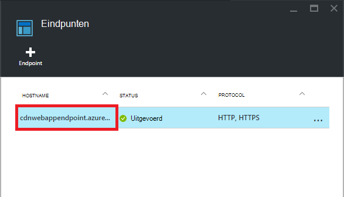

3. Klik op de knop **configureren** . In het blad **configureren** selecteert u **elke unieke URL in Cache** in de vervolgkeuzelijst **queryreeks caching van gedrag** , klik op de knop **Opslaan** .


    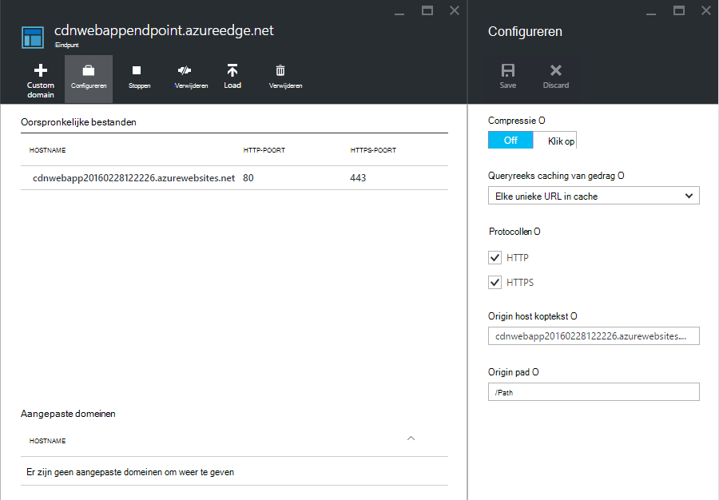

Nadat u dit inschakelt, worden geopend met andere querytekenreeksen dezelfde koppeling als afzonderlijke items in de cache opgeslagen.

>[AZURE.NOTE] Tijdens het inschakelen van de queryreeks niet nodig is voor deze zelfstudie sectie, die u wilt dit doen omdat vroeg mogelijk uitkomt sinds er een wijziging hier is gaan tijd doorgeven aan alle CDN knooppunten in beslag neemt, en u niet dat alle inhoud niet query-tekenreeks-ingeschakelde wilt naar dichtslibben de CDN-cache (bijwerken CDN inhoud zal worden besproken later).

2. Nu, Ga naar het eindpuntadres CDN. Als het eindpunt klaar is, ziet u uw web-app weergegeven. Als u een **HTTP 404** -foutbericht krijgt, is het eindpunt CDN niet gereed. Mogelijk moet u wachten omhoog naar uren voor de configuratie CDN aan alle rand knooppunten worden doorgegeven. 

    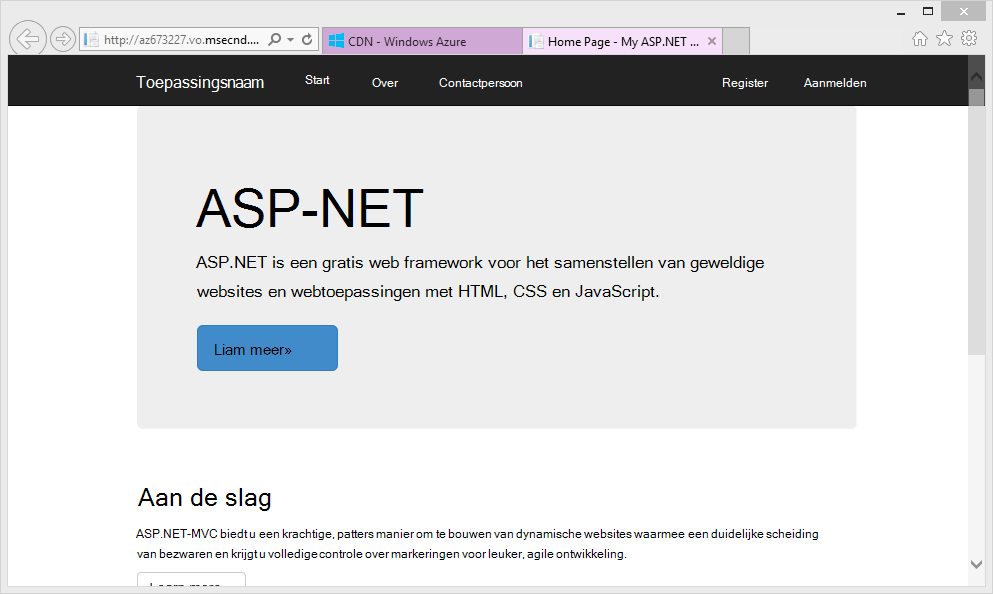

1. Probeer vervolgens voor toegang tot het bestand **~/Content/bootstrap.css** in uw project ASP.NET. Ga in het browservenster naar * *http://*&lt;cdnName >*.azureedge.net/Content/bootstrap.css**. In mijn instelling is deze URL:

        http://az673227.azureedge.net/Content/bootstrap.css

    Die overeenkomt met de volgende URL origin bij het eindpunt CDN:

        http://cdnwebapp.azurewebsites.net/Content/bootstrap.css

    Wanneer u navigeren naar * *http://*&lt;cdnName >*.azureedge.net/Content/bootstrap.css**, wordt u gevraagd om te downloaden van de bootstrap.css die u hebt gekregen van uw web-app in Azure wordt aangegeven. 

    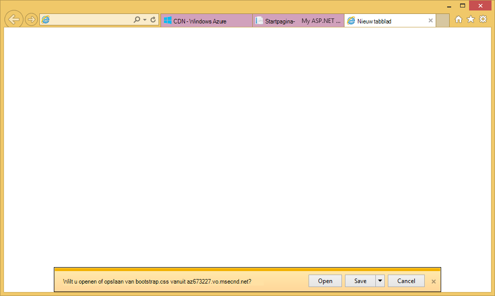

U hebt ook toegang tot elke openbaar URL op * *http://*&lt;servicenaam >*.cloudapp.net/**, rechtstreeks vanuit uw CDN-eindpunt. Bijvoorbeeld:

-   Een JS-bestand uit het pad/script
-   Een inhoudsbestand uit de/inhoud pad
-   Geen controller/actie 
-   Als de queryreeks is ingeschakeld op uw CDN-eindpunt, een URL met querytekenreeksen met de
-   De hele Azure WebApp als alle inhoud openbaar is

Houd er rekening mee dat deze mogelijk niet altijd een goed idee (of in het algemeen een goed idee) naar een hele Azure web-app via Azure CDN fungeren. Enkele van de beperkingen zijn:

-   Hiervoor is uw hele site openbaar zijn, omdat Azure CDN privé inhoud kan niet meer aanbieden.
-   Als het eindpunt CDN voor welke reden dan ook offline gaat, of gepland onderhoud of de gebruiker is opgetreden en uw hele web-app offline gaat tenzij de klanten kunnen worden omgeleid naar de URL origin * *http://*&lt;sitenaam >*.azurewebsites.net/**. 
-   Ook niet met de aangepaste Cachebeheer-instellingen (Zie [configureren cache-opties voor statische bestanden in uw Azure web-app](#configure-caching-options-for-static-files-in-your-azure-web-app)), een CDN-eindpunt de prestaties van zeer-dynamische inhoud niet worden verbeterd. Als u probeert te laden van de startpagina van uw CDN-eindpunt als wordt weergegeven boven, u ziet dat dit ten minste 5 seconden duurde de eerste keer, dat wil een eenvoudig pagina zeggen van de standaardstartpagina laden. Stel wat gebeurt er met de clientervaring als deze pagina bevat dynamische inhoud die elke minuut moet bijwerken. Dynamische inhoud uit een CDN-eindpunt vereist korte cache verlooptijd, die veelgebruikte Cachemissers bij het eindpunt CDN equivalent. Hiermee pijn doet de prestaties van uw Azure web-app en het doel van een CDN defeats.

Het alternatief is om te bepalen welke inhoud moet fungeren van Azure CDN op basis van door geval in uw Azure web-app. Daartoe hebt u al hoe u afzonderlijke bestanden met inhoud vanuit het eindpunt CDN gezien. Ik ziet u hoe u de actie van een specifieke controller door het eindpunt CDN dienen in de [inhoud van de acties controller via Azure CDN fungeren](#serve-content-from-controller-actions-through-azure-cdn).

## <a name="configure-caching-options-for-static-files-in-your-azure-web-app"></a>Cache-opties voor statische bestanden in uw Azure web-app configureren ##

Met Azure CDN-integratie in uw Azure web-app, kunt u opgeven hoe het gewenste statische inhoud in de cache opgeslagen in het CDN-eindpunt. Klik hiertoe *Web.config* openen vanuit uw ASP.NET-project (bijvoorbeeld **cdnwebapp**) en toevoegen een `<staticContent>` element dat moet worden `<system.webServer>`. De onderstaande XML Hiermee configureert u de cache verstrijkt 3 dagen.  

    <system.webServer>
      <staticContent>
        <clientCache cacheControlMode="UseMaxAge" cacheControlMaxAge="3.00:00:00"/>
      </staticContent>
      ...
    </system.webServer>

Nadat u dit doet, wordt alle statische bestanden in uw Azure web-app dezelfde regel in de cache CDN toekijken. Een *Web.config* -bestand in een andere map toevoegen en uw instellingen er toevoegen voor meer gedetailleerde besturingselement van cache-instellingen. Bijvoorbeeld een *Web.config* -bestand toevoegen aan de map *\Content* en de inhoud vervangen door de volgende XML:

    <?xml version="1.0"?>
    <configuration>
      <system.webServer>
        <staticContent>
          <clientCache cacheControlMode="UseMaxAge" cacheControlMaxAge="15.00:00:00"/>
        </staticContent>
      </system.webServer>
    </configuration>

Deze instelling zorgt ervoor dat alle statische bestanden uit de map *\Content* mogen worden opgeslagen voor 15 dagen.

Voor meer informatie over het configureren van de `<clientCache>` element, raadpleegt u [Client-Cache &lt;clientCache >](http://www.iis.net/configreference/system.webserver/staticcontent/clientcache).

Klik in de volgende sectie leert ik ook u hoe u de cache-instellingen voor controller actie resultaten in de cache CDN kunt configureren.

## <a name="serve-content-from-controller-actions-through-azure-cdn"></a>Inhoud van de acties controller via Azure CDN dienen ##

Wanneer u Web Apps met Azure CDN integreren, hoeft u relatief eenvoudig inhoud van de acties controller tot en met de CDN Azure fungeren. Klik nogmaals als u de hele Azure WebApp via uw CDN dienen, moet u niet doen dit helemaal omdat alle controller acties al bereikbaar via de CDN zijn. Maar om de redenen die ik al duidelijk in [Deploy een Azure web-app met een geïntegreerde CDN-eindpunt](#deploy-a-web-app-to-azure-with-an-integrated-cdn-endpoint), u kunt bepalen ten opzichte van dit en kiest u in plaats daarvan de gewenste moet fungeren van Azure CDN controller-actie selecteren. [Maarten Balliauw](https://twitter.com/maartenballiauw) ziet u hoe u dit doen met een leuke MemeGenerator controller in [degressieve latentie op webpagina's maken met de CDN Azure](http://channel9.msdn.com/events/TechDays/Techdays-2014-the-Netherlands/Reducing-latency-on-the-web-with-the-Windows-Azure-CDN). Ik zal gewoon Reproduceer deze hier.

Stel dat in uw web-app die u wilt genereren memes op basis van een jonge chucks Norris afbeelding (foto door [Rolf Light](http://www.flickr.com/photos/alan-light/218493788/)) als volgt:


U hebt een eenvoudige `Index` actie waarmee de klanten kunnen de overtreffende trap opgeven in de afbeelding, klikt u vervolgens de meme wordt gegenereerd zodra ze posten naar de actie. Gezien het feit chucks Norris is, kunt u deze pagina wordt omgezet sterk populaire globaal zou verwachten. Dit is een goed voorbeeld voor gedeeltelijk dynamische inhoud met Azure CDN. 

Volg de stappen hierboven om deze actie in controller in te stellen:

1. Klik in de map *\Controllers* maakt een nieuw:. cs-bestand *MemeGeneratorController.cs* genoemd en de inhoud vervangen door de volgende code. Vervangt door uw bestandspad voor `~/Content/chuck.bmp` en de naam van uw CDN voor `yourCDNName`.


        using System;
        using System.Collections.Generic;
        using System.Diagnostics;
        using System.Drawing;
        using System.IO;
        using System.Net;
        using System.Web.Hosting;
        using System.Web.Mvc;
        using System.Web.UI;

        namespace cdnwebapp.Controllers
        {
          public class MemeGeneratorController : Controller
          {
            static readonly Dictionary<string, Tuple<string ,string>> Memes = new Dictionary<string, Tuple<string, string>>();

            public ActionResult Index()
            {
              return View();
            }

            [HttpPost, ActionName("Index")]
            public ActionResult Index_Post(string top, string bottom)
            {
              var identifier = Guid.NewGuid().ToString();
              if (!Memes.ContainsKey(identifier))
              {
                Memes.Add(identifier, new Tuple<string, string>(top, bottom));
              }

              return Content("<a href=\"" + Url.Action("Show", new {id = identifier}) + "\">here's your meme</a>");
            }

            [OutputCache(VaryByParam = "*", Duration = 1, Location = OutputCacheLocation.Downstream)]
            public ActionResult Show(string id)
            {
              Tuple<string, string> data = null;
              if (!Memes.TryGetValue(id, out data))
              {
                return new HttpStatusCodeResult(HttpStatusCode.NotFound);
              }

              if (Debugger.IsAttached) // Preserve the debug experience
              {
                return Redirect(string.Format("/MemeGenerator/Generate?top={0}&bottom={1}", data.Item1, data.Item2));
              }
              else // Get content from Azure CDN
              {
                return Redirect(string.Format("http://<yourCDNName>.azureedge.net/MemeGenerator/Generate?top={0}&bottom={1}", data.Item1, data.Item2));
              }
            }

            [OutputCache(VaryByParam = "*", Duration = 3600, Location = OutputCacheLocation.Downstream)]
            public ActionResult Generate(string top, string bottom)
            {
              string imageFilePath = HostingEnvironment.MapPath("~/Content/chuck.bmp");
              Bitmap bitmap = (Bitmap)Image.FromFile(imageFilePath);

              using (Graphics graphics = Graphics.FromImage(bitmap))
              {
                SizeF size = new SizeF();
                using (Font arialFont = FindBestFitFont(bitmap, graphics, top.ToUpperInvariant(), new Font("Arial Narrow", 100), out size))
                {
                    graphics.DrawString(top.ToUpperInvariant(), arialFont, Brushes.White, new PointF(((bitmap.Width - size.Width) / 2), 10f));
                }
                using (Font arialFont = FindBestFitFont(bitmap, graphics, bottom.ToUpperInvariant(), new Font("Arial Narrow", 100), out size))
                {
                    graphics.DrawString(bottom.ToUpperInvariant(), arialFont, Brushes.White, new PointF(((bitmap.Width - size.Width) / 2), bitmap.Height - 10f - arialFont.Height));
                }
              }
              MemoryStream ms = new MemoryStream();
              bitmap.Save(ms, System.Drawing.Imaging.ImageFormat.Png);
              return File(ms.ToArray(), "image/png");
            }

            private Font FindBestFitFont(Image i, Graphics g, String text, Font font, out SizeF size)
            {
              // Compute actual size, shrink if needed
              while (true)
              {
                size = g.MeasureString(text, font);

                // It fits, back out
                if (size.Height < i.Height &&
                     size.Width < i.Width) { return font; }

                // Try a smaller font (90% of old size)
                Font oldFont = font;
                font = new Font(font.Name, (float)(font.Size * .9), font.Style);
                oldFont.Dispose();
              }
            }
          }
        }

2. Met de rechtermuisknop in de standaard `Index()` actie en selecteer **Weergave toevoegen**.

    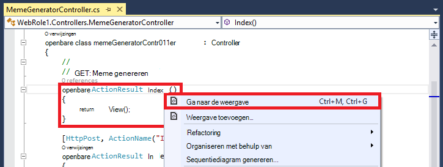

3.  Accepteer de onderstaande instellingen en klik op **toevoegen**.

    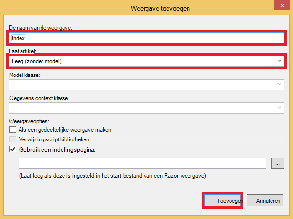

4. Open de nieuwe *Views\MemeGenerator\Index.cshtml* en de inhoud vervangen door de volgende eenvoudige HTML-code voor het indienen van de overtreffende trap:

        <h2>Meme Generator</h2>
        
        <form action="" method="post">
            <input type="text" name="top" placeholder="Enter top text here" />
            <br />
            <input type="text" name="bottom" placeholder="Enter bottom text here" />
            <br />
            <input class="btn" type="submit" value="Generate meme" />
        </form>

5. Publiceren naar de Azure web-app opnieuw en Ga naar * *http://*&lt;servicenaam >*.cloudapp.net/MemeGenerator/Index** in uw browser. 

Wanneer u de formulierwaarden te verzenden `/MemeGenerator/Index`, de `Index_Post` actie methode geeft als resultaat een koppeling naar de `Show` actie methode met de desbetreffende invoer identificatie. Als u de koppeling klikt, kunt u de volgende code bereiken:  

    [OutputCache(VaryByParam = "*", Duration = 1, Location = OutputCacheLocation.Downstream)]
    public ActionResult Show(string id)
    {
      Tuple<string, string> data = null;
      if (!Memes.TryGetValue(id, out data))
      {
        return new HttpStatusCodeResult(HttpStatusCode.NotFound);
      }

      if (Debugger.IsAttached) // Preserve the debug experience
      {
        return Redirect(string.Format("/MemeGenerator/Generate?top={0}&bottom={1}", data.Item1, data.Item2));
      }
      else // Get content from Azure CDN
      {
        return Redirect(string.Format("http://<yourCDNName>.azureedge.net/MemeGenerator/Generate?top={0}&bottom={1}", data.Item1, data.Item2));
      }
    }

Als uw lokale foutopsporing is gekoppeld, krijgt u de normale foutopsporing-ervaring met een lokale omleiding. Als deze wordt uitgevoerd in Azure WebApp, worden klikt u vervolgens deze omgeleid naar:

    http://<yourCDNName>.azureedge.net/MemeGenerator/Generate?top=<formInput>&bottom=<formInput>

Die overeenkomt met de volgende URL origin op uw CDN-eindpunt:

    http://<yourSiteName>.azurewebsites.net/cdn/MemeGenerator/Generate?top=<formInput>&bottom=<formInput>

Nadat de URL herschrijven regel eerder hebt toegepast, is het werkelijke bestand dat wordt opgeslagen in uw CDN-eindpunt:

    http://<yourSiteName>.azurewebsites.net/MemeGenerator/Generate?top=<formInput>&bottom=<formInput>

U kunt de `OutputCacheAttribute` kenmerk op de `Generate` methode kunt u opgeven hoe het resultaat van de actie moet worden opgeslagen in de cache, die aan de Azure CDN worden geaccepteerd. De onderstaande code Geef een verloopbeleid cache 1 uur (3600 seconden).

    [OutputCache(VaryByParam = "*", Duration = 3600, Location = OutputCacheLocation.Downstream)]

Daarnaast kan u dienen van inhoud van een actie controller in uw Azure web-app via uw CDN Azure, klikt u met de gewenste optie in de cache.

Klik in de volgende sectie wordt ik uitgelegd hoe u moet de gebundelde en minified scripts en CSS via Azure CDN fungeren. 

## <a name="integrate-aspnet-bundling-and-minification-with-azure-cdn"></a>ASP.NET bundeling en minification integreren met Azure CDN ##

Scripts en CSS opmaakmodellen niet vaak worden gewijzigd en voornaamste kandidaten voor de cache Azure CDN zijn. Voor de hele WebApp via uw CDN Azure is de eenvoudigste manier om bundeling en minification integreren met Azure CDN. Echter zoals u ervoor ten opzichte van deze methode voor redenen beschreven in [een eindpunt Azure CDN met uw Azure web app en serveren totdat statische inhoud in uw webpagina's van Azure CDN integreren kiezen kunt](#deploy-a-web-app-to-azure-with-an-integrated-cdn-endpoint), leest u hoe u deze behoud van de gewenste ontwikkelaars ervaring van ASP.NET bundeling en minification, zoals:

-   Uitstekende foutopsporing modus ervaring
-   Gestroomlijnde implementatie
-   Direct updates voor clients voor script/CSS versie-upgrades
-   Fallback om wanneer uw CDN-eindpunt mislukt
-   Code wijziging minimaliseren

Open in het ASP.NET-project dat u hebt gemaakt in [een eindpunt Azure CDN met uw Azure web app en serveren totdat statische inhoud in uw webpagina's van Azure CDN integreren](#deploy-a-web-app-to-azure-with-an-integrated-cdn-endpoint), *App_Start\BundleConfig.cs* en bekijk de `bundles.Add()` methode oproepen.

    public static void RegisterBundles(BundleCollection bundles)
    {
        bundles.Add(new ScriptBundle("~/bundles/jquery").Include(
                    "~/Scripts/jquery-{version}.js"));
        ...
    }

De eerste `bundles.Add()` instructie voegt u een bundel script op de virtuele map `~/bundles/jquery`. Open vervolgens *Views\Shared\_Layout.cshtml* om te zien hoe de script bundel-code wordt weergegeven. U moet kunnen de volgende regel met code Razor vindt:

    @Scripts.Render("~/bundles/jquery")

Wanneer deze Razor-code wordt uitgevoerd in Azure WebApp, worden deze goed weergegeven een `<script>` tag voor de script bundel die vergelijkbaar is met de volgende handelingen uit: 

    <script src="/bundles/jquery?v=FVs3ACwOLIVInrAl5sdzR2jrCDmVOWFbZMY6g6Q0ulE1"></script>

Echter wanneer deze wordt uitgevoerd in Visual Studio door te typen `F5`, worden deze elke script-bestand in de bundel afzonderlijk op de goed weergegeven (in het voorbeeld hierboven slechts één script-bestand is in de bundel):

    <script src="/Scripts/jquery-1.10.2.js"></script>

Hiermee kunt u fouten opsporen in de JavaScript-code in uw ontwikkelomgeving terwijl gelijktijdige clientverbindingen (bundeling) verkleinen en het verbeteren van bestand prestaties (minification) in productie downloaden. Dit is een handige functie te bewaren met Azure CDN-integratie. Aangezien de weergegeven bundel al een versietekenreeks automatisch gegenereerde bevat, wilt u bovendien die functionaliteit repliceren, zodat wanneer u uw versie jQuery tot en met NuGet bijwerkt, deze kan worden bijgewerkt op de client zo snel mogelijk.

Volg de onderstaande stappen voor integratie ASP.NET bundeling en minification met uw CDN-eindpunt.

1. Terug in *App_Start\BundleConfig.cs*, wijzigt u de `bundles.Add()` methoden voor het gebruik van een andere [bundel constructor](http://msdn.microsoft.com/library/jj646464.aspx), dat een CDN-adres. Klik hiertoe vervangen de `RegisterBundles` methodedefinitie met de volgende code:  
    
        public static void RegisterBundles(BundleCollection bundles)
        {
          bundles.UseCdn = true;
          var version = System.Reflection.Assembly.GetAssembly(typeof(Controllers.HomeController))
            .GetName().Version.ToString();
          var cdnUrl = "http://<yourCDNName>.azureedge.net/{0}?" + version;

          bundles.Add(new ScriptBundle("~/bundles/jquery", string.Format(cdnUrl, "bundles/jquery")).Include(
                "~/Scripts/jquery-{version}.js"));

          bundles.Add(new ScriptBundle("~/bundles/jqueryval", string.Format(cdnUrl, "bundles/jqueryval")).Include(
                "~/Scripts/jquery.validate*"));

          // Use the development version of Modernizr to develop with and learn from. Then, when you're
          // ready for production, use the build tool at http://modernizr.com to pick only the tests you need.
          bundles.Add(new ScriptBundle("~/bundles/modernizr", string.Format(cdnUrl, "bundles/modernizr")).Include(
                "~/Scripts/modernizr-*"));

          bundles.Add(new ScriptBundle("~/bundles/bootstrap", string.Format(cdnUrl, "bundles/bootstrap")).Include(
                "~/Scripts/bootstrap.js",
                "~/Scripts/respond.js"));

          bundles.Add(new StyleBundle("~/Content/css", string.Format(cdnUrl, "Content/css")).Include(
                "~/Content/bootstrap.css",
                "~/Content/site.css"));
        }


    Zorg ervoor dat u voor het vervangen van `<yourCDNName>` met de naam van uw CDN Azure.

    In duidelijke taal die u wilt instellen `bundles.UseCdn = true` en een zorgvuldig ontworpen CDN-URL toegevoegd aan elke bundel. Bijvoorbeeld: de eerste constructor in de code:

        new ScriptBundle("~/bundles/jquery", string.Format(cdnUrl, "bundles/jquery"))

    is hetzelfde als: 

        new ScriptBundle("~/bundles/jquery", string.Format(cdnUrl, "http://<yourCDNName>.azureedge.net/bundles/jquery?<W.X.Y.Z>"))

    Deze opbouwfunctie leest ASP.NET bundeling en minification weergave van afzonderlijke scriptbestanden wanneer foutopsporing lokaal wordt uitgevoerd, maar het opgegeven CDN-adres gebruiken voor toegang tot het script in kwestie. Bedenk wel twee belangrijke kenmerken met deze zorgvuldig ontworpen CDN-URL:
    
    - De oorsprong voor deze CDN-URL is `http://<yourSiteName>.azurewebsites.net/bundles/jquery?<W.X.Y.Z>`, namelijk daadwerkelijk de virtuele map van de bundel script in uw webtoepassing.
    - Aangezien u CDN constructor gebruikt, bevat de CDN script-code voor de bundel niet langer de automatisch gegenereerde tekenreeks in de weergegeven URL. Telkens wanneer de bundel script is aangepast als u wilt dat een gemiste cache op uw CDN Azure, moet u handmatig een versietekenreeks met unieke genereren. Tegelijkertijd, moet deze versietekenreeks unieke tot en met de levensduur van de implementatie treffers in cache op uw CDN Azure maximaliseren nadat de bundel wordt geïmplementeerd ongewijzigd blijven.

3. De queryreeks `<W.X.Y.Z>` ophaalt uit *Properties\AssemblyInfo.cs* in uw project ASP.NET. U kunt een werkstroom voor implementatie waarin de versie constructie verhoogd telkens wanneer u naar Azure publiceren hebben. Of, kunt u alleen *Properties\AssemblyInfo.cs* wijzigen in uw project voor het automatisch de versietekenreeks opgehoogd telkens wanneer u samenstelt, met het jokerteken "*". Bijvoorbeeld wijzigen `AssemblyVersion` zoals hieronder wordt weergegeven:
    
        [assembly: AssemblyVersion("1.0.0.*")]
    
    Hier werkt op een andere strategie stroomlijnen u genereert een unieke tekenreeks voor de duur van een implementatie.

3. De ASP.NET-toepassing publiceren en gebruiken van de startpagina.
 
4. Bekijk de HTML-code voor de pagina. U moet mogelijk om de CDN-URL weergegeven, met een versietekenreeks unieke telkens wanneer u wijzigingen opnieuw naar uw Azure web-app publiceren weer te geven. Bijvoorbeeld:  
    
        ...
        <link href="http://az673227.azureedge.net/Content/css?1.0.0.25449" rel="stylesheet"/>
        <script src="http://az673227.azureedge.net/bundles/modernizer?1.0.0.25449"></script>
        ...
        <script src="http://az673227.azureedge.net/bundles/jquery?1.0.0.25449"></script>
        <script src="http://az673227.azureedge.net/bundles/bootstrap?1.0.0.25449"></script>
        ...

5. Visual Studio, fouten opsporen in de ASP.NET-toepassing in Visual Studio door te typen `F5`., 

6. Bekijk de HTML-code voor de pagina. Nog steeds ziet u elk afzonderlijk weergegeven zodat u kunt een consistente foutopsporing in Visual Studio-ervaring hebben scriptbestand.  
    
        ...
        <link href="/Content/bootstrap.css" rel="stylesheet"/>
        <link href="/Content/site.css" rel="stylesheet"/>
        <script src="/Scripts/modernizr-2.6.2.js"></script>
        ...
        <script src="/Scripts/jquery-1.10.2.js"></script>
        <script src="/Scripts/bootstrap.js"></script>
        <script src="/Scripts/respond.js"></script>
        ...    

## <a name="fallback-mechanism-for-cdn-urls"></a>Fallback om CDN-URL 's ##

Wanneer uw Azure CDN-eindpunt om welke reden dan ook is mislukt, wilt u uw webpagina moeten slimme voor toegang tot uw webserver origin als de fallback optie voor het laden van JavaScript- of Bootstrap. Het is ernstige afbeeldingen op uw web-app vanwege CDN niet beschikbaar, maar veel meer slechte kwijtraken essentieel pagina functionaliteit van uw scripts en opmaakmodellen kwijtraken.

De klasse [bundel](http://msdn.microsoft.com/library/system.web.optimization.bundle.aspx) bevat een eigenschap met de naam van [CdnFallbackExpression](http://msdn.microsoft.com/library/system.web.optimization.bundle.cdnfallbackexpression.aspx) waarmee u kunt het configureren van de fallback om CDN is mislukt. Als u wilt deze eigenschap gebruikt, de volgende stappen uit te voeren:

1. Open in uw project ASP.NET *App_Start\BundleConfig.cs*, waar u de URL van een CDN in elke [bundel constructor](http://msdn.microsoft.com/library/jj646464.aspx)toegevoegd, en toevoegen `CdnFallbackExpression` code op vier plaatsen, zoals een fallback om toevoegen aan de standaard-pakketten.  
    
        public static void RegisterBundles(BundleCollection bundles)
        {
          var version = System.Reflection.Assembly.GetAssembly(typeof(BundleConfig))
            .GetName().Version.ToString();
          var cdnUrl = "http://cdnurl.azureedge.net/.../{0}?" + version;
          bundles.UseCdn = true;

          bundles.Add(new ScriptBundle("~/bundles/jquery", string.Format(cdnUrl, "bundles/jquery")) 
                { CdnFallbackExpression = "window.jquery" }
                .Include("~/Scripts/jquery-{version}.js"));

          bundles.Add(new ScriptBundle("~/bundles/jqueryval", string.Format(cdnUrl, "bundles/jqueryval")) 
                { CdnFallbackExpression = "$.validator" }
                .Include("~/Scripts/jquery.validate*"));

          // Use the development version of Modernizr to develop with and learn from. Then, when you're
          // ready for production, use the build tool at http://modernizr.com to pick only the tests you need.
          bundles.Add(new ScriptBundle("~/bundles/modernizr", string.Format(cdnUrl, "bundles/modernizer")) 
                { CdnFallbackExpression = "window.Modernizr" }
                .Include("~/Scripts/modernizr-*"));

          bundles.Add(new ScriptBundle("~/bundles/bootstrap", string.Format(cdnUrl, "bundles/bootstrap"))     
                { CdnFallbackExpression = "$.fn.modal" }
                .Include(
                        "~/Scripts/bootstrap.js",
                        "~/Scripts/respond.js"));

          bundles.Add(new StyleBundle("~/Content/css", string.Format(cdnUrl, "Content/css")).Include(
                "~/Content/bootstrap.css",
                "~/Content/site.css"));
        }

    Wanneer `CdnFallbackExpression` is niet null, script is toegevoegd in de HTML om te testen of de bundel is geladen en zo niet, de bundel rechtstreeks vanuit de webserver origin openen. Deze eigenschap moet zijn ingesteld op een JavaScript-expressie die wordt gecontroleerd of de desbetreffende CDN bundel goed is geladen. De expressie die nodig is om te testen van elke bundel is afhankelijk van de inhoud. Voor de standaard-pakketten bovenstaande:
    
    - `window.jquery`is gedefinieerd in jquery-{versie} js
    - `$.validator`is gedefinieerd in jquery.validate.js
    - `window.Modernizr`is gedefinieerd in modernizer-{versie} js
    - `$.fn.modal`is gedefinieerd in bootstrap.js
    
    U mogelijk opgevallen dat ik niet ingesteld CdnFallbackExpression voor de `~/Cointent/css` bundel. Dit is omdat er is momenteel een [fout in System.Web.Optimization](https://aspnetoptimization.codeplex.com/workitem/104) die invoegt een `<script>` tag voor de fallback CSS in plaats van de verwachte `<link>` tag.
    
    Er is echter een goede [Stijl bundel gebruik](https://github.com/EmberConsultingGroup/StyleBundleFallback) door [Ember consultingservices groep](https://github.com/EmberConsultingGroup)worden aangeboden. 

2. De tijdelijke oplossing voor CSS gebruiken, een nieuw:. cs-bestand maken in uw ASP.NET-project *App_Start* map *StyleBundleExtensions.cs*en de inhoud te vervangen door de [code uit GitHub](https://github.com/EmberConsultingGroup/StyleBundleFallback/blob/master/Website/App_Start/StyleBundleExtensions.cs). 

4. In *App_Start\StyleFundleExtensions.cs*, de naam van de naamruimte van uw ASP.NET-toepassing naamruimte (bijvoorbeeld **cdnwebapp**). 

3. Ga terug naar `App_Start\BundleConfig.cs` en vervangen van de laatste `bundles.Add` instructie met de volgende code:  

        bundles.Add(new StyleBundle("~/Content/css", string.Format(cdnUrl, "Content/css"))
          .IncludeFallback("~/Content/css", "sr-only", "width", "1px")
          .Include(
            "~/Content/bootstrap.css",
            "~/Content/site.css"));

    Deze nieuwe extensie methode gebruikt de dezelfde idee om te vanaf een script in de HTML-code om te controleren van de DOM voor de een overeenkomende klassenaam, de regelnaam van de en regel waarde die is gedefinieerd in het CSS-bundel en valt terug naar de webserver origin als het niet om de overeenkomst te vinden.

4. Publiceren naar uw Azure web-app opnieuw en toegang tot de startpagina. 
5. Bekijk de HTML-code voor de pagina. U ziet ingevoegd scripts ongeveer als volgt uit:    
    
    ```
    ...
    <link href="http://az673227.azureedge.net/Content/css?1.0.0.25474" rel="stylesheet"/>
<script>(function() {
                var loadFallback,
                    len = document.styleSheets.length;
                for (var i = 0; i < len; i++) {
                    var sheet = document.styleSheets[i];
                    if (sheet.href.indexOf('http://az673227.azureedge.net/Content/css?1.0.0.25474') !== -1) {
                        var meta = document.createElement('meta');
                        meta.className = 'sr-only';
                        document.head.appendChild(meta);
                        var value = window.getComputedStyle(meta).getPropertyValue('width');
                        document.head.removeChild(meta);
                        if (value !== '1px') {
                            document.write('<link href="/Content/css" rel="stylesheet" type="text/css" />');
                        }
                    }
                }
                return true;
            }())||document.write('<script src="/Content/css"><\/script>');</script>

    <script src="http://az673227.azureedge.net/bundles/modernizer?1.0.0.25474"></script>
    <script>(window.Modernizr)||document.write('<script src="/bundles/modernizr"><\/script>');</script>
    ... 
    <script src="http://az673227.azureedge.net/bundles/jquery?1.0.0.25474"></script>
    <script>(window.jquery)||document.write('<script src="/bundles/jquery"><\/script>');</script>

    <script src="http://az673227.azureedge.net/bundles/bootstrap?1.0.0.25474"></script>
    <script>($.fn.modal)||document.write('<script src="/bundles/bootstrap"><\/script>');</script>
    ...
    ```

    Houd er rekening mee dat ingevoegd script voor de CSS-bundel nog steeds de onjuiste overblijfsel van bevat de `CdnFallbackExpression` eigenschap in de regel:

        }())||document.write('<script src="/Content/css"><\/script>');</script>

    Maar sinds het eerste deel van de || expressie retourneert altijd true (in de regel die direct boven), kunnen de functie document.write() nooit wordt uitgevoerd.

6. Als u wilt testen of het fallback-script werkt, gaat u terug naar de uw CDN-eindpunt blade en klikt u op **stoppen**.

    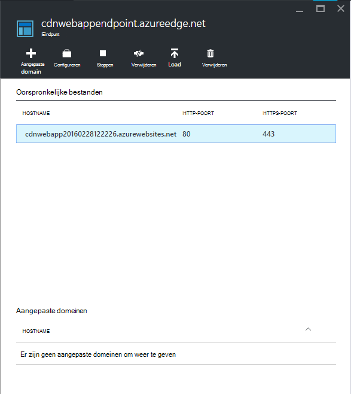

7. Vernieuw het browservenster voor de Azure WebApp. U ziet nu dat alle scripts en opmaakmodellen correct worden geladen.

## <a name="more-information"></a>Meer informatie 
- [Overzicht van het netwerk Azure Contentlevering (CDN)](../cdn/cdn-overview.md)
- [Azure CDN gebruiken](../cdn/cdn-create-new-endpoint.md)
- [Een cloudservice integreren met Azure CDN](../cdn/cdn-cloud-service-with-cdn.md)
- [ASP.NET bundeling en Minification](http://www.asp.net/mvc/tutorials/mvc-4/bundling-and-minification)

