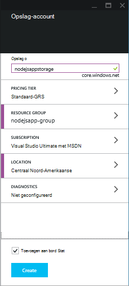
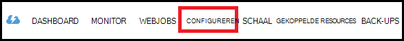
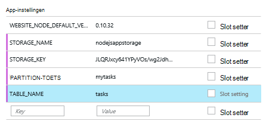

<properties
    pageTitle="Node.js WebApp met de Service van de tabel Azure"
    description="Deze zelfstudie leert u hoe u het gebruik van de tabel Azure-service voor de opslag van gegevens uit een Node.js-toepassing die wordt gehost in Azure App Service Web Apps."
    tags="azure-portal"
    services="app-service\web, storage"
    documentationCenter="nodejs"
    authors="rmcmurray"
    manager="wpickett"
    editor=""/>

<tags
    ms.service="storage"
    ms.workload="storage"
    ms.tgt_pltfrm="na"
    ms.devlang="nodejs"
    ms.topic="article"
    ms.date="08/11/2016"
    ms.author="robmcm"/>

# Node.js WebApp met de Service van de tabel Azure

## Overzicht

Deze zelfstudie ziet u hoe u de tabel service van Azure gegevensbeheer gebruiken om te slaan en toegang tot gegevens van een [knooppunt] -toepassing die wordt gehost in [Azure App Service](http://go.microsoft.com/fwlink/?LinkId=529714) Web Apps. Deze zelfstudie wordt ervan uitgegaan dat er enkele ervaring met knooppunt en [cijfer].

U leert:

* Het gebruik van npm (knooppunt pakket manager) voor het installeren van het knooppunt-modules

* Over het werken met de tabel Azure-service

* Het gebruik van de Azure CLI om een WebApp te maken.

Door deze zelfstudie te volgen, stelt u eenvoudige web gebaseerde "takenlijst"-toepassing waarmee maken, ophalen en taken uit te voeren. De taken die zijn opgeslagen in de tabel-service.

Hier ziet u de voltooide toepassing:

![Een pagina met webonderdelen met een lege tasklist][node-table-finished]

>[AZURE.NOTE] Als u aan de slag met Azure App Service wilt voordat u zich registreert voor een Azure-account, gaat u naar de [App-Service probeert](http://go.microsoft.com/fwlink/?LinkId=523751), waar u direct een tijdelijk starter in de browser in de App-Service maken kunt. Geen creditcards vereist; geen verplichtingen.

## Vereisten voor

Voordat u de instructies in dit artikel te volgen, moet u ervoor zorgen dat u het volgende geïnstalleerd hebt:

* [knooppunt] versie 0.10.24 of hoger

* [Cijfer]

[AZURE.INCLUDE [create-account-and-websites-note](../../includes/create-account-and-websites-note.md)]

## Een opslag-account maken

Maak een account Azure opslag. De app wordt dit account voor de opslag van de taakitems gebruikt.

1.  Meld u aan bij de [Portal van Azure](https://portal.azure.com/).

2. Klik op het pictogram **Nieuw** in de linkerbenedenhoek van de portal en klik op **gegevens + opslagruimte** > **opslag**. Geef een unieke naam de opslag-account en maak een nieuwe [resourcegroep](../azure-resource-manager/resource-group-overview.md) .

    

    Wanneer het opslag-account is gemaakt, de knop **meldingen** wordt een groene **SUCCESS** flash en van de opslagruimte account blade is geopend om weer te geven dat deze deel uitmaakt van de nieuwe resourcegroep die u hebt gemaakt.

5. Klik op **Instellingen**in de opslag van de account blade, > **toetsen**. De primaire toegangstoets naar het Klembord kopiëren.

    ![Toegangstoets][portal-storage-access-keys]

##Installeren modules en steigers genereren

In deze sectie wordt u een nieuwe knooppunt-toepassing maken en gebruiken van npm module pakketten toevoegen. Voor deze toepassing gebruikt u de modules [Express] en [Azure] . De module Express biedt een kader Model weergave Controller voor knooppunt, terwijl de Azure modules biedt connectiviteit met de service van de tabel.

### Express installeren en steigers genereren

1. Vanaf de opdrachtregel, maakt u een nieuwe map met de naam **tasklist** en overschakelen naar die map.  

2. Voer de volgende opdracht uit de module Express installeren.

        npm install express-generator@4.2.0 -g

    Afhankelijk van het besturingssysteem moet u mogelijk 'sudo' voordat u de opdracht plaatsen:

        sudo npm install express-generator@4.2.0 -g

    De uitvoer ziet er ongeveer als volgt uitzien:

        express-generator@4.2.0 /usr/local/lib/node_modules/express-generator
        ├── mkdirp@0.3.5
        └── commander@1.3.2 (keypress@0.1.0)

    > [AZURE.NOTE] De '-g' parameter de module globaal is geïnstalleerd. Op deze manier we kunt **express** genereren web app steigers zonder dat u moet het aanvullende padinformatie invoeren.

4. Als u wilt de steiger voor de toepassing maken, voer de **express** opdracht:

        express

    De uitvoer van deze opdracht ziet er ongeveer als volgt uitzien:

           create : .
           create : ./package.json
           create : ./app.js
           create : ./public
           create : ./public/images
           create : ./routes
           create : ./routes/index.js
           create : ./routes/users.js
           create : ./public/stylesheets
           create : ./public/stylesheets/style.css
           create : ./views
           create : ./views/index.jade
           create : ./views/layout.jade
           create : ./views/error.jade
           create : ./public/javascripts
           create : ./bin
           create : ./bin/www

           install dependencies:
             $ cd . && npm install

           run the app:
             $ DEBUG=my-application ./bin/www

    U hebt nu diverse nieuwe mappen en bestanden in de adreslijst **tasklist** .

### Aanvullende modules installeren

Een van de bestanden die **express** Hiermee maakt u **package.json**is. Dit bestand bevat een lijst met module afhankelijkheden. Later, wanneer u de toepassing op App-Service-WebApps implementeert, bepaalt dit bestand welke modules moeten worden geïnstalleerd op Azure.

Voer de volgende opdracht uit de modules beschreven in het bestand **package.json** installeren vanaf de opdrachtregel. Mogelijk moet u 'sudo' gebruiken.

    npm install

De uitvoer van deze opdracht ziet er ongeveer als volgt uitzien:

    debug@0.7.4 node_modules\debug

    cookie-parser@1.0.1 node_modules\cookie-parser
    ├── cookie-signature@1.0.3
    └── cookie@0.1.0

    [...]

Voer vervolgens de volgende opdracht voor het installeren van de [azure], [knooppunt-uuid], [nconf] en [asynchrone] modules:

    npm install azure-storage node-uuid async nconf --save

De **--Opslaan** vlag vermeldingen voor deze modules toegevoegd aan het **package.json** -bestand.

De uitvoer van deze opdracht ziet er ongeveer als volgt uitzien:

    async@0.9.0 node_modules\async

    node-uuid@1.4.1 node_modules\node-uuid

    nconf@0.6.9 node_modules\nconf
    ├── ini@1.2.1
    ├── async@0.2.9
    └── optimist@0.6.0 (wordwrap@0.0.2, minimist@0.0.10)

    [...]

## De toepassing maken

We nu om de toepassing te maken.

### Een model maken

Een *model* is een object dat de gegevens in uw toepassing vertegenwoordigt. Voor de toepassing is het model alleen een taakobject een item in de takenlijst te klikken vertegenwoordigt. Taken heeft de volgende velden:

- PartitionKey
- RowKey
- naam (tekenreeks)
- categorie (tekenreeks)
- voltooide (Booleaanse waarde)

**PartitionKey** en **RowKey** worden gebruikt door de Service van de tabel als tabelsleutels. Zie [informatie over het gegevensmodel Service tabel](https://msdn.microsoft.com/library/azure/dd179338.aspx)voor meer informatie.

1. Maak een nieuwe map met de naam **modellen**in de adreslijst **tasklist** .

2. Maak een nieuw bestand met de naam **task.js**in de adreslijst **modellen** . Dit bestand bevat het model voor de taken die door uw toepassing is gemaakt.

3. Toevoegen aan het begin van het bestand **task.js** , de volgende code om te verwijzen naar vereiste bibliotheken:

        var azure = require('azure-storage');
        var uuid = require('node-uuid');
        var entityGen = azure.TableUtilities.entityGenerator;

4. Voeg de volgende code om te definiëren en exporteren van het object taak. Dit object is verantwoordelijk voor het verbinding maken met de tabel.

        module.exports = Task;

        function Task(storageClient, tableName, partitionKey) {
          this.storageClient = storageClient;
          this.tableName = tableName;
          this.partitionKey = partitionKey;
          this.storageClient.createTableIfNotExists(tableName, function tableCreated(error) {
            if(error) {
              throw error;
            }
          });
        };

5. Voeg de volgende code om extra methoden definiëren op het object taak, waardoor interacties met de gegevens die zijn opgeslagen in de tabel:

        Task.prototype = {
          find: function(query, callback) {
            self = this;
            self.storageClient.queryEntities(this.tableName, query, null, function entitiesQueried(error, result) {
              if(error) {
                callback(error);
              } else {
                callback(null, result.entries);
              }
            });
          },

          addItem: function(item, callback) {
            self = this;
            // use entityGenerator to set types
            // NOTE: RowKey must be a string type, even though
            // it contains a GUID in this example.
            var itemDescriptor = {
              PartitionKey: entityGen.String(self.partitionKey),
              RowKey: entityGen.String(uuid()),
              name: entityGen.String(item.name),
              category: entityGen.String(item.category),
              completed: entityGen.Boolean(false)
            };
            self.storageClient.insertEntity(self.tableName, itemDescriptor, function entityInserted(error) {
              if(error){  
                callback(error);
              }
              callback(null);
            });
          },

          updateItem: function(rKey, callback) {
            self = this;
            self.storageClient.retrieveEntity(self.tableName, self.partitionKey, rKey, function entityQueried(error, entity) {
              if(error) {
                callback(error);
              }
              entity.completed._ = true;
              self.storageClient.updateEntity(self.tableName, entity, function entityUpdated(error) {
                if(error) {
                  callback(error);
                }
                callback(null);
              });
            });
          }
        }

6. Opslaan en sluit het bestand **task.js** .

### Een controller maken

Een *controller* HTTP-verzoeken verwerkt en wordt het HTML-antwoord wordt weergegeven.

1. In de map **tasklist/routes** , een nieuw bestand met de naam **tasklist.js** maken en deze in een teksteditor te openen.

2. Voeg de volgende code toe **tasklist.js**. Hiermee wordt de azure en asynchrone modules, die worden gebruikt door **tasklist.js**geladen. Hiermee definieert u ook de functie **TaskList** , die wordt doorgegeven een exemplaar van de **taak** -object die we eerder hebt gedefinieerd:

        var azure = require('azure-storage');
        var async = require('async');

        module.exports = TaskList;

3. Een object **TaskList** definiëren.

        function TaskList(task) {
          this.task = task;
        }

4. De volgende manieren toevoegen aan **TaskList**:

        TaskList.prototype = {
          showTasks: function(req, res) {
            self = this;
            var query = new azure.TableQuery()
              .where('completed eq ?', false);
            self.task.find(query, function itemsFound(error, items) {
              res.render('index',{title: 'My ToDo List ', tasks: items});
            });
          },

          addTask: function(req,res) {
            var self = this;
            var item = req.body.item;
            self.task.addItem(item, function itemAdded(error) {
              if(error) {
                throw error;
              }
              res.redirect('/');
            });
          },

          completeTask: function(req,res) {
            var self = this;
            var completedTasks = Object.keys(req.body);
            async.forEach(completedTasks, function taskIterator(completedTask, callback) {
              self.task.updateItem(completedTask, function itemsUpdated(error) {
                if(error){
                  callback(error);
                } else {
                  callback(null);
                }
              });
            }, function goHome(error){
              if(error) {
                throw error;
              } else {
               res.redirect('/');
              }
            });
          }
        }

### App.js wijzigen

1. Open het bestand **app.js** uit de adreslijst **tasklist** . Dit bestand is eerder hebt gemaakt door de **express** opdracht uit te voeren.

2. Toevoegen aan het begin van het bestand, de volgende handelingen uit als u wilt laden van de azure-module, de tabelnaam en de toets partition, instellen opslag referenties die worden gebruikt door in dit voorbeeld instellen:

        var azure = require('azure-storage');
        var nconf = require('nconf');
        nconf.env()
             .file({ file: 'config.json', search: true });
        var tableName = nconf.get("TABLE_NAME");
        var partitionKey = nconf.get("PARTITION_KEY");
        var accountName = nconf.get("STORAGE_NAME");
        var accountKey = nconf.get("STORAGE_KEY");

    > [AZURE.NOTE] nconf laadt de configuratiewaarden van omgevingsvariabelen of het bestand **config.json** , dat we later gaan maken.

3. Het bestand app.js, schuif omlaag naar waar u de volgende regel zien:

        app.use('/', routes);
        app.use('/users', users);

    De bovenstaande regels vervangen door de code die hieronder wordt weergegeven. Hiermee wordt een exemplaar van de <strong>taak</strong> met een verbinding met uw account opslag geïnitialiseerd. Hiermee wordt doorgegeven aan de <strong>TaskList</strong>, waarin gebruiken gaan om te communiceren met de service tabel:

        var TaskList = require('./routes/tasklist');
        var Task = require('./models/task');
        var task = new Task(azure.createTableService(accountName, accountKey), tableName, partitionKey);
        var taskList = new TaskList(task);

        app.get('/', taskList.showTasks.bind(taskList));
        app.post('/addtask', taskList.addTask.bind(taskList));
        app.post('/completetask', taskList.completeTask.bind(taskList));

4. Sla het bestand **app.js** .

### De weergave van de index wijzigen

1. Open het bestand **tasklist/views/index.jade** in een teksteditor.

2. Vervang de volledige inhoud van het bestand door de volgende code. Hiermee definieert u een weergave die bestaande taken worden weergegeven en bevat een formulier voor het toevoegen van nieuwe taken en bestaande ideeën als voltooid markeren.

        extends layout

        block content
          h1= title
          br

          form(action="/completetask", method="post")
            table.table.table-striped.table-bordered
              tr
                td Name
                td Category
                td Date
                td Complete
              if (typeof tasks === "undefined")
                tr
                  td
              else
                each task in tasks
                  tr
                    td #{task.name._}
                    td #{task.category._}
                    - var day   = task.Timestamp._.getDate();
                    - var month = task.Timestamp._.getMonth() + 1;
                    - var year  = task.Timestamp._.getFullYear();
                    td #{month + "/" + day + "/" + year}
                    td
                      input(type="checkbox", name="#{task.RowKey._}", value="#{!task.completed._}", checked=task.completed._)
            button.btn(type="submit") Update tasks
          hr
          form.well(action="/addtask", method="post")
            label Item Name:
            input(name="item[name]", type="textbox")
            label Item Category:
            input(name="item[category]", type="textbox")
            br
            button.btn(type="submit") Add item

3. Opslaan en sluit **index.jade** -bestand.

### De algemene indeling wijzigen

Het bestand **layout.jade** in de map **weergaven** is een algemene sjabloon, zodat andere **.jade** -bestanden. In deze stap wijzigt u, zodat het gebruiken van [Twitter-Bootstrap](https://github.com/twbs/bootstrap), namelijk een toolkit die helpt bij het ontwerpen van een nette ogende web-app.

Download en extraheren van de bestanden voor [Twitter-Bootstrap](http://getbootstrap.com/). Kopieer het bestand **bootstrap.min.css** uit de map Bootstrap **css** naar de map **openbare/opmaakmodellen** van uw toepassing.

De map **weergaven** en open **layout.jade** en de volledige inhoud vervangen door het volgende:

    doctype html
    html
      head
        title= title
        link(rel='stylesheet', href='/stylesheets/bootstrap.min.css')
        link(rel='stylesheet', href='/stylesheets/style.css')
      body.app
        nav.navbar.navbar-default
          div.navbar-header
          a.navbar-brand(href='/') My Tasks
        block content

### Een configuratiebestand maken

Als u wilt uitvoeren van de app wordt we lokaal Azure Storage referenties in een configuratiebestand plaatsen. Een bestand met de naam * *config.json* *met de volgende JSON maken:

    {
        "STORAGE_NAME": "<storage account name>",
        "STORAGE_KEY": "<storage access key>",
        "PARTITION_KEY": "mytasks",
        "TABLE_NAME": "tasks"
    }

**Opslagaccountnaam** vervangen door de naam van de opslag-account dat u eerder hebt gemaakt en **opslag toegangstoets** vervangen door de primaire toegangstoets voor uw account opslag. Bijvoorbeeld:

    {
        "STORAGE_NAME": "nodejsappstorage",
        "STORAGE_KEY": "KG0oDd..."
        "PARTITION_KEY": "mytasks",
        "TABLE_NAME": "tasks"
    }

Dit bestand *één directory niveau hoger* dan de map **tasklist** , als volgt opslaan:

    parent/
      |-- config.json
      |-- tasklist/

De reden hiervoor is om te voorkomen dat het configuratiebestand in een besturingselement voor gegevensbronnen, waar deze kan worden openbare. Als we de app naar Azure implementeren, gebruiken we omgevingsvariabelen in plaats van een configuratiebestand.

## De toepassing lokaal uitvoeren

Als u wilt testen van de toepassing op uw lokale computer, kunt u de volgende stappen uitvoeren:

1. Vanaf de opdrachtregel, door mappen te wijzigen voor de adreslijst **tasklist** .

2. Gebruik de volgende opdracht uit om de toepassing lokaal te starten:

        npm start

3. Open een webbrowser en navigeer naar http://127.0.0.1:3000.

    Een webpagina die vergelijkbaar is met het volgende voorbeeld wordt weergegeven.

    ![Een webpagina weergeven van een lege tasklist][node-table-finished]

4. U maakt een nieuwe taakitem, voer een naam en de categorie en klik op **Item toevoegen**. 

6. Als u wilt een taak als voltooid markeren, **voltooid** en klik op **Taken bijwerken**.

    ![Een afbeelding van het nieuwe item in de lijst met taken][node-table-list-items]

Hoewel de toepassing lokaal wordt uitgevoerd, is deze gegevens op te slaan in de tabel Azure-service.

## Uw Azure-toepassing implementeren

De stappen in deze sectie gebruik van de Azure opdrachtregel hulpmiddelen voor het maken van een nieuwe WebApp in App Service, en gebruik vervolgens cijfer aan uw toepassing implementeren. Als deze stappen wilt uitvoeren, moet u een Azure-abonnement hebben.

> [AZURE.NOTE] Deze stappen kunnen ook worden uitgevoerd met behulp van de [Azure-Portal](https://portal.azure.com/). Zie [bouwen en implementeren van een Node.js web-app in Azure App-Service].
>
> Als dit de eerste web-app die u hebt gemaakt, moet u de Azure-Portal gebruiken om te implementeren van deze toepassing.

Als u wilt beginnen, installeert u de [Azure CLI] invoeren van de volgende opdracht uit vanaf de opdrachtregel:

    npm install azure-cli -g

### Publicatie-instellingen importeren

In deze stap wordt u een bestand met gegevens over uw abonnement downloaden.

1. Voer de volgende opdracht uit:

        azure account download

    Deze opdracht Hiermee start u een browser en u gaat naar de downloadpagina. Als u wordt gevraagd, meld u aan met het account dat is gekoppeld aan uw Azure-abonnement.

    <!-- ![The download page][download-publishing-settings] -->

    Downloaden van het bestand begint automatisch; Als dit niet het geval is, kunt u de koppeling aan het begin van de pagina naar het bestand handmatig te downloaden. Sla het bestand en noteer het pad.

2. Voer de volgende opdracht uit de instellingen wilt importeren:

        azure account import <path-to-file>

    Geef het pad en de bestandsnaam van het gedownloade instellingenbestand publicerende in de vorige stap.

3. Nadat u de instellingen hebt geïmporteerd, moet u het bestand van de instellingen publiceren verwijderen. Het is niet meer nodig en vertrouwelijke informatie met betrekking tot uw Azure-abonnement bevat.

### Een App Service web-app maken

1. Vanaf de opdrachtregel, door mappen te wijzigen voor de adreslijst **tasklist** .

2. Gebruik de volgende opdracht uit om een nieuwe WebApp te maken.

        azure site create --git

    U wordt gevraagd voor het web app-naam en locatie. Geef een unieke naam en selecteert u dezelfde geografische locatie als uw opslagruimte van Azure-account.

    De `--git` parameter een cijfer opslagplaats op Azure voor deze WebApp maakt. Wordt een cijfer opslagplaats in de huidige map ook geïnitialiseerd als geen bestaat en voegt een [cijfer remote] met de naam 'azure', die wordt gebruikt voor het publiceren van de toepassing op Azure. Tot slot dat wordt gemaakt met een **web.config** -bestand dat wordt gebruikt door Azure voor host knooppunt toepassingen instellingen bevat. Als u weglaat de `--git` parameter maar de map bevat een cijfer-bibliotheek, de opdracht nog steeds maakt de 'azure' externe.

    Wanneer deze opdracht is voltooid, ziet u de volgende strekking uitvoer. Houd er rekening mee dat de regel te beginnen bij de **Website hebt gemaakt op** de URL voor de web-app bevat.

        info:   Executing command site create
        help:   Need a site name
        Name: TableTasklist
        info:   Using location southcentraluswebspace
        info:   Executing `git init`
        info:   Creating default .gitignore file
        info:   Creating a new web site
        info:   Created web site at  tabletasklist.azurewebsites.net
        info:   Initializing repository
        info:   Repository initialized
        info:   Executing `git remote add azure https://username@tabletasklist.azurewebsites.net/TableTasklist.git`
        info:   site create command OK

    > [AZURE.NOTE] Als dit de eerste App Service web-app voor uw abonnement, wordt u gevraagd het gebruik van de Azure-Portal om de WebApp te maken. Zie [bouwen en implementeren van een Node.js web-app in Azure App-Service]voor meer informatie.

### Set-omgevingsvariabelen

In deze stap voegt u omgevingsvariabelen de configuratie van uw web-app op Azure.
Vanaf de opdrachtregel, voer het volgende:

    azure site appsetting add
        STORAGE_NAME=<storage account name>;STORAGE_KEY=<storage access key>;PARTITION_KEY=mytasks;TABLE_NAME=tasks

Vervang **<storage account name>** account u eerder hebt gemaakt met de naam van de opslag en vervang **<storage access key>** met de primaire toegangstoets voor uw account opslag. (Gebruik dezelfde waarden als het config.json-bestand dat u eerder hebt gemaakt.)

U kunt ook omgevingsvariabelen in de [Portal van Azure](https://portal.azure.com/)instellen:

1.  Open de web-app blade door te klikken op **Bladeren** > **Web Apps** > de naam van uw web-app.

1.  Klik op **Alle instellingen**in uw web-app blade, > **Toepassingsinstellingen**.

    <!--  -->

1.  Schuif omlaag naar de sectie **instellingen van de App** en de toets/waardeparen toevoegen.

    

1. Klik op **Opslaan**.

### Publiceer de toepassing

Als u wilt publiceren de app, de codebestanden cijfer vastleggen en vervolgens push in azure/outmodel.

1. Uw implementatie-referenties instellen.

        azure site deployment user set <name> <password>

2. Toevoegen en uw toepassingsbestanden doorvoeren.

        git add .
        git commit -m "adding files"

3. De gegevens zijn doorgevoerd push bij de App Service web-app:

        git push azure master

    **Basispagina** als de doel-tak gebruiken. Aan het einde van de implementatie ziet u een instructie die vergelijkbaar is met het volgende voorbeeld:

        To https://username@tabletasklist.azurewebsites.net/TableTasklist.git
         * [new branch]      master -> master

4. Wanneer de push-bewerking is voltooid, blader naar de URL van de web-app eerder geretourneerd door de `azure create site` opdracht aan uw toepassing weergeven.

## Volgende stappen

Terwijl de stappen in dit artikel wordt beschreven met de tabel-Service gegevens wilt opslaan, kunt u ook [MongoDB](https://mlab.com/azure/)gebruiken. 

## Aanvullende informatie

[Azure CLI]

## Wat er gewijzigd
* Zie voor een handleiding voor het wijzigen van Websites naar App Service: [Azure App-Service en de invloed op bestaande Azure-Services](http://go.microsoft.com/fwlink/?LinkId=529714)

<!-- URLs -->

[Bouwen en implementeren van een Node.js web-app in Azure App-Service]: web-sites-nodejs-develop-deploy-mac.md
[Azure Developer Center]: /develop/nodejs/

[knooppunt]: http://nodejs.org
[Cijfer]: http://git-scm.com
[Express]: http://expressjs.com
[for free]: http://windowsazure.com
[Externe cijfer]: http://git-scm.com/docs/git-remote

[Azure CLI]: ../xplat-cli-install.md

[Azure]: https://github.com/Azure/azure-sdk-for-node
[knooppunt-uuid]: https://www.npmjs.com/package/node-uuid
[nconf]: https://www.npmjs.com/package/nconf
[asynchrone]: https://www.npmjs.com/package/async

[Azure Portal]: https://portal.azure.com

[Create and deploy a Node.js application to an Azure Web Site]: web-sites-nodejs-develop-deploy-mac.md
 
<!-- Image References -->

[node-table-finished]: ./media/storage-nodejs-use-table-storage-web-site/table_todo_empty.png
[node-table-list-items]: ./media/storage-nodejs-use-table-storage-web-site/table_todo_list.png
[download-publishing-settings]: ./media/storage-nodejs-use-table-storage-web-site/azure-account-download-cli.png
[portal-new]: ./media/storage-nodejs-use-table-storage-web-site/plus-new.png
[portal-storage-account]: ./media/storage-nodejs-use-table-storage-web-site/new-storage.png
[portal-quick-create-storage]: ./media/storage-nodejs-use-table-storage-web-site/quick-storage.png
[portal-storage-access-keys]: ./media/storage-nodejs-use-table-storage-web-site/manage-access-keys.png
[go-to-dashboard]: ./media/storage-nodejs-use-table-storage-web-site/go_to_dashboard.png
[web-configure]: ./media/storage-nodejs-use-table-storage-web-site/sql-task-configure.png
[app-settings-save]: ./media/storage-nodejs-use-table-storage-web-site/savebutton.png
[app-settings]: ./media/storage-nodejs-use-table-storage-web-site/storage-tasks-appsettings.png
