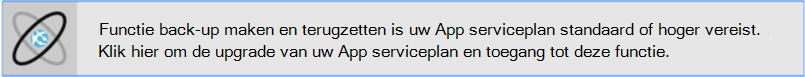
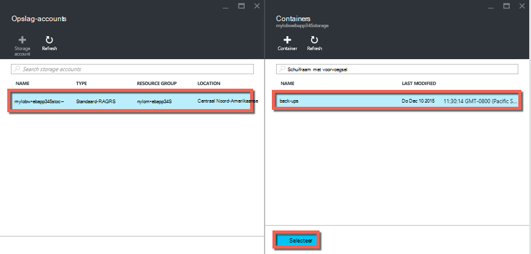
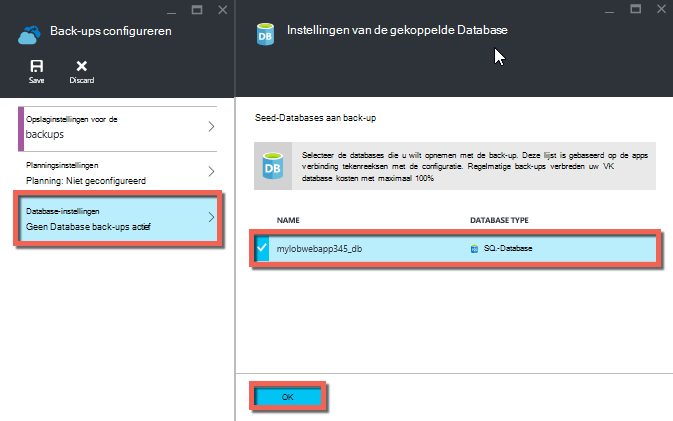
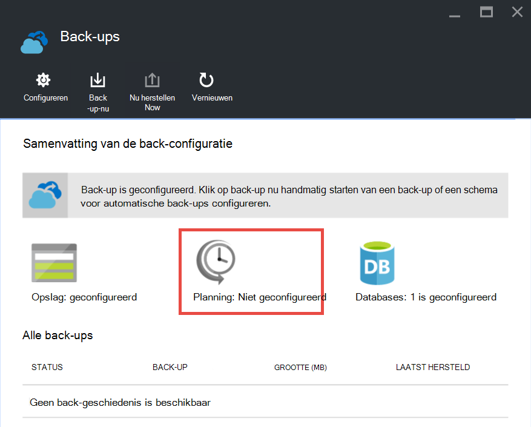

<properties 
    pageTitle="Back-up van uw app in Azure wordt aangegeven" 
    description="Informatie over het maken van back-ups van uw apps in Azure App-Service." 
    services="app-service" 
    documentationCenter="" 
    authors="cephalin" 
    manager="wpickett" 
    editor="jimbe"/>

<tags 
    ms.service="app-service" 
    ms.workload="na" 
    ms.tgt_pltfrm="na" 
    ms.devlang="na" 
    ms.topic="article" 
    ms.date="07/06/2016" 
    ms.author="cephalin"/>

# Back-up van uw app in Azure wordt aangegeven

De functie back-up en herstellen in [Azure-Service voor App](../app-service/app-service-value-prop-what-is.md) kunt u eenvoudig app back-ups maken handmatig of automatisch. U kunt uw app herstellen naar een vorige status of maak een nieuwe app op basis van een van de back-ups van uw oorspronkelijke app. 

Zie [herstellen van een app in Azure wordt aangegeven](web-sites-restore.md)voor informatie over het herstellen van een app uit back-up.

## Waarvan een back-wordt gemaakt 
App-Service kan back-up van de volgende informatie:

* App-configuratie
* De inhoud van bestand
* Een Azure SQL-Databases of Azure MySQL (ClearDB)-databases die zijn verbonden met uw app (u kunt kiezen welke u wilt opnemen in de back-up)

Deze informatie is back-up gemaakt voor de opslag van Azure-account en de container die u opgeeft. 

> [AZURE.NOTE] Elke back-up is een volledige offlinekopie van de app, niet een incrementele update.

## Vereisten en beperkingen

* De functie back-up maken en terugzetten is het App-abonnement in de **standaard** laag of hoger vereist. Voor meer informatie over de schaalbaarheid van uw App serviceplan naar een hoger niveau gebruiken: Zie Help [schaal van een app in Azure wordt aangegeven](web-sites-scale.md). Houd er rekening mee dat **Premium** laag een groter aantal dagelijkse back-ups dan **standaard** laag is toegestaan.
* U moet een Azure opslag-account en de container in hetzelfde abonnement als de app die u een back wilt-up. Zie de [koppelingen](#moreaboutstorage) aan het einde van dit artikel voor meer informatie over Azure opslag accounts.
* Back-ups mag maximaal 10GB app en database-inhoud. U krijgt een fout als de back-up groter is dan deze limiet. 

## Een handmatige back-up maken

2. Klik in de [Portal van Azure](https://portal.azure.com)Ga naar van uw app blade, selecteer **Instellingen**en daarna **back-ups**. Het blad **back-ups** worden, weergegeven.
    
    ![Back-ups van pagina][ChooseBackupsPage]

    >[AZURE.NOTE]Als u het volgende bericht wordt weergegeven, klikt u erop upgraden van uw App serviceplan voordat u met back-ups verdergaat.
Zie de [schaal van een app in Azure wordt aangegeven](web-sites-scale.md) voor meer informatie.  
    >

3. Klik in het blad **back-ups** op **opslag: niet geconfigureerd** een opslag-account configureren.

    ![Kies opslag-account][ChooseStorageAccount]
    
4. Kies de bestemming van de back-up door een **Opslag-Account** en de **Container**te selecteren. Het account opslag moet behoren tot hetzelfde abonnement als de app die u een back wilt-up. Als u wilt, kunt u een nieuwe opslag-account of een nieuwe container maken in de desbetreffende bladen. Wanneer u klaar bent, klikt u op **selecteren**.
    
    
    
5. Klik op **Database-instellingen**in het blad **Back-up-instellingen configureren** die nog steeds geopend blijft, selecteer de databases die u wilt opnemen in de back-ups (SQL-database of MySQL) en klik op **OK**.  

    

    > [AZURE.NOTE]  Voor een database in deze lijst wilt weergeven, moet de verbindingsreeks in het gedeelte **tekenreeksen met de verbinding** van het blad **Toepassingsinstellingen** voor uw app bestaan.

6. Klik in het blad **Back-up-instellingen configureren** op **Opslaan**.  

7. In de opdrachtenbalk van het blad **back-ups** , klikt u op **Nu back-up**.
    
    ![Knop BackUpNow][BackUpNow]
    
    U ziet een voortgangsbericht tijdens het back.

Nadat u een opslag-account en de container back-ups hebt geconfigureerd, kunt u een handmatige back-up maken op elk gewenst moment.  

## Automatische back-ups configureren

1. Klik in het blad **back-ups** op **planning: niet geconfigureerd**. 

    
    
1. Klik op het blad **Instellingen van de back-ups plannen** **Back-gepland** ingesteld op **op**, en vervolgens de back-planning configureren desgewenst en op **OK**.
    
    ![Automatische back-ups inschakelen][SetAutomatedBackupOn]
    
4. In het blad **Back-instellingen configureren** dat er nog steeds nog geopend, klikt u op **Instellingen voor opslagruimte**en kies vervolgens de bestemming van de back-up door een **Opslag-Account** en de **Container**te selecteren. Het account opslag moet behoren tot hetzelfde abonnement als de app die u een back wilt-up. Als u wilt, kunt u een nieuwe opslag-account of een nieuwe container maken in de desbetreffende bladen. Wanneer u klaar bent, klikt u op **selecteren**.
    
    
    
5. Klik op **Database-instellingen**in het blad **Back-up-instellingen configureren** , selecteer de databases die u wilt opnemen in de back-ups (SQL-database of MySQL) en klik op **OK**.  

    

    > [AZURE.NOTE]  Voor een database in deze lijst wilt weergeven, moet de verbindingsreeks in het gedeelte **tekenreeksen met de verbinding** van het blad **Toepassingsinstellingen** voor uw app bestaan.

6. Klik in het blad **Back-up-instellingen configureren** op **Opslaan**.  

## Back-up slechts een deel van uw app

Soms wilt u niet alle items op uw app back-up te maken. Hier volgen enkele voorbeelden:

-   U [set wekelijkse back-ups](web-sites-backup.md#configure-automated-backups) van uw app met statische inhoud die nooit, zoals oude blogberichten of afbeeldingen verandert.
-   Uw app heeft meer dan 10GB van inhoud (dit is de maximale hoeveelheid die kunt u een back-up per keer).
-   U wilt niet dat back-up van de logboekbestanden.

Gedeeltelijke back-ups kunt u precies welke bestanden die u een back wilt-up.

### Bestanden uitsluiten van de back-up

Als u wilt uitsluiten van bestanden en mappen van uw back-ups, maak een `_backup.filter` bestand in de map D:\home\site\wwwroot van de app en geef de lijst met bestanden en mappen die u wilt uitsluiten in daar. Een eenvoudige manier toegang krijgt tot deze is via de [Kudu Console](https://github.com/projectkudu/kudu/wiki/Kudu-console). 

Stel dat u hebt een app waarin de logbestanden en statische afbeeldingen van afgelopen jaar die nooit wilt wijzigen. U hebt al een volledige back-up van de app met de oude afbeeldingen. Nu u back-up maken de app elke dag wilt, maar u niet wilt betalen voor het opslaan van logboekbestanden of de statische afbeelding-bestanden die nooit wijzigen.

![De map met Logboeken][LogsFolder]
![map afbeeldingen][ImagesFolder]
    
De onderstaande stappen te volgen weergeven hoe u deze bestanden uit de back-up wilt uitsluiten.

1. Ga naar `http://{yourapp}.scm.azurewebsites.net/DebugConsole` en de mappen die u wilt uitsluiten van uw back-ups identificeren. In dit voorbeeld zou u wilt uitsluiten van de volgende bestanden en mappen die worden weergegeven in de gebruikersinterface van die:

        D:\home\site\wwwroot\Logs
        D:\home\LogFiles
        D:\home\site\wwwroot\Images\2013
        D:\home\site\wwwroot\Images\2014
        D:\home\site\wwwroot\Images\brand.png

    [AZURE.NOTE] De laatste regel ziet u dat kunt u personen bestanden, evenals de mappen uitsluiten.

2. Maken van een bestand met de naam `_backup.filter` en de bovenstaande lijst in het bestand hebt opgeslagen, maar verwijderen `D:\home`. Lijst met een map of bestand per regel. Zodat de inhoud van het bestand moet zijn:

    \site\wwwroot\Logs \LogFiles \site\wwwroot\Images\2013 \site\wwwroot\Images\2014 \site\wwwroot\Images\brand.PNG

3. In dit bestand om te uploaden de `D:\home\site\wwwroot\` map van uw site via [ftp](web-sites-deploy.md#ftp) of een andere methode selecteert. Als u wilt, kunt u het bestand rechtstreeks in `http://{yourapp}.scm.azurewebsites.net/DebugConsole` en de inhoud er in te voegen.

4. Back-ups van de normaal gesproken doet u dit, [handmatig](#create-a-manual-backup) of [automatisch](#configure-automated-backups)op dezelfde manier uitgevoerd.

Nu, bestanden en mappen die zijn opgegeven in `_backup.filter` de back-up wordt uitgesloten. In dit voorbeeld de logbestanden en de afbeeldingsbestanden 2013 en 2014 wordt niet meer worden back-up gemaakt, evenals brand.png.

>[AZURE.NOTE] U gedeeltelijke back-ups van uw site op dezelfde manier u zou doen met het [herstellen van een normale back-up](web-sites-restore.md)herstellen. Het herstelproces wordt doen.
>
>Wanneer u een volledige back-up is hersteld, worden alle inhoud op de site wordt vervangen door alle gegevens die zich in de back-up. Als een bestand op de site, maar niet in de back-up is wordt deze verwijderd. Maar wanneer een gedeeltelijke back-up is hersteld, alle inhoud die in een van de zwarte lijst mappen of een zwarte lijst bestand bevindt zich is ongewijzigd.

## Hoe back-ups worden opgeslagen

Nadat u een of meer back-ups hebt gemaakt voor de app, zijn de back-ups op het blad **Containers** van uw account opslag, evenals uw app zichtbaar. In het account opslag bestaat elke back-up van een ZIP-bestand dat de back-gegevens bevat en een XML-bestand met een overzicht van de inhoud van het ZIP-bestand. U kunt pak en bladert u deze bestanden als u de toegang tot uw back-ups zonder dat is wel het terugzetten van een app wilt wijzigen.

De database back-up voor de app wordt opgeslagen in de hoofdmap van het ZIP-bestand. Voor een SQL-database is een Bacpac-bestand (zonder extensie) en kan worden geïmporteerd. Als u wilt een nieuwe SQL-database op basis van de export Bacpac-maken, raadpleegt u [Bacpac-bestand maken van een nieuwe gebruiker-Database importeren](http://technet.microsoft.com/library/hh710052.aspx).

> [AZURE.WARNING] Wijzigen of de bestanden in de container **websitebackups** kan leiden tot de back-up ongeldige en kunnen daarom niet-te herstellen.

## Volgende stappen
Zie [een app in Azure herstellen](web-sites-restore.md)voor informatie over het herstellen van een app uit een back-up. U kunt ook back-up maken en terugzetten App Service-apps met REST API (Zie [Gebruik REST aan een back-up en herstellen van App Service apps](websites-csm-backup.md)).

>[AZURE.NOTE] Als u aan de slag met Azure App Service wilt voordat u zich registreert voor een Azure-account, gaat u naar de [App-Service probeert](http://go.microsoft.com/fwlink/?LinkId=523751), waar u direct een tijdelijk starter in de browser in de App-Service maken kunt. Geen creditcards vereist; geen verplichtingen.

<!-- IMAGES -->
[ChooseBackupsPage]: ./media/web-sites-backup/01ChooseBackupsPage.png
[ChooseStorageAccount]: ./media/web-sites-backup/02ChooseStorageAccount.png
[IncludedDatabases]: ./media/web-sites-backup/03IncludedDatabases.png
[BackUpNow]: ./media/web-sites-backup/04BackUpNow.png
[BackupProgress]: ./media/web-sites-backup/05BackupProgress.png
[SetAutomatedBackupOn]: ./media/web-sites-backup/06SetAutomatedBackupOn.png
[Frequency]: ./media/web-sites-backup/07Frequency.png
[StartDate]: ./media/web-sites-backup/08StartDate.png
[StartTime]: ./media/web-sites-backup/09StartTime.png
[SaveIcon]: ./media/web-sites-backup/10SaveIcon.png
[ImagesFolder]: ./media/web-sites-backup/11Images.png
[LogsFolder]: ./media/web-sites-backup/12Logs.png
[GhostUpgradeWarning]: ./media/web-sites-backup/13GhostUpgradeWarning.png
 
