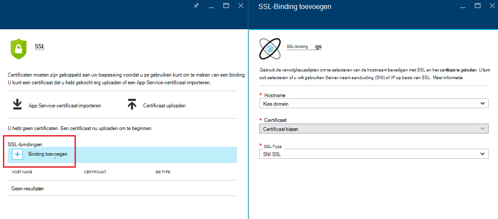
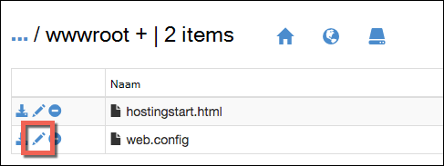

<properties
    pageTitle="Aangepaste domein van uw app met HTTPS Secure | Microsoft Azure"
    description="Leer hoe veilig de aangepaste domeinnaam voor de app in Azure App Service door een binding SSL-certificaat configureren. Ook leert u hoe u een SSL-certificaat uit meerdere hulpprogramma's."
    services="app-service"
    documentationCenter=".net"
    authors="cephalin"
    manager="wpickett"
    editor="jimbe"
    tags="top-support-issue"/>

<tags
    ms.service="app-service"
    ms.workload="na"
    ms.tgt_pltfrm="na"
    ms.devlang="na"
    ms.topic="article"
    ms.date="08/08/2016"
    ms.author="cephalin"/>

# Beveiligen van uw app aangepast domein met HTTPS

> [AZURE.SELECTOR]
- [SSL-certificaat in Azure kopen](web-sites-purchase-ssl-web-site.md)
- [SSL-certificaat gebruiken vanaf een andere plaats](web-sites-configure-ssl-certificate.md)

Dit artikel leest u hoe u HTTPS inschakelen voor een web-app, een mobiele app backend of een API-app in [Azure App Service](../app-service/app-service-value-prop-what-is.md) waarvoor een aangepaste domeinnaam wordt gebruikt. Deze server-only-verificatie, bedekt. Als u nodig hebt onderlinge verificatie (inclusief clientverificatie), Zie [Hoe naar configureren TLS onderlinge verificatie voor App-Service](app-service-web-configure-tls-mutual-auth.md).

Als u wilt beveiligen met HTTPS een app met een aangepaste domeinnaam, moet u een certificaat voor die domeinnaam toevoegen. Standaard Azure beveiligt de ** \*. azurewebsites.net** jokertekendomein met een enkel SSL-certificaat, zodat uw klanten al toegang hebt tot uw app bij * *https://*&lt;toepassingsnaam >*. azurewebsites.net**. Maar als u een aangepast domein gebruiken wilt, zoals **contoso.com**, **www.contoso.com**, en ** \*. contoso.com**, die u het standaardcertificaat niet beveiligen die. Bovendien zoals alle [jokertekens certificaten](https://casecurity.org/2014/02/26/pros-and-cons-of-single-domain-multi-domain-and-wildcard-certificates/)is het standaardcertificaat niet zo veilig als een aangepast domein en een certificaat voor het aangepaste domein.   

>[AZURE.NOTE] U kunt hulp krijgen van Azure experts op elk gewenst moment op de [forums Azure](https://azure.microsoft.com/support/forums/). Voor meer persoonlijke ondersteuning, Ga naar het [Azure-ondersteuning](https://azure.microsoft.com/support/options/) en klikt u op **Ondersteuning krijgen**.

## Wat u nodig hebt
Als u wilt beveiligen van uw aangepaste domeinnaam met HTTPS, kunt u een aangepaste SSL-certificaat koppelt aan dat aangepaste domein in Azure wordt aangegeven. Voordat u een aangepaste certificaat binden en moet u als volgt te werk:

- **Het aangepaste domein configureren** - App Service kunt u alleen een certificaat voor een domeinnaam die al geconfigureerd in uw app toe te voegen. Zie het [toewijzen van een aangepaste domeinnaam aan een Azure-app](web-sites-custom-domain-name.md)voor instructies. 
- **Vergroten naar eenvoudige laag of hoger** App-Service-abonnementen in lagere niveaus van de prijzen ondersteuning geen voor aangepaste SSL-certificaten. Zie de [schaal van een app in Azure wordt aangegeven](web-sites-scale.md)voor instructies. 
- **Een SSL-certificaat ophalen** - als u nog een, moet u er een of meer van een vertrouwde [certificeringsinstantie](http://en.wikipedia.org/wiki/Certificate_authority) (CA). Het certificaat moet voldoen aan de volgende vereisten:

    - Dit is ondertekend door een vertrouwde Certificeringsinstantie (geen privé CA-servers).
    - De presentatie bevat een persoonlijke sleutel.
    - Het is gemaakt voor belangrijke exchange en geëxporteerd naar een. PFX-bestand.
    - Een minimum van 2048-bits versleuteling wordt gebruikt.
    - De onderwerpnaam komt overeen met het aangepaste domein dat deze nodig hebt om te beveiligen. Als u wilt beveiligen meerdere domeinen met één certificaat, moet u de jokertekennaam van een gebruiken (bijvoorbeeld ** \*. contoso.com**) of geef de subjectAltName waarden.
    - Dit is samengevoegd met alle **[tussenliggende certificaten](http://en.wikipedia.org/wiki/Intermediate_certificate_authorities)** die worden gebruikt door uw Certificeringsinstantie. U mogelijk anders irreproducible interoperabiliteitsproblemen ondervindt op bij sommige clients.

        >[AZURE.NOTE] De eenvoudigste manier om een SSL-certificaat dat voldoet aan alle vereisten is         [een in de Azure portal rechtstreeks](web-sites-purchase-ssl-web-site.md)kopen. In dit artikel leest u hoe u dit handmatig doen en vervolgens te binden aan uw aangepaste domein in de App-Service.
        >   
        > **Elliptic Curve cryptografische (ECC) certificaten** kunt werken met App-Service, maar buiten het bereik van dit artikel. Werken met uw CA op de exacte procedure voor het maken van ECC certificaten.

## Stap 1. Een SSL-certificaat ophalen

Omdat de verschillende typen van SSL-certificaat op verschillende prijzen punten verstrekt, moet u eerst bepalen welk type SSL-certificaat te kopen. Als u wilt beveiligen een één domeinnaam (**www.contoso.com**), hoeft u slechts een eenvoudige certificaat. Beveiligen van meerdere domeinnamen (**contoso.com** *en* **www.contoso.com** 
*en* **mail.contoso.com**), moet u een [jokerteken certificaat](http://en.wikipedia.org/wiki/Wildcard_certificate) of een certificaat met [Alternatieve onderwerpnaam](http://en.wikipedia.org/wiki/SubjectAltName) (`subjectAltName`).

Zodra u welke SSL-certificaat weet te kopen, kunt u een certificaat ondertekening aanvragen (CSR) bij een Certificeringsinstantie indienen. Wanneer u aangevraagde certificaat van de Certificeringsinstantie terugkeren, genereert u vervolgens een .pfx-bestand van het certificaat. U kunt de volgende stappen uit met de functie van uw keuze uitvoeren. Hier volgen de instructies voor de algemene hulpprogramma's:

- [Certreq.exe stappen](#bkmk_certreq) - het Windows-hulpprogramma voor het maken van certificaataanvragen. Dit is deel uit van Windows sinds in Windows XP of Windows Server 2000.
- [IIS-beheer stappen](#bkmk_iismgr) - het hulpmiddel van keuze als u al bekend met deze bent.
- [OpenSSL stappen](#bkmk_openssl) - een [open source, platforms hulpmiddel](https://www.openssl.org). Met deze kunt u een SSL-certificaat ophalen uit een willekeurig platform.
- [subjectAltName stappen met OpenSSL](#bkmk_subjectaltname) - stappen voor het verkrijgen van `subjectAltName` certificaten.

Als u de instellingen in de App Service testen wilt voordat u een certificaat koopt, kunt u een [zelfondertekend certificaat](https://en.wikipedia.org/wiki/Self-signed_certificate)genereren. Deze zelfstudie kunt u twee manieren om te laten genereren:

- [Zelfondertekend certificaat, Certreq.exe stappen](#bkmk_sscertreq)
- [Zelfondertekend certificaat, OpenSSL stappen](#bkmk_ssopenssl)

### Een certificaat dat met Certreq.exe worden

1. Maak een bestand (bijvoorbeeld **myrequest.txt**), en kopieer hierin de volgende tekst en opslaan in een werkmap. Vervang de `<your-domain>` tijdelijke aanduiding met de naam van het aangepaste domein van uw app.

        [NewRequest]
        Subject = "CN=<your-domain>"  ; E.g. "CN=www.contoso.com", or "CN=*.contoso.com" for a wildcard certificate
        Exportable = TRUE
        KeyLength = 2048              ; Required minimum is 2048
        KeySpec = 1
        KeyUsage = 0xA0
        MachineKeySet = True
        ProviderName = "Microsoft RSA SChannel Cryptographic Provider"
        ProviderType = 12
        HashAlgorithm = SHA256

        [EnhancedKeyUsageExtension]
        OID=1.3.6.1.5.5.7.3.1         ; Server Authentication

    Zie de [documentatie van Certreq reference](https://technet.microsoft.com/library/dn296456.aspx)voor meer informatie over de opties in de CSR en andere beschikbare opties.

4. In een opdrachtprompt `CD` in uw werkmap en de volgende opdracht om te maken van de CSR uitvoeren:

        certreq -new myrequest.txt myrequest.csr

    **myrequest.CSR** is nu gemaakt in uw huidige werkmap.

5. Verzenden **myrequest.csr** bij een Certificeringsinstantie ophalen van een SSL-certificaat. U het bestand uploaden, of de inhoud van een teksteditor kopiëren naar een webformulier.

    Zie voor een lijst met certificeringsinstanties vertrouwd door Microsoft, [Microsoft vertrouwde Basiscertificaatprogramma: deelnemers][cas].

6. Zodra de Certificeringsinstantie naar u heeft gereageerd met een certificaat (. CER)-bestand, opslaan in uw werkmap. Voer de volgende opdracht uit om te voltooien van de in behandeling CSR.

        certreq -accept -user <certificate-name>.cer

    Deze opdracht slaat de klaar certificaat in de Windows-certificaat store.

6. Als uw CA tussenliggende certificaten gebruikt, installeert u deze voordat u verdergaat. Ze meestal zich voordoen als een afzonderlijke download van uw Certificeringsinstantie en in verschillende notaties voor de verschillende web servertypen. Selecteer de versie voor Microsoft IIS.

    Wanneer u de certificaten hebt gedownload, met de rechtermuisknop op elk van deze in Windows Verkenner en selecteer  **certificaat installeren**. Gebruik van de standaardwaarden in de **Wizard Certificaat importeren**en doorgaan met het **volgende** selecteren tot het importeren is voltooid.

7. Als u wilt uw SSL-certificaat exporteren vanuit de certificaat-store, drukt u op `Win` + `R` en **certmgr.msc** om te starten certificaatbeheer uitvoeren. Selecteer **persoonlijke** > **certificaten**. Klik in de kolom **Uitgegeven aan** ziet u met uw aangepaste domeinnaam en de Certificeringsinstantie die u gebruikt voor het genereren van het certificaat in de kolom **Uitgegeven door** een vermelding.

    ![afbeelding van Certificaatbeheer hier invoegen][certmgr]

9. Met de rechtermuisknop op het certificaat en selecteer **Alle taken** > **exporteren**. In de **Wizard Certificaat exporteren**, klik op **volgende**en selecteer **Ja, de persoonlijke sleutel exporteren**en klik vervolgens nogmaals op **volgende** .

    ![De persoonlijke sleutel exporteren][certwiz1]

10. Selecteer **Personal Information Exchange - PKCS #12**, **alle certificaten opnemen in het certificaatpad indien mogelijk**en **alle uitgebreide eigenschappen exporteren**. Klik vervolgens op **volgende**.

    ![alle certificaten en uitgebreide eigenschappen][certwiz2]

11. Selecteer **wachtwoord**, en voer vervolgens en Bevestig het wachtwoord. Klik op **volgende**.

    ![een wachtwoord opgeven][certwiz3]

12. Een pad en de bestandsnaam opgeven voor het geëxporteerde certificaat, klikt u met de extensie **.pfx**. Klik op **volgende** om te voltooien.

    ![Geef een bestandspad][certwiz4]

U bent nu klaar om te het geëxporteerde PFX-bestand uploaden naar de App-Service. Zie [stap 2. Uploaden en afhankelijk van het aangepaste SSL-certificaat](#bkmk_configuressl).

### Een certificaat dat met de IIS-beheer worden

1. Genereer een CSR met IIS-beheer om naar de Certificeringsinstantie te verzenden. Zie voor meer informatie over het genereren van een CSR, [aanvragen van een Internet-Server-certificaat (IIS 7)][iiscsr].

3. Dien uw CSR bij een Certificeringsinstantie ophalen van een SSL-certificaat. Zie voor een lijst met vertrouwde door Microsoft CAs, [Microsoft vertrouwde Basiscertificaatprogramma: deelnemers][cas].

3. Voltooi de CSR met het certificaat waarmee de Certificeringsinstantie terug naar u worden verzonden. Zie [een Internet-Server-certificaat (IIS 7) installeren]voor meer informatie over het voltooien van de CSR,[installcertiis].

4. Als uw CA tussenliggende certificaten gebruikt, installeert u deze voordat u verdergaat. Ze meestal zich voordoen als een afzonderlijke download van uw Certificeringsinstantie en in verschillende notaties voor de verschillende web servertypen. Selecteer de versie voor Microsoft IIS.

    Wanneer u de certificaten hebt gedownload, met de rechtermuisknop op elk van deze in Windows Verkenner en selecteer **certificaat installeren**. 
    Gebruik van de standaardwaarden in de **Wizard Certificaat importeren**en doorgaan met het **volgende** selecteren tot het importeren is voltooid.

4. Exporteer het SSL-certificaat via IIS-beheer. Zie voor meer informatie over het exporteren van het certificaat [exporteren van een Server-certificaat (IIS 7)][exportcertiis]. 

    >[AZURE.IMPORTANT] Klik in de **Wizard Certificaat exporteren**Zorg ervoor dat u **Ja, de persoonlijke sleutel exporteren selecteert**  
    >
    >![De persoonlijke sleutel exporteren][certwiz1]  
    >
    > en ook selecteren **Personal Information Exchange - PKCS #12**, **alle certificaten opnemen in het certificaatpad indien mogelijk**en     **alle uitgebreide eigenschappen exporteren**.
    >
    >![alle certificaten en uitgebreide eigenschappen][certwiz2]

U bent nu klaar om te het geëxporteerde PFX-bestand uploaden naar de App-Service. Zie [stap 2. Uploaden en afhankelijk van het aangepaste SSL-certificaat](#bkmk_configuressl).

### Een certificaat dat met OpenSSL worden

1. In een opdrachtregel terminal `CD` genereren in een werkmap een persoonlijke sleutel en CSR door de volgende opdracht uit te voeren:

        openssl req -sha256 -new -nodes -keyout myserver.key -out server.csr -newkey rsa:2048

2. Wanneer u wordt gevraagd, voert u de juiste gegevens. Bijvoorbeeld:

        Country Name (2 letter code)
        State or Province Name (full name) []: Washington
        Locality Name (eg, city) []: Redmond
        Organization Name (eg, company) []: Microsoft
        Organizational Unit Name (eg, section) []: Azure
        Common Name (eg, YOUR name) []: www.microsoft.com
        Email Address []:

        Please enter the following 'extra' attributes to be sent with your certificate request

        A challenge password []:

    Wanneer u klaar bent, moet u twee bestanden hebt in uw werkmap: **myserver.key** en **server.csr**. 
    De **server.csr** bevat de CSR en u **myserver.key** later nodig hebt.

3. Dien uw CSR bij een Certificeringsinstantie ophalen van een SSL-certificaat. Zie voor een lijst met certificeringsinstanties vertrouwd door Microsoft, [Microsoft vertrouwde Basiscertificaatprogramma: deelnemers][cas].

4. Wanneer de Certificeringsinstantie u de gevraagde certificaat stuurt, kunt u deze naar een bestand met de naam **myserver.crt** in uw werkmap opslaan. Als uw CA wordt dit in een tekstindeling aangeboden, Kopieer de inhoud naar **myserver.crt** in een teksteditor en opslaan. Uw bestand ziet er als volgt te werk:

        -----BEGIN CERTIFICATE-----
        MIIDJDCCAgwCCQCpCY4o1LBQuzANBgkqhkiG9w0BAQUFADBUMQswCQYDVQQGEwJV
        UzELMAkGA1UECBMCV0ExEDAOBgNVBAcTB1JlZG1vbmQxEDAOBgNVBAsTB0NvbnRv
        c28xFDASBgNVBAMTC2NvbnRvc28uY29tMB4XDTE0MDExNjE1MzIyM1oXDTE1MDEx
        NjE1MzIyM1owVDELMAkGA1UEBhMCVVMxCzAJBgNVBAgTAldBMRAwDgYDVQQHEwdS
        ZWRtb25kMRAwDgYDVQQLEwdDb250b3NvMRQwEgYDVQQDEwtjb250b3NvLmNvbTCC
        ASIwDQYJKoZIhvcNAQEBBQADggEPADCCAQoCggEBAN96hBX5EDgULtWkCRK7DMM3
        enae1LT9fXqGlbA7ScFvFivGvOLEqEPD//eLGsf15OYHFOQHK1hwgyfXa9sEDPMT
        3AsF3iWyF7FiEoR/qV6LdKjeQicJ2cXjGwf3G5vPoIaYifI5r0lhgOUqBxzaBDZ4
        xMgCh2yv7NavI17BHlWyQo90gS2X5glYGRhzY/fGp10BeUEgIs3Se0kQfBQOFUYb
        ktA6802lod5K0OxlQy4Oc8kfxTDf8AF2SPQ6BL7xxWrNl/Q2DuEEemjuMnLNxmeA
        Ik2+6Z6+WdvJoRxqHhleoL8ftOpWR20ToiZXCPo+fcmLod4ejsG5qjBlztVY4qsC
        AwEAATANBgkqhkiG9w0BAQUFAAOCAQEAVcM9AeeNFv2li69qBZLGDuK0NDHD3zhK
        Y0nDkqucgjE2QKUuvVSPodz8qwHnKoPwnSrTn8CRjW1gFq5qWEO50dGWgyLR8Wy1
        F69DYsEzodG+shv/G+vHJZg9QzutsJTB/Q8OoUCSnQS1PSPZP7RbvDV9b7Gx+gtg
        7kQ55j3A5vOrpI8N9CwdPuimtu6X8Ylw9ejWZsnyy0FMeOPpK3WTkDMxwwGxkU3Y
        lCRTzkv6vnHrlYQxyBLOSafCB1RWinN/slcWSLHADB6R+HeMiVKkFpooT+ghtii1
        A9PdUQIhK9bdaFicXPBYZ6AgNVuGtfwyuS5V6ucm7RE6+qf+QjXNFg==
        -----END CERTIFICATE-----

5. Voer de volgende opdracht **myserver.pfx** exporteren vanuit **myserver.key** en **myserver.crt**in de opdrachtregel terminal:

        openssl pkcs12 -export -out myserver.pfx -inkey myserver.key -in myserver.crt

    Wanneer u wordt gevraagd, definieert u een wachtwoord beveiligde de .pfx-bestand.

    > [AZURE.NOTE] Als uw CA tussenliggende certificaten gebruikt, moet u deze met opnemen het `-certfile` parameter. Ze meestal zich voordoen als een afzonderlijke download van uw Certificeringsinstantie en in verschillende notaties voor de verschillende web servertypen. Selecteer de versie met het `.pem` extensie.
    >
    > Uw `openssl -export` opdracht ziet er nu het volgende voorbeeld, dat wordt gemaakt van een .pfx-bestand dat de tussenliggende certificaten uit het bestand **intermediate-cets.pem** bevat:
    >  
    > `openssl pkcs12 -chain -export -out myserver.pfx -inkey myserver.key -in myserver.crt -certfile intermediate-cets.pem`

U bent nu klaar om te het geëxporteerde PFX-bestand uploaden naar de App-Service. Zie [stap 2. Uploaden en afhankelijk van het aangepaste SSL-certificaat](#bkmk_configuressl).

### Een SubjectAltName certificaat met OpenSSL worden

1. Een bestand met de naam **sancert.cnf**maken, Kopieer de volgende tekst erin en opslaan in een werkmap:

        # -------------- BEGIN custom sancert.cnf -----
        HOME = .
        oid_section = new_oids
        [ new_oids ]
        [ req ]
        default_days = 730
        distinguished_name = req_distinguished_name
        encrypt_key = no
        string_mask = nombstr
        req_extensions = v3_req # Extensions to add to certificate request
        [ req_distinguished_name ]
        countryName = Country Name (2 letter code)
        countryName_default =
        stateOrProvinceName = State or Province Name (full name)
        stateOrProvinceName_default =
        localityName = Locality Name (eg, city)
        localityName_default =
        organizationalUnitName  = Organizational Unit Name (eg, section)
        organizationalUnitName_default  =
        commonName              = Your common name (eg, domain name)
        commonName_default      = www.mydomain.com
        commonName_max = 64
        [ v3_req ]
        subjectAltName=DNS:ftp.mydomain.com,DNS:blog.mydomain.com,DNS:*.mydomain.com
        # -------------- END custom sancert.cnf -----

    In de regel die met begint `subjectAltName`, vervang de waarde door alle domeinnamen die u wilt beveiligen (naast  `commonName`). Bijvoorbeeld:

        subjectAltName=DNS:sales.contoso.com,DNS:support.contoso.com,DNS:fabrikam.com

    U hoeft niet te wijzigen van een veld, inclusief `commonName`. U wordt gevraagd naar achter de komma opgeven in de volgende stappen.

1. In een opdrachtregel terminal `CD` in uw werkmap en het uitvoeren van de volgende opdracht uit:

        openssl req -sha256 -new -nodes -keyout myserver.key -out server.csr -newkey rsa:2048 -config sancert.cnf

2. Wanneer u wordt gevraagd, voert u de juiste gegevens. Bijvoorbeeld:

        Country Name (2 letter code) []: US
        State or Province Name (full name) []: Washington
        Locality Name (eg, city) []: Redmond
        Organizational Unit Name (eg, section) []: Azure
        Your common name (eg, domain name) []: www.microsoft.com

    Wanneer u klaar bent, moet u twee bestanden hebt in uw werkmap: **myserver.key** en **server.csr**. 
    De **server.csr** bevat de CSR en u **myserver.key** later nodig hebt.

3. Dien uw CSR bij een Certificeringsinstantie ophalen van een SSL-certificaat. Zie voor een lijst met certificeringsinstanties vertrouwd door Microsoft, [Microsoft vertrouwde Basiscertificaatprogramma: deelnemers][cas].

4. Wanneer de Certificeringsinstantie u de gevraagde certificaat stuurt, kunt u deze naar een bestand met de naam **myserver.crt**opslaan. Als uw CA wordt dit in een tekstindeling aangeboden, Kopieer de inhoud naar **myserver.crt** in een teksteditor en opslaan. Het bestand ziet er als volgt te werk:

        -----BEGIN CERTIFICATE-----
        MIIDJDCCAgwCCQCpCY4o1LBQuzANBgkqhkiG9w0BAQUFADBUMQswCQYDVQQGEwJV
        UzELMAkGA1UECBMCV0ExEDAOBgNVBAcTB1JlZG1vbmQxEDAOBgNVBAsTB0NvbnRv
        c28xFDASBgNVBAMTC2NvbnRvc28uY29tMB4XDTE0MDExNjE1MzIyM1oXDTE1MDEx
        NjE1MzIyM1owVDELMAkGA1UEBhMCVVMxCzAJBgNVBAgTAldBMRAwDgYDVQQHEwdS
        ZWRtb25kMRAwDgYDVQQLEwdDb250b3NvMRQwEgYDVQQDEwtjb250b3NvLmNvbTCC
        ASIwDQYJKoZIhvcNAQEBBQADggEPADCCAQoCggEBAN96hBX5EDgULtWkCRK7DMM3
        enae1LT9fXqGlbA7ScFvFivGvOLEqEPD//eLGsf15OYHFOQHK1hwgyfXa9sEDPMT
        3AsF3iWyF7FiEoR/qV6LdKjeQicJ2cXjGwf3G5vPoIaYifI5r0lhgOUqBxzaBDZ4
        xMgCh2yv7NavI17BHlWyQo90gS2X5glYGRhzY/fGp10BeUEgIs3Se0kQfBQOFUYb
        ktA6802lod5K0OxlQy4Oc8kfxTDf8AF2SPQ6BL7xxWrNl/Q2DuEEemjuMnLNxmeA
        Ik2+6Z6+WdvJoRxqHhleoL8ftOpWR20ToiZXCPo+fcmLod4ejsG5qjBlztVY4qsC
        AwEAATANBgkqhkiG9w0BAQUFAAOCAQEAVcM9AeeNFv2li69qBZLGDuK0NDHD3zhK
        Y0nDkqucgjE2QKUuvVSPodz8qwHnKoPwnSrTn8CRjW1gFq5qWEO50dGWgyLR8Wy1
        F69DYsEzodG+shv/G+vHJZg9QzutsJTB/Q8OoUCSnQS1PSPZP7RbvDV9b7Gx+gtg
        7kQ55j3A5vOrpI8N9CwdPuimtu6X8Ylw9ejWZsnyy0FMeOPpK3WTkDMxwwGxkU3Y
        lCRTzkv6vnHrlYQxyBLOSafCB1RWinN/slcWSLHADB6R+HeMiVKkFpooT+ghtii1
        A9PdUQIhK9bdaFicXPBYZ6AgNVuGtfwyuS5V6ucm7RE6+qf+QjXNFg==
        -----END CERTIFICATE-----

5. Voer de volgende opdracht **myserver.pfx** exporteren vanuit **myserver.key** en **myserver.crt**in de opdrachtregel terminal:

        openssl pkcs12 -export -out myserver.pfx -inkey myserver.key -in myserver.crt

    Wanneer u wordt gevraagd, definieert u een wachtwoord beveiligde de .pfx-bestand.

    > [AZURE.NOTE] Als uw CA tussenliggende certificaten gebruikt, moet u deze met opnemen het `-certfile` parameter. Ze meestal zich voordoen als een afzonderlijke download van uw Certificeringsinstantie en in verschillende notaties voor de verschillende web servertypen. Selecteer de versie met het `.pem` extensie).
    >
    > Uw `openssl -export` opdracht ziet er nu het volgende voorbeeld, dat wordt gemaakt van een .pfx-bestand dat de tussenliggende certificaten uit het bestand **intermediate-cets.pem** bevat:
    >  
    > `openssl pkcs12 -chain -export -out myserver.pfx -inkey myserver.key -in myserver.crt -certfile intermediate-cets.pem`

U bent nu klaar om te het geëxporteerde PFX-bestand uploaden naar de App-Service. Zie [stap 2. Uploaden en afhankelijk van het aangepaste SSL-certificaat](#bkmk_configuressl).

### Een zelfondertekend certificaat met Certreq.exe genereren ###

>[AZURE.IMPORTANT] Zelfondertekende certificaten zijn geschikt voor testdoeleinden alleen. De meeste browsers retourneren fouten bij het bezoeken van een website die beveiligd met een zelfondertekend certificaat. Sommige browsers kunnen zelfs weigeren Navigeer naar de site. 

1. Maak een tekstbestand (bijvoorbeeld **mycert.txt**), kopieer hierin de volgende tekst en het bestand opslaat in een werkmap. Vervang de `<your-domain>` tijdelijke aanduiding met de naam van het aangepaste domein van uw app.

        [NewRequest]
        Subject = "CN=<your-domain>"  ; E.g. "CN=www.contoso.com", or "CN=*.contoso.com" for a wildcard certificate
        Exportable = TRUE
        KeyLength = 2048              ; KeyLength can be 2048, 4096, 8192, or 16384 (required minimum is 2048)
        KeySpec = 1
        KeyUsage = 0xA0
        MachineKeySet = True
        ProviderName = "Microsoft RSA SChannel Cryptographic Provider"
        ProviderType = 12
        HashAlgorithm = SHA256
        RequestType = Cert            ; Self-signed certificate
        ValidityPeriod = Years
        ValidityPeriodUnits = 1

        [EnhancedKeyUsageExtension]
        OID=1.3.6.1.5.5.7.3.1         ; Server Authentication

    De belangrijke parameter `RequestType = Cert`, waarmee een zelfondertekend certificaat. 
    Zie de [documentatie van Certreq reference](https://technet.microsoft.com/library/dn296456.aspx)voor meer informatie over de opties in de CSR en andere beschikbare opties.

4. In de opdrachtprompt `CD` aan uw werkmap en het uitvoeren van de volgende opdracht uit:

        certreq -new mycert.txt mycert.crt
    
    Uw nieuwe zelfondertekend certificaat is nu geïnstalleerd in de winkel certificaat.

7. Als u wilt exporteren het certificaat in de store certificaat, drukt u op `Win` + `R` en **certmgr.msc** om te starten certificaatbeheer uitvoeren. Selecteer **persoonlijke** > **certificaten**. Klik in de kolom **Uitgegeven aan** ziet u met uw aangepaste domeinnaam en de Certificeringsinstantie die u gebruikt voor het genereren van het certificaat in de kolom **Uitgegeven door** een vermelding.

    ![afbeelding van Certificaatbeheer hier invoegen][certmgr]

9. Met de rechtermuisknop op het certificaat en selecteer **Alle taken** > **exporteren**. In de **Wizard Certificaat exporteren**, klik op **volgende**en selecteer **Ja, de persoonlijke sleutel exporteren**en klik vervolgens nogmaals op **volgende** .

    ![De persoonlijke sleutel exporteren][certwiz1]

10. Selecteer **Personal Information Exchange - PKCS #12**, **alle certificaten opnemen in het certificaatpad indien mogelijk**en **alle uitgebreide eigenschappen exporteren**. Klik vervolgens op **volgende**.

    ![alle certificaten en uitgebreide eigenschappen][certwiz2]

11. Selecteer **wachtwoord**, en voer vervolgens en Bevestig het wachtwoord. Klik op **volgende**.

    ![een wachtwoord opgeven][certwiz3]

12. Een pad en de bestandsnaam opgeven voor het geëxporteerde certificaat, klikt u met de extensie **.pfx**. Klik op **volgende** om te voltooien.

    ![Geef een bestandspad][certwiz4]

U bent nu klaar om te het geëxporteerde PFX-bestand uploaden naar de App-Service. Zie [stap 2. Uploaden en afhankelijk van het aangepaste SSL-certificaat](#bkmk_configuressl).

###Een zelfondertekend certificaat met OpenSSL genereren ###

>[AZURE.IMPORTANT] Zelfondertekende certificaten zijn geschikt voor testdoeleinden alleen. De meeste browsers retourneren fouten bij het bezoeken van een website die beveiligd met een zelfondertekend certificaat. Sommige browsers kunnen zelfs weigeren Navigeer naar de site. 

1. Maak een tekstbestand met de naam **serverauth.cnf**, en vervolgens de volgende inhoud erin kopiëren en sla deze in een werkmap:

        [ req ]
        default_bits           = 2048
        default_keyfile        = privkey.pem
        distinguished_name     = req_distinguished_name
        attributes             = req_attributes
        x509_extensions        = v3_ca

        [ req_distinguished_name ]
        countryName         = Country Name (2 letter code)
        countryName_min         = 2
        countryName_max         = 2
        stateOrProvinceName     = State or Province Name (full name)
        localityName            = Locality Name (eg, city)
        0.organizationName      = Organization Name (eg, company)
        organizationalUnitName      = Organizational Unit Name (eg, section)
        commonName          = Common Name (eg, your app's domain name)
        commonName_max          = 64
        emailAddress            = Email Address
        emailAddress_max        = 40

        [ req_attributes ]
        challengePassword       = A challenge password
        challengePassword_min       = 4
        challengePassword_max       = 20

        [ v3_ca ]
         subjectKeyIdentifier=hash
         authorityKeyIdentifier=keyid:always,issuer:always
         basicConstraints = CA:false
         keyUsage=nonRepudiation, digitalSignature, keyEncipherment
         extendedKeyUsage = serverAuth

2. In een opdrachtregel terminal `CD` in uw werkmap en het uitvoeren van de volgende opdracht uit:

        openssl req -sha256 -x509 -nodes -days 365 -newkey rsa:2048 -keyout myserver.key -out myserver.crt -config serverauth.cnf

    Deze opdracht maakt u twee bestanden: **myserver.crt** (het zelfondertekend certificaat) en **myserver.key** (de persoonlijke sleutel), op basis van de instellingen in **serverauth.cnf**.

3. Het certificaat exporteren naar een .pfx-bestand door de volgende opdracht uit te voeren:

        openssl pkcs12 -export -out myserver.pfx -inkey myserver.key -in myserver.crt

    Wanneer u wordt gevraagd, definieert u een wachtwoord beveiligde de .pfx-bestand.

U bent nu klaar om te het geëxporteerde PFX-bestand uploaden naar de App-Service. Zie [stap 2. Uploaden en afhankelijk van het aangepaste SSL-certificaat](#bkmk_configuressl).

## Stap 2. Uploaden en afhankelijk van het aangepaste SSL-certificaat

Voordat u op verplaatsen, de sectie [Wat u nodig hebt](#bkmk_domainname) en controleer het volgende:

- u hebt een aangepast domein die is toegewezen aan uw Azure-app
- uw app wordt uitgevoerd in **eenvoudige** laag of hoger, en
- u hebt een SSL-certificaat voor het aangepaste domein bij een Certificeringsinstantie.

1. Open de **in uw browser [Azure-Portal.](https://portal.azure.com/)**
2.  Klik op de optie **App Service** aan de linkerkant van de pagina.
3.  Klik op de naam van uw app waaraan u wilt toewijzen van dit certificaat. 
4.  Klik in de **Instellingen**op **SSL-certificaten**
5.  Klik op **certificaat uploaden**
6.  Selecteer het .pfx-bestand dat u hebt geïmporteerd in [stap 1](#bkmk_getcert) en geef het wachtwoord dat u voordat u hebt gemaakt. Klik vervolgens op **uploaden** om te uploaden van het certificaat. U ziet nu uw geüploade certificaat weer in het blad **SSL-certificaat** .
7. In de **ssl bindingen** sectie Klik op **Bindingen toevoegen**
8. Gebruik de vervolgkeuzelijsten te selecteren van de naam van het domein te beveiligen met SSL en het certificaat te gebruiken in het blad **SSL binden toevoegen** . U kunt ook selecteren of u wilt gebruiken **[Server naam aanduiding (SNI)](http://en.wikipedia.org/wiki/Server_Name_Indication)** of IP op basis van SSL.

    

       •    IP based SSL associates a certificate with a domain name by mapping the dedicated public IP address of the server to the domain name. This requires each domain name (contoso.com, fabricam.com, etc.) associated with your service to have a dedicated IP address. This is the traditional          method of associating SSL certificates with a web server.
       •    SNI based SSL is an extension to SSL and **[Transport Layer Security](http://en.wikipedia.org/wiki/Transport_Layer_Security)** (TLS) that allows multiple domains to share the same IP address, with separate security certificates for each domain. Most modern browsers (including Internet Explorer, Chrome, Firefox and Opera) support SNI, however older browsers may not support SNI. For more information on SNI, see the **[Server Name Indication](http://en.wikipedia.org/wiki/Server_Name_Indication)** article on Wikipedia.
     
9. Klik op **Toevoegen binden** om de wijzigingen op te slaan en SSL in te schakelen.

## Stap 3. Wijzigen van uw domein naamtoewijzing (IP basis SSL alleen)

Als u alleen **SNI SSL** bindingen gebruikt, kunt u dit gedeelte overslaan. Meerdere **SNI SSL** bindingen kunnen samenwerken aan het bestaande gedeelde IP-adres toegewezen aan uw app. Echter als u een binding **IP op basis van SSL** maakt, App Service Hiermee maakt u een specifieke IP-adres voor de binding omdat het **IP-gebaseerde SSL** een vereist. Alleen een specifiek IP address kan worden gemaakt, dus slechts één **IP op basis van SSL** binding kan worden toegevoegd.

Vanwege deze specifieke IP-adres moet u uw app verder te configureren als:

- U [gebruikt een A-record om toe te wijzen van uw aangepaste domein](web-sites-custom-domain-name.md#a) voor uw Azure-app en u een binding **IP op basis van SSL** zojuist hebt toegevoegd. In dit scenario moet u opnieuw de bestaande een record te laten verwijzen naar de specifieke IP-adres door deze stappen uit:

    1. Nadat u hebt geconfigureerd een IP op basis van SSL binding, een specifieke IP-adres is toegewezen aan uw app. U vindt deze IP-adres op de pagina **aangepaste domein** onder instellingen van de app, rechts boven de sectie **hostnamen** . Deze wordt weergegeven als **Externe IP-adres**
    
        

    2. [De A-record voor de naam van uw aangepaste domein voor deze nieuwe IP-adres in dat geval](web-sites-custom-domain-name.md#a).

- Hebt u al een of meer **SNI SSL** bindingen in uw app en u een binding **IP op basis van SSL** voor het zojuist hebt toegevoegd. Wanneer de binding voltooid is, uw * &lt;toepassingsnaam >*. azurewebsites.net domain de naam van de nieuwe IP-adres waarnaar wordt verwezen. Daarom bestaande [CNAME-toewijzing van het aangepaste domein](web-sites-custom-domain-name.md#cname) naar * &lt;toepassingsnaam >*. azurewebsites.net, inclusief de die de **SNI SSL** secure, ontvangt ook verkeer op het nieuwe adres, dat wordt gemaakt voor de **IP op basis van SSL** alleen. In dit scenario moet u de **SNI SSL** -verkeer terug naar het oorspronkelijke gedeelde IP-adres verzenden door deze stappen uit:

    1. Geef aan dat alle [CNAME toewijzingen van aangepaste domeinen](web-sites-custom-domain-name.md#cname) aan uw app met een binding **SNI SSL** .

    2. Elke CNAME-record worden in dat geval **sni.** &lt;toepassingsnaam >. azurewebsites.net in plaats van &lt;toepassingsnaam >. azurewebsites.net.

## Stap 4. Test HTTPS voor uw aangepaste domein

Alle die er nog moet gebeuren is nu om ervoor te zorgen dat altijd HTTPS voor uw aangepaste domein werkt. Blader in verschillende browsers naar `https://<your.custom.domain>` om te zien dat deze voor bedoeld uw app.

- Als uw app biedt u fouten met gegevensvalidatie-certificaat en u waarschijnlijk een zelfondertekend certificaat gebruikt.

- Als dit niet het geval is mogelijk hebt u weggelaten tussenliggende certificaten wanneer u uw .pfx-certificaat exporteert. Ga terug naar [Wat u nodig hebt](#bkmk_domainname) om te controleren of uw CSR voldoet aan de vereisten door App-Service.

## HTTPS op uw app afdwingen

Als u nog steeds HTTP toegang tot uw app toestaan wilt, moet u deze stap overslaan. App-Service wordt *niet* afdwingen HTTPS, zodat bezoekers nog steeds toegang hebt tot uw app met behulp van HTTP. Als u afdwingen HTTPS voor de app wilt, kunt u een regel voor revisie in de `web.config` bestand voor de app. Elke App Service-app heeft dit bestand, ongeacht het kader van de taal van uw app.

> [AZURE.NOTE] Er is taalspecifieke omleiding van aanvragen. ASP.NET-MVC het filter [https vereisen](http://msdn.microsoft.com/library/system.web.mvc.requirehttpsattribute.aspx) kunt gebruiken in plaats van de regel voor revisie in `web.config` (Zie [Deploy een beveiligde ASP.NET MVC 5-app naar een web-app](web-sites-dotnet-deploy-aspnet-mvc-app-membership-oauth-sql-database.md)).

Volg deze stappen:

1. Navigeer naar de Kudu Foutopsporingsconsole voor de app. Het adres is `https://<appname>.scm.azurewebsites.net/DebugConsole`.

2. Klik in de Foutopsporingsconsole CD naar `D:\home\site\wwwroot`.

3. Open `web.config` door te klikken op de knop Potlood.

    

    Als u uw app met Visual Studio of cijfer implementeert, App Service genereert automatisch de juiste `web.config` voor uw app .NET, PHP, Node.js of Python in de hoofdmap van de toepassing. 
    Als `web.config` niet bestaat, worden uitgevoerd `touch web.config` in de opdrachtregel webmail moet maken. Of, kunt u deze hebt gemaakt in uw lokale project en implementeer deze opnieuw uw code.

4. Als u moest maken een `web.config`, Kopieer de volgende code erin en sla deze. Als u een bestaande web.config hebt geopend, moet u alleen kopiëren van de gehele `<rule>` markeren in uw `web.config`van `configuration/system.webServer/rewrite/rules` element.

        <?xml version="1.0" encoding="UTF-8"?>
        <configuration>
          <system.webServer>
            <rewrite>
              <rules>
                <!-- BEGIN rule TAG FOR HTTPS REDIRECT -->
                <rule name="Force HTTPS" enabled="true">
                  <match url="(.*)" ignoreCase="false" />
                  <conditions>
                    <add input="{HTTPS}" pattern="off" />
                  </conditions>
                  <action type="Redirect" url="https://{HTTP_HOST}/{R:1}" appendQueryString="true" redirectType="Permanent" />
                </rule>
                <!-- END rule TAG FOR HTTPS REDIRECT -->
              </rules>
            </rewrite>
          </system.webServer>
        </configuration>

    Deze regel heeft, geeft als resultaat een HTTP 301 (permanente redirect) tot de HTTPS-protocol, wanneer de gebruiker een pagina met behulp van HTTP aanvraagt. Deze leidt uit http://contoso.com naar https://contoso.com.

    >[AZURE.IMPORTANT] Als er nog andere `<rule>` labels uw `web.config`, plaatst u de gekopieerde `<rule>` tag voordat u de andere `<rule>` tags.

4. Sla het bestand in de Kudu foutopsporing-console. Het effect moet duren onmiddellijk alle aanvragen omleiden naar HTTPS.

Zie de documentatie [URL herschrijven](http://www.iis.net/downloads/microsoft/url-rewrite) voor meer informatie over de module IIS-URL herschrijven.

## Meer informatiebronnen ##
- [Vertrouwenscentrum in Microsoft Azure](/support/trust-center/security/)
- [Configuratieopties ontgrendelen in Azure websites](/blog/2014/01/28/more-to-explore-configuration-options-unlocked-in-windows-azure-web-sites/)
- [Diagnostische gegevens vastleggen](web-sites-enable-diagnostic-log.md)
- [WebApps in Azure App-Service configureren](web-sites-configure.md)
- [Azure Management Portal](https://manage.windowsazure.com)

>[AZURE.NOTE] Als u aan de slag met Azure App Service wilt voordat u zich registreert voor een Azure-account, gaat u naar de [App-Service probeert](http://go.microsoft.com/fwlink/?LinkId=523751), waar u direct een tijdelijk starter-app in de App-Service maken kunt. Geen creditcards vereist; geen verplichtingen.

[customdomain]: web-sites-custom-domain-name.md
[iiscsr]: http://technet.microsoft.com/library/cc732906(WS.10).aspx
[cas]: http://social.technet.microsoft.com/wiki/contents/articles/31634.microsoft-trusted-root-certificate-program-participants-v-2016-april.aspx
[installcertiis]: http://technet.microsoft.com/library/cc771816(WS.10).aspx
[exportcertiis]: http://technet.microsoft.com/library/cc731386(WS.10).aspx
[openssl]: http://www.openssl.org/
[portal]: https://manage.windowsazure.com/
[tls]: http://en.wikipedia.org/wiki/Transport_Layer_Security
[staticip]: ./media/web-sites-configure-ssl-certificate/staticip.png
[website]: ./media/web-sites-configure-ssl-certificate/sslwebsite.png
[scale]: ./media/web-sites-configure-ssl-certificate/sslscale.png
[standard]: ./media/web-sites-configure-ssl-certificate/sslreserved.png
[pricing]: /pricing/details/
[configure]: ./media/web-sites-configure-ssl-certificate/sslconfig.png
[uploadcert]: ./media/web-sites-configure-ssl-certificate/ssluploadcert.png
[uploadcertdlg]: ./media/web-sites-configure-ssl-certificate/ssluploaddlg.png
[sslbindings]: ./media/web-sites-configure-ssl-certificate/sslbindings.png
[sni]: http://en.wikipedia.org/wiki/Server_Name_Indication
[certmgr]: ./media/web-sites-configure-ssl-certificate/waws-certmgr.png
[certwiz1]: ./media/web-sites-configure-ssl-certificate/waws-certwiz1.png
[certwiz2]: ./media/web-sites-configure-ssl-certificate/waws-certwiz2.png
[certwiz3]: ./media/web-sites-configure-ssl-certificate/waws-certwiz3.png
[certwiz4]: ./media/web-sites-configure-ssl-certificate/waws-certwiz4.png

