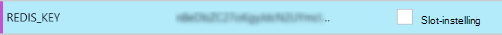
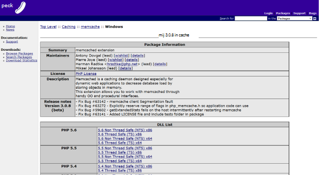

<properties
    pageTitle="Een WebApp in Azure App-Service via het protocol Memcache verbinden Cache bestand Vgx. | Microsoft Azure"
    description="Een WebApp in de App Azure service verbinden met bestand Vgx. Cache via het protocol Memcache"
    services="app-service\web"
    documentationCenter="php"
    authors="SyntaxC4"
    manager="wpickett"
    editor="riande"/>

<tags
    ms.service="app-service-web"
    ms.devlang="php"
    ms.topic="get-started-article"
    ms.tgt_pltfrm="windows"
    ms.workload="na"
    ms.date="02/29/2016"
    ms.author="cfowler"/>

# <a name="connect-a-web-app-in-azure-app-service-to-redis-cache-via-the-memcache-protocol"></a>Een WebApp in Azure App-Service via het protocol Memcache verbinden Cache bestand Vgx.

In dit artikel leert u hoe u een WordPress web-app in [Azure App Service](http://go.microsoft.com/fwlink/?LinkId=529714) verbinden met [Azure bestand Vgx. Cache] [ 12] met de [Memcache] [ 13] protocol. Als u een bestaande web-app die gebruikmaakt van een server Memcached voor caching van in het geheugen hebt, kunt u migreren naar Azure App-Service en de cache directe-oplossing in Microsoft Azure gebruiken met weinig of geen wijziging aan uw toepassingscode. Bovendien kunt u uw bestaande Memcache expertise maken ten zeerste scalable, apps in Azure App-Service met Azure bestand Vgx. Cache voor in het geheugen in cache opslaan, bij het gebruik van populaire toepassingskaders zoals .NET, PHP, Node.js, Java en Python verdeeld.  

App Service Web Apps Hiermee kunt u dit scenario toepassing met de Web-Apps Memcache shim, dat wil een lokale Memcached-server die als Memcache proxy zeggen fungeert voor caching van oproepen naar Azure bestand Vgx. Cache. Hiermee worden alle Apps die communiceert met het Memcache-protocol met cachegegevens met bestand Vgx. Cache. Deze shim Memcache werkt op het protocolniveau van, zodat deze kan worden gebruikt door toepassingen of toepassing framework zo lang maken als wordt gecommuniceerd met het Memcache-protocol.

[AZURE.INCLUDE [app-service-web-to-api-and-mobile](../../includes/app-service-web-to-api-and-mobile.md)] 

## <a name="prerequisites"></a>Vereisten voor

De Web-Apps Memcache shim kan worden gebruikt met een toepassing, mits wordt gecommuniceerd met het Memcache-protocol. De toepassing verwijzing is voor dit voorbeeld wordt een Scalable WordPress-site waarop kan worden ingericht van Azure Marketplace.

Volg de stappen in deze artikelen:

* [Inrichten van een exemplaar van de Service Cache van Azure bestand Vgx.][0]
* [Een site Scalable WordPress in Azure implementeren][1]

Als u de site Scalable WordPress is geïmplementeerd en een bestand Vgx. Cache exemplaar deze is ingericht hebt kunt u bent klaar om te beginnen met het inschakelen van de shim Memcache in Azure App Service Web Apps.

## <a name="enable-the-web-apps-memcache-shim"></a>De Web-Apps Memcache shim inschakelen

Voordat u Memcache shim configureren, moet u drie app-instellingen. U kunt dit doen met een aantal manieren met inbegrip van de [Azure-Portal](http://go.microsoft.com/fwlink/?LinkId=529715), de [klassieke portal][3], de [PowerShell-Cmdlets Azure] [ 5] of de [Interface van Azure-opdrachtregel][5]. Voor de toepassing van dit bericht, ga ik gebruik van de [Portal van Azure] [ 4] voor het instellen van de app-instellingen. De volgende waarden kunnen uit de blad **Instellingen** van uw exemplaar van het bestand Vgx. Cache worden opgehaald.


### <a name="add-redishost-app-setting"></a>Instelling van de app REDIS_HOST toevoegen

De eerste app-instelling, moet u maken is de **bestand Vgx.\_HOST** app-instelling. Deze instelling Hiermee stelt u de bestemming waarnaar de shim de cache-informatie doorgestuurd. De waarde die is vereist voor de instelling van de app REDIS_HOST kan worden opgehaald uit het blad **Eigenschappen** van het exemplaar van uw bestand Vgx. Cache.


Stel de sleutel van de app-instelling te **bestand Vgx.\_HOST** en de waarde van de instelling van de app aan de **hostname** van het bestand Vgx. Cache-exemplaar.


### <a name="add-rediskey-app-setting"></a>Instelling van de app REDIS_KEY toevoegen

De tweede app-instelling, moet u maken is de **bestand Vgx.\_sleutel** app-instelling. Deze instelling biedt dat het verificatietoken vereist voor veilig toegang tot het exemplaar van het bestand Vgx. Cache. U kunt de waarde die is vereist voor de instelling van de app REDIS_KEY van het blad **toegangstoetsen** van het bestand Vgx. Cache exemplaar ophalen.


Stel de sleutel van de app-instelling te **bestand Vgx.\_sleutel** en de waarde van de app-instelling op de **Primaire sleutel** van het exemplaar van het bestand Vgx. Cache.



### <a name="add-memcacheshimredisenable-app-setting"></a>Instelling van de app MEMCACHESHIM_REDIS_ENABLE toevoegen

De laatste instelling van de app wordt gebruikt om in te schakelen van de Memcache Shim in Web-Apps, waarin de REDIS_HOST en REDIS_KEY verbinding maken met de Cache voor het bestand Vgx. van Azure en doorsturen van de cache oproepen. Stel de sleutel van de app-instelling te **MEMCACHESHIM\_bestand Vgx.\_inschakelen** en de waarde **waar**.


Zodra u klaar bent met het toevoegen van de instellingen voor de app drie (3), klikt u op **Opslaan**.

## <a name="enable-memcache-extension-for-php"></a>Memcache-extensie voor PHP inschakelen

In de volgorde voor de toepassing op het protocol Memcache uitspreken, is het voor het installeren van de extensie Memcache naar PHP--het kader van de taal voor uw site WordPress.

### <a name="download-the-phpmemcache-extension"></a>De php_memcache extensie downloaden

Blader naar [PECL][6]. Klik onder de categorie in de cache op [memcache][7]. Klik op de koppeling DLL onder de kolom downloads.


Download de niet-Thread veilige (n) x86 koppeling voor de versie van PHP ingeschakeld in de Web Apps. (De standaardinstelling is PHP 5.4)



### <a name="enable-the-phpmemcache-extension"></a>De extensie php_memcache inschakelen

Nadat u het bestand hebt gedownload, pak en uploadt u de **php\_memcache.dll** in de **d:\\thuis\\site\\wwwroot\\opslaglocatie\\uit\\ ** directory. Nadat de php_memcache.dll is geüpload naar de WebApp, moet u de extensie voor de Runtime PHP inschakelen. Als u wilt de extensie Memcache in de Portal Azure inschakelen, opent u het blad **Toepassingsinstellingen** voor de web-app en vervolgens een nieuwe app-instelling toevoegen met de sleutel van **PHP\_EXTENSIES** en de waarde **opslaglocatie\\uit\\php_memcache.dll**.


> [AZURE.NOTE] Als de web-app meerdere PHP extensies laden moet, is de waarde van PHP_EXTENSIONS moet een door komma's gescheiden lijst met relatieve paden naar dll-bestanden.


Wanneer u klaar bent, klikt u op **Opslaan**.

## <a name="install-memcache-wordpress-plugin"></a>Memcache WordPress-invoegtoepassing installeren

> [AZURE.NOTE] U kunt ook de [Memcached Object Cache-invoegtoepassing](https://wordpress.org/plugins/memcached/) downloaden van WordPress.org.

Klik op **Nieuwe toevoegen en**Klik op de pagina WordPress Plug-ins.


Typ **memcached** in het zoekvak en druk op **Enter**.


**Objectcache Memcached** vinden in de lijst en klik op **Nu installeren**.


### <a name="enable-the-memcache-wordpress-plugin"></a>De Memcache WordPress-invoegtoepassing inschakelen

>[AZURE.NOTE] Volg de instructies in dit blog voor [het inschakelen van een Site-extensie in WebApps] [ 8] Visual Studio Team Services installeren.

In de `wp-config.php` bestand, voegt u de volgende code boven de opmerking aan het einde van het bestand bewerken stoppen.

```php
$memcached_servers = array(
    'default' => array('localhost:' . getenv("MEMCACHESHIM_PORT"))
);
```

Nadat u deze code is gekoppeld, sla monaco automatisch het document.

De volgende stap is de object-cache-invoegtoepassing inschakelen. Dit gebeurt **object-cache.php** uit **wp-inhoud/Plug-ins/memcached** map naar de map **wp-inhoud** naar de functionaliteit voor de objectcache Memcache inschakelen door te slepen.


Nu dat het **object-cache.php** -bestand is opgeslagen in de map **wp-inhoud** , is nu de objectcache Memcached ingeschakeld.


## <a name="verify-the-memcache-object-cache-plugin-is-functioning"></a>Controleer of dat de invoegtoepassing voor de objectcache Memcache werkt

Alle stappen om in te schakelen van de Web-Apps Memcache shim zijn nu voltooid. Hoeft u alleen nog is om te bevestigen dat de gegevens het exemplaar van uw bestand Vgx. Cache is vullen.

### <a name="enable-the-non-ssl-port-support-in-azure-redis-cache"></a>De niet-SSL-poort-ondersteuning in Azure bestand Vgx. Cache inschakelen

>[AZURE.NOTE] Op het moment van het schrijven van dit artikel, biedt de CLI bestand Vgx. geen ondersteuning SSL-connectiviteit, dus de volgende stappen zijn nodig.

Blader naar het bestand Vgx. Cache exemplaar die u hebt gemaakt voor deze web-app in de Portal Azure. Als u van de cache blade hebt geopend, klikt u op het pictogram **Instellingen** .


Selecteer de **Access-poorten** in de lijst.


Klik op **Nee** voor **toegang toestaan alleen via SSL**.


U ziet dat de niet-SSL-poort nu is ingesteld. Klik op **Opslaan**.


### <a name="connect-to-azure-redis-cache-from-redis-cli"></a>Verbinding maken met Azure bestand Vgx. Cache vanuit bestand Vgx. cli

>[AZURE.NOTE] Deze stap wordt ervan uitgegaan dat bestand Vgx. lokaal is geïnstalleerd op uw computer ontwikkeling. [Installeren bestand Vgx. lokaal met deze instructies][9].

Open uw opdrachtregel console van keuze en typt u de volgende opdracht uit:

```shell
redis-cli –h <hostname-for-redis-cache> –a <primary-key-for-redis-cache> –p 6379
```

Vervang de ** &lt;hostname-voor-bestand Vgx.-cache&gt; ** met de naam van de werkelijke xxxxx.redis.cache.windows.net host en de ** &lt;primaire-sleutel-voor-bestand Vgx.-cache&gt; ** met de sneltoets voor de cache, druk op **Enter**. Zodra de CLI is verbonden met het exemplaar van het bestand Vgx. Cache, geeft u een opdracht bestand Vgx.. In de onderstaande schermafbeelding ik ervoor hebt gekozen voor een overzicht van de toetsen.


De oproep voor een overzicht van de toetsen moet een waarde te retourneren. Als u niet, probeer opnieuw te navigeren naar de web-app en probeer het opnieuw.

## <a name="conclusion"></a>Sluiten

Gefeliciteerd! De app WordPress bevat nu een gecentraliseerde in het geheugen cache als toelichting van doorvoer vergroten. Onthoud dat de Web-Apps Memcache Shim kan worden gebruikt met een client Memcache ongeacht de programmeertaal of toepassing framework. Feedback geven of om te vragen stellen over de Web-Apps Memcache shim, posten naar [MSDN Forums] [ 10] of [Stackoverflow][11].

>[AZURE.NOTE] Als u aan de slag met Azure App Service wilt voordat u zich registreert voor een Azure-account, gaat u naar de [App-Service probeert](http://go.microsoft.com/fwlink/?LinkId=523751), waar u direct een tijdelijk starter in de browser in de App-Service maken kunt. Geen creditcards vereist; geen verplichtingen.

## <a name="whats-changed"></a>Wat er gewijzigd
* Zie voor een handleiding voor het wijzigen van Websites naar App Service: [Azure App-Service en de gevolgen voor bestaande Azure-Services](http://go.microsoft.com/fwlink/?LinkId=529714)


[0]: ../redis-cache/cache-dotnet-how-to-use-azure-redis-cache.md#create-a-cache
[1]: http://bit.ly/1t0KxBQ
[2]: http://manage.windowsazure.com
[3]: http://portal.azure.com
[4]: ../powershell-install-configure.md
[5]: /downloads
[6]: http://pecl.php.net
[7]: http://pecl.php.net/package/memcache
[8]: http://blog.syntaxc4.net/post/2015/02/05/how-to-enable-a-site-extension-in-azure-websites.aspx
[9]: http://redis.io/download#installation
[10]: https://social.msdn.microsoft.com/Forums/home?forum=windowsazurewebsitespreview
[11]: http://stackoverflow.com/questions/tagged/azure-web-sites
[12]: /services/cache/
[13]: http://memcached.org
