<properties
   pageTitle="Een ASP.NET-5-web-app maken in Visual Studio-Code"
   description="Deze zelfstudie ziet u hoe u een ASP.NET-5-web-app met Visual Studio-Code maakt."
   services="app-service\web"
   documentationCenter=".net"
   authors="erikre"
   manager="wpickett"
   editor="jimbe"/>

<tags
    ms.service="app-service-web" 
    ms.workload="web" 
    ms.tgt_pltfrm="dotnet" 
    ms.devlang="na" 
    ms.topic="article" 
    ms.date="02/26/2016" 
    ms.author="cephalin"/>

# Een ASP.NET-5-web-app maken in Visual Studio-Code

## Overzicht

Deze zelfstudie ziet u hoe u een ASP.NET-5-web-app met [Visual Studio-Code (VS Code)](http://code.visualstudio.com//Docs/whyvscode) maken en het dashboard implementeren naar [Azure App-Service](../app-service/app-service-value-prop-what-is.md). 

> [AZURE.NOTE] Hoewel in dit artikel naar de WebApps verwijst, worden deze ook geldt voor API-apps en mobiele apps. 

ASP.NET 5 is een aanzienlijk nieuw ontwerp van ASP.NET. ASP.NET 5 is een nieuwe openen-bron- en platforms framework voor het samenstellen van moderne cloudgebaseerde WebApps met behulp van .NET. Zie [Inleiding tot ASP.NET-5](http://docs.asp.net/en/latest/conceptual-overview/aspnet.html)voor meer informatie. Zie [Overzicht van de Web-Apps](app-service-web-overview.md)voor informatie over Azure App Service Webapps.

[AZURE.INCLUDE [app-service-web-try-app-service.md](../../includes/app-service-web-try-app-service.md)]

## Vereisten voor  

* [Tegenover programmacode](http://code.visualstudio.com/Docs/setup)installeren.
* Installatie [Node.js](http://nodejs.org) - Node.js is een platform voor het bouwen met JavaScript snel en scalable servertoepassingen. Knooppunt is de runtime (knooppunt) en [npm](http://www.npmjs.com/) is de Manager pakket voor knooppunt modules. U kunt npm scaffold een ASP.NET-5-web-app in deze zelfstudie.
* Cijfer - installeren kunt u deze installeren vanaf een van deze locaties: [Chocolatey](https://chocolatey.org/packages/git) of [cijfer-scm.com](http://git-scm.com/downloads). Als u eerder met cijfer, kiest u [cijfer-scm.com](http://git-scm.com/downloads) en selecteert u de optie voor het **Gebruik cijfer, vanaf de opdrachtprompt van Windows**. Als u cijfer zijn geïnstalleerd, moet u ook de naam van de gebruiker cijfer installatie en het e-als dit nodig verderop in deze zelfstudie (wanneer het uitvoeren van een doorvoeren van VS Code).  

## ASP.NET 5 en DNX installeren
ASP.NET-5/DNX (de .NET omgeving) is een lean .NET-stapel voor het samenstellen van moderne cloud en web-apps die worden uitgevoerd op OS X, Linux en Windows. Deze is opgebouwd helemaal omhoog ter een ontwikkelingskader geoptimaliseerde van apps die zijn geïmplementeerd in de cloud of on-premises implementatie uitvoeren. Deze bestaat uit modulaire onderdelen met minimale realiseren, zodat u flexibiliteit bij het maken van uw oplossingen bewaren.

Deze zelfstudie is bedoeld om u aan de slag met het bouwen van toepassingen met de nieuwste versies van de ontwikkeling van ASP.NET-5 en DNX. De volgende instructies zijn specifiek voor Windows. Zie voor meer gedetailleerde installatie-instructies voor OS X, Linux en Windows [ASP.NET-5 installeren en DNX](https://code.visualstudio.com/Docs/ASPnet5#_installing-aspnet-5-and-dnx). 

1. .NET versie Manager (DNVM) in Windows installeert, open een opdrachtprompt en voer de volgende opdracht.

        @powershell -NoProfile -ExecutionPolicy unrestricted -Command "&{$Branch='dev';iex ((new-object net.webclient).DownloadString('https://raw.githubusercontent.com/aspnet/Home/dev/dnvminstall.ps1'))}"

    Hiermee wordt het script DNVM downloaden en zet dit in uw map voor het gebruikersprofiel. 

2. **Windows opnieuw starten** om de DNVM-installatie te voltooien. 

    Nadat u Windows opnieuw is gestart, kunt u de opdrachtprompt om te controleren of de locatie van DNVM door op te geven de volgende openen:

        where dnvm

    De opdrachtprompt wordt een pad naar de volgende strekking weergegeven.

    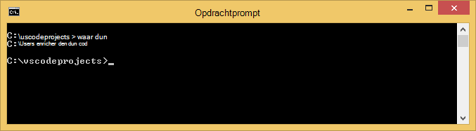

3. Nu dat u DNVM hebt, moet u deze gebruiken om te downloaden DNX om uit te voeren van uw toepassingen. Voer de volgende bij de opdrachtprompt:

        dnvm upgrade

    Controleer of uw DNVM en de actieve runtime weergeven door in te voeren van de volgende handelingen uit bij de opdrachtprompt:

        dnvm list

    De opdrachtprompt wordt de details van de actieve runtime weergegeven.

    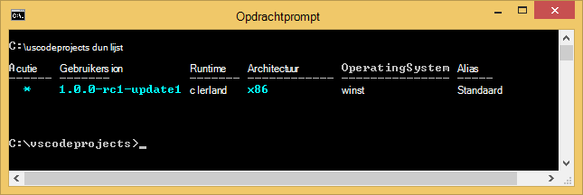

    Als meer dan één DNX runtime wordt weergegeven, kunt u kiezen om in te voeren van de volgende (of een nieuwere versie) bij de opdrachtprompt om in te stellen van de actieve DNX runtime. Stel deze in op dezelfde versie als die wordt gebruikt door de ASP.NET-5-genereren wanneer u uw web-app verderop in deze zelfstudie maakt. *Mogelijk moet u niet de actieve runtime wijzigen als dit is ingesteld op de laatste beschikbaar.*

        dnvm use 1.0.0-update1 –p

> [AZURE.NOTE] Zie voor meer gedetailleerde installatie-instructies voor OS X, Linux en Windows [ASP.NET-5 installeren en DNX](https://code.visualstudio.com/Docs/ASPnet5#_installing-aspnet-5-and-dnx). 

## De WebApp maken 

In dit gedeelte ziet u hoe u een nieuwe app ASP.NET web-app scaffold. U kunt het knooppunt pakket manager (npm) wilt gebruiken voor het installeren van [Yeoman](http://yeoman.io/) (steigers programma - Code van de VS hetzelfde als de Visual Studio **Bestand > Nieuw Project** bewerking), [knorvis](http://gruntjs.com/) (JavaScript taak deelnemer) en [Bower](http://bower.io/) (client kant pakket manager). 

1. Open een opdrachtprompt met beheerdersrechten en navigeer naar de locatie waar u wilt maken van uw ASP.NET-project. Een map *vscodeprojects* bijvoorbeeld maken in de hoofdmap van C:\.

2. Voer de volgende handelingen uit bij de opdrachtprompt voor de installatie Yeoman en de ondersteunende hulpmiddelen.

        npm install -g yo grunt-cli generator-aspnet bower

    > [AZURE.NOTE] U krijgt u mogelijk een waarschuwing suggesties voor dat uw versie npm verouderd is. Deze waarschuwing moet geen invloed op deze zelfstudie.

3. Voer de volgende handelingen uit bij de opdrachtprompt naar de projectmap voor een maken en de app scaffold.

        yo aspnet

4. Gebruik de pijltoetsen om te selecteren van het **Web Application eenvoudige** type in het menu voor ASP.NET-5-genereren, en druk op ** &lt;Enter >**.

    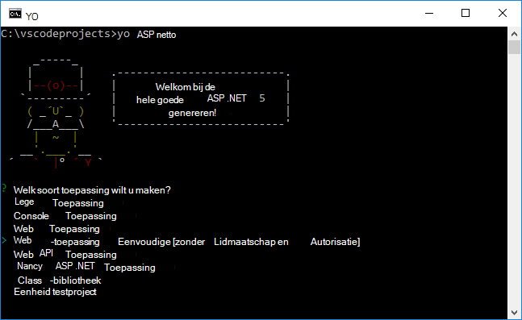

5. Stel de naam van uw nieuwe ASP.NET-web-app naar **SampleWebApp**. Als deze naam wordt gebruikt in de zelfstudie, als u een andere naam selecteert, moet u in plaats van elk exemplaar van **SampleWebApp**. Wanneer u drukt op ** &lt;Enter >**, Yeoman maakt een nieuwe map met de naam **SampleWebApp** en de benodigde bestanden voor de nieuwe app.

6. Wijzigen mappen naar de nieuwe projectmap bij de opdrachtprompt:

        cd SampleWebApp

7. Ook bij de opdrachtprompt om te kunnen installeren de nodige NuGet-pakketten als de toepassing wilt uitvoeren, voer de volgende opdracht uit:

        dnu restore

8. TEGENOVER Code openen door op te geven van de volgende handelingen uit bij de opdrachtprompt:

        code .

## Lokaal de WebApp uitvoeren

U kunt de web-app nu dat u hebt gemaakt van de web-app en alle NuGet-pakketten voor de app opgehaald, lokaal uitvoeren.

1. In het **Palet van de opdracht** in de VS Code, voert u de volgende handelingen uit als u wilt weergeven van de opties beschikbaar opdracht uitvoeren:

        dnx: Run Command

    > [AZURE.NOTE] Als de server Omnisharp wordt niet uitgevoerd, wordt deze gestart. De bovenstaande opdracht opnieuw in te voeren.

    Selecteer vervolgens de volgende opdracht uit te voeren van uw web-app:
        
        dnx web - (SampleWebApp)

    De opdrachtvenster wordt weergegeven dat u de toepassing heeft gestart. Als het opdrachtvenster niet dit bericht wordt weergegeven, controleert u de onderste links corning van VS Code op fouten in uw project.
    
    > [AZURE.NOTE]Een opdracht in het **Palet van de opdracht** alleen een **>** teken aan het begin van de opdrachtregel. U kunt de details die betrekking hebben op de **web** -opdracht in het bestand *project.json* bekijken.   
    > Als de opdracht niet wordt weergegeven of niet beschikbaar is, moet u mogelijk de C#-extensie installeren. Uitvoeren `>Extensions: Install Extension` en `ext install c#` voor het installeren van de C#-extensies.

2. Open een browser en Ga naar de volgende URL.

    **http://localhost:5000**

    De standaardpagina van de web-app wordt als volgt weergegeven.

    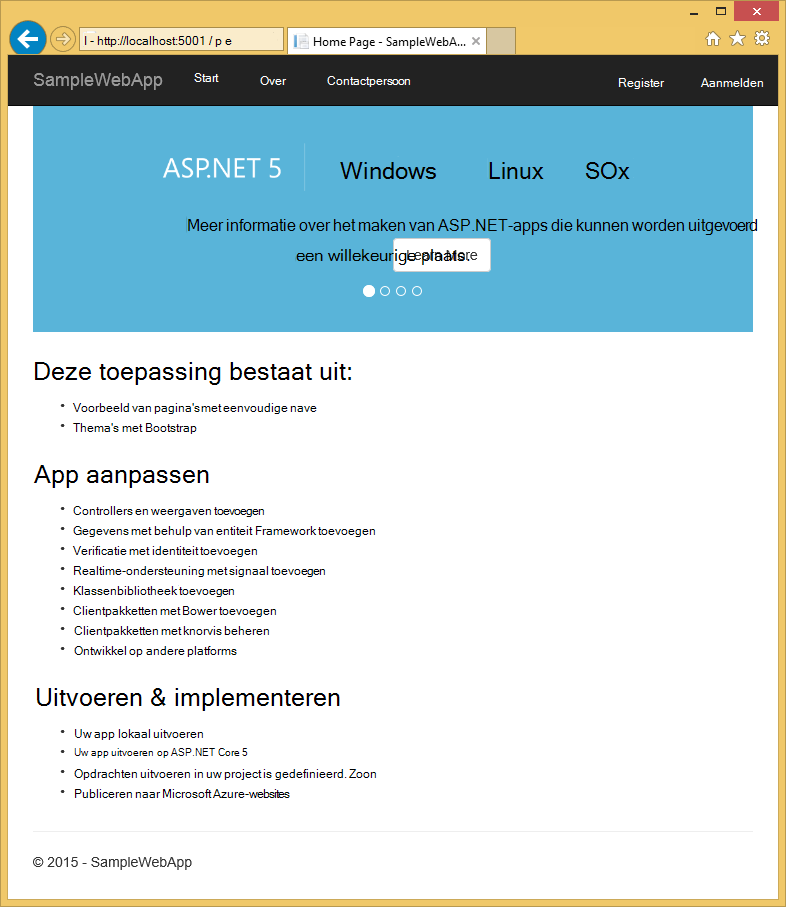

3. Sluit de browser. Druk op **Ctrl + C** om de toepassing afsluiten en sluit het **Venster van de opdracht**in het **Opdrachtvenster**. 

## Een WebApp maken in de Portal van Azure

De volgende stappen begeleidt u bij het maken van een web-app in de Portal Azure.

1. Meld u aan bij de [Portal van Azure](https://portal.azure.com).

2. Klik op **Nieuw** boven links van de Portal.

3. Klik op **Web Apps > Web App**.

    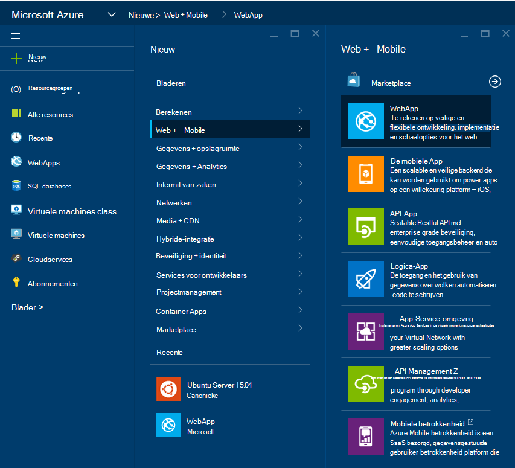

4. Voer een waarde voor **naam**, bijvoorbeeld **SampleWebAppDemo**. Opmerking dat deze naam moet uniek zijn en de portal wordt afdwingen dat wanneer u probeert de naam te geven. Daarom als u een andere waarde invoeren selecteert, moet u vervangen die waarde voor elk exemplaar van **SampleWebAppDemo** die u in deze zelfstudie te zien. 

5. Selecteer een bestaand **App-Service plannen** of maak een nieuwe record. Als u een nieuw abonnement hebt gemaakt, selecteert u de prijzen laag, locatie en andere opties. Zie het artikel, [uitgebreide overzicht van Azure App-Service plannen](../app-service/azure-web-sites-web-hosting-plans-in-depth-overview.md)voor meer informatie over de App-Service-abonnementen.

    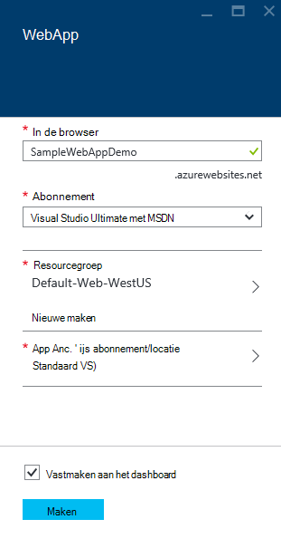

6. Klik op **maken**.

    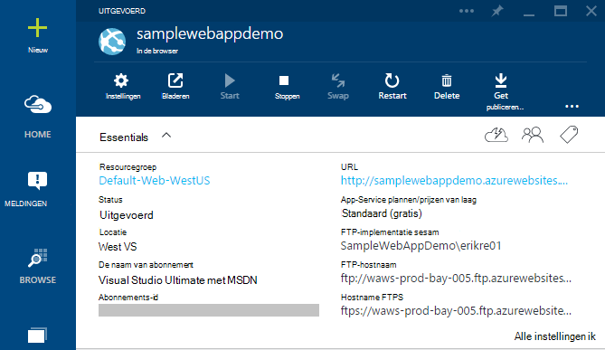

## Cijfer publicatie voor de nieuwe WebApp inschakelen

Cijfer is een systeem voor het beheer van gedistribueerde versie die u gebruiken kunt om te implementeren van uw web-app van Azure App-Service. U kunt de code die u voor uw web-app in een lokale cijfer opslagplaats schrijft wilt opslaan en u kunt uw code implementeren naar Azure door te drukken naar een externe bibliotheek.   

1. Meld u aan bij de [Portal van Azure](https://portal.azure.com).

2. Klik op **Bladeren**.

3. Klik op **Web Apps** om een overzicht van de web-apps die is gekoppeld aan uw Azure abonnement.

4. Selecteer de WebApp die u in deze zelfstudie hebt gemaakt.

5. Klik in het blad web-app op **Instellingen** > **continue implementatie**. 

    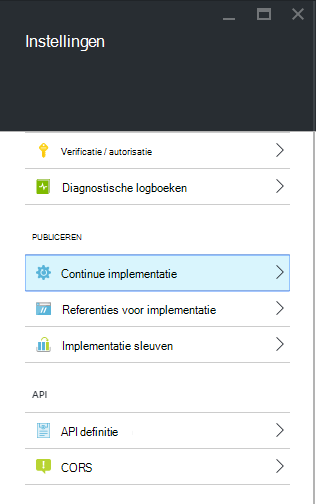

6. Klik op **bron kiezen > lokale cijfer opslagplaats**.

7. Klik op **OK**.

    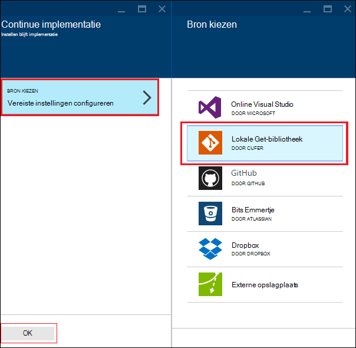

8. Als u eerder niet implementatie referenties voor het publiceren van een web-app of een andere App Service-app hebt ingesteld, stelt u deze nu u:

    * Klik op **Instellingen** > **implementatie referenties**. Het blad **implementatie referenties instellen** worden, weergegeven.

    * Maak een gebruikersnaam en wachtwoord.  U hebt dit wachtwoord later nodig bij het instellen van cijfer.

    * Klik op **Opslaan**.

9. Klik in uw web-app blade, op **Instellingen > Eigenschappen**. De URL van de externe cijfer opslagplaats waarin u dashboard naar implementeren wordt wordt weergegeven onder de **URL van een cijfer**.

10. Kopieer de **URL van de cijfer** -waarde voor later gebruik in de zelfstudie.

    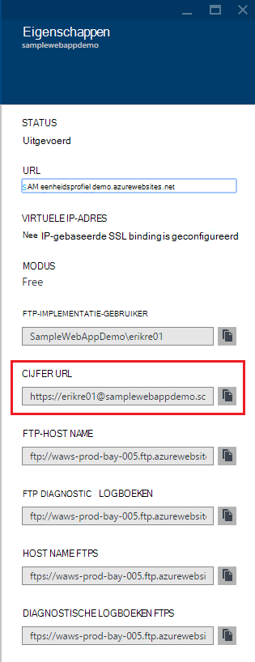

## Uw web-app publiceren naar Azure App-Service

In dit gedeelte maakt u een lokale cijfer opslagplaats en push uit die opslagplaats naar Azure naar uw web-app implementeren naar Azure.

1. Selecteer in de VS Code, de optie **cijfer** in de linkernavigatiebalk.

    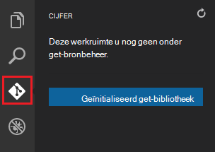

2. Selecteer **cijfer opslagplaats geïnitialiseerd** om ervoor te zorgen dat uw werkruimte is onder cijfer bronbeheer. 

    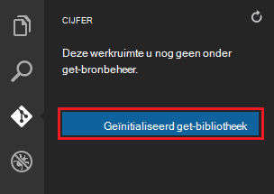

3. Open het venster met de opdracht en mappen wijzigen in de adreslijst van uw web-app. Voer vervolgens de volgende opdracht uit:

        git config core.autocrlf false

    Deze opdracht wordt voorkomen dat een probleem over tekst wanneer CRLF einde en LF uitgangen betreft.

4. TEGENOVER Code, een bericht doorvoeren toevoegen en klik op het pictogram voor **Alle doorvoeren** .

    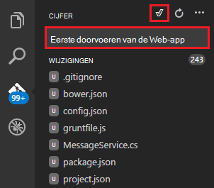

5. Nadat het cijfer is verwerkt, ziet u dat er geen bestanden weergegeven in het venster cijfer onder **wijzigingen**. 

    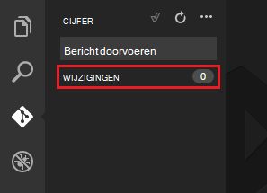

6. Wijzig weer in het opdrachtvenster waar de opdrachtprompt verwijst naar de map waarin uw web-app zich bevindt.

7. Maak een externe verwijzing voor om updates naar uw web-app via de URL cijfer (eindigend op ".git") die u eerder hebt gekopieerd.

        git remote add azure [URL for remote repository]

8. Cijfer als u wilt uw referenties lokaal opslaan zodat ze automatisch toegevoegd aan uw push-opdrachten gegenereerd op basis van de VS Code configureren.

        git config credential.helper store

9. Uw wijzigingen aan Azure push door de volgende opdracht uit te voeren. Na deze eerste push naar Azure, is mogelijk moet u alle push-opdrachten van VS Code doen. 

        git push -u azure master

    U wordt gevraagd om het wachtwoord dat u eerder in Azure gemaakt. **Opmerking: Uw wachtwoord wordt niet meer zichtbaar.**

    De uitvoer van de bovenstaande opdracht eindigt op een bericht dat implementatie geslaagd is.

        remote: Deployment successful.
        To https://user@testsite.scm.azurewebsites.net/testsite.git
        [new branch]      master -> master

> [AZURE.NOTE] Als u wijzigingen in de app aanbrengt, kunt u rechtstreeks in de VS Code met de ingebouwde functionaliteit voor het cijfer door de **Alle doorvoeren** optie gevolgd door de optie **Push** opnieuw publiceren. U vindt de optie **Push** beschikbaar in de vervolgkeuzelijst naast de knoppen **Alles doorvoeren** en **vernieuwen** .

Als u nodig hebt om samen te werken aan een project, kunt u overwegen om naar GitHub tussen naar Azure doordat.

## De app uitvoeren in Azure wordt aangegeven
Nu dat u hebt uw web-app geïmplementeerd, laten we u de app terwijl ingesloten in een Azure uitvoeren. 

Dit kan op twee manieren doen:

* Open een browser en typ de naam van uw web-app als volgt.   

        http://SampleWebAppDemo.azurewebsites.net
 
* Klik in de Portal Azure Zoek het blad web app voor uw web-app en klik op **Bladeren** om de app weer te geven 
* in de browser.

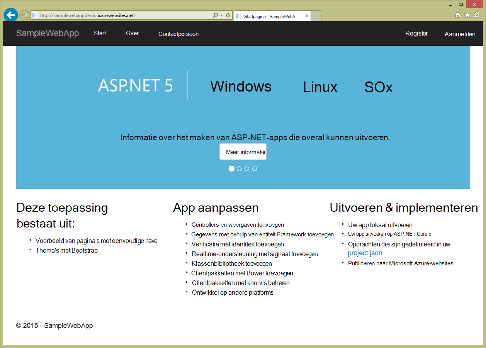

## Overzicht
In deze zelfstudie hebt u geleerd hoe u een WebApp maakt in de VS Code en het dashboard implementeren naar Azure. Voor meer informatie over tegenover Code, raadpleegt u het artikel [Waarom Visual Studio-Code?](https://code.visualstudio.com/Docs/) Zie [Overzicht van de Web-Apps](app-service-web-overview.md)voor informatie over App Service Webapps. 
