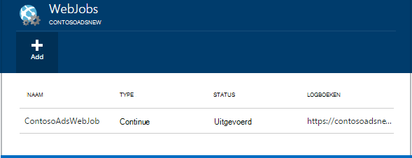
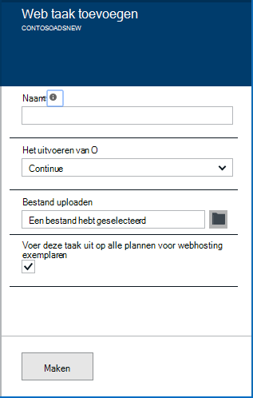
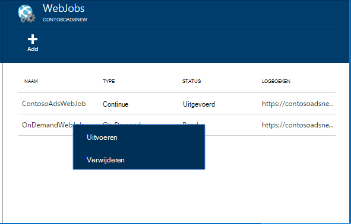
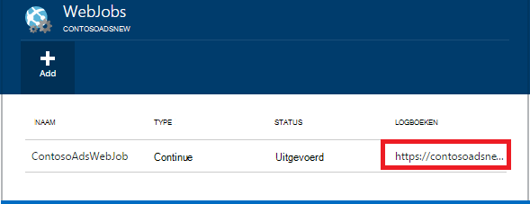

<properties 
    pageTitle="Achtergrondtaken uitvoeren met WebJobs" 
    description="Informatie over het uitvoeren van achtergrondtaken in Azure web-apps." 
    services="app-service" 
    documentationCenter="" 
    authors="tdykstra" 
    manager="wpickett" 
    editor="jimbe"/>

<tags 
    ms.service="app-service" 
    ms.workload="na" 
    ms.tgt_pltfrm="na" 
    ms.devlang="na" 
    ms.topic="article" 
    ms.date="04/27/2016" 
    ms.author="tdykstra"/>

# <a name="run-background-tasks-with-webjobs"></a>Achtergrondtaken uitvoeren met WebJobs

## <a name="overview"></a>Overzicht

U kunt programma's of scripts in WebJobs uitvoeren in uw [App Service](http://go.microsoft.com/fwlink/?LinkId=529714) -web-app op drie manieren: op aanvraag, continu, of op een planning. Er is geen extra kosten WebJobs gebruiken.

In dit artikel leest het implementeren van WebJobs met behulp van de [Azure-Portal](https://portal.azure.com). Zie voor informatie over hoe u met behulp van Visual Studio of een doorlopend bezorgingsproces, [hoe u Azure WebJobs implementeren naar Web Apps](websites-dotnet-deploy-webjobs.md).

De SDK van Azure WebJobs eenvoudiger veel WebJobs programming taken. Zie [de SDK WebJobs](websites-dotnet-webjobs-sdk.md)voor meer informatie.

 Azure-functies (die momenteel in preview) is een andere manier om het programma's en scripts worden uitgevoerd in Azure App-Service. Zie [overzicht van Azure-functies](../azure-functions/functions-overview.md)voor meer informatie.

[AZURE.INCLUDE [app-service-web-to-api-and-mobile](../../includes/app-service-web-to-api-and-mobile.md)] 

## <a name="acceptablefiles"></a>Geschikt bestandstype voor scripts of programma 's

De volgende bestandstypen worden geaccepteerd:

* cmd, type, .exe (via windows cmd)
* .ps1 (via powershell)
* .sh (we vaker doen via)
* .php (via php)
* .PY (via python)
* js (via knooppunt)
* .jar (via java)

## <a name="CreateOnDemand"></a>Een op verzoek WebJob in de beheerportal maken

1. Klik in het blad **In de browser** van de [Azure-Portal](https://portal.azure.com), op **alle instellingen > WebJobs** om weer te geven van het blad **WebJobs** .
    
    
    
5. Klik op **toevoegen**. Het dialoogvenster **WebJob toevoegen** wordt weergegeven.
    
    
    
2. Geef onder **naam**een naam voor de WebJob. De naam moet beginnen met een letter of een getal en andere optie dan mag geen speciale tekens bevatten "-" en "_".
    
4. Kies **uitvoeren op aanvraag**in het vak **het en-klaar** .
    
3. Klik op het mappictogram en blader naar het zipbestand met het script in het vak **Bestand uploaden** . Het zip-bestand moet uw uitvoerbare bestand (.exe cmd type .sh .php .py js) bevatten en de ondersteunende bestanden die nodig zijn voor het programma of script uitvoeren.
    
5. Controleer **maken** om het script uploaden naar uw web-app. 
    
    De naam die u hebt opgegeven voor de WebJob wordt weergegeven in de lijst op het blad **WebJobs** .
    
6. Als u wilt uitvoeren de WebJob, met de rechtermuisknop op de naam ervan in de lijst en klik op **uitvoeren**.
    
    
    
## <a name="CreateContinuous"></a>Een continu actieve WebJob maken

1. Als u wilt maken van een WebJob continu uitvoeren, dezelfde stappen voor het maken van een WebJob dat wordt uitgevoerd één keer, maar in het vak **het en-klaar** , kiest u **doorlopend**.

2. Als u wilt starten of stoppen een doorlopend WebJob, met de rechtermuisknop op de WebJob in de lijst en klikt u op **starten** of **stoppen**.
    
> [AZURE.NOTE] Als uw web-app op meer dan één exemplaar wordt uitgevoerd, kan een continu actieve WebJob worden uitgevoerd op alle uw exemplaren. Op aanvraag en geplande WebJobs uitvoeren op één exemplaar voor taakverdeling door Microsoft Azure geselecteerd.
    
> Voor doorlopende WebJobs naar betrouwbaar en klik op alle processen worden uitgevoerd, inschakelen voor de altijd * configuratie-instelling voor de WebApp anders ze niet meer kunnen worden uitgevoerd wanneer de hostsite SCM is te lang geweest.

## <a name="CreateScheduledCRON"></a>Een geplande WebJob met een expressie CRON maken

Deze methode is beschikbaar voor u Basic, Standard of Premium afspeelt Web-Apps en de instelling **Altijd op** om u te worden ingeschakeld op de app vereist.

Als u wilt een aanvraag op WebJob omzetten in een geplande WebJob, gewoon bevatten een `settings.job` bestand in de hoofdmap van uw WebJob zip-bestand. Dit bestand JSON moet bevatten een `schedule` eigenschap een [CRON expressie](https://en.wikipedia.org/wiki/Cron)per voorbeeld hieronder.

De expressie CRON bestaat uit 6 velden: `{second} {minute} {hour} {day} {month} {day of the week}`.

Als u bijvoorbeeld voor het starten van uw WebJob elke 15 minuten, uw `settings.job` aangewezen:

```json
{
    "schedule": "0 */15 * * * *"
}
``` 

Andere CRON planning voorbeelden:

- Per uur (dat wil zeggen wanneer het aantal minuten is aan 0):`0 0 * * * *` 
- Per uur van 9 AM tot 5 PM:`0 0 9-17 * * *` 
- Om 9:30 AM elke dag:`0 30 9 * * *`
- Om 9:30 AM elke dag van de week:`0 30 9 * * 1-5`

**Opmerking**: als u een WebJob van Visual Studio implementeert, zorg ervoor dat markeren uw `settings.job` bestandseigenschappen als kopie als nieuwere.


## <a name="CreateScheduled"></a>Een geplande WebJob gebruik van de Azure-planner maken

De volgende alternatieve techniek gebruikmaakt van de Azure-planner. In dit geval heeft uw WebJob geen directe kennis van de planning. In plaats daarvan wordt de planner Azure geconfigureerd voor het activeren van uw WebJob volgens een schema. 

De Portal Azure geen nog de mogelijkheid om te maken van een geplande WebJob, maar tot die functie wordt toegevoegd, dat kunt u dat doen door met behulp van de [klassieke portal](http://manage.windowsazure.com).

1. Ga naar de pagina WebJob in de [klassieke portal](http://manage.windowsazure.com) en klikt u op **toevoegen**.

1. Kies **uitvoeren op een planning**in het vak **het en-klaar** .
    
    ![Nieuwe geplande taak][NewScheduledJob]
    
2. Kies de **Scheduler regio** voor uw taak en klik vervolgens op de pijl aan de rechterkant onder in het dialoogvenster om te gaan naar het volgende scherm.

3. Kies het type **Terugkeerpatroon** gewenste in het dialoogvenster **Taak maken** : **eenmalige** of **terugkerende taak**.
    
    ![Terugkeerpatroon plannen][SchdRecurrence]
    
4. Ook Kies **een begintijd** : **nu** of **op een bepaald tijdstip**.
    
    ![Begintijd van de planning][SchdStart]
    
5. Als u starten op een bepaald tijdstip wilt, kiest u uw beginwaarden van de tijd onder **Starten op**.
    
    ![Planning beginnen bij een bepaald tijdstip][SchdStartOn]
    
6. Als u een terugkerende taak hebt gekozen, beschikt u over de **herhalen elke** optie voor de frequentie van exemplaar en de optie **Die eindigen op** om op te geven van een eindtijd.
    
    ![Terugkeerpatroon plannen][SchdRecurEvery]
    
7. Als u **weken**kiest, kunt u schakelt u het **Op een bepaald schema** en opgeven welke dagen van de week waarop u wilt dat de taak wilt uitvoeren.
    
    ![Planning dagen van de Week][SchdWeeksOnParticular]
    
8. Als u kiest u **maanden** en schakelt u het **Op een bepaalde planning** , kunt u de taak wilt uitvoeren op bepaalde genummerde **dagen** in de maand instellen. 
    
    ![Planning van bepaalde datums in de maand][SchdMonthsOnPartDays]
    
9. Als u **Weekdagen**kiest, kunt u welke zowel overdag als dagen van de week in de maand die u wilt dat de taak wilt uitvoeren op.
    
    ![Bepaalde weekdagen in een maand plannen][SchdMonthsOnPartWeekDays]
    
10. Tot slot u ook de optie **exemplaren** kunt gebruiken om te kiezen welke week in de maand (eerste, tweede, derde enz.) u wilt dat de taak wilt uitvoeren op de weekdagen die u hebt opgegeven.
    
    ![Bepaalde weekdagen van bepaalde weken die in een maand plannen][SchdMonthsOnPartWeekDaysOccurences]
    
11. Nadat u een of meer taken hebt gemaakt, worden hun namen wordt weergegeven op het tabblad WebJobs met hun status, schema en andere informatie. Historische gegevens voor de afgelopen 30 WebJobs worden bijgehouden.
    
    ![Takenlijst][WebJobsListWithSeveralJobs]
    
### <a name="Scheduler"></a>Geplande taken en Azure Scheduler

Geplande taken kunnen verder worden geconfigureerd in de Azure Scheduler-pagina's van de [klassieke portal](http://manage.windowsazure.com).

1.  Klik op van de taak **planning** koppeling om te navigeren naar de portal Azure Scheduler-pagina op de pagina WebJobs. 
    
    ![Koppeling naar Azure Scheduler][LinkToScheduler]
    
2. Klik op de pagina Scheduler op de taak.
    
    ![Taak op de portalpagina Scheduler][SchedulerPortal]
    
3. De **actie voor taak** -pagina wordt geopend, waar u de taak verder kunt configureren. 
    
    ![Taak actie PageInScheduler][JobActionPageInScheduler]
    
## <a name="ViewJobHistory"></a>De Taakgeschiedenis weergeven

1. Als u wilt bekijken van de geschiedenis van de uitvoering van een taak, waaronder taken die zijn gemaakt met de SDK WebJobs, klikt u op de desbetreffende koppeling onder de kolom **Logboeken** van het blad WebJobs. (U kunt het Klembord-pictogram de URL van de pagina log bestand naar het Klembord kopiëren, indien gewenst.)
    
    
        
2. Op de koppeling klikt, wordt de detailpagina van geopend voor de WebJob. Deze pagina ziet u de naam van de opdracht de laatste keer dat deze wordt uitgevoerd, uitvoeren en het slagen of mislukken. Klik onder **recente taak wordt uitgevoerd**, klikt u op een tijd om meer details weer te geven.
    
    ![WebJobDetails][WebJobDetails]
    
3. De pagina **Details van WebJob uitvoeren** wordt weergegeven. Klik op **De wisselknop uitvoer** om te zien van de tekst van de inhoud van het logboek. Het uitvoerlogboek is tekst zonder opmaak. 
    
    ![Details van uptaak Web][WebJobRunDetails]
    
4. Als u wilt de uitvoertekst in een afzonderlijk browservenster wordt weergegeven, klikt u op de koppeling **downloaden** . Als u wilt downloaden van de tekst zelf, met de rechtermuisknop op de koppeling en opties van uw browser gebruiken om op te slaan inhoud van het bestand.
    
    ![De uitvoer downloaden][DownloadLogOutput]
    
5. De koppeling **WebJobs** boven aan de pagina is een handige manier om een lijst met WebJobs op het dashboard geschiedenis.
    
    ![Een koppeling naar WebJobs lijst][WebJobsLinkToDashboardList]
    
    ![Lijst met WebJobs in de geschiedenis van dashboard][WebJobsListInJobsDashboard]
    
    Te klikken op een van de volgende koppelingen Hiermee, gaat u naar de detailpagina van WebJob voor de taak die u hebt geselecteerd.


## <a name="WHPNotes"></a>Notities
    
- WebApps in de modus voor gratis kunnen een time-out nadat 20 minuten als er geen aanvragen voor de site scm (-implementatie) en de web-app-portal is niet worden geopend in Azure. Aanvragen voor de werkelijke site wordt niet opnieuw instellen van dit.
- Code voor een doorlopend project moet worden geschreven in een lus uit te voeren.
- Continue taken uitvoeren continu alleen als de WebApp wordt uitgevoerd omhoog.
- Eenvoudige en standaard modi aanbieding de altijd op aanbevelen welke, als deze ingeschakeld, kunnen WebApps steeds niet actief geweest.
- U kunt alleen fouten WebJobs continu worden uitgevoerd. Geplande of op aanvraag WebJobs foutopsporing wordt niet ondersteund.

## <a name="NextSteps"></a>Volgende stappen
 
Zie [Azure WebJobs aanbevolen bronnen]voor meer informatie[WebJobsRecommendedResources].

[PSonWebJobs]:http://blogs.msdn.com/b/nicktrog/archive/2014/01/22/running-powershell-web-jobs-on-azure-websites.aspx
[WebJobsRecommendedResources]:http://go.microsoft.com/fwlink/?LinkId=390226

[OnDemandWebJob]: ./media/web-sites-create-web-jobs/01aOnDemandWebJob.png
[WebJobsList]: ./media/web-sites-create-web-jobs/02aWebJobsList.png
[NewContinuousJob]: ./media/web-sites-create-web-jobs/03aNewContinuousJob.png
[NewScheduledJob]: ./media/web-sites-create-web-jobs/04aNewScheduledJob.png
[SchdRecurrence]: ./media/web-sites-create-web-jobs/05SchdRecurrence.png
[SchdStart]: ./media/web-sites-create-web-jobs/06SchdStart.png
[SchdStartOn]: ./media/web-sites-create-web-jobs/07SchdStartOn.png
[SchdRecurEvery]: ./media/web-sites-create-web-jobs/08SchdRecurEvery.png
[SchdWeeksOnParticular]: ./media/web-sites-create-web-jobs/09SchdWeeksOnParticular.png
[SchdMonthsOnPartDays]: ./media/web-sites-create-web-jobs/10SchdMonthsOnPartDays.png
[SchdMonthsOnPartWeekDays]: ./media/web-sites-create-web-jobs/11SchdMonthsOnPartWeekDays.png
[SchdMonthsOnPartWeekDaysOccurences]: ./media/web-sites-create-web-jobs/12SchdMonthsOnPartWeekDaysOccurences.png
[RunOnce]: ./media/web-sites-create-web-jobs/13RunOnce.png
[WebJobsListWithSeveralJobs]: ./media/web-sites-create-web-jobs/13WebJobsListWithSeveralJobs.png
[WebJobLogs]: ./media/web-sites-create-web-jobs/14WebJobLogs.png
[WebJobDetails]: ./media/web-sites-create-web-jobs/15WebJobDetails.png
[WebJobRunDetails]: ./media/web-sites-create-web-jobs/16WebJobRunDetails.png
[DownloadLogOutput]: ./media/web-sites-create-web-jobs/17DownloadLogOutput.png
[WebJobsLinkToDashboardList]: ./media/web-sites-create-web-jobs/18WebJobsLinkToDashboardList.png
[WebJobsListInJobsDashboard]: ./media/web-sites-create-web-jobs/19WebJobsListInJobsDashboard.png
[LinkToScheduler]: ./media/web-sites-create-web-jobs/31LinkToScheduler.png
[SchedulerPortal]: ./media/web-sites-create-web-jobs/32SchedulerPortal.png
[JobActionPageInScheduler]: ./media/web-sites-create-web-jobs/33JobActionPageInScheduler.png
 
