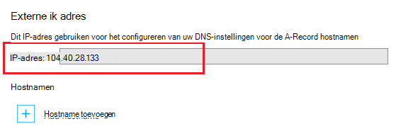

<properties
    pageTitle="Een aangepaste domeinnaam toewijzen aan een Azure-app"
    description="Leer hoe u een aangepaste domeinnaam (aangepaste domein) toewijzen aan uw app in Azure App-Service."
    services="app-service"
    documentationCenter=""
    authors="cephalin"
    manager="wpickett"
    editor="jimbe"
    tags="top-support-issue"/>

<tags
    ms.service="app-service"
    ms.workload="na"
    ms.tgt_pltfrm="na"
    ms.devlang="na"
    ms.topic="article"
    ms.date="07/27/2016"
    ms.author="cephalin"/>

# Een aangepaste domeinnaam toewijzen aan een Azure-app

[AZURE.INCLUDE [web-selector](../../includes/websites-custom-domain-selector.md)]

Dit artikel leest u hoe u handmatig een aangepaste domeinnaam toewijzen aan uw WebApp, mobiele app backend of API-app in [Azure App-Service](../app-service/app-service-value-prop-what-is.md). 

Uw app is al wordt geleverd met een unieke subdomein van azurewebsites.net. Als de naam van uw app **contoso**is, klikt u vervolgens is de domeinnaam bijvoorbeeld **contoso.azurewebsites.net**. U kunt echter een aangepast domein toewijzen de naam van app dus die de URL, zoals `www.contoso.com`, weerspiegelt van uw huisstijl.

>[AZURE.NOTE] U kunt hulp krijgen van Azure experts op de [forums Azure](https://azure.microsoft.com/support/forums/). Ga naar de [site Azure-ondersteuning](https://azure.microsoft.com/support/options/) en klikt u op **Ondersteuning krijgen**voor nog hogere niveau van ondersteuning.

[AZURE.INCLUDE [introfooter](../../includes/custom-dns-web-site-intro-notes.md)]

## Een nieuwe aangepaste domein kopen in Azure-portal

Als u dit nog niet hebt al een aangepaste domeinnaam hebt gekocht, kunt u kopen en deze rechtstreeks in de instellingen van uw app in de [portal van Azure](https://portal.azure.com)beheren. Deze optie kunt u gemakkelijk naar een aangepast domein toewijzen aan uw app of in uw app wordt [Azure verkeer Manager](web-sites-traffic-manager-custom-domain-name.md) of niet. 

Zie [een aangepaste domeinnaam voor de App Service kopen](custom-dns-web-site-buydomains-web-app.md)voor instructies.

## Een aangepast domein dat u hebt gekocht extern toewijzen

Als u een aangepast domein al hebt gekocht van [Azure DNS](https://azure.microsoft.com/services/dns/) of van een derde partij-provider, zijn er drie basisstappen het aangepaste domein toewijzen aan uw app:

1. [ *(Alleen een record)* Get-app IP-adres](#vip).
2. [De DNS-records maken die uw domein bij uw app toewijzen](#createdns). 
    - **Waar**: uw domeinregistrar eigen hulpprogramma voor domeinbeheer (bijvoorbeeld Azure DNS, GoDaddy, enzovoort).
    - **Waarom**: zodat uw domeinregistrar moeten worden opgelost de gewenste aangepaste domein bij uw Azure-app weet.
1. [De aangepaste domeinnaam voor uw Azure app inschakelen](#enable).
    - **Waar**: de [Azure-portal](https://portal.azure.com).
    - **Waarom**: zodat uw app weet reageren op aanvragen voor de aangepaste domeinnaam.
3. [Controleer of DNS-doorgeven](#verify).

### Typen domeinen die u kunt toewijzen

Azure App-Service kunt u de volgende categorieën van aangepaste domeinen toewijzen aan uw app.

- **Hoofddomein** - de naam van het domein dat u bij de domeinregistrar gereserveerd (voorgesteld door het `@` -record, meestal hosten). Bijvoorbeeld **contoso.com**.
- **Subdomein** - elk domein dat zich onder het hoofddomein. Bijvoorbeeld: **www.contoso.com** (voorgesteld door het `www` hosten record).  U kunt verschillende subdomeinen van het dezelfde hoofddomein toewijzen aan andere apps in Azure wordt aangegeven.
- **Jokertekendomein** - [een subdomein waarvan meest linkse DNS-label is `*` ](https://en.wikipedia.org/wiki/Wildcard_DNS_record) (bijvoorbeeld records host `*` en `*.blogs`). Bijvoorbeeld ** \*. contoso.com**.

### Typen DNS-records die u kunt gebruiken

Afhankelijk van uw nodig, kunt u twee verschillende soorten standard DNS-records toe te wijzen van uw aangepaste domein: 

- [A](https://en.wikipedia.org/wiki/List_of_DNS_record_types#A) - kaarten de naam van uw aangepaste domein voor de app Azure virtuele IP-adres rechtstreeks. 
- [CNAME](https://en.wikipedia.org/wiki/CNAME_record) - kaarten uw aangepaste domeinnaam op van uw app Azure domeinnaam, * *&lt;*toepassingsnaam*>. azurewebsites.net**. 

Het voordeel van CNAME is dat deze over IP-adres wijzigingen zich blijft voordoen. Als u verwijderen en uw app opnieuw te maken of van een hogere prijzen laag terug naar de laag **gedeeld wijzigen** , is het virtuele IP-adres van uw app kan veranderen. Via een wijziging is een CNAME-record nog geldig is, terwijl een A-record is een update vereist. 

De zelfstudie ziet u de stappen voor het gebruik van de A-record en ook voor het gebruik van de CNAME-record.

>[AZURE.IMPORTANT] Maak geen een CNAME-record voor uw hoofddomein (dat wil zeggen de ' hoofdmap-record"). Zie [Waarom kan niet een CNAME-record worden gebruikt bij het hoofddomein](http://serverfault.com/questions/613829/why-cant-a-cname-record-be-used-at-the-apex-aka-root-of-a-domain)voor meer informatie.
Gebruik een hoofddomein om aan te wijzen uw Azure-app, in plaats daarvan een A-record op.

## Stap 1. *(Alleen een record)* IP-adres van de app ophalen
Als u wilt toewijzen van een aangepaste domeinnaam gebruiken van een A-record, moet u uw Azure app IP-adres. Als u een CNAME-record te gebruiken wijst, wordt deze stap overslaan en verplaatsen naar het volgende gedeelte.

1.  Meld u aan bij de [portal van Azure](https://portal.azure.com).

2.  Klik op **App-Services** in het linkermenu.

4.  Klik op de app en klik op **aangepaste domeinen**.

6.  Moet u rekening houden met het IP-adres boven hostnamen sectie...

    

7.  Deze portal blade geopend houden. U wordt keert u terug naar deze nadat u de DNS-records maken.

## Stap 2. De DNS-record (s) maken

Meld u aan bij uw domeinregistrar en het gebruik van de functie om toe te voegen een A-record of CNAME-record. Gebruikersinterface van elke registrar is iets anders, dus moet u de documentatie van uw provider raadplegen. Hier volgen echter enkele algemene richtlijnen.

1.  Zoek de pagina voor het beheer van DNS-records. Vindt u koppelingen of gebieden van de site met het label **Domeinnaam**, **DNS**of **De naam van Server Management**. Vaak, vindt u de koppeling door uw accountgegevens weergeven en klik vervolgens op zoek naar een koppeling zoals **My domains**.
2.  Zoekt u een koppeling waarmee u DNS-records toevoegen of bewerken. Dit kan een **Zone file** of **DNS-Records** koppeling of een koppeling van de configuratie **Geavanceerd** zijn.
3.  De record hebt gemaakt en uw wijzigingen op te slaan.
    - [Hier vindt u instructies voor een A-record](#a).
    - [Hier vindt u instructies voor een CNAME-record](#cname).

### Een A-record maken

Als u een A-record wilt toewijzen aan uw Azure app IP-adres, dat is wel moet u zowel een A-record als een TXT-record maken. De A-record is bedoeld voor het omzetten van de DNS zelf, en de TXT-record voor Azure om te bevestigen dat u eigenaar bent van de aangepaste domeinnaam. 

Configureer uw A-record als volgt (@ meestal staat voor het hoofddomein):
 
<table cellspacing="0" border="1">
  <tr>
    <th>Voorbeeld van de FQDN-naam</th>
    <th>Een Host</th>
    <th>Een waarde</th>
  </tr>
  <tr>
    <td>Contoso.com (basis)</td>
    <td>@</td>
    <td>IP-adres van <a href="#vip">stap 1</a></td>
  </tr>
  <tr>
    <td>www.contoso.com (sub)</td>
    <td>www.</td>
    <td>IP-adres van <a href="#vip">stap 1</a></td>
  </tr>
  <tr>
    <td>*. contoso.com (jokertekens)</td>
    <td>*</td>
    <td>IP-adres van <a href="#vip">stap 1</a></td>
  </tr>
</table>

Uw extra TXT-record krijgt de overeenkomst die kaarten uit &lt; *subdomein*>. &lt; *rootdomain*> naar &lt; *toepassingsnaam*>. azurewebsites.net. Configureer uw TXT-record als volgt:

<table cellspacing="0" border="1">
  <tr>
    <th>Voorbeeld van de FQDN-naam</th>
    <th>TXT-Host</th>
    <th>TXT-waarde</th>
  </tr>
  <tr>
    <td>Contoso.com (basis)</td>
    <td>@</td>
    <td>&lt;<i>toepassingsnaam</i>>. azurewebsites.net</td>
  </tr>
  <tr>
    <td>www.contoso.com (sub)</td>
    <td>www.</td>
    <td>&lt;<i>toepassingsnaam</i>>. azurewebsites.net</td>
  </tr>
  <tr>
    <td>*. contoso.com (jokertekens)</td>
    <td>*</td>
    <td>&lt;<i>toepassingsnaam</i>>. azurewebsites.net</td>
  </tr>
</table>

###Maak een CNAME-record

Als u een CNAME-record koppelen aan uw Azure app standaarddomeinnaam gebruikt, kunt u een extra TXT-record dat u met een A-record doen niet nodig hebt. 

>[AZURE.IMPORTANT] Maak geen een CNAME-record voor uw hoofddomein (dat wil zeggen de ' hoofdmap-record"). Zie [Waarom kan niet een CNAME-record worden gebruikt bij het hoofddomein](http://serverfault.com/questions/613829/why-cant-a-cname-record-be-used-at-the-apex-aka-root-of-a-domain)voor meer informatie.
Gebruik een hoofddomein om aan te wijzen uw Azure-app, in plaats daarvan een [A-record](#a) op.

Configureer uw CNAME-record als volgt (@ meestal staat voor het hoofddomein):

<table cellspacing="0" border="1">
  <tr>
    <th>Voorbeeld van de FQDN-naam</th>
    <th>CNAME-Host</th>
    <th>CNAME-waarde</th>
  </tr>
  <tr>
    <td>www.contoso.com (sub)</td>
    <td>www.</td>
    <td>&lt;<i>toepassingsnaam</i>>. azurewebsites.net</td>
  </tr>
  <tr>
    <td>*. contoso.com (jokertekens)</td>
    <td>*</td>
    <td>&lt;<i>toepassingsnaam</i>>. azurewebsites.net</td>
  </tr>
</table>

##Stap 3. De aangepaste domeinnaam voor uw app inschakelen

Terug in het blad **Aangepaste domeinen** in de portal van Azure (Zie [stap 1](#vip)), moet u de volledig gekwalificeerde domeinnaam (FQDN) van uw aangepaste domein toevoegen aan de lijst.

1.  Als u dit nog niet hebt gedaan, aanmelden bij de [portal van Azure](https://portal.azure.com).

2.  Klik op **App-Services** in het linkermenu in de portal Azure.

3.  Klik op de app en klik op **aangepaste domeinen** > **hostname toevoegen**.

4.  De FQDN-naam van uw aangepaste domein toevoegen aan de lijst (bijvoorbeeld **www.contoso.com**).

    

    >[AZURE.NOTE] Azure wordt geprobeerd om te controleren of de domeinnaam die u hier gebruiken. Zorg ervoor dat dat dit is dezelfde domeinnaam waarvoor u een DNS-record hebt gemaakt in [stap 2](#createdns). 

5.  Klik op **valideren**.

6.  Na het klikken op **valideren** Azure wordt starten domeinverificatie werkstroom. Hiermee wordt gecontroleerd op eigendom van het domein, evenals Hostname beschikbaarheid en rapport bewerking is geslaagd of gedetailleerde fout opgetreden bij het beschrijvende guidence over hoe u de fout op te lossen.    

7.  Na succesvolle validatie **toevoegen hostname** van de knop kracht en u kunnen de hostnaam toewijzen. 

8.  Nadat de Azure is voltooid voor het configureren van de naam van uw nieuwe aangepaste domein, gaat u naar de naam van uw aangepaste domein in een browser. De browser geopend uw Azure-app, wat betekent dat de naam van uw aangepaste domein correct is geconfigureerd.

> [AZURE.NOTE] Als de DNS-record is al in gebruik (active domain dienstverlening verkeer scenario) en u moet uw web-app preemptively binden ernaar toevoegen voor verificatie van het domein, klikt u vervolgens gewoon maken een TXT-records als voorbeelden wordt weergegeven in de volgende tabel. Uw extra TXT-record krijgt de overeenkomst die kaarten uit &lt; *subdomein*>. &lt; *rootdomain*> naar &lt; *toepassingsnaam*>. azurewebsites.net. 
> <table cellspacing="0" border="1">
  <tr>
    <th>Voorbeeld van de FQDN-naam</th>
    <th>TXT-Host</th>
    <th>TXT-waarde</th>
  </tr>
  <tr>
    <td>Contoso.com (basis)</td>
    <td>awverify.contoso.com</td>
    <td>&lt;<i>toepassingsnaam</i>>. azurewebsites.net</td>
  </tr>
  <tr>
    <td>www.contoso.com (sub)</td>
    <td>awverify.www.contoso.com</td>
    <td>&lt;<i>toepassingsnaam</i>>. azurewebsites.net</td>
  </tr>
    <tr>
    <td>*. contoso.com (sub)</td>
    <td>awverify.*.contoso.com</td>
    <td>&lt;<i>toepassingsnaam</i>>. azurewebsites.net</td>
  </tr>
</table>
Nadat deze DNS-record is gemaakt, gaat u terug naar Azure-portal en uw aangepaste domeinnaam toevoegen aan uw web-app.
 

##Controleer of de DNS-doorgeven

Nadat u de volgende configuratiestappen uit, kan het enige tijd totdat de wijzigingen worden doorgegeven, afhankelijk van uw DNS-provider duren. U kunt controleren of dat de DNS-doorgifte werkt zoals verwacht met behulp van [http://digwebinterface.com/](http://digwebinterface.com/). Nadat u naar de site zoeken, wordt de hostnamen opgeven in het tekstvak en klikt u op **graven**. Controleer of de resultaten om te bevestigen als de recente wijzigingen zijn doorgevoerd.  

> [AZURE.NOTE] Het doorgeven van de DNS-vermeldingen kan maximaal 48 uur (soms langer) duren. Als u alles goed hebt geconfigureerd, moet u nog steeds moet wachten om door het doorgeven is mislukt.

## Volgende stappen
Informatie over het beveiligen van uw aangepaste domeinnaam met HTTPS door af te [kopen van een SSL-certificaat in Azure wordt aangegeven](web-sites-purchase-ssl-web-site.md) of [een SSL-certificaat vanaf een andere plaats](web-sites-configure-ssl-certificate.md).

>[AZURE.NOTE] Als u aan de slag met Azure App Service wilt voordat u zich registreert voor een Azure-account, gaat u naar de [App-Service probeert](http://go.microsoft.com/fwlink/?LinkId=523751), waar u direct een tijdelijk starter in de browser in de App-Service maken kunt. Geen creditcards vereist; geen verplichtingen.

[Aan de slag met Azure-DNS](../dns/dns-getstarted-create-dnszone.md)  
[DNS-records voor een web-app maken in een aangepast domein](../dns/dns-web-sites-custom-domain.md)  
[Domein van de gemachtigde aan Azure DNS](../dns/dns-domain-delegation.md)

<!-- Images -->
[subdomain]: media/web-sites-custom-domain-name/azurewebsites-subdomain.png
