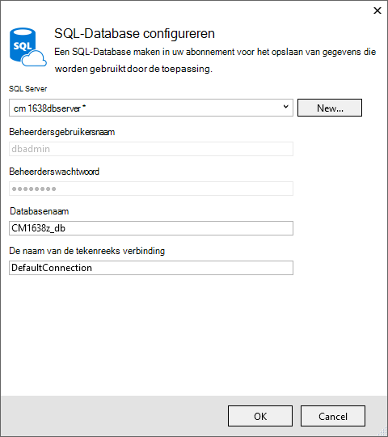
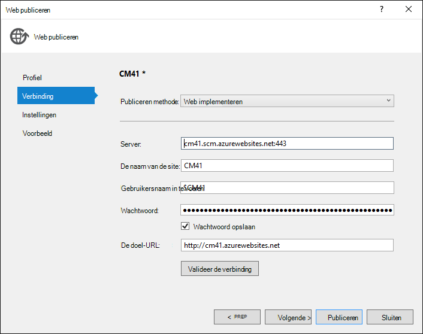
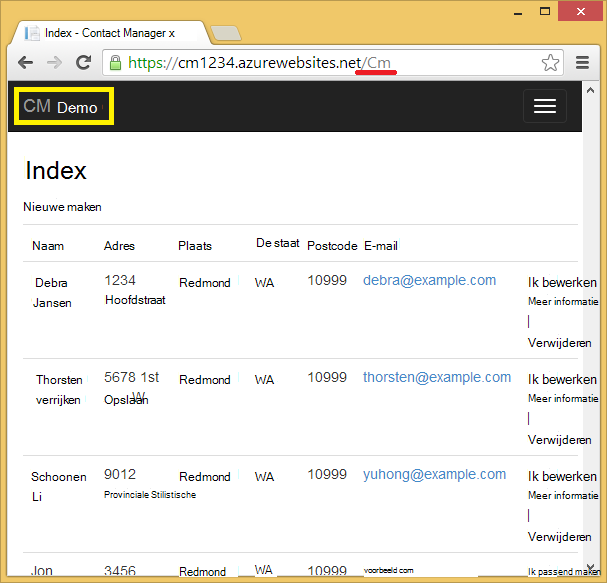

<properties 
    pageTitle="Een ASP.NET-MVC-app met auth en SQL DB maken en implementeren naar Azure App-Service" 
    description="Leer hoe u een ASP.NET MVC 5-app met een SQL-Database back-end ontwikkelen en het dashboard implementeren naar Azure verificatie en machtiging toevoegen." 
    services="app-service\web" 
    documentationCenter=".net" 
    authors="Rick-Anderson" 
    writer="Rick-Anderson" 
    manager="wpickett" 
    editor=""/>

<tags 
    ms.service="app-service-web" 
    ms.workload="web" 
    ms.tgt_pltfrm="na" 
    ms.devlang="dotnet" 
    ms.topic="article" 
    ms.date="03/21/2016" 
    ms.author="riande"/> 

# Een ASP.NET-MVC-app met auth en SQL DB maken en implementeren naar Azure App-Service

Deze zelfstudie leert hoe u een secure WebApp voor ASP.NET MVC 5 waarmee gebruikers zich aanmelden met referenties van Facebook of Google maken. De app is een eenvoudige lijst met contactpersonen die het kader van de entiteit ADO.NET voor toegang tot de database wordt gebruikt. U kunt de app dashboard implementeren naar [Azure App-Service](http://go.microsoft.com/fwlink/?LinkId=529714). 

Klik op de zelfstudie is voltooid, hebt u een secure gegevensgestuurde webtoepassing omhoog in de cloud en uitgevoerd met een cloud-database. De volgende afbeelding ziet u de aanmeldingspagina voor de voltooide toepassing.

![aanmeldingspagina][rxb]

U leert:

* Het maken van een beveiligde ASP.NET MVC 5 webproject in Visual Studio.
* Hoe te verifiëren en autoriseren gebruikers die zich aanmelden met referenties van hun Google- of Facebook-accounts (sociale provider verificatie met [OAuth 2.0](http://oauth.net/2 "http://oauth.net/2")).
* Hoe te verifiëren en autoriseren gebruikers die zich registreren in een database beheerd door de toepassing (lokale verificatie met [ASP.NET-identiteit](http://asp.net/identity/)).
* Hoe u met de eerste ADO.NET entiteit Framework 6 Code lezen en schrijven van gegevens in een SQL-database.
* Hoe entiteit Framework Code eerste migraties gebruiken om te implementeren van een database.
* Hoe voor de opslag van relationele gegevens in de cloud met behulp van Azure SQL-Database.
* Het implementeren van een webproject die gebruikmaakt van een database op een [WebApp](http://go.microsoft.com/fwlink/?LinkId=529714) in Azure App-Service.

>[AZURE.NOTE] Dit is een lange zelfstudie. Als u een snelle introductie over Azure App-Service en Visual Studio webprojecten wilt, raadpleegt u [een ASP.NET-web-app in Azure App Service maken](web-sites-dotnet-get-started.md). Raadpleeg de sectie [Probleemoplossing](#troubleshooting) voor meer info.
>
>Of als u aan de slag met Azure App Service wilt voordat u zich registreert voor een Azure-account, gaat u naar de [App-Service probeert](http://go.microsoft.com/fwlink/?LinkId=523751), waar u direct een tijdelijk starter in de browser in de App-Service maken kunt. Geen creditcards vereist; geen verplichtingen.

## Vereisten voor

Als u wilt deze zelfstudie hebt voltooid, moet u een Microsoft Azure-account. Als u geen account hebt, kunt u [zich registreren voor een gratis proefversie](/pricing/free-trial/?WT.mc_id=A261C142F)of [activeren van de voordelen van uw Visual Studio-abonnee](/pricing/member-offers/msdn-benefits-details/?WT.mc_id=A261C142F) .

Als u wilt uw ontwikkelomgeving hebt ingesteld, moet u [Visual Studio 2013 Update 5](http://go.microsoft.com/fwlink/?LinkId=390521) installeren of hoger, en de meest recente versie van de [Azure SDK voor .NET](http://go.microsoft.com/fwlink/?linkid=324322&clcid=0x409). In dit artikel is geschreven voor Visual Studio Update 4 en SDK punt 2.8.1. Werken de dezelfde instructies voor Visual Studio-2015 met de meest recente [Azure SDK voor .NET](http://go.microsoft.com/fwlink/?linkid=518003&clcid=0x409) is geïnstalleerd, maar sommige schermen er anders uit in de afbeeldingen.

## Een ASP.NET MVC 5-toepassing maken

### Het project maken

1. Klik in het menu **bestand** op **Nieuw Project**.

    

1. Klik in het dialoogvenster **Nieuw Project** uitvouwen **C#** Selecteer **Web** onder **Geïnstalleerde sjablonen**, en selecteer vervolgens **ASP.NET-webtoepassing**. De toepassing **ContactManager**een naam en klik vervolgens op **OK**.

    
 
    **Notitie:** Zorg ervoor dat u 'ContactManager' invoert. Blokken met code die u hebt later kopiëren wordt ervan uitgegaan dat de naam van het project ContactManager. 

1. Selecteer de sjabloon **MVC** in het dialoogvenster **Nieuw ASP.NET-Project** . Controleer of de **verificatie** is ingesteld op **Afzonderlijke gebruikersaccounts**, **Host in de cloud** is ingeschakeld en **App Service** is geselecteerd.

    

1. Klik op **OK**.

1. Het dialoogvenster **Microsoft Azure Web App-instellingen configureren** wordt weergegeven. Mogelijk moet u aanmelden als u dit nog niet hebt gedaan, of Voer uw referenties opnieuw als uw aanmelding is verlopen.

1. Optionele - wijzigen de waarde in de **Web-App-naam** vak (Zie onderstaande afbeelding).

    De URL van de web-app worden {naam} .azurewebsites .net, zodat de naam moet uniek zijn in het domein azurewebsites.net. De configuratie wordt een unieke naam voorgesteld door een getal naar de naam van het project "ContactManager" toe te voegen en dat voor deze zelfstudie is geen probleem.

5. Klik in de **resourcegroep** vervolgkeuzelijst Selecteer een bestaande groep of een **nieuwe resourcegroep maken**(Zie onderstaande afbeelding). 

    Als u liever, kunt u een resourcegroep die u al hebt. Maar als u een nieuwe resourcegroep maken en deze alleen voor deze zelfstudie gebruiken, deze eenvoudig alle Azure resources die u hebt gemaakt voor de zelfstudie wanneer u klaar bent met hen verwijderen. Zie [overzicht van de Azure resourcemanager](../azure-resource-manager/resource-group-overview.md)voor informatie over resourcegroepen. 

5. In het **App-serviceplan** Selecteer vervolgkeuzelijst Selecteer een bestaand abonnement of **maken nieuwe App-Service plannen**(Zie onderstaande afbeelding).

    Als u liever, kunt u een App Service-abonnement dat u al hebt. Zie voor informatie over de App-Service-abonnementen, [uitgebreide overzicht van Azure App Service-abonnementen](../app-service/azure-web-sites-web-hosting-plans-in-depth-overview.md). 

1. Tik op **verkennen aanvullende Azure services** als u wilt toevoegen van een SQL-database.

    

1. Tik op de **+** pictogram voor het toevoegen van een SQL-database.

    

1. Tik op **Nieuw** in het dialoogvenster **SQL-Database configureren** :

    

1. Voer een naam voor de beheerder en een sterk wachtwoord.

    

    Naam van de server moet uniek zijn. Dit kan kleine letters, cijfers en afbreekstreepjes bevatten. Het kan niet een streepje bevat. De gebruikersnaam en wachtwoord zijn nieuwe referenties die u voor de nieuwe server maakt. 

    Als u al een database-server hebt, kunt u die in plaats van het maken van een selecteren. Databaseservers zijn een belangrijk resource en u doorgaans wilt maken van meerdere databases op de server voor testen en ontwikkeling in plaats van een databaseserver per database maken. Echter voor deze zelfstudie hoeft u de server tijdelijk en door te maken van de server in dezelfde resourcegroep als de website u vergemakkelijkt verwijderen van beide web app en database resources door de resourcegroep verwijderen wanneer u klaar bent met de zelfstudie. 

    Als u een bestaande databaseserver selecteert, zorg er dan voor dat uw WebApp en de database zich in dezelfde regio.

    

4. Tik op **maken**.

    Visual Studio het ContactManager webproject maakt, worden de resourcegroep en App serviceplan die u hebt opgegeven, worden gemaakt en maakt u een web-app in Azure App-Service met de naam die u hebt opgegeven.

### Instellen van de paginakoptekst en voettekst

1. Open het bestand *Layout.cshtml* in de map *Views\Shared* in **Solution Explorer** .

    ![_Layout.cshtml in Solution Explorer][newapp004]

1. Vervang de ActionLink in het bestand *Layout.cshtml* door de volgende code.

    @Html.ActionLink("CMDemo","Index","contactpersonen', nieuwe {gebied = ' "}, nieuwe { @class ="navigatiebalk-brand"})
                   

    Zorg ervoor dat u de derde parameter 'Thuis' naar 'Contactpersonen' wijzigen. De bovenstaande markeringen maakt een koppeling 'Contactpersonen' op elke pagina met de methode Index van de controller uit contactpersonen. Wijzig de toepassingsnaam van de in de kop en de voettekst wordt "Mijn ASP.NET-toepassing" en 'Toepassingsnaam' in "Contact Manager" en "CM Demo". 
 
### De toepassing lokaal uitvoeren

1. Druk op CTRL + F5 om uit te voeren van de app.

    De startpagina van de toepassing wordt weergegeven in de standaardbrowser.

    

Hiermee wordt gevormd door alle u moet doen voor nu aan de toepassing die u naar Azure implementeren gaat maken. 

## De toepassing Azure implementeren

1. Visual Studio, met de rechtermuisknop op het project in **Solution Explorer** en selecteer **publiceren** in het snelmenu.

    
    
    De wizard **Publiceren** wordt geopend.

1. Klik in het dialoogvenster **Web publiceren** op **publiceren**.

    

    De toepassing die u hebt gemaakt, wordt nu uitgevoerd in de cloud. De volgende keer dat u de toepassing implementeren wordt alleen gewijzigde (of nieuwe) bestanden geïmplementeerd.

    

## SSL inschakelen voor het Project ##

1. **Oplossing Explorer**het project **ContactManager** , klik op F4 om het venster **Eigenschappen** te openen.

3. Wijzig de optie **SSL ingeschakeld** in **waar**. 

4. Kopieer de **URL van SSL**.

    De SSL-URL is https://localhost:44300 / tenzij u SSL-WebApps eerder hebt gemaakt.

    ![SSL inschakelen][rxSSL]
 
1. Klik met de rechtermuisknop op het **Contact Manager** -project in **Solution Explorer**en klik op **Eigenschappen**.

1. Klik op het tabblad **Web** .

1. Wijzig de **Project-Url** de **URL van de SSL** gebruiken en sla de pagina (besturingselement S).

    
 
1. Controleer of Internet Explorer de browser waarmee Visual Studio wordt geopend, zoals wordt weergegeven in de onderstaande afbeelding:

    

    De browser kiezer kunt u opgeven van de browser die Visual Studio wordt gestart. U kunt meerdere browsers selecteren en Visual Studio elke browser bij te werken wanneer u wijzigingen aanbrengt. Zie voor meer informatie [Koppeling naar Browser gebruiken in Visual Studio-2013](http://www.asp.net/visual-studio/overview/2013/using-browser-link).

    

1. Druk op CTRL + F5 om de toepassing te starten. Klik op **Ja** om te starten van het proces van het zelfondertekende certificaat dat IIS Express is gegenereerd vertrouwen.

     

1. Het dialoogvenster **Beveiligingswaarschuwing** lezen en klik vervolgens op **Ja** als u wilt het certificaat dat staat voor **localhost**installeren.

    

1. IE ziet u de pagina *voor thuisgebruik* en er zijn geen SSL-waarschuwingen.

     

     Internet Explorer is een goede keuze wanneer u SSL gebruikt, omdat deze accepteert van het certificaat en ziet u de inhoud HTTPS zonder waarschuwing. Google Chrome en Microsoft Edge ook het certificaat te accepteren. Firefox gebruikt een eigen certificaat opslaan, zodat het wordt een waarschuwing weergegeven.

     

## Een database toevoegen aan de toepassing

Vervolgens moet u de app om toe te voegen van de mogelijkheid wilt weergeven en bijwerken van contactpersonen en opslaan van de gegevens in een database bijwerken. De app wordt de entiteit Framework (EF) gebruikt om de database te maken en het te lezen en bijwerken met gegevens.

### Gegevens model klassen voor de contactpersonen toevoegen

U eerst een eenvoudige gegevensmodel maken in code.

1. In **Solution Explorer**met de rechtermuisknop op de map modellen, klikt u op **toevoegen**en klik vervolgens **Class**.

    

2. Het nieuwe klassebestand *Contact.cs*een naam in het dialoogvenster **Nieuw Item toevoegen** en klik vervolgens op **toevoegen**.

    ![Dialoogvenster Nieuw Item toevoegen][adddb002]

3. De inhoud van het bestand Contact.cs vervangen door de volgende code.

        using System.ComponentModel.DataAnnotations;
        using System.Globalization;
        namespace ContactManager.Models
        {
            public class Contact
            {
                public int ContactId { get; set; }
                public string Name { get; set; }
                public string Address { get; set; }
                public string City { get; set; }
                public string State { get; set; }
                public string Zip { get; set; }
                [DataType(DataType.EmailAddress)]
                public string Email { get; set; }
            }
        }
De klasse **Neem contact op met** definieert de gegevens die u voor elke contactpersoon, plus een primaire sleutel, *ContactID*, die nodig is door de database wilt opslaan.

### Webpagina's waarmee app-gebruikers kunnen werken met de contactpersonen maken

De functie voor ASP.NET MVC steigers kunt code waarmee automatisch genereren maken, lezen, bijwerken en verwijderen (CRUD) acties. 

1. Maken van het project **(Ctrl + Shift + B)**. (U moet het project build vóór het gebruik van de om steigers.)
 
1. In **Solution Explorer**met de rechtermuisknop op de map Controllers en klikt u op **toevoegen**en klik vervolgens op **Controller**.

    ![Controller in het contextmenu van de map Controllers toevoegen][addcode001]

5. Klik in het dialoogvenster **Toevoegen Scaffold** **MVC 5 Controller met weergaven, met EF** selecteren en klik op **toevoegen**.
    
    

1. Selecteer in het vak van de vervolgkeuzelijst **Model klasse** **contactpersoon (ContactManager.Models)**. (Zie de onderstaande afbeelding.)

1. Selecteer in de **gegevens context class**, **ApplicationDbContext (ContactManager.Models)**. De **ApplicationDbContext** worden gebruikt voor zowel het lidmaatschap DB en onze gegevens van contactpersonen.

    

1. Klik op **toevoegen**.

   Visual Studio Hiermee maakt u een controller met methoden en weergaven voor CRUD databasebewerkingen voor **contactpersoon** objecten.

## Migraties inschakelen, de database maken, voorbeeldgegevens en een initialisatiefunctie gegevens toevoegen ##

De volgende taak is de functie [Code eerste migraties](http://msdn.microsoft.com/library/hh770484.aspx) inschakelen om te maken van databasetabellen op basis van het gegevensmodel dat u hebt gemaakt.

1. Selecteer in het menu **Extra** **NuGet Package Manager** en klik vervolgens op **Package Manager-Console**.

    

2. Voer de volgende opdracht in het venster **Package Manager-Console** :

        enable-migrations

    De opdracht **inschakelen-migraties** maakt u een map *migraties* en verschijnt er in deze map een *Configuration.cs* -bestand dat u als u wilt vullen van de database en configureren van migraties kunt bewerken. 

2. Voer de volgende opdracht in het venster **Package Manager-Console** :

        add-migration Initial

    De opdracht **toevoegen-migratie aanvankelijke** genereert een bestand met de naam ** &lt;date_stamp&gt;eerste** in de map *migraties* . De code in dit bestand wordt gemaakt van de databasetabellen. De eerste parameter ( **eerste** ) wordt gebruikt voor de naam van het bestand te maken. Hier ziet u de nieuwe klassenbestanden in **Solution Explorer**.

    De methode **Up** wordt gemaakt van de tabel contactpersonen in de **eerste** klasse, en de **pijl omlaag** -methode (gebruikt wanneer u wilt teruggaan naar de vorige staat) worden deze.

3. Open het bestand *Migrations\Configuration.cs* . 

4. Voeg de volgende `using` instructie. 

         using ContactManager.Models;

5. De methode *zaad* vervangen door de volgende code:

        protected override void Seed(ContactManager.Models.ApplicationDbContext context)
        {
            context.Contacts.AddOrUpdate(p => p.Name,
               new Contact
               {
                   Name = "Debra Garcia",
                   Address = "1234 Main St",
                   City = "Redmond",
                   State = "WA",
                   Zip = "10999",
                   Email = "debra@example.com",
               },
                new Contact
                {
                    Name = "Thorsten Weinrich",
                    Address = "5678 1st Ave W",
                    City = "Redmond",
                    State = "WA",
                    Zip = "10999",
                    Email = "thorsten@example.com",
                },
                new Contact
                {
                    Name = "Yuhong Li",
                    Address = "9012 State st",
                    City = "Redmond",
                    State = "WA",
                    Zip = "10999",
                    Email = "yuhong@example.com",
                },
                new Contact
                {
                    Name = "Jon Orton",
                    Address = "3456 Maple St",
                    City = "Redmond",
                    State = "WA",
                    Zip = "10999",
                    Email = "jon@example.com",
                },
                new Contact
                {
                    Name = "Diliana Alexieva-Bosseva",
                    Address = "7890 2nd Ave E",
                    City = "Redmond",
                    State = "WA",
                    Zip = "10999",
                    Email = "diliana@example.com",
                }
                );
        }

    Deze code wordt geïnitialiseerd (zaden) de database met contactgegevens. Zie voor meer informatie over de database seeding, [Seeding en DBs foutopsporing entiteit Framework (EF)](http://blogs.msdn.com/b/rickandy/archive/2013/02/12/seeding-and-debugging-entity-framework-ef-dbs.aspx). Het project om te controleren of dat er zijn geen fouten compileren maakt.

6. Voer in de **Package Manager-Console** in de opdracht:

        update-database

    ![Package Manager Console-opdrachten][addcode009]

    De **update-database** wordt de eerste migratie waarmee de database wordt uitgevoerd. Standaard wordt de database gemaakt als een SQL Server Express LocalDB-database. 

7. Druk op CTRL + F5 om de toepassing te starten en klik op de koppeling **CM Demo** ; of Ga naar https://localhost:(port#)/Cm. 

    De toepassing ziet u de gegevens en koppelingen voor bewerken, details en verwijderen. U kunt maken, bewerken, verwijderen en weergeven van gegevens.

    ![MVC weergave van gegevens][rx2]

## Een OAuth2-Provider toevoegen

>[AZURE.NOTE] Voor uitgebreide instructies over het gebruik van de Google en Facebook developer portal-sites, deze zelfstudie koppelingen naar zelfstudies op de ASP.NET-site. Echter wijzigen Google en Facebook hun sites vaker dan deze zelfstudies worden bijgewerkt en ze nu verouderd zijn. Als u problemen ondervindt bij het volgen van de aanwijzingen, raadpleegt u de aanbevolen Disqus opmerking aan het einde van deze zelfstudie voor een overzicht van wat er is gewijzigd. 

[OAuth] (http://oauth.net/ "http://OAuth.NET/") is een open protocol waarmee beveiligde verificatie in een eenvoudige en de standaardversie methode uit, mobiele, en de bureaubladtoepassing webtoepassingen. De sjabloon ASP.NET MVC internet gebruikt OAuth Facebook, Twitter, Google en Microsoft weergegeven als verificatieproviders. Hoewel deze zelfstudie wordt alleen Google als de verificatieprovider gebruikt, kunt u de code als u wilt gebruiken op een van deze providers eenvoudig wijzigen. De stappen voor het implementeren van andere providers zijn vergelijkbaar met de stappen die u in deze zelfstudie te zien. Gebruik Facebook als een verificatieprovider, moet u [MVC 5-App met Facebook, Twitter, LinkedIn en Google OAuth2 eenmalige aanmelding ](http://www.asp.net/mvc/tutorials/mvc-5/create-an-aspnet-mvc-5-app-with-facebook-and-google-oauth2-and-openid-sign-on)weergegeven.

Deze zelfstudie gebruikt naast verificatie, rollen willen implementeren autorisatie. Alleen gebruikers die u aan de rol *canEdit toevoegt* kunnen om gegevens te wijzigen zijn (dat wil zeggen, maken, bewerken of verwijderen van contactpersonen).

1. Volg de instructies in [MVC 5 App met Facebook, Twitter, LinkedIn en Google OAuth2 eenmalige aanmelding](http://www.asp.net/mvc/tutorials/mvc-5/create-an-aspnet-mvc-5-app-with-facebook-and-google-oauth2-and-openid-sign-on#goog) onder **een Google-app voor OAuth 2 voor het instellen van een Google-app voor OAuth2 maken**.

3. Uitvoeren en testen van de app om te bevestigen dat u kunt zich aanmeldt met Google-verificatie.

2. Als u maken van sociale login knoppen met providerspecifieke pictogrammen wilt, raadpleegt u [heel sociale login knoppen voor ASP.NET MVC 5](http://www.jerriepelser.com/blog/pretty-social-login-buttons-for-asp-net-mvc-5)

## Lidmaatschap van de API gebruiken

In deze sectie wordt u een lokale gebruiker en de rol *canEdit* toevoegen aan de database lidmaatschap. Alleen de gebruikers in de rol *canEdit* kunnen gegevens bewerken. Er is een goede gewoonte aan de naam van rollen door de acties die ze uitvoeren kunnen, dus *canEdit* heeft de voorkeur boven een rol met de naam van de *beheerder*. Wanneer uw toepassing ontwikkeld, kunt u nieuwe functies zoals *canDeleteMembers* in plaats van de minder beschrijvende *superAdmin*toevoegen.

1. Open het bestand *migrations\configuration.cs* en voeg de volgende `using` instructies:

        using Microsoft.AspNet.Identity;
        using Microsoft.AspNet.Identity.EntityFramework;

1. De volgende **AddUserAndRole** methode toevoegen aan de klas:

        bool AddUserAndRole(ContactManager.Models.ApplicationDbContext context)
        {
            IdentityResult ir;
            var rm = new RoleManager<IdentityRole>
                (new RoleStore<IdentityRole>(context));
            ir = rm.Create(new IdentityRole("canEdit"));
            var um = new UserManager<ApplicationUser>(
                new UserStore<ApplicationUser>(context));
            var user = new ApplicationUser()
            {
                UserName = "user1@contoso.com",
            };
            ir = um.Create(user, "P_assw0rd1");
            if (ir.Succeeded == false)
                return ir.Succeeded;
            ir = um.AddToRole(user.Id, "canEdit");
            return ir.Succeeded;
        }

1. De nieuwe methode bellen vanuit de methode **zaad** :

        protected override void Seed(ContactManager.Models.ApplicationDbContext context)
        {
            AddUserAndRole(context);
            context.Contacts.AddOrUpdate(p => p.Name,
                // Code removed for brevity
        }

    De volgende afbeeldingen ziet u de wijzigingen in *zaad* :

    

    Deze code Hiermee maakt u een nieuwe rol *canEdit*genoemd, maakt een nieuwe lokale gebruiker *user1@contoso.com*, en telt *user1@contoso.com* aan de rol *canEdit* . Zie voor meer informatie de [ASP.NET-identiteit zelfstudies](http://www.asp.net/identity/overview/features-api) op de ASP.NET-site.

## Tijdelijke Code gebruiken om nieuwe sociale Login gebruikers toevoegen aan de canEdit rol  ##

In deze sectie wijzigt u tijdelijk de methode **ExternalLoginConfirmation** in de controller Account om toe te voegen van nieuwe gebruikers met een OAuth-provider aan de rol *canEdit* registreren. We hopen dat op te geven van een hulpmiddel vergelijkbaar met [WSAT](http://msdn.microsoft.com/library/ms228053.aspx) in de toekomst waarmee u kunt maken en bewerken van gebruikersaccounts en rollen. U kunt tot die tijd dezelfde functie uitvoeren met behulp van de tijdelijke code.

1. Open het bestand **Controllers\AccountController.cs** en Ga naar de methode **ExternalLoginConfirmation** .

1. De volgende oproep door naar **AddToRoleAsync** vlak voor het gesprek **SignInAsync** toevoegen.

        await UserManager.AddToRoleAsync(user.Id, "canEdit");

   De bovenstaande code wordt de zojuist geregistreerde gebruiker toegevoegd aan de rol 'canEdit', waarmee ze toegang krijgt tot actie methoden (bewerken) gegevens wijzigen. Het codefragment van de volgende ziet u de nieuwe regel met code in de context.

          // POST: /Account/ExternalLoginConfirmation
          [HttpPost]
          [AllowAnonymous]
          [ValidateAntiForgeryToken]
          public async Task ExternalLoginConfirmation(ExternalLoginConfirmationViewModel model, string returnUrl)
          {
             if (User.Identity.IsAuthenticated)
             {
                return RedirectToAction("Index", "Manage");
             }
             if (ModelState.IsValid)
             {
                // Get the information about the user from the external login provider
                var info = await AuthenticationManager.GetExternalLoginInfoAsync();
                if (info == null)
                {
                   return View("ExternalLoginFailure");
                }
                var user = new ApplicationUser { UserName = model.Email, Email = model.Email };
                var result = await UserManager.CreateAsync(user);
                if (result.Succeeded)
                {
                   result = await UserManager.AddLoginAsync(user.Id, info.Login);
                   if (result.Succeeded)
                   {
                      await UserManager.AddToRoleAsync(user.Id, "canEdit");
                      await SignInManager.SignInAsync(user, isPersistent: false, rememberBrowser: false);
                      return RedirectToLocal(returnUrl);
                   }
                }
                AddErrors(result);
             }
             ViewBag.ReturnUrl = returnUrl;
             return View(model);
          }

Verderop in deze zelfstudie implementeert u de toepassing Azure, waarin u wordt aanmelden met Google of een andere provider van derden verificatie. Hiermee wordt uw nieuw ingeschreven account toevoegen aan de rol *canEdit* . Iedereen die wordt gevonden URL van uw web-app en heeft een Google-ID kan vervolgens uw database bijwerken en registreren. Als u wilt voorkomen dat anderen hierbij, kunt u de site stoppen. U kunt wel om te controleren wie er deelneemt aan de rol *canEdit* aan de hand van de database.

Klik op de pijltoets-omhoog om de volgende opdracht weer te geven in de **Beheerconsole van pakket** :

        Update-Database

De opdracht **Update-Database** wordt uitgevoerd de methode **zaad** en die wordt uitgevoerd de **AddUserAndRole** methode die u eerder hebt toegevoegd. De methode **AddUserAndRole** wordt gemaakt van de gebruiker *user1@contoso.com* en voegt ze toe aan de rol *canEdit* .

## De toepassing met SSL en het kenmerk autoriseren beveiligen ##

In deze sectie kunt u het kenmerk [autoriseren](http://msdn.microsoft.com/library/system.web.mvc.authorizeattribute.aspx) beperken van toegang aan de actie methoden toepassen. Anonieme gebruikers kunnen alleen de **Index** actie-methode van de startpagina controller weergeven. Geregistreerde gebruikers is mogelijk om gegevens van contactpersonen (de **Index** en **Details van** pagina's van de controller Cm) en de pagina over de pagina contactpersoon weer te geven. Alleen gebruikers in de rol *canEdit* kunnen methoden voor clienttoegang actie die gegevens wijzigen.

1. Open het bestand *App_Start\FilterConfig.cs* en de methode *RegisterGlobalFilters* vervangen door het volgende voorbeeld (waarin de twee filters toegevoegd):

        public static void RegisterGlobalFilters(GlobalFilterCollection filters)
        {
            filters.Add(new HandleErrorAttribute());
            filters.Add(new System.Web.Mvc.AuthorizeAttribute());
            filters.Add(new RequireHttpsAttribute());
        }
        
    Deze code wordt het filter [autoriseren](http://msdn.microsoft.com/library/system.web.mvc.authorizeattribute.aspx) en het filter [https vereisen](http://msdn.microsoft.com/library/system.web.mvc.requirehttpsattribute.aspx) toegevoegd aan de toepassing. Het filter [autoriseren](http://msdn.microsoft.com/library/system.web.mvc.authorizeattribute.aspx) voorkomt dat anonieme gebruikers toegang krijgen tot alle methoden in de toepassing. U kunt het kenmerk [AllowAnonymous](http://blogs.msdn.com/b/rickandy/archive/2012/03/23/securing-your-asp-net-mvc-4-app-and-the-new-allowanonymous-attribute.aspx) afmelden bij de vereiste autorisatie in een paar methoden, zodat anonieme gebruikers aanmelden kunnen en de startpagina van Lotus kunnen weergeven. De [https vereisen](http://msdn.microsoft.com/library/system.web.mvc.requirehttpsattribute.aspx) is vereist dat alle toegang tot de web-app via HTTPS.

    Een alternatief benadering is het kenmerk [autoriseren](http://msdn.microsoft.com/library/system.web.mvc.authorizeattribute.aspx) en het kenmerk [https vereisen](http://msdn.microsoft.com/library/system.web.mvc.requirehttpsattribute.aspx) wilt toevoegen aan elke controller, maar nieuwsbrief veiligheidsoverwegingen toepassen op de hele toepassing. Door deze toe te voegen globaal, elke nieuwe controller en een actie methode die u hebt toegevoegd automatisch is beveiligd--u niet hoeft te onthouden ze toe te passen. Zie [uw ASP.NET MVC-App en het nieuwe AllowAnonymous-kenmerk beveiligen](http://blogs.msdn.com/b/rickandy/archive/2012/03/23/securing-your-asp-net-mvc-4-app-and-the-new-allowanonymous-attribute.aspx)voor meer informatie. 

1. Het kenmerk [AllowAnonymous](http://blogs.msdn.com/b/rickandy/archive/2012/03/23/securing-your-asp-net-mvc-4-app-and-the-new-allowanonymous-attribute.aspx) toevoegen aan de methode **Index** van de controller start. Het kenmerk [AllowAnonymous](http://blogs.msdn.com/b/rickandy/archive/2012/03/23/securing-your-asp-net-mvc-4-app-and-the-new-allowanonymous-attribute.aspx) kunt u wit-lijst de methoden die u wilt afmelden bij autorisatie. 

        public class HomeController : Controller
        {
          [AllowAnonymous]
          public ActionResult Index()
          {
             return View();
          }

    Als u een globale zoeken naar *AllowAnonymous*doet, ziet u dat het wordt gebruikt in de methoden login en registratie van de controller Account.

1. Voeg in *CmController.cs*, `[Authorize(Roles = "canEdit")]` aan de methoden HttpGet en HttpPost die gegevens (maken, bewerken, verwijderen, elke methode actie, behalve van de Index en Details) in de controller *Cm* wijzigen. Hieronder vindt u een deel van de voltooide code: 

        // GET: Cm/Create
        [Authorize(Roles = "canEdit")]
        public ActionResult Create()
        {
           return View(new Contact { Address = "123 N 456 W",
            City="Great Falls", Email = "ab@cd.com", Name="Joe Smith", State="MT",
           Zip = "59405"});
        }
        // POST: Cm/Create
        // To protect from overposting attacks, please enable the specific properties you want to bind to, for 
        // more details see http://go.microsoft.com/fwlink/?LinkId=317598.
        [HttpPost]
        [ValidateAntiForgeryToken]
         [Authorize(Roles = "canEdit")]
        public ActionResult Create([Bind(Include = "ContactId,Name,Address,City,State,Zip,Email")] Contact contact)
        {
            if (ModelState.IsValid)
            {
                db.Contacts.Add(contact);
                db.SaveChanges();
                return RedirectToAction("Index");
            }
            return View(contact);
        }
        // GET: Cm/Edit/5
        [Authorize(Roles = "canEdit")]
        public ActionResult Edit(int? id)
        {
            if (id == null)
            {
                return new HttpStatusCodeResult(HttpStatusCode.BadRequest);
            }
            Contact contact = db.Contacts.Find(id);
            if (contact == null)
            {
                return HttpNotFound();
            }
            return View(contact);
        }
        
1. Druk op CTRL + F5 om de toepassing te starten.

1. Als u nog steeds van een eerdere sessie bent aangemeld, druk op de koppeling voor **Afmelden** .

1. Klik op de **over** of een **contactpersoon** koppelingen. U wordt omgeleid naar de aanmeldingspagina omdat anonieme gebruikers deze pagina's niet weergeven.

1. Klik op de koppeling **registreren als een nieuwe gebruiker** en voeg een lokale gebruiker met e-mail *joe@contoso.com*. Controleer of *Jan* kunt over thuis, weergeven en neem contact op met pagina's. 

    

1. Klik op de koppeling *CM Demo* en controleer of u de gegevens worden weergegeven.

1. Klik op een bewerkingskoppeling op de pagina, u omgeleid naar de aanmeldingspagina (omdat een nieuwe lokale gebruiker is niet toegevoegd aan de rol *canEdit* ).

1. Meld u aan als *user1@contoso.com* met een wachtwoord van 'P_assw0rd1' (de '0' in "word" is nul). U wordt omgeleid naar de pagina bewerken die u eerder hebt geselecteerd. 
2. 

    Als u niet kunt aanmelden met dat account en wachtwoord, probeer het wachtwoord van de broncode kopiëren en plakken. Als u nog steeds niet kunt aanmelden, controleert u de kolom **gebruikersnaam** van de tabel **AspNetUsers** om te controleren of *user1@contoso.com* is toegevoegd. 

1. Controleer of dat u kunt gegevenswijzigingen aanbrengen.

## De app implementeren naar Azure

1. Visual Studio, met de rechtermuisknop op het project in **Solution Explorer** en selecteer **publiceren** in het snelmenu.

    ![In het contextmenu project publiceren][firsdeploy003]

    De wizard **Publiceren** wordt geopend.

1. Klik op het tabblad **Instellingen** aan de linkerkant van het dialoogvenster **Web publiceren** . 

2. Selecteer onder **ApplicationDbContext** de database die u hebt gemaakt wanneer u het project hebt gemaakt.
   

1. Selecteer onder **ContactManagerContext**, **Eerste migraties Code uitvoeren**.

    

1. Klik op **publiceren**.

1. Meld u aan als *user1@contoso.com* (met een wachtwoord van "P_assw0rd1") en controleer of u gegevens kunt bewerken.

1. Meld u af.

1. Ga naar de [Google-Console voor ontwikkelaars](https://console.developers.google.com/) en klik op de **referenties** tabblad update de omleiding URI's en JavaScript Orgins gebruik van de Azure-URL.

1. Meld u aan met Google- of Facebook. Die de Google- of Facebook-account aan de rol **canEdit** wordt toegevoegd. Als u een fout HTTP 400 met het bericht *de omleiding URI in het verzoek: https://contactmanager {mijn version}.azurewebsites.net/signin-google niet overeenkomt met een geregistreerde omleiding URI.*, moet u wachten totdat de wijzigingen zijn doorgegeven. Als u dit foutbericht na meer dan een paar minuten krijgt, controleert u of de URI's in orde zijn.

### De web-app om te voorkomen dat anderen registreert stoppen  

1. Ga naar in **Server Explorer** **Azure > App Service > {uw resourcegroep} > {uw web-app}**.

4. Met de rechtermuisknop op de web-app en selecteer **stoppen**. 

    U kunt ook van de [Azure-Portal](https://portal.azure.com/), gaat u naar de web-app blade vervolgens klikt u op het pictogram **stoppen** boven aan het blad.

    

### Verwijderen van AddToRoleAsync, publiceren en testen

1. Uitschakelen of verwijderen van de volgende code uit de methode **ExternalLoginConfirmation** in de controller Account:

        await UserManager.AddToRoleAsync(user.Id, "canEdit");

1. Het project (dat het bestandswijzigingen worden opgeslagen en wordt gecontroleerd of er geen fouten compileren) maakt.

5. Met de rechtermuisknop op het project in **Solution Explorer** en selecteer **publiceren**.

       
    
4. Klik op de knop **Voorbeeld starten** . Alleen de bestanden die moeten worden bijgewerkt zijn geïmplementeerd.

5. Start de WebApp van Visual Studio of van de Portal. **Niet mogelijk om te publiceren, terwijl de web-app is gestopt**.

    

5. Ga terug naar Visual Studio en klik op **publiceren**.

3. Uw Azure-App wordt geopend in de browser. Als u bent aangemeld, meld u af, zodat u de startpagina van Lotus als anonieme gebruiker kunt bekijken.  

4. Klik op de koppeling **over** . U wordt omgeleid naar de Log in pagina.

5. Klik op de koppeling **hebt geregistreerd** in het logboek in de pagina en lokale account maken. We gebruiken deze lokale account om te controleren of u toegang hebt tot de gelezen alleen pagina's, maar u geen toegang tot de pagina's die gegevens (die zijn beveiligd met de rol *canEdit* ) wijzigen. In deze zelfstudie wordt u later op toegang tot een lokale account verwijderen. 

    

1. Controleer of u kunt navigeren naar de pagina's *over* - en *contactgegevens* .

    

1. Klik op de koppeling **CM Demo** om te navigeren naar de controller **Cm** . U kunt ook *Cm* toevoegen aan de URL. 

    
 
1. Klik op een bewerkingskoppeling. 

    U wordt omgeleid naar de aanmeldingspagina. 

2. Klik onder **het gebruik van een andere service aan te melden**, klikt u op Google of Facebook en log aan met het account dat u eerder hebt geregistreerd. (Als u snel werkt en uw sessiecookie heeft geen time-out, u wordt automatisch aangemeld met de Google- of Facebook-account die u eerder hebt gebruikt.)

2. Controleer of dat u gegevens terwijl u bent aangemeld bij dat account kunt bewerken.

    **Notitie:** U kunt geen zich afmeldt bij Google van deze app en log naar een ander google-account met dezelfde browser. Als u één browser gebruikt, wordt er naar Google en meld u af. U kunt aanmelden met een ander account uit de dezelfde verificator van derden (zoals Google) met behulp van een andere browser.

    Als u niet de naam van de eerste en laatste van de gegevens van uw Google-account hebt ingevuld, wordt een NullReferenceException optreden.

## Bekijk de SQL Azure DB ##

1. Ga naar in **Server Explorer** **Azure > SQL-Databases > {uw database}**

2. Klik met de rechtermuisknop op de database en selecteert u **openen in SQL Server-Object Explorer**.
 
    
 
3. Als u nog niet eerder hebt verbonden met deze database, wordt u mogelijk gevraagd een firewallregel om in te schakelen voor uw huidige IP-adres wilt toevoegen. Het IP-adres zijn vooraf ingevuld. Klik op **Firewallregel toevoegen** om in te schakelen van access.

    

3. Meld u aan bij de database met de gebruikersnaam en wachtwoord dat u hebt opgegeven toen u de database-server hebt gemaakt. 
 
1. Klik met de rechtermuisknop op de tabel **AspNetUsers** en selecteer **Gegevens weergeven**.

    
 
1. Opmerking de Id van de Google-account dat u in de rol **canEdit** geregistreerd bij en de Id van *user1@contoso.com*. Deze moet alleen gebruikers in de rol **canEdit** . (U moet controleren die in de volgende stap.)

    
 
2. Klik met de rechtermuisknop op **AspNetUserRoles** en selecteert u **Gegevens weergeven**in **SQL Server-Object Explorer**.

    
 
3. Controleer of de **gebruikers-id** van *user1@contoso.com* en de Google-account dat u geregistreerd. 

## Problemen oplossen

Als u problemen ondervindt, vindt hier u enkele suggesties voor wat u kunt proberen.

* Fouten inrichting SQL Database - te controleren of u de huidige SDK is geïnstalleerd. Versies vóór punt 2.8.1 hebben een fout die in sommige gevallen fouten veroorzaakt bij het tegenover wordt geprobeerd om de database-server of de database te maken.
* Foutbericht "bewerking wordt niet ondersteund voor uw abonnementsvorm aanbieding" bij het maken van Azure resources - zelfde als hierboven.
* Fouten bij de implementatie - verstandig via het artikel [eenvoudige ASP.NET-implementatie](web-sites-dotnet-get-started.md) . Dat implementatiescenario eenvoudiger is en als u hetzelfde probleem hebt er kunnen zijn eenvoudiger te isoleren. Bijvoorbeeld in een enkele bedrijfsomgeving een bedrijfsfirewall kan verhinderen dat Web implementeren van de soorten verbindingen aanbrengen in Azure die is vereist.
* De optie geen Selecteer verbindingsreeks in de wizard publiceren wanneer u implementeert - als u een andere methode gebruikt bij het maken van uw Azure resources (bijvoorbeeld u probeert te implementeren naar een web-app en een SQL-database gemaakt in de Portal), de SQL-database kan niet worden gekoppeld aan de web-app. De gemakkelijkste oplossing is het opzetten van een nieuwe web-app en de database met behulp van de VS zoals wordt weergegeven in de zelfstudie. U hoeft te beginnen de zelfstudie--in de wizard publiceren die u kunt kiezen om een nieuwe WebApp maakt en krijgt u het dialoogvenster voor dezelfde resource Azure maken die u bij het maken van het project.
* Aanwijzingen voor Google- of Facebook developer portal zijn verouderd - raadpleegt u de aanbevolen Disqus opmerking aan het einde van deze zelfstudie.

## Volgende stappen

U kunt een eenvoudige MVC ASP.NET-webtoepassing die wordt geverifieerd door gebruikers hebt gemaakt. Zie de volgende zelfstudies voor meer informatie over algemene verificatietaken en hoe u vertrouwelijke gegevens te beveiligen.

- [Een beveiligde ASP.NET MVC 5 web-app maken met aanmelden, e-mailbericht ter bevestiging en het wachtwoord opnieuw instellen](http://www.asp.net/mvc/overview/getting-started/create-an-aspnet-mvc-5-web-app-with-email-confirmation-and-password-reset)
- [ASP.NET-MVC 5-app met SMS- en e-mailbericht tweeledige verificatie](http://www.asp.net/mvc/overview/getting-started/aspnet-mvc-5-app-with-sms-and-email-two-factor-authentication)
- [Aanbevolen procedures voor het implementeren van wachtwoorden en andere gevoelige gegevens ASP.NET en Azure](http://www.asp.net/identity/overview/features-api/best-practices-for-deploying-passwords-and-other-sensitive-data-to-aspnet-and-azure) 
- [Een ASP.NET-MVC 5-App met Facebook en Google OAuth2 maken](http://www.asp.net/mvc/tutorials/mvc-5/create-an-aspnet-mvc-5-app-with-facebook-and-google-oauth2-and-openid-sign-on ) Dit geldt ook voor instructies voor het profielgegevens toevoegen aan de gebruikersregistratie DB en voor uitgebreide instructies over het gebruik van Facebook als een verificatieprovider.
- [Aan de slag met ASP.NET MVC 5](http://www.asp.net/mvc/tutorials/mvc-5/introduction/getting-started)

Zie [Aan de slag met EF en MVC](http://www.asp.net/mvc/tutorials/getting-started-with-ef-using-mvc/creating-an-entity-framework-data-model-for-an-asp-net-mvc-application)voor een geavanceerdere zelfstudie over het gebruik van het kader entiteit.

Deze zelfstudie is geschreven door [Rick Anderson](http://blogs.msdn.com/b/rickandy/) (Twitter- [@RickAndMSFT](https://twitter.com/RickAndMSFT)) met ondersteuning van Tom Dykstra en Barry Dorrans (Twitter- [@blowdart](https://twitter.com/blowdart)). 

***Feedback geven Neem*** op wat u leuk vindt of u wat u wilt zien verbeterd, niet alleen over de zelfstudie zelf, maar ook over de producten die laat. Uw feedback kunnen we verbeteringen in de prioriteit te bepalen. U kunt ook aanvragen en stemmen op nieuwe onderwerpen [weergeven mij hoe met](http://aspnet.uservoice.com/forums/228522-show-me-how-with-code)code.

## Wat er gewijzigd

* Zie voor een handleiding voor het wijzigen van Websites naar App Service: [Azure App-Service en de invloed op bestaande Azure-Services](http://go.microsoft.com/fwlink/?LinkId=529714)

<!-- bookmarks -->
[Add an OAuth Provider]: #addOauth
[Using the Membership API]:#mbrDB
[Create a Data Deployment Script]:#ppd
[Update the Membership Database]:#ppd2

[setupwindowsazureenv]: #bkmk_setupwindowsazure
[createapplication]: #bkmk_createmvc4app
[deployapp1]: #bkmk_deploytowindowsazure1
[deployapp11]: #bkmk_deploytowindowsazure11
[adddb]: #bkmk_addadatabase

<!-- images-->
[rx2]: ./media/web-sites-dotnet-deploy-aspnet-mvc-app-membership-oauth-sql-database/rx2.png

[rx5]: ./media/web-sites-dotnet-deploy-aspnet-mvc-app-membership-oauth-sql-database-vs2013/rx5.png
[rx6]: ./media/web-sites-dotnet-deploy-aspnet-mvc-app-membership-oauth-sql-database-vs2013/rx6.png
[rx7]: ./media/web-sites-dotnet-deploy-aspnet-mvc-app-membership-oauth-sql-database-vs2013/rx7.png
[rx8]: ./media/web-sites-dotnet-deploy-aspnet-mvc-app-membership-oauth-sql-database-vs2013/rx8.png
[rx9]: ./media/web-sites-dotnet-deploy-aspnet-mvc-app-membership-oauth-sql-database-vs2013/rx9.png

[rxb]: ./media/web-sites-dotnet-deploy-aspnet-mvc-app-membership-oauth-sql-database/rxb.png

[rxSSL]: ./media/web-sites-dotnet-deploy-aspnet-mvc-app-membership-oauth-sql-database/rxSSL.png

[rxNOT]: ./media/web-sites-dotnet-deploy-aspnet-mvc-app-membership-oauth-sql-database-vs2013/rxNOT.png
[rxNOT2]: ./media/web-sites-dotnet-deploy-aspnet-mvc-app-membership-oauth-sql-database-vs2013/rxNOT2.png

[rxNOT]: ./media/web-sites-dotnet-deploy-aspnet-mvc-app-membership-oauth-sql-database-vs2013/rxNOT.png
[rxNOT]: ./media/web-sites-dotnet-deploy-aspnet-mvc-app-membership-oauth-sql-database-vs2013/rxNOT.png
[rxNOT]: ./media/web-sites-dotnet-deploy-aspnet-mvc-app-membership-oauth-sql-database-vs2013/rxNOT.png
[rr1]: ./media/web-sites-dotnet-deploy-aspnet-mvc-app-membership-oauth-sql-database-vs2013/rr1.png

[rxPrevDB]: ./media/web-sites-dotnet-deploy-aspnet-mvc-app-membership-oauth-sql-database-vs2013/rxPrevDB.png

[rxWSnew]: ./media/web-sites-dotnet-deploy-aspnet-mvc-app-membership-oauth-sql-database-vs2013/rxWSnew2.png
[rxCreateWSwithDB]: ./media/web-sites-dotnet-deploy-aspnet-mvc-app-membership-oauth-sql-database-vs2013/rxCreateWSwithDB.png

[setup007]: ./media/web-sites-dotnet-deploy-aspnet-mvc-app-membership-oauth-sql-database-vs2013/dntutmobile-setup-azure-site-004.png

[newapp004]: ./media/web-sites-dotnet-deploy-aspnet-mvc-app-membership-oauth-sql-database/dntutmobile-createapp-004.png

[firsdeploy003]: ./media/web-sites-dotnet-deploy-aspnet-mvc-app-membership-oauth-sql-database/dntutmobile-deploy1-publish-001.png

[adddb002]: ./media/web-sites-dotnet-deploy-aspnet-mvc-app-membership-oauth-sql-database/dntutmobile-adddatabase-002.png
[addcode001]: ./media/web-sites-dotnet-deploy-aspnet-mvc-app-membership-oauth-sql-database/dntutmobile-controller-add-context-menu.png

[addcode008]: ./media/web-sites-dotnet-deploy-aspnet-mvc-app-membership-oauth-sql-database-vs2013/dntutmobile-migrations-package-manager-menu.png
[addcode009]: ./media/web-sites-dotnet-deploy-aspnet-mvc-app-membership-oauth-sql-database/dntutmobile-migrations-package-manager-console.png

[Important information about ASP.NET in Azure web apps]: #aspnetwindowsazureinfo
[Next steps]: #nextsteps

[ImportPublishSettings]: ./media/web-sites-dotnet-deploy-aspnet-mvc-app-membership-oauth-sql-database-vs2013/ImportPublishSettings.png
 
