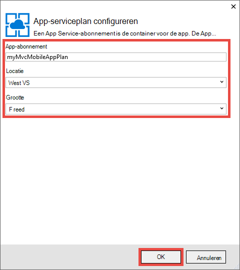
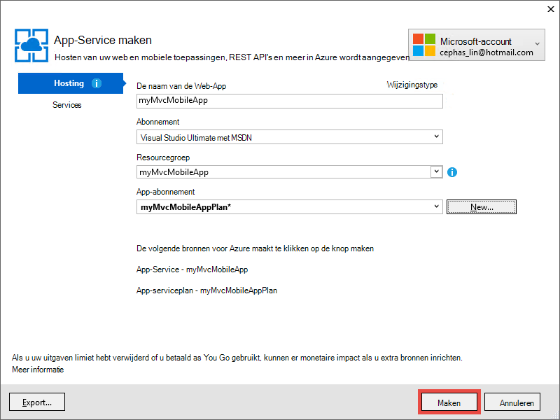

<properties 
    pageTitle="Een ASP.NET MVC 5 mobiele web-app in Azure-Service voor App implementeren" 
    description="Een zelfstudie waarin u u hoe leert u een web-app implementeren naar Azure App Service mobiele functies gebruiken in ASP.NET MVC 5-webtoepassing." 
    services="app-service" 
    documentationCenter=".net" 
    authors="cephalin" 
    manager="wpickett" 
    editor="jimbe"/>

<tags 
    ms.service="app-service" 
    ms.workload="na" 
    ms.tgt_pltfrm="na" 
    ms.devlang="dotnet" 
    ms.topic="article" 
    ms.date="01/12/2016" 
    ms.author="cephalin;riande"/>

# Een ASP.NET MVC 5 mobiele web-app in Azure-Service voor App implementeren

Deze zelfstudie leert u de basisbeginselen van het bouwen van een web-app voor ASP.NET MVC 5 mobile-vriendelijke is en het dashboard implementeren naar Azure App-Service. Voor deze zelfstudie moet u [Visual Studio Express 2013 voor Web] [ Visual Studio Express 2013] of de professional edition van Visual Studio als u die al hebt. Kunt u [Visual Studio-2015] , maar de schermopnamen afwijken en moet u de ASP.NET 4.x-sjablonen.

[AZURE.INCLUDE [create-account-and-websites-note](../../includes/create-account-and-websites-note.md)]

## Wat u moet maken

Voor deze zelfstudie hebt u mobiele functies toevoegen aan de eenvoudige telefonische-vermelding-toepassing die opgegeven in het [project starter][StarterProject]. De volgende schermafbeelding ziet u de ASP.NET-sessies in de voltooide-toepassing, zoals gezien in de browser emulator in Internet Explorer 11 F12 speciale tools voor ontwikkelaars.

![][FixedSessionsByTag]

U kunt de hulpmiddelen van Internet Explorer 11 F12 ontwikkelaars en de [Fiddler hulpmiddel] [ Fiddler] om te helpen fouten opsporen in uw toepassing. 

## Vaardigheden u leert

Hier ziet u wat u leert:

-   Het gebruik van Visual Studio 2013 te publiceren van uw webtoepassing rechtstreeks naar een web-app in Azure App-Service.
-   Hoe de sjablonen ASP.NET MVC 5 het CSS-Bootstrap framework gebruiken om te verbeteren weergeven op mobiele apparaten
-   Het maken van weergaven van de mobile-specifieke om u te richten op specifieke mobiele browsers, zoals de iPhone en Android
-   Het maken van heeft gereageerd weergaven (weergaven die op verschillende browsers op apparaten reageren)

## De ontwikkelomgeving instellen

Uw ontwikkelomgeving instellen door de installatie van de Azure-SDK voor .NET 2.5.1 of hoger. 

1. Klik op de onderstaande koppeling om de SDK Azure voor .NET. Als u geen Visual Studio 2013 nog is geïnstalleerd, wordt deze geïnstalleerd door de koppeling. Deze zelfstudie moet Visual Studio-2013. [Azure SDK voor Visual Studio 2013][AzureSDKVs2013]
1. In het installatieprogramma van de Web-Platform-venster, klikt u op **installeren** en doorgaan met de installatie.

U moet ook een mobiele browser-emulator. Een van de volgende werkt:

-   Browser-Emulator in [Internet Explorer 11 F12 speciale tools voor ontwikkelaars] [ EmulatorIE11] (gebruikt in alle mobiele browser schermafbeeldingen). Deze heeft gebruiker agent tekenreeks standaardinstellingen voor Windows Phone 8, Windows Phone 7 en Apple iPad.
-   Browser-Emulator in [Google Chrome DevTools][EmulatorChrome]. Standaardinstellingen voor veel Android-apparaten, evenals Apple iPhone, iPad van Apple en Amazon Kindle Fire bevat. Deze emuleert ook touch gebeurtenissen.
-   [Opera mobiele Emulator][EmulatorOpera]

Visual Studio-projecten met C\# broncode zijn beschikbaar bij dit onderwerp:

-   [Starter project downloaden][StarterProject]
-   [Voltooid project downloaden][CompletedProject]

##Het project starter implementeren naar een Azure web-app

1.  Downloaden van de vergadering-vermelding toepassing [starter project][StarterProject].

2.  Klik in Windows Verkenner met de rechtermuisknop op het gedownloade ZIP-bestand en kies *Eigenschappen*.

3.  Kies in het dialoogvenster **Eigenschappen van** de knop **deblokkeren** . (Deblokkeren wordt voorkomen dat een beveiligingswaarschuwing weergegeven die optreedt wanneer u probeert te gebruiken van een *zip-* bestand dat u hebt gedownload vanaf het web.)

4.  Met de rechtermuisknop op het ZIP-bestand en selecteer **Alles uitpakken** Pak het bestand. 

5.  Open het bestand *C#\Mvc5Mobile.sln* in Visual Studio.

6.  Klik in Solution Explorer met de rechtermuisknop op het project en klik op **publiceren**.

    ![][DeployClickPublish]

7.  Klik op **Microsoft Azure App-Service**in Web publiceren.

    ![][DeployClickWebSites]

8.  Als u al Azure nog niet hebt aangemeld, klikt u op **een account toevoegen**.

    ![][DeploySignIn]

9.  Volg de aanwijzingen voor Meld u aan bij uw Azure-account.

11. Het dialoogvenster App-Service wordt nu u weergegeven, zoals aangemeld. Klik op **Nieuw**.

    ![][DeployNewWebsite]  

12. Geef een voorvoegsel unieke app-naam in het veld **Naam van de Web-App** . Uw volledige web app-naam * &lt;voorvoegsel >*. azurewebsites.net. Ook selecteren of een nieuwe naam resourcegroep opgeven in het **resourceveld groep**. Klik vervolgens op **Nieuw** om te maken van een nieuwe App-serviceplan.

    ![][DeploySiteSettings]

13. Het nieuwe abonnement van de App-Service configureren en klik op **OK**. 

    

13. Terug in het dialoogvenster App-Service maken, klikt u op **maken**.

     

13. Na het Azure worden resources gemaakt, het Web publiceert dialoogvenster wordt ingevuld met de instellingen voor de nieuwe app. Klik op **publiceren**.

    ![][DeployPublishSite]

    Als Visual Studio is voltooid het starter project publiceren naar de Azure WebApp, wordt het bureaublad browser geopend om weer te geven van de live WebApp.

14. Start uw mobiele browser-emulator, Kopieer de URL voor de telefonische vergadering-toepassing (*<prefix>*. azurewebsites.net) in de emulator, en klik vervolgens op de knop rechtsboven en selecteer **Bladeren per label**. Als u Internet Explorer 11 als de standaardbrowser gebruikt, hoeft u slechts Typ `F12`, klikt u vervolgens `Ctrl+8`, en wijzig vervolgens het profiel van de browser in **Windows Phone**. De onderstaande afbeelding ziet u de weergave *AllTags* in Staand (vanuit kiezen **door de tag bladeren**).

    ![][AllTags]

>[AZURE.TIP] Terwijl u de toepassing MVC 5 in Visual Studio opsporen kunt, kunt u uw web-app publiceren naar Azure weer voor de verificatie van de live web-app rechtstreeks vanuit een browser emulator of uw mobiele browser.

De weergave is zeer leesbaar op een mobiel apparaat. U kunt ook al enkele van de visuele effecten toegepast door het kader Bootstrap CSS zien.
Klik op de koppeling **ASP.NET** .

![][SessionsByTagASP.NET]

De weergave van de tag ASP.NET is zoomen voorzien naar het scherm, Bootstrap automatisch voor u wordt. U kunt echter deze weergave aan de mobiele browser verbeteren. Bijvoorbeeld, is in de kolom **datum** moeilijk te lezen. Verderop in deze zelfstudie moet u de weergave *AllTags* zodat het mobile-vriendelijke wijzigen.

##Bootstrap CSS Framework

Nieuw in de 5 MVC is sjabloon ingebouwde Bootstrap ondersteuning. U hebt al gezien hoe deze direct verbetert de verschillende weergaven in uw toepassing. De navigatiebalk aan de bovenkant is bijvoorbeeld die u als automatisch kan worden samengevouwen wanneer de breedte van de browser kleiner is. Klik op het bureaublad browser, wijzig het formaat van het browservenster en zien hoe de navigatiebalk van het uiterlijk verandert. Dit is de heeft gereageerd webontwerp die is ingebouwd in Bootstrap.

Als u wilt zien hoe de Web-app eruitzien zonder Bootstrap, open *App\_starten\\BundleConfig.cs* en een opmerking om de regels die *bootstrap.js* en *bootstrap.css*bevatten. De volgende code toont de laatste twee overzichten van de `RegisterBundles` methode na de wijziging:

     bundles.Add(new ScriptBundle("~/bundles/bootstrap").Include(
              //"~/Scripts/bootstrap.js",
              "~/Scripts/respond.js"));

    bundles.Add(new StyleBundle("~/Content/css").Include(
              //"~/Content/bootstrap.css",
              "~/Content/site.css"));

Druk op `Ctrl+F5` de toepassing wilt uitvoeren.

Let op de navigatiebalk van die kunnen worden samengevouwen is nu alleen gewone ongeordende lijst. Klik nogmaals op **Bladeren per label** en klik op **ASP.NET**.
Klik in de emulatorweergave mobiele ziet u nu dat het is niet langer zoomen voorzien naar het scherm en u zijwaarts schuiven moet om te zien van de rechterkant van de tabel.

![][SessionsByTagASP.NETNoBootstrap]

Uw wijzigingen ongedaan maken en vernieuw de mobiele browser om te bevestigen dat de mobile-vriendelijke weergave is hersteld.

Bootstrap is niet specifiek zijn voor ASP.NET MVC 5 en u kunt profiteren van deze functies in een webtoepassing. Maar is nu ingebouwd in de ASP.NET MVC 5 project-sjabloon, zodat uw MVC 5-webtoepassing van Bootstrap al dan niet standaard profiteren kunt.

Voor meer informatie over Bootstrap, gaat u naar de [Bootstrap] [ BootstrapSite] site.

In het volgende gedeelte ziet u hoe u specifieke weergaven van mobiele browser.

##De weergaven, indelingen en gedeeltelijke weergaven overschrijven

U kunt een willekeurige weergave (inclusief indelingen en gedeeltelijke weergaven) negeren voor mobiele browsers in het algemeen, voor een afzonderlijke mobiele browser of voor een specifieke browser. Als u een weergave mobile / regiospecifieke, kunt u een weergavebestand kopiëren en *toevoegen. Mobile* aan de bestandsnaam. Bijvoorbeeld een mobiele weergave van de *Index* wilt maken, kunt u kopiëren *weergaven\\Home\\Index.cshtml* naar *weergaven\\Home\\Index.Mobile.cshtml*.

In dit gedeelte maakt u een indelingsbestand mobile-specifieke.

Als u wilt beginnen, Kopieer *weergaven\\gedeeld\\\_Layout.cshtml* naar *weergaven\\gedeeld\\\_Layout.Mobile.cshtml*. Open * \_Layout.Mobile.cshtml* en wijzig de titel van **De toepassing MVC5** in **MVC5-toepassing (mobiel)**.

In elk `Html.ActionLink` bellen voor de navigatiebalk, "Bladeren door' in elke koppeling *ActionLink*verwijderen. De volgende code toont de voltooide `<ul class="nav navbar-nav">` tag van het bestand mobiele indeling.

    <ul class="nav navbar-nav">
        <li>@Html.ActionLink("Home", "Index", "Home")</li>
        <li>@Html.ActionLink("Date", "AllDates", "Home")</li>
        <li>@Html.ActionLink("Speaker", "AllSpeakers", "Home")</li>
        <li>@Html.ActionLink("Tag", "AllTags", "Home")</li>
    </ul>

Kopie de *weergaven\\Home\\AllTags.cshtml* bestand wordt gewijzigd in *weergaven\\Home\\AllTags.Mobile.cshtml*. Het nieuwe bestand openen en wijzig de `<h2>` -element 'Tags' naar ' labels (M) ":

    <h2>Tags (M)</h2>

Blader naar de pagina labels met een bureaublad browser en gebruiken van mobiele browser emulator. De mobiele browser-emulator ziet u de twee wijzigingen die u hebt aangebracht (de titel van * \_Layout.Mobile.cshtml* en de titel van *AllTags.Mobile.cshtml*).

![][AllTagsMobile_LayoutMobile]

Daarentegen het beeldscherm niet is gewijzigd (met titels van * \_Layout.cshtml* en *AllTags.cshtml*).

![][AllTagsMobile_LayoutMobileDesktop]

##Browser-specifieke weergaven maken

Naast de mobile-specifieke en bureaublad / regiospecifieke weergaven, kunt u weergaven voor een individuele browser. U kunt bijvoorbeeld weergaven die specifiek voor de iPhone of de Android browser zijn maken. In dit gedeelte maakt u een indeling voor de iPhone-browser en op een iPhone-versie van de weergave *AllTags* .

Open het bestand *Global.asax* en voeg de volgende code toe aan de onderkant van de `Application_Start` methode.

    DisplayModeProvider.Instance.Modes.Insert(0, new DefaultDisplayMode("iPhone")
    {
        ContextCondition = (context => context.GetOverriddenUserAgent().IndexOf
            ("iPhone", StringComparison.OrdinalIgnoreCase) >= 0)
    });

Deze code definieert een nieuwe weergavemodus met de naam 'iPhone' die wordt vergeleken met elke binnenkomende aanvraag. Als de binnenkomende aanvraag overeenkomt met de voorwaarde die u hebt gedefinieerd (dat wil zeggen als de gebruikersagent bevat de tekenreeks "iPhone"), zoekt ASP.NET MVC weergaven waarvan de naam van het achtervoegsel 'iPhone' bevat.

>[AZURE.NOTE] Bij het toevoegen van mobiele browser-specifieke weergavemodi, bijvoorbeeld voor iPhone en Android, zorg ervoor dat u het eerste argument ingesteld op `0` (invoegen boven aan de lijst) om ervoor te zorgen dat de modus browser / regiospecifieke voorrang hebben op de mobile-sjabloon (*. Mobile.cshtml). Als de sjabloon voor de mobiele in plaats daarvan boven aan de lijst is, wordt deze geselecteerd via uw beoogde weergavemodus (de eerste wins van de zoekwaarde en de mobiele sjabloon overeenkomt met alle mobiele browsers). 

In de code, met de rechtermuisknop op `DefaultDisplayMode`, kies **oplossen**en kies vervolgens `using System.Web.WebPages;`. Hiermee voegt u een verwijzing naar de `System.Web.WebPages` naamruimte, dat wil waar u zeggen de `DisplayModeProvider` en `DefaultDisplayMode` typen zijn gedefinieerd.

![][ResolveDefaultDisplayMode]

U kunt ook u kunt de volgende regel om alleen handmatig toevoegen de `using` sectie van het bestand.

    using System.Web.WebPages;

De wijzigingen opslaan. Kopie de *weergaven\\gedeeld\\\_Layout.Mobile.cshtml* bestand wordt gewijzigd in *weergaven\\gedeeld\\\_Layout.iPhone.cshtml*. Open het nieuwe bestand en wijzig vervolgens de titel van `MVC5 Application (Mobile)` naar `MVC5 Application (iPhone)`.

Kopie de *weergaven\\Home\\AllTags.Mobile.cshtml* bestand wordt gewijzigd in *weergaven\\Home\\AllTags.iPhone.cshtml*. In het nieuwe bestand, wijzigt u de `<h2>` element van "labels (M)" aan "Tags (iPhone)".

Voer de toepassing. Blader naar de weergave *AllTags* uitvoeren van een mobiele browser-emulator en controleer of dat de gebruikersagent is ingesteld op "iPhone". Als u de emulator in Internet Explorer 11 F12 speciale tools voor ontwikkelaars gebruikt, configureert u emulatie als volgt uit:

-   Browser-profiel = **Windows Phone**
-   Tekenreeks gebruikersagent = **aangepast**
-   Aangepaste tekenreeks **Apple-iPhone5C1/1001.525** =

De volgende schermafbeelding ziet u de *AllTags* weergave weergegeven in de emulator in Internet Explorer 11 F12 speciale tools voor ontwikkelaars met tekenreeks van de aangepaste gebruikersagent (dit is een tekenreeks gebruikersagent iPhone 5 C).

![][AllTagsIPhone_LayoutIPhone]

In de mobiele browser, selecteert u de koppeling van de **luidsprekers** . Omdat er een mobiele weergave (*AllSpeakers.Mobile.cshtml*), de standaardweergave van luidsprekers (*AllSpeakers.cshtml*) wordt weergegeven met de weergave van de mobiele indeling (*\_Layout.Mobile.cshtml*). Zoals hieronder wordt weergegeven, de titel **MVC5-toepassing (mobiel)** is gedefinieerd * \_Layout.Mobile.cshtml*.

![][AllSpeakers_LayoutMobile]

U kunt een standaardweergave (niet-mobiele) opgebouwd binnen een mobiele indeling globaal uitschakelen door in te stellen `RequireConsistentDisplayMode` naar `true` in de *weergaven\\\_ViewStart.cshtml* bestand, zoals hier:

    @{
        Layout = "~/Views/Shared/_Layout.cshtml";
        DisplayModeProvider.Instance.RequireConsistentDisplayMode = true;
    }

Wanneer `RequireConsistentDisplayMode` is ingesteld op `true`, de mobiele indeling (*\_Layout.Mobile.cshtml*) worden alleen gebruikt voor mobiele weergaven (dat wil zeggen als de weergave aan het formulier * **weergavenaam is**. Mobile.cshtml*). U wilt instellen `RequireConsistentDisplayMode` naar `true` als uw mobiele indeling niet goed met uw niet-mobiele weergaven werkt. De volgende schermafbeelding ziet u hoe de *luidsprekers* -pagina wordt weergegeven wanneer `RequireConsistentDisplayMode` is ingesteld op `true` (zonder de tekenreeks '(mobiel)' in de navigatie-balk aan de bovenkant).

![][AllSpeakers_LayoutMobileOverridden]

U kunt consistente weergavemodus in een bepaalde weergave uitschakelen door in te stellen `RequireConsistentDisplayMode` naar `false` in de weergavebestand. De volgende opmaak in de *weergaven\\Home\\AllSpeakers.cshtml* bestand sets `RequireConsistentDisplayMode` naar `false`:

    @model IEnumerable<string>

    @{
        ViewBag.Title = "All speakers";
        DisplayModeProvider.Instance.RequireConsistentDisplayMode = false;
    }

In deze sectie hebt we bekijken hoe mobiele indelingen en weergaven maken en het maken van indelingen en weergaven voor bepaalde apparaten, zoals de iPhone.
Het belangrijkste voordeel van het kader Bootstrap CSS is echter de heeft gereageerd indeling, wat betekent dat een enkel stylesheet kan worden toegepast op het bureaublad, telefoon en tablet browsers maken van een consistent uiterlijk geven. In het volgende gedeelte ziet u hoe u gebruikmaken van Bootstrap mobile-vriendelijke weergaven maken.

##De lijst luidsprekers verbeteren

Zoals u net hebt gezien, wordt de weergave van de *luidsprekers* leesbaar is, maar de koppelingen zijn klein en moeilijk te tikken op een mobiel apparaat. In dit gedeelte maakt u de weergave *AllSpeakers* mobile-vriendelijke, welke grote, eenvoudig te tikken koppelingen worden weergegeven en bevat een zoekvak als u wilt snel vinden luidsprekers.

U kunt de opmaak van de Bootstrap [groep gekoppelde lijst][] de *luidsprekers* view te verbeteren. In *weergaven\\Home\\AllSpeakers.cshtml*, de inhoud van het bestand Razor vervangen door de onderstaande code.

     @model IEnumerable<string>

    @{
        ViewBag.Title = "All Speakers";
    }

    <h2>Speakers</h2>

    

        @foreach (var speaker in Model)
        {
            @Html.ActionLink(speaker, "SessionsBySpeaker", new { speaker }, new { @class = "list-group-item" })
        }
    

De `class="list-group"` kenmerk de `
` tag is van toepassing de stijl Bootstrap lijst en de `class="input-group-item"` kenmerk Bootstrap lijst item vormgeving geldt voor elke koppeling.

Vernieuw de mobiele browser. De bijgewerkte weergave ziet er zo uit:

![][AllSpeakersFixed]

De stijl Bootstrap [groep gekoppelde lijst][] kunt u het hele voor elke koppeling waarop kan worden geklikt, dat wil zeggen van veel gebruikers beter kunnen werken. Ga naar de Bureaublad-weergave en de consistent uiterlijk geven toekijken.

![][AllSpeakersFixedDesktop]

Hoewel de weergave in mobiele browser is verbeterd, is het is moeilijk te navigeren van de lijst met luidsprekers lang. Bootstrap niet zelf een filter functionaliteit out-van-het-zoekvak, maar kunt u deze toevoegen met een paar regels met code. U wordt eerst een zoekvak toevoegen aan de weergave en vervolgens met de JavaScript-code voor de filterfunctie koppelen. In *weergaven\\Home\\AllSpeakers.cshtml*, toevoegen een \<formulier\> vlak na een melding geven de \<h2\> markeren, zoals hieronder wordt weergegeven:

    @model IEnumerable<string>

    @{
        ViewBag.Title = "All Speakers";
    }

    <h2>Speakers</h2>

    <form class="input-group">
        
        <input type="text" class="form-control" placeholder="Search speaker">
    </form>
     
    

        @foreach (var speaker in Model)
        {
            @Html.ActionLink(speaker, 
                             "SessionsBySpeaker", 
                             new { speaker }, 
                             new { @class = "list-group-item" })
        }
    

U ziet dat de `<form>` en `<input>` tags beide hebben de Bootstrap stijlen zijn toegepast. De `` element wordt een Bootstrap [glyphicon][] toegevoegd aan het zoekvak.

Klik in de map *Scripts* toevoegen een JavaScript-bestand *filter.js*genoemd. Open het bestand en plak de volgende code erin:

    $(function () {

        // reset the search form when the page loads
        $("form").each(function () {
            this.reset();
        });

        // wire up the events to the <input> element for search/filter
        $("input").bind("keyup change", function () {
            var searchtxt = this.value.toLowerCase();
            var items = $(".list-group-item");

            // show all speakers that begin with the typed text and hide others
            for (var i = 0; i < items.length; i++) {
                var val = items[i].text.toLowerCase();
                val = val.substring(0, searchtxt.length);
                if (val == searchtxt) {
                    $(items[i]).show();
                }
                else {
                    $(items[i]).hide();
                }
            }
        });
    });

U moet ook filter.js opnemen in uw geregistreerde pakketten. Open *App\_starten\\BundleConfig.cs* en wijzigt u de eerste pakketten. Wijzigen van de eerste `bundles.Add` instructie (voor de bundel **jquery** ) om op te nemen *Scripts\\filter.js*als volgt:

     bundles.Add(new ScriptBundle("~/bundles/jquery").Include(
                "~/Scripts/jquery-{version}.js",
                "~/Scripts/filter.js"));

De bundel **jquery** al wordt weergegeven de standaard * \_indeling* weergave. U kunt de dezelfde JavaScript-code als u wilt de filterfunctionaliteit voor het toepassen op andere lijstweergaven later kunt gebruiken.

Vernieuw de mobiele browser en Ga naar de weergave *AllSpeakers* . Typ in het zoekvak "sc". De lijst luidsprekers moet nu worden gefilterd op basis van uw zoekopdracht.

![][AllSpeakersFixedSearchBySC]

##De lijst met Tags te verbeteren

Als de weergave van de *luidsprekers* en de weergave *Tags* leesbaar is, maar de koppelingen zijn kleine en moeilijk te tikken op een mobiel apparaat. U kunt de weergave van *labels* verhelpen dezelfde manier als u de weergave van de *luidsprekers* en oplossen als u de codewijzigingen hierboven hebt gebruikt, maar met de volgende handelingen uit `Html.ActionLink` syntaxis van de methode in *weergaven\\Home\\AllTags.cshtml*:

    @Html.ActionLink(tag, 
                     "SessionsByTag", 
                     new { tag }, 
                     new { @class = "list-group-item" })

De vernieuwde bureaublad browser ziet er als volgt uit:

![][AllTagsFixedDesktop]

En de vernieuwde mobiele browser ziet er als volgt te werk: 

![][AllTagsFixed]

>[AZURE.NOTE] Als u merkt dat de oorspronkelijke lijstopmaak nog weergegeven in de mobiele browser wordt en meer wilt weten wat is er gebeurd met de stijl van uw nette Bootstrap, is dit een onderdeel van uw eerdere actie mobiele specifieke weergaven te maken. Nu dat u het Bootstrap CSS-framework gebruikt een heeft gereageerd webontwerp maken, gaat u hoofd en deze weergaven mobile / regiospecifieke en de mobile-specifieke indeling weergaven verwijderen. Nadat u dit hebt gedaan, wordt het vernieuwde mobiele browser de Bootstrap stijl weergegeven.

##De lijst datums verbeteren

U kunt de weergave van *datums* verbeteren, zoals u de *luidsprekers* en *Tags* weergaven verbeterde als u de codewijzigingen hierboven hebt gebruikt, maar met de volgende `Html.ActionLink` syntaxis van de methode in *weergaven\\Home\\AllDates.cshtml*:

    @Html.ActionLink(date.ToString("ddd, MMM dd, h:mm tt"), 
                     "SessionsByDate", 
                     new { date }, 
                     new { @class = "list-group-item" })

Hier krijgt u een weergave vernieuwde mobiele browser als volgt:

![][AllDatesFixed]

U kunt de weergave van *datums* verder verbeteren door de datum / tijd-waarden organiseren op datum. Dit kunt doen met de stijl Bootstrap [panelen][] . Vervang de inhoud van de *weergaven\\Home\\AllDates.cshtml* bestand met de volgende code:

    @model IEnumerable<DateTime>

    @{
        ViewBag.Title = "All Dates";
    }

    <h2>Dates</h2>

    @foreach (var dategroup in Model.GroupBy(x=>x.Date))
    {
        

            

                @dategroup.Key.ToString("ddd, MMM dd")
            

            

                @foreach (var date in dategroup)
                {
                    @Html.ActionLink(date.ToString("h:mm tt"), 
                                     "SessionsByDate", 
                                     new { date }, 
                                     new { @class = "list-group-item" })
                }
            

        

    }

Deze code maakt u een afzonderlijke `
` tag voor elke afzonderlijke datum in de lijst en gebruikmaakt van de [groep gekoppelde lijst][] voor de desbetreffende koppelingen als voorheen. Hier ziet u hoe de mobiele browser eruitziet wanneer deze code wordt uitgevoerd:

![][AllDatesFixed2]

Overschakelen naar het bureaublad browser. Klik nogmaals Opmerking de consistente vormgeving.

![][AllDatesFixed2Desktop]

##De weergave SessionsTable verbeteren

In dit gedeelte maakt u de weergave *SessionsTable* meer mobile-vriendelijke. Deze wijziging is uitgebreider de vorige wijzigingen.

In de mobiele browser, tik op de knop **Tag** , voer vervolgens `asp` in het zoekvak.

![][AllTagsFixedSearchByASP]

Tik op de koppeling **ASP.NET** .

![][SessionsTableTagASP.NET]

Zoals u ziet, wordt de weergave is opgemaakt als een tabel, die momenteel is ontworpen om te worden weergegeven in de browser bureaublad. Het is echter iets moeilijk leesbaar op een mobiele browser. U lost dit probleem, open *weergaven\\Home\\SessionsTable.cshtml* en klikt u vervolgens de inhoud van het bestand te vervangen door de volgende code:

    @model IEnumerable<Mvc5Mobile.Models.Session>

    <h2>@ViewBag.Title</h2>

    

        

            @foreach (var session in Model)
            {
                

                    

                        @Html.ActionLink(session.Title, 
                                         "SessionByCode", 
                                         new { session.Code }, 
                                         new { @class="list-group-item active" })
                        

                            

                                @Html.Partial("_SpeakersLinks", session)
                            

                            

                                @session.DateText
                            

                            

                                @Html.Partial("_TagsLinks", session)
                            

                        

                    

                

            }
        

    

De code 3 dingen gebeurt:

-   de Bootstrap [aangepaste gekoppelde lijstgroep][] gebruikt om de sessie-informatie verticaal, zodat deze informatie leesbaar op een mobiele browser is (via klassen zoals lijst-groep-item-tekst)
-   het [rastersysteem][] geldt voor de indeling, zodat de items sessie flow horizontaal in een bureaublad browser en verticaal in de mobiele browser (via de klas kolom-md-4)
-   Gebruik de [heeft gereageerd hulpprogramma's][] aan de sessie labels als weergegeven in de mobiele browser (via de klas verborgen x'en) verbergen

U kunt ook een Titelkoppeling om te gaan naar de desbetreffende sessie tikken. De onderstaande afbeelding staan de codewijzigingen.

![][FixedSessionsByTag]

Het rastersysteem Bootstrap die u automatisch toegepast rangschikt de sessies verticaal in de mobiele browser. U ziet ook dat de labels niet worden weergegeven. Overschakelen naar het bureaublad browser.

![][SessionsTableFixedTagASP.NETDesktop]

U ziet dat de desbetreffende tags nu worden weergegeven in de browser bureaublad. U kunt ook zien dat de Bootstrap rastersysteem dat u hebt toegepast de sessie items in twee kolommen rangschikt. Als u de browser vergroot, ziet u dat de rangschikking wordt gewijzigd in drie kolommen.

##De weergave SessionByCode verbeteren

Tot slot kunt u de weergave *SessionByCode* zodat het mobile-vriendelijke verhelpen.

In de mobiele browser, tik op de knop **Tag** , voer vervolgens `asp` in het zoekvak.

![][AllTagsFixedSearchByASP]

Tik op de koppeling **ASP.NET** . Sessies voor de tag ASP.NET worden weergegeven.

![][FixedSessionsByTag]

Kies de koppeling voor het **samenstellen van één pagina toepassing met ASP.NET en AngularJS** .

![][SessionByCode3-644]

De standaardweergave van een bureaublad werkt prima, maar u kunt het uiterlijk eenvoudig verbeteren met behulp van bepaalde onderdelen Bootstrap grafische gebruikersinterface.

Open *weergaven\\Home\\SessionByCode.cshtml* en de inhoud vervangen door de volgende markeringen:

    @model Mvc5Mobile.Models.Session

    @{
        ViewBag.Title = "Session details";
    }
    <h3>@Model.Title (@Model.Code)</h3>
    

        <strong>@Model.DateText</strong> in <strong>@Model.Room</strong>
    

    

        

            Speakers
        

        @foreach (var speaker in Model.Speakers)
        {
            @Html.ActionLink(speaker, 
                             "SessionsBySpeaker", 
                             new { speaker }, 
                             new { @class="panel-body" })
        }
    

    
@Model.Abstract

    

        

            Tags
        

        @foreach (var tag in Model.Tags)
        {
            @Html.ActionLink(tag, 
                             "SessionsByTag", 
                             new { tag }, 
                             new { @class = "panel-body" })
        }
    

De nieuwe markeringen gebruikt Bootstrap panelen opmaak ter verbetering van de mobiele weergave. 

Vernieuw de mobiele browser. De volgende afbeelding bevat de codewijzigingen die u zojuist hebt gemaakt:

![][SessionByCodeFixed3-644]

## Inpakken en controleren

Deze zelfstudie leert u hoe u ASP.NET MVC 5 gebruiken voor het ontwikkelen van webtoepassingen mobile-vriendelijke. Hierbij:

-   Een ASP.NET MVC 5-toepassing aan een App Service web-app implementeren
-   Gebruik Bootstrap heeft gereageerd webindeling maken in uw toepassing MVC 5
-   Indeling, weergaven en gedeeltelijke weergaven, vervangen globaal en voor een afzonderlijke weergave
-   Besturingselementindeling en gedeeltelijk overschrijven afdwingen gebruiken de `RequireConsistentDisplayMode` eigenschap
-   Weergaven die zijn gericht op specifieke browsers, zoals de iPhone-browser maken
-   Bootstrap stijlen in Razor-code toepassen

## Zie ook

-   [9 basisprincipes van heeft gereageerd webontwerp](http://blog.froont.com/9-basic-principles-of-responsive-web-design/)
-   [Bootstrap][BootstrapSite]
-   [Officiële Bootstrap Blog][]
-   [Twitter Bootstrap zelfstudie van zelfstudie Republiek][]
-   [De Bootstrap Speelplaats][]
-   [W3C aanbeveling mobiele Web Application aanbevolen procedures][]
-   [W3C Candidate aanbeveling voor media-query 's][]

## Wat er gewijzigd
* Zie voor een handleiding voor het wijzigen van Websites naar App Service: [Azure App-Service en de invloed op bestaande Azure-Services](http://go.microsoft.com/fwlink/?LinkId=529714)

<!-- Internal Links -->
[Deploy the starter project to an Azure web app]: #bkmk_DeployStarterProject
[Bootstrap CSS Framework]: #bkmk_bootstrap
[Override the Views, Layouts, and Partial Views]: #bkmk_overrideviews
[Create Browser-Specific Views]:#bkmk_browserviews
[Improve the Speakers List]: #bkmk_Improvespeakerslist
[Improve the Tags List]: #bkmk_improvetags
[Improve the Dates List]: #bkmk_improvedates
[Improve the SessionsTable View]: #bkmk_improvesessionstable
[Improve the SessionByCode View]: #bkmk_improvesessionbycode

<!-- External Links -->
[Visual Studio Express 2013]: http://www.visualstudio.com/downloads/download-visual-studio-vs#d-express-web
[Visual Studio-2015]: https://www.visualstudio.com/downloads/download-visual-studio-vs
[AzureSDKVs2013]: http://go.microsoft.com/fwlink/p/?linkid=323510&clcid=0x409
[Fiddler]: http://www.fiddler2.com/fiddler2/
[EmulatorIE11]: http://msdn.microsoft.com/library/ie/dn255001.aspx
[EmulatorChrome]: https://developers.google.com/chrome-developer-tools/docs/mobile-emulation
[EmulatorOpera]: http://www.opera.com/developer/tools/mobile/
[StarterProject]: http://go.microsoft.com/fwlink/?LinkID=398780&clcid=0x409
[CompletedProject]: http://go.microsoft.com/fwlink/?LinkID=398781&clcid=0x409
[BootstrapSite]: http://getbootstrap.com/
[WebPIAzureSdk23NetVS13]: ./media/web-sites-dotnet-deploy-aspnet-mvc-mobile-app/WebPIAzureSdk23NetVS13.png
[groep gekoppelde lijst]: http://getbootstrap.com/components/#list-group-linked
[glyphicon]: http://getbootstrap.com/components/#glyphicons
[deelvensters]: http://getbootstrap.com/components/#panels
[groep aangepaste gekoppelde lijst]: http://getbootstrap.com/components/#list-group-custom-content
[rastersysteem]: http://getbootstrap.com/css/#grid
[heeft gereageerd hulpprogramma 's]: http://getbootstrap.com/css/#responsive-utilities
[Officiële Bootstrap Blog]: http://blog.getbootstrap.com/
[Twitter Bootstrap zelfstudie van zelfstudie Republiek]: http://www.tutorialrepublic.com/twitter-bootstrap-tutorial/
[De Bootstrap Speelplaats]: http://www.bootply.com/
[W3C aanbeveling mobiele Web Application aanbevolen procedures]: http://www.w3.org/TR/mwabp/
[W3C Candidate aanbeveling voor media-query 's]: http://www.w3.org/TR/css3-mediaqueries/

<!-- Images -->
[DeployClickPublish]: ./media/web-sites-dotnet-deploy-aspnet-mvc-mobile-app/deploy-to-azure-website-1.png
[DeployClickWebSites]: ./media/web-sites-dotnet-deploy-aspnet-mvc-mobile-app/deploy-to-azure-website-2.png
[DeploySignIn]: ./media/web-sites-dotnet-deploy-aspnet-mvc-mobile-app/deploy-to-azure-website-3.png
[DeployUsername]: ./media/web-sites-dotnet-deploy-aspnet-mvc-mobile-app/deploy-to-azure-website-4.png
[DeployPassword]: ./media/web-sites-dotnet-deploy-aspnet-mvc-mobile-app/deploy-to-azure-website-5.png
[DeployNewWebsite]: ./media/web-sites-dotnet-deploy-aspnet-mvc-mobile-app/deploy-to-azure-website-6.png
[DeploySiteSettings]: ./media/web-sites-dotnet-deploy-aspnet-mvc-mobile-app/deploy-to-azure-website-7.png
[DeployPublishSite]: ./media/web-sites-dotnet-deploy-aspnet-mvc-mobile-app/deploy-to-azure-website-8.png
[MobileHomePage]: ./media/web-sites-dotnet-deploy-aspnet-mvc-mobile-app/mobile-home-page.png
[FixedSessionsByTag]: ./media/web-sites-dotnet-deploy-aspnet-mvc-mobile-app/SessionsByTag-ASP.NET-Fixed.png
[AllTags]: ./media/web-sites-dotnet-deploy-aspnet-mvc-mobile-app/AllTags.png
[SessionsByTagASP.NET]: ./media/web-sites-dotnet-deploy-aspnet-mvc-mobile-app/SessionsByTag-ASP.NET.png
[SessionsByTagASP.NETNoBootstrap]: ./media/web-sites-dotnet-deploy-aspnet-mvc-mobile-app/SessionsByTag-ASP.NET-NoBootstrap.png
[AllTagsMobile_LayoutMobile]: ./media/web-sites-dotnet-deploy-aspnet-mvc-mobile-app/AllTagsMobile-_LayoutMobile.png
[AllTagsMobile_LayoutMobileDesktop]: ./media/web-sites-dotnet-deploy-aspnet-mvc-mobile-app/AllTagsMobile-_LayoutMobile-Desktop.png
[ResolveDefaultDisplayMode]: ./media/web-sites-dotnet-deploy-aspnet-mvc-mobile-app/Resolve-DefaultDisplayMode.png
[AllTagsIPhone_LayoutIPhone]: ./media/web-sites-dotnet-deploy-aspnet-mvc-mobile-app/AllTagsIPhone-_LayoutIPhone.png
[AllSpeakers_LayoutMobile]: ./media/web-sites-dotnet-deploy-aspnet-mvc-mobile-app/AllSpeakers-_LayoutMobile.png
[AllSpeakers_LayoutMobileOverridden]: ./media/web-sites-dotnet-deploy-aspnet-mvc-mobile-app/AllSpeakers-_LayoutMobile-Overridden.png
[AllSpeakersFixed]: ./media/web-sites-dotnet-deploy-aspnet-mvc-mobile-app/AllSpeakers-Fixed.png
[AllSpeakersFixedDesktop]: ./media/web-sites-dotnet-deploy-aspnet-mvc-mobile-app/AllSpeakers-Fixed-Desktop.png
[AllSpeakersFixedSearchBySC]: ./media/web-sites-dotnet-deploy-aspnet-mvc-mobile-app/AllSpeakers-Fixed-SearchBySC.png
[AllTagsFixedDesktop]: ./media/web-sites-dotnet-deploy-aspnet-mvc-mobile-app/AllTags-Fixed-Desktop.png 
[AllTagsFixed]: ./media/web-sites-dotnet-deploy-aspnet-mvc-mobile-app/AllTags-Fixed.png
[AllDatesFixed]: ./media/web-sites-dotnet-deploy-aspnet-mvc-mobile-app/AllDates-Fixed.png
[AllDatesFixed2]: ./media/web-sites-dotnet-deploy-aspnet-mvc-mobile-app/AllDates-Fixed2.png
[AllDatesFixed2Desktop]: ./media/web-sites-dotnet-deploy-aspnet-mvc-mobile-app/AllDates-Fixed2-Desktop.png
[AllTagsFixedSearchByASP]: ./media/web-sites-dotnet-deploy-aspnet-mvc-mobile-app/AllTags-Fixed-SearchByASP.png
[SessionsTableTagASP.NET]: ./media/web-sites-dotnet-deploy-aspnet-mvc-mobile-app/SessionsTable-Tag-ASP.NET.png
[SessionsTableFixedTagASP.NETDesktop]: ./media/web-sites-dotnet-deploy-aspnet-mvc-mobile-app/SessionsTable-Fixed-Tag-ASP.NET-Desktop.png
[SessionByCode3-644]: ./media/web-sites-dotnet-deploy-aspnet-mvc-mobile-app/SessionByCode-3-644.png
[SessionByCodeFixed3-644]: ./media/web-sites-dotnet-deploy-aspnet-mvc-mobile-app/SessionByCode-Fixed-3-644.png
 
