<properties
    pageTitle="Een ASP.NET-app implementeren Azure App-service met behulp van Visual Studio | Microsoft Azure"
    description="Leer hoe u een ASP.NET-web-project implementeren naar een nieuwe WebApp in gebruik van Visual Studio-Azure App mailservice."
    services="app-service\web"
    documentationCenter=".net"
    authors="tdykstra"
    manager="wpickett"
    editor=""/>

<tags
    ms.service="app-service-web"
    ms.workload="web"
    ms.tgt_pltfrm="na"
    ms.devlang="dotnet"
    ms.topic="get-started-article"
    ms.date="07/22/2016"
    ms.author="rachelap"/>

# Een ASP.NET-web-app implementeren Azure App-service, met behulp van Visual Studio

[AZURE.INCLUDE [tabs](../../includes/app-service-web-get-started-nav-tabs.md)]

## Overzicht

Deze zelfstudie leert hoe u een ASP.NET-webtoepassing bij een [WebApp in Azure App-Service](app-service-web-overview.md) met behulp van Visual Studio-2015 te implementeren.

De zelfstudie wordt ervan uitgegaan dat u een ASP.NET-ontwikkelaars die geen ervaring met het gebruik van Azure heeft. Wanneer u klaar bent, hebt u een eenvoudige webtoepassing omhoog en worden uitgevoerd in de cloud.

U leert:

* Hoe u een nieuwe App Service web-app maken terwijl u een nieuw webproject in Visual Studio maakt.
* Hoe u een webproject implementeren naar een App Service web-app met behulp van Visual Studio.

Het diagram ziet u wat u in deze zelfstudie doen.

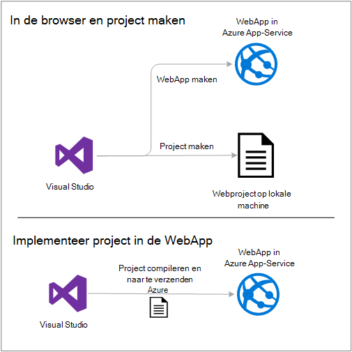

Aan het einde van de zelfstudie biedt een sectie [voor probleemoplossing](#troubleshooting) ideeën over wat u moet doen als iets niet werkt en een gedeelte van de [volgende stappen](#next-steps) bevat koppelingen naar andere zelfstudies met uitgebreide meer diepte over het gebruik van Azure App-Service.

Als dit een introductie zelfstudie is, is het webproject dat deze ziet u hoe u implementeren een eenvoudige die geen gebruikt in een database en heeft geen verificatie of machtiging. Zie [het implementeren van een Azure web-app](web-sites-deploy.md)voor koppelingen naar meer geavanceerde implementatie onderwerpen.

Afgezien van de tijd die is vereist voor het installeren van de Azure-SDK voor .NET, duurt deze zelfstudie ongeveer 10-15 minuten om te voltooien.

## Vereisten voor

* De zelfstudie wordt ervan uitgegaan dat u hebt gewerkt met ASP.NET MVC en Visual Studio. Als u een inleiding nodig hebt, raadpleegt u [Aan de slag met ASP.NET MVC 5](http://www.asp.net/mvc/overview/getting-started/introduction/getting-started).

* U moet een Azure-account. U kunt [een gratis Azure-account opent](/pricing/free-trial/?WT.mc_id=A261C142F) of [Visual Studio activeren abonnee voordelen](/pricing/member-offers/msdn-benefits-details/?WT.mc_id=A261C142F). 

    Als u aan de slag met Azure App Service wilt voordat u zich aanmeldt voor een Azure-account, gaat u naar [De App-Service probeert](http://go.microsoft.com/fwlink/?LinkId=523751). U kunt er een tijdelijk starter-app in de App Service maken, geen creditcard vereist en geen afspraken.

## De ontwikkelomgeving instellen

De zelfstudie is geschreven voor Visual Studio-2015 met de [Azure SDK voor .NET](../dotnet-sdk.md) 2,9 of hoger. 

* [Download de meest recente Azure SDK voor Visual Studio-2015](http://go.microsoft.com/fwlink/?linkid=518003). Als u dit nog niet is geïnstalleerd de SDK Visual Studio-2015.

    >[AZURE.NOTE] Afhankelijk van hoeveel van de afhankelijkheden SDK al op uw computer, kan het installeren van de SDK lang duren, enkele minuten aan een half uur of meer.

Als u wilt gebruiken die en Visual Studio 2013 hebt, kunt u [de meest recente Azure SDK voor Visual Studio 2013 downloaden](http://go.microsoft.com/fwlink/?LinkID=324322). Sommige schermen kunnen er anders uit in de afbeeldingen.

## Een nieuw webproject configureren

De volgende stap is het opzetten van een webproject in Visual Studio en een web-app in Azure App-Service. In dit gedeelte van de zelfstudie configureert u het nieuwe webproject. 

1. Open Visual Studio-2015.

2. Klik op **Bestand > Nieuw > Project**.

3. Klik in het dialoogvenster **Nieuw Project** op **Visual C# > Web > ASP.NET-webtoepassing**.

3. Zorg ervoor dat **.NET Framework 4.5.2** is geselecteerd als het doel-kader.

4.  [Azure toepassing inzichten](../application-insights/app-insights-overview.md) bewaakt uw web-app voor beschikbaarheid, prestaties en gebruik. Het selectievakje **Toepassing inzichten toevoegen aan Project** is ingeschakeld door de eerste standaardtijd voor die u een webproject maken na de installatie van Visual Studio. Schakel het selectievakje in als dit geselecteerd, maar u niet wilt proberen toepassing inzichten.

4. De toepassing **MyExample**een naam en klik vervolgens op **OK**.

    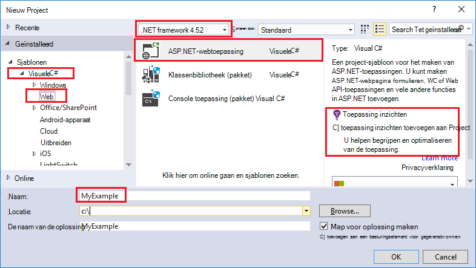

5. In het dialoogvenster **Nieuw ASP.NET-Project** , selecteert u de sjabloon **MVC** en klik vervolgens op **Wijzigen verificatie**.

    Voor deze zelfstudie kunt u een ASP.NET-MVC webproject implementeren. Als u weten hoe wilt u een ASP.NET Web API-project, raadpleegt u de sectie van de [volgende stappen](#next-steps) . 

    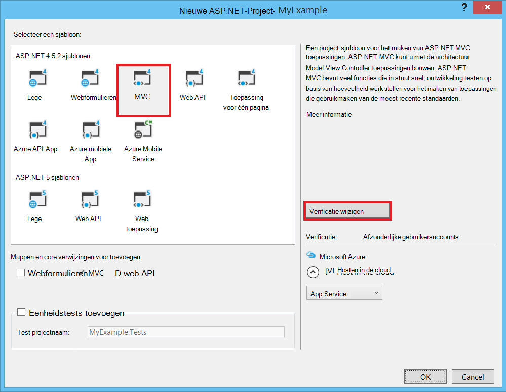

6. In het dialoogvenster **Verificatie wijzigen** , klikt u op **Geen verificatie**en klik vervolgens op **OK**.

    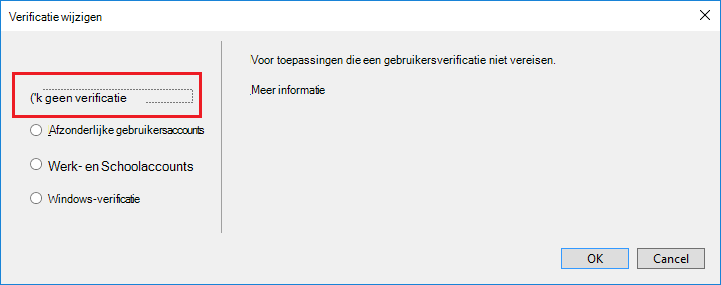

    Voor deze zelfstudie introductie bent u een eenvoudige-app die geen aanmelding implementeren.

5. Klik in de sectie **Microsoft Azure** van het dialoogvenster **Nieuw ASP.NET-Project** Zorg dat **in de cloud hosten** is ingeschakeld en dat de **App-Service** is geselecteerd in de vervolgkeuzelijst.

    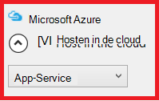

    Deze instellingen rechtstreekse Visual Studio om het maken van een Azure web-app voor uw webproject.

6. Klik op **OK**

## Azure resources voor een nieuwe web-app configureren

U kunt nu Visual Studio informeren over de Azure bronnen die u wilt laten maken.

5. Klik in het dialoogvenster **App-Service maken** op **een account toevoegen**en meld u aan bij Azure met de ID en wachtwoord van het account dat u gebruikt voor het beheren van uw Azure-abonnement.

    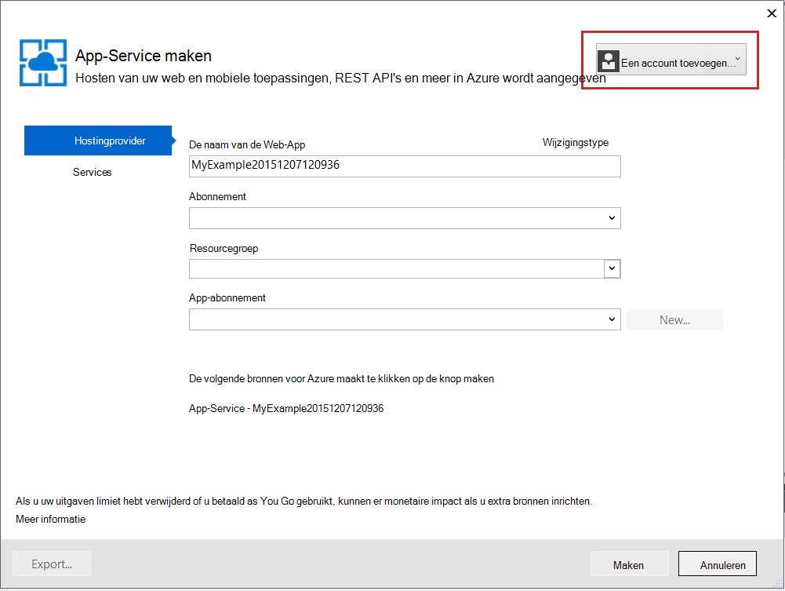

    Als u al aangemeld eerder op dezelfde computer, ziet u mogelijk niet de knop **een account toevoegen** . In dat geval kunt u deze stap overslaan of mogelijk moet u uw referenties opnieuw.
 
3. Voer een van **De naam van de Web-App** die uniek is in het domein *azurewebsites.net* . Bijvoorbeeld: u kunt noem deze MyExample met nummers aan de rechterkant tot deze uniek zijn, zoals MyExample810. Als een standaardnaam voor u wordt gemaakt, wordt deze uniek zijn en u het kunt gebruiken.

    Als iemand anders de naam die u invoert al gebruikt heeft, ziet u een rood uitroepteken rechts in plaats van een groen vinkje en u moet een andere naam invoeren.

    De URL voor uw toepassing wordt deze naam plus *. azurewebsites.net*. Als de naam is bijvoorbeeld `MyExample810`, is de URL `myexample810.azurewebsites.net`.

    U kunt ook een aangepast domein gebruiken met een Azure web-app. Zie [een aangepaste domeinnaam in Azure App-Service configureren](web-sites-custom-domain-name.md)voor meer informatie.

6. Klik op de knop **Nieuw** naast het vak **Resourcegroep** en voer vervolgens "MyExample" of een andere naam als u liever. 

    

    Een resourcegroep is een verzameling Azure bronnen zoals WebApps, databases en VMs. Voor een zelfstudie is dit gewoonlijk het beste een nieuwe resourcegroep maken, omdat die kunt u heel gemakkelijk verwijderen in één stap Azure bronnen die u voor de zelfstudie maken. Zie [overzicht van de Azure resourcemanager](../azure-resource-manager/resource-group-overview.md)voor meer informatie.

4. Klik op de knop **Nieuw** naast de **App-Service plannen** vervolgkeuzelijst.

    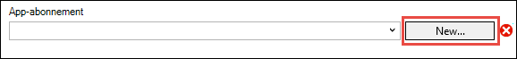

    Het dialoogvenster **App-Service plannen configureren** wordt weergegeven.

    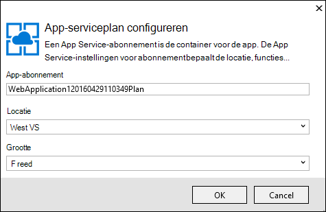

    In de volgende stappen uit configureert u een App Service-plan voor de nieuwe resourcegroep. Een App-serviceplan Hiermee geeft u de berekeningscluster bronnen die op uw web-app wordt uitgevoerd. Bijvoorbeeld als u de gratis laag kiest, uw API-app wordt uitgevoerd op gedeelde VMs, terwijl voor sommige betaalde lagen wordt uitgevoerd op speciale VMs. Zie [overzicht van de App Service-abonnementen](../app-service/azure-web-sites-web-hosting-plans-in-depth-overview.md)voor meer informatie.

5. Voer "MyExamplePlan" of een andere naam als u liever in het dialoogvenster **App-Service plannen configureren** .

5. Kies de locatie die zich het dichtst bij u in de vervolgkeuzelijst **locatie** .

    Deze instelling bepaalt welke Azure datacenter van de app wordt uitgevoerd in. Voor deze zelfstudie kunt u elke regio selecteren en deze won't Maak een opvallend verschil. Maar voor een app productie die u wilt uw server worden zo dicht mogelijk aan de clients die toegang krijgt tot te [Latentie](http://www.bing.com/search?q=web%20latency%20introduction&qs=n&form=QBRE&pq=web%20latency%20introduction&sc=1-24&sp=-1&sk=&cvid=eefff99dfc864d25a75a83740f1e0090)minimaliseren.

5. Klik in de vervolgkeuzelijst **grootte** op **gratis**.

    Voor deze zelfstudie de gratis prijzen laag, vindt u goed voldoende prestaties.

6. Klik op **OK**in het dialoogvenster **App-Service plannen configureren** .

7. Klik in het dialoogvenster **App-Service maken** op **maken**.

## Visual Studio Hiermee maakt u de project- en web app

In een korte tijdnotatie, meestal minder dan ongeveer een minuut gemaakt Visual Studio het webproject en de web-app.  

De **Oplossingverkenner** -venster ziet u de bestanden en mappen in het nieuwe project.

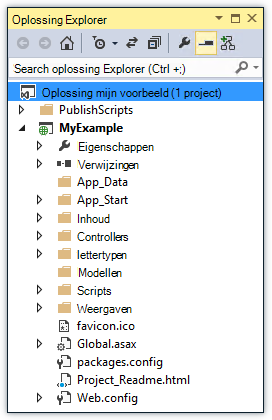

Het venster **Azure App serviceactiviteit** ziet u dat de web-app is gemaakt.

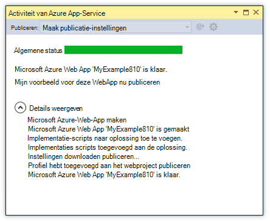

Het **Cloud Verkenner** -venster kunt u weergeven en beheren van Azure bronnen, waaronder de nieuwe web-app die u zojuist hebt gemaakt.

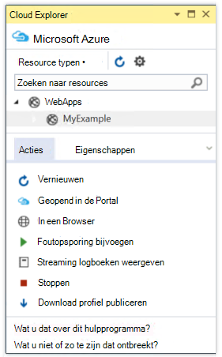
    
## Het webproject implementeren naar de Azure WebApp

In deze sectie, kunt u het webproject implementeren naar de web-app.

1. Met de rechtermuisknop op het project in **Solution Explorer**en kies **publiceren**.

    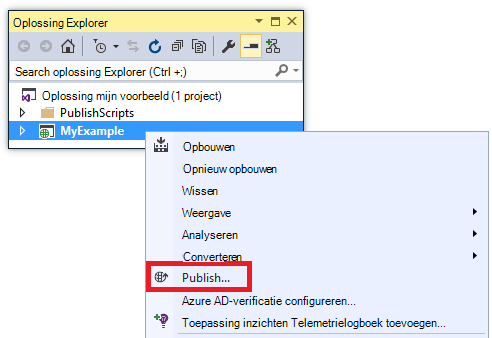

    In een paar seconden wordt de wizard **Publiceren** weergegeven. De wizard wordt geopend een *profiel te publiceren* met instellingen voor het implementeren van het webproject naar de nieuwe web-app.

    Het profiel publiceren bevat een gebruikersnaam en wachtwoord voor implementatie.  Deze referenties voor u zijn gegenereerd en u niet hoeft te deze invoeren. Het wachtwoord is versleuteld in een verborgen gebruiker / regiospecifieke-bestand in de `Properties\PublishProfiles` map.
 
8. Klik op het tabblad **verbinding** van de wizard **Publiceren** en op **volgende**.

    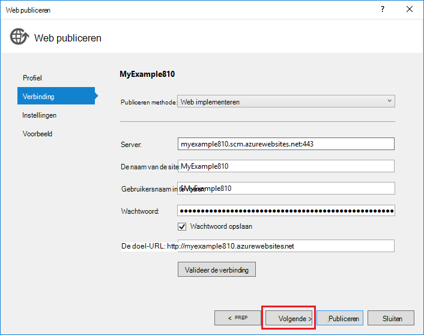

    Vervolgens wordt het tabblad **Instellingen** . Hier kunt u de opbouwconfiguratie als u wilt implementeren van een opbouwen foutopsporing voor [Foutopsporing op afstand](../app-service-web/web-sites-dotnet-troubleshoot-visual-studio.md#remotedebug). Het tabblad biedt ook verschillende [Opties voor het publiceren van bestand](https://msdn.microsoft.com/library/dd465337.aspx#Anchor_2).

10. Klik op het tabblad **Instellingen** op **volgende**.

    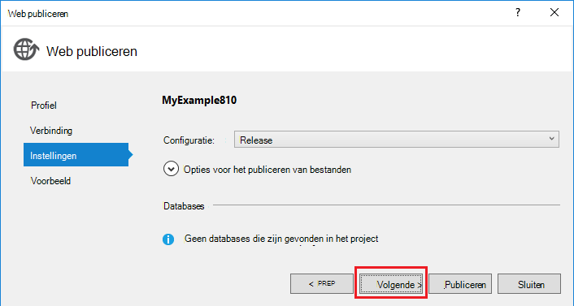

    Het tabblad **Preview** is volgende. Hier hebt u de mogelijkheid om te zien wat bestanden wilt worden gekopieerd van uw project naar de API-app. Wanneer u een project naar een API-app die u al geïmplementeerd distribueren bent in eerder, wordt alleen gewijzigde bestanden worden gekopieerd. Als u een overzicht wilt van wat worden gekopieerd, kunt u de knop **Voorbeeld starten** .

11. Klik op **publiceren**op het tabblad **Preview** .

    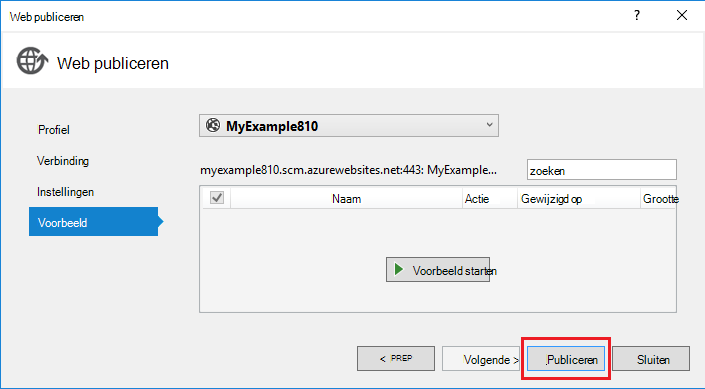

    Wanneer u op **publiceren**klikt, wordt het proces van het kopiëren van de bestanden naar de server Azure in Visual Studio gestart. Dit kan een paar minuten duren.

    De **uitvoer** en **Azure App serviceactiviteit** vensters weergeven welke acties implementatie zijn die u hebt gemaakt en meldt u de implementatie is voltooid.

    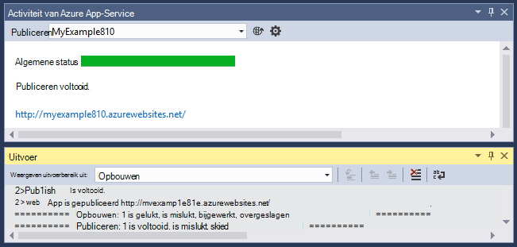

    Na een geslaagde implementatie, de standaardbrowser is automatisch wordt geopend aan de URL van de geïmplementeerd WebApp en de toepassing die u hebt gemaakt, wordt nu uitgevoerd in de cloud. De URL in de adresbalk van de browser ziet u dat de web-app van Internet is geladen.

    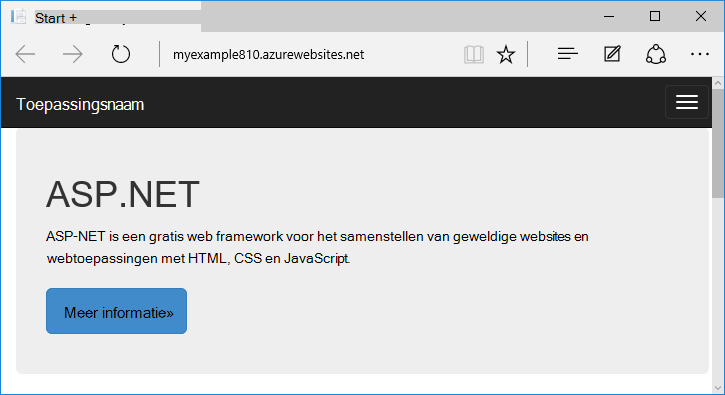

    > [AZURE.TIP]U kunt de werkbalk **Web één klik op publiceren** voor snelle distributie inschakelen. Klik op **Weergave > Werkbalken**, en selecteer vervolgens **Web één klik op publiceren**. U kunt de werkbalk selecteren van een profiel op een knop te publiceren, of klik op een knop voor het openen van de wizard **Publiceren** .
    > 

## Problemen oplossen

Als u een probleem ondervindt terwijl u deze zelfstudie doorloopt, zorg dat u de nieuwste versie van de Azure-SDK voor .NET gebruikt. De eenvoudigste manier om daarvoor is om te [downloaden van de Azure SDK voor Visual Studio-2015](http://go.microsoft.com/fwlink/?linkid=518003). Als u de huidige versie geïnstalleerd hebt, wordt het installatieprogramma van de Web-Platform kunt u weet dat er geen installatie nodig is.

Als u zich op een bedrijfsnetwerk en probeert te implementeren naar Azure App-Service via een firewall, zorg ervoor dat poort 443 en 8172 geopend om Web implementeren zijn. Als u deze poorten niet openen, raadpleegt u de volgende stappen hieronder voor andere implementatieopties.

Nadat u uw ASP.NET-web-app met App-Azure-Service hebt, is het raadzaam voor meer informatie over Visual Studio-functies die probleemoplossing vereenvoudigen. Zie voor informatie over logboekregistratie [Probleemoplossing Azure-WebApps in Visual Studio](web-sites-dotnet-troubleshoot-visual-studio.md)foutopsporing op afstand, en nog veel meer.

## Volgende stappen

In deze zelfstudie Bovendien hebt u geleerd hoe u een eenvoudige webtoepassing maken en het dashboard implementeren naar een Azure web-app. Hier volgen enkele Verwante onderwerpen en bronnen voor meer informatie over Azure App-Service:

* Controleren en beheren van uw web-app in de [portal van Azure](https://portal.azure.com/). 

    Zie [een overzicht van de Azure-portal](/services/management-portal/) en [-WebApps in Azure App-Service configureren](web-sites-configure.md)voor meer informatie.

* Een bestaand webproject implementeren naar een nieuwe WebApp, gebruik van Visual Studio

    Met de rechtermuisknop op het project in **Solution Explorer**en klik vervolgens op **publiceren**. Kies **Microsoft Azure App Service** als doel publiceren en klik vervolgens op **Nieuw**. De dialoogvensters zijn hetzelfde als wat u in deze zelfstudie hebt gezien.

* Een webproject van bronbeheer implementeren

    Zie [aan de slag met WebApps in Azure App-Service](app-service-web-get-started.md) en [het implementeren van een Azure web-app](web-sites-deploy.md)voor informatie over het [automatiseren van de implementatie](http://www.asp.net/aspnet/overview/developing-apps-with-windows-azure/building-real-world-cloud-apps-with-windows-azure/continuous-integration-and-continuous-delivery) van een [systeem voor bronbeheer gebruikt](http://www.asp.net/aspnet/overview/developing-apps-with-windows-azure/building-real-world-cloud-apps-with-windows-azure/source-control).

* Een ASP.NET-Web API implementeren naar een API-app in Azure App-Service

    U kunt het maken van een exemplaar van Azure App Service die voornamelijk is bedoeld voor het hosten van een website hebt gezien. App-Service biedt ook functies voor het hosten van Web API's, zoals CORS ondersteuning en ondersteuning voor API-metagegevens voor client code genereren. U kunt API-functies gebruiken in een WebApp, maar als u voornamelijk een API in een exemplaar van de App Service hosten wilt, een **API app** zou een betere keuze. Zie [aan de slag met de API-Apps en ASP.NET in Azure App-Service](../app-service-api/app-service-api-dotnet-get-started.md)voor meer informatie. 

* Een aangepaste domeinnaam en een SSL toevoegen

    Zie de volgende bronnen voor informatie over het gebruik van SSL en uw eigen domein (bijvoorbeeld www.contoso.com in plaats van contoso.azurewebsites.net):

    * [Een aangepaste domeinnaam in Azure App-Service configureren](web-sites-custom-domain-name.md)
    * [HTTPS inschakelen voor een Azure-website](web-sites-configure-ssl-certificate.md)

* De resourcegroep met uw web-app en alle gerelateerde Azure bronnen wanneer u klaar bent met hen verwijderen.

    Zie voor informatie over het werken met resourcegroepen in de portal van Azure [Deploy resources met resourcemanager sjablonen en Azure-portal](../resource-group-template-deploy-portal.md).   

*   Zie voor meer voorbeelden van het maken van een ASP.NET-Web-App in de App Service [maken en implementeren van een ASP.NET-web-app in Azure App Service](https://github.com/Microsoft/HealthClinic.biz/wiki/Create-and-deploy-an-ASP.NET-web-app-in-Azure-App-Service) en [maken en implementeren van een mobiele app in Azure App Service](https://github.com/Microsoft/HealthClinic.biz/wiki/Create-and-deploy-a-mobile-app-in-Azure-App-Service) uit de [HealthClinic.biz](https://github.com/Microsoft/HealthClinic.biz) 2015 verbinding maken met [demo](https://blogs.msdn.microsoft.com/visualstudio/2015/12/08/connectdemos-2015-healthclinic-biz/). Zie voor meer QuickStart uit de demo HealthClinic.biz [Azure ontwikkelaars hulpmiddelen voor QuickStart](https://github.com/Microsoft/HealthClinic.biz/wiki/Azure-Developer-Tools-Quickstarts).
