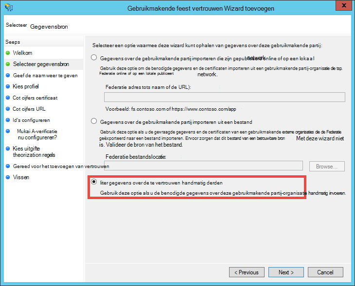
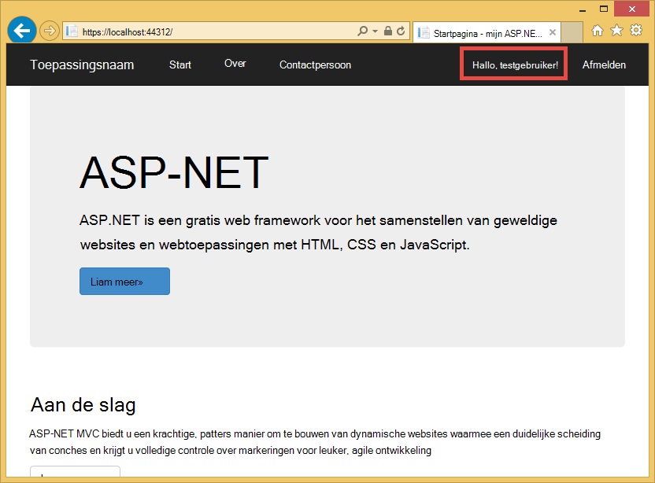

<properties 
    pageTitle="Een lijn-of-business Azure-app maken met AD FS-verificatie | Microsoft Azure" 
    description="Leer hoe u een lijn-of-business-app maakt in Azure App Service waarmee wordt geverifieerd met on-premises STS. Deze zelfstudie is bedoeld voor AD FS als de on-premises STS." 
    services="app-service\web" 
    documentationCenter=".net" 
    authors="cephalin" 
    manager="wpickett" 
    editor=""/>

<tags 
    ms.service="app-service-web" 
    ms.devlang="dotnet" 
    ms.topic="article" 
    ms.tgt_pltfrm="na" 
    ms.workload="web" 
    ms.date="08/31/2016" 
    ms.author="cephalin"/>

# Een lijn-of-business Azure-app maken met AD FS-verificatie

Dit artikel leest u hoe u een ASP.NET-MVC LOB-toepassing maakt in [Azure-Service voor App](../app-service/app-service-value-prop-what-is.md) een lokale [Active Directory Federation Services](http://technet.microsoft.com/library/hh831502.aspx) gebruiken als de identiteitsprovider. Dit scenario kunt werken wanneer u wilt maken van LOB-toepassingen in Azure App-Service, maar uw organisatie is vereist voor directory-gegevens ter plaatse worden opgeslagen.

>[AZURE.NOTE] Zie voor een overzicht van de opties voor verschillende bedrijfs-verificatie en autorisatie voor Azure App-Service, [verifiëren met lokale Active Directory in uw Azure-app](web-sites-authentication-authorization.md).

## Wat u wordt maken ##

U kunt een eenvoudige ASP.NET-toepassing in Azure App Service Web-Apps met de volgende functies worden maken:

- Gebruikers aan de hand AD FS verifieert
- Gebruik `[Authorize]` voor verschillende acties gebruikers toe te staan
- Statische configuratie voor foutopsporing in Visual Studio zowel publiceren naar de App Service Web Apps (één keer configureren, fouten opsporen en op elk gewenst moment publiceren)  

## Wat u nodig hebt ##

[AZURE.INCLUDE [free-trial-note](../../includes/free-trial-note.md)]

Moet u de volgende handelingen uit om te voltooien van deze zelfstudie:

- Een on-premises implementatie van AD FS (voor een end-to-end Stapsgewijze instructies voor de test-testomgeving in deze zelfstudie gebruikt, raadpleegt u [testomgeving testen: zelfstandige STS met AD FS in Azure VM (voor alleen-test)](https://blogs.msdn.microsoft.com/cephalin/2014/12/21/test-lab-standalone-sts-with-ad-fs-in-azure-vm-for-test-only/))
- Machtigingen voor het maken van te vertrouwen derden vertrouwensrelaties in AD FS-Management.
- Visual Studio 2013 Update 4 of hoger
- [Azure SDK punt 2.8.1](http://go.microsoft.com/fwlink/p/?linkid=323510&clcid=0x409) of hoger

## Voorbeeldtoepassing voor LOB-sjabloon gebruiken ##

De toepassing van de steekproef in deze zelfstudie [WebApp-WSFederation-DotNet)](https://github.com/AzureADSamples/WebApp-WSFederation-DotNet), wordt gemaakt door het team Azure Active Directory. Aangezien AD FS WS-Federatie ondersteunt, kunt u deze als een sjabloon LOB-toepassingen met gemak maken. Deze heeft de volgende functies:

- [WS-Federation](http://msdn.microsoft.com/library/bb498017.aspx) gebruikt om te verifiëren met een on-premises implementatie van AD FS
- Aanmelden en afmelden functionaliteit
- Gebruik [Microsoft.Owin](http://www.asp.net/aspnet/overview/owin-and-katana/an-overview-of-project-katana) (in plaats van Windows identiteit Foundation), dat wil zeggen de toekomstige ASP.NET en veel eenvoudiger om in te stellen voor verificatie en machtiging dan WIF

## Instellen van de steekproef-toepassing ##

2.  Klonen of de voorbeeld-oplossing bij [WebApp-WSFederation-DotNet](https://github.com/AzureADSamples/WebApp-WSFederation-DotNet) downloaden naar uw lokale map.

    > [AZURE.NOTE] De instructies op de [README.md](https://github.com/AzureADSamples/WebApp-WSFederation-DotNet/blob/master/README.md) uitgelegd hoe u voor het instellen van de toepassing met Azure Active Directory. Maar in deze zelfstudie ingesteld met AD FS, dus volgt u de volgende stappen proberen in plaats daarvan.

3.  Open de oplossing en vervolgens Controllers\AccountController.cs in de **Oplossing Explorer**openen.

    U ziet dat de code gewoon een uitdaging verificatie voor de verificatie van de gebruiker WS-Federatie met problemen. Alle verificatie is geconfigureerd in App_Start\Startup.Auth.cs.

4.  Open App_Start\Startup.Auth.cs. In de `ConfigureAuth` methode, houd rekening met de regel:

        app.UseWsFederationAuthentication(
            new WsFederationAuthenticationOptions
            {
                Wtrealm = realm,
                MetadataAddress = metadata                                      
            });

    In dit fragment is in de wereld OWIN echt minimaal moet u WS-Federation verificatie configureren. Het is veel eenvoudiger en meer elegante dan WIF, waar Web.config met XML overal ter plaatse is toegevoegd. De enige informatie die u nodig hebt, is het van de partij (RP)-ID en de URL van bestand met metagegevens van uw AD FS-service. Hier volgt een voorbeeld:

    -   RP-id:`https://contoso.com/MyLOBApp`
    -   Adres voor metagegevens:`http://adfs.contoso.com/FederationMetadata/2007-06/FederationMetadata.xml`

5.  In App_Start\Startup.Auth.cs, wijzigt u de volgende statische tekenreeks definities:  
    <pre class="prettyprint">
    privé statische tekenreeks realm = ConfigurationManager.AppSettings["ida:<mark>RPIdentifier</mark>"]; <mark><del>privé statische tekenreeks aadInstance ConfigurationManager.AppSettings["ida:AADInstance ="];</del></mark> 
     <mark><del>privé statische tekenreeks tenant ConfigurationManager.AppSettings["ida:Tenant ="];</del></mark> 
     <mark><del>privé statische tekenreeks metagegevens = tekenreeks. Opmaak ("{0} / {1} /federationmetadata/2007-06/federationmetadata.xml ', aadInstance, tenant);</del></mark> 
     <mark>privé statische tekenreeks metagegevens = tekenreeks. Opmaak ("https:// {0} /federationmetadata/2007-06/federationmetadata.xml', ConfigurationManager.AppSettings["ida:ADFS"]);</mark>

    <mark><del>tekenreeks instantie = String.Format (CultureInfo.InvariantCulture, aadInstance, tenant);</del></mark>
    </pre>

6.  Nu, moet u de bijbehorende wijzigingen aanbrengen in Web.config. Open het bestand Web.config en de volgende app-instellingen wijzigen:  
    <pre class="prettyprint">
    &lt;appSettings&gt;
    &lt;add key="webpages:Version" value="3.0.0.0" /&gt;
    &lt;add key="webpages:Enabled" value="false" /&gt;
    &lt;add key="ClientValidationEnabled" value="true" /&gt;
    &lt;add key="UnobtrusiveJavaScriptEnabled" value="true" /&gt;
      <mark><del>&lt;add key="ida:Wtrealm" value="[Enter the App ID URI of WebApp-WSFederation-DotNet https://contoso.onmicrosoft.com/WebApp-WSFederation-DotNet]" /&gt;</del></mark>
      <mark><del>&lt;add key="ida:AADInstance" value="https://login.windows.net" /&gt;</del></mark>
      <mark><del>&lt;add key="ida:Tenant" value="[Enter tenant name, e.g. contoso.onmicrosoft.com]" /&gt;</del></mark>
      <mark>&lt;add key="ida:RPIdentifier" value="[Enter the relying party identifier zoals geconfigureerd in AD FS, bijvoorbeeld https://localhost:44320 /] "/&gt;</mark>
      <mark>&lt;sleutel toevoegen met ="ida: ADFS"waarde ="[Voer de FQDN van AD FS-service, bijvoorbeeld adfs.contoso.com]"/&gt; </mark>        

    &lt;/appSettings&gt;
    </pre>

    Vul de sleutelwaarden op basis van de desbetreffende omgeving.

7.  De toepassing om ervoor te zorgen er geen fouten maken.

Dat is. De toepassing van de steekproef is nu klaar voor gebruik met AD FS. Nog steeds moet u een vertrouwensrelatie RP met deze toepassing in AD FS later configureren.

## De toepassing van de steekproef tot Azure App Service Web Apps implementeren

Hier publiceren u de toepassing naar een web-app in App Service Web Apps behoud de foutopsporing-omgeving. Houd er rekening mee dat u publiceren van de toepassing wilt voordat er een vertrouwensrelatie RP met AD FS, zodat verificatie nog steeds niet nog werkt. Als u deze kunt nu u wel de URL van de web-app die u voor het configureren van de vertrouwensrelatie RP later kunt gebruiken.

1. Met de rechtermuisknop op het project en selecteer **publiceren**.

    

2. Selecteer **Service van Microsoft Azure-App**.
3. Als u dit nog niet hebt aangemeld bij Azure weer te geven, klikt u op **Aanmelden** en gebruik van de Microsoft-account voor uw Azure-abonnement aan te melden.
4. Zodra aangemeld, klikt u op **Nieuw** om een WebApp maken op te geven.
5. Vul alle verplichte velden in. U wilt verbinden met on-premises gegevens later, zodat een database voor deze web-app niet maken.

    

6. Klik op **maken**. Nadat de web-app is gemaakt, wordt het dialoogvenster publiceren Web wordt geopend.
7. Wijzig in **De doel-URL**, **http** in **https**. Kopieer de volledige URL naar een teksteditor voor later gebruik. Klik vervolgens op **publiceren**.

    

11. Open in Visual Studio, **Web.Release.config** in uw project. Invoegen van de volgende XML in de `<configuration>` markeren en de sleutelwaarde vervangen door de URL van uw publiceren web-app.  
    <pre class="prettyprint">
&lt;appSettings&gt;
   &lt;sleutel toevoegen met = "ida: RPIdentifier" waarde = "<mark>[bijvoorbeeld https://mylobapp.azurewebsites.net/]</mark>" xdt:Transform = "SetAttributes" xdt:Locator="Match(key)" /&gt;
&lt;/appSettings&gt;</pre>

Wanneer u klaar bent, hebt u twee RP-id's, dat is geconfigureerd in uw project, één voor uw omgeving voor foutopsporing in Visual Studio en één voor de gepubliceerde web-app in Azure wordt aangegeven. U wordt een vertrouwensrelatie RP instellen voor elk van de twee omgevingen in AD FS. Tijdens de foutopsporing, worden de instellingen voor de app in Web.config gebruikt voor het maken van uw configuratie **fouten opsporen in** werken met AD FS. Wanneer deze wordt gepubliceerd (standaard de **Release** -configuratie wordt gepubliceerd), een getransformeerd Web.config waarin de instelling app wijzigingen in Web.Release.config wordt geüpload.

Als u wilt toevoegen van de gepubliceerde web-app in Azure wordt aangegeven naar foutopsporing (dat wil zeggen moet u symbolen van de code in de gepubliceerde WebApp uploaden), kunt u een kopie van de configuratie foutopsporing voor Azure foutopsporing, maar met een eigen aangepaste Web.config transformatie (bijvoorbeeld Web.AzureDebug.config) die gebruikmaakt van de app-instellingen uit Web.Release.config maken. Hiermee kunt u een statische configuratie onderhouden in de verschillende omgevingen.

## Gebruikmakende partij vertrouwensrelaties in AD FS Management configureren ##

U moet nu een vertrouwensrelatie RP in AD FS Management configureren voordat u kunt uw voorbeeldtoepassing gebruiken en dat is wel met AD FS verifiëren. Moet u voor het instellen van twee afzonderlijke RP vertrouwensrelaties, één voor uw omgeving voor foutopsporing en één voor uw gepubliceerde web-app.

> [AZURE.NOTE] Zorg ervoor dat u de volgende stappen voor beide van de omgevingen herhalen.

4.  Aanmelden op de AD FS-server, met de referenties die management AD FS hebben.
5.  Open de AD FS-Management. Met de rechtermuisknop op **AD FS\Trusted Relationships\Relying partijen vertrouwensrelaties** en selecteer **Toevoegen te vertrouwen partijen vertrouwen**.

    

5.  Selecteer de **gegevens over de gebruikmakende partij handmatig invoeren**in de pagina **Gegevensbron selecteren** . 

    

6.  Typ een weergavenaam voor de toepassing op de pagina **Weergegeven naam opgeven** en op **volgende**.
7.  Klik op **volgende**op de pagina **Protocol kiezen** .
8.  Klik op **volgende**op de pagina **Certificaat configureren** .

    > [AZURE.NOTE] Aangezien moet u HTTPS al, zijn versleuteld tokens optioneel. Als u zeker versleutelen tokens afgeleid van AD FS op deze pagina wilt, moet u ook token decoderen logica toevoegen in uw code. Zie [OWIN WS-Federation middleware handmatig configureren en accepteren van versleutelde tokens](http://chris.59north.com/post/2014/08/21/Manually-configuring-OWIN-WS-Federation-middleware-and-accepting-encrypted-tokens.aspx)voor meer informatie.
  
5.  Voordat u naar de volgende stap verplaatsen, moet u gegevens uit het project Visual Studio. Opmerking de **SSL-URL** van de toepassing in de Projecteigenschappen van het. 

    

6.  Selecteer de **ondersteuning voor het WS-Federation passieve protocol inschakelen** en typt u in de SSL-URL van uw Visual Studio-project die u in de vorige stap hebt genoteerd terug in AD FS beheer op de pagina **URL configureren** van de **Te vertrouwen partijen vertrouwen Wizard toevoegen**. Klik vervolgens op **volgende**.

    

    > [AZURE.NOTE] URL geeft aan waar de klant verzenden als verificatie is geslaagd. Voor de omgeving foutopsporing moet <code>https://localhost:&lt;port&gt;/</code>. Voor de gepubliceerde web-app moet de URL van de web-app.

7.  Controleer of uw project SSL-URL al wordt weergegeven op de pagina **Configureren id's** en op **volgende**. Klik op **volgende** helemaal naar het einde van de wizard met standaardselecties.

    > [AZURE.NOTE] In de App_Start\Startup.Auth.cs van uw project Visual Studio, deze id wordt vergeleken met de waarde van <code>WsFederationAuthenticationOptions.Wtrealm</code> tijdens federatieve verificatie. De URL van de toepassing van de vorige stap wordt standaard toegevoegd als een RP-id.

8.  U bent nu klaar voor het configureren van de toepassing RP voor uw project in AD FS. Vervolgens kunt u deze toepassing verzenden de claims die nodig zijn voor uw toepassing configureren. Het dialoogvenster **Claimen regels bewerken** wordt geopend al dan niet standaard voor u aan het einde van de wizard zodat u meteen kunt gaan. Laten we configureren ten minste de volgende claims (met schema's tussen haakjes):

    -   Naam (http://schemas.xmlsoap.org/ws/2005/05/identity/claims/name) - wordt gebruikt door ASP.NET voor hydrate `User.Identity.Name`.
    -   UPN (http://schemas.xmlsoap.org/ws/2005/05/identity/claims/upn) - waarmee gebruikers in de organisatie.
    -   Groepslidmaatschap als rollen (http://schemas.microsoft.com/ws/2008/06/identity/claims/role) - kan worden gebruikt met `[Authorize(Roles="role1, role2,...")]` : decoratie controllers/acties toe te staan. Deze methode mogelijk in feite niet de meeste zodat voor rolautorisatie. Als uw gebruikers AD deel uitmaakt van honderden beveiligingsgroepen, worden honderden rol claims in het SAML-token. Een alternatief benadering is een claim één functie voorwaardelijk afhankelijk van het lidmaatschap van de gebruiker in een bepaalde groep verzenden. Echter wordt we Houd het eenvoudig voor deze zelfstudie.
    -   Gebruikersnaam (http://schemas.xmlsoap.org/ws/2005/05/identity/claims/nameidentifier) - kan worden gebruikt voor ter voorkoming validatie. Zie de sectie **toevoegen LOB - functionaliteit** van [een - LOB Azure app met Azure Active Directory-verificatie maken](web-sites-dotnet-lob-application-azure-ad.md#bkmk_crud)voor meer informatie over hoe u deze werken met gegevensvalidatie ter voorkoming.

    > [AZURE.NOTE] De claimtypen die u wilt configureren voor uw toepassing wordt bepaald door de behoeften van uw toepassing. Voor de lijst met claims die worden ondersteund door Azure Active Directory-toepassingen (dat wil zeggen RP vertrouwensrelaties), Zie bijvoorbeeld [Token ondersteund en typen](http://msdn.microsoft.com/library/azure/dn195587.aspx).

8.  Klik op **Regel toevoegen**in het dialoogvenster claimen regels bewerken.
9.  De naam, UPN en rol claims configureren, zoals wordt weergegeven in de schermafbeelding en klik op **Voltooien**.

    

    Vervolgens kunt u een tijdelijke naam ID claimen met de stappen in [De naam van id's in SAML bevestigingen](http://blogs.msdn.com/b/card/archive/2010/02/17/name-identifiers-in-saml-assertions.aspx)gedemonstreerd maken.

9.  Klik nogmaals op **Regel toevoegen** .
10. **Een aangepaste regel Claims verzenden** en klik op **volgende**.
11. Plak de volgende regel taal in het vak **aangepaste regel** , naam voor de regel **Per sessie-id** en klik op **Voltooien**.  
    <pre class="prettyprint">
    C1: [Type == "http://schemas.microsoft.com/ws/2008/06/identity/claims/windowsaccountname"] &amp; &amp; 
    c2: [Type == "http://schemas.microsoft.com/ws/2008/06/identity/claims/authenticationinstant"] = > toevoegen (opslaan = "_OpaqueIdStore", typen = ("<mark>http://contoso.com/internal/sessionid</mark>"), query = "{0}; { 1}; {2}; {3}; {4} ", parameter ="useEntropy", parameter = c1. Waarde, parameter = c1. OriginalIssuer, parameter = "", parameter = c2. Waarde);
    </pre>

    Uw aangepaste regel ziet er als deze schermafbeelding:

    

9.  Klik nogmaals op **Regel toevoegen** .
10. Selecteer **een binnenkomende Claim transformeren** en klik op **volgende**.
11. Configureer de regel zoals wordt weergegeven in de schermafbeelding (via het claimtype die u hebt gemaakt in de aangepaste regel) en klik op **Voltooien**.

    

    Zie voor gedetailleerde informatie over de stappen voor de tijdelijke naam-ID claimen, [De naam van id's in SAML bevestigingen](http://blogs.msdn.com/b/card/archive/2010/02/17/name-identifiers-in-saml-assertions.aspx).

12. Klik op **toepassen** in het dialoogvenster **Claimen regels bewerken** . Dit moet nu de volgende schermafbeelding eruit:

    

    > [AZURE.NOTE] Nogmaals, zorg dat u Herhaal deze stappen voor zowel uw foutopsporing-omgeving en de gepubliceerde WebApp.

## Federatieve verificatie voor uw toepassing testen

U bent klaar om te testen van uw toepassing verificatie logica ten opzichte van AD FS. In mijn AD FS-testomgeving heb ik een testgebruiker die bij een testgroep in Active Directory (AD hoort).

Als u wilt testen verificatie in foutopsporing, hoeft u nu type is `F5`. Als u testen verificatie in de gepubliceerde WebApp wilt, gaat u naar de URL.

Nadat de webtoepassing wordt geladen, klikt u op **Aanmelden**. U moet nu wordt er een aanmeldingsdialoogvenster of de aanmeldingspagina served door AD FS, afhankelijk van de gekozen door AD FS verificatiemethode. Hier ziet u wat wordt er in Internet Explorer 11.

Zodra u met een gebruiker in het domein AD van de AD FS-implementatie aanmelden, u ziet nu de startpagina van opnieuw met **Hallo, <User Name>!** in de hoek. Hier ziet u wat ik krijg.

U hebt dusverre is voltooid in de volgende manieren:

- Uw toepassing heeft bereikt AD FS en een overeenkomende RP-id wordt gevonden in de AD FS-database
- AD FS heeft geverifieerd een AD-gebruiker en omleiden die u terug naar de startpagina van de toepassing
- AD FS als verzonden de claim (http://schemas.xmlsoap.org/ws/2005/05/identity/claims/name) in uw toepassing, zoals aangegeven met het feit dat de gebruikersnaam wordt weergegeven in de hoek. 

Als de claim ontbreekt, u zou hebt gezien **Hallo,!**. Als u naar Views\Shared kijkt\_LoginPartial.cshtml, u hebt gevonden dat wordt gebruikt `User.Identity.Name` om weer te geven van de gebruikersnaam in te voeren. Zoals eerder is vermeld, als de claim van de geverifieerde gebruiker beschikbaar in het SAML-token is, hydrates ASP.NET deze eigenschap met deze. Als u wilt zien van alle claims die worden verzonden door AD FS, plaatst u een onderbrekingspunt op Controllers\HomeController.cs, in de Index actie-methode. Nadat de gebruiker is geverifieerd, controleren het `System.Security.Claims.Current.Claims` siteverzamelingen.

 

## Autoriseer gebruikers voor specifieke domeincontrollers of acties

Aangezien u in de configuratie van uw RP vertrouwensrelaties groepslidmaatschap als rol claims hebt opgenomen, kunt u nu gebruiken deze rechtstreeks in de `[Authorize(Roles="...")]` : decoratie voor controllers en acties. In een LOB-toepassing met het patroon maken, lezen, bijwerken, verwijderen (CRUD), kunt u specifieke rollen voor toegang tot elke actie Autoriseer. Nu wordt u deze functie op de controller uit bestaande start alleen uitproberen.

1. Open Controllers\HomeController.cs.
2. Verfraaien de `About` en `Contact` actie methoden vergelijkbaar is met de volgende code, beveiliging met groeperen lidmaatschappen die uw geverifieerde gebruiker heeft.  
    <pre class="prettyprint">
    <mark>[Autoriseer (rollen = "Test groep")]</mark> 
    openbare ActionResult About() {ViewBag.Message = "Uw toepassing beschrijving page.";

        return View();
    }

    <mark>[Autoriseer (rollen = "Domain Admins")]</mark> 
    openbare ActionResult Contact() {ViewBag.Message = "Uw contactpersonen page.";

        return View();
    }  </pre>

    Aangezien ik in mijn AD FS-testomgeving **Testen gebruiker** toegevoegd aan **Test groep** ik Test groep gebruiken om te testen autorisatie op `About`. Voor `Contact`, test ik de negatieve hoofdletters/kleine letters **Domain Admins**, waartoe **Testen gebruiker** niet behoren.

3. Foutopsporing starten door te typen `F5` en meld u aan en klik op **over**. U moet nu bekijkt u de `~/About/Index` pagina is, als uw geverifieerde gebruiker is gemachtigd voor deze actie.
4. Klik nu op **contactpersoon**in mijn hoofdletters/kleine letters moet de **Gebruiker testen** niet Autoriseer voor de actie. De browser is echter omgeleid naar de AD FS, waarin wordt getoond uiteindelijk dit bericht:

    

    Als u deze fout in Logboeken op de AD FS-server onderzoeken, ziet u dit Uitzonderingsbericht:  
    <pre class="prettyprint">
   Microsoft.IdentityServer.Web.InvalidRequestException: MSIS7042: <mark>dezelfde client browsersessie '6' aanvragen heeft aangebracht in de laatste 11 seconden.</mark> Neem contact op met uw beheerder voor meer informatie.
   bij Microsoft.IdentityServer.Web.Protocols.PassiveProtocolHandler.UpdateLoopDetectionCookie (WrappedHttpListenerContext context) bij Microsoft.IdentityServer.Web.Protocols.WSFederation.WSFederationProtocolHandler.SendSignInResponse (WSFederationContext context, MSISSignInResponse antwoord) bij Microsoft.IdentityServer.Web.PassiveProtocolListener.ProcessProtocolRequest (ProtocolContext protocolContext, PassiveProtocolHandler protocolHandler) bij Microsoft.IdentityServer.Web.PassiveProtocolListener.OnGetContext (WrappedHttpListenerContext context) </pre>

    De reden voor deze fout is standaard MVC geeft als resultaat een 401 niet gemachtigd wanneer de rollen van een gebruiker bent niet gemachtigd. Hierdoor wordt een nieuwe verificatie-verzoek om uw identiteitsprovider (AD FS). Aangezien de gebruiker al is geverifieerd, AD FS geeft als resultaat op dezelfde pagina, waarin vervolgens een andere 401 verleent, voor het maken van een lus omleiden. U wordt overschreven door de AuthorizeAttribute `HandleUnauthorizedRequest` methode met eenvoudige logica voor het weergeven van een ander nummer die relevant is in plaats van de lus redirect doorlopende.

5. Een bestand maken in het project AuthorizeAttribute.cs genoemd en plak de volgende code erin.

        using System;
        using System.Web.Mvc;
        using System.Web.Routing;
        
        namespace WebApp_WSFederation_DotNet
        {
            [AttributeUsage(AttributeTargets.Class | AttributeTargets.Method, Inherited = true, AllowMultiple = true)]
            public class AuthorizeAttribute : System.Web.Mvc.AuthorizeAttribute
            {
                protected override void HandleUnauthorizedRequest(AuthorizationContext filterContext)
                {
                    if (filterContext.HttpContext.Request.IsAuthenticated)
                    {
                        filterContext.Result = new System.Web.Mvc.HttpStatusCodeResult((int)System.Net.HttpStatusCode.Forbidden);
                    }
                    else
                    {
                        base.HandleUnauthorizedRequest(filterContext);
                    }
                }
            }
        }

    De code overschrijven stuurt een HTTP 403 (niet toegestaan) in plaats van HTTP 401 (niet gemachtigd) in de geverifieerde maar onbevoegde gevallen.

6. Uitvoeren foutopsporing opnieuw met `F5`. Nu te klikken op **contactpersoon** , ziet u een informatiever (die mogelijk zwartwitprinter) foutbericht wordt weergegeven:

    

7. Publiceer de toepassing opnieuw tot Azure App Service Web Apps en het gedrag van de live-toepassing te testen.

## On-premises gegevens verbinden

Een reden zou willen implementeren van uw LOB-toepassing met AD FS in plaats van Azure Active Directory is naleving problemen met het onthouden van organisatie gegevens uit-premises. Dit kan ook betekenen dat uw web-app in Azure moet access-databases van de on-premises, omdat u bent niet gemachtigd [SQL-Database](/services/sql-database/) als de gegevenslaag gebruiken voor uw Webapps.

Azure WebApps van de App-Service ondersteuning biedt voor toegang tot on-premises-databases met twee methoden: [Hybride verbindingen](../biztalk-services/integration-hybrid-connection-overview.md) en [Virtuele netwerken](web-sites-integrate-with-vnet.md). Zie [Gebruik VNET integratie en hybride verbindingen met Azure App Service Web Apps](https://azure.microsoft.com/blog/2014/10/30/using-vnet-or-hybrid-conn-with-websites/)voor meer informatie.

## Meer informatiebronnen

- [De toepassing met SSL en het kenmerk autoriseren beveiligen](web-sites-dotnet-deploy-aspnet-mvc-app-membership-oauth-sql-database.md#protect-the-application-with-ssl-and-the-authorize-attribute)
- [Verificatie met on-premises Active Directory in uw Azure-app](web-sites-authentication-authorization.md)
- [Een lijn-of-business Azure-app maken met Azure Active Directory-verificatie](web-sites-dotnet-lob-application-azure-ad.md)
- [De optie in On-Premises organisatie-verificatie (ADFS) gebruiken met ASP.NET in Visual Studio 2013](http://www.cloudidentity.com/blog/2014/02/12/use-the-on-premises-organizational-authentication-option-adfs-with-asp-net-in-visual-studio-2013/)
- [Migreren van een Project van de Web VS2013 van WIF naar Katana](http://www.cloudidentity.com/blog/2014/09/15/MIGRATE-A-VS2013-WEB-PROJECT-FROM-WIF-TO-KATANA/)
- [Overzicht van Active Directory Federation Services](http://technet.microsoft.com/library/hh831502.aspx)
- [WS-Federation 1.1-specificatie](http://download.boulder.ibm.com/ibmdl/pub/software/dw/specs/ws-fed/WS-Federation-V1-1B.pdf?S_TACT=105AGX04&S_CMP=LP)

