<properties 
    pageTitle="Een lijn-of-business Azure-app maken met Azure Active Directory-verificatie | Microsoft Azure" 
    description="Meer informatie over het maken van een ASP.NET-MVC LOB-app in Azure App Service waarmee wordt geverifieerd met Azure Active Directory" 
    services="app-service\web, active-directory" 
    documentationCenter=".net" 
    authors="cephalin" 
    manager="wpickett" 
    editor=""/>

<tags 
    ms.service="app-service-web" 
    ms.devlang="dotnet" 
    ms.topic="article" 
    ms.tgt_pltfrm="na" 
    ms.workload="web" 
    ms.date="09/01/2016" 
    ms.author="cephalin"/>

# Een lijn-of-business Azure-app maken met Azure Active Directory-verificatie #

In dit artikel leest u hoe u een .NET LOB-app maken in [Azure App Service Web Apps](http://go.microsoft.com/fwlink/?LinkId=529714) met behulp de [verificatie / autorisatie](../app-service/app-service-authentication-overview.md) functie. Ook ziet u het gebruik van de [Azure Active Directory Graph API](https://msdn.microsoft.com/Library/Azure/Ad/Graph/api/api-catalog) query directory-gegevens in de toepassing.

De Azure Active Directory-tenant dat u gebruikt mogelijk een alleen-Azure-directory. Of het kan zijn [gesynchroniseerd met uw on-premises Active Directory](../active-directory/active-directory-aadconnect.md) een functionaliteit voor eenmalige aanmelding voor werknemers die on-premises en remote zijn maken. In dit artikel worden de standaardmap voor uw Azure-account gebruikt.

## Wat u wordt maken ##

U wordt een eenvoudige LOB-maken, lezen, bijwerken, verwijderen (CRUD)-toepassing in App Service Web Apps bouwen dat nummers items met de volgende functies werken:

- Verifieert gebruikers ten opzichte van de Azure Active Directory
- Query's Directory: gebruikers en groepen [Azure Active Directory Graph-API](http://msdn.microsoft.com/library/azure/hh974476.aspx) gebruiken
- Gebruik de sjabloon ASP.NET MVC *Geen verificatie*

Als u nodig Rolgebaseerd toegangsbeheer (RBAC) voor de LOB-app in Azure wordt aangegeven hebt, raadpleegt u de [Volgende stap](#next).

## Wat u nodig hebt ##

[AZURE.INCLUDE [free-trial-note](../../includes/free-trial-note.md)]

Moet u de volgende handelingen uit om te voltooien van deze zelfstudie:

- Een Azure Active Directory-tenant met gebruikers in verschillende groepen
- Machtigingen voor het maken van toepassingen op de Azure Active Directory-tenant
- Visual Studio 2013 Update 4 of hoger
- [Azure SDK punt 2.8.1 of hoger](https://azure.microsoft.com/downloads/)

## Maken en implementeren van een web-app naar Azure ##

1. Klik op **bestand**in Visual Studio, > **Nieuw** > **Project**.

2. Selecteren van **ASP.NET-webtoepassing**, naam van uw project en klik op **OK**.

3. Selecteer de sjabloon **MVC** en vervolgens de verificatie wijzigen in **Geen verificatie**. Controleer of **dat host in de Cloud** is geselecteerd en klik op **OK**.

    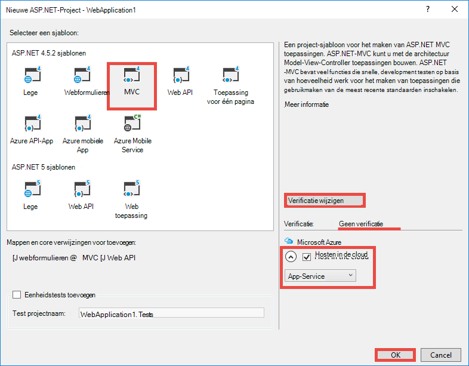

4. Klik in het dialoogvenster **App-Service maken** op **een account toevoegen** (en klik vervolgens **een account toevoegen** in de vervolgkeuzelijst) aan te melden bij uw Azure-account.

5. Nadat u bent aangemeld configureert u uw web-app. Maak een resourcegroep en een nieuwe App-serviceplan door te klikken op de desbetreffende knop **Nieuw** . Klik op **verkennen aanvullende Azure services** om door te gaan.

    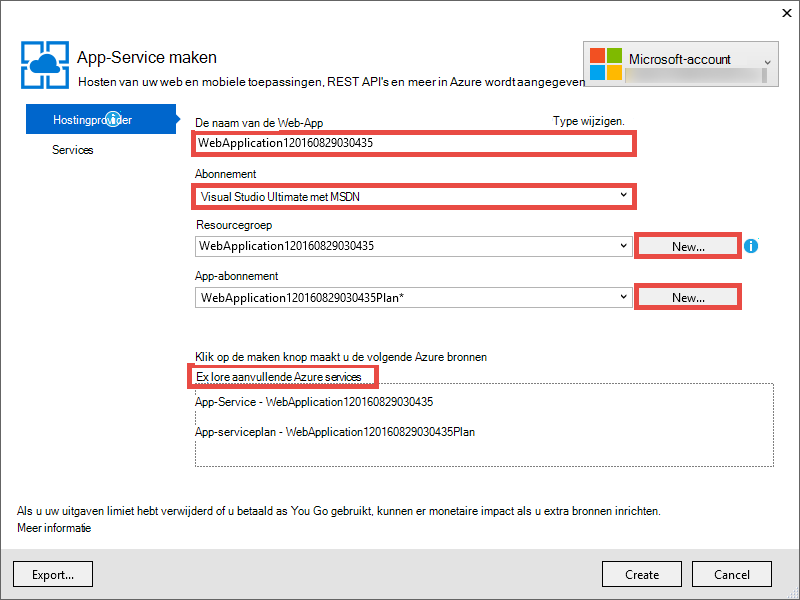

6. Klik op het tabblad **Services** op **+** om toe te voegen een SQL-Database voor de app. 

    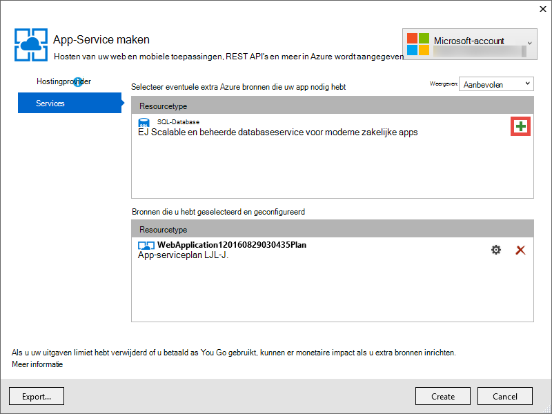

7. Klik op **Nieuw** om te maken van een SQL Server-instantie in **SQL-Database configureren**.

8. Configureer uw SQL Server-instantie in **SQL Server configureren**. Klik vervolgens op **OK**, **OK**en **maken** op het app-maken in Azure gang.

9. **Azure App serviceactiviteit**, kunt u zien wanneer het maken van de app is voltooid. Klik op * *publiceren &lt; *toepassingsnaam*> dit Web App nu**klikt u op **publiceren **. 

    Zodra u Visual Studio is voltooid, wordt de app publiceren in de browser geopend. 

    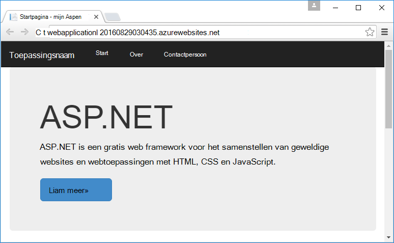

## Verificatie- en directory-toegang configureren

1. Meld u aan bij de [portal van Azure](https://portal.azure.com).

2. Klik op **App-Services**in het linkermenu > **&lt;*toepassingsnaam*>** > **verificatie / autorisatie **.

    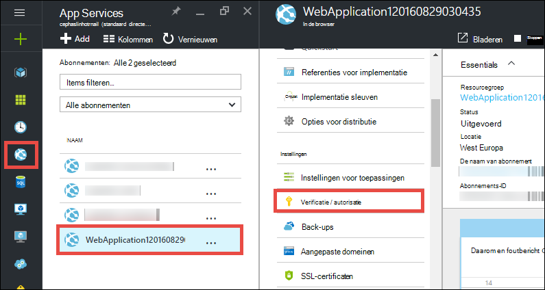

3. Azure Active Directory-verificatie inschakelen door te klikken **op** > **Azure Active Directory** > **Express** > **OK**.

    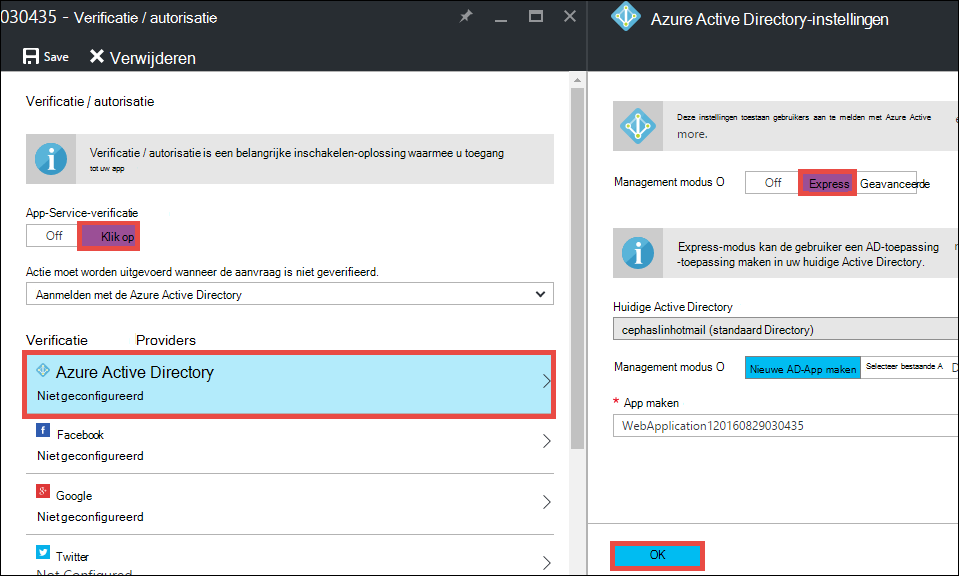

4. Klik op **Opslaan** in de opdrachtenbalk.

    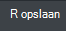

    Wanneer de verificatie-instellingen zijn opgeslagen, kunt u navigeren naar uw app opnieuw in de browser. De standaardinstellingen voor afdwingen verificatie wordt gebruik voor de hele app. Als u nog niet bent aangemeld, wordt u omgeleid naar een loginscherm. Nadat u bent aangemeld, kunt u uw app beveiligd door middel van HTTPS zien. Vervolgens moet u toegang tot directorygegevens in te schakelen. 

5. Ga naar de [klassieke portal](https://manage.windowsazure.com).

6. Klik in het linkermenu op **Active Directory** > **Default Directory** > **toepassingen** > **&lt;*toepassingsnaam*> **.

    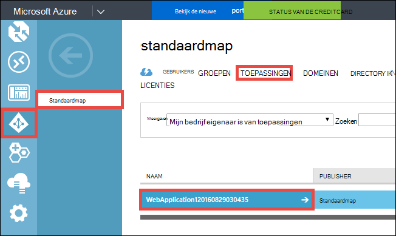

    Dit is de Azure Active Directory-toepassing die App Service voor u gemaakt waarmee de autorisatie / verificatie-functie.

7. Klik op **gebruikers** en **groepen** om ervoor te zorgen dat er enkele gebruikers en groepen in de adreslijst. Zo niet, enkele testgebruikers en groepen maken.

    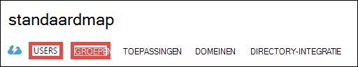

7. Klik op **configureren** om te configureren van deze toepassing.

8. Schuif omlaag naar de sectie **toetsen** en voeg een sleutel toe door te selecteren van de duur van een. Vervolgens klikt u op **Gedelegeerde machtigingen** en **alleen directorygegevens**selecteren. Klik op **Opslaan**.

    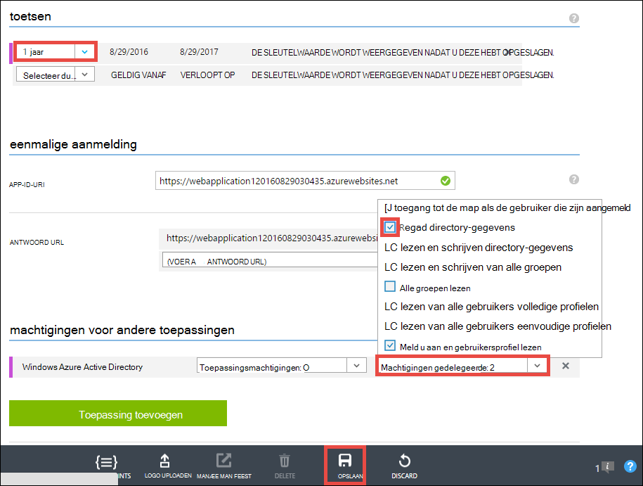

8. Wanneer uw instellingen die zijn opgeslagen, schuif terug naar de sectie **toetsen** en klik op de knop **kopiëren** als u wilt kopiëren van de client-toets. 

    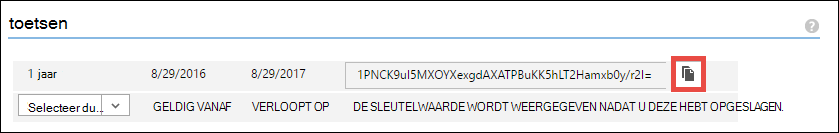

    >[AZURE.IMPORTANT] Als u deze pagina nu afsluit, kunt u deze toets client ooit opnieuw toegang kan niet worden.

9. Vervolgens moet u uw web-app configureren met deze toets. Meld u aan bij de [Azure Resource Explorer](https://resources.azure.com) met uw Azure-account.

10. Aan de bovenkant van de pagina, klikt u op **Alleen-lezen/schrijven** als u wijzigingen in de Resource Azure Explorer.

    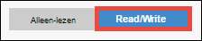

11. Zoek de verificatie-instellingen voor uw app te vinden op abonnementen > * *&lt;*subscriptionname*>** > **resourceGroups** > **&lt;*resourcegroupname*>** > **providers** > **Microsoft.Web** > **sites** > **&lt;*toepassingsnaam*>** > **config** > **authsettings **.

12. Klik op **bewerken**.

    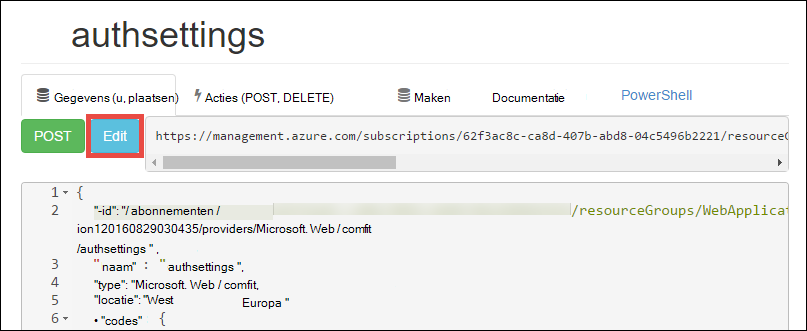

13. Stel in het deelvenster bewerken de `clientSecret` en `additionalLoginParams` eigenschappen als volgt.

        ...
        "clientSecret": "<client key from the Azure Active Directory application>",
        ...
        "additionalLoginParams": ["response_type=code id_token", "resource=https://graph.windows.net"],
        ...

14. Klik op **plaatsen** aan de bovenkant uw wijzigingen wilt indienen.

    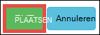

14. Nu, als u wilt testen als u het Autorisatietoken voor toegang tot de API Azure Active Directory grafiek hebt, net Navigeer naar * *https://&lt;*toepassingsnaam*>.azurewebsites.net/.auth/me** in uw browser. Als u alles correct ingesteld, ziet u de `access_token` eigenschap in de JSON-reactie.

    De `~/.auth/me` URL-pad wordt beheerd door de verificatie van de App-Service / autorisatie zodat u alle gegevens die zijn gerelateerd aan uw geverifieerde sessie. Zie [verificatie en autorisatie in Azure App-Service](../app-service/app-service-authentication-overview.md)voor meer informatie.

    >[AZURE.NOTE] De `access_token` heeft een verloopdatum. Echter App Service verificatie / autorisatie biedt token vernieuwen functionaliteit met `~/.auth/refresh`. Zie voor meer informatie over het gebruik van deze     [App Service Token Store](https://cgillum.tech/2016/03/07/app-service-token-store/).

Vervolgens doet u iets nuttigs doen met directory-gegevens.

## LOB-functionaliteit toevoegen aan uw app

Nu maken u een eenvoudige CRUD werk items tracker.  

5.  Klik in de map ~\Models maken van een klassebestand WorkItem.cs genoemd en vervangen `public class WorkItem {...}` met de volgende code:

        using System.ComponentModel.DataAnnotations;

        public class WorkItem
        {
            [Key]
            public int ItemID { get; set; }
            public string AssignedToID { get; set; }
            public string AssignedToName { get; set; }
            public string Description { get; set; }
            public WorkItemStatus Status { get; set; }
        }

        public enum WorkItemStatus
        {
            Open,
            Investigating,
            Resolved,
            Closed
        }

7.  Het project om uw nieuwe model toegankelijk zijn voor de logica steigers in Visual Studio maken.

8.  Een nieuw scaffolded item toevoegen `WorkItemsController` naar de map ~\Controllers (Klik met de rechtermuisknop **Controllers**, wijs **toevoegen**en selecteer **nieuwe scaffolded item**). 

9.  Selecteer **MVC 5 Controller met weergaven, met entiteit Framework** en klikt u op **toevoegen**.

10. Selecteer het model dat u hebt gemaakt en klik vervolgens op **+** en vervolgens **toevoegen** aan een gegevenscontext toevoegen aan en klik vervolgens op **toevoegen**.

    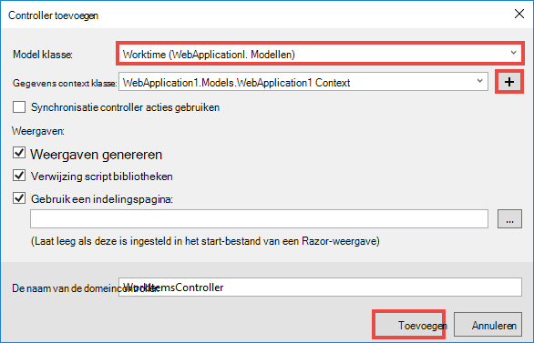

14. Zoek in ~\Views\WorkItems\Create.cshtml (een automatisch scaffolded item), de `Html.BeginForm` helpmethode en de volgende gemarkeerde wijzigingen aanbrengen:  
<pre class="prettyprint">
    @modelWebApplication1.Models.WorkItem

    @{ViewBag.Title = &quot;maken&quot;; }

    &lt;H2&gt;maken&lt;/h2&gt;

    @using(Html.BeginForm (<mark>&quot;maken&quot;, &quot;WorkItems&quot;, FormMethod.Post, nieuwe {id = &quot;hoofdformulier&quot; }</mark>)) {@Html.AntiForgeryToken()

        &lt;div class=&quot;form-horizontal&quot;&gt;
            &lt;h4&gt;WorkItem&lt;/h4&gt;
            &lt;hr /&gt;
            @Html.ValidationSummary(true, &quot;&quot;, new { @class = &quot;text-danger&quot; })
            &lt;div class=&quot;form-group&quot;&gt;
                @Html.LabelFor(model =&gt; model.AssignedToID, htmlAttributes: new { @class = &quot;control-label col-md-2&quot; })
                &lt;div class=&quot;col-md-10&quot;&gt;
                    @Html.EditorFor(model =&gt; model.AssignedToID, new { htmlAttributes = new { @class = &quot;form-control&quot;<mark>, @type = &quot;hidden&quot;</mark> } })
                    @Html.ValidationMessageFor(model =&gt; model.AssignedToID, &quot;&quot;, new { @class = &quot;text-danger&quot; })
                &lt;/div&gt;
            &lt;/div&gt;

            &lt;div class=&quot;form-group&quot;&gt;
                @Html.LabelFor(model =&gt; model.AssignedToName, htmlAttributes: new { @class = &quot;control-label col-md-2&quot; })
                &lt;div class=&quot;col-md-10&quot;&gt;
                    @Html.EditorFor(model =&gt; model.AssignedToName, new { htmlAttributes = new { @class = &quot;form-control&quot; } })
                    @Html.ValidationMessageFor(model =&gt; model.AssignedToName, &quot;&quot;, new { @class = &quot;text-danger&quot; })
                &lt;/div&gt;
            &lt;/div&gt;

            &lt;div class=&quot;form-group&quot;&gt;
                @Html.LabelFor(model =&gt; model.Description, htmlAttributes: new { @class = &quot;control-label col-md-2&quot; })
                &lt;div class=&quot;col-md-10&quot;&gt;
                    @Html.EditorFor(model =&gt; model.Description, new { htmlAttributes = new { @class = &quot;form-control&quot; } })
                    @Html.ValidationMessageFor(model =&gt; model.Description, &quot;&quot;, new { @class = &quot;text-danger&quot; })
                &lt;/div&gt;
            &lt;/div&gt;

            &lt;div class=&quot;form-group&quot;&gt;
                @Html.LabelFor(model =&gt; model.Status, htmlAttributes: new { @class = &quot;control-label col-md-2&quot; })
                &lt;div class=&quot;col-md-10&quot;&gt;
                    @Html.EnumDropDownListFor(model =&gt; model.Status, htmlAttributes: new { @class = &quot;form-control&quot; })
                    @Html.ValidationMessageFor(model =&gt; model.Status, &quot;&quot;, new { @class = &quot;text-danger&quot; })
                &lt;/div&gt;
            &lt;/div&gt;

            &lt;div class=&quot;form-group&quot;&gt;
                &lt;div class=&quot;col-md-offset-2 col-md-10&quot;&gt;
                    &lt;input type=&quot;submit&quot; value=&quot;Create&quot; class=&quot;btn btn-default&quot;<mark> id=&quot;submit-button&quot;</mark> /&gt;
                &lt;/div&gt;
            &lt;/div&gt;
        &lt;/div&gt;
    }

    &lt;deel&gt;
    @Html.ActionLink(&quot;terug naar de lijst&quot;, &quot;Index&quot;) &lt;/div    &gt;

    @sectionScripts { @Scripts.Render( &quot;~/bundles/jqueryval&quot;)     <mark> &lt;script&gt; 
     / / personen/groep kiezer Code var maxResultsPerPage = 14;         var invoer document.getElementById = (&quot;AssignedToName&quot;);

            // Access token from request header, and tenantID from claims identity
            var token = &quot;@Request.Headers[&quot;X-MS-TOKEN-AAD-ACCESS-TOKEN&quot;]&quot;;
            var tenant =&quot;@(System.Security.Claims.ClaimsPrincipal.Current.Claims
                            .Where(c => c.Type == &quot;http://schemas.microsoft.com/identity/claims/tenantid&quot;)
                            .Select(c => c.Value).SingleOrDefault())&quot;;

            var picker = new AadPicker(maxResultsPerPage, input, token, tenant);

            // Submit the selected user/group to be asssigned.
            $(&quot;#submit-button&quot;).click({ picker: picker }, function () {
                if (!picker.Selected())
                    return;
                $(&quot;#main-form&quot;).get()[0].elements[&quot;AssignedToID&quot;].value = picker.Selected().objectId;
            });
        &lt;/script&gt;</mark>
    }
    </pre>
    
    Houd er rekening mee dat `token` en `tenant` worden gebruikt door de `AadPicker` object Azure Active Directory Graph API-gesprekken. U voegt `AadPicker` later.   
    
    >[AZURE.NOTE] U gaat net zo goed `token` en `tenant` vanaf de clientzijde met `~/.auth/me`, maar dat is een gesprek extra servertypen. Bijvoorbeeld:
    >  
    >     $.ajax({
    >         dataType: "json",
    >         url: "/.auth/me",
    >         success: function (data) {
    >             var token = data[0].access_token;
    >             var tenant = data[0].user_claims
    >                             .find(c => c.typ === 'http://schemas.microsoft.com/identity/claims/tenantid')
    >                             .val;
    >         }
    >     });
    
15. Breng de wijzigingen aan dezelfde met ~ \Views\WorkItems\Edit.cshtml.

15. De `AadPicker` object is gedefinieerd in een script die u nodig hebt om toe te voegen aan uw project. Met de rechtermuisknop op de map ~\Scripts, wijs **toevoegen**en klik op **JavaScript-bestand**. Type `AadPickerLibrary` voor de bestandsnaam en klik op **OK**.

16. Kopieer de inhoud van [hier](https://raw.githubusercontent.com/cephalin/active-directory-dotnet-webapp-roleclaims/master/WebApp-RoleClaims-DotNet/Scripts/AadPickerLibrary.js) in ~ \Scripts\AadPickerLibrary.js.

    In het script de `AadPicker` object belt [Azure Active Directory Graph API](https://msdn.microsoft.com/Library/Azure/Ad/Graph/api/api-catalog) om te zoeken naar gebruikers en groepen die overeenkomen met de invoer.  

17. ~\Scripts\AadPickerLibrary.js wordt ook gebruikt voor de [jQuery UI automatisch aanvullen widget](https://jqueryui.com/autocomplete/). U moet dus jQuery UI toevoegen aan uw project. Met de rechtermuisknop op uw project in en klik op **NuGet-pakketten beheren**.

18. In de NuGet Package Manager, klikt u op Bladeren, typt u **jquery-gebruikersinterface** in de zoekbalk en **jQuery.UI.Combined**op.

    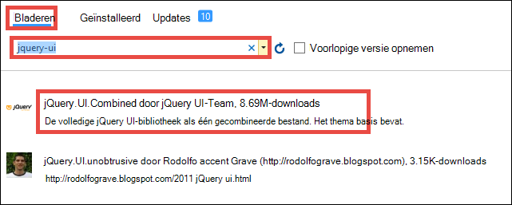

19. In het rechterdeelvenster, **installeren**, klik op **OK** om door te gaan.

19. Open ~\App_Start\BundleConfig.cs en de volgende gemarkeerde wijzigingen aanbrengen:  
    <pre class="prettyprint">
    openbare statische void RegisterBundles(BundleCollection bundles) {pakketten. Toevoegen (nieuwe ScriptBundle (&quot;~/bundles/jquery&quot;). Opnemen ( &quot;~/Scripts/jquery-{version}.js&quot;<mark>, &quot;~/Scripts/jquery-ui-{version}.js&quot;, &quot;~/Scripts/AadPickerLibrary.js&quot;</mark>));

        bundles.Add(new ScriptBundle(&quot;~/bundles/jqueryval&quot;).Include(
                    &quot;~/Scripts/jquery.validate*&quot;));

        // Use the development version of Modernizr to develop with and learn from. Then, when you&#39;re
        // ready for production, use the build tool at http://modernizr.com to pick only the tests you need.
        bundles.Add(new ScriptBundle(&quot;~/bundles/modernizr&quot;).Include(
                    &quot;~/Scripts/modernizr-*&quot;));

        bundles.Add(new ScriptBundle(&quot;~/bundles/bootstrap&quot;).Include(
                    &quot;~/Scripts/bootstrap.js&quot;,
                    &quot;~/Scripts/respond.js&quot;));

        bundles.Add(new StyleBundle(&quot;~/Content/css&quot;).Include(
                    &quot;~/Content/bootstrap.css&quot;,
                    &quot;~/Content/site.css&quot;<mark>,
                    &quot;~/Content/themes/base/jquery-ui.css&quot;</mark>));
    }
    </pre>

    Er zijn meer zodat manieren voor het beheren van JavaScript en CSS-bestanden in uw app. Echter volgt de procedure waarmee gaat u alleen meesturen op de pakketten die met elke weergave worden geladen.

12. Tot slot in ~ \Global.asax, voeg de volgende regel met code in de `Application_Start()` methode. `Ctrl`+`.`Klik op elke naming resolutie fout te herstellen.

        AntiForgeryConfig.UniqueClaimTypeIdentifier = ClaimTypes.NameIdentifier;
    
    > [AZURE.NOTE] Moet u deze regel met code omdat de standaardsjabloon MVC gebruikt <code>[ValidateAntiForgeryToken]</code> : decoratie in enkele van de acties. Vanwege de werking beschreven door [Brock Allen](https://twitter.com/BrockLAllen)     [MVC 4, AntiForgeryToken](http://brockallen.com/2012/07/08/mvc-4-antiforgerytoken-and-claims/) en Claims in uw bericht HTTP ter voorkoming token validatie mislukt, omdat:

    > - Azure Active Directory verzendt de http://schemas.microsoft.com/accesscontrolservice/2010/07/claims/identityprovider, dat al dan niet standaard de token ter voorkoming vereist is geen.
    > - Als Azure Active Directory gesynchroniseerd met AD FS directory is, verzendt de AD FS-vertrouwen al dan niet standaard geen het claimen http://schemas.microsoft.com/accesscontrolservice/2010/07/claims/identityprovider, hoewel u AD FS als u wilt verzenden van deze claim handmatig kunt configureren.

    > `ClaimTypes.NameIdentifies`Hiermee geeft u het claimen `http://schemas.xmlsoap.org/ws/2005/05/identity/claims/nameidentifier`, waarin Azure Active Directory levert.  

20. Nu uw wijzigingen publiceert. Met de rechtermuisknop op het project en klik op **publiceren**.

21. Klik op **Instellingen**, zorg ervoor dat er een verbindingsreeks met uw SQL-Database, selecteer **Database bijwerken** naar Wijzig van het schema voor uw model en klik op **publiceren**.

    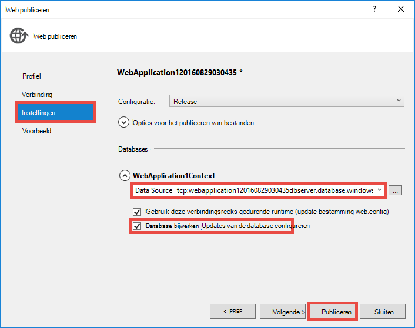

22. Ga in de browser naar https://&lt;*toepassingsnaam*>.azurewebsites.net/workitems en klik op **Nieuw**.

23. Klik in het vak **AssignedToName** . U ziet nu gebruikers en groepen van de Azure Active Directory-tenant in een vervolgkeuzelijst. U kunt typen om te filteren of gebruik de `Up` of `Down` belangrijke of Selecteer de gebruiker of groep. 

    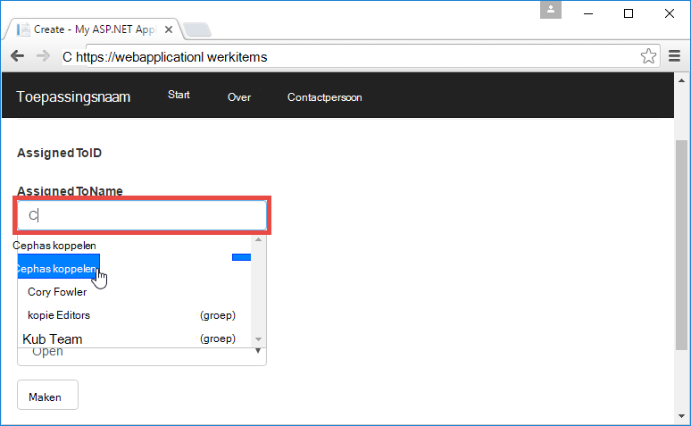

24. Klik op **maken** om de wijzigingen op te slaan. Klik vervolgens op **bewerken** op het gemaakte werkitem hetzelfde gedrag gezien toekijken.

Gefeliciteerd, u nu gebruikt een LOB-app in Azure wordt aangegeven met toegang tot directory! Er is nog veel meer dat kunt u doen met de API Graph. Zie [Azure AD Graph API-tablets](https://msdn.microsoft.com/library/azure/ad/graph/api/api-catalog).

## Volgende stap

Als u nodig Rolgebaseerd toegangsbeheer (RBAC) voor de LOB-app in Azure wordt aangegeven hebt, raadpleegt u [WebApp-RoleClaims-DotNet](https://github.com/Azure-Samples/active-directory-dotnet-webapp-roleclaims) voor een voorbeeld van de Azure Active Directory-team. Deze ziet u hoe u rollen voor uw toepassing Azure Active Directory inschakelen en klik vervolgens Autoriseer gebruikers met de `[Authorize]` : decoratie.

Als uw app LOB-toegang tot on-premises gegevens nodig heeft, raadpleegt u [toegang tot lokale bronnen van hybride-verbindingen in Azure App-Service](web-sites-hybrid-connection-get-started.md).

## Meer informatiebronnen

- [Verificatie en autorisatie in Azure App-Service](../app-service/app-service-authentication-overview.md)
- [Verificatie met on-premises Active Directory in uw Azure-app](web-sites-authentication-authorization.md)
- [Een lijn-of-business-app maakt in Azure wordt aangegeven met AD FS-verificatie](web-sites-dotnet-lob-application-adfs.md)
- [App-Service Auth en Azure AD Graph API](https://cgillum.tech/2016/03/25/app-service-auth-aad-graph-api/)
- [Voorbeelden van Microsoft Azure Active Directory en documentatie](https://github.com/AzureADSamples)
- [Azure Active Directory ondersteund Token en typen](http://msdn.microsoft.com/library/azure/dn195587.aspx)

[Protect the Application with SSL and the Authorize Attribute]: web-sites-dotnet-deploy-aspnet-mvc-app-membership-oauth-sql-database.md#protect-the-application-with-ssl-and-the-authorize-attribute
