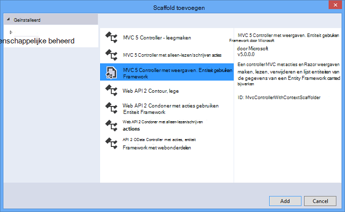

<properties 
    pageTitle="Maken van een REST-service ASP.NET Web API en SQL-Database in Azure App Service gebruiken" 
    description="Een zelfstudie waarin u u hoe leert u een app waarin de ASP.NET-Web-API bij een Azure web-app met behulp van Visual Studio implementeren." 
    services="app-service\web" 
    documentationCenter=".net" 
    authors="Rick-Anderson" 
    writer="Rick-Anderson" 
    manager="wpickett" 
    editor=""/>

<tags 
    ms.service="app-service-web" 
    ms.workload="web" 
    ms.tgt_pltfrm="na" 
    ms.devlang="dotnet" 
    ms.topic="article" 
    ms.date="02/29/2016" 
    ms.author="riande"/>

# Maken van een REST-service ASP.NET Web API en SQL-Database in Azure App Service gebruiken

Deze zelfstudie leert hoe u een ASP.NET-web-app op een [App-Azure-Service](http://go.microsoft.com/fwlink/?LinkId=529714) met behulp van de wizard Publiceren in Visual Studio 2013 of Visual Studio 2013 Community Edition implementeren. 

U kunt een Azure-account gratis openen en als u geen Visual Studio 2013 al hebt, de SDK Visual Studio 2013 automatisch geïnstalleerd voor het Web Express. Zo kunt u beginnen ontwikkelen voor Azure volledig voor gratis.

Deze zelfstudie wordt ervan uitgegaan dat er geen ervaring met Azure. Klik op voltooien van deze zelfstudie, hebt u een eenvoudige WebApp omhoog en worden uitgevoerd in de cloud.
 
U leert:

* Hoe u uw computer voor de ontwikkeling van Azure inschakelen met het installeren van de Azure-SDK.
* Hoe u een project Visual Studio ASP.NET MVC 5 maken en publiceren naar een Azure-app.
* Hoe de ASP.NET-Web-API gebruiken om te schakelen van Restful API-oproepen.
* Het gebruik van een SQL-database voor de opslag van gegevens in Azure wordt aangegeven.
* Hoe u het publiceren van toepassingsupdates op Azure.

U kunt een eenvoudige lijst met contactpersonen van een webtoepassing die is gebaseerd op ASP.NET MVC 5 en ADO.NET entiteit Framework wordt gebruikt voor toegang tot de database maken. De volgende afbeelding ziet u de voltooide toepassing:

![Schermafbeelding van de website][intro001]

<!-- the next line produces the "Set up the development environment" section as see at http://azure.microsoft.com/documentation/articles/web-sites-dotnet-get-started/ -->
[AZURE.INCLUDE [create-account-and-websites-note](../../includes/create-account-and-websites-note.md)]

### Het project maken

1. Visual Studio 2013 niet starten.
1. Klik in het menu **bestand** op **Nieuw Project**.
3. Klik in het dialoogvenster **Nieuw Project** uitvouwen **Visual C#** **Web** Selecteer en selecteer vervolgens **ASP.NET-webtoepassing**. Naam van de toepassing **ContactManager** en klik op **OK**.

    

1. In het dialoogvenster **Nieuw ASP.NET-Project** , selecteert u de sjabloon **MVC** , **Web API** controleren en klik op **Verificatie wijzigen**.

1. In het dialoogvenster **Verificatie wijzigen** , klikt u op **Geen verificatie**en klik vervolgens op **OK**.

    

    De voorbeeldtoepassing die u maakt geen functies die gebruikers moeten aanmelden. Zie de sectie van de [Volgende stappen](#nextsteps) aan het einde van deze zelfstudie voor informatie over het implementeren van functies voor verificatie en machtiging. 

1. Controleer of dat de **Host in de Cloud** is ingeschakeld en klik op **OK**in het dialoogvenster **Nieuw ASP.NET-Project** .

Als u hebt eerder niet aangemeld bij Azure, wordt u gevraagd aan te melden.

1. De configuratiewizard van een unieke naam op basis van *ContactManager* wordt voorgesteld (Zie de onderstaande afbeelding). Selecteer een gebied in de buurt. U kunt [azurespeed.com](http://www.azurespeed.com/ "AzureSpeed.com") gebruiken om te zoeken van het laagste latentie-Datacenter. 
2. Als u een database-server voordat u dit nog niet hebt gemaakt, selecteert u **de nieuwe server maken**, voert u een database-gebruikersnaam en wachtwoord.

    

Als u een database-server hebt, gebruikt u die naar een nieuwe database maken. Databaseservers zijn een belangrijk resource en u doorgaans wilt maken van meerdere databases op de server voor testen en ontwikkeling in plaats van een databaseserver per database maken. Zorg ervoor dat uw website en de database zich in dezelfde regio.

### Instellen van de paginakoptekst en voettekst

1. Vouw de map *Views\Shared* in **Solution Explorer**en open het *_Layout.cshtml* -bestand.

    ![_Layout.cshtml in Solution Explorer][newapp004]

1. De inhoud van het bestand *Views\Shared_Layout.cshtml* vervangen door de volgende code:

        <!DOCTYPE html>
        <html lang="en">
        <head>
            <meta charset="utf-8" />
            <title>@ViewBag.Title - Contact Manager</title>
            <link href="~/favicon.ico" rel="shortcut icon" type="image/x-icon" />
            <meta name="viewport" content="width=device-width" />
            @Styles.Render("~/Content/css")
            @Scripts.Render("~/bundles/modernizr")
        </head>
        <body>
            <header>
                

                    

                        
@Html.ActionLink("Contact Manager", "Index", "Home")

                    

                

            </header>
            

                @RenderSection("featured", required: false)
                <section class="content-wrapper main-content clear-fix">
                    @RenderBody()
                </section>
            

            <footer>
                

                    

                        
&copy; @DateTime.Now.Year - Contact Manager

                    

                

            </footer>
            @Scripts.Render("~/bundles/jquery")
            @RenderSection("scripts", required: false)
        </body>
        </html>
            
De markeringen boven de naam van de app vanuit 'Mijn ASP.NET-App' naar "Contact Manager" gewijzigd en de koppelingen naar **Start**, **over** en **contactpersoon**wordt verwijderd.

### De toepassing lokaal uitvoeren

1. Druk op CTRL + F5 om de toepassing te starten.
De startpagina van de toepassing wordt weergegeven in de standaardbrowser.
    

Hiermee wordt gevormd door alle u moet doen voor nu aan de toepassing die u naar Azure implementeren gaat maken. U kunt databasefuncties later wilt toevoegen.

## De toepassing Azure implementeren

1. Visual Studio, met de rechtermuisknop op het project in **Solution Explorer** en selecteer **publiceren** in het snelmenu.

    ![In het contextmenu project publiceren][PublishVSSolution]

    De wizard **Publiceren** wordt geopend.

12. Klik op **publiceren**.

Visual Studio begint het proces van het kopiëren van de bestanden naar de server Azure. **Het uitvoervenster** ziet u welke acties implementatie zijn die u hebt gemaakt en succesvolle afronding van de implementatie-rapporten.

14. De standaardbrowser is automatisch wordt geopend met de URL van de site geïmplementeerd.

    De toepassing die u hebt gemaakt, wordt nu uitgevoerd in de cloud.
    
    ![Naar de startpagina takenlijst uitgevoerd in Azure wordt aangegeven][rxz2]

## Een database toevoegen aan de toepassing

Vervolgens moet u de toepassing MVC om toe te voegen van de mogelijkheid wilt weergeven en bijwerken van contactpersonen en opslaan van de gegevens in een database bijwerken. De toepassing moet het kader entiteit om de database te maken en bij het lezen en bijwerken van gegevens in de database gebruiken.

### Gegevens model klassen voor de contactpersonen toevoegen

U eerst een eenvoudige gegevensmodel maken in code.

1. In **Solution Explorer**met de rechtermuisknop op de map modellen, klikt u op **toevoegen**en klik vervolgens **Class**.

    ![Klasse toevoegen in het contextmenu van de map modellen][adddb001]

2. Het nieuwe klassebestand *Contact.cs*een naam in het dialoogvenster **Nieuw Item toevoegen** en klik vervolgens op **toevoegen**.

    ![Dialoogvenster Nieuw Item toevoegen][adddb002]

3. De inhoud van het bestand Contacts.cs vervangen door de volgende code.

        using System.Globalization;
        namespace ContactManager.Models
        {
            public class Contact
            {
                public int ContactId { get; set; }
                public string Name { get; set; }
                public string Address { get; set; }
                public string City { get; set; }
                public string State { get; set; }
                public string Zip { get; set; }
                public string Email { get; set; }
                public string Twitter { get; set; }
                public string Self
                {
                    get { return string.Format(CultureInfo.CurrentCulture,
                         "api/contacts/{0}", this.ContactId); }
                    set { }
                }
            }
        }

De klasse **Neem contact op met** definieert de gegevens die u voor elke contactpersoon, plus een primaire sleutel, ContactID, die nodig is door de database wilt opslaan. U kunt meer informatie over gegevensmodellen krijgen in de sectie van de [Volgende stappen](#nextsteps) aan het einde van deze zelfstudie.

### Webpagina's waarmee app-gebruikers kunnen werken met de contactpersonen maken

De MVC ASP.NET-code waarmee kunt automatisch genereren in de functie steigers maken, lezen, bijwerken en verwijderen (CRUD) acties.

## Een Controller en een weergave voor de gegevens toevoegen

1. Vouw de map Controllers in **Solution Explorer**.

3. Maken van het project **(Ctrl + Shift + B)**. (U kunt het project moet maken voordat u gebruikt om steigers.) 

4. Met de rechtermuisknop op de map Controllers en klikt u op **toevoegen**en klik vervolgens op **Controller**.

    ![Controller in het contextmenu van de map Controllers toevoegen][addcode001]

1. Klik in het dialoogvenster **Toevoegen Scaffold** **MVC Controller met weergaven, met entiteit Framework** selecteren en op **toevoegen**.

 

6. De naam van de domeincontroller ingesteld op **HomeController**. Selecteer de **contactpersoon** als uw klas model. Klik op de knop **nieuwe gegevenscontext** en accepteer de standaardinstelling "ContactManager.Models.ContactManagerContext" voor de **nieuwe context gegevenstype**. Klik op **toevoegen**.

    U kunt een dialoogvenster wordt gevraagd: "een bestand met de naam HomeController al afgesloten. Wilt u vervangen? ". Klik op **Ja**. We wilt de start-Controller die is gemaakt met het nieuwe project overschrijven. We gebruiken de nieuwe start-Controller voor onze lijst met contactpersonen.

    Visual Studio controller methoden en weergaven voor CRUD databasebewerkingen voor objecten **contactpersoon** gemaakt.

## Migraties inschakelen, de database maken, voorbeeldgegevens en een initialisatiefunctie gegevens toevoegen ##

De volgende taak is de functie [Code eerste migraties](http://curah.microsoft.com/55220) inschakelen om te maken van de database op basis van het gegevensmodel dat u hebt gemaakt.

1. Selecteer in het menu **Extra** **Bibliotheek Package Manager** en klik vervolgens op **Package Manager-Console**.

    ![Package Manager-Console in het menu Extra][addcode008]

2. Voer de volgende opdracht in het venster **Package Manager-Console** :

        enable-migrations 
  
    De opdracht **inschakelen-migraties** maakt u een map *migraties* en verschijnt er in deze map een *Configuration.cs* -bestand dat u als u wilt configureren migraties kunt bewerken. 

2. Voer de volgende opdracht in het venster **Package Manager-Console** :

        add-migration Initial

    De opdracht **toevoegen-migratie aanvankelijke** genereert een klasse met de naam ** &lt;date_stamp&gt;eerste** die de database wordt gemaakt. De eerste parameter ( *eerste* ) is willekeurige en gebruikt voor de naam van het bestand te maken. Hier ziet u de nieuwe klassenbestanden in **Solution Explorer**.

    De methode **Up** wordt gemaakt van de tabel contactpersonen in de **eerste** klasse, en de **pijl omlaag** -methode (gebruikt wanneer u wilt teruggaan naar de vorige staat) worden deze.

3. Open het bestand *Migrations\Configuration.cs* . 

4. De volgende naamruimten toevoegen. 

         using ContactManager.Models;

5. De methode *zaad* vervangen door de volgende code:
        
        protected override void Seed(ContactManager.Models.ContactManagerContext context)
        {
            context.Contacts.AddOrUpdate(p => p.Name,
               new Contact
               {
                   Name = "Debra Garcia",
                   Address = "1234 Main St",
                   City = "Redmond",
                   State = "WA",
                   Zip = "10999",
                   Email = "debra@example.com",
                   Twitter = "debra_example"
               },
                new Contact
                {
                    Name = "Thorsten Weinrich",
                    Address = "5678 1st Ave W",
                    City = "Redmond",
                    State = "WA",
                    Zip = "10999",
                    Email = "thorsten@example.com",
                    Twitter = "thorsten_example"
                },
                new Contact
                {
                    Name = "Yuhong Li",
                    Address = "9012 State st",
                    City = "Redmond",
                    State = "WA",
                    Zip = "10999",
                    Email = "yuhong@example.com",
                    Twitter = "yuhong_example"
                },
                new Contact
                {
                    Name = "Jon Orton",
                    Address = "3456 Maple St",
                    City = "Redmond",
                    State = "WA",
                    Zip = "10999",
                    Email = "jon@example.com",
                    Twitter = "jon_example"
                },
                new Contact
                {
                    Name = "Diliana Alexieva-Bosseva",
                    Address = "7890 2nd Ave E",
                    City = "Redmond",
                    State = "WA",
                    Zip = "10999",
                    Email = "diliana@example.com",
                    Twitter = "diliana_example"
                }
                );
        }

    Deze bovenstaande code wordt de database met de contactgegevens geïnitialiseerd. Zie voor meer informatie over de database seeding, [DBs foutopsporing entiteit Framework (EF)](http://blogs.msdn.com/b/rickandy/archive/2013/02/12/seeding-and-debugging-entity-framework-ef-dbs.aspx).

1. Voer in de **Package Manager-Console** in de opdracht:

        update-database

    ![Package Manager Console-opdrachten][addcode009]

    De **update-database** wordt de eerste migratie waarmee de database wordt uitgevoerd. Standaard wordt de database gemaakt als een SQL Server Express LocalDB-database.

1. Druk op CTRL + F5 om de toepassing te starten. 

De toepassing ziet u de gegevens en koppelingen voor bewerken, details en verwijderen.

![MVC weergave van gegevens][rxz3]

## De weergave te bewerken

1. Open het bestand *Views\Home\Index.cshtml* . In de volgende stap, zullen we de gegenereerde markeringen vervangen door de code die wordt gebruikt [jQuery](http://jquery.com/) en [Knockout.js](http://knockoutjs.com/). Deze nieuwe code de lijst met contactpersonen uit het gebruik van web API en JSON zijn opgehaald en vervolgens de gegevens van contactpersonen gebonden aan de gebruikersinterface met knockout.js. Zie de sectie van de [Volgende stappen](#nextsteps) aan het einde van deze zelfstudie voor meer informatie. 

2. De inhoud van het bestand vervangen door de volgende code.

        @model IEnumerable<ContactManager.Models.Contact>
        @{
            ViewBag.Title = "Home";
        }
        @section Scripts {
            @Scripts.Render("~/bundles/knockout")
            
        }
        <ul id="contacts" data-bind="foreach: contacts">
            <li class="ui-widget-content ui-corner-all">
                <h1 data-bind="text: Name" class="ui-widget-header"></h1>
                

                

                    ,
                    
                    
                

                

                
Email?

                

                
Twitter?

                
<a data-bind="attr: { href: Self }, click: $root.removeContact" class="removeContact ui-state-default ui-corner-all">Remove</a>

            </li>
        </ul>
        <form id="addContact" data-bind="submit: addContact">
            <fieldset>
                <legend>Add New Contact</legend>
                <ol>
                    <li>
                        <label for="Name">Name</label>
                        <input type="text" name="Name" />
                    </li>
                    <li>
                        <label for="Address">Address</label>
                        <input type="text" name="Address" >
                    </li>
                    <li>
                        <label for="City">City</label>
                        <input type="text" name="City" />
                    </li>
                    <li>
                        <label for="State">State</label>
                        <input type="text" name="State" />
                    </li>
                    <li>
                        <label for="Zip">Zip</label>
                        <input type="text" name="Zip" />
                    </li>
                    <li>
                        <label for="Email">E-mail</label>
                        <input type="text" name="Email" />
                    </li>
                    <li>
                        <label for="Twitter">Twitter</label>
                        <input type="text" name="Twitter" />
                    </li>
                </ol>
                <input type="submit" value="Add" />
            </fieldset>
        </form>

3. Met de rechtermuisknop op de map inhoud en klik op **toevoegen**en klik vervolgens op **Nieuw Item...**.

    ![Opmaakmodel toevoegen in het contextmenu van de map inhoud][addcode005]

4. Voer **stijl** in het zoekvak op het bovenste rechts in het dialoogvenster **Nieuw Item toevoegen** en selecteer **Opmaakmodel**.
    ![Dialoogvenster Nieuw Item toevoegen][rxStyle]

5. Geef het bestand *Contacts.css* en klikt u op **toevoegen**. De inhoud van het bestand vervangen door de volgende code.
    
        .column {
            float: left;
            width: 50%;
            padding: 0;
            margin: 5px 0;
        }
        form ol {
            list-style-type: none;
            padding: 0;
            margin: 0;
        }
        form li {
            padding: 1px;
            margin: 3px;
        }
        form input[type="text"] {
            width: 100%;
        }
        #addContact {
            width: 300px;
            float: left;
            width:30%;
        }
        #contacts {
            list-style-type: none;
            margin: 0;
            padding: 0;
            float:left;
            width: 70%;
        }
        #contacts li {
            margin: 3px 3px 3px 0;
            padding: 1px;
            float: left;
            width: 300px;
            text-align: center;
            background-image: none;
            background-color: #F5F5F5;
        }
        #contacts li h1
        {
            padding: 0;
            margin: 0;
            background-image: none;
            background-color: Orange;
            color: White;
            font-family: Trebuchet MS, Tahoma, Verdana, Arial, sans-serif;
        }
        .removeContact, .viewImage
        {
            padding: 3px;
            text-decoration: none;
        }

    We gebruiken deze opmaakmodel voor de indeling, kleuren en stijlen die worden gebruikt in de app contact manager.

6. Open het bestand *App_Start\BundleConfig.cs* .

7. Voeg de volgende code om te registreren van de [uitnemen](http://knockoutjs.com/index.html "KO") -invoegtoepassing.

        bundles.Add(new ScriptBundle("~/bundles/knockout").Include(
                    "~/Scripts/knockout-{version}.js"));
    In dit voorbeeld uitnemen gebruiken om u te vereenvoudigen dynamische JavaScript-code die omgaat met de sjablonen van het scherm.

8. Wijzig de inhoud/css-vermelding als u wilt het opmaakmodel *contacts.css* registreren. Wijzig de volgende regel:

                 bundles.Add(new StyleBundle("~/Content/css").Include(
                   "~/Content/bootstrap.css",
                   "~/Content/site.css"));
Aan:

        bundles.Add(new StyleBundle("~/Content/css").Include(
                   "~/Content/bootstrap.css",
                   "~/Content/contacts.css",
                   "~/Content/site.css"));

1. In de Console Package Manager, voer de volgende opdracht uitnemen installeren.

        Install-Package knockoutjs

## Een controller voor de Web API Restful interface toevoegen

1. Klik in **Solution Explorer**met de rechtermuisknop op Controllers en op **toevoegen** en klik vervolgens op **Controller...** 

1. Klik in het dialoogvenster **Toevoegen Scaffold** **Web API 2 Controller met acties, met entiteit Framework** invoeren en klik op **toevoegen**.

    

4. Voer in het dialoogvenster **Toevoegen Controller** "ContactsController" Als de naam van de controller. Selecteer 'contactpersoon (ContactManager.Models)"voor de **Model class**.  Behoud de standaardwaarde voor de **gegevens context class**. 

6. Klik op **toevoegen**.

### De toepassing lokaal uitvoeren

1. Druk op CTRL + F5 om de toepassing te starten.

    ![Pagina index][intro001]

2. Een contactpersoon en klik op **toevoegen**. De app geretourneerd naar de startpagina en weergegeven van de contactpersoon die u hebt ingevoerd.

    ![Pagina met de lijst taakitems index][addwebapi004]

3. Toevoegen **/api/contacts** naar de URL in de browser.

    De resulterende URL ziet er dan ongeveer http://localhost:1234/api/contactpersonen. Het RESTful web API die u hebt toegevoegd, retourneert de opgeslagen contactpersonen. Firefox en Chrome worden de gegevens in XML-indeling weergegeven.

    ![Pagina met de lijst taakitems index][rxFFchrome]
    

    IE wordt u gevraagd te openen of opslaan van de contactpersonen.

    ![Web API dialoogvenster Opslaan][addwebapi006]
    
    
    U kunt de resulterende contactpersonen openen in Kladblok of in een browser.
    
    Deze uitvoer kan worden gebruikt door een andere toepassing zoals mobiele webpagina of een toepassing.

    ![Web API dialoogvenster Opslaan][addwebapi007]

    **Beveiligingswaarschuwing weergegeven**: op dat moment weer, is uw toepassing onveilige en last CSRF aanval. Verderop in deze zelfstudie wordt hierdoor verwijderd. Zie voor meer informatie [voorkomen van meerdere sites aanvragen voorkoming (CSRF) aanvallen][prevent-csrf-attacks].
## XSRF beveiliging toevoegen

Meerdere sites verzoek voorkoming (ook wel bekend als XSRF of CSRF) is een aanval op web gehoste toepassingen waarbij een schadelijke website de interactie tussen de browser van een client en een website vertrouwd door die browser kunt beïnvloeden. Deze aanvallen worden mogelijk gemaakt omdat webbrowsers verificatietokens automatisch met elk verzoek om naar een website stuurt. Het voorbeeld van canonieke is een verificatiecookie, zoals ASP. NET van formulierverificatie tickets. Echter u kunt websites waarmee een permanente verificatiemethode (zoals verificatie van Windows, Basic, enzovoort) ervoor door deze aanvallen.

Een aanval XSRF verschilt van een phishing-aanvallen. Phishing-aanvallen vereisen interactie uit het slachtoffer. Klik in een phishing-aanvallen, een schadelijke website de doelwebsite wordt nabootsen en het slachtoffer wordt misleiden naar vertrouwelijke informatie leveren aan de hacker. In een aanval XSRF is vaak geen interactie nodig uit het slachtoffer. De hacker is liever, afhankelijk van de browser automatisch alle relevante cookies wordt verzonden naar de website van de bestemming.

Zie het [Project openen Web Application-beveiliging](https://www.owasp.org/index.php/Main_Page) (OWASP) [XSRF](https://www.owasp.org/index.php/Cross-Site_Request_Forgery_(CSRF))voor meer informatie.

1. In **Solution Explorer** **ContactManager** project naar rechts en klik op **toevoegen** en klik op **Class**.

2. Geef het bestand *ValidateHttpAntiForgeryTokenAttribute.cs* en voeg de volgende code:

        using System;
        using System.Collections.Generic;
        using System.Linq;
        using System.Net;
        using System.Net.Http;
        using System.Web.Helpers;
        using System.Web.Http.Controllers;
        using System.Web.Http.Filters;
        using System.Web.Mvc;
        namespace ContactManager.Filters
        {
            public class ValidateHttpAntiForgeryTokenAttribute : AuthorizationFilterAttribute
            {
                public override void OnAuthorization(HttpActionContext actionContext)
                {
                    HttpRequestMessage request = actionContext.ControllerContext.Request;
                    try
                    {
                        if (IsAjaxRequest(request))
                        {
                            ValidateRequestHeader(request);
                        }
                        else
                        {
                            AntiForgery.Validate();
                        }
                    }
                    catch (HttpAntiForgeryException e)
                    {
                        actionContext.Response = request.CreateErrorResponse(HttpStatusCode.Forbidden, e);
                    }
                }
                private bool IsAjaxRequest(HttpRequestMessage request)
                {
                    IEnumerable<string> xRequestedWithHeaders;
                    if (request.Headers.TryGetValues("X-Requested-With", out xRequestedWithHeaders))
                    {
                        string headerValue = xRequestedWithHeaders.FirstOrDefault();
                        if (!String.IsNullOrEmpty(headerValue))
                        {
                            return String.Equals(headerValue, "XMLHttpRequest", StringComparison.OrdinalIgnoreCase);
                        }
                    }
                    return false;
                }
                private void ValidateRequestHeader(HttpRequestMessage request)
                {
                    string cookieToken = String.Empty;
                    string formToken = String.Empty;
                    IEnumerable<string> tokenHeaders;
                    if (request.Headers.TryGetValues("RequestVerificationToken", out tokenHeaders))
                    {
                        string tokenValue = tokenHeaders.FirstOrDefault();
                        if (!String.IsNullOrEmpty(tokenValue))
                        {
                            string[] tokens = tokenValue.Split(':');
                            if (tokens.Length == 2)
                            {
                                cookieToken = tokens[0].Trim();
                                formToken = tokens[1].Trim();
                            }
                        }
                    }
                    AntiForgery.Validate(cookieToken, formToken);
                }
            }
        }

1. De volgende instructie met *behulp van* toevoegen aan de controller contracten, zodat u toegang tot het kenmerk **[ValidateHttpAntiForgeryToken hebt]** .

        using ContactManager.Filters;

1. Het kenmerk **[ValidateHttpAntiForgeryToken]** toevoegen aan het bericht methoden voor het **ContactsController** te beveiligen tegen XSRF threats. U wordt deze toevoegen aan de actie "PutContact", "PostContact" en **DeleteContact** methoden.

        [ValidateHttpAntiForgeryToken]
            public IHttpActionResult PutContact(int id, Contact contact)
            {

1. De sectie *Scripts* van het bestand *Views\Home\Index.cshtml* om op te nemen code als u de tokens XSRF bijwerken.

         @section Scripts {
            @Scripts.Render("~/bundles/knockout")
            
         }

## De update voor toepassingen publiceren naar Azure en SQL-Database

Als u wilt publiceren de toepassing, herhaalt u de procedure die u eerder hebt gevolgd.

1. Klik met de rechtermuisknop op het project en selecteer **publiceren**in **Solution Explorer**.

    ![Publiceren][rxP]

5. Klik op het tabblad **Instellingen** .
    

1. Onder **ContactsManagerContext(ContactsManagerContext)**, klikt u op het pictogram **v** als u wilt wijzigen van *externe verbindingsreeks* naar de verbindingsreeks voor de database met contactpersonen. Klik op **ContactDB**.

    

7. Schakel het selectievakje voor **Uitvoeren Code eerste migraties (uitgevoerd voor start van toepassing)**.

1. Klik op **volgende** en klik vervolgens op **voorbeeld**. Visual Studio bevat een overzicht van de bestanden die zijn toegevoegd of bijgewerkt.

8. Klik op **publiceren**.
Nadat de installatie is voltooid, wordt de browser geopend naar de startpagina van de toepassing.

    ![Pagina van de index met geen contactpersonen][intro001]

    De Visual Studio publicatieproces automatisch geconfigureerd de verbindingsreeks in het geïmplementeerd *Web.config* -bestand zodat deze verwijzen naar de SQL-database. Het eerste migraties Code automatisch upgraden van de database naar de nieuwste versie de eerste keer dat de toepassing toegang heeft tot de database na implementatie ook geconfigureerd.

    Resultaat van deze configuratie, Code eerste de database is gemaakt door de code uit te voeren in de **eerste** klasse die u eerder hebt gemaakt. Dit is dit de eerste keer dat de toepassing probeert toegang heeft tot de database na implementatie.

9. Voer een contactpersoon als u de app lokaal hebt uitgevoerd om te bevestigen toen dat de implementatie van de database is geslaagd.

Wanneer u ziet dat het item dat u invoert is opgeslagen en wordt weergegeven op de pagina contactpersonen manager, weet u dat deze in de database is opgeslagen.

![Pagina van de index met contactpersonen][addwebapi004]

De toepassing wordt nu uitgevoerd in de cloud, met SQL-Database voor de opslag van de gegevens. Als u klaar bent met het testen van de toepassing in Azure wordt aangegeven, deze verwijderen. De toepassing openbaar is en geen een om toegang te beperken.

>[AZURE.NOTE] Als u aan de slag met Azure App Service wilt voordat u zich registreert voor een Azure-account, gaat u naar de [App-Service probeert](http://go.microsoft.com/fwlink/?LinkId=523751), waar u direct een tijdelijk starter in de browser in de App-Service maken kunt. Geen creditcards vereist; geen verplichtingen.

## Volgende stappen

Een echte toepassing zou moeten verificatie en autorisatie en gebruikt u de database lidmaatschap daartoe. De zelfstudie [implementeren van een toepassing voor Secure ASP.NET MVC met OAuth, lidmaatschap en SQL-Database](web-sites-dotnet-deploy-aspnet-mvc-app-membership-oauth-sql-database.md) is gebaseerd op deze zelfstudie en ziet u hoe u een webtoepassing met de database lidmaatschap implementeren.

Een andere manier voor de opslag van gegevens in een Azure-toepassing is het gebruik van Azure opslag, waarin niet-relationele gegevensopslag in de vorm van BLOB's en tabellen bevatten. De volgende koppelingen bieden meer informatie over Web API, ASP.NET MVC en Azure-venster.
 

* [Aan de slag met gebruik van MVC entiteit-Framework][EFCodeFirstMVCTutorial]
* [Inleiding tot ASP.NET MVC 5](http://www.asp.net/mvc/tutorials/mvc-5/introduction/getting-started)
* [Uw eerste ASP.NET-Web API](http://www.asp.net/web-api/overview/getting-started-with-aspnet-web-api/tutorial-your-first-web-api)
* [Voor foutopsporing in WAWS](web-sites-dotnet-troubleshoot-visual-studio.md)

Deze zelfstudie en de toepassing van de steekproef is geschreven door [Rick Anderson](http://blogs.msdn.com/b/rickandy/) (Twitter- [@RickAndMSFT](https://twitter.com/RickAndMSFT)) met ondersteuning van Tom Dykstra en Barry Dorrans (Twitter- [@blowdart](https://twitter.com/blowdart)). 

Neem verbeterd verlaten feedback over wat u leuk vindt of u wat u wilt zien, niet alleen over de zelfstudie zelf, maar ook over de producten die laat. Uw feedback kunnen we verbeteringen in de prioriteit te bepalen. We zijn met name geïnteresseerd weten hoeveel rente er in meer automatisering voor het proces is van configureren en implementeren van de database lidmaatschap. 

## Wat er gewijzigd
* Zie voor een handleiding voor het wijzigen van Websites naar App Service: [Azure App-Service en de invloed op bestaande Azure-Services](http://go.microsoft.com/fwlink/?LinkId=529714)

<!-- bookmarks -->
[Add an OAuth Provider]: #addOauth
[Add Roles to the Membership Database]:#mbrDB
[Create a Data Deployment Script]:#ppd
[Update the Membership Database]:#ppd2
[setupdbenv]: #bkmk_setupdevenv
[setupwindowsazureenv]: #bkmk_setupwindowsazure
[createapplication]: #bkmk_createmvc4app
[deployapp1]: #bkmk_deploytowindowsazure1
[adddb]: #bkmk_addadatabase
[addcontroller]: #bkmk_addcontroller
[addwebapi]: #bkmk_addwebapi
[deploy2]: #bkmk_deploydatabaseupdate

<!-- links -->
[EFCodeFirstMVCTutorial]: http://www.asp.net/mvc/tutorials/getting-started-with-ef-using-mvc/creating-an-entity-framework-data-model-for-an-asp-net-mvc-application
[dbcontext-link]: http://msdn.microsoft.com/library/system.data.entity.dbcontext(v=VS.103).aspx

<!-- images-->
[rxE]: ./media/web-sites-dotnet-rest-service-aspnet-api-sql-database/rxE.png
[rxP]: ./media/web-sites-dotnet-rest-service-aspnet-api-sql-database/rxP.png
[rx22]: ./media/web-sites-dotnet-rest-service-aspnet-api-sql-database/
[rxb2]: ./media/web-sites-dotnet-rest-service-aspnet-api-sql-database/rxb2.png
[rxz]: ./media/web-sites-dotnet-rest-service-aspnet-api-sql-database/rxz.png
[rxzz]: ./media/web-sites-dotnet-rest-service-aspnet-api-sql-database/rxzz.png
[rxz2]: ./media/web-sites-dotnet-rest-service-aspnet-api-sql-database/rxz2.png
[rxz3]: ./media/web-sites-dotnet-rest-service-aspnet-api-sql-database/rxz3.png
[rxStyle]: ./media/web-sites-dotnet-rest-service-aspnet-api-sql-database/rxStyle.png
[rxz4]: ./media/web-sites-dotnet-rest-service-aspnet-api-sql-database/rxz4.png
[rxz44]: ./media/web-sites-dotnet-rest-service-aspnet-api-sql-database/rxz44.png
[rxNewCtx]: ./media/web-sites-dotnet-rest-service-aspnet-api-sql-database/rxNewCtx.png
[rxPrevDB]: ./media/web-sites-dotnet-rest-service-aspnet-api-sql-database/rxPrevDB.png
[rxOverwrite]: ./media/web-sites-dotnet-rest-service-aspnet-api-sql-database/rxOverwrite.png
[rxPWS]: ./media/web-sites-dotnet-rest-service-aspnet-api-sql-database/rxPWS.png
[rxNewCtx]: ./media/web-sites-dotnet-rest-service-aspnet-api-sql-database/rxNewCtx.png
[rxAddApiController]: ./media/web-sites-dotnet-rest-service-aspnet-api-sql-database/rxAddApiController.png
[rxFFchrome]: ./media/web-sites-dotnet-rest-service-aspnet-api-sql-database/rxFFchrome.png
[intro001]: ./media/web-sites-dotnet-rest-service-aspnet-api-sql-database/dntutmobil-intro-finished-web-app.png
[rxCreateWSwithDB]: ./media/web-sites-dotnet-rest-service-aspnet-api-sql-database/rxCreateWSwithDB.png
[setup007]: ./media/web-sites-dotnet-rest-service-aspnet-api-sql-database/dntutmobile-setup-azure-site-004.png
[setup009]: ../Media/dntutmobile-setup-azure-site-006.png
[newapp002]: ./media/web-sites-dotnet-rest-service-aspnet-api-sql-database/dntutmobile-createapp-002.png
[newapp004]: ./media/web-sites-dotnet-rest-service-aspnet-api-sql-database/dntutmobile-createapp-004.png
[firsdeploy007]: ./media/web-sites-dotnet-rest-service-aspnet-api-sql-database/dntutmobile-deploy1-publish-005.png
[firsdeploy009]: ./media/web-sites-dotnet-rest-service-aspnet-api-sql-database/dntutmobile-deploy1-publish-007.png
[adddb001]: ./media/web-sites-dotnet-rest-service-aspnet-api-sql-database/dntutmobile-adddatabase-001.png
[adddb002]: ./media/web-sites-dotnet-rest-service-aspnet-api-sql-database/dntutmobile-adddatabase-002.png
[addcode001]: ./media/web-sites-dotnet-rest-service-aspnet-api-sql-database/dntutmobile-controller-add-context-menu.png
[addcode002]: ./media/web-sites-dotnet-rest-service-aspnet-api-sql-database/dntutmobile-controller-add-controller-dialog.png
[addcode004]: ./media/web-sites-dotnet-rest-service-aspnet-api-sql-database/dntutmobile-controller-modify-index-context.png
[addcode005]: ./media/web-sites-dotnet-rest-service-aspnet-api-sql-database/dntutmobile-controller-add-contents-context-menu.png
[addcode007]: ./media/web-sites-dotnet-rest-service-aspnet-api-sql-database/dntutmobile-controller-modify-bundleconfig-context.png
[addcode008]: ./media/web-sites-dotnet-rest-service-aspnet-api-sql-database/dntutmobile-migrations-package-manager-menu.png
[addcode009]: ./media/web-sites-dotnet-rest-service-aspnet-api-sql-database/dntutmobile-migrations-package-manager-console.png
[addwebapi004]: ./media/web-sites-dotnet-rest-service-aspnet-api-sql-database/dntutmobile-webapi-added-contact.png
[addwebapi006]: ./media/web-sites-dotnet-rest-service-aspnet-api-sql-database/dntutmobile-webapi-save-returned-contacts.png
[addwebapi007]: ./media/web-sites-dotnet-rest-service-aspnet-api-sql-database/dntutmobile-webapi-contacts-in-notepad.png
[Add XSRF Protection]: #xsrf
[WebPIAzureSdk20NetVS12]: ./media/web-sites-dotnet-rest-service-aspnet-api-sql-database/WebPIAzureSdk20NetVS12.png
[Add XSRF Protection]: #xsrf
[ImportPublishSettings]: ./media/web-sites-dotnet-rest-service-aspnet-api-sql-database/ImportPublishSettings.png
[ImportPublishProfile]: ./media/web-sites-dotnet-rest-service-aspnet-api-sql-database/ImportPublishProfile.png
[PublishVSSolution]: ./media/web-sites-dotnet-rest-service-aspnet-api-sql-database/PublishVSSolution.png
[ValidateConnection]: ./media/web-sites-dotnet-rest-service-aspnet-api-sql-database/ValidateConnection.png
[WebPIAzureSdk20NetVS12]: ./media/web-sites-dotnet-rest-service-aspnet-api-sql-database/WebPIAzureSdk20NetVS12.png
[prevent-csrf-attacks]: http://www.asp.net/web-api/overview/security/preventing-cross-site-request-forgery-(csrf)-attacks
 
