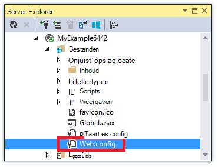
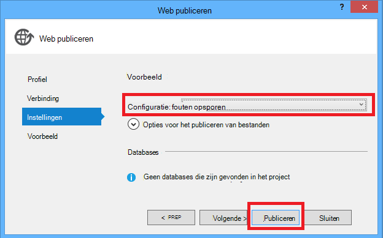
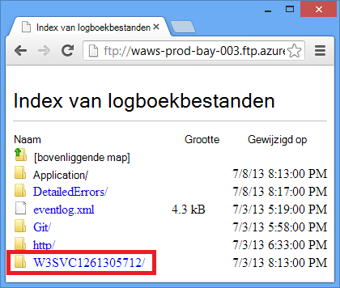

<properties 
    pageTitle="Problemen met een WebApp in Azure App Service gebruik van Visual Studio" 
    description="Informatie over het oplossen van een Azure web-app via externe foutopsporing, tracering en logboekregistratie's die zijn ingebouwd in Visual Studio-2013." 
    services="app-service" 
    documentationCenter=".net" 
    authors="tdykstra" 
    manager="wpickett" 
    editor=""/>

<tags 
    ms.service="app-service" 
    ms.workload="na" 
    ms.tgt_pltfrm="na" 
    ms.devlang="dotnet" 
    ms.topic="article" 
    ms.date="08/29/2016" 
    ms.author="rachelap"/>

# Problemen met een WebApp in Azure App Service gebruik van Visual Studio

## Overzicht

Deze zelfstudie wordt getoond hoe u Visual Studio tools waarmee fouten opsporen in een WebApp in de [App Service](http://go.microsoft.com/fwlink/?LinkId=529714), door te voeren in de [modus voor foutopsporing](http://www.visualstudio.com/get-started/debug-your-app-vs.aspx) op afstand of door te bekijken van toepassingslogboeken en weblogs van de server gebruikt.

[AZURE.INCLUDE [app-service-web-to-api-and-mobile](../../includes/app-service-web-to-api-and-mobile.md)]

U leert:

* Welke Azure web app management-functies zijn beschikbaar in Visual Studio.
* Het gebruik van Visual Studio externe weergave snel wijzigingen aanbrengen in een externe WebApp.
* Het uitvoeren van de foutopsporingsmodus op afstand terwijl een project wordt uitgevoerd in Azure wordt aangegeven, zowel voor een web-app als voor een WebJob.
* Het maken van Logboeken voor het traceren van toepassing en deze weergeven wanneer de toepassing maakt deze.
* Het weergeven van web serverlogboeken, inclusief gedetailleerde foutberichten en is mislukt verzoek tracing.
* Klik hier voor meer informatie over het verzenden van diagnostische logboeken naar een Azure-opslag-account en ze daar te bekijken.

Als u Visual Studio Ultimate hebt, kunt u ook [IntelliTrace](http://msdn.microsoft.com/library/vstudio/dd264915.aspx) gebruiken voor foutopsporing. IntelliTrace valt buiten in deze zelfstudie.

## Vereisten voor

Deze zelfstudie werkt met de ontwikkelomgeving, webproject en Azure WebApp die u in [aan de slag met Azure en ASP.NET instelt][GetStarted]. Naar de gedeelten WebJobs, moet u de toepassing die u in [Aan de slag met de SDK van Azure WebJobs maakt][GetStartedWJ].

De voorbeelden van de code die wordt weergegeven in deze zelfstudie zijn voor een webtoepassing C# MVC, maar de procedures voor probleemoplossing zijn hetzelfde voor Visual Basic- en webformulieren-toepassingen.

De zelfstudie wordt ervan uitgegaan dat u Visual Studio-2015 of 2013 gebruikt. Als u Visual Studio 2013 gebruikt, de functies WebJobs vereisen [Update 4](http://go.microsoft.com/fwlink/?LinkID=510314) of hoger. 

De logboeken aan de streaming functie werkt alleen voor toepassingen die zijn gericht op .NET Framework 4 of hoger.

## Configuratie van de Web-app en beheer

Visual Studio biedt toegang tot een subset van de web-app beheerfuncties en beschikbaar zijn in de [Portal van Azure](http://go.microsoft.com/fwlink/?LinkId=529715)configuratie-instellingen. In deze sectie ziet u wat is beschikbaar met behulp van de **Server Explorer**. Als u wilt zien van de nieuwste integratiefuncties van Azure, moet u **Cloud Explorer** ook uitproberen. U kunt zowel windows openen vanuit het menu **Beeld** . 

1. Als u nog niet bent aangemeld bij Azure in Visual Studio, klikt u op de knop **verbinding maken met Azure** in **Server Explorer**.

    Er is een alternatief voor het installeren van een management-certificaat dat toegang tot uw account. Als u ervoor kiest om een certificaat te installeren, met de rechtermuisknop op het knooppunt **Azure** in **Server Explorer**en klik vervolgens op **beheren en Filter abonnementen** in het contextmenu. Klik op het tabblad **certificaten** in het dialoogvenster **Azure-abonnementen beheren** en klik vervolgens op **importeren**. Volg de aanwijzingen om te downloaden en importeer een abonnementsbestand (ook wel een bestand *.publishsettings* genoemd) voor uw Azure-account.

    > [AZURE.NOTE]
    > Als u een abonnementsbestand downloaden, sla deze op een map buiten uw mappen van de code gegevensbron (bijvoorbeeld in de map Downloads) en verwijder deze wanneer het importeren is voltooid. Een schadelijke gebruiker aan wie toegang tot het abonnementsbestand krijgt kunt bewerken, maken en verwijderen van uw Azure services.

    Zie voor meer informatie over het verbinding maken met Azure bronnen van Visual Studio, [Accounts beheren, abonnementen, en beheerdersrollen](http://go.microsoft.com/fwlink/?LinkId=324796#BKMK_AccountVCert).

2. Vouw van **Azure** in **Server Explorer**en **App Service**uitvouwen.

3. Vouw de resourcegroep waarin de web-app die u hebt gemaakt in [aan de slag met Azure en ASP.NET][GetStarted], met de rechtermuisknop op het web app-knooppunt en klik op **Weergave-instellingen**.

    

    Het tabblad **Azure Web App** wordt weergegeven en u kunt zien er de web-app management en configuratietaken uit die beschikbaar in Visual Studio zijn.

    

    In deze zelfstudie hebt u de logboekregistratie en tracering-keuzelijsten gebruiken. Gebruikt u ook externe foutopsporing maar gebruikt u een andere methode om deze inschakelen.
   
    Zie voor informatie over de instellingen van de App en verbindingstekenreeksen vakken in dit venster [Azure-WebApps: hoe tekenreeksen van toepassingen en verbinding tekenreeksen werk](http://blogs.msdn.com/b/windowsazure/archive/2013/07/17/windows-azure-web-sites-how-application-strings-and-connection-strings-work.aspx).

    Als u uitvoeren van een taak in web-app beheer die niet kan worden uitgevoerd in dit venster wilt, klikt u op **openen in de beheerportal** om een browservenster naar de Azure-portal te openen.

## Access web app-bestanden in Server Explorer

U meestal een webproject met implementeert de `customErrors` vlag in het bestand Web.config is ingesteld op `On` of `RemoteOnly`, wat inhoudt dat er geen een handig foutbericht wordt weergegeven als er iets mis gaat. Voor veel fouten is alle u een pagina als een van de volgende bestanden.

**Serverfout in '/' Application:**

**Er is een fout opgetreden:**

**De website van de pagina kan niet worden weergegeven**

De eenvoudigste manier om te zoeken naar de oorzaak van de fout is vaak gedetailleerde foutberichten worden weergegeven, waarin de eerste van de voorgaande schermafbeeldingen wordt uitgelegd hoe u inschakelen. Dat is vereist voor een wijziging in het geïmplementeerd Web.config-bestand. U kan bewerken van het bestand *Web.config* in het project en implementeer deze opnieuw het project, of een [Web.config transformeren](http://www.asp.net/mvc/tutorials/deployment/visual-studio-web-deployment/web-config-transformations) maken en implementeren van een opbouwen foutopsporing, maar er is een snellere manier: in **Solution Explorer** kunt u rechtstreeks weergeven en bewerken van bestanden in de externe WebApp met behulp van de functie *weergave Extern* .

1. **Server Explorer** **Azure**uitvouwen, **App Service**uitvouwen, vouw in de resourcegroep die uw web-app bevindt zich in en vouw het knooppunt voor uw web-app.

    U ziet knooppunten die u toegang tot de inhoud bestanden en de logboekbestanden van de web-app geven.

2. Vouw het knooppunt **bestanden** en dubbelklik op het bestand *Web.config* .

    

    Visual Studio, wordt het bestand Web.config geopend via de externe WebApp en [Remote] ziet naast de bestandsnaam op de titelbalk.

3. Voeg de volgende regel aan de `system.web` element:

    `<customErrors mode="Off"></customErrors>`

    

4. Vernieuw de browser die de nutteloos foutbericht wordt weergegeven en nu krijgt u een gedetailleerde foutbericht wordt weergegeven, zoals in het volgende voorbeeld:

    

    (De fout weergegeven is gemaakt door toe te voegen van de regel die wordt weergegeven in het rood naar *Views\Home\Index.cshtml*.)

Bewerken van het bestand Web.config is slechts één voorbeeld van scenario's waarin de mogelijkheid om te lezen en bewerken van bestanden op uw Azure web-app maken probleemoplossing te vereenvoudigen.

## Externe foutopsporing WebApps

Als het gedetailleerde foutbericht weinig gegevens niet zelf en u kunt geen lokaal de fout opnieuw maken, is een andere manier om op te lossen in de foutopsporingsmodus voor op afstand kunnen uitvoeren. U kunt onderbrekingspunten instellen, geheugen rechtstreeks manipuleren stapsgewijs code en zelfs de codepad te wijzigen. 

Foutopsporing op afstand werkt niet in Express-edities van Visual Studio.

In dit gedeelte ziet u hoe u fouten opsporen in extern met het project dat u in [aan de slag met Azure en ASP.NET maakt][GetStarted].

1. Open de webproject dat u hebt gemaakt in [aan de slag met Azure en ASP.NET][GetStarted].

1. Open *Controllers\HomeController.cs*.

2. Verwijder de `About()` methode en invoegen de volgende in plaats daarvan code.

        public ActionResult About()
        {
            string currentTime = DateTime.Now.ToLongTimeString();
            ViewBag.Message = "The current time is " + currentTime;
            return View();
        }

2. [Stelt een onderbrekingspunt](http://www.visualstudio.com/get-started/debug-your-app-vs.aspx) voor de `ViewBag.Message` lijn.

1. In **Solution Explorer**met de rechtermuisknop op het project en klik op **publiceren**.

2. Selecteer in de vervolgkeuzelijst **profiel** hetzelfde profiel zijn die u hebt gebruikt in [aan de slag met Azure en ASP.NET][GetStarted].

3. Klik op het tabblad **Instellingen** en **configuratie** voor **Foutopsporing**wijzigen en klik vervolgens op **publiceren**.

    

4. Na de installatie is voltooid en uw browser wordt geopend aan de Azure-URL van uw web-app, sluit de browser.

5. In **Server Explorer**met de rechtermuisknop op uw web-app en klik vervolgens op **Bijvoegen foutopsporing**. 

    

    De browser wordt automatisch geopend op uw startpagina uitgevoerd in Azure wordt aangegeven. Mogelijk moet u wacht ongeveer 20 seconden terwijl Azure Hiermee de server voor foutopsporing wordt. Deze vertraging gebeurt alleen de eerste keer dat u in de foutopsporingsmodus voor in een web-app uitvoert. Volgende tijden binnen 48 uur wanneer u de foutopsporing er opnieuw start, worden niet een vertraging.

    **Notitie:** Als u eventuele problemen met het starten van de foutopsporing hebt, kunt u doen met behulp van **Cloud Explorer** in plaats van de **Server Explorer**.

6. Klik op **Info** in het menu.

    Visual Studio op het onderbrekingspunt gestopt en de code in Azure wordt aangegeven, niet op uw lokale computer wordt uitgevoerd.

7. Plaats de muisaanwijzer op de `currentTime` variabele om de tijdwaarde weer te geven.

    

    De tijd die u ziet is het servertijd Azure, die mogelijk in een andere tijdzone dan uw lokale computer.

8. Voer een nieuwe waarde voor de `currentTime` variabele, zoals 'In de Azure uitgevoerd'.

5. Druk op F5 worden uitgevoerd.

    De pagina over in Azure wordt aangegeven met weergegeven de nieuwe waarde die u hebt ingevoerd in de variabele currentTime.

    

## Externe foutopsporing WebJobs

In dit gedeelte ziet hoe u fouten opsporen in extern met de project- en web-app die u in [Aan de slag met de SDK van Azure WebJobs maakt](websites-dotnet-webjobs-sdk.md). 

De functies die wordt weergegeven in deze sectie zijn alleen beschikbaar in Visual Studio 2013 met Update 4 of hoger. 

Foutopsporing op afstand werkt alleen met continue WebJobs. Geplande en op aanvraag WebJobs ondersteund niet voor foutopsporing in.

1. Open de webproject dat u hebt gemaakt in [Aan de slag met de SDK van Azure WebJobs][GetStartedWJ].

1. Open in het project ContosoAdsWebJob *Functions.cs*.

2. [Een onderbrekingspunt instellen](http://www.visualstudio.com/get-started/debug-your-app-vs.aspx) voor de eerste instructie in het `GnerateThumbnail` methode.

    

1. In **Solution Explorer**met de rechtermuisknop op het webproject (niet in het project WebJob) en klik op **publiceren**.

2. Selecteer in de vervolgkeuzelijst **profiel** hetzelfde profiel zijn die u in het [Aan de slag met de SDK van Azure WebJobs](websites-dotnet-webjobs-sdk.md)gebruikt.

3. Klik op het tabblad **Instellingen** en **configuratie** voor **Foutopsporing**wijzigen en klik vervolgens op **publiceren**.

    Visual Studio implementeert het web en WebJob projecten en uw browser wordt geopend met de Azure-URL van uw web-app.

5. Vouw in **Server Explorer** **Azure > App Service > uw resourcegroep > uw web-app > WebJobs > doorlopend**, en klik vervolgens met de rechtermuisknop op **ContosoAdsWebJob**.

7. Klik op **Foutopsporing als bijlage toevoegen**. 

    

    De browser wordt automatisch geopend op uw startpagina uitgevoerd in Azure wordt aangegeven. Mogelijk moet u wacht ongeveer 20 seconden terwijl Azure Hiermee de server voor foutopsporing wordt. Deze vertraging gebeurt alleen de eerste keer dat u in de foutopsporingsmodus voor in een web-app uitvoert. De volgende keer dat u er de foutopsporing koppelen worden niet in een vertraging, doet u dit binnen 48 uur.

6. Maak een nieuwe advertentie in de webbrowser naar de startpagina van Contoso advertenties wordt geopend. 

    Maken van een advertentie zorgt ervoor dat een wachtrij-bericht wilt maken, waarin wordt opgehaald door de WebJob en verwerkt. De code wordt de uw onderbrekingspunt uitvoeren wanneer de WebJobs SDK de functie om het proces van het bericht wachtrij u belt.

7. U kunt wanneer foutopsporing-op uw onderbrekingspunt einden onderzoeken en variabele waarden wijzigt terwijl het programma actief is de cloud. In de volgende afbeelding ziet u de foutopsporing de inhoud van het blobInfo-object dat is doorgegeven aan de methode GenerateThumbnail.

    
 
5. Druk op F5 worden uitgevoerd.

    De methode GenerateThumbnail eindigt maken van de miniatuur.

6. In de browser vernieuwt u de Index-pagina en wordt de miniatuur.

6. Druk op SHIFT + F5 om te stoppen foutopsporing in Visual Studio.

7. Met de rechtermuisknop op het knooppunt ContosoAdsWebJob in **Server Explorer**en klik op **Weergave Dashboard**.

8. Meld u aan met uw Azure referenties en klik vervolgens op de naam van de WebJob om te gaan naar de pagina voor uw WebJob. 

    

    Het Dashboard blijkt dat de GenerateThumbnail functie onlangs uitgevoerd.

    (De volgende keer dat u op **Weergave Dashboard**, klikt u hoeft aan te melden, en de browser gaat rechtstreeks naar de pagina voor uw WebJob.)

9. Klik op de naam van de functie informatie over de uitvoering van een functie wilt weergeven.

    

Als de functie [Logboeken geschreven](websites-dotnet-webjobs-sdk-storage-queues-how-to.md#logs), kunt u op **ToggleOutput** kunt bekijken.

## Opmerkingen over foutopsporing op afstand

* In de foutopsporingsmodus in productie wordt niet aanbevolen. Als uw web-app productie heeft geen schaal af in meerdere serverexemplaren, foutopsporing wordt voorkomen dat de webserver reageren op andere aanvragen. Als er meerdere exemplaren van web-server, wanneer u aan de foutopsporing toevoegt krijgt u een willekeurig exemplaar en er geen manier om ervoor te zorgen dat latere browseraanvragen worden doorgestuurd naar die instantie. Ook kunt u doorgaans niet implementeren een opbouwen foutopsporing naar productie en compileerprogramma optimalisaties toe bij release builds maakt het niet mogelijk om weer te geven wat staat er voor per regel in de broncode. Voor het oplossen van problemen, is de beste bron toepassing tracering en web server-Logboeken.

* Lange kleurovergangsbeëindigingen op onderbrekingspunten wanneer externe vermijden voor foutopsporing in. Azure behandelt een proces dat is gestopt langer dan een paar minuten als een proces niet reageert, en deze afsluit.

* Terwijl u bent foutopsporing, wordt de server gegevens verzonden naar Visual Studio, bandbreedte kosten kan beïnvloeden. Zie [Azure prijzen](/pricing/calculator/)voor informatie over bandbreedte tarieven.

* Zorg ervoor dat de `debug` kenmerk van de `compilation` element in het bestand *Web.config* is ingesteld op waar. Dit is ingesteld op waar al dan niet standaard wanneer u een foutopsporing opbouwconfiguratie publiceert.

        <system.web>
          <compilation debug="true" targetFramework="4.5" />
          <httpRuntime targetFramework="4.5" />
        </system.web>

* Als u vindt dat foutopsporing won't stap in code die u wilt opsporen, moet u mogelijk de zojuist mijn Code te wijzigen.  Zie [beperken zit naar alleen mijn Code](http://msdn.microsoft.com/library/vstudio/y740d9d3.aspx#BKMK_Restrict_stepping_to_Just_My_Code)voor meer informatie.

* Een timer gestart op de server wanneer u de functie voor externe foutopsporing inschakelen en na 48 uur de functie is automatisch uitgeschakeld. Deze limiet 48 uur klaar is voor beveiliging en prestaties. U kunt eenvoudig de functie weer inschakelen als vaak is als u tevreden bent. Het is raadzaam deze uitgeschakeld wanneer u niet actief foutopsporing verlaten.

* U kunt handmatig de foutopsporing koppelen aan een proces, niet alleen de web-app proces (w3wp.exe). Zie voor meer informatie over het gebruik van de foutopsporingsmodus in Visual Studio, [Foutopsporing in Visual Studio](http://msdn.microsoft.com/library/vstudio/sc65sadd.aspx).

## Overzicht van de diagnostische logboeken

Een ASP.NET-toepassing die wordt uitgevoerd in een Azure web-app kunt de volgende soorten logboeken maken:

* **Toepassing traceringslogboeken** 
  De toepassing maakt deze logboeken door te bellen methoden van de klasse [System.Diagnostics.Trace](http://msdn.microsoft.com/library/system.diagnostics.trace.aspx) .
* **Web serverlogboeken** 
  De webserver Hiermee maakt u een vermelding voor elke HTTP-aanvraag naar de web-app.
* **Gedetailleerde foutenlogboeken van bericht** 
  De webserver maakt een HTML-pagina met enkele aanvullende informatie voor mislukte HTTP-aanvragen (die in statuscode 400 of hoger resulteren). 
* **Is mislukt verzoek traceringslogboeken** 
  De webserver maakt een XML-bestand met gegevens over gedetailleerde traceren voor mislukte HTTP-aanvragen. De webserver bevat ook een XSL-bestand als u wilt opmaken, de XML in een browser.
  
Logboekregistratie van invloed op web app prestaties, zodat Azure u het in- of uitschakelen van elk type logboek kunt naar wens. Voor de toepassing zich aanmeldt, kunt u opgeven dat alleen logboeken dan een bepaald ernst niveau moeten worden geschreven. Wanneer u maakt een nieuwe WebApp, al dan niet standaard alle logboekregistratie is uitgeschakeld.

Logboeken worden geschreven naar bestanden in een map *logboekbestanden* in het bestandssysteem van uw web-app en zijn toegankelijk via FTP. Web serverlogboeken en toepassingslogboeken aan de kunnen ook worden opgeslagen bij een Azure Storage-account. U kunt een grotere hoeveelheid Logboeken in een opslag-account dan is het mogelijk dat in het bestandssysteem bewaren. U bent beperkt tot maximaal 100 MB Logboeken wanneer u het bestandssysteem gebruikt. (Alleen voor de korte termijn bewaarbeleid zijn bestand systeemlogboeken. Azure verwijdert oude logboekbestanden om ruimte te maken voor nieuwe bestanden nadat de limiet is bereikt.)  

## Maken en weergeven van Logboeken voor het traceren van toepassing

In deze sectie hebt u de volgende taken uitvoeren:

* Voeg tracering instructies toe aan het webproject die u hebt gemaakt in [aan de slag met Azure en ASP.NET][GetStarted].
* De logboeken weergeven wanneer u het project lokaal uitvoert.
* De logboeken weergeven terwijl ze worden gegenereerd door de toepassing uitvoert in Azure wordt aangegeven. 

Zie voor informatie over het maken van de toepassing zich WebJobs aanmeldt, [het werken met Azure wachtrij opslagruimte met behulp van de WebJobs-SDK - logboeken schrijven](websites-dotnet-webjobs-sdk-storage-queues-how-to.md#logs). De volgende instructies voor het weergeven van Logboeken en bepalen hoe ze zijn opgeslagen in Azure wordt aangegeven, toepassen ook toepassingslogboeken gemaakt door WebJobs. 

### Voeg tracering instructies toe aan de toepassing

1. Open *Controllers\HomeController.cs*en vervang het `Index`, `About`, en `Contact` methoden met de volgende code toe te voegen `Trace` instructies en een `using` -instructie voor `System.Diagnostics`:

        public ActionResult Index()
        {
            Trace.WriteLine("Entering Index method");
            ViewBag.Message = "Modify this template to jump-start your ASP.NET MVC application.";
            Trace.TraceInformation("Displaying the Index page at " + DateTime.Now.ToLongTimeString());
            Trace.WriteLine("Leaving Index method");
            return View();
        }
        
        public ActionResult About()
        {
            Trace.WriteLine("Entering About method");
            ViewBag.Message = "Your app description page.";
            Trace.TraceWarning("Transient error on the About page at " + DateTime.Now.ToShortTimeString());
            Trace.WriteLine("Leaving About method");
            return View();
        }
        
        public ActionResult Contact()
        {
            Trace.WriteLine("Entering Contact method");
            ViewBag.Message = "Your contact page.";
            Trace.TraceError("Fatal error on the Contact page at " + DateTime.Now.ToLongTimeString());
            Trace.WriteLine("Leaving Contact method");
            return View();
        }       

2. Toevoegen een `using System.Diagnostics;` instructie naar het begin van het bestand.
                
### De uitvoer van tracering lokaal weergeven

3. Druk op F5 om uit te voeren van de toepassing in de foutopsporingsmodus voor.

    De standaard-trace luisteraar ervan af schrijft alle trace-uitvoer naar **het uitvoervenster, samen met andere foutopsporingsuitvoer** . De volgende afbeelding ziet u de uitvoer van de instructies in de trace die u hebt toegevoegd aan de `Index` methode.

    

    De volgende stappen hoe trace-uitvoer weergeven in een webpagina, zonder compileren in de foutopsporingsmodus voor.

2. Open het bestand in de toepassing Web.config (het account dat zich in de projectmap) en toevoegen een `<system.diagnostics>` element aan het einde van het bestand vlak voor de afsluiting `</configuration>` element:

        <system.diagnostics>
            <trace>
              <listeners>
                <add name="WebPageTraceListener"
                    type="System.Web.WebPageTraceListener, 
                    System.Web, 
                    Version=4.0.0.0, 
                    Culture=neutral,
                    PublicKeyToken=b03f5f7f11d50a3a" />
              </listeners>
            </trace>
          </system.diagnostics>

    De `WebPageTraceListener` kunt u bekijken aanwijzen uitvoer door te bladeren naar `/trace.axd`.

3. Een <a href="http://msdn.microsoft.com/library/vstudio/6915t83k(v=vs.100).aspx">spoor element</a> onder toevoegen `<system.web>` in het bestand Web.config, zoals in het volgende voorbeeld:

        <trace enabled="true" writeToDiagnosticsTrace="true" mostRecent="true" pageOutput="false" />

3. Druk op CTRL + F5 om de toepassing te starten.

4. *Trace.axd* toevoegen aan de URL in de adresbalk van het browservenster, en druk op Enter (de URL op lijken http://localhost:53370/trace.axd).

5. Klik op de pagina **Toepassing doelcellen** klikt u op **Details weergeven** in de eerste regel (niet de BrowserLink).

    

    De pagina **Details aanvragen** wordt weergegeven en in de sectie **Doelcellen** ziet u de uitvoer van de instructies in de trace die u hebt toegevoegd aan de `Index` methode.

    

    Standaard `trace.axd` is lokaal alleen beschikbaar. Als u deze beschikbaar is via een externe WebApp maken wilt, zou u `localOnly="false"` naar de `trace` element in het bestand *Web.config* , zoals wordt weergegeven in het volgende voorbeeld:

        <trace enabled="true" writeToDiagnosticsTrace="true" localOnly="false" mostRecent="true" pageOutput="false" />

    Echter inschakelen `trace.axd` in een WebApp wordt in het algemeen niet aanbevolen vanwege de beveiliging, en in de volgende secties ziet u een eenvoudigere manier om te lezen traceringslogboeken in een Azure web-app.

### Weergave van de uitvoer tracing in Azure wordt aangegeven

1. In **Solution Explorer**met de rechtermuisknop op het webproject en klik op **publiceren**.

2. Klik in het dialoogvenster **Web publiceren** op **publiceren**.

    Nadat u Visual Studio publiceert de update, wordt geopend in een browservenster naar de startpagina (ervan uitgaande dat u niet **De doel-URL** wissen op het tabblad **verbinding** ).

3. In **Server Explorer**, met de rechtermuisknop op uw web-app en selecteer **Streaming logboeken weergeven**. 

    

    **Het uitvoervenster** ziet die u hebt verbinding met de service log streaming en voegt u een tijdlijn melding elke minuut die gaat door zonder een logboek weer te geven.

    

4. Klik in het browservenster waarin de startpagina van de toepassing op **contactpersoon**.

    De uitvoer van de fout niveau aanwijzen binnen een paar seconden u toegevoegd aan de `Contact` wordt weergegeven in **het uitvoervenster** .

    

    Visual Studio wordt alleen weergegeven voor fout niveau sporen omdat dit de standaardinstelling wanneer u de service controleren log inschakelt. Wanneer u een nieuwe Azure WebApp maakt, is alle logboekregistratie standaard uitgeschakeld, zoals u hebt gezien wanneer u de instellingenpagina eerder hebt geopend:

    

    Echter wanneer u **Streaming logboeken weergeven**hebt geselecteerd, Visual Studio automatisch gewijzigd **Toepassing Logging(File System)** **fout**, wat betekent dat de fout niveau logboeken worden genoemd. Om te zien al uw traceringslogboeken aan de, kunt u deze instelling wijzigen naar **uitgebreid**. Wanneer u een lager dan fout prioriteitsniveau selecteert, worden ook alle logboeken voor hogere niveaus gerapporteerd. Dus wanneer u uitgebreide selecteert, ziet ook u informatie, waarschuwing en foutenlogboeken.  

4. In **Server Explorer**met de rechtermuisknop op de web-app en klik op **Weergave-instellingen** zoals u eerder hebt gedaan.

5. **Uitgebreid**wijzigen in **Toepassing logboekregistratie (File System)** en klik vervolgens op **Opslaan**.
 
    

6. In het browservenster die nu de pagina van uw **contactpersoon** wordt weergegeven, klikt u op **Start**, en vervolgens klikt u op **over**en klik vervolgens op **contactpersoon**.

    Binnen enkele seconden ziet **het uitvoervenster** alle uw tracering-uitvoer.

    

    In deze sectie ingeschakeld en uitgeschakeld van logboekregistratie met behulp van Azure web app-instellingen. U kunt ook in- en traceer-listeners uitschakelen door de Web.config-bestand te wijzigen. Echter wijzigen van het bestand Web.config zorgt ervoor dat het app-domein naar de Prullenbak, terwijl het inschakelen van logboekregistratie via de web app-configuratie niet doen. Als het probleem een lang duurt te reproduceren, of wordt onderbroken, hergebruik het app-domein mogelijk "lossen" en u te wachten tot hiervoor opnieuw afdwingen. Diagnostische gegevens in Azure inschakelen doet niet dit, zodat u kunt direct foutgegevens vastleggen.

### Functies van het venster uitvoer

Het tabblad **Azure logboeken** van **het uitvoervenster** heeft verschillende knoppen en een tekstvak:

Deze de volgende functies uit te voeren:

* Schakel **het uitvoervenster** .
* In- of uitschakelen van tekstterugloop.
* Start of stop logboeken cmdlets voor controle.
* Opgeven welke logboeken om te controleren.
* Download Logboeken.
* Filteren op basis van een zoekopdracht of een reguliere expressie Logboeken.
* Sluit het venster **uitvoer** .

Als u een weergave van gemeenschappelijke documenten of gewone expressie invoert, worden in Visual Studio logboekinformatie op de client gefilterd. Dat betekent dat u kunt de criteria invoeren nadat de logboeken worden weergegeven in **het uitvoervenster** en u filtercriteria wijzigen kunt zonder dat u moet de logboeken genereren.

## Weergave web serverlogboeken

Server weblogs record HTTP activiteiten voor de web-app. Om te zien ze in het venster **uitvoer** moet u deze inschakelen voor de web-app, waarbij wordt aangegeven Visual Studio die u wilt ze controleren. 

1. Het tabblad **Azure Web App-configuratie** die u geopend vanaf een **Server Explorer**wijzigen in Web Server logboekregistratie **op**en klik vervolgens op **Opslaan**.

    

2. In **het uitvoervenster,** klikt u op de knop **Geef op welke Azure Logboeken om te controleren** .
    
    

3. Klik in het dialoogvenster **Opties voor logboekregistratie van Azure** Selecteer **Web serverlogboeken**en klik vervolgens op **OK**.

    

4. In het browservenster waarin de web-app, klikt u op **Start**, en vervolgens op **Info**en klik vervolgens op **contactpersoon**.

    De toepassingslogboeken aan de in het algemeen weergegeven eerst, gevolgd door de server weblogs. Mogelijk moet u wacht even voor de logboeken wilt weergeven. 

    

Standaard wanneer u eerst server weblogs inschakelen met behulp van Visual Studio, schrijft Azure de logboeken naar het bestandssysteem. Als alternatief, kunt u de Azure-portal om op te geven die webserver logboeken moeten worden toegevoegd aan een container blob in een opslag-account.

Als u via de portal webserver bij een account Azure opslag logboekregistratie inschakelen en Schakel logboekregistratie in Visual Studio, wanneer u opnieuw logboekregistratie inschakelen in Visual Studio uw accountinstellingen opslag hersteld. 

## Gedetailleerde foutenlogboeken van bericht weergeven

Gedetailleerde foutenlogboeken bevatten enkele extra informatie over HTTP-aanvragen die in foutcodes van antwoord (400 of hierboven resulteren). Om te zien ze in **het uitvoervenster** , moet u deze inschakelen voor de web-app, waarbij wordt aangegeven Visual Studio die u wilt ze controleren.

1. Op het tabblad **Azure Web App-configuratie** die u geopend vanaf een **Server Explorer**wijzigen in **Gedetailleerde foutberichten** **op**en klik vervolgens op **Opslaan**.

    

2. In **het uitvoervenster,** klikt u op de knop **Geef op welke Azure Logboeken om te controleren** .

3. Klik in het dialoogvenster **Opties voor logboekregistratie van Azure** klikt u op **alle logboeken**en klik vervolgens op **OK**.

    

4. In de adresbalk van het browservenster, een extra teken aan de URL voor een 404-fout veroorzaken toevoegen (bijvoorbeeld `http://localhost:53370/Home/Contactx`), en druk op Enter.

    Het foutenlogboek van de gedetailleerde wordt na enkele seconden weergegeven in het venster Visual Studio- **uitvoer** .

    

    Control + klik op de koppeling om de uitvoer log is opgemaakt in een browser te bekijken:

    

## Bestand systeemlogboeken downloaden

Alle logboeken die u in **het uitvoervenster controleren kunt** kunnen ook worden gedownload als een *zip-* bestand. 

1. Klik in het venster **Output** op **Streaming logboeken downloaden**.

    

    File Explorer wordt geopend aan de map *Downloads* met het gedownloade bestand geselecteerd.

    

2. Het *zip-* bestand te extraheren en ziet u de mapstructuur van de volgende:

    

    * Toepassing traceringslogboeken zijn opgeslagen in de *txt* -bestanden in de map *LogFiles\Application* .
    * Web serverlogboeken zijn in *.log* -bestanden in de map *LogFiles\http\RawLogs* . U kunt een hulpmiddel zoals [Log Parser](http://www.microsoft.com/download/details.aspx?displaylang=en&id=24659) bekijken en bewerken van deze bestanden.
    * Er zijn gedetailleerde foutenlogboeken voor bericht in *HTML* -bestanden in de map *LogFiles\DetailedErrors* .

    (De map *implementaties* is bedoeld voor bestanden die zijn gemaakt door het besturingselement voor gegevensbronnen publiceren; deze geen betrekking hebben op Visual Studio publiceren. De map *cijfer* is bedoeld voor sporen die zijn gerelateerd aan een besturingselement voor gegevensbronnen publiceren en het logboek file streaming-service.)  

## Weergave opslagruimte Logboeken

Toepassing traceringslogboeken kunnen ook worden verzonden naar een Azure opslag-account en u deze kunt weergeven in Visual Studio. Logboeken aan de opslag in de klassieke portal inschakelen om uit te voeren dat u een account opslagruimte wilt maken, en deze weergeven in het tabblad **Logboeken** van het venster **Azure Web App** .

U kunt Logboeken verzenden naar een of meer van de drie bestemmingen:

* Het bestandssysteem.
* Tabellen voor opslag-account.
* Opslag account BLOB's.

U kunt verschillende niveau voor elke bestemming opgeeft. 

Tabellen wordt vergemakkelijkt details van online logboeken bekijken en ondersteunen streaming; u kunt Logboeken in tabellen query en er nieuwe logboeken zoals ze worden gemaakt. BLOB's maken het makkelijk Logboeken in bestanden downloaden en te analyseren ze met een HDInsight, omdat u HDInsight weet hoe u werkt met blobopslag. Zie **Hadoop en MapReduce** in [Opties voor opslaan van gegevens (Building echte Cloud-Apps gebruiken met Azure)](http://www.asp.net/aspnet/overview/developing-apps-with-windows-azure/building-real-world-cloud-apps-with-windows-azure/data-storage-options)voor meer informatie.

U hebt momenteel bestand systeemlogboeken is ingesteld op het niveau van de weergave; de volgende stappen begeleiden u bij het instellen van niveau logboeken met informatie over om naar tabellen voor opslag-account te gaan. Niveau van informatie: alle logboeken gemaakt door te bellen `Trace.TraceInformation`, `Trace.TraceWarning`, en `Trace.TraceError` wordt weergegeven, maar niet de logboeken die zijn gemaakt door te bellen `Trace.WriteLine`.

Opslag accounts vindt u meer opslagruimte en langer meegaan bewaarbeleid voor logboeken vergeleken met het bestandssysteem. Een ander voordeel van toepassing traceringslogboeken verzenden naar een opslag is dat u enkele aanvullende informatie met elk logboek dat u geen uit bestand systeemlogboeken.

5. Met de rechtermuisknop op de **opslag** onder het knooppunt Azure en klik vervolgens op **Opslag-Account maken**.

3. Voer een naam voor de opslag-account in het dialoogvenster **Opslag-Account maken** . 

    De naam moet uniek zijn (geen andere Azure opslag-account kan dezelfde naam hebben). Als de naam die u invoert, al in gebruik is krijgt u een kans te wijzigen.

    De URL voor toegang tot uw account opslag worden *{naam}*. core.windows.net. 

5. Stel de vervolgkeuzelijst **regio of affiniteit groep** op het gebied dichtst bij u.

    Deze instelling bepaalt welke Azure datacenter wordt gehost in uw account opslag. Voor deze zelfstudie uw keuze een opvallend verschil won't maken, maar voor een productie web-app die u wilt uw webserver en uw account opslag moeten in dezelfde regio te minimaliseren ten latentie en gegevens egress kosten. De web-app (dat u later wilt maken) moet worden uitgevoerd in een gebied zo dicht mogelijk aan de browsers die toegang krijgen tot uw web-app om te kunnen Latentie minimaliseren.

6. Stel in de vervolgkeuzelijst **herhaling** op **lokaal overtollige**. 

    Als geografische-replicatie is ingeschakeld voor een opslag-account, wordt het opgeslagen inhoud gerepliceerd naar een secundaire datacenter om in te schakelen failover naar die locatie voor het geval een primaire noodgevallen in de primaire locatie. Geografische herhaling kunt extra kosten. Test- en -accounts wilt u doorgaans niet betalen voor geografische-replicatie. Zie [maken, beheren, of een account opslagruimte verwijderen](../storage-create-storage-account/#replication-options)voor meer informatie.

5. Klik op **maken**. 

      

1. In de Visual Studio **Azure Web App** -venster, klikt u op het tabblad **Logboeken** en klik op **Configureren logboekregistratie in de beheerportal**.

    <!-- todo:screenshot of new portal if the VS page link goes to new portal -->
    

    Hiermee opent u het tabblad **configureren** in de klassieke portal voor uw web-app.

2. Schuif omlaag naar de sectie toepassing diagnostische gegevens in de klassieke portal **configureren** tabblad en wijzig vervolgens **Toepassing (Table Storage) vastleggen** in **op**.

3. Wijzig de **logboekregistratie niveau** naar **informatie**.

4. Klik op **tabelopslag beheren**.

    

    In het vak **beheren-tabelopslag voor toepassing diagnostische gegevens** kunt u uw account opslag als er meer dan één. U kunt een nieuwe tabel maken of een bestaande eigenschap te gebruiken.

    

6. Klik op het vinkje om het te sluiten in het vak **beheren-tabelopslag voor toepassing diagnostische gegevens** .

6. Klik op **Opslaan**in de klassieke portal **configureren** tabblad.

7. In het browservenster waarin u de toepassing WebApp, klikt u op **Start**, en vervolgens klikt u op **over**en klik vervolgens op **contactpersoon**.

    De logboekinformatie geproduceerd door te bladeren deze webpagina's worden geschreven naar het opslag-account.

8. Op het tabblad **Logboeken** van het venster **Azure Web App** in Visual Studio, klikt u op **vernieuwen** onder **Diagnostische samenvatting**.

    

    De sectie **Diagnostische samenvatting** ziet u Logboeken voor de laatste 15 minuten al dan niet standaard. U kunt de periode om te zien meer logboeken wijzigen. 

    (Als er een fout "tabel niet gevonden", verifiëren dat u hierheen kunt naar de pagina's die de tracering uitvoeren navigeren wanneer u de **Toepassing (opslag) logboekregistratie** ingeschakeld en nadat u op **Opslaan**hebt geklikt.)

    

    Zoals u ziet dat in deze weergave ziet **Proces-ID** en **Thread-ID** voor elk logboek, dat u in de logboeken aan de systeem bestand niet openen. U kunt extra velden zien door de tabel Azure opslag rechtstreeks weer te geven.

8. Klik op **alle toepassingslogboeken bekijken**.

    De trace logboektabel wordt weergegeven in de tabel-viewer van Azure opslag.
   
    **(Als er een fout "sequentie bevat geen elementen", Server Verkenner**openen, het knooppunt voor uw account opslag onder het knooppunt **Azure** uitvouwen en klik vervolgens met de rechtermuisknop op **tabellen** en klikt u op **vernieuwen**.)

    

    Deze weergave worden extra velden dat niet wordt weergegeven in andere weergaven. Deze weergave kunt u Logboeken filteren met behulp van de gebruikersinterface van de opbouwfunctie voor speciale Query voor het samenstellen van een query. Zie Werken met Resources in de tabel - entiteiten in [Opslag Resources bladeren met Server Explorer](http://msdn.microsoft.com/library/ff683677.aspx)filteren voor meer informatie.

7. Bekijk de details van één rij, dubbelklikt u op een van de rijen.

    

## Mislukte aanvraag traceringslogboeken weergeven

Mislukte aanvraag traceringslogboeken zijn handig als u nodig hebt voor meer informatie over de details van hoe IIS een HTTP-aanvraag, in scenario's zoals URL herschrijven of verificatie problemen verwerkt. 

Azure-WebApps gebruik dezelfde mislukte aanvraag tracering functionaliteit die beschikbaar voor communicatie met IIS 7.0 en hoger is. Er geen toegang tot de IIS-instellingen die welke fouten geregistreerd configureren, echter. Wanneer u tracering van mislukte aanvragen inschakelt, worden alle fouten worden vastgelegd. 

U kunt mislukte aanvraag tracering inschakelen met behulp van Visual Studio, maar u kunt ze niet weergeven in Visual Studio. Deze logboeken zijn XML-bestanden. De streaming log-service bewaakt alleen de bestanden die worden geacht leesbaar in tekstmodus zonder opmaak: *.txt*, *.html*en *.log* bestanden.

U kunt Logboeken aan de tracering mislukte aanvraag weergeven in een browser rechtstreeks via FTP of lokaal na een FTP-hulpmiddel gebruiken om deze te downloaden naar uw lokale computer. In deze sectie bekijkt u deze in een browser rechtstreeks.

1. Op het tabblad van de **configuratie** van de **Azure Web App** -venster dat u hebt geopend vanuit **Server Explorer**, **Is mislukt aanvragen aanwijzen** wijzigen **aan**en klik vervolgens op **Opslaan**.

    

4. Een extra teken toevoegen aan de URL in de adresbalk van het browservenster waarin de web-app en klikt u op Enter om te leiden tot een 404-fout.

    Hierdoor wordt een logboek mislukte aanvraag tracering moet worden gemaakt en de volgende stappen wordt aangegeven hoe bekijken of downloaden van het logboek.

2. Klik in Visual Studio, op het tabblad **configuratie** van het venster **Azure Web App** op **openen in de beheerportal**.

3. In het blad in **Instellingen** van het [Azure-Portal](https://portal.azure.com) voor uw web-app, klik op **referenties voor implementatie**en voer vervolgens een nieuwe gebruikersnaam en wachtwoord.

    

    ** Wanneer u zich hebt aangemeld, moet u de volledige gebruikersnaam gebruiken met de naam van de web-app voorafgegaan toe. Bijvoorbeeld als u "myid" als een gebruikersnaam in te voeren invoeren en de site is 'myexample', aanmelden u als 'myexample\myid'.

5. Ga naar de URL die wordt weergegeven onder **FTP-hostnaam** of **TRANSFEREERT hostname** in het blad **Web App** voor uw web-app in een nieuw browservenster. 

6. Meld u aan met de FTP-referenties die u eerder (inclusief de naam van voorvoegsel van de web-app voor de gebruikersnaam in te voeren) hebt gemaakt.

    De browser ziet u de hoofdmap van de web-app.

6. Open de map *logboekbestanden* .

    

7. Open de map met de naam W3SVC plus een numerieke waarde.

    

    De map bevat XML-bestanden voor eventuele fouten die zijn geregistreerd nadat u de tracering van mislukte aanvragen ingeschakeld en een XSL-bestand dat een browser kunt gebruiken om op te maken van de XML.

    

8. Klik op het XML-bestand voor de mislukte aanvraag die u wilt zien van de gegevens over traceren voor.

    De volgende afbeelding ziet u deel uit van de gegevens over het traceren voor een voorbeeld-fout.

    

## Volgende stappen

Bovendien hebt u geleerd hoe Visual Studio kunt u heel gemakkelijk logboeken gemaakt door een Azure web-app bekijken. De volgende secties vindt koppelingen naar meer informatie over verwante onderwerpen:

* Azure web app oplossen
* Foutopsporing in Visual Studio 
* Remote foutopsporing in Azure wordt aangegeven
* Aanwijzen in ASP.NET-toepassingen
* Analyseren van web serverlogboeken
* Analyseren van mislukte aanvraag traceringslogboeken
* Voor foutopsporing in Cloudservices

### Azure web app oplossen

Zie de volgende bronnen voor meer informatie over het oplossen van WebApps in Azure App-Service:

* [Hoe u de WebApps controleren](/manage/services/web-sites/how-to-monitor-websites/)
* [Wordt onderzocht geheugenlekken in Azure WebApps gebruiken met Visual Studio-2013](http://blogs.msdn.com/b/visualstudioalm/archive/2013/12/20/investigating-memory-leaks-in-azure-web-sites-with-visual-studio-2013.aspx). Microsoft ALM blogbericht over Visual Studio-functies voor het analyseren van beheerde geheugenproblemen.
* [Azure apps online Webwerkset die u moet weten over](/blog/2014/03/28/windows-azure-websites-online-tools-you-should-know-about-2/). Blogbericht door Amit Apple.

Voor hulp bij een specifieke voor probleemoplossing vraag, start u een thread op een van de volgende forums:

* [Het Azure-forum op de ASP.NET-site](http://forums.asp.net/1247.aspx/1?Azure+and+ASP+NET).
* [Het Azure-forum op MSDN](http://social.msdn.microsoft.com/Forums/windowsazure/).
* [StackOverflow.com](http://www.stackoverflow.com).

### Foutopsporing in Visual Studio 

Zie de MSDN-onderwerp voor [Foutopsporing in Visual Studio](http://msdn.microsoft.com/library/vstudio/sc65sadd.aspx) en [Tips voor foutopsporing in met Visual Studio 2010](http://weblogs.asp.net/scottgu/archive/2010/08/18/debugging-tips-with-visual-studio-2010.aspx)voor meer informatie over het gebruik van de foutopsporingsmodus in Visual Studio.

### Remote foutopsporing in Azure wordt aangegeven

Zie de volgende bronnen voor meer informatie over externe foutopsporing voor Azure WebApps en WebJobs:

* [Inleiding tot externe foutopsporing Azure App Service WebApps](/blog/2014/05/06/introduction-to-remote-debugging-on-azure-web-sites/).
* [Inleiding tot externe foutopsporing Azure App Service WebApps deel 2 - in Foutopsporing op afstand](/blog/2014/05/07/introduction-to-remote-debugging-azure-web-sites-part-2-inside-remote-debugging/)
* [Inleiding tot het externe foutopsporing op Azure App Service Web Apps-deel 3 - omgeving met meerdere exemplaren en cijfer](/blog/2014/05/08/introduction-to-remote-debugging-on-azure-web-sites-part-3-multi-instance-environment-and-git/)
* [WebJobs foutopsporing (video)](https://www.youtube.com/watch?v=ncQm9q5ZFZs&list=UU_SjTh-ZltPmTYzAybypB-g&index=1)

Als uw web-app gebruikmaakt van een Azure Web API of mobiele Services back-enddatabase en moet u die fouten opsporen, raadpleegt u [.NET Backend foutopsporing in Visual Studio](http://blogs.msdn.com/b/azuremobile/archive/2014/03/14/debugging-net-backend-in-visual-studio.aspx).

### Aanwijzen in ASP.NET-toepassingen

Er zijn geen Inleiding voor uitgebreide en bijgewerkt in het traceren van ASP.NET beschikbaar op Internet. Het beste kunt u doen is aan de slag met de oude inleidende materialen voor webformulieren omdat MVC niet nog bestaat en die met nieuwere blog aanvulling in die zijn gericht op specifieke problemen berichten zijn geschreven. Enkele goede startpunten zijn de volgende bronnen:

* [Controle- en Telemetrielogboek (Building echte Cloud-Apps gebruiken met Azure)](http://www.asp.net/aspnet/overview/developing-apps-with-windows-azure/building-real-world-cloud-apps-with-windows-azure/monitoring-and-telemetry).  E-adresboek hoofdstuk met aanbevelingen voor tracering in Azure cloud-toepassingen.
* [ASP.NET-tracering](http://msdn.microsoft.com/library/ms972204.aspx) 
  Oude maar nog steeds een goed resource voor een eenvoudige Inleiding tot het onderwerp.
* [Traceer-Listeners](http://msdn.microsoft.com/library/4y5y10s7.aspx) 
  Informatie over traceer-listeners, maar niet de [WebPageTraceListener](http://msdn.microsoft.com/library/system.web.webpagetracelistener.aspx)vermelden.
* [Demonstratie: ASP.NET tracering integreren met System.Diagnostics traceren](http://msdn.microsoft.com/library/b0ectfxd.aspx) 
  Dit ook is oud, maar krijgt u enkele extra informatie die de inleidende artikel niet besproken.
* [Aanwijzen in MVC ASP.NET Razor-weergaven](http://blogs.msdn.com/b/webdev/archive/2013/07/16/tracing-in-asp-net-mvc-razor-views.aspx) 
  Naast traceren in Razor weergaven, het bericht ook wordt uitgelegd hoe u een filter fout aan te melden alle onverwerkte uitzonderingen in een MVC-toepassing maken. Alle niet-verwerkte uitzonderingen in een Web Forms-toepassing, Zie in het voorbeeld Global.asax in [Voltooid voorbeeld voor fout Handlers](http://msdn.microsoft.com/library/bb397417.aspx) op MSDN voor informatie over het aanmelden. In MVC of Web-formulieren, als u wilt melden bepaalde uitzonderingen maar de standaard-framework wordt pas van kracht afhandelen, laat kunt u onderschept en treden zoals in het volgende voorbeeld:

        try
        {
           // Your code that might cause an exception to be thrown.
        }
        catch (Exception ex)
        {
            Trace.TraceError("Exception: " + ex.ToString());
            throw;
        } 

* [Streaming diagnostisch hulpprogramma doelcellen logboekregistratie vanaf de opdrachtregel Azure (plus blik!)](http://www.hanselman.com/blog/StreamingDiagnosticsTraceLoggingFromTheAzureCommandLinePlusGlimpse.aspx) 
  Het gebruik van de opdrachtregel moet welke deze zelfstudie leert hoe u doen in Visual Studio. [Blik](http://www.hanselman.com/blog/IfYoureNotUsingGlimpseWithASPNETForDebuggingAndProfilingYoureMissingOut.aspx) is een hulpprogramma voor foutopsporing ASP.NET-toepassingen. 
* [Gebruik van WebApps-logboekregistratie en hulpprogramma's voor diagnose - met David Ebbo](/documentation/videos/azure-web-site-logging-and-diagnostics/) en [Streaming logboeken van WebApps gebruiken met David Ebbo](/documentation/videos/log-streaming-with-azure-web-sites/) 
  Video's door Scott Hanselman en David Ebbo.

Voor logboekregistratie is een alternatief voor het schrijven van uw eigen code tracering via een open source logboekregistratie framework zoals [ELMAH](http://nuget.org/packages/elmah/). Zie [van Scott Hanselman weblogberichten over ELMAH](http://www.hanselman.com/blog/NuGetPackageOfTheWeek7ELMAHErrorLoggingModulesAndHandlersWithSQLServerCompact.aspx)voor meer informatie.

Bedenk ook, dat u niet hoeft te gebruiken ASP.NET of System.Diagnostics aanwijzen als u wilt ophalen streaming logboeken van Azure. De streaming log-service van Azure web app, wordt elk *.txt*, *.html*of *.log* -bestand dat deze vindt u in de map *logboekbestanden* stream. Daarom kon u uw eigen logboekregistratie-systeem dat gegevens worden geschreven naar het bestandssysteem van de web-app maken, en het bestand wordt automatisch streamen en gedownload. Enige u hoeft te doen is schrijven toepassingscode die wordt gemaakt van bestanden in de map *d:\home\logfiles* . 

### Analyseren van web serverlogboeken

Zie de volgende bronnen voor meer informatie over het analyseren van web serverlogboeken:

* [LogParser](http://www.microsoft.com/download/details.aspx?id=24659) 
  Een hulpmiddel voor het weergeven van gegevens in web serverlogboeken (*.log* -bestanden).
* [Problemen oplossen van prestatieproblemen IIS of toepassingsfouten LogParser gebruiken](http://www.iis.net/learn/troubleshoot/performance-issues/troubleshooting-iis-performance-issues-or-application-errors-using-logparser) 
  Een inleiding tot de functie Log Parser die u gebruiken kunt om te analyseren web serverlogboeken.
* [Over het gebruik van LogParser van blogberichten door Robert McMurray](http://blogs.msdn.com/b/robert_mcmurray/archive/tags/logparser/) 
* [De HTTP-statuscode in IIS 7.0, IIS 7.5 en IIS 8.0](http://support.microsoft.com/kb/943891)

### Analyseren van mislukte aanvraag traceringslogboeken

De Microsoft TechNet-website bevat een sectie [Gebruiken, is mislukt aanvragen aanwijzen](http://www.iis.net/learn/troubleshoot/using-failed-request-tracing) , die mogelijk nuttig zijn voor informatie over het gebruik van deze logboeken. Deze documentatie is echter gericht voornamelijk over het configureren van tracering van mislukte aanvragen in IIS, die u niet kunt in Azure Web Apps doen.

[GetStarted]: web-sites-dotnet-get-started.md
[GetStartedWJ]: websites-dotnet-webjobs-sdk.md
 
