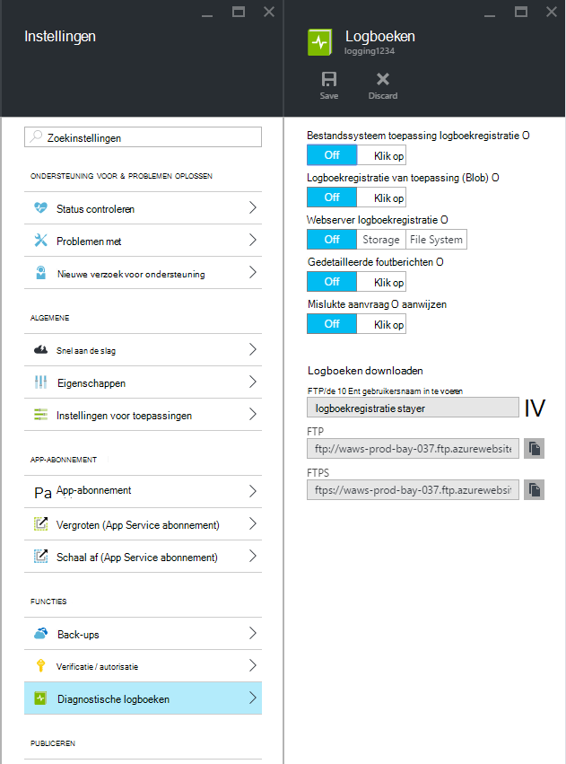
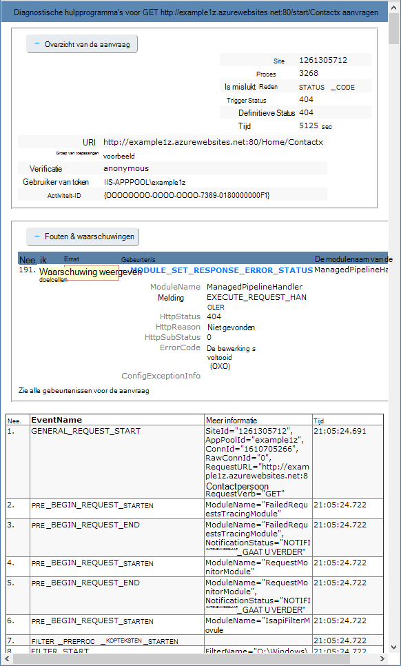

<properties
    pageTitle="Diagnostische gegevens vastleggen voor web-apps in Azure App-Service"
    description="Leer hoe u diagnostische gegevens vastleggen en instrumentation toevoegen aan uw toepassing, evenals hoe u de gegevens die zijn aangemeld met Azure weer te geven."
    services="app-service"
    documentationCenter=".net"
    authors="cephalin"
    manager="wpickett"
    editor="jimbe"/>

<tags
    ms.service="app-service"
    ms.workload="na"
    ms.tgt_pltfrm="na"
    ms.devlang="na"
    ms.topic="article"
    ms.date="06/06/2016"
    ms.author="cephalin"/>

# Diagnostische gegevens vastleggen voor web-apps in Azure App-Service

## Overzicht

Azure biedt ingebouwde diagnostische hulpprogramma's om u te helpen met voor foutopsporing in een [App Service WebApp](http://go.microsoft.com/fwlink/?LinkId=529714). In dit artikel leert u hoe u diagnostische gegevens vastleggen en instrumentation toevoegen aan uw toepassing, evenals hoe u de gegevens die zijn aangemeld met Azure weer te geven.

In dit artikel wordt de [Azure-Portal](https://portal.azure.com), Azure PowerShell en de opdrachtregel Azure (Azure CLI) gebruikt om te werken met diagnostische logboeken. Zie voor informatie over het werken met diagnostische logboeken gebruik van Visual Studio [Probleemoplossing Azure in Visual Studio](web-sites-dotnet-troubleshoot-visual-studio.md).

[AZURE.INCLUDE [app-service-web-to-api-and-mobile](../../includes/app-service-web-to-api-and-mobile.md)]

## Web server diagnostisch hulpprogramma en toepassing diagnostische gegevens

App Service-WebApps bieden diagnostische functionaliteit voor logboekgegevens van zowel de webserver, en de webtoepassing. Deze logisch gescheiden in **web server diagnostische hulpprogramma's** en **diagnostische hulpprogramma's van toepassing**.

### Web server diagnostische gegevens

U kunt inschakelen of uitschakelen van de volgende soorten logboeken:

- **Gedetailleerde fout logboekregistratie** - gedetailleerde foutgegevens voor HTTP-statuscodes die een fout (statuscode 400 of hoger) aangeven. Dit kan informatie bevatten die kunt u bepalen waarom de server de foutcode geretourneerd.
- **Aanvraag aanwijzen is mislukt** - gedetailleerde informatie over mislukte aanvragen, inclusief een trace van de IIS-onderdelen gebruikt voor het verwerken van de aanvraag en de tijd die in elk onderdeel. Dit is handig als u probeert te vergroten prestaties van de site of isoleren wat wordt veroorzaakt door een specifieke HTTP-fout moeten worden geretourneerd.
- **Logboekregistratie van web-Server** - informatie over HTTP-transacties met de [indeling van uitgebreide logboekbestand W3C](http://msdn.microsoft.com/library/windows/desktop/aa814385.aspx). Dit is handig bij het bepalen van de doelstellingen van het algehele site zoals het aantal aanvragen verwerkt of hoeveel aanvragen zijn van een specifiek IP-adres.

### Diagnostische hulpprogramma's van toepassing

Toepassing diagnostische hulpprogramma's kunt u informatie geproduceerd door een webtoepassing vastleggen. ASP.NET-toepassingen kunnen de klas [System.Diagnostics.Trace](http://msdn.microsoft.com/library/36hhw2t6.aspx) gebruiken om gegevens aan het logboek diagnostische gegevens vastleggen. Bijvoorbeeld:

    System.Diagnostics.Trace.TraceError("If you're seeing this, something bad happened");

Gedurende runtime kunt u deze logboeken om te helpen bij het oplossen van ophalen. Zie [problemen met Azure WebApps in Visual Studio](web-sites-dotnet-troubleshoot-visual-studio.md)voor meer informatie.

App Service-WebApps zich ook aanmelden voor informatie over de implementatie, wanneer u inhoud naar een web-app publiceren. Dit gebeurt automatisch en er zijn geen configuratie-instellingen voor logboekregistratie op implementatie. Implementatie logboekregistratie kunt u bepalen waarom een implementatie is mislukt. Als u een aangepaste implementatiescript gebruikt, kunt u bijvoorbeeld implementatie logboekregistratie gebruiken om te bepalen waarom het script is verbroken.

## Het inschakelen van diagnostische gegevens

Als u wilt inschakelen diagnostische gegevens in de [Portal van Azure](https://portal.azure.com), gaat u naar het blad voor de WebApp en klikt u op **Instellingen > hulpprogramma's voor diagnose logboeken**.

<!-- todo:cleanup dogfood addresses in screenshot -->

Als u de **toepassing diagnostische hulpprogramma's** inschakelen kiest u ook het **niveau**. Deze instelling kunt u de gegevens vastgelegd naar **informatie**, **Waarschuwing** of **fout** informatie wilt filteren. Dit instelt op **uitgebreide** wordt alle informatie vastleggen geproduceerd door de toepassing.

> [AZURE.NOTE] In tegenstelling tot het wijzigen van het bestand web.config bevat toepassing diagnostische hulpprogramma's inschakelen of wijzigen van de diagnostische logboekniveaus niet Prullenbak het app-domein dat u de toepassing wordt uitgevoerd.

U kunt **opslagruimte** of **bestandssysteem** voor **Logboekregistratie van webserver**selecteren op het tabblad [klassieke portal](https://manage.windowsazure.com) Web app **configureren** . **Opslagruimte** selecteren, kunt u, selecteert u een opslag-account en een blob container die de logboeken naar worden geschreven. Alle andere logboeken voor **site diagnostische gegevens** worden geschreven naar alleen het bestandssysteem.

Het tabblad [klassieke portal](https://manage.windowsazure.com) Web app **configureren** , heeft ook aanvullende instellingen voor de toepassing diagnostische hulpprogramma's:

* **Bestandssysteem** - slaat toepassing diagnostische hulpprogramma's informatie naar het bestandssysteem van de web-app. Deze bestanden kunnen worden gebruikt door FTP of gedownload als een Zip-archief met behulp van de Azure PowerShell of de Interface van Azure-opdrachtregel (Azure CLI).
* **Table storage** - slaat de toepassing diagnostische informatie in de naam van de opgegeven Azure opslag-Account en de tabel.
* **Blob storage** - slaat de gegevens van de hulpprogramma's voor diagnose toepassing in de opgegeven Azure opslag-Account en blob container.
* **Bewaarperiode** - standaard logboeken worden niet automatisch verwijderd uit **-blobopslag**. Selecteer **bewaarbeleid instellen** en voer het aantal dagen tot logboeken behouden als u wilt automatisch logboeken verwijderen.

>[AZURE.NOTE] Als u [van de account van uw opslagruimte toegangstoetsen genereren](storage-create-storage-account.md#view-copy-and-regenerate-storage-access-keys), u opnieuw de configuratie van de desbetreffende logboekregistratie instellen moet u met de bijgewerkte pijltoetsen. Dit wilt doen:
>
> 1. In het tabblad **configureren** , kiest u de desbetreffende functie **uitschakelen**. Sla uw instelling.
> 2. Logboekregistratie op de opslag account blob of tabel opnieuw inschakelen. Sla uw instelling.

Een combinatie van de-bestandssysteem, tabelopslag of blobopslag op hetzelfde moment kan worden ingeschakeld en configuraties van op afzonderlijke log hebt. U wilt bijvoorbeeld Meld u fouten en waarschuwingen naar blob storage als een limiet van logboekregistratie tijdens het inschakelen van logboekregistratie in systeem met een niveau van uitgebreide.

Alle drie opslaglocaties zorgen voor de dezelfde basisgegevens voor gebeurtenissen, meld **tabelopslag** en **blobopslag** u aanvullende informatie, zoals de exemplaar-ID, thread-ID en een uitgebreider tijdstempel (maatstreepjes opmaak) dan logboekregistratie bij **bestandssysteem**.

> [AZURE.NOTE] Gegevens die zijn opgeslagen in **tabelopslag** of **blobopslag** kan alleen worden geopend met een opslag-client of een toepassing die u rechtstreeks met deze opslagsystemen werken kunt. Bijvoorbeeld Visual Studio 2013 bevat een opslag Explorer die kunnen worden gebruikt om de tabel of blob storage verkennen en HDInsight toegang heeft tot gegevens die zijn opgeslagen in blobopslag. U kunt ook een toepassing die toegang heeft tot Azure opslagruimte met behulp van een van de [Azure SDK's](/downloads/#)schrijven.

> [AZURE.NOTE] Diagnostische hulpprogramma's kan ook worden ingeschakeld van Azure PowerShell met de cmdlet **Set-AzureWebsite** . Als u niet Azure PowerShell hebt geïnstalleerd of niet hebt geconfigureerd, zodat uw abonnement Azure gebruiken, raadpleegt u [hoe u Azure PowerShell gebruiken](/develop/nodejs/how-to-guides/powershell-cmdlets/).

##Hoe u: Logboeken downloaden

Diagnostische gegevens die zijn opgeslagen op het web app-bestandssysteem kan worden geopend rechtstreeks met FTP. Dit kan ook worden gedownload als een Zip-archief via Azure PowerShell of de opdrachtregel Azure.

De structuur van de map die de logboekbestanden zijn opgeslagen in is als volgt:

* **Logboeken aan de toepassing** - /LogFiles/toepassing /. Deze map bevat een of meer tekstbestanden die de informatie die zijn gemaakt met de toepassing logboekregistratie bevat.

* **Is mislukt verzoek sporen** - / logboekbestanden/W3SVC ### /. Deze map bevat een XSL-bestand en een of meer XML-bestanden. Zorg ervoor dat u het XSL-bestand in dezelfde map, downloaden terwijl de XML bestand(en) omdat het XSL-bestand functionaliteit biedt voor het opmaken en de inhoud van de XML-bestanden wanneer de weergegeven in Internet Explorer filteren.

* **Gedetailleerde foutenlogboeken** - /LogFiles/DetailedErrors /. Deze map bevat een of meer .htm-bestanden vindt u uitgebreide informatie op HTTP-fouten die zijn opgetreden.

* **Weblogs Server** - /LogFiles/http/RawLogs. Deze map bevat een of meer tekstbestanden die zijn opgemaakt met de [indeling van uitgebreide logboekbestand W3C](http://msdn.microsoft.com/library/windows/desktop/aa814385.aspx).

* **Logboeken aan de implementatie** - / logboekbestanden/cijfer. Deze map logboeken gegenereerd door de interne implementatieprocessen die worden gebruikt door Azure-WebApps bevat, evenals logboeken voor cijfer implementaties.

### FTP

Voor toegang tot diagnostische informatie met FTP, gaat u naar het **Dashboard** van uw web-app in de [klassieke portal](https://manage.windowsazure.com). Gebruik de **Diagnostische logboeken FTP** -koppeling voor toegang tot de logboekbestanden met FTP in de sectie **snel aan te duiden** . De **Implementatie/FTP-gebruiker** de gebruikersnaam die moet worden gebruikt voor toegang tot de FTP-site vermeld.

> [AZURE.NOTE] Als het fragment **Implementatie/FTP-gebruiker** niet is ingesteld of als u het wachtwoord voor deze gebruiker bent vergeten, kunt u een nieuwe gebruiker en een wachtwoord maken met behulp van de koppeling **implementatie referenties opnieuw instellen** in het gedeelte **snel aan te duiden** van het **Dashboard**.

### Met Azure PowerShell downloaden

De logboekbestanden downloaden, een nieuw exemplaar van Azure PowerShell starten en gebruiken van de volgende opdracht uit:

    Save-AzureWebSiteLog -Name webappname

Er wordt opgeslagen de logboeken voor de web-app die is opgegeven door de **-naam** parameter naar een bestand met de naam **logs.zip** in de huidige map.

> [AZURE.NOTE] Als u niet Azure PowerShell hebt geïnstalleerd of niet hebt geconfigureerd, zodat uw abonnement Azure gebruiken, raadpleegt u [hoe u Azure PowerShell gebruiken](/develop/nodejs/how-to-guides/powershell-cmdlets/).

### Download met Azure opdrachtregel-Interface

Als u wilt downloaden van de logboekbestanden van de interface van Azure opdracht lijn gebruiken, opent u een nieuwe opdrachtprompt, PowerShell, we vaker doen of een sessie en voer de volgende opdracht:

    azure site log download webappname

De logboeken voor de web-app met de naam 'webappname' naar een bestand met de naam **diagnostics.zip** in de huidige map wordt opgeslagen.

> [AZURE.NOTE] Als u niet de opdrachtregel Azure (Azure CLI) hebt geïnstalleerd of niet hebt geconfigureerd, zodat uw abonnement Azure gebruiken, raadpleegt u [hoe u Azure CLI gebruiken](../xplat-cli-install.md).

## Hoe u: Logboeken op de weergave in de toepassing inzichten

Visual Studio-toepassing inzichten biedt hulpmiddelen voor filteren en zoeken logboeken en voor de logboeken correleren met vergaderverzoeken en andere gebeurtenissen.

1. De toepassing inzichten SDK toevoegen aan uw project in Visual Studio.
 * In Solution Explorer uw project met de rechtermuisknop op en kies toepassing inzichten toevoegen. U wordt stapsgewijs begeleid via de stappen die het maken van een toepassing inzichten resource bevatten. [Meer informatie](../application-insights/app-insights-asp-net.md)
2. Het pakket doelcellen luisteraar ervan af toevoegen aan uw project.
 * Uw project met de rechtermuisknop op en kies NuGet-pakketten beheren. Selecteer `Microsoft.ApplicationInsights.TraceListener` [meer informatie](../application-insights/app-insights-asp-net-trace-logs.md)
3. Upload uw project en uitvoeren om te genereren logboekgegevens.
4. Klik in de [Portal van Azure](https://portal.azure.com/)bladert u naar uw nieuwe resource van toepassing inzichten en **Zoeken**openen. Hier ziet u de logboekgegevens, samen met de aanvraag, gebruik en andere telemetrielogboek. Sommige telemetrielogboek kan enkele minuten duren aankomt: klik op vernieuwen. [Meer informatie](../application-insights/app-insights-diagnostic-search.md)

[Meer informatie over de prestaties van bijhouden met toepassing inzichten](../application-insights/app-insights-azure-web-apps.md)

##Hoe u: streamen Logboeken

Tijdens de ontwikkeling van een toepassing, is het vaak nuttig om logboekinformatie dicht bij realtime weer te geven. Dit kunt doen door de logboekinformatie naar uw ontwikkelomgeving met Azure PowerShell of de opdrachtregel Azure streaming.

> [AZURE.NOTE] Sommige soorten logboekregistratie buffer schrijven naar het logboekbestand, wat leiden volgorde gebeurtenissen in de stream tot kan. Een logboek toepassingsvermelding die optreedt wanneer een gebruiker een pagina bezoekt kan bijvoorbeeld worden weergegeven in de stream voordat u de bijbehorende HTTP-vermelding voor het paginaverzoek.

> [AZURE.NOTE] Log streaming wordt ook streamen informatie geschreven naar een tekstbestand dat is opgeslagen in de **D:\\thuis\\logboekbestanden\\ ** map.

### Streaming met Azure PowerShell

Logboekinformatie streamen, een nieuw exemplaar van Azure PowerShell starten en gebruiken van de volgende opdracht uit:

    Get-AzureWebSiteLog -Name webappname -Tail

Hiermee wordt een verbinding maken met de web-app die is opgegeven door de **-naam** parameter en begin met informatie naar het venster PowerShell streaming zoals log in de web-app gebeurtenissen. Alle informatie die naar die eindigen op .txt, .log of .htm, bestanden die zijn opgeslagen in de adreslijst /LogFiles (d:/Start/logboekbestanden) geschreven wordt worden streamen naar de lokale console.

Als u wilt filteren bepaalde gebeurtenissen, zoals fouten, gebruikt u de **-bericht** parameter. Bijvoorbeeld:

    Get-AzureWebSiteLog -Name webappname -Tail -Message Error

Als u wilt filteren specifieke log typen, zoals HTTP, gebruikt u de **-pad** parameter. Bijvoorbeeld:

    Get-AzureWebSiteLog -Name webappname -Tail -Path http

Om een lijst met beschikbare paden, gebruikt u de parameter - ListPath.

> [AZURE.NOTE] Als u niet Azure PowerShell hebt geïnstalleerd of niet hebt geconfigureerd, zodat uw abonnement Azure gebruiken, raadpleegt u [hoe u Azure PowerShell gebruiken](/develop/nodejs/how-to-guides/powershell-cmdlets/).

### Streaming met Azure opdrachtregel-Interface

Logboekinformatie streamen, opent u een nieuwe opdrachtprompt, PowerShell, we vaker doen of een sessie en voer de volgende opdracht:

    azure site log tail webappname

Hiermee wordt verbinding maken met de web-app met de naam 'webappname' en begint informatie naar het venster streaming zoals log in de web-app gebeurtenissen. Alle informatie die naar die eindigen op .txt, .log of .htm, bestanden die zijn opgeslagen in de adreslijst /LogFiles (d:/Start/logboekbestanden) geschreven wordt worden streamen naar de lokale console.

Als u wilt filteren bepaalde gebeurtenissen, zoals fouten, gebruikt u de **--Filter** parameter. Bijvoorbeeld:

    azure site log tail webappname --filter Error

Als u wilt filteren specifieke log typen, zoals HTTP, gebruikt u de **--pad** parameter. Bijvoorbeeld:

    azure site log tail webappname --path http

> [AZURE.NOTE] Als u de opdrachtregel Azure niet hebt geïnstalleerd of niet hebt geconfigureerd, zodat uw abonnement Azure gebruiken, raadpleegt u [hoe naar gebruiken Azure opdrachtregel-Interface](../xplat-cli-install.md).

##Hoe u: diagnostische logboeken begrijpen

### Toepassing diagnostische logboeken

Toepassing diagnostische gegevens worden gegevens opgeslagen in een specifieke notatie voor .NET-toepassingen, afhankelijk van of u de logboeken aan de-bestandssysteem, tabelopslag of -blobopslag opslaan. De gegevens die zijn opgeslagen basisset is dezelfde over alle drie soorten opslag - de datum en tijd die de gebeurtenis heeft plaatsgevonden, het proces-ID, waarmee de gebeurtenis, het gebeurtenistype (informatie, waarschuwing, fout) en het gebeurtenisbericht geproduceerd.

__Bestandssysteem__

Elke regel geregistreerd in het bestandssysteem of ontvangen met behulp van streaming niet in de volgende indeling:

    {Date}  PID[{process id}] {event type/level} {message}

Een foutgebeurtenis zou bijvoorbeeld de volgende strekking weergegeven:

    2014-01-30T16:36:59  PID[3096] Error       Fatal error on the page!

Logboekregistratie aan de-bestandssysteem vindt u de belangrijkste informatie van de drie beschikbaar methoden, alleen de tijd, proces-id, gebeurtenisniveau en bericht.

__-Tabelopslag__

Bij de aanmelding tabelopslag, worden aanvullende eigenschappen worden gebruikt om de gegevens die zijn opgeslagen in de tabel, evenals meer gedetailleerde informatie over de gebeurtenis zoekt te vereenvoudigen. De volgende eigenschappen (kolommen) worden gebruikt voor elke entiteit (rij) die zijn opgeslagen in de tabel.

Naam van eigenschap|Waarde/opmaken
---|---
PartitionKey|Datum/tijd van de gebeurtenis in yyyyMMddHH opmaken
RowKey|Een GUID-waarde die uniek deze entiteit
Tijdstempel|De datum en tijd waarop de gebeurtenis heeft plaatsgevonden
EventTickCount|De datum en tijd waarop de gebeurtenis heeft plaatsgevonden, in de maatstreepjes-indeling (nauwkeuriger)
ApplicationName|De naam van de web-app
Niveau|Gebeurtenisniveau (bijvoorbeeld fout, waarschuwing, informatie)
EventId|De ID van deze gebeurtenis

Standaard ingesteld op 0 als geen opgegeven
InstanceId|Exemplaar van de web-app die op de even plaatsgevonden
PID|Proces-ID
TID|De thread-ID van de thread die geproduceerd van de gebeurtenis
Bericht|Gebeurtenis detail bericht

__-Blobopslag__

Wanneer vastleggen om blob storage, wordt gegevens opgeslagen in de indeling met door komma's gescheiden waarden (CSV). Vergelijkbaar met tabelopslag, extra velden zijn aangemeld met meer gedetailleerde informatie over de gebeurtenis. De volgende eigenschappen worden gebruikt voor elke rij in de CSV:

Naam van eigenschap|Waarde/opmaken
---|---
Datum|De datum en tijd waarop de gebeurtenis heeft plaatsgevonden
Niveau|Gebeurtenisniveau (bijvoorbeeld fout, waarschuwing, informatie)
ApplicationName|De naam van de web-app
InstanceId|Exemplaar van de web-app waarop de gebeurtenis heeft plaatsgevonden op
EventTickCount|De datum en tijd waarop de gebeurtenis heeft plaatsgevonden, in de maatstreepjes-indeling (nauwkeuriger)
EventId|De ID van deze gebeurtenis

Standaard ingesteld op 0 als geen opgegeven
PID|Proces-ID
TID|De thread-ID van de thread die geproduceerd van de gebeurtenis
Bericht|Gebeurtenis detail bericht

De gegevens die zijn opgeslagen in een blob er ongeveer als volgt uit:

    date,level,applicationName,instanceId,eventTickCount,eventId,pid,tid,message
    2014-01-30T16:36:52,Error,mywebapp,6ee38a,635266966128818593,0,3096,9,An error occurred

> [AZURE.NOTE] De eerste regel van het logboek wordt de kolomkoppen bevatten, zoals weergegeven in dit voorbeeld.

### Is mislukt verzoek sporen

Is mislukt verzoek sporen worden opgeslagen in XML-bestanden met de naam __Frans ### .xml__. Om eenvoudiger om weer te geven van de geregistreerde gegevens, vindt u een XSL-opmaakmodel met de naam __freb.xsl__ in dezelfde map als de XML-bestanden. Een van de XML-bestanden openen in Internet Explorer, wordt het XSL-opmaakmodel gebruiken om een opgemaakte weergave van de trace-informatie. Hiermee worden de volgende strekking weergegeven:

### Gedetailleerde foutenlogboeken

Gedetailleerde foutenlogboeken zijn HTML-documenten met meer gedetailleerde informatie over HTTP-fouten die zijn opgetreden. Omdat ze gewoon HTML-documenten, kunnen worden gelezen met een webbrowser.

### Web serverlogboeken

De logboeken van de server web zijn opgemaakt met de [indeling van uitgebreide logboekbestand W3C](http://msdn.microsoft.com/library/windows/desktop/aa814385.aspx). Deze informatie kan worden gelezen met een teksteditor of geparseerd met hulpprogramma's zoals [Log Parser](http://go.microsoft.com/fwlink/?LinkId=246619).

> [AZURE.NOTE] De logboeken geproduceerd door Azure-WebApps bieden geen ondersteuning voor de velden __s-computernaam__, __s-IP-__of __cs-versie__ .

##Volgende stappen

- [Het controleren van WebApps](/manage/services/web-sites/how-to-monitor-websites/)
- [Azure-WebApps in Visual Studio probleemoplossing](web-sites-dotnet-troubleshoot-visual-studio.md)
- [Analyseren logboeken op de WebApp in HDInsight](http://gallery.technet.microsoft.com/scriptcenter/Analyses-Windows-Azure-web-0b27d413)

> [AZURE.NOTE] Als u aan de slag met Azure App Service wilt voordat u zich registreert voor een Azure-account, gaat u naar de [App-Service probeert](http://go.microsoft.com/fwlink/?LinkId=523751), waar u direct een tijdelijk starter in de browser in de App-Service maken kunt. Geen creditcards vereist; geen verplichtingen.

## Wat er gewijzigd
* Zie voor een handleiding voor het wijzigen van Websites naar App Service: [Azure App-Service en de invloed op bestaande Azure-Services](http://go.microsoft.com/fwlink/?LinkId=529714)
* Zie voor een handleiding voor het wijzigen van de oude portal naar de nieuwe portal: [overzicht van de Azure portal navigeren](http://go.microsoft.com/fwlink/?LinkId=529715)
 
