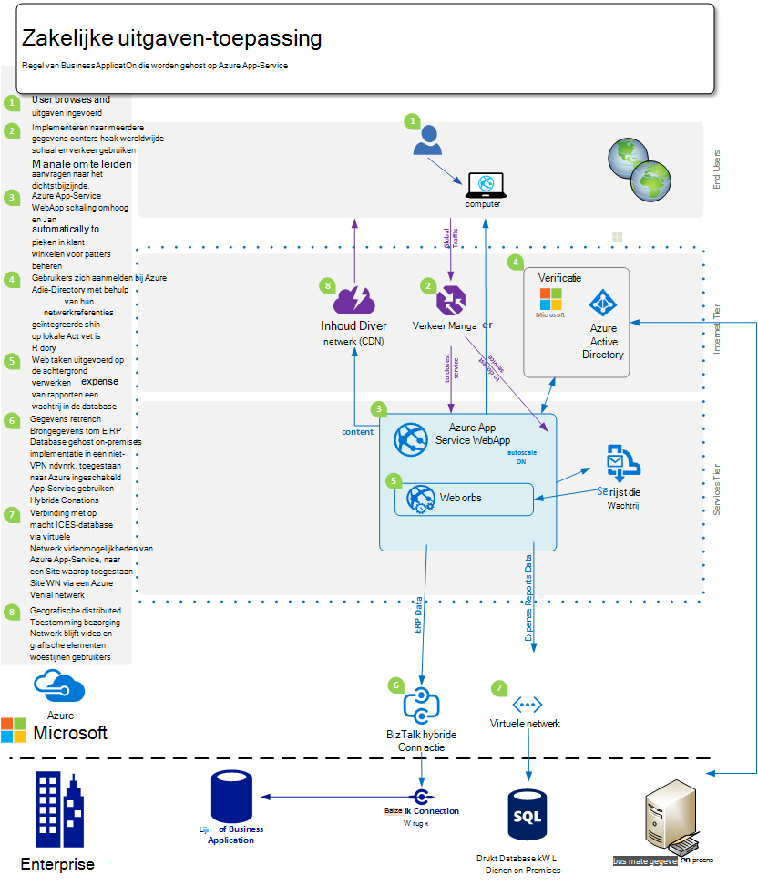
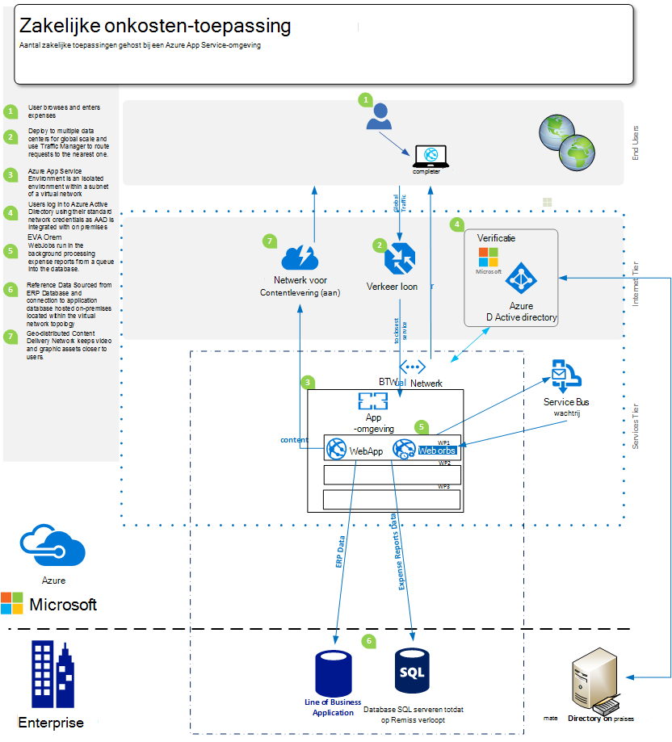
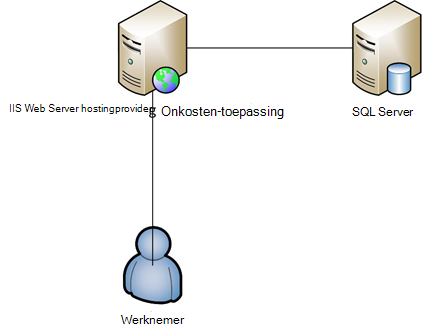

<properties 
    pageTitle="Azure-App-Web-Apps Services voor ondernemingen" 
    description="Ziet u hoe u Azure App Service Web Apps gebruiken enterprise website om oplossingen te maken voor uw bedrijf" 
    services="app-service\web" 
    documentationCenter="" 
    authors="apwestgarth" 
    manager="wpickett" 
    editor=""/>

<tags 
    ms.service="app-service-web" 
    ms.workload="web" 
    ms.tgt_pltfrm="na" 
    ms.devlang="na" 
    ms.topic="article" 
    ms.date="07/29/2016" 
    ms.author="anwestg"/>

# Azure-App-Web-Apps Services voor Enterprise Whitepaper #

Dat hoeft te verlagen en IT-oplossingen sneller geven in een omgeving met snel veranderende Hiermee maakt u nieuwe uitdagingen voor ontwikkelaars, IT-Professionals en beheerders. Gebruikers zoekt steeds hun lijn van Business (LOB)-webtoepassingen moeten snel, heeft gereageerd en beschikbaar zijn vanaf elk apparaat. Tegelijkertijd, bedrijven probeert te profiteren van de verhoogde productiviteit en efficiëntie die afkomstig zijn uit integratie met de cloud en mobiele services, mogelijk iets net zo eenvoudig als eenmalige aanmelding op apparaten met Active Directory met samenwerking in Office 365 gebruik van gegevens uit een interne LOB-toepassing die op zijn beurt gegevens uit de uitvoering van het bedrijf van Salesforce worden opgehaald. [Azure App Service Web Apps](http://go.microsoft.com/fwlink/?LinkId=529714) is een enterprise-klasse cloud-service voor het ontwikkelen, testen en web en mobiele toepassingen uitvoeren, Web-API's, en algemene websites. Deze kan worden gebruikt om zakelijke websites, intranetsites, zakelijke apps en digitale marketingcampagnes worden uitgevoerd op een wereldwijd netwerk van datacenters geoptimaliseerd voor schaal en beschikbaarheid, samen met de ondersteuning voor doorlopende integratie en moderne DevOps procedures.  

In dit whitepaper worden de mogelijkheden van de [Web Apps](/services/app-service/web/) -service specifiek gericht op actieve LOB-toepassingen, waaronder migratie van bestaande webtoepassingen en -implementatie van nieuwe LOB-webtoepassingen op het platform gemarkeerd. 

## Publiek ##

IT-Professionals, architecten en managers die op zoek bent om te migreren naar de cloud web werkbelasting die momenteel on-premises implementatie worden uitgevoerd. Web werkbelasting kunnen beslaan op bedrijf naar werknemer of bedrijven met webtoepassingen Partners.

## Inleiding ##

App-Service Web Apps is een ideaal platform voor het hosten van zowel de interne en externe webtoepassingen en de services, zoals deze een efficiënte, zeer scalable, beheerde oplossing zodat u zich kunt concentreren biedt op het geven van de waarde voor bedrijven voor uw gebruikers, in plaats van veel tijd besteden en onderhouden van geld en ondersteunende scheidt u omgevingen. Web Apps biedt een flexibel platform waarop u wilt implementeren ondersteuning voor uw onderneming webtoepassingen de mogelijkheid om verder te verifiëren met lokale Active Directory via integratie met Microsoft Azure Active Directory, van snel en gemakkelijk implementaties maken gebruik van uw interne continue integratie en implementatie procedures, terwijl het automatisch aanpassen met de zakelijke behoeften - alle op een beheerde platform waarmee u concentreren op uw toepassing en niet de infrastructuur van uw kunt vergroten. 

## Probleem definitie ##

Snel wijzigen van de IT-liggend, met een verplaatsen van af hosten op traditionele servers met hun hoge kosten op lange levertijden waarbij op aanvraag gebruiken van de services die schaal automatisch worden afgehandeld laden. IT-afdelingen worden wordt gecontroleerd verkleinen van de kosten en op het milieu van infrastructuur en onderhoud besteden aan met een focus op het CAPEX terwijl er meer flexibiliteit verminderen. Het einde van de levensduur van oudere infrastructuur platforms, zoals Windows Server 2003, leidt IT-afdelingen moet worden gereviseerd cloud-migratie als een mogelijke manier om te voorkomen dat nieuwe langdurig kosten. In het verleden, zou CIO beslissingen nemen aanschaffen voor andere afdelingen; echter duurt steeds CMOs en de koppen van andere bedrijven eenheid een meer actieve rol in hoe hun budget is uitgegeven en wat het rendement op hun investering is. Bedrijven moeten steeds hun personeel worden veel meer mobiele dan ooit met werknemers op afstand werkt, meer tijd besteden met klanten toegang tot systemen probleemloos dat u nodig hebt.

Bedrijf wilt aanbrengen, maandelijks, wekelijks, dagelijks. Bedrijven zoekt direct globale schalen met normale bijgewerkte services vol staan met nieuwe functies, door een derde partij of intern.  In sommige gevallen bedrijven ook zoekt de mogelijkheden voor hun toepassingen isoleren en toegang tot uw resources terwijl ook maken gebruik van openbare Cloud faciliteiten. Gebruikers hebben hoger verwachtingen, met veel die gebruikmaken van services in hun eigen persoonlijke leven zoals Office365. Ze willen toegang heeft tot soortgelijke, up-to-date, functie uitgebreide services in hun werk leven. Omgaan met deze vraag, IT moet uiterlijk waarmee het bedrijf om te schakelen dit tot en met de selectie en integratie met derden services, zorgvuldig uitkiezen van platforms waarin u aan de zakelijke behoeften, aanpassen kunt terwijl ook wordt betrouwbare met een totale lagere kosten van uw eigendom.

Ontwikkelteams bij zoekt om onmiddellijk voordeel, geven van de nieuwe functies regelmatig. Ze een efficiënte, betrouwbare platform dat werkt naadloos met hun bestaande hulpmiddelen en procedures – ontwikkeling, test samen zoekt, los; en werken samen met de IT-afdelingen automatiseert implementatie, beheer en waarschuwingen, alles met het doel van nul downtime.

<a href="highlevel" />
## Hoog niveau oplossing ##

Webplatforms en kaders worden steeds ontwikkelen, testen en hosten bedrijfstoepassingen gebruikt.  Met een normale tekstregel business-toepassing, zoals een interne werknemer onkosten-systeem, vaak die uitsluitend bestaan uit een web-app met een back-database voor de opslag van de gegevens die zijn verbonden met de toepassing.

App Service Web Apps is een goede optie voor het hosten van dergelijke toepassingen, biedt scalable en betrouwbare infrastructuur die wordt beheerd met de in de buurt van een getal zonder tussenkomst en downtime hersteld. Het Microsoft Azure-platform vindt u veel opslagopties van gegevens voor de ondersteuning van webtoepassingen die worden gehost op Web-Apps uit Microsoft Azure SQL-Database, een beheerde scalable relationele database-als-een-service, naar populaire services van partners zoals ClearDB MySQL-Database en MongoDB.

Een andere mogelijkheid is om te gebruiken van uw bestaande investering on-premises. In het voorbeeldscenario, een werknemer onkosten-systeem, wilt u mogelijk het behoud van uw gegevensopslag binnen de infrastructuur van uw eigen interne. Dit kan zijn voor integratie met interne systemen (rapportage, salarisadministratie, facturering enz.) of een IT-beheermodel vereiste tevreden te stellen.  Web Apps biedt een aantal manieren van zodat u kunt verbinding maken met de infrastructuur van uw aan lokale:

- [App serviceomgevingen](app-service-app-service-environment-intro.md) - App Service omgevingen (ASE) zijn een nieuwe Premium-functie die onlangs is toevoegen aan de App-Service van Microsoft Azure-aanbod.  ASEs bieden een volledig geïsoleerd en speciale omgeving voor het uitvoeren van Azure-Service voor App-apps veilig met hoge schaal en biedt moeten worden geïsoleerd en beveiligde netwerktoegang   
- [Hybride verbindingen](../biztalk-services/integration-hybrid-connection-overview.md) – hybride verbindingen zijn van een functie van Microsoft Azure BizTalk-Services en WebApps verbinding maken met on-premises bronnen veilig, zoals SQL Server, MySQL, Web-API's en aangepaste webservices inschakelen. 
- [Integratie van virtuele netwerken](https://azure.microsoft.com/blog/2014/09/15/azure-websites-virtual-network-integration/) – Web Apps-integratie met Azure Virtual Network kunt u uw web-app verbinden met een Azure virtuele netwerk dat op zijn beurt kan niet worden verbonden met de infrastructuur van uw aan lokale via een VPN-verbinding voor de site-naar-site. 

De volgende diagrammen weer een hoog niveau voorbeeld-oplossing met connectiviteitsopties voor op de lokale resources.  Het eerste voorbeeld ziet u hoe dit kan worden bereikt met standaardfuncties van Azure App-Service en de tweede ziet u hoe dit is bereikt met de premium aanbod, App serviceomgevingen.

Gebruik van functies van de standaard-App-Service:

Een App Service-omgeving gebruikt:

## Zakelijke voordelen ##

App Service Web Apps bevat een groot aantal zakelijke voordelen waarmee uw functie veel efficiëntere en agile in geven voor de zakelijke behoeften. 

### PaaS Model ###

App Service Web Apps is gebaseerd op een Platform als een servicemodel die een aantal kosten en efficiëntie te sparen biedt.  Moet u niet langer uur VMs beheren, besturingssystemen en kaders herstellen. Web Apps is een omgeving met automatisch patches waarmee u kunt richten op uw webtoepassingen en niet VMs, teams gratis om extra bedrijven waarde verlaten beheren.

Het PaaS Model versterking van Web Apps kunt beroepen van de methodologie DevOps om te voldoen aan de doelstellingen. Als een zakelijk betekent dit dat volledig beheer en integratie gedurende de hele toepassing hele levenscyclus, inclusief ontwikkeling, testen, release, cmdlets voor controle en beheer, en ondersteuning. 

Voor ontwikkelteams, worden continue integratie en implementatie werkstromen geconfigureerd vanaf Visual Studio Team Services, GitHub, TeamCity, Hudson of BitBucket, zodat geautomatiseerde opbouwen, testen en implementatie maal terwijl de wrijving wordt afgetrokken betrokken bij het vrijgeven in de bestaande infrastructuur voor snellere release inschakelen. Web Apps ook ondersteunt het maken van meerdere testen en tijdelijke omgevingen voor uw werkstroom release, niet langer moet u reserveren of hardware toewijzen voor deze doeleinden, kunt u net zo veel omgevingen als u wilt en uw eigen promotie om los van de werkstroom te definiëren. Als u kan toch wilt losmaken naar een slot testen van bronbeheer, uitvoert in een serie van tests en na het succesvolle afronding bedrijf promoveren tot een fase slot en ten slotte uitwisselen op productie met geen downtime, het voordeel die webtoepassingen die worden gehost op Web Apps vooraf worden geladen en directe het best mogelijke klantervaring beschikken.  Daarnaast kunnen bedrijven aanbrengen gebruiken van de testen in productie mogelijkheden van App-Service Web Apps voor een sectie van verkeer naar een ander slot rechtstreekse, valideren van de wijzigingen, voordat u overstappen van al het verkeer naar de nieuwe implementatie of al het verkeer naar de vorige implementatie terug te keren. 

Bewerkingen teams kunnen vertrouwen dat ze afkomstig zijn het best mogelijke geplaatst om te reageren op eventuele problemen met een van de webtoepassingen die worden gehost op Web Apps met de ingebouwde functies voor controle en waarschuwingen. Moet bewerkingen Teams hebben al worden geïnvesteerd in analyses en dergelijke van Microsoft Visual Studio-toepassing inzichten, nieuwe Relic en AppDynamics controle oplossingen. Deze worden ook volledig ondersteund op Web-Apps inschakelen bedrijfscontinuïteit en een vertrouwde omgeving van waaruit u kunt uw webtoepassingen controleren.

Tot slot WebApps biedt functionaliteit automatisch back-up uw app(s) en gehoste database (s) verwijzen naar een container Azure-blobopslag. Om u te voorzien van een eenvoudige manier en zeer kosten effectieve methode waarmee u wilt herstellen in noodgevallen, dat u een complex op lokale hardware en software wordt afgetrokken.

### Gebruiksgemak migratie ###

Onderhoud van hardware en objecten draaien is een probleem met de belangrijkste voor bedrijven zoals release maal voor hardware en besturingssystemen versnellen. Misschien hebt u een aantal Windows Server 2003 R2-servers die afkomstig zijn naar het einde van de ondersteuning in 2015, maar ze zijn nog steeds hostingprovider belangrijke webtoepassingen voor uw bedrijf? App Service Web Apps is een uitstekende candidate waarop u voor het hosten van deze webtoepassingen en u kunt de bedrijven hardware goed rationaliseren. Web Apps beschikt u over naar een bereik van hardwarespecificaties die worden beheerd en beheerd als onderdeel van de service, hoeft u vervangende- en beheerkosten factor als onderdeel van uw budget infrastructuur.  Migratie kan bestaan uit alleen een kopie en plakken van uw bestaande implementatie in Web-Apps of een meer complexe migratie waar de-Web-Apps migratie assistent waarde wordt toegevoegd. Gemigreerde webtoepassingen te rekenen op het volledige scala Azure-services, integratie aanvullende services naar de webtoepassingen. U kunt bijvoorbeeld overwegen Azure Active Directory om toegang tot uw toepassing op basis van de gebruikers-koppeling naar beveiligingsgroepen toevoegen. Een ander voorbeeld kunt Cache-Services te verbeteren de prestaties en verkleinen latentie, mits beter algemene gebruikerservaring wilt toevoegen. 

### Enterprise Class hostingprovider ###

App Service Web Apps biedt een stabiele, betrouwbare platform die kunnen worden afgehandeld tal van bedrijven moet uit kleine interne ontwikkel- en -werkbelastingen, ten zeerste scaled hoog verkeer websites zijn bewezen. Met behulp van Web Apps, stapt u gebruik van hetzelfde bedrijf class hostingprovider platform dat Microsoft een bedrijf met hoge waarde web werkbelasting. Web-Apps, samen met alle services op het Azure-platform worden gemaakt met de beveiliging en naleving van wettelijke vereisten, zoals ISO (ISO/IEC 27001:2005); Zie [http://aka.ms/azurecompliance](/support/trust-center/compliance/)SOC1 en SOC2 SSAE 16/ISAE 3402 verklaringen, HIPAA BAA, PCI en Fedramp, uiteindelijk van elk element en de functie voor meer informatie. 

Microsoft Azure platform besturingselementen is toegestaan rol gebaseerd autorisatie enterprise niveaus van besturingselement naar resources in WebApps inschakelen. RBAC biedt ondernemingen de kracht en het implementeren van hun eigen access informatiebeheerbeleid instellen voor alle hun activa in de omgeving Azure door gebruikers toewijzen aan groepen en de vereiste machtigingen breken toe te wijzen aan deze groepen ten opzichte van de activa zoals een web-app. Zie voor meer informatie over RBAC in Azure wordt aangegeven, [http://aka.ms/azurerbac](../active-directory/role-based-access-control-configure.md). Met behulp van Web Apps, kunt u ervoor dat uw webtoepassingen zijn geïmplementeerd in een omgeving veilig en er volledig beheer in welk gebied uw activa zijn geïmplementeerd zijn. 

Azure App serviceomgevingen [http://aka.ms/aseintro](http://aka.ms/aseintro) zijn premium-service plannen optie om een nieuwe voor enterprise-klanten die gebruikmaken van Azure App-Service en deze bieden een volledig geïsoleerd en speciale-omgeving.  Hierdoor kunnen bedrijven om te implementeren toepassingen die u van zeer hoog schaal profiteren kunnen terwijl ook met volledige controle over inkomende en uitgaande netwerkverkeer en ASEs het mogelijk dat toepassingen hoge snelheid beveiligde verbindingen hebt via virtuele netwerken naar lokale bronnen.

App Service WebApps kunnen ook volle gebruik te maken van uw aan lokale investeringen door te bieden de mogelijkheid voor koppeling terug naar uw interne bronnen, zoals uw datawarehouse of SharePoint-omgeving. Zoals is beschreven in [hoog niveau oplossing](#highlevel) u kunt aanbrengen gebruik van de hybride verbindingen en virtuele netwerkconnectiviteit tot stand brengen van verbindingen met op de lokale infrastructuur en services.

### Wereldwijde schaal ###

App Service Web Apps is een globale en scalable platform, zodat uw webtoepassingen te vergroten en aanpassen aan de behoeften van groeien snel en met minimale langdurig planning en kosten. In normale op lokale infrastructuur scenario's, uitbreiding en toename van de aanvraag zowel lokaal en geografisch zou vereisen een grote hoeveelheid management, planning en uitgaven inrichten en aanvullende infrastructuur beheren. Web Apps biedt de mogelijkheid om te schalen dat uw webtoepassingen met de ebb en de stroom van uw vereisten. Bijvoorbeeld met behulp van de toepassing uitgaven als voorbeeld, voor de meeste van de maand uw gebruikers zijn lichte gebruikers van de toepassing, maar als de deadline elke maand voor onkosten ingediende items wordt ingevoerd en gebruik vergroot in uw toepassing, WebApps heeft de mogelijkheid om automatisch te stellen meer infrastructuur voor uw toepassing en klikt u vervolgens zodra de gebruik heeft terug nogmaals deze kan schalen terug naar de basislijn-infrastructuur die u definieert.

Web Apps is beschikbaar globaal in 24 datacenters overal ter wereld en groeiende. Zie [http://aka.ms/azlocations](http://aka.ms/azlocations)voor de meest bijgewerkte lijst met regio's en locatie. Uw bedrijf kunt eenvoudig met Web Apps bereiken globale bereik en schaal. Als uw bedrijf in nieuwe gebieden groeit, worden de rapportage toepassing dashboards die u gebruikt en host op Web-Apps kunnen eenvoudig worden geïmplementeerd in extra datacenters en lokale gebruikers uiterst sneller via de combinatie van Web Apps en Azure verkeer Manager, alle het voordeel van de scalable infrastructuur onder wordt kunnen de contracten en uitvouwen als de behoeften van de wijziging van regionale kantoren fungeren.
 
## Oplossingsdetails van de ##

Bekijk een voorbeeld van een toepassing migratiescenario. Dit overzicht van de details van hoe de Service-WebApps App-functies die aan samen goede oplossing en bedrijven waarde op te geven.
 
In dit voorbeeld is het aantal zakelijke toepassingen die we zullen worden bespreekt last toepassing waarmee werknemers om in te dienen hun onkosten voor terugbetaling rapportage. De toepassing wordt gehost op een Windows Server 2003 R2 IIS6 uitgevoerd en de database is een database van SQL Server 2005. De reden we Kies oudere server hangt af met de komende einde van Service voor Windows Server 2003 R2 en SQL Server 2005 en we hebben [hulpmiddelen](http://aka.ms/websitesmigration) en [richtlijnen](http://aka.ms/websitesmigrationresources) voor het automatisch gemigreerd werkbelasting in Azure. Met die in gedachten, wordt het patroon dat in dit voorbeeld gebruikt toepassen op een breed verity migratie scenario's beschreven. 

### Bestaande toepassing migreren ###

Stap 1 van de algehele oplossing voor het verplaatsen van een LOB-toepassing Web Apps is de bestaande toepassing activa en architectuur identificeren. Het voorbeeld in dit artikel is een ASP.NET-webtoepassing die worden gehost op een enkele IIS-Server met de database die worden gehost op een aparte SQL Server, zoals wordt weergegeven in de onderstaande afbeelding. Werknemers login aan het systeem met een combinatie van gebruikersnaam en wachtwoord, deze gegevens van uitgaven invoeren en gescande kopieën van recepten of in de database, voor elk item van onkosten uploaden. 
 

#### Items u rekening moet houden ####

Wanneer de migratietoepassing vanuit een on-premises omgeving, die u mogelijk wilt u moet denken, enkele beperkingen van de Web Apps. Hier volgen enkele belangrijke onderwerpen naar rekening moet houden bij het migreren van webtoepassingen tot Web-Apps ([http://aka.ms/websitesmigrationresources](http://aka.ms/websitesmigrationresources)):

-   Poort bindingen – Web Apps ondersteunt alleen poort 80 voor HTTP en poort 443 voor HTTPS-verkeer is toegestaan. Als uw toepassing gebruikmaakt van een andere poort en klik vervolgens één keer gemigreerd wordt de toepassing wordt er gebruik van poort 80 voor HTTP en poort 443 voor HTTPS-verkeer is toegestaan. Dit is vaak een onschadelijk probleem omdat deze algemene in op premises implementaties om te maken gebruik van verschillende poorten ter voorkoming van het gebruik van de domeinnamen, met name in ontwikkeling en test omgevingen
-   Verificatie-Web Apps ondersteunt anonieme verificatie standaard en formulierverificatie die wordt aangeduid met een toepassing. Web Apps kunt Windows-verificatie bieden wanneer de toepassing is geïntegreerd met Azure Active Directory en ADFS alleen. Dit is een functie die wordt besproken uitgebreider [hier](http://aka.ms/azurebizapp) 
-   GAC op basis van assemblies: Web Apps kunnen niet worden de implementatie van assemblies naar de globale Cache voor constructie (GAC). Daarom als de toepassing wordt gemigreerd maakt gebruik van deze functie on-premises implementatie, kunt u de stroombaan verplaatsen naar de map bin van de toepassing.
-   IIS5 Compatibiliteitsmodus – Web Apps ondersteunt geen IIS5-compatibiliteitsmodus en als zodanig elk exemplaar van de Web Apps en alle webtoepassingen onder het bovenliggende Web Apps-exemplaar uitgevoerd in hetzelfde werkproces binnen een enkele groep van toepassingen.
-   Gebruik van COM-bibliotheken – Web Apps is niet toegestaan voor de registratie van COM-onderdelen op het platform. Daarom als de toepassing gebruik van een COM-onderdelen maakt, deze moeten worden herschreven in beheerde code en zorg dat de toepassing wordt geïmplementeerd.
-   ISAPI-Filters – ISAPI-Filters kunnen worden ondersteund op Web Apps. Ze moeten worden geïmplementeerd als onderdeel van de toepassing en geregistreerd in bestand web.config van de webtoepassing. Zie [http://aka.ms/azurewebsitesxdt](web-sites-transform-extend.md)voor meer informatie. 

Zodra deze onderwerpen zijn beschouwd, is uw webtoepassing gereed voor de Cloud. En u hoeft niet als de volgende onderwerpen wordt niet volledig is voldaan, het Migratiehulpmiddel uitvoert aanbevolen hoeveelheid krijgen tot de migratie. 

De volgende stappen in het migratieproces zijn om een App Service web-app en een Azure SQL-Database te maken. Er zijn verschillende maten van Web Apps-exemplaren met variërende aantal CPU kernen en RAM bedragen beschikbaar zijn voor u selecteren op basis van het vereiste voor uw web-toepassingen. Voor meer informatie en prijzen, Zie [http://aka.ms/azurewebsitesskus](/pricing/details/websites/). Microsoft Azure SQL Database caters ook op alle een zakelijke behoeften met verschillende niveaus van de service en prestaties om te voldoen aan vereisten. Meer informatie kan worden gevonden op [http://aka.ms/azuresqldbskus](/pricing/details/sql-database/). Zodra u hebt gemaakt, wordt de toepassing wordt geüpload naar de App Service Web Apps, hetzij via FTP of WebDeploy en klikt u vervolgens verplaatsen naar de database.

In deze migratie gebruikt de oplossing Azure SQL-Database, maar dat wil zeggen niet de enige database die wordt ondersteund op Azure. Bedrijven kunnen ook maken gebruik van MySQL, MongoDB, Azure DocumentDB en nog veel meer via invoegtoepassingen die kunnen worden aangeschaft in de [Azure Store](/marketplace/partner-program/). 

Bij het maken van een Azure SQL-Database zijn een aantal opties beschikbaar voor een bestaande database importeren vanuit een on-premises implementatie-server uit het genereren van een script van een bestaande database voor het gebruik van de [gegevens laag toepassing exporteren en importeren](http://aka.ms/dacpac). 

De databasetoepassing uitgaven is gemaakt door een nieuwe Azure SQL-Database te maken, verbinden met de database met behulp van SQL Server Management Studio en voert u een script om het databaseschema bouwen en gevuld met gegevens uit de lokale database.

De laatste stap in deze eerste fase van de migratie is vereist het bijwerken van verbindingstekenreeksen met de met de database voor de toepassing. Dit kan worden bereikt via de portal van Azure. Voor elke web-app kunt u specifieke toepassingsinstellingen, inclusief eventuele verbindingstekenreeksen met de wordt gebruikt door de toepassing verbinding maken met een database die wordt gebruikt.

### Alternatieven voor het gebruik van Azure SQL-Database ###

Het Azure platform biedt een aantal alternatieven voor het gebruiken van Azure SQL-Database als een primaire Webdatabase voor toepassingen, is dit verschillende werkbelastingen dat wil zeggen inschakelen gebruik van een oplossing NoSQL of het platform structureren zoals u de gegevens van een bedrijfsbehoeften inschakelen. Bijvoorbeeld een bedrijf kan gegevens bevatten die niet moeten worden opgeslagen buiten het bedrijf of in een openbare cloud-omgeving en dus aangepaste gegevens er voor het behoud van het gebruik van hun lokale database.

#### Connectiviteit met lokale bronnen ####
App Service Web Apps biedt meerdere opties voor de verbinding maken met lokale bronnen, zoals databases, hergebruik van bestaande infrastructuur voor hoge waarde inschakelen. De opties zijn zoals hieronder wordt weergegeven:

- App Service omgevingen zijn geïsoleerd en die zijn gemaakt in een subnet van een virtueel netwerk, dus zodat de omgeving om te communiceren met privé eindpunten bevinden binnen hetzelfde virtuele netwerk - [http://aka.ms/appserviceasenetworking](http://aka.ms/appserviceasenetworking)
- Integratie van de Web-Apps virtuele-netwerken ondersteunt de integratie tussen Web-Apps en een Azure Virtual Network, zodat u toegang tot de resources die zijn uitgevoerd in uw virtuele netwerk waarmee, als verbonden met uw aan lokale netwerk met site-naar-site VPN, connectivity rechtstreeks naar uw op premises systemen.
- Hybride verbindingen zijn van een functie van Azure BizTalk-Services en geef een eenvoudige manier verbinding maken met afzonderlijke lokale bronnen zoals SQL Server, MySQL, HTTP-Web-API's en meest aangepaste webservices.

#### Schaal en tolerantie ####

Als een bedrijf in omvang de personeel, via overname of natuurlijke organisch groei, dus groeit ook moet web toepassingen schaal om aan deze nieuwe voldoen. Daadwerkelijk vandaag is het algemene om een nog meer verspreiding van reserveren teams en externe medewerkers weer te geven, bijvoorbeeld bedrijven met kantoren in de Verenigde Staten, Europa en Azië, met een mobiele verkoop afdwingen in veel meer gebieden. Web Apps heeft de mogelijkheid worden afgehandeld elastische wijzigingen in de schaal probleemloos en automatisch.

App Service Web Apps kunt webtoepassingen worden geconfigureerd als u automatisch via de Azure-portal, afhankelijk van de twee vectoren – geplande tijden of door CPU-gebruik wilt verkleinen. Schaalbaarheid van Web Apps automatisch biedt een efficiënte en zeer flexibel manier om tegemoet voor groter wijzigingen in gebruik voor alle zakelijke toepassingen van webtoepassingen zoals onze kosten rapportage-systeem met marketing websites, welke een hoge burst verkeer voor de duur van een korte van promotie-ervaring. Lees [hoe u de schaal Websites](web-sites-scale.md)voor meer informatie en instructies voor het schaalbaarheid van uw webtoepassingen met Web Apps.

Naast de schaal flexibiliteit van Web Apps kan de algehele platform bedrijfscontinuïteit en tolerantie via de mogelijke verdeling van webtoepassingen en hun activa op meerdere datacenters en geografische regio's.

## Overzicht ##
App Service Web Apps biedt een flexibele, kosten effectieve, heeft gereageerd oplossing aan de behoeften van de dynamische van een bedrijf in een omgeving met snel veranderende. Web Apps helpt bedrijven de productiviteit te verhogen en efficiënt te maken van een beheerde platform met moderne DevOps mogelijkheden en verminderde handen op beheer gebruiken terwijl de enterprise-mogelijkheden in schaal, flexibiliteit, beveiliging en integratie met on-premises implementatie activa.

## Bellen naar actie ##
Voor meer informatie over de service Azure App Service Web Apps, gaat u naar [http://aka.ms/enterprisewebsites](/services/websites/enterprise/) waar meer informatie kunt worden die afkomstig zijn en aanmelden voor een proefabonnement vandaag om [http://aka.ms/azuretrial](/pricing/free-trial/) te evalueren van de service en ontdek de voordelen van uw bedrijf.

[AZURE.INCLUDE [app-service-web-whats-changed](../../includes/app-service-web-whats-changed.md)]

[AZURE.INCLUDE [app-service-web-try-app-service](../../includes/app-service-web-try-app-service.md)]
 
 
