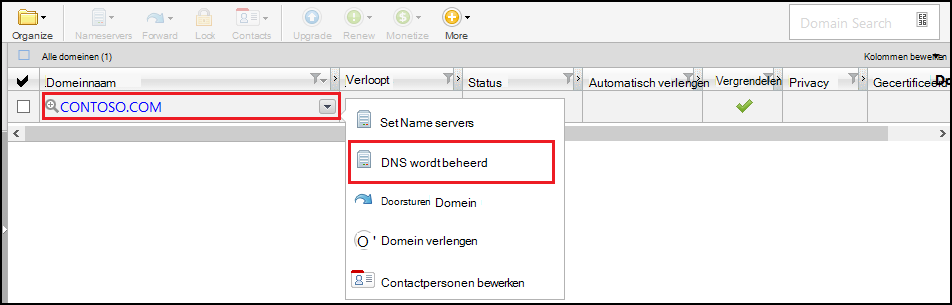
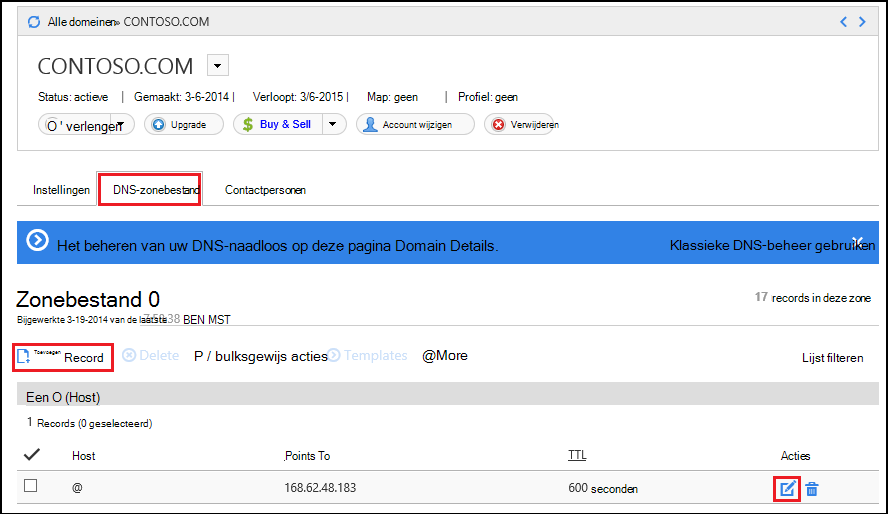
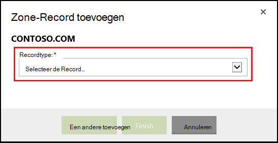
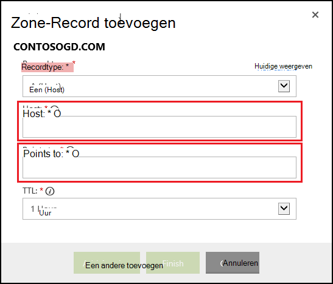

<properties
    pageTitle="Een aangepaste domeinnaam configureren in Azure App-Service (GoDaddy)"
    description="Informatie over het gebruik van een domeinnaam bij GoDaddy met Azure Web Apps"
    services="app-service"
    documentationCenter=""
    authors="erikre"
    manager="wpickett"
    editor="jimbe"/>

<tags
    ms.service="app-service"
    ms.workload="na"
    ms.tgt_pltfrm="na"
    ms.devlang="na"
    ms.topic="article"
    ms.date="01/12/2016"
    ms.author="cephalin"/>

# Een aangepaste domeinnaam configureren in Azure App-Service (aangeschaft rechtstreeks bij GoDaddy)

[AZURE.INCLUDE [web-selector](../../includes/websites-custom-domain-selector.md)]

[AZURE.INCLUDE [intro](../../includes/custom-dns-web-site-intro.md)]

Als u domein via Azure App Service Web-Apps hebt aangeschaft vervolgens verwijzen naar de laatste stap van de [Web Apps-domein kopen](custom-dns-web-site-buydomains-web-app.md).

In dit artikel bevat instructies over het gebruik van een aangepaste domeinnaam hebt aangeschaft rechtstreeks bij [GoDaddy](https://godaddy.com) met [App Service Web Apps](http://go.microsoft.com/fwlink/?LinkId=529714).

[AZURE.INCLUDE [introfooter](../../includes/custom-dns-web-site-intro-notes.md)]

##Informatie over DNS-records

[AZURE.INCLUDE [understandingdns](../../includes/custom-dns-web-site-understanding-dns-raw.md)]

## Een DNS-record voor uw aangepaste domein toevoegen

Om uw aangepaste domein koppelen aan een WebApp in de App Service, moet u een nieuwe vermelding in de tabel DNS voor uw aangepaste domein toevoegen met behulp van GoDaddy hulpmiddelen. Gebruik van de volgende stappen om te zoeken van de DNS-hulpprogramma's voor go Daddy

1. Meld u aan bij uw account in bij go Daddy en selecteer **Mijn Account** en klik vervolgens op **Mijn-maildomeinen beheren**. Selecteer ten slotte de vervolgkeuzelijst voor de naam van het domein dat u wilt gebruiken met uw Azure web-app en selecteer **DNS beheren**.

    

2. Schuif op de pagina **Domain details** naar het tabblad **DNS Zone File** . Dit is de sectie die wordt gebruikt voor het toevoegen en wijzigen van de DNS-records voor uw domeinnaam.

    

    Selecteer **Record toevoegen** aan een bestaande record toevoegen.

    **Bewerken** van een bestaande record, selecteert u de pen en papier pictogram naast de record.

    > [AZURE.NOTE] Voordat u nieuwe records toevoegt, houd er rekening mee dat GoDaddy DNS-records voor populaire subdomeinen ( **Host** in de editor genoemd) zoals **e-mail**, **bestanden**, **e-mail**en anderen al heeft gemaakt. Als de naam die u wilt gebruiken, al bestaat, wijzigt u de bestaande record in plaats van een nieuwe id maken.

4. Wanneer u een record toevoegt, moet u eerst het recordtype.

    

    Vervolgens moet u de **Host** (het aangepaste domein of subdomein) opgeven en wat dit **wordt verwezen**.

    

    * Bij het toevoegen van een **A-record (host)** - moet u het veld **Host** instellen op een **@** (dit geeft hoofdsite domeinnaam, zoals **contoso.com**,) *(een jokerteken voor meerdere subdomeinen, overeenkomende) of het subdomein dat u wilt gebruiken (bijvoorbeeld * *www**.) U moet instellen de * *wordt verwezen** veld naar het IP-adres van uw Azure web-app.

    * Bij het toevoegen van een **CNAME (alias)-record** - moet u het veld **Host** instellen op het onderliggend domein dat u wilt gebruiken. Bijvoorbeeld: **www**. Moet u het veld **wordt verwezen** instellen op de **. azurewebsites.net** de naam van het domein van uw Azure web-app. Bijvoorbeeld: **contoso.azurewebsites.net**.

5. Klik op **toevoegen**.
6. Selecteer **TXT** als het recordtype en vervolgens de waarde **Host** geven **@** en een waarde **wordt verwezen** van ** &lt;yourwebappname&gt;. azurewebsites.net**.

    > [AZURE.NOTE] Deze TXT-record wordt gebruikt door Azure voor het valideren van dat u eigenaar bent van het domein dat wordt beschreven door de A-record of de eerste TXT-record. Zodra het domein is toegewezen aan de web-app in de Portal Azure, kan dit item van TXT-record worden verwijderd.

5. Wanneer u klaar bent met het toevoegen of records te wijzigen, klikt u op **Voltooien** om de wijzigingen op te slaan.

## De naam van het domein op uw web-app inschakelen

[AZURE.INCLUDE [modes](../../includes/custom-dns-web-site-enable-on-web-site.md)]

>[AZURE.NOTE] Als u aan de slag met Azure App Service wilt voordat u zich registreert voor een Azure-account, gaat u naar de [App-Service probeert](http://go.microsoft.com/fwlink/?LinkId=523751), waar u direct een tijdelijk starter in de browser in de App-Service maken kunt. Geen creditcards vereist; geen verplichtingen.

## Wat er gewijzigd
* Zie voor een handleiding voor het wijzigen van Websites naar App Service: [Azure App-Service en de invloed op bestaande Azure-Services](http://go.microsoft.com/fwlink/?LinkId=529714)
