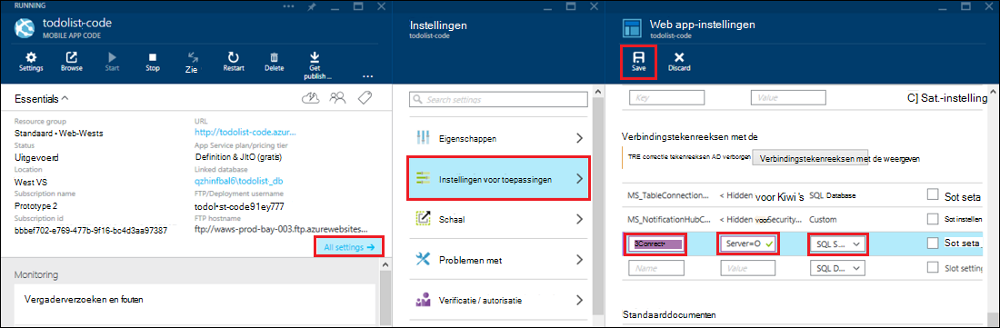

<properties 
    pageTitle="Toegang tot lokale bronnen hybride verbindingen met Azure App-Service" 
    description="Een verbinding maken tussen een web-app in Azure App-Service en een on-premises implementatie resource die wordt gebruikt een statische TCP-poorten" 
    services="app-service" 
    documentationCenter="" 
    authors="cephalin" 
    manager="wpickett" 
    editor="mollybos"/>

<tags 
    ms.service="app-service" 
    ms.workload="na" 
    ms.tgt_pltfrm="na" 
    ms.devlang="na" 
    ms.topic="article" 
    ms.date="02/03/2016" 
    ms.author="cephalin"/>

#Toegang tot lokale bronnen hybride verbindingen met Azure App-Service

Alle lokale bronnen die gebruikmaakt van een statische TCP-poorten, zoals SQL Server, MySQL HTTP-Web-API's en de meeste aangepaste Web-Services kunt u een app Azure App-Service. In dit artikel leest u hoe u een hybride verbinding maken tussen App Service en een lokale SQL Server-database.

> [AZURE.NOTE] Het Web Apps-gedeelte van de functie hybride verbindingen is alleen beschikbaar in de [Portal van Azure](https://portal.azure.com). Een verbinding wilt maken in BizTalk-Services, raadpleegt u [Hybride verbindingen](http://go.microsoft.com/fwlink/p/?LinkID=397274). 
> 
> Dit inhoudstype geldt ook voor Mobile-Apps in Azure App-Service. 

## Vereisten voor
- Een Azure-abonnement. Zie [Azure gratis proefversie](https://azure.microsoft.com/pricing/free-trial/)voor een gratis abonnement. 
 
    Als u aan de slag met Azure App Service wilt voordat u zich registreert voor een Azure-account, gaat u naar de [App-Service probeert](http://go.microsoft.com/fwlink/?LinkId=523751), waar u direct een tijdelijk starter in de browser in de App-Service maken kunt. Geen creditcards vereist; geen verplichtingen.

- Als u wilt gebruiken een lokale SQL Server- of SQL Server Express-database met de verbinding van een hybride, moet TCP/IP worden ingeschakeld voor een statische poort. Gebruik van een standaardexemplaar op SQL Server wordt aanbevolen, omdat deze statische poort 1433 wordt gebruikt. Zie voor informatie over het installeren en configureren van SQL Server Express voor gebruik met hybride verbindingen, [verbinding maken met een lokale SQL Server uit een Azure website hybride verbindingen](http://go.microsoft.com/fwlink/?LinkID=397979).

- De computer waarop u de on-premises implementatie hybride Connection Manager-agent beschreven verderop in dit artikel installeert:

    - Verbinding maken met Azure via poort 5671 moet zijn
    - Moeten kunnen bereiken van de *hostname*:*poortnummer* van uw on-premises implementatie resource. 

> [AZURE.NOTE] De stappen in dit artikel wordt ervan uitgegaan dat u de browser van de computer waarop de on-premises implementatie hybride verbinding-agent worden gebruikt.

## Een WebApp maken in de Portal van Azure ##

> [AZURE.NOTE] Als u al een WebApp of backend Mobile-App in de Portal van Azure die u wilt gebruiken voor deze zelfstudie hebt gemaakt, kunt u gaat u verder met het [maken van een hybride verbinding en een BizTalk-Service](#CreateHC) en start vanaf hier.

1. Klik in de linkerbovenhoek van de [Azure-Portal](https://portal.azure.com)op **Nieuw** > **Web + Mobile** > **Web App**.
    
    ![Nieuwe web-app][NewWebsite]
    
2. Klik op het blad **in de browser** een URL en klik op **maken**. 
    
    ![De websitenaam van de][WebsiteCreationBlade]
    
3. Na een paar seconden de WebApp is gemaakt en de web-app blade wordt weergegeven. Het blad is een verticaal schuifbare dashboard waarmee u uw site beheren.
    
    ![Website uitvoeren][WebSiteRunningBlade]
    
4. Om te controleren of dat de site is live, kunt u klikken op het pictogram **Bladeren** om de standaardpagina weer te geven.
    
    ![Klik op Bladeren om te zien van uw web-app][Browse]
    
    ![Standaardpagina web app][DefaultWebSitePage]
    
U maakt vervolgens een hybride verbinding en een BizTalk-service voor het web-app.

## De verbinding van een hybride en een Service BizTalk maken ##

1. Klik in uw web-app blade op **alle instellingen** > **netwerkproblemen** > **de eindpunten van de verbinding hybride configureren**.
    
    ![Hybride verbindingen][CreateHCHCIcon]
    
2. Klik op het blad hybride verbindingen, op **toevoegen**.
    
    <!-- ![Add a hybrid connnection][CreateHCAddHC]
-->
    
3. Hiermee opent u het blad **een verbinding met een hybride toevoegen** .  Aangezien dit uw eerste hybride verbinding, de optie **nieuwe hybride verbinding** vooraf is geselecteerd en het blad **maken hybride verbinding** wordt geopend voor u.
    
    ![Een hybride verbinding maken][TwinCreateHCBlades]
    
    Klik op de **maken hybride verbinding blade**:
    - Geef een naam voor de verbinding voor de **naam**.
    - Voor **hostnaam**, voer de naam van de lokale computer waarop de resource.
    - Voer het poortnummer in dat uw on-premises implementatie resource wordt gebruikt (1433 bij een standaardexemplaar van SQL Server) voor de **poort**.
    - Klik op **Biz Talk-Service**

4. Hiermee opent u het blad **BizTalk-Service maken** . Voer een naam voor de service BizTalk en klik vervolgens op **OK**.
    
    ![BizTalk-service maken][CreateHCCreateBTS]
    
    Hiermee sluit u het blad **BizTalk-Service maken** en gaat u terug naar het blad **maken hybride verbinding** .
    
5. Klik op het blad maken hybride verbinding wordt gebruikt, klikt u op **OK**. 
    
    ![Klik op OK][CreateBTScomplete]
    
6. Wanneer het proces is voltooid, het gebied voor meldingen in de Portal voor u wordt geïnformeerd dat de verbinding is gemaakt.
    <!---doen

    Alles mislukt in deze stap. Ik kan een service BizTalk maken in de portal dogfood. Ik ga naar de klassieke-portal (volledige portal) en de BizTalk-service hebt gemaakt, maar het werkt niet kunt u uw stem Processtappen verbinden ze - wanneer u klaar bent met de stap maken hybride conn, krijgt u deze fout kan niet worden hybride verbinding RelecIoudHC maken. Het resourcetype kan niet worden gevonden in de naamruimte 'Microsoft.BizTaIkServices voor versie 2014-06-01-api'.
    
    De fout geeft aan dat functie het type, niet het exemplaar kan niet vinden.
    ![Melding voor succes][CreateHCSuccessNotification]
    -->
7. Klik op de web-app blade wordt het pictogram **hybride verbindingen** nu dat 1 hybride verbinding is gemaakt.
    
    ![Een hybride verbinding is gemaakt][CreateHCOneConnectionCreated]
    
U hebt nu een belangrijk onderdeel van de cloudinfrastructuur van de hybride-verbinding voltooid. U maakt vervolgens een overeenkomende deel van de on-premises implementatie.

## Installeren van de on-premises implementatie hybride Connection Manager om de verbinding te voltooien ##

1. Klik op de web-app blade, klikt u op **alle instellingen** > **netwerkproblemen** > **de eindpunten van de verbinding hybride configureren**. 
    
    ![Pictogram voor hybride][HCIcon]
    
2. Klik op het blad **hybride verbindingen** ziet u de kolom **Status** voor het laatst toegevoegde eindpunt **geen verbinding hebt**. Klik op de verbinding om deze te configureren.
    
    ![Niet verbonden][NotConnected]
    
    Hiermee opent u het blad met hybride verbinding.
    
    ![NotConnectedBlade][NotConnectedBlade]
    
3. Klik op het blad, klik dan op **Luisteraar ervan af**.
    
    ![Klik op luisteraar ervan af-instelling][ClickListenerSetup]
    
4. Hiermee opent u het blad **hybride verbindingseigenschappen** . Kies onder **On-premises hybride Connection Manager**, de optie **Klik hier om te kunnen installeren**.
    
    ![Klik hier om te installeren][ClickToInstallHCM]
    
5. Kies **uitvoeren** om door te gaan in het dialoogvenster Beveiligingswaarschuwing toepassing uitgevoerd.
    
    ![Kies uitvoeren om door te gaan][ApplicationRunWarning]
    
6.  Kies **Ja**in het dialoogvenster **Gebruikersaccountbeheer** .
    
    ![Kies Ja][UAC]
    
7. De hybride Connection Manager is gedownload en geïnstalleerd. 
    
    ![Installeren][HCMInstalling]
    
8. Wanneer de installatie is voltooid, klikt u op **sluiten**.
    
    ![Klik op sluiten][HCMInstallComplete]
    
    Klik op het blad **hybride verbindingen** ziet u de kolom **Status** nu **verbonden**. 
    
    ![Status verbonden][HCStatusConnected]

Nu de hybride verbinding-infrastructuur is voltooid, kunt u een hybride-toepassing die gebruikmaakt van deze maken. 

>[AZURE.NOTE]De volgende secties uitgelegd u hoe u een hybride-verbinding met een mobiele Apps .NET backend-project.

## De mobiele App .NET backend-project verbinding maken met de SQL Server-database configureren

Een mobiele Apps .NET backend-project is in de App-Service, net een ASP.NET web-app met een extra SDK Mobile-Apps hebt geïnstalleerd en geïnitialiseerd. Als u wilt gebruiken uw web-app als een backend Mobile-Apps, moet u [downloaden en de mobiele Apps .NET-end SDK geïnitialiseerd](../app-service-mobile/app-service-mobile-dotnet-backend-how-to-use-server-sdk.md#install-sdk).  

Voor Mobile-Apps moet u ook een verbindingsreeks voor de on-premises implementatie-database definiëren en wijzigen van de back-end om deze verbinding gebruiken. 

1. Open het bestand Web.config voor uw mobiele App .NET-backend in Verkenner oplossing in Visual Studio, zoek het gedeelte **connectionStrings** , een nieuwe vermelding SqlClient zoals die naar de on-premises implementatie SQL Server-database verwijst toevoegen:

        <add name="OnPremisesDBConnection"
         connectionString="Data Source=OnPremisesServer,1433;
         Initial Catalog=OnPremisesDB;
         User ID=HybridConnectionLogin;
         Password=<**secure_password**>;
         MultipleActiveResultSets=True"
         providerName="System.Data.SqlClient" />

    Vervang `<**secure_password**>` in deze reeks met het wachtwoord die u hebt gemaakt voor *HybridConnectionLogin*.

3. Klik op **Opslaan** in Visual Studio het Web.config-bestand wilt opslaan.

    > [AZURE.NOTE]Deze instelling wordt gebruikt wanneer u zich in de lokale computer. Wanneer u zich in Azure wordt aangegeven, is deze instelling overschreven door de instelling voor de gedefinieerd in de portal.

4. Vouw de map **modellen** uit en open het bestand voor het model van gegevens, dat op *Context.cs eindigt*.

6. Wijzigen van de exemplaarconstructor **DbContext** om de waarde doorgeven `OnPremisesDBConnection` naar de basis **DbContext** constructor vergelijkbaar met het volgende fragment:

        public class hybridService1Context : DbContext
        {
            public hybridService1Context()
                : base("OnPremisesDBConnection")
            {
            }
        }

    De service wordt nu gebruiken voor de nieuwe verbinding met de SQL Server-database.

## Bijwerken van de Mobile-App-end om de verbindingsreeks van de on-premises implementatie gebruiken

Vervolgens moet u de instelling van een app voor deze nieuwe verbindingsreeks toevoegen, zodat deze kan worden gebruikt vanaf Azure.  

1. Terug in de [portal van Azure](https://portal.azure.com) in de web-app backend-code voor de Mobile-App, klikt u op **alle instellingen**en vervolgens de **instellingen van toepassing**.

3. Het blad **Web app-instellingen** , schuif omlaag naar **tekenreeksen met de verbinding** en toevoegen van een nieuwe **SQL Server** -verbindingsreeks met de naam `OnPremisesDBConnection` met een waarde is zoals `Server=OnPremisesServer,1433;Database=OnPremisesDB;User ID=HybridConnectionsLogin;Password=<**secure_password**>`.

    Vervang `<**secure_password**>` met de secure wachtwoord voor uw on-premises implementatie-database.

    

2. Druk op **Opslaan** om op te slaan de hybride verbinding en de verbindingsreeks die u zojuist hebt gemaakt.

U kunt nu de serverproject publiceren en testen van de nieuwe verbinding met uw bestaande klanten van de Mobile-Apps. Gegevens lezen en naar de on-premises implementatie-database met behulp van de verbinding van de hybride geschreven.

## Volgende stappen ##

- Zie voor informatie over het maken van een ASP.NET-webtoepassing die gebruikmaakt van de verbinding van een hybride [verbinding maken met een lokale SQL Server uit een Azure website hybride verbindingen](http://go.microsoft.com/fwlink/?LinkID=397979). 

### Aanvullende informatie

[Overzicht van de hybride-gegevensverbindingen](http://go.microsoft.com/fwlink/p/?LinkID=397274)

[Josh Twist maakt u kennis met hybride verbindingen (video kanaal 9)](http://channel9.msdn.com/Shows/Azure-Friday/Josh-Twist-introduces-hybrid-connections)

[Hybride verbindingen-website](https://azure.microsoft.com/services/biztalk-services/)

[BizTalk Services: De tabbladen Dashboard, Monitor schaal, configureren en hybride verbinding](../biztalk-services/biztalk-dashboard-monitor-scale-tabs.md)

[Samenstellen van een echte hybride Cloud met naadloze toepassing overdraagbaarheid (video kanaal 9)](http://channel9.msdn.com/events/TechEd/NorthAmerica/2014/DCIM-B323#fbid=)

[Verbinding maken met een SQL-Server on-premises implementatie van Azure Mobile-Services via hybride verbindingen (video kanaal 9)](http://channel9.msdn.com/Series/Windows-Azure-Mobile-Services/Connect-to-an-on-premises-SQL-Server-from-Azure-Mobile-Services-using-Hybrid-Connections)

## Wat er gewijzigd
* Zie voor een handleiding voor het wijzigen van Websites naar App Service: [Azure App-Service en de invloed op bestaande Azure-Services](http://go.microsoft.com/fwlink/?LinkId=529714)

<!-- IMAGES -->
[New]:./media/web-sites-hybrid-connection-get-started/B01New.png
[NewWebsite]:./media/web-sites-hybrid-connection-get-started/B02NewWebsite.png
[WebsiteCreationBlade]:./media/web-sites-hybrid-connection-get-started/B03WebsiteCreationBlade.png
[WebSiteRunningBlade]:./media/web-sites-hybrid-connection-get-started/B04WebSiteRunningBlade.png
[Browse]:./media/web-sites-hybrid-connection-get-started/B05Browse.png
[DefaultWebSitePage]:./media/web-sites-hybrid-connection-get-started/B06DefaultWebSitePage.png
[CreateHCHCIcon]:./media/web-sites-hybrid-connection-get-started/C01CreateHCHCIcon.png
[CreateHCAddHC]:./media/web-sites-hybrid-connection-get-started/C02CreateHCAddHC.png
[TwinCreateHCBlades]:./media/web-sites-hybrid-connection-get-started/C03TwinCreateHCBlades.png
[CreateHCCreateBTS]:./media/web-sites-hybrid-connection-get-started/C04CreateHCCreateBTS.png
[CreateBTScomplete]:./media/web-sites-hybrid-connection-get-started/C05CreateBTScomplete.png
[CreateHCSuccessNotification]:./media/web-sites-hybrid-connection-get-started/C06CreateHCSuccessNotification.png
[CreateHCOneConnectionCreated]:./media/web-sites-hybrid-connection-get-started/C07CreateHCOneConnectionCreated.png
[HCIcon]:./media/web-sites-hybrid-connection-get-started/D01HCIcon.png
[NotConnected]:./media/web-sites-hybrid-connection-get-started/D02NotConnected.png
[NotConnectedBlade]:./media/web-sites-hybrid-connection-get-started/D03NotConnectedBlade.png
[ClickListenerSetup]:./media/web-sites-hybrid-connection-get-started/D04ClickListenerSetup.png
[ClickToInstallHCM]:./media/web-sites-hybrid-connection-get-started/D05ClickToInstallHCM.png
[ApplicationRunWarning]:./media/web-sites-hybrid-connection-get-started/D06ApplicationRunWarning.png
[UAC]:./media/web-sites-hybrid-connection-get-started/D07UAC.png
[HCMInstalling]:./media/web-sites-hybrid-connection-get-started/D08HCMInstalling.png
[HCMInstallComplete]:./media/web-sites-hybrid-connection-get-started/D09HCMInstallComplete.png
[HCStatusConnected]:./media/web-sites-hybrid-connection-get-started/D10HCStatusConnected.png
 