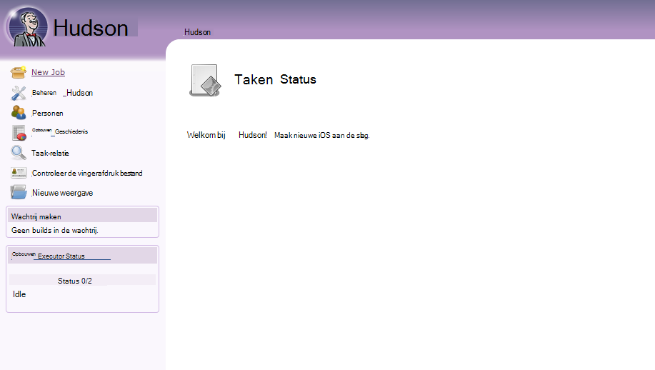
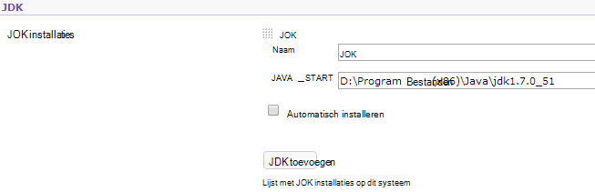
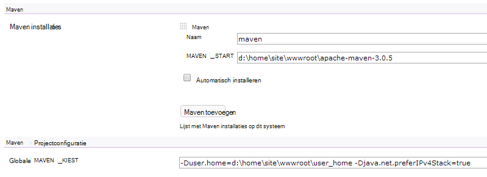

<properties 
    pageTitle="Een aangepaste Java-web-app uploaden naar Azure" 
    description="Deze zelfstudie ziet u hoe u een aangepaste Java-web-app uploaden naar Azure App Service Web Apps." 
    services="app-service\web" 
    documentationCenter="java" 
    authors="rmcmurray" 
    manager="wpickett" 
    editor=""/>

<tags 
    ms.service="app-service-web" 
    ms.workload="web" 
    ms.tgt_pltfrm="na" 
    ms.devlang="Java" 
    ms.topic="article" 
    ms.date="08/11/2016" 
    ms.author="robmcm"/>

# Een aangepaste Java-web-app uploaden naar Azure

In dit onderwerp wordt uitgelegd hoe u een aangepaste Java-web-app uploaden naar [Azure App Service] Web Apps. Opgenomen, vindt u informatie die van toepassing op alle Java-website of web-apps, en ook enkele voorbeelden voor specifieke toepassingen.

Houd er rekening mee dat Azure kunt u voor het maken van Java web-apps met behulp van de Azure-Portal configuratie UI en de Azure Marketplace, zoals beschreven bij het [maken van een Java-web-app in Azure App-Service](web-sites-java-get-started.md). Deze zelfstudie is bedoeld voor scenario's waarin u niet wilt gebruiken de Portal van Azure-configuratie UI of de Azure Marketplace.  

## Configuratie richtlijnen

De volgende tabel ziet de instellingen voor aangepaste Java-web-apps op Azure verwacht.

- De HTTP-poort die wordt gebruikt door het proces Java dynamisch toegewezen.  Het proces moet gebruiken voor de poort van de omgevingsvariabele `HTTP_PLATFORM_PORT`.
- Alle luisteren poorten dan de één HTTP luisteraar ervan af moeten zijn uitgeschakeld.  In Tomcat, die bevat de afsluiten, HTTPS en AJP poorten.
- De container moet worden geconfigureerd voor alleen IPv4-verkeer is toegestaan.
- De opdracht **opstarten** voor de toepassing moet worden ingesteld in de configuratie.
- Toepassingen waarvoor mappen met schrijven machtiging moeten zich bevinden in een van de Azure web-app directory-inhoud, dat wil **D:\home zeggen**.  De omgevingsvariabele `HOME` verwijst naar D:\home.  

Desgewenst kunt u omgevingsvariabelen instellen in het bestand web.config.

## Web.config httpPlatform configuratie

De volgende informatie beschrijft de indeling **httpPlatform** binnen web.config.
                                 
**argumenten** (Standaard = ""). Argumenten van het uitvoerbare bestand of script die zijn opgegeven in de instelling **processPath** .

Voorbeelden (weergegeven met **processPath** opgenomen):

    processPath="%HOME%\site\wwwroot\bin\tomcat\bin\catalina.bat"
    arguments="start"
    
    processPath="%JAVA_HOME\bin\java.exe"
    arguments="-Djava.net.preferIPv4Stack=true -Djetty.port=%HTTP\_PLATFORM\_PORT% -Djetty.base=&quot;%HOME%\site\wwwroot\bin\jetty-distribution-9.1.0.v20131115&quot; -jar &quot;%HOME%\site\wwwroot\bin\jetty-distribution-9.1.0.v20131115\start.jar&quot;"

**processPath** - pad naar het uitvoerbare bestand of script die een proces met gebruikers zonder licentie voor HTTP-aanvragen wordt gestart.

Voorbeelden:

    processPath="%JAVA_HOME%\bin\java.exe"

    processPath="%HOME%\site\wwwroot\bin\tomcat\bin\startup.bat"

    processPath="%HOME%\site\wwwroot\bin\tomcat\bin\catalina.bat"
                                                                                       
**rapidFailsPerMinute** (Standaard = 10.) Het aantal keren die het opgegeven in **processPath** proces kan vastlopen per minuut. Als deze limiet is overschreden, stopt **HttpPlatformHandler** starten van het proces voor de rest van de minuut.
                                    
**requestTimeout** (Standaard = "00: 02:00".) Duur waarvoor **HttpPlatformHandler** op een reactie van het proces luisteren wacht op `%HTTP_PLATFORM_PORT%`.

**startupRetryCount** (Standaard = 10.) Aantal keren **die httpplatformhandler** probeert te starten van het proces dat is opgegeven in **processPath**. Zie **startupTimeLimit** voor meer informatie.

**startupTimeLimit** (Standaard = 10 seconden.) Duur waarvoor **HttpPlatformHandler** wacht tot het uitvoerbare bestand/script om een proces luisteren op de poort te starten.  Als deze tijdslimiet is overschreden, wordt de **HttpPlatformHandler** het proces beëindigen en start deze opnieuw **startupRetryCount** tijden.
                                                                                      
**stdoutLogEnabled** (Standaard = "true".) Als true, **stdout** en **stderr** voor het proces dat is opgegeven in de instelling **processPath** omgeleid naar het bestand dat is opgegeven in **stdoutLogFile** (Zie sectie **stdoutLogFile** ).
                                    
**stdoutLogFile** (Default="d:\home\LogFiles\httpPlatformStdout.log".) Absolute bestandspad waarvoor **stdout** en **stderr** van het proces dat is opgegeven in **processPath** worden geregistreerd.
                                    
> [AZURE.NOTE] `%HTTP_PLATFORM_PORT%`is een speciale tijdelijke aanduiding dat vereist is voor het opgegeven als onderdeel van de **argumenten** of als onderdeel van de lijst met **httpPlatform** **environmentVariables** . Dit wordt vervangen door een intern gegenereerde poort door **HttpPlatformHandler** zodat het proces dat is opgegeven door **processPath** op deze poort luisteren kan.

## Implementatie

Java gebaseerd WebApps eenvoudig kunnen worden geïmplementeerd via de meeste hetzelfde hulpmiddel die worden gebruikt met de Internet Information Services (IIS) op basis van webtoepassingen.  FTP-, cijfer en Kudu worden allemaal ondersteund als implementatie regelingen, zoals de geïntegreerde SCM mogelijkheid voor WebApps is. WebDeploy werkt als protocol, echter zoals Java niet is ontwikkeld in Visual Studio, WebDeploy past niet met Java web app-implementatie gebruik gevallen.

## Configuratie van de toepassing voorbeelden

Configuratie is voor de volgende toepassingen, een web.config-bestand en de toepassing beschikbaar als voorbeelden om te zien hoe uw Java-toepassing op App-Service-WebApps inschakelen.

### Tomcat
Hoewel er twee variaties op Tomcat die worden geleverd met App-Service Web Apps zijn, is het nog steeds helemaal mogelijk klant specifieke exemplaren uploaden. Hieronder volgt een voorbeeld van een installatie van Tomcat met een ander Java VM (JVM).

    <?xml version="1.0" encoding="UTF-8"?>
    <configuration>
      <system.webServer>
        <handlers>
          <add name="httpPlatformHandler" path="*" verb="*" modules="httpPlatformHandler" resourceType="Unspecified" />
        </handlers>
        <httpPlatform processPath="%HOME%\site\wwwroot\bin\tomcat\bin\startup.bat" 
            arguments="">
          <environmentVariables>
            <environmentVariable name="CATALINA_OPTS" value="-Dport.http=%HTTP_PLATFORM_PORT%" />
            <environmentVariable name="CATALINA_HOME" value="%HOME%\site\wwwroot\bin\tomcat" />
            <environmentVariable name="JRE_HOME" value="%HOME%\site\wwwroot\bin\java" /> <!-- optional, if not specified, this will default to %programfiles%\Java -->
            <environmentVariable name="JAVA_OPTS" value="-Djava.net.preferIPv4Stack=true" />
          </environmentVariables>
        </httpPlatform>
      </system.webServer>
    </configuration>

Aan de zijden Tomcat, zijn er enkele configuratiewijzigingen die moeten worden aangebracht. De server.xml moet worden bewerkt om in te stellen:

-   Afsluiten poort = -1
-   HTTP-connector poort = ${port.http}
-   HTTP-connector adres = "127.0.0.1"
-   Opmerking af HTTPS en AJP verbindingslijnen
-   De instelling IPv4 kan ook worden ingesteld in het catalina.properties-bestand waarin u kunt toevoegen`java.net.preferIPv4Stack=true`
    
Direct3d oproepen worden niet ondersteund op App-Service Web Apps. Toevoegen als u wilt uitschakelen die, de volgende optie Java moet uw toepassing dergelijke oproepen:`-Dsun.java2d.d3d=false`

### Jetty

Als de hoofdletters/kleine letters voor Tomcat, kunnen klanten hun eigen exemplaren kunnen uploaden voor Jetty. Als u de volledige installatie van Jetty uitgevoerd, er de configuratie als volgt:

    <?xml version="1.0" encoding="UTF-8"?>
    <configuration>
      <system.webServer>
        <handlers>
          <add name="httppPlatformHandler" path="*" verb="*" modules="httpPlatformHandler" resourceType="Unspecified" />
        </handlers>
        <httpPlatform processPath="%JAVA_HOME%\bin\java.exe" 
             arguments="-Djava.net.preferIPv4Stack=true -Djetty.port=%HTTP_PLATFORM_PORT% -Djetty.base=&quot;%HOME%\site\wwwroot\bin\jetty-distribution-9.1.0.v20131115&quot; -jar &quot;%HOME%\site\wwwroot\bin\jetty-distribution-9.1.0.v20131115\start.jar&quot;"
            startupTimeLimit="20"
          startupRetryCount="10"
          stdoutLogEnabled="true">
        </httpPlatform>
      </system.webServer>
    </configuration>

De configuratie Jetty moet worden gewijzigd in de start.ini om in te stellen `java.net.preferIPv4Stack=true`.

### Springboot
Om te krijgen een Springboot moet toepassing die wordt uitgevoerd u uw oppervlak of WAR-bestand uploaden en voeg de volgende web.config-bestand. Het bestand web.config Hiermee gaat u naar de wwwroot-map. In de web.config past u de argumenten zodat deze verwijzen naar uw bestand oppervlak, klikt u in het volgende voorbeeld is dat het oppervlak-bestand in de wwwroot-map ook bevindt zich.  

    <?xml version="1.0" encoding="UTF-8"?>
    <configuration>
      <system.webServer>
        <handlers>
          <add name="httpPlatformHandler" path="*" verb="*" modules="httpPlatformHandler" resourceType="Unspecified" />
        </handlers>
        <httpPlatform processPath="%JAVA_HOME%\bin\java.exe"
            arguments="-Djava.net.preferIPv4Stack=true -Dserver.port=%HTTP_PLATFORM_PORT% -jar &quot;%HOME%\site\wwwroot\my-web-project.jar&quot;">
        </httpPlatform>
      </system.webServer>
    </configuration>

### Hudson

Onze test Tomcat 7.0.50 standaardexemplaar en de war Hudson 3.1.2 gebruikt maar zonder dat u de gebruikersinterface zaken instellen.  Omdat Hudson een software hulpmiddel maken is, is het aanbevolen op speciale exemplaren waar de vlag **AlwaysOn** kan worden ingesteld in de web-app installeren.

1. In de hoofdmap van uw web-app, dat wil zeggen **d:\home\site\wwwroot**, maak een map **webapps** (als deze niet al aanwezig) en Hudson.war in **d:\home\site\wwwroot\webapps**plaatsen.
2. Apache maven 3.0.5 (compatibel met Hudson) downloaden en in **d:\home\site\wwwroot**plaatsen.
3. Web.config maken in **d:\home\site\wwwroot** en plak de volgende onderwerpen in deze:
    
        <?xml version="1.0" encoding="UTF-8"?>
        <configuration>
          <system.webServer>
            <handlers>
              <add name="httppPlatformHandler" path="*" verb="*" 
        modules="httpPlatformHandler" resourceType="Unspecified" />
            </handlers>
            <httpPlatform processPath="%AZURE_TOMCAT7_HOME%\bin\startup.bat"
        startupTimeLimit="20"
        startupRetryCount="10">
        <environmentVariables>
          <environmentVariable name="HUDSON_HOME" 
        value="%HOME%\site\wwwroot\hudson_home" />
          <environmentVariable name="JAVA_OPTS" 
        value="-Djava.net.preferIPv4Stack=true -Duser.home=%HOME%/site/wwwroot/user_home -Dhudson.DNSMultiCast.disabled=true" />
        </environmentVariables>            
            </httpPlatform>
          </system.webServer>
        </configuration>

    De web-app kan nu opnieuw worden gestart om de wijzigingen op te zetten.  Verbinding maken met http://yourwebapp/hudson Hudson starten.

4. Nadat Hudson zichzelf configureert, moet u het volgende scherm ziet:

    
    
5. Toegang tot de pagina van de configuratie Hudson: **Hudson beheren**op en klik vervolgens op **Systeem configureren**.
6. Configureer de JDK zoals hieronder wordt weergegeven:

    

7. Configureer Maven zoals hieronder wordt weergegeven:

    

8. De instellingen opslaan. Hudson moet nu zijn geconfigureerd en klaar voor gebruik.

Zie voor meer informatie over Hudson, [http://hudson-ci.org](http://hudson-ci.org).

### Liferay

Liferay wordt ondersteund op App-Service Web Apps. Aangezien Liferay aanzienlijk geheugen vereist kunt, wordt de web-app moet worden uitgevoerd op een middelgrote of grote speciale werknemer, die onvoldoende geheugen kunt bieden. Liferay duurt ook enkele minuten om op te starten. Om die reden is het aanbevolen dat u de web-app hebt ingesteld op **Altijd op**.  

Liferay 6.1.2 die community Edition GA3 gebundelde met Tomcat gebruikt, zijn de volgende bestanden nadat u hebt gedownload van Liferay bewerkt:

**Server.XML**

- Afsluiten poort wijzigen in -1.
- Wijziging HTTP-connector aan      `<Connector port="${port.http}" protocol="HTTP/1.1" connectionTimeout="600000" address="127.0.0.1" URIEncoding="UTF-8" />`
- Opmerking connector voor de AJP.

Klik in de map **liferay\tomcat-7.0.40\webapps\ROOT\WEB-INF\classes** door een bestand met de **portal-ext.properties**naam te maken. Dit bestand moet bevatten van één regel, zoals hier wordt getoond:

    liferay.home=%HOME%/site/wwwroot/liferay

Op hetzelfde directory niveau als de map tomcat-7.0.40, maakt u een bestand met de naam **web.config** met de volgende inhoud:

    <?xml version="1.0" encoding="UTF-8"?>
    <configuration>
      <system.webServer>
        <handlers>
    <add name="httpPlatformHandler" path="*" verb="*"
         modules="httpPlatformHandler" resourceType="Unspecified" />
        </handlers>
        <httpPlatform processPath="%HOME%\site\wwwroot\tomcat-7.0.40\bin\catalina.bat" 
                      arguments="run" 
                      startupTimeLimit="10" 
                      requestTimeout="00:10:00" 
                      stdoutLogEnabled="true">
          <environmentVariables>
      <environmentVariable name="CATALINA_OPTS" value="-Dport.http=%HTTP_PLATFORM_PORT%" />
      <environmentVariable name="CATALINA_HOME" value="%HOME%\site\wwwroot\tomcat-7.0.40" />
            <environmentVariable name="JRE_HOME" value="D:\Program Files\Java\jdk1.7.0_51" /> 
            <environmentVariable name="JAVA_OPTS" value="-Djava.net.preferIPv4Stack=true" />
          </environmentVariables>
        </httpPlatform>
      </system.webServer>
    </configuration>

Klik onder de blokkering **httpPlatform** de **requestTimeout** is ingesteld op "00: 10:00".  Dit kan worden verkleind, maar vervolgens ziet u enkele fouten time-out waarschijnlijk terwijl Liferay is bootstrappen.  Als deze waarde wordt gewijzigd, moet klikt u vervolgens het **type time-out van verbinding** in de server.xml tomcat ook worden gewijzigd.  

Het is handig om te weten dat de JRE_HOME environnment varariable is opgegeven in de bovenstaande web.config zodat deze verwijzen naar de 64-bits JDK. De standaardinstelling is 32-bits, maar omdat Liferay hoge mate van geheugen vereist mogelijk, het wordt aanbevolen voor het gebruik van de 64-bits JDK.

Zodra u deze wijzigingen, start uw WebApp actief Liferay opnieuw, open vervolgens http://yourwebapp. De Liferay-portal vindt u in de hoofdmap van het web-app. 

## Volgende stappen

Zie voor meer informatie over Liferay, [http://www.liferay.com](http://www.liferay.com).

Zie voor meer informatie over Java, het [Java Developer Center](/develop/java/).

[AZURE.INCLUDE [app-service-web-whats-changed](../../includes/app-service-web-whats-changed.md)]

[AZURE.INCLUDE [app-service-web-try-app-service](../../includes/app-service-web-try-app-service.md)]
 
 
<!-- External Links -->
[Azure App-Service]: http://go.microsoft.com/fwlink/?LinkId=529714
