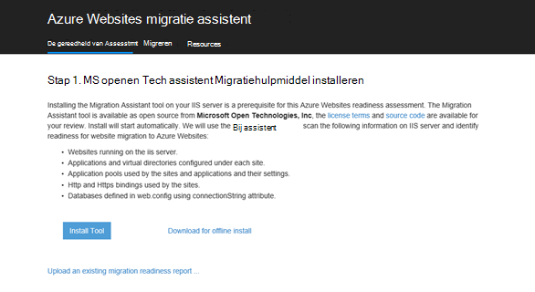

<properties 
    pageTitle="Een web-app voor enterprise migreren naar Azure App-Service" 
    description="Ziet u hoe u snel bestaande IIS-websites migreren naar Azure App Service Web Apps-assistent migratie van Web Apps gebruiken" 
    services="app-service" 
    documentationCenter="" 
    authors="cephalin" 
    writer="cephalin" 
    manager="wpickett" 
    editor=""/>

<tags 
    ms.service="app-service" 
    ms.workload="na" 
    ms.tgt_pltfrm="na" 
    ms.devlang="na" 
    ms.topic="article" 
    ms.date="07/01/2016" 
    ms.author="cephalin"/>

# Een web-app voor enterprise migreren naar Azure App-Service

U kunt eenvoudig uw bestaande websites die worden uitgevoerd op Internet Information Service (IIS) 6 of later tot [App Service Web Apps](http://go.microsoft.com/fwlink/?LinkId=529714)migreren. 

>[AZURE.IMPORTANT] Windows Server 2003 einde van ondersteuning op juli 14 2015 bereikt. Als u momenteel uw websites op een IIS-server host die is Windows Server 2003, Web Apps is een gering risico, lage kosten, en laag wrijving manier om uw online-websites behouden, en -assistent migratie van Web Apps kunt automatiseren van het migratieproces voor u. 

[Web Apps migratie assistent](https://www.movemetothecloud.net/) kan de installatie van uw IIS-server analyseren, welke sites kunnen worden gemigreerd naar App Service, eventuele elementen die niet worden gemigreerd of niet worden ondersteund op het platform markeren en vervolgens uw websites en gekoppelde databases naar Azure migreren identificeren.

[AZURE.INCLUDE [app-service-web-to-api-and-mobile](../../includes/app-service-web-to-api-and-mobile.md)]

## Elementen gecontroleerd tijdens de compatibiliteit analyse ##
De migratie-assistent maakt een rapport gereedheid voor alle mogelijke oorzaken van aandacht of blokkeren problemen die verhinderen een succesvolle migratie van on-premises implementatie IIS tot Azure App Service Web Apps dat kunnen. Een aantal belangrijke items letten zijn:

-   Poort bindingen – Web Apps ondersteunt alleen poort 80 voor HTTP en poort 443 voor HTTPS-verkeer is toegestaan. Andere poortconfiguraties worden genegeerd en verkeer wordt doorgestuurd naar 80 of 443. 
-   Verificatie-Web Apps ondersteunt anonieme verificatie standaard en formulierverificatie aangegeven door een toepassing. Windows-verificatie kan worden gebruikt door te integreren met Azure Active Directory en ADFS alleen. Alle andere vormen van verificatie - bijvoorbeeld basisverificatie - worden momenteel niet ondersteund. 
-   Globale constructie Cache (GAC) – de GAC wordt niet ondersteund in Web-Apps. Als uw toepassing verwijst naar samenstellen die u meestal dashboard naar de GAC implementeren, moet u naar de map toepassingen bin in Web Apps implementeren. 
-   IIS5 De compatibiliteitsmodus – Hiermee wordt niet ondersteund in Web-Apps. 
-   Toepassingen – In Web-Apps, elke site en de onderliggende-toepassingen worden uitgevoerd in dezelfde groep van toepassingen. Als uw site meerdere onderliggende toepassingen gebruik van meerdere groepen van toepassingen heeft, ze aan een enkele groep van toepassingen met algemene instellingen samenvoegen of migreren van elke toepassing naar een afzonderlijk web-app.
-   COM-onderdelen – Web Apps is niet toegestaan voor de registratie van COM-onderdelen op het platform. Als uw websites of toepassingen gebruik van een COM-onderdelen maakt, moet u opschrijven in beheerde code en ze met de website of toepassing implementeren.
-   ISAPI-Filters – Web Apps kan het gebruik van ISAPI-Filters ondersteunen. Moet u als volgt te werk:
    -   de dll-bestanden met uw web-app implementeren 
    -   de dll-bestanden met [Web.config](http://www.iis.net/configreference/system.webserver/isapifilters) registreren
    -   Plaats een applicationHost.xdt-bestand in de hoofdmap van de site met de inhoud hieronder:

            <?xml version="1.0"?>
            <configuration xmlns:xdt="http://schemas.microsoft.com/XML-Document-Transform">
            <configSections>
                <sectionGroup name="system.webServer">
                  <section name="isapiFilters" xdt:Transform="SetAttributes(overrideModeDefault)" overrideModeDefault="Allow" />
                </sectionGroup>
              </configSections>
            </configuration>

        Zie [de website van Microsoft Azure transformeren](http://blogs.msdn.com/b/waws/archive/2014/06/17/transform-your-microsoft-azure-web-site.aspx)voor meer voorbeelden van het gebruik van XML-documenttransformaties met uw website.

-   Andere onderdelen, zoals SharePoint, voorste pagina server extensions (FPSE), FTP, SSL-certificaten worden niet gemigreerd.

## Het gebruik van de migratie-assistent van Web Apps ##
Deze stappen van de sectie tot en met een voorbeeld te migreren van een paar websites die gebruikmaken van een SQL Server-database en uit te voeren op de computer van een on-premises Windows Server 2003 R2 (IIS 6.0):

1.  Ga op de IIS-server of uw computer naar [https://www.movemetothecloud.net/](https://www.movemetothecloud.net/) 

    

2.  Installeer Web Apps-migratie assistent door te klikken op de knop **Specifiek IIS-Server** . Meer opties worden de opties in de nabije toekomst. 
4.  Klik op de knop **Installeren** om te kunnen installeren-assistent migratie van Web Apps op uw computer.

    

    >[AZURE.NOTE] U kunt ook klikken op **downloaden voor offline installeren** als u wilt downloaden van een ZIP-bestand voor de installatie op servers niet verbonden met internet. Of, kunt u **een bestaand rapport van de migratie-gereedheid uploaden**, namelijk geavanceerde optie voor het werken met een bestaande gereedheid migratierapport die u eerder hebt gegenereerd (later uitgelegd).

5.  In het scherm **Toepassing installeert** , klikt u op **installeren** om te installeren op uw computer. Dit wordt ook bijbehorende afhankelijkheden zoals Web implementeren, DacFX en IIS, installeren, indien nodig. 

    

    Zodra u hebt geïnstalleerd, Web Apps-migratie-assistent automatisch wordt gestart.
  
6.  Kies **sites migreren en van een externe server Azure-databases**. De beheerdersreferenties voor de externe server en klik op **Doorgaan**. 

    

    Migreren van de lokale server kunt u natuurlijk kiezen. De externe optie is handig als u wilt migreren van websites van een IIS-productieserver.
 
    Op dit moment het Migratiehulpmiddel uitvoert zullen inspecteren de configuratie van uw IIS-server, zoals Sites, -toepassingen, toepassingen en afhankelijkheden candidate websites voor migratie identificeren. 

8.  De volgende schermafbeelding ziet u drie websites – **Standaardwebsite**, **TimeTracker**en **CommerceNet4**. Alle hebben een gekoppelde database die we wilt migreren. Selecteer alle de sites die u wilt beoordelen en klik op **volgende**.

    
 
9.  Klik op **uploaden** om het rapport gereedheid uploaden. Als u op **bestand lokaal opslaan**, kunt u het migratiehulpprogramma uitvoert later opnieuw uitvoeren en het rapport opgeslagen gereedheid uploaden, zoals hierboven is.

    
 
    Wanneer u het rapport gereedheid uploadt, wordt Azure voert de gereedheid van analyse en geeft u de resultaten. Lees de details assessment voor elke website en zorg ervoor dat u begrijpt of alle problemen hebt opgelost voordat u verdergaat. 
 
    

12. Klik op de **Migratie starten** om de migratie te starten. U wordt nu omgeleid naar Azure aan te melden bij uw account. Het is belangrijk dat u aanmelden met een account met een actieve Azure-abonnement. Als u nog geen een Azure-account kunt klik u zich aanmeldt voor een gratis proefabonnement [hier](https://azure.microsoft.com/pricing/free-trial/?WT.srch=1&WT.mc_ID=SEM_). 

13. Selecteer de tenantaccount, Azure-abonnement en plaats die u wilt gebruiken voor uw gemigreerde Azure WebApps en -databases en klik vervolgens op **Migratie starten**. U kunt de websites migreren later kunt selecteren.

    

14. In het volgende scherm kunt u wijzigingen, zoals aanbrengen in de standaardinstellingen voor migratie:

    - gebruik van een bestaande Azure SQL-Database of een nieuwe Azure SQL-Database maken en configureren van de referenties
    - Selecteer de websites om te migreren
    - namen voor de Azure web-apps en hun gekoppelde SQL-databases definiëren
    - de globale instellingen en het niveau van de site-instellingen aanpassen

    De volgende schermafbeelding ziet u de websites die zijn geselecteerd voor migratie met de standaardinstellingen.

    

    >[AZURE.NOTE] de Azure WebApp het selectievakje **Azure Active Directory inschakelen** in aangepaste instellingen geïntegreerd met [Azure Active Directory](active-directory-whatis.md) (de **Default Directory**). Zie voor meer informatie over synchroniseren Azure Active Directory met uw on-premises Active Directory, [Directory-integratie](http://msdn.microsoft.com/library/jj573653).

16.  Wanneer u de gewenste wijzigingen hebt gemaakt, klikt u op **maken** om de migratieproces te starten. Het Migratiehulpmiddel uitvoert maakt u de Azure SQL-Database en Azure WebApp, en vervolgens publiceren de inhoud van de website en databases. De voortgang van de migratie duidelijk weer te geven in het Migratiehulpmiddel uitvoert en ziet u een samenvatting scherm aan het einde, welke details de sites gemigreerd, ongeacht of ze aangebracht zijn, koppelingen naar de zojuist gemaakte Azure Webapps. 

    Als er een fout optreedt tijdens de migratie, wordt het Migratiehulpmiddel uitvoert duidelijk de fout en terugdraaien de wijzigingen. Ook is mogelijk u kunt het rapport rechtstreeks naar het technische team verzenden door te klikken op de knop **Rapport verzenden** , klikt u met de vastgelegde mislukt call-stack en maken van de hoofdtekst van het bericht. 

    

    Als migreren is geslaagd zonder fouten, u kunt ook klikken op de knop **Geef Feedback** rechtstreeks bieden van feedback. 
 
20. Klik op de koppelingen naar de Azure WebApps en controleer of dat de migratie is voltooid.

21. U kunt nu de gemigreerde web-apps in Azure App-Service beheren. Klik hiertoe Meld u aan bij de [Portal van Azure](https://portal.azure.com).

22. Klik in de Portal Azure opent u het blad Web Apps als u wilt zien van uw gemigreerde websites (weergegeven als WebApps) en klik vervolgens op op een van deze om te beginnen met het beheren van de web-app, zoals het configureren van continue publiceren, maken van back-ups, autoscaling, en controle gebruik of prestaties.

    

>[AZURE.NOTE] Als u aan de slag met Azure App Service wilt voordat u zich registreert voor een Azure-account, gaat u naar de [App-Service probeert](http://go.microsoft.com/fwlink/?LinkId=523751), waar u direct een tijdelijk starter in de browser in de App-Service maken kunt. Geen creditcards vereist; geen verplichtingen.

## Wat er gewijzigd
* Zie voor een handleiding voor het wijzigen van Websites naar App Service: [Azure App-Service en de invloed op bestaande Azure-Services](http://go.microsoft.com/fwlink/?LinkId=529714)
 
