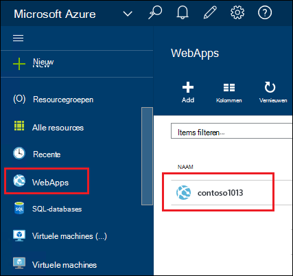
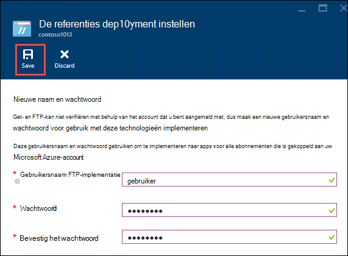
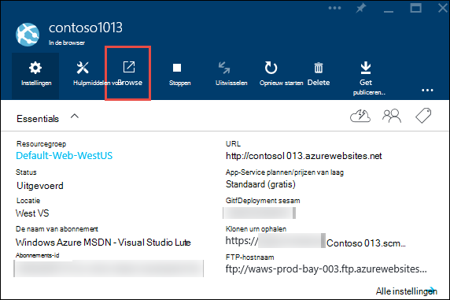
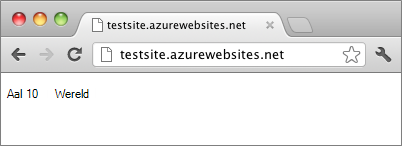

<properties
    pageTitle="Een Node.js web-app maakt in Azure App Service | Microsoft Azure"
    description="Leer hoe u een toepassing Node.js in een WebApp in Azure App Service implementeren."
    services="app-service\web"
    documentationCenter="nodejs"
    authors="rmcmurray"
    manager="wpickett"
    editor=""/>

<tags
    ms.service="app-service-web"
    ms.workload="web"
    ms.tgt_pltfrm="na"
    ms.devlang="nodejs"
    ms.topic="hero-article"
    ms.date="08/11/2016"
    ms.author="robmcm"/>

# Een Node.js web-app maakt in Azure App-Service

> [AZURE.SELECTOR]
- [.NET](web-sites-dotnet-get-started.md)
- [Node.js](web-sites-nodejs-develop-deploy-mac.md)
- [Java](web-sites-java-get-started.md)
- [PHP - cijfer](web-sites-php-mysql-deploy-use-git.md)
- [PHP - FTP](web-sites-php-mysql-deploy-use-ftp.md)
- [Python](web-sites-python-ptvs-django-mysql.md)

Deze zelfstudie leert hoe u een eenvoudige [Node.js](http://nodejs.org) -toepassing maken en het dashboard implementeren naar een [WebApp](app-service-web-overview.md) in [Azure App-Service](../app-service/app-service-value-prop-what-is.md) met behulp van [cijfer](http://git-scm.com). De instructies in deze zelfstudie kunnen op elk besturingssysteem dat Node.js waarop kan worden gevolgd.

U leert:

* Het maken van een web-app in Azure App-Service met behulp van de Azure-Portal.
* Het implementeren van een toepassing Node.js naar de web-app door te drukken naar de web-app cijfer bibliotheek.

De voltooide toepassing schrijft een korte "Hallo wereld" tekenreeks naar de browser.

![Een browser weergeven van het bericht 'Hallo allemaal'.][helloworld-completed]

Voor zelfstudies en code van de steekproef met complexere Node.js toepassingen of andere onderwerpen over het gebruik van Node.js in Azure wordt aangegeven, raadpleegt u het [Node.js Developer Center](/develop/nodejs/).

> [AZURE.NOTE]
> Als u wilt deze zelfstudie hebt voltooid, moet u een Microsoft Azure-account. Als u geen account hebt, kunt u [zich registreren voor een gratis proefversie](/en-us/pricing/free-trial/?WT.mc_id=A261C142F)of [activeren van de voordelen van uw Visual Studio-abonnee](/en-us/pricing/member-offers/msdn-benefits-details/?WT.mc_id=A261C142F) .
>
> Als u aan de slag met Azure App Service wilt voordat u zich aanmeldt voor een Azure-account, gaat u naar [De App-Service probeert](http://go.microsoft.com/fwlink/?LinkId=523751). Er, u direct een tijdelijk starter in de browser kunt maken in de App Service, geen creditcard vereist en geen afspraken.

## Een web-app maken en inschakelen van cijfer publiceren

Volg deze stappen om een WebApp maakt in Azure App-Service en cijfer publicatie inschakelen. 

[Cijfer](http://git-scm.com/) is een systeem voor het beheer van gedistribueerde versie die u gebruiken kunt om te implementeren van uw Website Azure. U kunt de code die u voor uw web-app in een lokale cijfer opslagplaats schrijft wilt opslaan en u kunt uw code implementeren naar Azure door te drukken naar een externe bibliotheek. Deze methode van implementatie is een functie van App Service Webapps.  

1. Meld u aan bij de [Portal van Azure](https://portal.azure.com).

2. Klik op het pictogram **+ Nieuw** op de voorgrond links van de Azure-Portal.

3. Klik op **Web + Mobile**en klik vervolgens op **WebApp**.

    ![][portal-quick-create]

4. Voer een naam voor de web-app in het vak **WebApp** .

    Deze naam moet uniek zijn in het domein azurewebsites.net omdat de URL van de web-app {naam}. azurewebsites.net. Als de naam die u invoert niet uniek, is een rood uitroepteken wordt weergegeven in het tekstvak.

5. Selecteer een **abonnement**.

6. Selecteer een **Resourcegroep** of maak een nieuwe record.

    Zie [overzicht van de Azure resourcemanager](../azure-resource-manager/resource-group-overview.md)voor meer informatie over resourcegroepen.

7. Selecteer een **App Service abonnement/locatie** of maak een nieuwe record.

    Zie [overzicht van de Azure App-Service plannen](../azure-web-sites-web-hosting-plans-in-depth-overview.md) voor meer informatie over de App-Service-abonnementen,

8. Klik op **maken**.
   
    ![][portal-quick-create2]

    In een korte tijdnotatie, meestal minder dan ongeveer een minuut eindigt Azure maken van de nieuwe web-app.

9. Klik op **Web apps > {uw nieuwe WebApp}**.

    

10. Klik in het blad **in de browser** op het deel achter de **implementatie** .

    ![][deployment-part]

11. Klik in het blad **Continue implementatie** op **Bron kiezen**

12. **Lokale cijfer opslagplaats**op en klik vervolgens op **OK**.

    ![][setup-git-publishing]

13. Implementatie referenties instellen als u dat nog niet had gedaan.

    een. Klik in het blad Web-app op **Instellingen > implementatie referenties**.

    ![][deployment-credentials]
 
    b. Maak een gebruikersnaam en wachtwoord. 
    
    

14. Klik in het blad Web-app op **Instellingen**en klik vervolgens op **Eigenschappen**.
 
    Als u wilt publiceren, gaat u naar de bibliotheek van een externe cijfer push. De URL voor de bibliotheek wordt vermeld onder de **URL van een cijfer**. Verderop in deze zelfstudie gebruikt u deze URL.

    ![][git-url]

## Bouwen en testen van de toepassing lokaal

In dit gedeelte maakt u een bestand **server.js** met een iets gewijzigd versie van het voorbeeld 'Hallo allemaal' uit [nodejs.org]. De code wordt process.env.PORT als de poort voor luisteren wanneer u zich in een Azure WebApp toegevoegd.

1. Maak een map met de naam *Hallo wereld*.

2. Gebruik een teksteditor een nieuw bestand met de naam **server.js** in de adreslijst *Hallo wereld* te maken.

2. Kopieer de volgende code naar het bestand **server.js** en sla het bestand:

        var http = require('http')
        var port = process.env.PORT || 1337;
        http.createServer(function(req, res) {
          res.writeHead(200, { 'Content-Type': 'text/plain' });
          res.end('Hello World\n');
        }).listen(port);

3. Open de opdrachtregel en het gebruik van de volgende opdracht lokaal de WebApp te starten.

        node server.js

4. Open de webbrowser en navigeer naar http://localhost:1337. 

    Een webpagina die wordt weergegeven 'Hallo wereld' wordt weergegeven, zoals wordt weergegeven in de volgende schermafbeelding.

    ![Een browser weergeven van het bericht 'Hallo allemaal'.][helloworld-localhost]

## Uw toepassing publiceren

1. Installeer cijfer als u dat nog niet had gedaan.

    Zie het [cijfer downloadpagina](http://git-scm.com/download)voor de installatie-instructies voor uw platform.

1. Vanaf de opdrachtregel mappen naar de map **Hallo wereld** wijzigen en voer de volgende opdracht uit een lokale cijfer opslagplaats geïnitialiseerd.

        git init

2. De volgende opdrachten gebruiken om het toevoegen van bestanden naar de bibliotheek:

        git add .
        git commit -m "initial commit"

3. Een externe voor zet nieuwe updates naar de web-app die u eerder hebt gemaakt met behulp van de volgende opdracht cijfer toevoegen:

        git remote add azure [URL for remote repository]

4. Uw wijzigingen aan Azure push met behulp van de volgende opdracht uit:

        git push azure master

    U wordt gevraagd om het wachtwoord dat u eerder hebt gemaakt. De uitvoer is vergelijkbaar met het volgende voorbeeld.

        Counting objects: 3, done.
        Delta compression using up to 8 threads.
        Compressing objects: 100% (2/2), done.
        Writing objects: 100% (3/3), 374 bytes, done.
        Total 3 (delta 0), reused 0 (delta 0)
        remote: New deployment received.
        remote: Updating branch 'master'.
        remote: Preparing deployment for commit id '5ebbe250c9'.
        remote: Preparing files for deployment.
        remote: Deploying Web.config to enable Node.js activation.
        remote: Deployment successful.
        To https://user@testsite.scm.azurewebsites.net/testsite.git
         * [new branch]      master -> master

5. Als u wilt uw app weergeven, klikt u op de knop **Bladeren** op het **Web App** -onderdeel in de portal van Azure.

    

    

## Wijzigingen in uw toepassing publiceren

1. Open het bestand **server.js** in een teksteditor en wijzigen van 'Hallo World\n' naar 'Hallo Azure\n'. 

2. Sla het bestand.

2. Vanaf de opdrachtregel mappen naar de map **Hallo wereld** en voer de volgende opdrachten:

        git add .
        git commit -m "changing to hello azure"
        git push azure master

    U gevraagd om uw wachtwoord opnieuw.

3. Vernieuw het browservenster die u naar de web-app-URL gegaan.

    ![Een pagina met webonderdelen weergeven 'Hallo Azure'][helloworld-completed]

## Een implementatie terugdraaien

U kunt vanuit het blad **in de browser** op **Instellingen > continue implementatie** om de geschiedenis implementatie in het blad **implementaties** weer te geven. Als u terugkeren naar een eerdere implementatie wilt, kunt u selecteert u deze en klik op **Implementeer deze opnieuw** in het blad **Implementatie Details** .

## Volgende stappen

U kunt een toepassing Node.js in een WebApp in Azure App Service hebt geïmplementeerd. Zie voor meer informatie over hoe de Node.js toepassingen voor het uitvoeren van App Service-WebApps [Azure App Service Web Apps: Node.js](http://blogs.msdn.com/b/silverlining/archive/2012/06/14/windows-azure-websites-node-js.aspx) en [een versie Node.js in een Azure-toepassing op te geven](../nodejs-specify-node-version-azure-apps.md).

Node.js biedt een uitgebreide selectie aan modules die kunnen worden gebruikt door uw toepassingen. Meer informatie over de werking van Web Apps met modules, raadpleegt u [Gebruik Node.js modules met Azure-toepassingen](../nodejs-use-node-modules-azure-apps.md).

Als u problemen met uw toepassing ondervindt nadat deze is geïmplementeerd in Azure, raadpleegt u [hoe u fouten opsporen in een toepassing Node.js in Azure App-Service](web-sites-nodejs-debug.md) voor meer informatie over het oplossen van het probleem.

In dit artikel worden de Portal Azure gebruikt om een WebApp te maken. U kunt ook de [Azure-opdrachtregel](../xplat-cli-install.md) of [Azure PowerShell](../powershell-install-configure.md) gebruiken om uit te voeren bewerkingen uitvoeren.

Zie voor meer informatie over het ontwikkelen van toepassingen Node.js op Azure [Node.js Developer Center](/develop/nodejs/).

[helloworld-completed]: ./media/web-sites-nodejs-develop-deploy-mac/helloazure.png
[helloworld-localhost]: ./media/web-sites-nodejs-develop-deploy-mac/helloworldlocal.png
[portal-quick-create]: ./media/web-sites-nodejs-develop-deploy-mac/create-quick-website.png
[portal-quick-create2]: ./media/web-sites-nodejs-develop-deploy-mac/create-quick-website2.png
[setup-git-publishing]: ./media/web-sites-nodejs-develop-deploy-mac/setup_git_publishing.png
[go-to-dashboard]: ./media/web-sites-nodejs-develop-deploy-mac/go_to_dashboard.png
[deployment-part]: ./media/web-sites-nodejs-develop-deploy-mac/deployment-part.png
[deployment-credentials]: ./media/web-sites-nodejs-develop-deploy-mac/deployment-credentials.png
[git-url]: ./media/web-sites-nodejs-develop-deploy-mac/git-url.png
