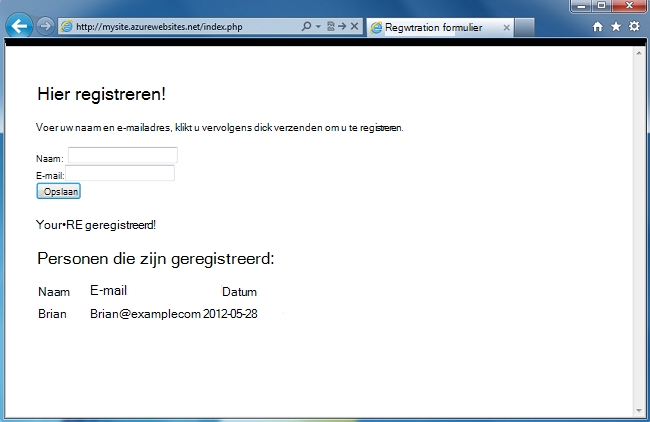
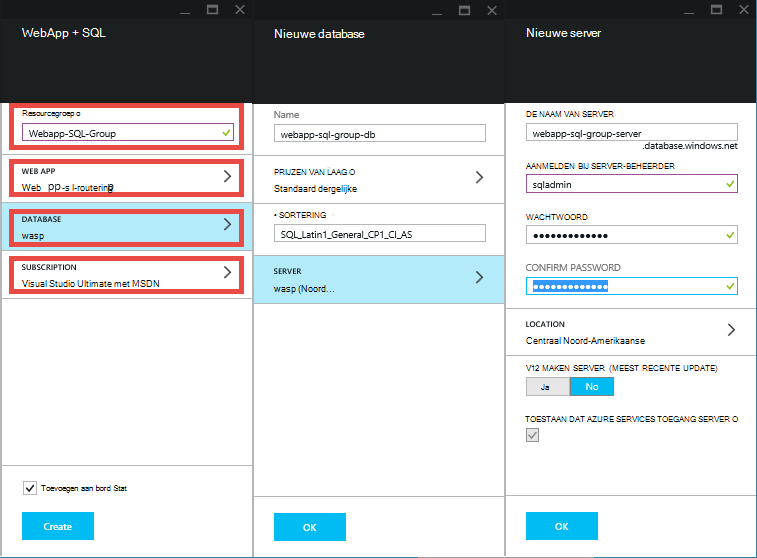
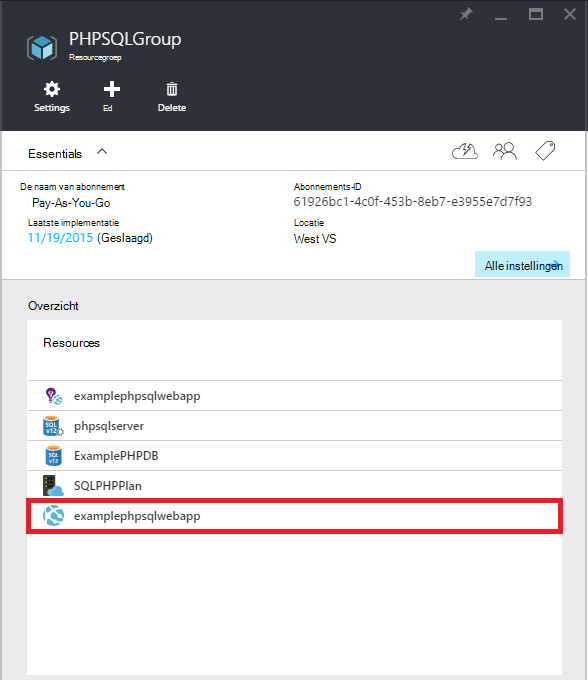
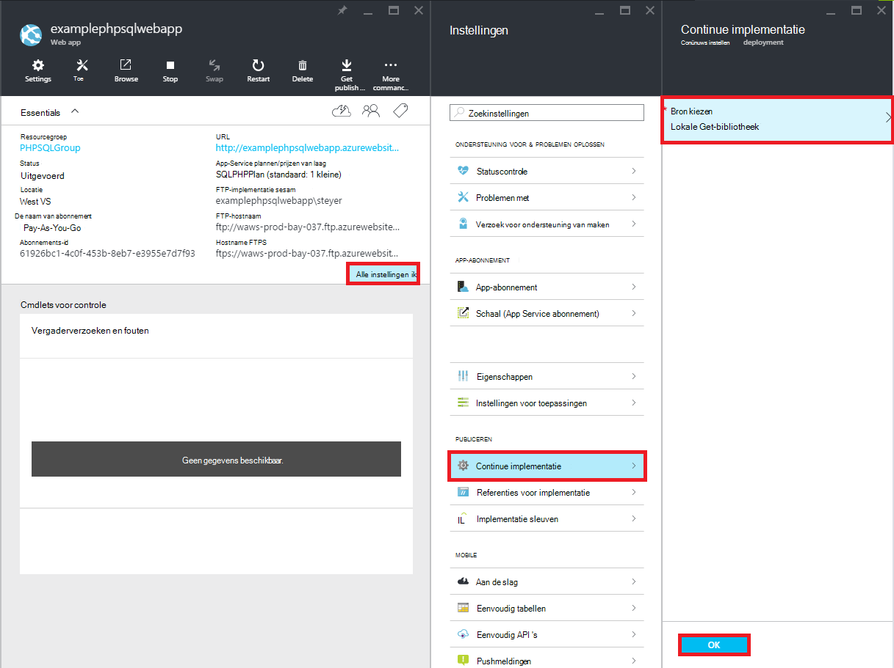
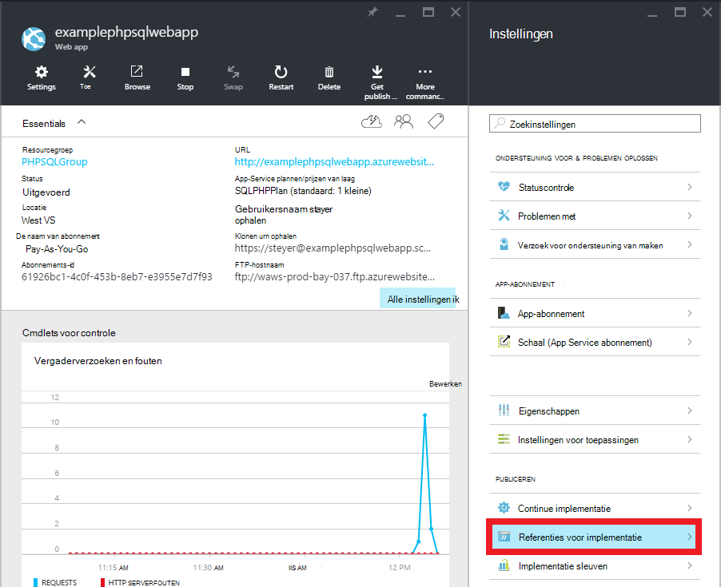
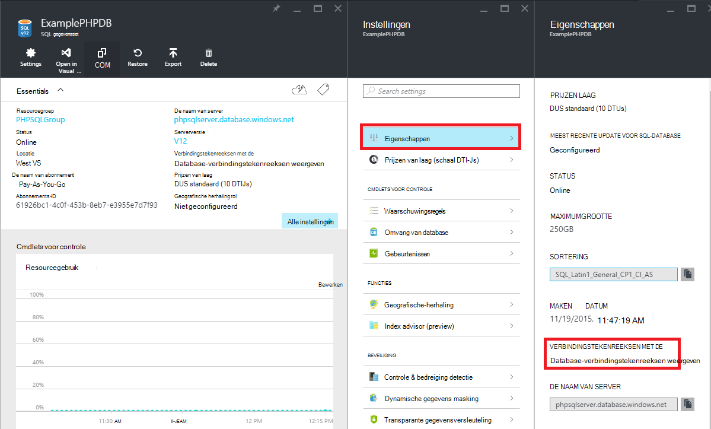

<properties 
    pageTitle="Een PHP-SQL-web-app maken en implementeren naar Azure App-Service met cijfer" 
    description="Een zelfstudie die laat zien hoe een PHP web-app waarin de gegevens in Azure SQL-Database maken en gebruiken van cijfer implementatie naar Azure App-Service." 
    services="app-service\web, sql-database" 
    documentationCenter="php" 
    authors="rmcmurray" 
    manager="wpickett" 
    editor=""/>

<tags 
    ms.service="app-service-web" 
    ms.workload="web" 
    ms.tgt_pltfrm="na" 
    ms.devlang="PHP" 
    ms.topic="article" 
    ms.date="08/11/2016" 
    ms.author="robmcm"/>

# Een PHP-SQL-web-app maken en implementeren naar Azure App-Service met cijfer

Deze zelfstudie ziet u hoe u een PHP web-app maakt in [Azure App Service](http://go.microsoft.com/fwlink/?LinkId=529714) die is verbonden met Azure SQL-Database en hoe u het cijfer met Dashboard implementeren. Deze zelfstudie wordt ervan uitgegaan dat u hebt [PHP][install-php], [SQL Server Express][install-SQLExpress], de [Microsoft-stuurprogramma's voor SQL Server voor PHP](http://www.microsoft.com/download/en/details.aspx?id=20098)en [cijfer] [ install-git] op uw computer is geïnstalleerd. Na het voltooien van deze handleiding, hebt u een PHP-SQL-web-app uitvoeren in Azure wordt aangegeven.

> [AZURE.NOTE]
> U kunt installeren en configureren van PHP, SQL Server Express en de Microsoft-Drivers voor SQL Server voor PHP met het [Installatieprogramma van Microsoft Web Platform](http://www.microsoft.com/web/downloads/platform.aspx).

U leert:

* Het maken van een Azure web-app en een SQL-Database met behulp van de [Azure-Portal](http://go.microsoft.com/fwlink/?LinkId=529715). Omdat PHP is standaard ingeschakeld in Web-Apps voor App-Service, verplicht niets speciale uw PHP-code uit te voeren.
* Het publiceren en uw toepassing Azure met cijfer opnieuw publiceren.
 
Door deze zelfstudie te volgen, wordt u een eenvoudige registratie-webtoepassing in PHP maken. De toepassing wordt worden gehost op een Azure-Website. Schermafbeelding van de voltooide toepassing is hieronder:

[AZURE.INCLUDE [create-account-and-websites-note](../../includes/create-account-and-websites-note.md)]

>[AZURE.NOTE] Als u aan de slag met Azure App Service wilt voordat u zich registreert voor een Azure-account, gaat u naar de [App-Service probeert](http://go.microsoft.com/fwlink/?LinkId=523751), waar u direct een tijdelijk starter in de browser in de App-Service maken kunt. Geen creditcards vereist; geen verplichtingen.

##Een Azure WebApp maken en publiceren op cijfer instellen

Volg deze stappen om een Azure web-app en een SQL-Database maken:

1. Meld u aan bij de [Portal van Azure](https://portal.azure.com/).

2. Openen de Azure Marketplace door te klikken op het pictogram **Nieuw** op de voorgrond links van het dashboard, klik op **Alles selecteren** naast Marketplace en **Web + Mobile**te selecteren.
    
3. Selecteer in de Marketplace, **Web + Mobile**.

4. Klik op het pictogram **in de browser + SQL** .

5. Lees de beschrijving van de WebApp + SQL-app en selecteer **maken**.

6. Klik op elk deel (**Resourcegroep** **Web App**, **Database**en **abonnement**) en typ of Selecteer waarden voor de vereiste velden:
    
    - Voer een URL-naam van uw keuze   
    - Referenties voor de database configureren
    - Selecteer het dichtst bij u gebied

    

7. Wanneer u klaar bent met het definiëren van de web-app, klikt u op **maken**.

    Wanneer de web-app is gemaakt, wordt de knop **meldingen** flash een groene **SUCCESS** en het blad geopend groep van resource om weer te geven van de WebApp en de SQL-database in de groep.

4. Klik op de web-app-pictogram in het blad resource groep naar de web-app blade openen.

    

5. Klik in **Instellingen** op **doorlopend implementatie** > **configureren instellingen vereist**. **Lokale cijfer opslagplaats** en klik op **OK**.

    

    Als u niet een cijfer opslagplaats voordat u hebt ingesteld, moet u een gebruikersnaam en wachtwoord opgeven. Klik op **Instellingen**hiervoor > **implementatie referenties** in de web-app blade.

    

6. Klik in **Instellingen** op **Eigenschappen** om de cijfer externe URL die u wilt gebruiken om te implementeren van uw app PHP later weer te geven.

##Informatie voor SQL-Database-verbinding

Verbinding maken met de SQL-Database-exemplaar dat is gekoppeld aan uw web-app, uw is de verbindingsgegevens, die u hebt opgegeven tijdens het maken van de database nodig. Als u de verbindingsgegevens SQL-Database, als volgt te werk:

1. Terug in de resourcegroep blade, klikt u op het pictogram van de SQL-database.

2. Klik op **Instellingen**in de SQL-database blade, > **Eigenschappen**, klikt u op **database-verbindingstekenreeksen weergeven**. 

    
    
3. In de sectie **PHP** van het dialoogvenster wordt geopend en noteer de waarden voor `Server`, `SQL Database`, en `User Name`. U kunt deze waarden later worden gebruikt wanneer uw web-app PHP publiceren naar Azure App-Service.

##Bouwen en testen van de toepassing lokaal

De aanvraag is een eenvoudige PHP-toepassing waarmee u te registreren voor een gebeurtenis doordat uw naam en e-mailadres. Informatie over het vorige geregistreerde wordt weergegeven in een tabel. Registratiegegevens wordt opgeslagen in een exemplaar van de SQL-Database. De toepassing bestaat uit twee bestanden (kopiëren en plakken code beschikbaar onder):

* **index.php**: een formulier voor registratie en een tabel met registrant informatie wordt weergegeven.
* **CreateTable.php**: Hiermee maakt u de tabel met de SQL-Database voor de toepassing. Dit bestand wordt slechts eenmaal worden gebruikt.

Als u wilt de toepassing lokaal uitvoert, de onderstaande stappen uit te voeren. Houd er rekening mee dat deze stappen wordt ervan uitgegaan dat u hebt PHP en SQL Server Express instellen op uw lokale computer en dat u hebt ingesteld dat de [Bob-extensie voor SQL Server][pdo-sqlsrv].

1. Maken van een SQL Server-database genoemd `registration`. U kunt dit doen vanuit de `sqlcmd` opdrachtprompt met de volgende opdrachten:

        >sqlcmd -S localhost\sqlexpress -U <local user name> -P <local password>
        1> create database registration
        2> GO   

2. In de hoofdmap van de toepassing, maakt u twee bestanden in deze - een genoemd `createtable.php` en een genoemd `index.php`.

3. Open de `createtable.php` bestand in een teksteditor of IDE en de onderstaande code hebt toegevoegd. Deze code wordt gebruikt om te maken de `registration_tbl` van een tabel de `registration` database.

        <?php
        // DB connection info
        $host = "localhost\sqlexpress";
        $user = "user name";
        $pwd = "password";
        $db = "registration";
        try{
            $conn = new PDO( "sqlsrv:Server= $host ; Database = $db ", $user, $pwd);
            $conn->setAttribute( PDO::ATTR_ERRMODE, PDO::ERRMODE_EXCEPTION );
            $sql = "CREATE TABLE registration_tbl(
            id INT NOT NULL IDENTITY(1,1) 
            PRIMARY KEY(id),
            name VARCHAR(30),
            email VARCHAR(30),
            date DATE)";
            $conn->query($sql);
        }
        catch(Exception $e){
            die(print_r($e));
        }
        echo "<h3>Table created.</h3>";
        ?>

    Houd er rekening mee dat u moeten bijwerken van de waarden voor <code>$user</code> en <code>$pwd</code> met uw lokale SQL Server-gebruikersnaam en wachtwoord.

4. Typ de volgende opdracht in een terminal in de hoofdmap van de toepassing:

        php -S localhost:8000

4. Open een webbrowser en bladert u naar **http://localhost:8000/createtable.php**. Hiermee maakt u de `registration_tbl` tabel in de database.

5. Open het bestand **index.php** in een teksteditor of IDE en de eenvoudige HTML en CSS-code voor de pagina (de code PHP worden toegevoegd in de volgende stappen) hebt toegevoegd.

        <html>
        <head>
        <Title>Registration Form</Title>
        
        </head>
        <body>
        <h1>Register here!</h1>
        
Fill in your name and email address, then click <strong>Submit</strong> to register.

        <form method="post" action="index.php" enctype="multipart/form-data" >
              Name  <input type="text" name="name" id="name"/> 
              Email <input type="text" name="email" id="email"/> 
              <input type="submit" name="submit" value="Submit" />
        </form>
        <?php

        ?>
        </body>
        </html>

6. Voeg binnen de tags PHP, PHP code om verbinding te maken met de database.

        // DB connection info
        $host = "localhost\sqlexpress";
        $user = "user name";
        $pwd = "password";
        $db = "registration";
        // Connect to database.
        try {
            $conn = new PDO( "sqlsrv:Server= $host ; Database = $db ", $user, $pwd);
            $conn->setAttribute( PDO::ATTR_ERRMODE, PDO::ERRMODE_EXCEPTION );
        }
        catch(Exception $e){
            die(var_dump($e));
        }

    Nogmaals, moet u de waarden voor bijwerken <code>$user</code> en <code>$pwd</code> met uw lokale MySQL-gebruikersnaam en wachtwoord.

7. Na de code van de database-verbinding, moet u code voor het invoegen van registratiegegevens in de database toevoegen.

        if(!empty($_POST)) {
        try {
            $name = $_POST['name'];
            $email = $_POST['email'];
            $date = date("Y-m-d");
            // Insert data
            $sql_insert = "INSERT INTO registration_tbl (name, email, date) 
                           VALUES (?,?,?)";
            $stmt = $conn->prepare($sql_insert);
            $stmt->bindValue(1, $name);
            $stmt->bindValue(2, $email);
            $stmt->bindValue(3, $date);
            $stmt->execute();
        }
        catch(Exception $e) {
            die(var_dump($e));
        }
        echo "<h3>Your're registered!</h3>";
        }

8. Tot slot na de bovenstaande code code voor het ophalen van gegevens uit de database toevoegen.

        $sql_select = "SELECT * FROM registration_tbl";
        $stmt = $conn->query($sql_select);
        $registrants = $stmt->fetchAll(); 
        if(count($registrants) > 0) {
            echo "<h2>People who are registered:</h2>";
            echo "<table>";
            echo "<tr><th>Name</th>";
            echo "<th>Email</th>";
            echo "<th>Date</th></tr>";
            foreach($registrants as $registrant) {
                echo "<tr><td>".$registrant['name']."</td>";
                echo "<td>".$registrant['email']."</td>";
                echo "<td>".$registrant['date']."</td></tr>";
            }
            echo "</table>";
        } else {
            echo "<h3>No one is currently registered.</h3>";
        }

U kunt nu Blader naar **http://localhost:8000/index.php** om de toepassing te testen.

##Uw toepassing publiceren

Nadat u uw toepassing lokaal getest hebt, kunt u deze naar de Web-Apps voor App-Service is met behulp van cijfer publiceren. Echter, moet u eerst de informatie over de databaseverbinding in de toepassing bijwerken. Met de informatie over de databaseverbinding u verkregen eerder (in de sectie **informatie over de databaseverbinding krijgen van de SQL-Database** ) de volgende informatie bijwerkt in **zowel** de `createdatabase.php` en `index.php` bestanden met de juiste waarden:

    // DB connection info
    $host = "tcp:<value of Server>";
    $user = "<value of User Name>";
    $pwd = "<your password>";
    $db = "<value of SQL Database>";

> [AZURE.NOTE]
> In de <code>$host</code>, de waarde van de Server moet worden voorafgegaan door <code>tcp:</code>.

U bent nu klaar instellen cijfer publiceren en publiceren van de toepassing.

> [AZURE.NOTE]
> Hierna ziet u dezelfde stappen aan het einde van de sectie **een Azure WebApp maken en publiceren op cijfer instellen** hierboven hebt genoteerd.

1. Open GitBash (of een terminal als cijfer is in uw `PATH`), mappen wijzigen in de hoofdmap van uw toepassing (de **registratie** -map) en voer de volgende opdrachten:

        git init
        git add .
        git commit -m "initial commit"
        git remote add azure [URL for remote repository]
        git push azure master

    U wordt gevraagd het wachtwoord dat u eerder hebt gemaakt.

2. Blader naar **http://[web app name].azurewebsites.net/createtable.php** maken van de tabel met de SQL-database voor de toepassing.
3. Blader naar **http://[web app name].azurewebsites.net/index.php** moet beginnen met de webtoepassing.

Nadat u uw toepassing hebt gepubliceerd, kunt u wijzigingen aanbrengt in deze begint en gebruikt cijfer publiceren. 

##Wijzigingen in uw toepassing publiceren

Als u wijzigingen wilt toepassing publiceren, als volgt te werk:

1. Breng wijzigingen aan uw toepassing lokaal.
2. Open GitBash (of een terminal it cijfer is in uw `PATH`), mappen naar de hoofdmap van de toepassing wijzigen en voer de volgende opdrachten:

        git add .
        git commit -m "comment describing changes"
        git push azure master

    U wordt gevraagd het wachtwoord dat u eerder hebt gemaakt.

3. Blader naar **http://[web app name].azurewebsites.net/index.php** om uw wijzigingen te bekijken.

## Wat er gewijzigd
* Zie voor een handleiding voor het wijzigen van Websites naar App Service: [Azure App-Service en de invloed op bestaande Azure-Services](http://go.microsoft.com/fwlink/?LinkId=529714)

[install-php]: http://www.php.net/manual/en/install.php
[install-SQLExpress]: http://www.microsoft.com/download/details.aspx?id=29062
[install-Drivers]: http://www.microsoft.com/download/details.aspx?id=20098
[install-git]: http://git-scm.com/
[pdo-sqlsrv]: http://php.net/pdo_sqlsrv
 
