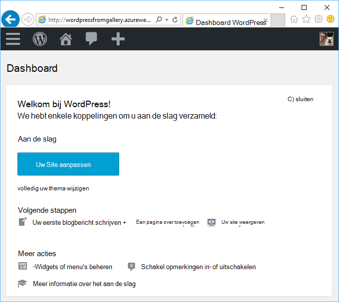
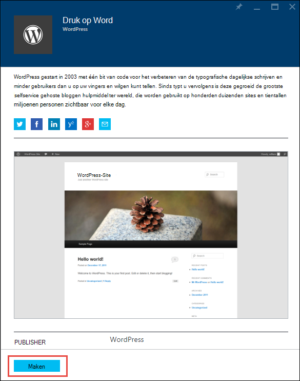
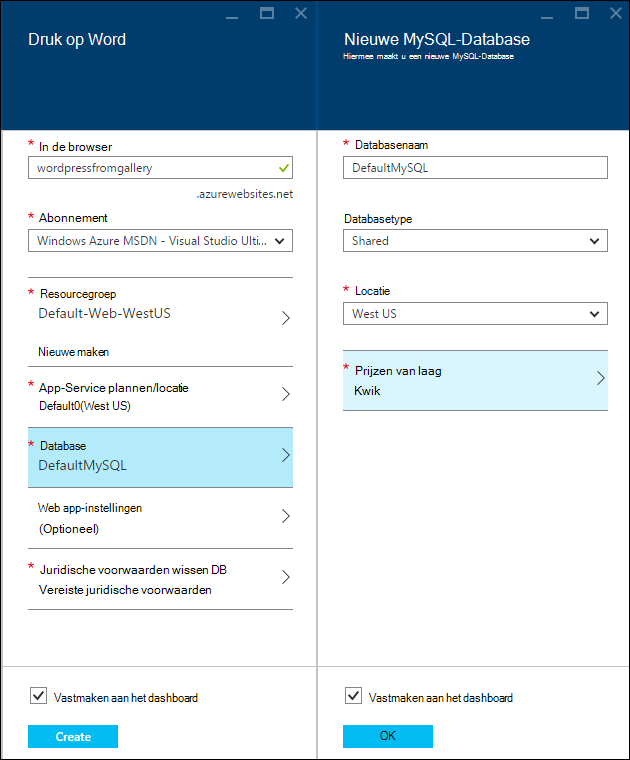
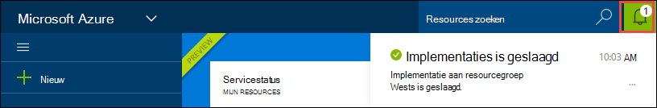
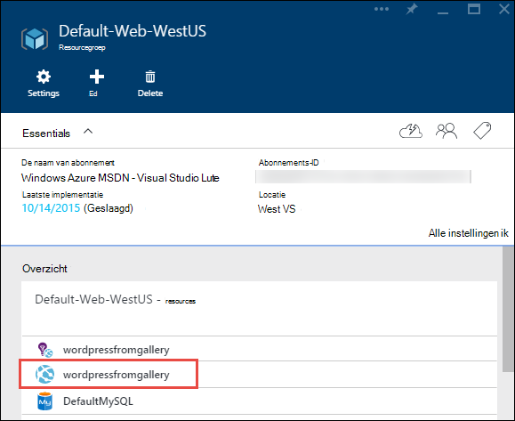
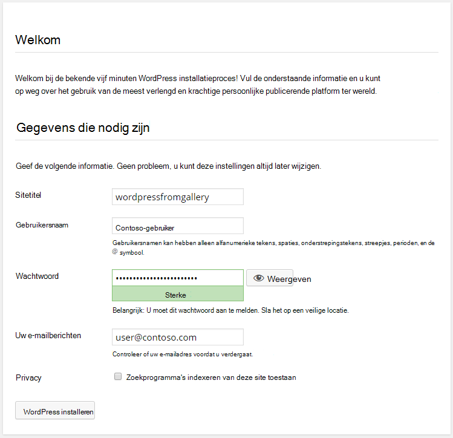

<properties
    pageTitle="Een WordPress web-app maakt in Azure App Service | Microsoft Azure"
    description="Informatie over het maken van een nieuwe Azure WebApp voor een WordPress-blog met behulp van de Azure-Portal."
    services="app-service\web"
    documentationCenter="php"
    authors="rmcmurray"
    manager="wpickett"
    editor=""/>

<tags
    ms.service="app-service-web"
    ms.workload="na"
    ms.tgt_pltfrm="na"
    ms.devlang="PHP"
    ms.topic="hero-article"
    ms.date="08/11/2016"
    ms.author="robmcm"/>

# Een WordPress web-app maakt in Azure App-Service

[AZURE.INCLUDE [tabs](../../includes/app-service-web-get-started-nav-tabs.md)]

Deze zelfstudie leert hoe u het implementeren van een blogsite WordPress van Azure Marketplace.

Wanneer u klaar bent met de zelfstudie hebt u uw eigen blogsite WordPress omhoog en worden uitgevoerd in de cloud.

U leert:

* Klik hier voor meer informatie over het vinden van een sjabloon in de Azure Marketplace.
* Het maken van een WebApp in Azure App Service die is gebaseerd op de sjabloon.
* Klik hier voor meer informatie over het configureren van Azure App Service-instellingen voor de nieuwe web-app en de database.

De Azure Marketplace beschikbaar een breed scala van populaire web-apps die zijn ontwikkeld door Microsoft en derden bedrijven bron openen software initiatieven. De WebApps zijn gebaseerd op een breed scala van populaire kaders, zoals [PHP](/develop/nodejs/) in deze WordPress voorbeeld, [.NET](/develop/net/) [Node.js](/develop/nodejs/), [Java](/develop/java/)en [Python](/develop/python/), om een paar te noemen. Is de browser die u voor de [Azure-Portal gebruikt](https://portal.azure.com/)als u wilt maken van een web-app van Azure Marketplace de enige software die u nodig hebt. 

De WordPress-site die u in deze zelfstudie implementeert MySQL voor de database wordt gebruikt. Als u gebruiken in plaats daarvan SQL-Database voor de database wilt, raadpleegt u [Project Nami](http://projectnami.org/). **Project-Nami** is ook beschikbaar via de Marketplace.

> [AZURE.NOTE]
> Als u wilt deze zelfstudie hebt voltooid, moet u een Microsoft Azure-account. Als u geen account hebt, kunt u [zich registreren voor een gratis proefversie](/en-us/pricing/free-trial/?WT.mc_id=A261C142F)of [activeren van de voordelen van uw Visual Studio-abonnee](/pricing/member-offers/msdn-benefits-details/?WT.mc_id=A261C142F) .
>
> Als u aan de slag met Azure App Service wilt voordat u zich aanmeldt voor een Azure-account, gaat u naar [De App-Service probeert](http://go.microsoft.com/fwlink/?LinkId=523751). Er, u direct een tijdelijk starter in de browser kunt maken in de App Service, geen creditcard vereist en geen afspraken.

## Selecteer WordPress en configureren voor Azure App-Service

1. Meld u aan bij de [Portal van Azure](https://portal.azure.com/).

2. Klik op **Nieuw**.
    
    ![Nieuwe maken][5]
    
3. Zoeken naar **WordPress**en klik vervolgens op **WordPress**. Als u SQL-Database gebruiken in plaats van MySQL wilt, zoekt u **Project Nami**.

    ![WordPress in lijst][7]
    
5. Lees de beschrijving van de app WordPress en klikt u op **maken**.

    

4. Voer een naam voor de web-app in het vak **WebApp** .

    Deze naam moet uniek zijn in het domein azurewebsites.net omdat de URL van de web-app {naam}. azurewebsites.net. Als de naam die u invoert niet uniek, is een rood uitroepteken wordt weergegeven in het tekstvak.

8. Als u meer dan één abonnement hebt, kiest u de sectie die u wilt gebruiken. 

5. Selecteer een **Resourcegroep** of maak een nieuwe record.

    Zie [overzicht van de Azure resourcemanager](../azure-resource-manager/resource-group-overview.md)voor meer informatie over resourcegroepen.

5. Selecteer een **App Service abonnement/locatie** of maak een nieuwe record.

    Zie [overzicht van de Azure App-Service plannen](../azure-web-sites-web-hosting-plans-in-depth-overview.md) voor meer informatie over de App-Service-abonnementen, 

7. Klik op **Database**en geef in het blad **Nieuwe MySQL-Database** de vereiste waarden voor het configureren van uw MySQL-database.

    een. Voer een nieuwe naam of de standaardnaam verlaten.

    b. Laat het **Type Database** die is ingesteld op **gedeeld**.

    c. Kies op dezelfde locatie als een door die u voor de web-app gekozen.

    d. Kies een prijzen laag. Kwik (gratis met minimale toegestane verbindingen en schijfruimte) is voor deze zelfstudie in orde.

8. Klik op **OK**in het blad **Nieuwe MySQL-Database** . 

8. Klik in het blad **WordPress** akkoord met de juridische voorwaarden en klik vervolgens op **maken**. 

    

    Azure App-Service Hiermee maakt u de web-app, meestal in een handomdraai. U kunt de voortgang bekijken door te klikken op het belpictogram boven aan de pagina in de portal.

    

## Starten en beheren van uw WordPress web-app
    
7. Als het maken van web app is voltooid, gaat u in de Portal Azure aan de resourcegroep waarin u de toepassing hebt gemaakt en ziet u de web-app en de database.

    De extra resource met het pictogram gloeilamp is [Toepassing inzichten](/services/application-insights/), waarmee controleren services voor uw web-app.

1. Klik op het web app-lijn in het blad **resourcegroep** .

    

2. Klik in het blad Web app, klikt u op **Bladeren**.

    ![site-URL][browse]

3. Voer de configuratiegegevens is vereist door WordPress WordPress **Welkom** op de pagina en klik op **WordPress installeren**.

    

4. Meld u aan met de referenties die u hebt gemaakt op **de welkomstpagina** .  

5. Uw site Dashboard-pagina wordt geopend.    

    

## Volgende stappen

Bovendien hebt u geleerd hoe maken en implementeren van een PHP-web-app in de galerie. Zie het [PHP Developer Center](/develop/php/)voor meer informatie over het gebruik van PHP in Azure wordt aangegeven.

Zie de koppelingen voor meer informatie over het werken met App-Service Web Apps, aan de linkerkant van de pagina (voor windows breed browser) of boven aan de pagina (voor windows smalle browser). 

## Wat er gewijzigd
* Zie voor een handleiding voor het wijzigen van Websites naar App-Service, [Azure App-Service en de gevolgen voor bestaande Azure-Services](http://go.microsoft.com/fwlink/?LinkId=529714).

[5]: ./media/web-sites-php-web-site-gallery/startmarketplace.png
[7]: ./media/web-sites-php-web-site-gallery/search-web-app.png
[browse]: ./media/web-sites-php-web-site-gallery/browse-web.png
