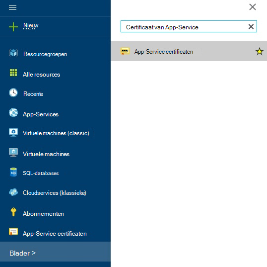
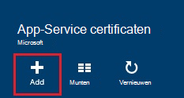
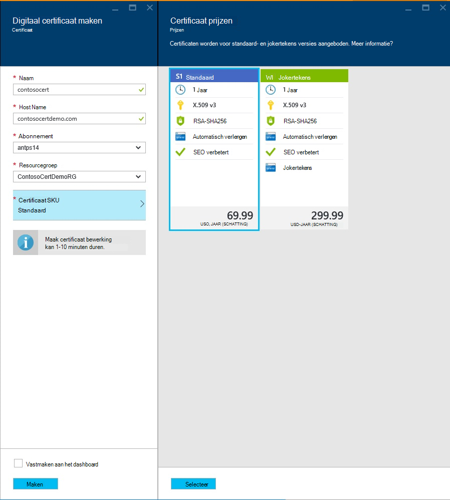
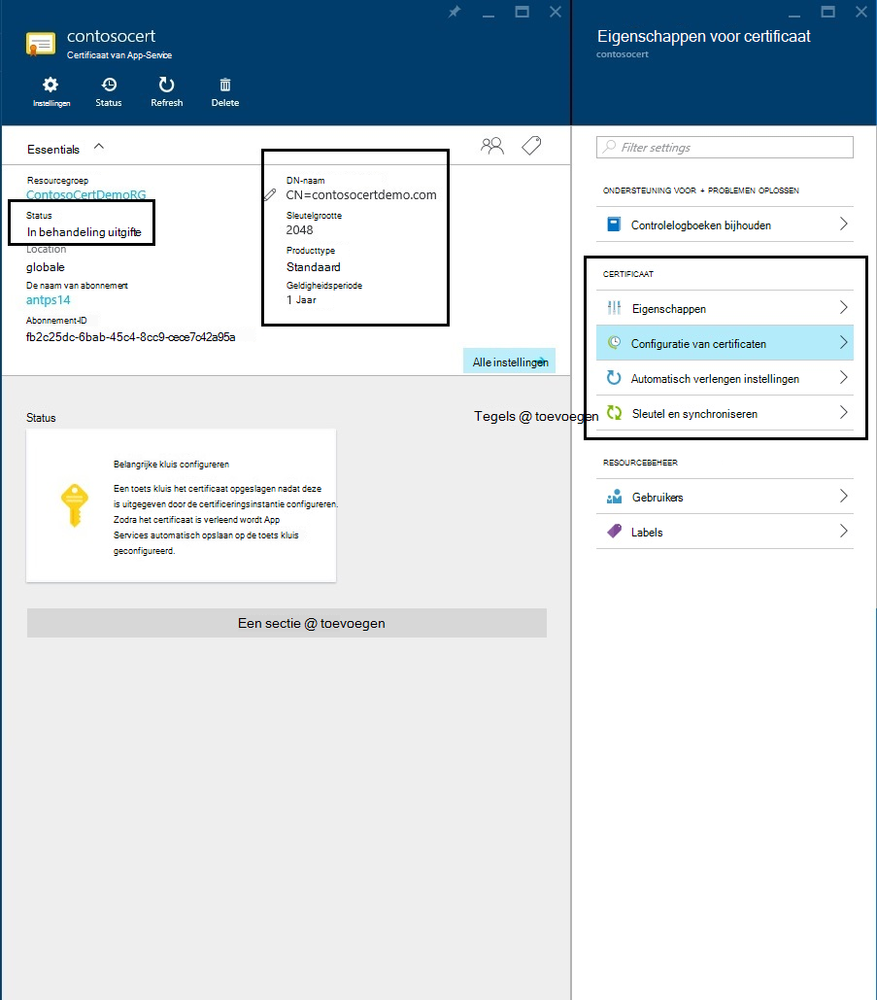
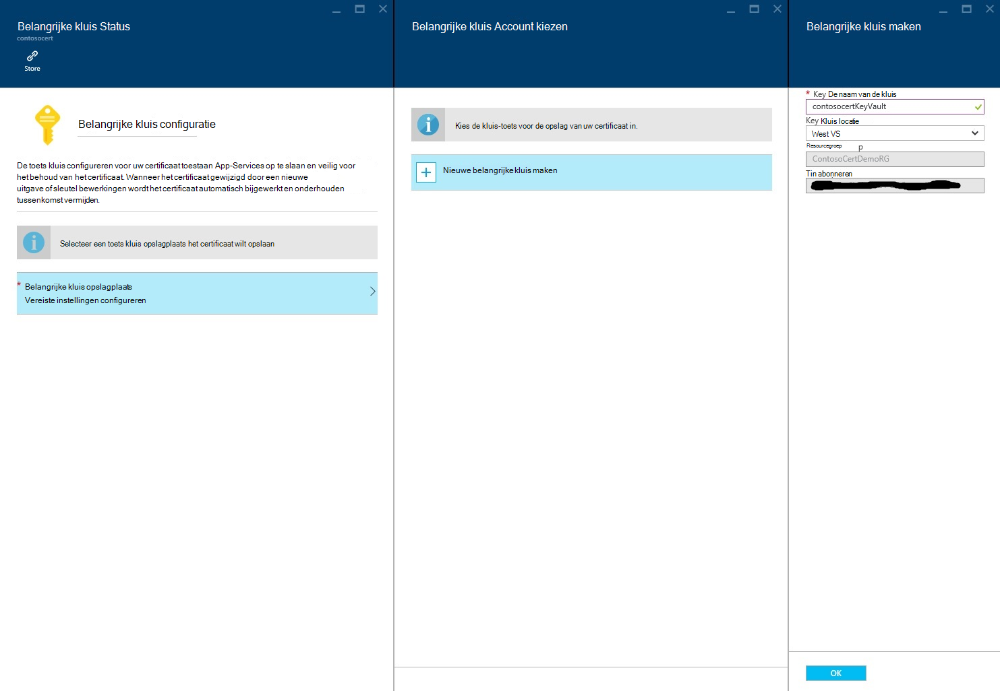
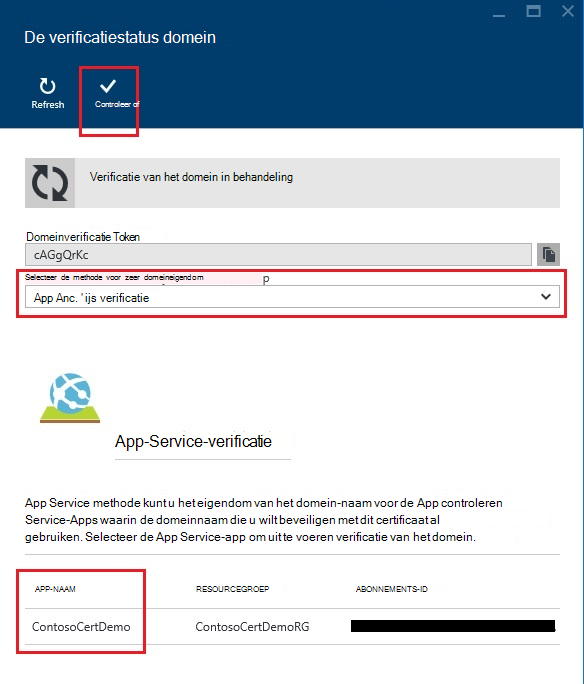
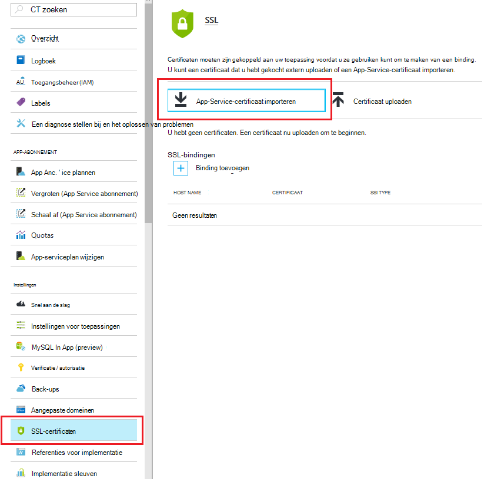
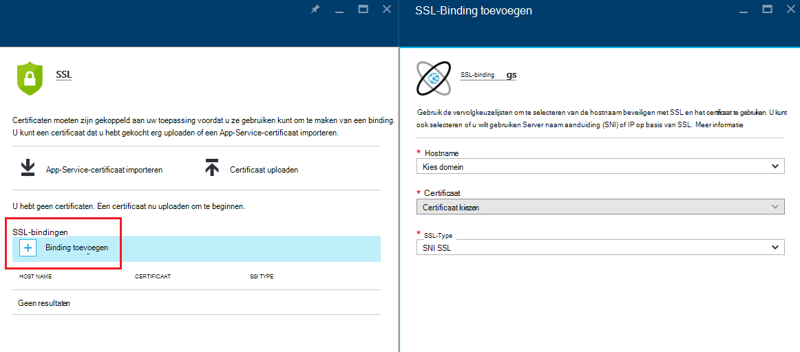
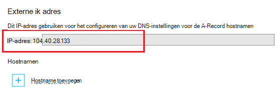
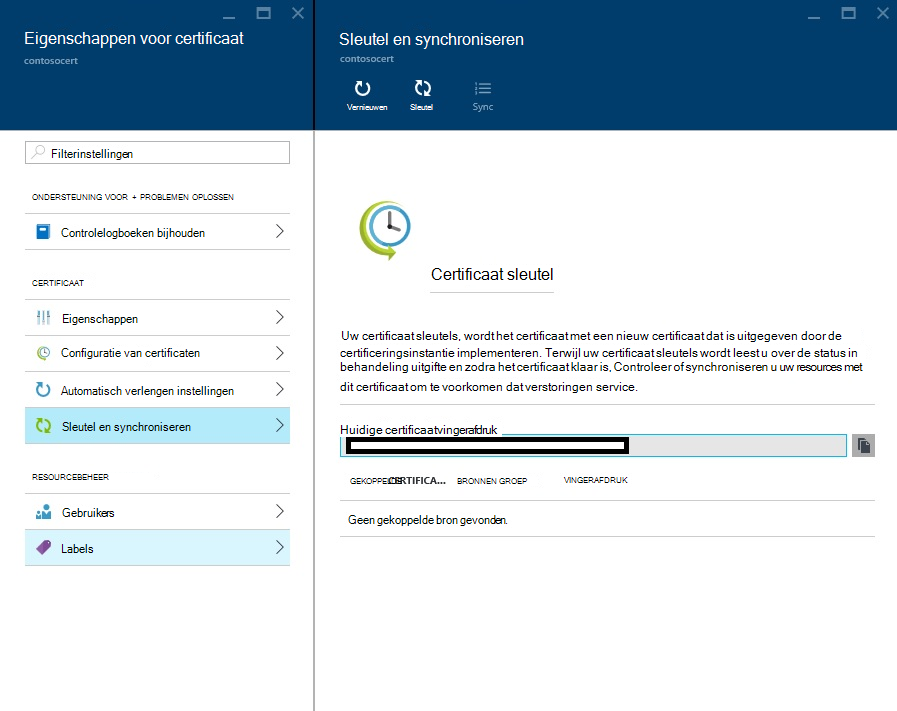

<properties
    pageTitle="Kopen en een SSL-certificaat configureren voor uw Azure App-Service"
    description="Leer hoe u kopen en een SSL-certificaat configureren voor uw Azure App-Service."
    services="app-service"
    documentationCenter=".net"
    authors="apurvajo"
    manager="stefsch"
    editor="cephalin"
    tags="buy-ssl-certificates"/>

<tags
    ms.service="app-service"
    ms.workload="na"
    ms.tgt_pltfrm="na"
    ms.devlang="na"
    ms.topic="article"
    ms.date="09/19/2016"
    ms.author="apurvajo"/>

#Kopen en een SSL-certificaat configureren voor uw Azure App-Service

> [AZURE.SELECTOR]
- [SSL-certificaat in Azure kopen](web-sites-purchase-ssl-web-site.md)
- [SSL-certificaat gebruiken vanaf een andere plaats](web-sites-configure-ssl-certificate.md)

Standaard **[Azure App Service](http://go.microsoft.com/fwlink/?LinkId=529714)** al ingeschakeld HTTPS voor uw web-app met een jokerteken certificaat voor de *. azurewebsites.net domein. Als u niet van plan bent om een aangepaste domein te configureren, kunt klikt u vervolgens u profiteren van het standaardcertificaat voor HTTPS. Als u echter alle * [Jokertekendomeinen](https://casecurity.org/2014/02/26/pros-and-cons-of-single-domain-multi-domain-and-wildcard-certificates), het niet zo is beveiligd met een aangepast domein met uw eigen certificaat. Azure-App-Service biedt u nu een echt vereenvoudigde manier aan te schaffen en een SSL-certificaat rechtstreeks vanuit Azure-Portal beheren zonder te verlaten de portal.  
In dit artikel wordt uitgelegd hoe u kopen en een SSL-certificaat configureren voor uw **[App-Azure-Service](http://go.microsoft.com/fwlink/?LinkId=529714)** in 3 eenvoudige stappen. 

> [AZURE.NOTE]
> SSL-certificaten voor aangepaste domeinnamen kunnen niet worden gebruikt met gratis en gedeeld WebApp. U kunt uw web-app voor Basic, Standard of Premium-modus, die mogelijk wijzigen hoeveel u voor uw abonnement zijn gefactureerd moet configureren. Zie **[Meer informatie het prijzen van Web-Apps](https://azure.microsoft.com/pricing/details/web-sites/)** voor meer informatie.

##Overzicht
> [AZURE.NOTE]
> Neem niet proberen te kopen van een SSL-certificaat dat is gebruikt u een abonnement dat geen een actieve creditcard die is gekoppeld. Dit kan resulteren in uw abonnement wordt uitgeschakeld. 

##<a>Kopen, opslaan en het toewijzen van een SSL-certificaat voor uw aangepaste domein</a>
Als u wilt HTTPS inschakelen voor een aangepast domein, zoals contoso.com, moet u eerst ** [configureren van een aangepaste domeinnaam in Azure App-Service.](web-sites-custom-domain-name.md)**

Voordat u een SSL-certificaat aanvraagt, moet u eerst bepalen welke domeinnamen worden beveiligd door het certificaat. Hiermee bepaalt u welk type certificaat moet u. Als u alleen moet een standaard (standaard) voor een enkele domeinnaam zoals contoso.com of www.contoso.com secure is certificaat voldoende. Als u wilt beveiligen van meerdere domeinnamen, zoals contoso.com, www.contoso.com en mail.contoso.com, klik u kunt een **worden [jokertekens certificaat](http://en.wikipedia.org/wiki/Wildcard_certificate)**

##Stap 0: Een SSL-certificaat-bestelling plaatsen

In deze stap leert u hoe u een Order plaatsen voor een SSL-certificaat van uw keuze.

1.  In de **[Portal van Azure](https://portal.azure.com/)**, klik op Bladeren en typ "App Service certificaten" in zoekbalk en selecteer "App Service certificaten" uit het resultaat en klik op toevoegen. 

    

    

2.  Voer de **beschrijvende naam** voor uw SSL-certificaat.

3.  **Host Name** invoeren
> [AZURE.NOTE]
    Dit is een van de belangrijkste onderdelen van het proces aanschaffen. Controleer of om in te voeren juiste hostnaam (aangepaste domein) die u wilt beveiligen met dit certificaat. **DO NOT** toevoegen de naam van de Host met WWW. Als uw aangepaste domeinnaam www.contoso.com is alleen typt u contoso.com in het veld hostnaam, wordt het gewenste certificaat bijvoorbeeld zowel www als hoofdmap domeinen beveiligen. 
    
4.  Selecteer uw **abonnement**. 

    Als u meerdere abonnementen hebt, klikt u vervolgens zorgen betrokken een SSL-certificaat maken in hetzelfde abonnement die u hebt gebruikt voor uw aangepaste domein of Web App.
       
5.  Selecteer of een **resourcegroep**maken.

    Resourcegroepen kunnen u verwante Azure bronnen beheren als een eenheid en zijn handig bij het maken van rollen gebaseerde besturingselement (RBAC) toegangsregels voor uw apps. Zie uw Azure resources beheren voor meer informatie.
     
6.  Selecteer het **certificaat SKU** 

    Ten slotte, selecteer het certificaat SKU die past bij uw nodig en klik op maken. Tegenwoordig kunnen Azure App-Service, kunt u twee verschillende SKU's • S1 – standaardcertificaat met 1 jaar geldigheid en automatische verlenging kopen  
           • W1 – jokerteken certificaat met 1 jaar geldigheid en automatische verlenging      
    Zie **[Meer informatie het prijzen van Web-Apps](https://azure.microsoft.com/pricing/details/web-sites/)** voor meer informatie.

> [AZURE.NOTE]
> SSL-certificaat maken wordt van 1 tot en met 10 minuten duren. Deze procedure kunt u meerdere stappen uitvoeren op de achtergrond die zich anders erg lastig handmatig uitvoeren.  

##Stap 1: Het certificaat in Azure-toets kluis opslaan

In deze stap leert u hoe u een winkel een SSL-certificaat dat u naar Azure-toets kluis van uw keuze hebt aangeschaft plaatsen.

1.  Nadat de aankoop SSL-certificaat voltooid is moet u handmatig **App Service certificaten** Resource blade openen door te bladeren naar deze opnieuw (Zie stap 1 hierboven)   

    

    U ziet dat de status van het certificaat **"in behandeling uitgifte"** omdat er nog enkele extra stappen die u uitvoeren moet voordat u kunt deze certificaten gebruiken.
 
2. Klik op **' certificaat configuratie '** in de eigenschappen van het certificaat blade en klik op **' stap 1: sla '** voor de opslag van dit certificaat in Azure-toets kluis.

3.  Uit **"toets kluis Status"** Blade-Klik op **' toets kluis opslagplaats '** om te kiezen van een bestaande sleutel kluis dit certificaat **of ' nieuwe sleutel kluis maken '** om te maken van nieuwe sleutel kluis binnen dezelfde abonnement- en resourcekalenders groep wilt opslaan.
 
    
 
    > [AZURE.NOTE]
    Azure-toets kluis heeft minimale kosten voor het opslaan van dit certificaat. Zie **[Azure toets kluis prijzen Details](https://azure.microsoft.com/pricing/details/key-vault/)** voor meer informatie.

4. Wanneer u de toets kluis opslagplaats voor de opslag van dit certificaat in hebt geselecteerd, verdergaan en door te klikken op de knop **"Store"** boven **"toets kluis Status"** bladetechnologieën opslaan.  

    Dit moet voert u stap bij het opslaan van het certificaat dat u hebt gekocht met Azure-toets kluis van uw keuze. Na het vernieuwen van het blad, ziet u groen controleren ten opzichte van deze stap als u ook markeren.
    
##Stap 2: Controleren of het eigendom van het domein

In deze stap leert u hoe u uw eigendom domeinverificatie uitvoert voor een SSL-certificaat dat u alleen een order geplaatst voor. 

1.  Klik op **' stap 2: Controleer of '** stap uit het blad **'Certificaat configuratie'** . Er zijn 4 soorten domein verificatie wordt ondersteund door de App Service certificaten.

    * **App-Service-verificatie** 
    
        * Dit is het handigst proces als u al hebt **uw aangepaste domein toegewezen aan de App-Service-Apps.** Deze methode wordt een lijst van alle de App-Service-Apps die aan deze criteria voldoen. 
           Bijvoorbeeld: in dit geval **contosocertdemo.com** is een aangepast domein die zijn toegewezen aan de App Service App **'ContosoCertDemo'** genoemd en dus die is de enige Service-App voor App is hier wordt vermeld. Als er meerdere landen/regio-implementatie, zou klikt u vervolgens deze somt u deze allemaal in de regio's.
        
           De verificatiemethode is alleen beschikbaar voor aankopen standaardcertificaat (standaard). Overslaan en verplaatsen naar de optie B, C of D onderstaande voor jokerteken certificaten.
        * Klik op de knop **'Controleren'** om te voltooien van deze stap.
        * Klik op **'Vernieuwen'** naar de status van het certificaat bijwerken nadat verificatie is voltooid. Het kan enkele minuten duren voordat verificatie om te voltooien.
        
             

    * **Verificatie van het domein** 

        * Dit is het handigst proces **alleen als** er **[uw aangepaste domein hebt gekocht bij Azure App-Service.](custom-dns-web-site-buydomains-web-app.md)**
        
        * Klik op de knop **'Controleren'** om te voltooien van deze stap.
        
        * Klik op **'Vernieuwen'** naar de status van het certificaat bijwerken nadat verificatie is voltooid. Het kan enkele minuten duren voordat verificatie om te voltooien.

    * **E-mail-verificatie**
        
        * Verificatie-e-mailbericht is al verzonden naar de e-mailadres dat is gekoppeld aan dit aangepaste domein.
         
        * Open het e-mailbericht en klik op de verificatie-koppeling naar het e-mailverificatie-stap uitvoeren. 
        
        * Als u moet de verificatie-e-mail opnieuw verzenden klikt u op de knop **"E-mail opnieuw verzenden"** .
         
    * **Handmatige verificatie**    
                 
        1. **HTML-pagina met webonderdelen verificatie**
        
            * Maken van een HTML-bestand met de naam **{domeinverificatie Token}**.html (u kunt het token van hij domeinverificatie Status Blade kopiëren)
            
            * Inhoud van dit bestand moet exact dezelfde naam van het **Domeinverificatie Token**.
            
            * Dit bestand in de hoofdmap van de webserver hostingprovider van uw domein niet uploaden.
            
            * Klik op **'Vernieuwen'** naar de status van het certificaat bijwerken nadat verificatie is voltooid. Het kan enkele minuten duren voordat verificatie om te voltooien.
            
            Bijvoorbeeld als u een standaard-certificaat voor contosocertdemo.com met domeinverificatie Token **'cAGgQrKc'** koopt vervolgens een verzoek web naar **'http://contosocertdemo.com/cAGgQrKc.html'** moet worden geretourneerd **cAGgQrKc.**
        2. **DNS-TXT-Record verificatie**

            * Met uw DNS-beheer, maakt u een TXT-record van het subdomein **'DZC'** met de waarde gelijk is aan de **domeinverificatie Token.**
            
            * Klik op **'Vernieuwen'** naar de status van het certificaat bijwerken nadat verificatie is voltooid. Het kan enkele minuten duren voordat verificatie om te voltooien.
                              
            Als u bijvoorbeeld om te kunnen uitvoeren validatie naar een certificaat jokertekens met hostname ** \*. contosocertdemo.com** of ** \*. subdomain.contosocertdemo.com** en domeinverificatie Token **cAGgQrKc**, moet u een TXT-record maken op dzc.contosocertdemo.com met waarde **cAGgQrKc.**     

##Stap 3: Certificaat toewijzen aan App Service-App

In deze stap leert u hoe u dit certificaat tot uw App Service Apps zojuist hebt gekocht toewijzen. 

> [AZURE.NOTE]
> Voordat u de stappen in deze sectie, moet een aangepaste domeinnaam hebt gekoppeld aan uw app. Zie voor meer informatie ** [configureren van een aangepaste domeinnaam voor een web-App](web-sites-custom-domain-name.md)**

1.  Open de **in uw browser [Azure-Portal.](https://portal.azure.com/)**
2.  Klik op de optie **App Service** aan de linkerkant van de pagina.
3.  Klik op de naam van uw app waaraan u wilt toewijzen van dit certificaat. 
4.  Klik in de **Instellingen**op **SSL-certificaten**
5.  Klik op **App Service-certificaat importeren** en selecteer het certificaat dat u zojuist hebt gekocht

    

6. In de **ssl bindingen** sectie Klik op **Bindingen toevoegen**
7. Gebruik de vervolgkeuzelijsten te selecteren van de naam van het domein te beveiligen met SSL en het certificaat te gebruiken in het blad **SSL binden toevoegen** . U kunt ook selecteren of u wilt gebruiken **[Server naam aanduiding (SNI)](http://en.wikipedia.org/wiki/Server_Name_Indication)** of IP op basis van SSL.

    

       •    IP based SSL associates a certificate with a domain name by mapping the dedicated public IP address of the server to the domain name. This requires each domain name (contoso.com, fabricam.com, etc.) associated with your service to have a dedicated IP address. This is the traditional          method of associating SSL certificates with a web server.
       •    SNI based SSL is an extension to SSL and **[Transport Layer Security](http://en.wikipedia.org/wiki/Transport_Layer_Security)** (TLS) that allows multiple domains to share the same IP address, with separate security certificates for each domain. Most modern browsers (including Internet Explorer, Chrome, Firefox and Opera) support SNI, however older browsers may not support SNI. For more information on SNI, see the **[Server Name Indication](http://en.wikipedia.org/wiki/Server_Name_Indication)** article on Wikipedia.
       
7. Klik op **Toevoegen binden** om de wijzigingen op te slaan en SSL in te schakelen.

Als u hebt geselecteerd **IP op basis van SSL** en uw aangepaste domein is geconfigureerd met een A-record, moet u de volgende extra stappen uitvoeren:

* Nadat u hebt geconfigureerd een IP op basis van SSL binding, een specifieke IP-adres is toegewezen aan uw app. U vindt deze IP-adres op de pagina **aangepaste domein** onder instellingen van de app, rechts boven de sectie **hostnamen** . Deze wordt weergegeven als **Externe IP-adres**
    
    

    Houd er rekening mee dat dit IP-adres anders dan het virtuele IP-adres eerder hebt gebruikt is voor het configureren van de A-record voor uw domein. Als u zijn geconfigureerd voor gebruik SNI op basis van SSL of niet zijn geconfigureerd voor het gebruik van SSL, geen adres voor dit item, worden vermeld.
    
2. Met de hulpmiddelen die is verstrekt door uw domeinnaamregistrar, wijzig de A-record voor de naam van uw aangepaste domein te laten verwijzen naar het IP-adres van de vorige stap.
Nu moet u mogelijk te bezoeken van uw app HTTPS:// in plaats van HTTP:// gebruiken om te bevestigen dat het certificaat correct is geconfigureerd.

##Sleutel en het certificaat synchroniseren

1. Veiligheidsredenen worden als u zo nodig uw certificaat vervolgens gewoon sleutel selecteert u optie **' sleutel en synchroniseren '** in **"certificaateigenschappen"** Blade. 

2. Klik op de knop **'Sleutel'** het proces te starten. Dit kan 1-10 minuten duren. 

    

3. Uw certificaat sleutels, wordt het certificaat met een nieuw certificaat dat is uitgegeven door de certificeringsinstantie implementeren.
4. U moet niet betalen voor de Rekeying voor de levensduur van het certificaat. 
5. Uw certificaat sleutels doorloopt in behandeling uitgifte staat. 
6. Zodra het certificaat klaar is, moet dat u uw resources met dit certificaat om te voorkomen dat verstoring van de service synchroniseren.
7. Optie synchroniseren is niet beschikbaar voor certificaten die nog niet zijn toegewezen aan de Web-App. 

## Meer informatiebronnen ##
- [HTTPS inschakelen voor een app in Azure App-Service](web-sites-configure-ssl-certificate.md)
- [Kopen en configureren van een aangepaste domeinnaam in Azure App-Service](custom-dns-web-site-buydomains-web-app.md)
- [Vertrouwenscentrum in Microsoft Azure](/support/trust-center/security/)
- [Configuratieopties ontgrendelen in Azure websites](http://azure.microsoft.com/blog/2014/01/28/more-to-explore-configuration-options-unlocked-in-windows-azure-web-sites/)
- [Azure Management Portal](https://manage.windowsazure.com)

>[AZURE.NOTE] Als u aan de slag met Azure App Service wilt voordat u zich registreert voor een Azure-account, gaat u naar de [App-Service probeert](http://go.microsoft.com/fwlink/?LinkId=523751), waar u direct een tijdelijk starter in de browser in de App-Service maken kunt. Geen creditcards vereist; geen verplichtingen.

