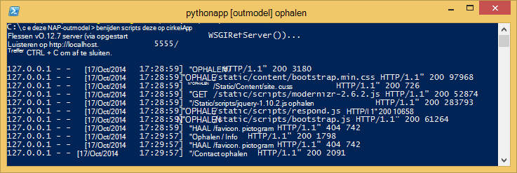

<properties 
    pageTitle="Python web-apps gebruiken met flessen in Azure wordt aangegeven" 
    description="Een zelfstudie waarin u kennismaakt met een WebApp Python uitgevoerd in Azure App Service Web Apps." 
    services="app-service\web" 
    documentationCenter="python" 
    tags="python"
    authors="huguesv" 
    manager="wpickett" 
    editor=""/>

<tags 
    ms.service="app-service-web" 
    ms.workload="web" 
    ms.tgt_pltfrm="na" 
    ms.devlang="python" 
    ms.topic="article" 
    ms.date="02/19/2016"
    ms.author="huvalo"/>

# WebApps maken met flessen in Azure wordt aangegeven

Deze zelfstudie wordt beschreven hoe aan de slag met Python in Azure App Service Web Apps. Web Apps biedt beperkte gratis hostingprovider en snelle implementatie en kunt u Python! Als uw app omvang groeit, kunt u overschakelen naar betaalde hostingprovider en u kunt ook integreren met alle andere Azure services.

U maakt een web-app met het kader van de web flessen (Zie andere versies van deze zelfstudie voor [Django](web-sites-python-create-deploy-django-app.md) en [kolf](web-sites-python-create-deploy-flask-app.md)). U wordt de WebApp maken van Azure Marketplace, cijfer implementatie instellen en de opslagplaats lokaal klonen. Vervolgens wordt de WebApp lokaal uitvoeren, wijzigingen aanbrengen, doorvoeren en ze push tot [Azure App Service Web Apps](http://go.microsoft.com/fwlink/?LinkId=529714). De zelfstudie leert hoe u dit doen vanuit Windows of Mac/Linux.

[AZURE.INCLUDE [create-account-and-websites-note](../../includes/create-account-and-websites-note.md)]

>[AZURE.NOTE] Als u aan de slag met Azure App Service wilt voordat u zich registreert voor een Azure-account, gaat u naar de [App-Service probeert](http://go.microsoft.com/fwlink/?LinkId=523751), waar u direct een tijdelijk starter in de browser in de App-Service maken kunt. Geen creditcards vereist; geen verplichtingen.

## Vereisten voor

- Windows, Mac of Linux
- Python 2.7 of 3.4
- setuptools, pip, virtualenv (alleen Python 2.7)
- Cijfer
- [Python hulpmiddelen voor 2.2 voor Visual Studio][] (PTVS) - Opmerking: dit is optioneel

**Opmerking**: TFS publiceren wordt momenteel niet ondersteund voor Python projecten.

### Windows

Als u nog niet Python 2.7 of 3,4 geïnstalleerde (32-bits), wordt u aangeraden installatie [Azure SDK voor Python 2.7] of [Azure SDK voor Python 3.4] met Web Platform Installer. Hiermee installeert u de 32-bits versie van Python, setuptools, pip, virtualenv, enzovoort (32-bits Python is wat op de host van Azure-computers geïnstalleerd). U kunt ook Python krijgen van [python.org].

Voor cijfer raden [Cijfer voor Windows] of [GitHub voor Windows]. Als u Visual Studio gebruikt, kunt u de geïntegreerde cijfer-ondersteuning.

Ook aangeraden [Python extra 2.2 voor Visual Studio]installeren. Dit is optioneel, maar hebt u [Visual Studio], zoals de gratis 2013 voor Visual Studio-Community of Visual Studio Express 2013 voor het Web, klikt u vervolgens Hiermee krijgt u een goede Python IDE.

### Mac/Linux

U moet hebben Python en cijfer al is geïnstalleerd, maar zorg er Python 2.7 of 3.4.

## Web-app maken op de Azure-Portal

De eerste stap bij het maken van uw app is het opzetten van de web-app via de [Portal van Azure](https://portal.azure.com).  

1. Meld u aan bij de Portal Azure en klik op de knop **Nieuw** in de linkerbenedenhoek. 
3. Typ in het zoekvak "python".
4. In de lijst met zoekresultaten, selecteert u **flessen**en klik op **maken**.
5. De nieuwe flessen-app, zoals het maken van een nieuwe App-serviceplan en een nieuwe resourcegroep voor deze configureren. Klik vervolgens op **maken**.
6. Cijfer publicatie voor uw nieuwe WebApp volgens de instructies op de [Lokale cijfer implementatie naar Azure App-Service](app-service-deploy-local-git.md)configureren.
 
## Overzicht van de toepassing

### Cijfer opslagplaats inhoud

Hier volgt een overzicht van de bestanden vindt u in de eerste cijfer opslagplaats, die we in het volgende gedeelte wordt klonen.

    \routes.py
    \static\content\
    \static\fonts\
    \static\scripts\
    \views\about.tpl
    \views\contact.tpl
    \views\index.tpl
    \views\layout.tpl

Belangrijkste bronnen voor de toepassing. Bestaat uit 3 pagina's (index, over contactpersoon) met een modelindeling.  Statische inhoud en scripts opnemen bootstrap, jquery, modernizr en reageren.

    \app.py

Ondersteuning voor lokale development-server. Hiermee voert u de toepassing lokaal.

    \BottleWebProject.pyproj
    \BottleWebProject.sln

Projectbestanden voor gebruik met [Python Tools voor Visual Studio].

    \ptvs_virtualenv_proxy.py

IIS-proxy voor virtuele omgevingen en PTVS externe ondersteuning voor foutopsporing.

    \requirements.txt

Externe-pakketten nodig zijn voor deze toepassing. De implementatiescript wordt pip pakket in dit bestand installeren.
 
    \web.2.7.config
    \web.3.4.config

IIS-configuratie-bestanden. De implementatiescript de juiste web.x.y.config gebruikt en deze als web.config kopiëren.

### Optionele bestanden - implementatie aanpassen

[AZURE.INCLUDE [web-sites-python-customizing-deployment](../../includes/web-sites-python-customizing-deployment.md)]

### Optionele bestanden - Python runtime

[AZURE.INCLUDE [web-sites-python-customizing-runtime](../../includes/web-sites-python-customizing-runtime.md)]

### Aanvullende bestanden op de server

Sommige bestanden op de server aanwezig, maar niet worden toegevoegd aan de bibliotheek cijfer. Deze worden gemaakt door het implementatiescript.

    \web.config

IIS-configuratiebestand. Gemaakt op basis van web.x.y.config in elke implementatie.

    \env\

Virtuele Python-omgeving. Gemaakt tijdens de implementatie als een compatibele omgeving die is virtual nog niet in de web-app bestaat.  Pakketten in de lijst in requirements.txt zijn pip is geïnstalleerd, maar pip installatie wordt overslaan als de pakketten al zijn geïnstalleerd.

De volgende 3 gedeelten wordt beschreven hoe verder te gaan met het ontwikkelen van de web-apps onder 3 verschillende omgevingen:

- Windows, met Python Tools voor Visual Studio
- Vensters, met de opdrachtregel
- Mac/Linux, met de opdrachtregel

## Web App development - Windows - Python Tools voor Visual Studio

### De bibliotheek klonen

Eerst de bibliotheek met de url die u op de Portal Azure klonen. Zie [Lokaal cijfer te implementeren naar Azure App-Service](app-service-deploy-local-git.md)voor meer informatie.

Open het oplossingsbestand (.sln) die is opgenomen in de hoofdmap van de bibliotheek.

### Virtuele omgeving maken

Nu gaan we een virtuele omgeving voor lokale ontwikkeling maken. Klik met de rechtermuisknop op **Python omgevingen** select **Toevoegen virtuele omgeving...**.

- Controleer of de naam van de omgeving is `env`.

- Selecteer de basis interpreter. Zorg ervoor dat u dezelfde versie van Python die is geselecteerd gebruiken voor uw web-app (in runtime.txt of het blad **Toepassingsinstellingen** van uw web-app in de Portal Azure).

- Zorg ervoor dat de optie voor het downloaden en installeren van pakketten is ingeschakeld.

Klik op **maken**. Hiermee maakt u de virtuele omgeving, en afhankelijkheden weergegeven in requirements.txt installeren.

### Uitvoeren development-server gebruiken

Druk op F5 foutopsporing te starten en uw webbrowser wordt automatisch geopend naar de pagina lokaal uitgevoerd.

U kunt onderbrekingspunten instellen in de bronnen, gebruikt u de controle, enzovoort. Zie de [Python Tools voor Visual Studio-documentatie] voor meer informatie over de verschillende functies.

### Wijzigingen aanbrengen

Nu kunt u experimenteren met wijzigingen aanbrengt in de toepassingsbronnen en/of sjablonen.

Nadat u de wijzigingen hebt getest, kunt u ze naar de bibliotheek cijfer vastlegt:

### Meer-pakketten installeren

Uw toepassing kan afhankelijkheden naast Python en flessen hebben.

U kunt extra pakketten met pip installeren. Een pakket installeert, met de rechtermuisknop op de virtuele omgeving en selecteer **Python-pakket installeren**.

Voer bijvoorbeeld het volgende als u wilt installeren van de Azure-SDK voor Python, waarmee u toegang krijgt tot Azure opslag, service bus en andere Azure services, `azure`:

Met de rechtermuisknop op de virtuele omgeving en selecteer **genereren requirements.txt** requirements.txt bijwerken.

De wijzigingen vervolgens vastleggen op requirements.txt naar de bibliotheek cijfer.

### Implementeren naar Azure

Als u wilt activeren een implementatie, klik u op **synchroniseren** of **Push**. Synchronisatie biedt een push zowel een halen.

De eerste implementatie duurt enige tijd, zoals deze een virtuele omgeving, installatiepakketten, enzovoort maakt.

Visual Studio worden niet weergegeven de voortgang van de implementatie. Als u bekijken van de uitvoer wilt, raadpleegt u de sectie op [Probleemoplossing - implementatie](#troubleshooting-deployment).

Blader naar de URL van de Azure om uw wijzigingen te bekijken.

## Ontwikkelen van Web Apps - Windows - opdracht uitlijnen

### De bibliotheek klonen

Eerst de bibliotheek met de URL die u op de Portal Azure klonen en de Azure opslagplaats toevoegen als een externe. Zie [Lokaal cijfer te implementeren naar Azure App-Service](app-service-deploy-local-git.md)voor meer informatie.

    git clone <repo-url>
    cd <repo-folder>
    git remote add azure <repo-url> 

### Virtuele omgeving maken

Maken we een nieuwe virtuele omgeving om software te ontwikkelen (kan niet worden toegevoegd aan de bibliotheek). Virtuele omgevingen in Python zijn niet per, zodat elke ontwikkelaars werken op de toepassing hun eigen lokaal maakt.

Controleer of u dezelfde versie van Python die is geselecteerd voor uw web-app (in runtime.txt of het blad toepassingsinstellingen voor uw web-app in de Portal Azure)

Voor Python 2.7:

    c:\python27\python.exe -m virtualenv env

Voor Python 3.4:

    c:\python34\python.exe -m venv env

Installeer alle externe-pakketten vereist door de toepassing. U kunt het bestand requirements.txt gebruiken in de hoofdmap van de bibliotheek de pakketten installeren in uw virtuele omgeving:

    env\scripts\pip install -r requirements.txt

### Uitvoeren development-server gebruiken

U kunt de toepassing onder een ontwikkelingsserver met de volgende opdracht starten:

    env\scripts\python app.py

De console de URL wordt weergegeven en poort de server luistert naar:

Open vervolgens uw webbrowser naar die URL.

### Wijzigingen aanbrengen

Nu kunt u experimenteren met wijzigingen aanbrengt in de toepassingsbronnen en/of sjablonen.

Nadat u de wijzigingen hebt getest, kunt u ze naar de bibliotheek cijfer vastlegt:

    git add <modified-file>
    git commit -m "<commit-comment>"

### Meer-pakketten installeren

Uw toepassing kan afhankelijkheden naast Python en flessen hebben.

U kunt extra pakketten met pip installeren. Typ bijvoorbeeld het volgende als u wilt de SDK Azure voor Python, waarmee u toegang krijgt tot Azure opslag, service bus en andere Azure services, installeren:

    env\scripts\pip install azure

Controleer of requirements.txt bijwerken:

    env\scripts\pip freeze > requirements.txt

De wijzigingen:

    git add requirements.txt
    git commit -m "Added azure package"

### Implementeren naar Azure

Als u wilt activeren een implementatie, push u de wijzigingen aan Azure:

    git push azure master

Hier ziet u de uitvoer van de implementatiescript, inclusief virtuele omgeving maken, installatie van pakketten, het maken van web.config.

Blader naar de URL van de Azure om uw wijzigingen te bekijken.

## Web app development - Mac/Linux - opdrachtregel

### De bibliotheek klonen

Eerst de bibliotheek met de URL die u op de Portal Azure klonen en de Azure opslagplaats toevoegen als een externe. Zie [Lokaal cijfer te implementeren naar Azure App-Service](app-service-deploy-local-git.md)voor meer informatie.

    git clone <repo-url>
    cd <repo-folder>
    git remote add azure <repo-url> 

### Virtuele omgeving maken

Maken we een nieuwe virtuele omgeving om software te ontwikkelen (kan niet worden toegevoegd aan de bibliotheek). Virtuele omgevingen in Python zijn niet per, zodat elke ontwikkelaars werken op de toepassing hun eigen lokaal maakt.

Zorg ervoor dat u dezelfde versie van Python die is geselecteerd gebruiken voor uw web-app (in runtime.txt of het blad toepassingsinstellingen van uw web-app in de Portal Azure).

Voor Python 2.7:

    python -m virtualenv env

Voor Python 3.4:

    python -m venv env
of pyvenv envelop

Installeer alle externe-pakketten vereist door de toepassing. U kunt het bestand requirements.txt gebruiken in de hoofdmap van de bibliotheek de pakketten installeren in uw virtuele omgeving:

    env/bin/pip install -r requirements.txt

### Uitvoeren development-server gebruiken

U kunt de toepassing onder een ontwikkelingsserver met de volgende opdracht starten:

    env/bin/python app.py

De console de URL wordt weergegeven en poort de server luistert naar:

Open vervolgens uw webbrowser naar die URL.

### Wijzigingen aanbrengen

Nu kunt u experimenteren met wijzigingen aanbrengt in de toepassingsbronnen en/of sjablonen.

Nadat u de wijzigingen hebt getest, kunt u ze naar de bibliotheek cijfer vastlegt:

    git add <modified-file>
    git commit -m "<commit-comment>"

### Meer-pakketten installeren

Uw toepassing kan afhankelijkheden naast Python en flessen hebben.

U kunt extra pakketten met pip installeren. Typ bijvoorbeeld het volgende als u wilt de SDK Azure voor Python, waarmee u toegang krijgt tot Azure opslag, service bus en andere Azure services, installeren:

    env/bin/pip install azure

Controleer of requirements.txt bijwerken:

    env/bin/pip freeze > requirements.txt

De wijzigingen:

    git add requirements.txt
    git commit -m "Added azure package"

### Implementeren naar Azure

Als u wilt activeren een implementatie, push u de wijzigingen aan Azure:

    git push azure master

Hier ziet u de uitvoer van de implementatiescript, inclusief virtuele omgeving maken, installatie van pakketten, het maken van web.config.

Blader naar de URL van de Azure om uw wijzigingen te bekijken.

## Problemen oplossen bij - pakketinstallatie

[AZURE.INCLUDE [web-sites-python-troubleshooting-package-installation](../../includes/web-sites-python-troubleshooting-package-installation.md)]

## Probleemoplossing - virtuele omgeving

[AZURE.INCLUDE [web-sites-python-troubleshooting-virtual-environment](../../includes/web-sites-python-troubleshooting-virtual-environment.md)]

## Volgende stappen

Klik op deze koppelingen voor meer informatie over flessen en Python hulpprogramma's voor Visual Studio: 
 
- [Flessen documentatie]
- [Python Tools voor Visual Studio-documentatie]

Voor informatie over het gebruik van Azure Table Storage en MongoDB:

- [Flessen en MongoDB op Azure met Python Tools voor Visual Studio]
- [Flessen en Azure-tabelopslag op Azure met Python Tools voor Visual Studio]

## Wat er gewijzigd
* Zie voor een handleiding voor het wijzigen van Websites naar App Service: [Azure App-Service en de invloed op bestaande Azure-Services](http://go.microsoft.com/fwlink/?LinkId=529714)

<!--Link references-->
[Flessen en MongoDB op Azure met Python Tools voor Visual Studio]: web-sites-python-ptvs-bottle-table-storage.md
[Flessen en Azure-tabelopslag op Azure met Python Tools voor Visual Studio]: web-sites-python-ptvs-bottle-table-storage.md

<!--External Link references-->
[Azure SDK voor Python 2.7]: http://go.microsoft.com/fwlink/?linkid=254281
[Azure SDK voor Python 3.4]: http://go.microsoft.com/fwlink/?linkid=516990
[Python.org]: http://www.python.org/
[Cijfer voor Windows]: http://msysgit.github.io/
[GitHub voor Windows]: https://windows.github.com/
[Python Tools voor Visual Studio]: http://aka.ms/ptvs
[Python Tools 2.2 voor Visual Studio]: http://go.microsoft.com/fwlink/?LinkID=624025
[Visual Studio]: http://www.visualstudio.com/
[Python Tools voor Visual Studio-documentatie]: http://aka.ms/ptvsdocs 
[Flessen documentatie]: http://bottlepy.org/docs/dev/index.html
 
