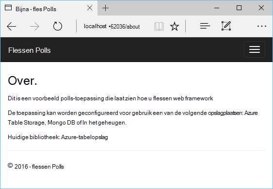

<properties 
    pageTitle="Flessen en Azure-tabelopslag op Azure met Python hulpprogramma's voor 2.2 voor Visual Studio" 
    description="Informatie over het gebruik van de hulpmiddelen Python voor Visual Studio een flessen-toepassing waarin gegevens worden opgeslagen in Azure Table Storage maken en implementeren van de web-app naar Azure App Service Web Apps." 
    services="app-service\web" 
    documentationCenter="python" 
    authors="huguesv" 
    manager="wpickett" 
    editor=""/>

<tags 
    ms.service="app-service-web" 
    ms.workload="web" 
    ms.tgt_pltfrm="na" 
    ms.devlang="python" 
    ms.topic="article" 
    ms.date="07/07/2016"
    ms.author="huvalo"/>

# Flessen en Azure-tabelopslag op Azure met Python hulpprogramma's voor 2.2 voor Visual Studio 

In deze zelfstudie gebruiken we [Python Tools voor Visual Studio] om een eenvoudige polls WebApp met een van de voorbeeldsjablonen PTVS te maken. Deze zelfstudie is ook beschikbaar als een [video](https://www.youtube.com/watch?v=GJXDGaEPy94).

De webtoepassing polls definieert een abstractie voor de bibliotheek, zodat u eenvoudig tussen verschillende soorten opslagplaatsen (In het geheugen, Azure-tabelopslag, MongoDB schakelen kunt).

We leert hoe u een opslag van Azure-account maken, het configureren van de web-app als u wilt gebruiken Azure Table Storage en hoe de web-app publiceren naar [Azure App Service Web Apps](http://go.microsoft.com/fwlink/?LinkId=529714).

Zie het [Python Developer Center] voor meer artikelen waarin de ontwikkeling van Azure App Service Web-Apps gebruiken met PTVS flessen, kolf en Django web-kaders, gebruikt met services van MongoDB, Azure Table Storage, MySQL en SQL-Database. Terwijl u in dit artikel ligt de nadruk op App-Service, wordt via de stappen lijken bij het ontwikkelen van [Azure-Cloudservices].

## Vereisten voor

 - Visual Studio-2015
 - [Python Tools 2.2 voor Visual Studio]
 - [Python Tools 2.2 voor Visual Studio voorbeelden VSIX]
 - [Azure SDK hulpprogramma's voor tegenover 2015]
 - [Python 2.7 32-bits] of [Python 3.4 32-bits]

[AZURE.INCLUDE [create-account-and-websites-note](../../includes/create-account-and-websites-note.md)]

>[AZURE.NOTE] Als u aan de slag met Azure App Service wilt voordat u zich registreert voor een Azure-account, gaat u naar de [App-Service probeert](http://go.microsoft.com/fwlink/?LinkId=523751), waar u direct een tijdelijk starter in de browser in de App-Service maken kunt. Geen creditcards vereist; geen verplichtingen.

## Het Project maken

In dit gedeelte maakt we een Visual Studio-project met een voorbeeldsjabloon. We een virtuele omgeving maken en vereiste pakketten installeren. Vervolgens voert we de toepassing lokaal via de standaard in het geheugen opslagplaats uit.

1.  Selecteer in Visual Studio, **bestand**, **Nieuw Project**.

1.  De project-sjablonen uit de [Python extra 2.2 voor Visual Studio voorbeelden VSIX] zijn beschikbaar onder **Python**, **voorbeelden**. Selecteer **Polls flessen Web Project** en klik op OK om het project te maken.

    

1.  U wordt gevraagd externe pakketten installeren. Selecteer **in een omgeving die is virtual installeren**.

    

1.  Selecteer **Python 2.7** of **Python 3.4** als de basis interpreter.

    

1.  Bevestig dat de toepassing door te drukken werkt `F5`. Standaard wordt in de toepassing een bibliotheek in het geheugen waarvoor een configuratie niet wordt gebruikt. De gegevens worden verwijderd wanneer de webserver is gestopt.

1.  Klik op **Voorbeeld Polls maken**en klik op op een peiling en stem.

    

## Maak een Account Azure opslag

Als u opslagbewerkingen, moet u een account Azure opslag. U kunt een opslag-account maken door deze stappen uit.

1.  Meld u aan bij de [Portal van Azure](https://portal.azure.com/).

1. Klik op het pictogram **Nieuw** op de voorgrond links van de Portal, klik vervolgens op **gegevens + opslagruimte** > **Opslag-Account**.  Klik op de knop **maken** , Geef een unieke naam de opslag-account en maak een nieuwe [resourcegroep](../azure-resource-manager/resource-group-overview.md) .

    

    Wanneer het opslag-account is gemaakt, de knop **meldingen** wordt een groene **SUCCESS** flash en van de opslagruimte account blade is geopend om weer te geven dat deze deel uitmaakt van de nieuwe resourcegroep die u hebt gemaakt.

1. Klik op het gedeelte **toegangstoetsen** in van de opslagruimte account blade. Let op de accountnaam en sleutel1.

    

    We moet deze informatie voor het configureren van uw project in het volgende gedeelte.

## Het Project configureren

In dit gedeelte wordt we onze toepassing voor het gebruik van de opslag-account dat we zojuist hebt gemaakt configureren. Vervolgens gaat we de toepassing lokaal uitvoeren.

1.  Visual Studio, met de rechtermuisknop op uw projectknooppunt in Solution Explorer en selecteer **Eigenschappen**. Klik op het tabblad **fouten opsporen in** .

    

1.  Stel de waarden van omgevingsvariabelen vereist door de toepassing in **Foutopsporing serveropdracht** **omgeving**.

        REPOSITORY_NAME=azuretablestorage
        STORAGE_NAME=<storage account name>
        STORAGE_KEY=<primary access key>

    Hierdoor wordt de omgevingsvariabelen ingesteld wanneer u **Foutopsporing starten**. Als u wilt dat de variabelen worden ingesteld wanneer u **Starten zonder foutopsporing**, evenals de dezelfde waarden onder **Server-opdracht uitvoeren** .

    U kunt ook omgevingsvariabelen met het Windows Configuratiescherm definiëren. Dit is een betere optie als u wilt voorkomen opslaan van referenties in broncode / project voor het bestand. Houd er rekening mee dat u Visual Studio voor de nieuwe Omgevingswaarden moet zijn beschikbaar in de toepassing opnieuw.

1.  De code die de bibliotheek Azure Table Storage implementeert is in **models/azuretablestorage.py**. Zie de [documentatie] voor meer informatie over het gebruik van de Service uit Python tabel.

1.  Voer de toepassing met `F5`. Polls die zijn gemaakt met **Steekproef Polls maken** en de gegevens van de stemmen wordt worden serienummer in Azure Table Storage.

    > [AZURE.NOTE] De Python 2.7 virtuele omgeving, kan het einde van een uitzondering veroorzaken in Visual Studio.  Druk op `F5` kunt doorgaan met het laden van het webproject. 

1.  Blader naar de pagina **Info over** om te bevestigen dat de toepassing de opslagplaats **Azure Table Storage** gebruikt.

    

## Verkennen van de Azure-tabelopslag

Het is eenvoudig kunt weergeven en bewerken van opslag-tabellen met de Cloud Explorer in Visual Studio. In deze sectie we Server Explorer gebruiken om weer te geven van de inhoud van de tabellen van de toepassing polls.

> [AZURE.NOTE] Hiervoor is vereist met Microsoft Azure-hulpprogramma's zijn geïnstalleerd, die beschikbaar zijn als onderdeel van de [Azure SDK voor .NET].

1.  Open **de Verkenner Cloud**. **Opslag-Accounts**, uw opslagruimte-account, klikt u vervolgens **tabellen**uitvouwen.

    

1.  Dubbelklik op de tabel **polls** of **keuzemogelijkheden kiezen** om weer te geven van de inhoud van de tabel in een documentvenster, evenals toevoegen/verwijderen/edit entiteiten.

    

## De webtoepassing publiceren naar Azure App-Service

De SDK van Azure .NET biedt een eenvoudige manier om uw web-app implementeren naar Azure App-Service.

1.  In **Solution Explorer**met de rechtermuisknop op het projectknooppunt en selecteer **publiceren**.

    

1.  Klik op **Microsoft Azure WebApps**.

1.  Klik op **Nieuw** om een nieuwe WebApp te maken.

1.  Vul de volgende velden en klik op **maken**.
    -   **De naam van de Web-App**
    -   **App-abonnement**
    -   **Resourcegroep**
    -   **Regio**
    -   **Database-server** is ingesteld op **geen database** verlaten

1.  Alle overige standaardwaarden accepteren en klik op **publiceren**.

1.  Uw webbrowser wordt automatisch de gepubliceerde WebApp geopend. Als u naar zoeken de pagina, ziet u dat site gebruikmaakt van de bibliotheek **In het geheugen** , niet de opslagplaats **Azure Table Storage** .

    Dat komt doordat de omgevingsvariabelen zijn niet ingesteld op het Web Apps-exemplaar in Azure App-Service, zodat de site gebruikmaakt van de standaardwaarden die is opgegeven in **settings.py**.

## Configureer het exemplaar van de Web Apps

In dit gedeelte wordt we omgevingsvariabelen voor het Web Apps-exemplaar configureren.

1.  [Azure-Portal]en opent u de web-app blade door te klikken op **Bladeren** > **App Services** > de naam van uw web-app.

1.  Uw web-app blade, **Alle instellingen**, klik op **Instellingen voor toepassingen**.

1.  Schuif omlaag naar de sectie **instellingen van de App** en stel de waarden voor **OPSLAGPLAATS\_naam**, **opslag\_naam** en **opslag\_sleutel** zoals is beschreven in de sectie **configureren het project** hierboven.

    

1.  Klik op **Opslaan**. Nadat u hebt ontvangen de meldingen dat de wijzigingen zijn toegepast, klikt u op Klik op **Bladeren** vanaf het Web app belangrijkste blad.

1.  Hier ziet u de web-app werkt zoals verwacht, met de opslagplaats **Azure Table Storage** .

    Gefeliciteerd!

    

## Volgende stappen

Volg deze koppelingen voor meer informatie over de hulpmiddelen voor Python voor Visual Studio, flessen en Azure Table Storage.

- [Python Tools voor Visual Studio-documentatie]
  - [Webprojecten]
  - [Cloud serviceprojecten]
  - [Externe foutopsporing op Microsoft Azure]
- [Flessen documentatie]
- [Azure-opslag]
- [Azure SDK voor Python]
- [Het gebruik van de tabel Storage-Service van Python]

## Wat er gewijzigd
* Zie voor een handleiding voor het wijzigen van Websites naar App Service: [Azure App-Service en de invloed op bestaande Azure-Services](http://go.microsoft.com/fwlink/?LinkId=529714)

<!--Link references-->
[Python Developer Center]: /develop/python/
[Azure Cloudservices]: ../cloud-services-python-ptvs.md
[documentatie]: ../storage-python-how-to-use-table-storage.md
[Het gebruik van de tabel Storage-Service van Python]: ../storage-python-how-to-use-table-storage.md

<!--External Link references-->
[Azure-Portal]: https://portal.azure.com
[Azure SDK voor .NET]: http://azure.microsoft.com/downloads/
[Python Tools voor Visual Studio]: http://aka.ms/ptvs
[Python Tools 2.2 voor Visual Studio]: http://go.microsoft.com/fwlink/?LinkId=624025
[Python Tools 2.2 voor Visual Studio voorbeelden VSIX]: http://go.microsoft.com/fwlink/?LinkId=624025
[Azure SDK hulpprogramma's voor tegenover 2015]: http://go.microsoft.com/fwlink/?LinkId=518003
[Python 2.7 32-bits]: http://go.microsoft.com/fwlink/?LinkId=517190 
[Python 3.4 32-bits]: http://go.microsoft.com/fwlink/?LinkId=517191
[Python Tools voor Visual Studio-documentatie]: http://aka.ms/ptvsdocs
[Flessen documentatie]: http://bottlepy.org/docs/dev/index.html
[Externe foutopsporing op Microsoft Azure]: http://go.microsoft.com/fwlink/?LinkId=624026
[Webprojecten]: http://go.microsoft.com/fwlink/?LinkId=624027
[Cloud serviceprojecten]: http://go.microsoft.com/fwlink/?LinkId=624028
[Azure-opslag]: http://azure.microsoft.com/documentation/services/storage/
[Azure SDK voor Python]: https://github.com/Azure/azure-sdk-for-python
 
