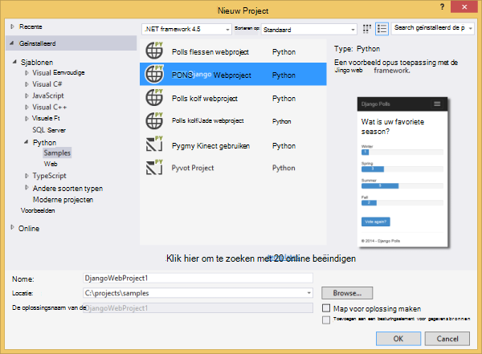
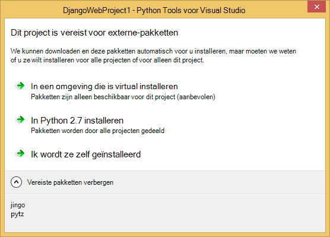
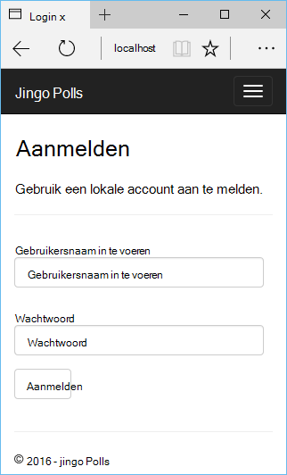
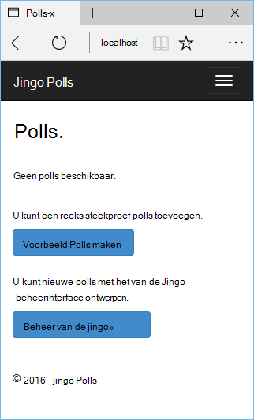
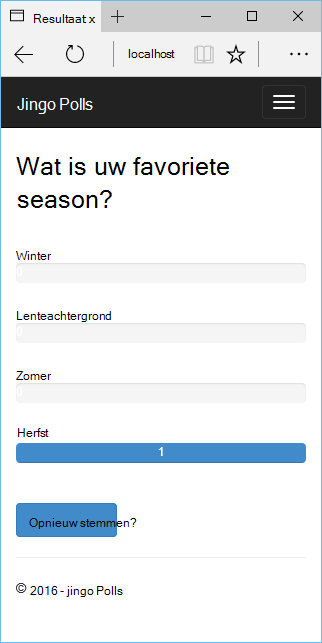
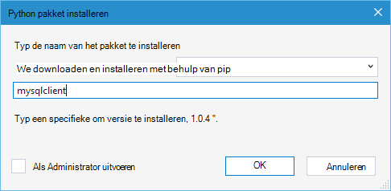
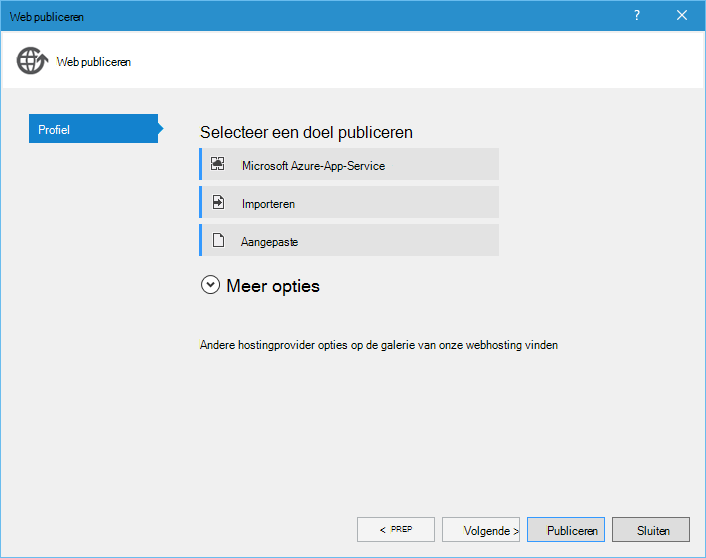
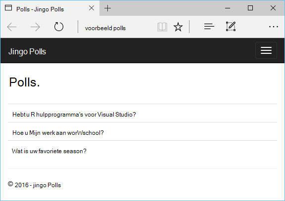

<properties 
    pageTitle="Django en MySQL op Azure met Python hulpprogramma's voor 2.2 voor Visual Studio" 
    description="Meer informatie over het gebruik van de hulpmiddelen Python voor Visual Studio om een WebApp Django dat gegevens worden opgeslagen in een exemplaar MySQL-database te maken en het dashboard implementeren naar Azure App Service Web Apps." 
    services="app-service\web" 
    documentationCenter="python" 
    authors="huguesv" 
    manager="wpickett" 
    editor=""/>

<tags 
    ms.service="app-service-web" 
    ms.workload="web" 
    ms.tgt_pltfrm="na" 
    ms.devlang="python"
    ms.topic="get-started-article" 
    ms.date="07/07/2016"
    ms.author="huvalo"/>

# Django en MySQL op Azure met Python hulpprogramma's voor 2.2 voor Visual Studio 

[AZURE.INCLUDE [tabs](../../includes/app-service-web-get-started-nav-tabs.md)]

In deze zelfstudie gebruikt u [Python Tools voor Visual Studio] (PTVS) om een eenvoudige polls WebApp met een van de voorbeeldsjablonen PTVS te maken. U leert hoe u een MySQL-service die worden gehost op Azure gebruikt, het configureren van de web-app als u wilt gebruiken, MySQL en hoe de web-app publiceren naar [Azure App Service Web Apps](http://go.microsoft.com/fwlink/?LinkId=529714).

> [AZURE.NOTE] De informatie in deze zelfstudie is ook beschikbaar in de volgende video:
> 
> [PTVS 2.1: Django app met MySQL][video]

Zie het [Python Developer Center] voor meer artikelen waarin de ontwikkeling van Azure App Service Web-Apps gebruiken met PTVS flessen, kolf en Django web-kaders, gebruikt met services van Azure Table Storage, MySQL en SQL-Database. Terwijl u in dit artikel ligt de nadruk op App-Service, wordt via de stappen lijken bij het ontwikkelen van [Azure-Cloudservices].

## Vereisten voor

 - Visual Studio-2015
 - [Python 2.7 32-bits] of [Python 3.4 32-bits]
 - [Python Tools 2.2 voor Visual Studio]
 - [Python Tools 2.2 voor Visual Studio voorbeelden VSIX]
 - [Azure SDK hulpprogramma's voor tegenover 2015]
 - Django 1,9 of hoger

[AZURE.INCLUDE [create-account-and-websites-note](../../includes/create-account-and-websites-note.md)]

<!-- This note should not render as part of the the previous include. -->

> [AZURE.NOTE] Als u aan de slag met Azure App Service wilt voordat u zich registreert voor een Azure-account, gaat u naar de [App-Service probeert](http://go.microsoft.com/fwlink/?LinkId=523751), waar u direct een tijdelijk starter in de browser in de App-Service maken kunt. Geen creditcard vereist is en geen verplichtingen nodig zijn.

## Het Project maken

In dit gedeelte maakt u een Visual Studio-project met een voorbeeldsjabloon. U kunt een virtuele omgeving maken en vereiste pakketten installeren. U kunt een lokale database met sqlite wilt maken. Vervolgens moet u de toepassing lokaal uitvoeren.

1. Selecteer in Visual Studio, **bestand**, **Nieuw Project**.

1. De project-sjablonen uit de [Python extra 2.2 voor Visual Studio voorbeelden VSIX] zijn beschikbaar onder **Python**, **voorbeelden**. Selecteer **Polls Django Web Project** en klik op OK om het project te maken.

    

1. U wordt gevraagd externe pakketten installeren. Selecteer **in een omgeving die is virtual installeren**.

    

1. Selecteer **Python 2.7** of **Python 3.4** als de basis interpreter.

    

1. In **Solution Explorer**met de rechtermuisknop op het projectknooppunt en selecteer **Python**en selecteer vervolgens **Django migreren**.  Selecteer vervolgens **Django maken beheerder**.

1. Hiermee wordt een Django Management Console openen en een sqlite-database maken in de projectmap. Volg de aanwijzingen voor het maken van een gebruiker.

1. Bevestig dat de toepassing door te drukken werkt `F5`.

1. Klik op **aanmelden** op de navigatiebalk aan de bovenkant van.

    

1. Voer de referenties voor de gebruiker die u hebt gemaakt wanneer u de database hebt gesynchroniseerd.

    

1. Klik op **voorbeeld Polls te maken**.

    

1. Klik op een peiling en stemmen.

    

## Een MySQL-Database maken

Voor de database maakt u een gehoste ClearDB MySQL-database op Azure.

Als alternatief, kunt u uw eigen virtuele Machine uitgevoerd in Azure wordt aangegeven, maken en vervolgens installeren en beheren van MySQL zelf.

U kunt een database maken met een gratis abonnement door deze stappen uit.

1. Meld u aan bij de [Portal van Azure].

1. Aan de bovenkant van het navigatiedeelvenster, klik op **Nieuw**en vervolgens op **gegevens + opslagruimte**en klik vervolgens op **MySQL-Database**. 

1. De nieuwe MySQL-database configureren door te maken van een nieuwe resourcegroep en selecteer de gewenste locatie voor deze.

1. Nadat de MySQL-database is gemaakt, klik op **Eigenschappen** in het blad database.

1. Gebruik de knop kopiëren naar de waarde van de **VERBINDINGSREEKS** op het Klembord te plaatsen.

## Het Project configureren

In deze sectie, gaat u onze WebApp als u wilt gebruiken de MySQL-database die u zojuist hebt gemaakt. U kunt ook extra Python-pakketten vereist voor het gebruik van MySQL-databases met Django installeren. Vervolgens moet u de web-app lokaal uitvoeren.

1. Open in Visual Studio, **settings.py**, uit de map *ProjectName* . Plak tijdelijk de verbindingsreeks in de editor. De verbindingsreeks is in deze indeling:

        Database=<NAME>;Data Source=<HOST>;User Id=<USER>;Password=<PASSWORD>

    Wijzig de standaard-database **ENGINE** MySQL gebruikt en de waarden voor de **naam**, **gebruiker**, **wachtwoord** en **HOST** uit de **CONNECTIONSTRING**instellen.

        DATABASES = {
            'default': {
                'ENGINE': 'django.db.backends.mysql',
                'NAME': '<Database>',
                'USER': '<User Id>',
                'PASSWORD': '<Password>',
                'HOST': '<Data Source>',
                'PORT': '',
            }
        }

1. In Solution Explorer onder **Python omgevingen**, met de rechtermuisknop op de virtuele omgeving en selecteer **Python-pakket installeren**.

1. Installeer het pakket `mysqlclient` **pip**gebruiken.

    

1. In **Solution Explorer**met de rechtermuisknop op het projectknooppunt en selecteer **Python**en selecteer vervolgens **Django migreren**.  Selecteer vervolgens **Django maken beheerder**.

    Hiermee maakt u de tabellen voor de MySQL-database die u in de vorige sectie hebt gemaakt. Volg de aanwijzingen voor het maken van een gebruiker, die niet moet overeenkomen met de gebruiker in de sqlite-database gemaakt in het eerste gedeelte van dit artikel.

1. Voer de toepassing met `F5`. Polls die zijn gemaakt met **Steekproef Polls maken** en de gegevens van de stemmen wordt worden serienummer in de MySQL-database.

## De webtoepassing publiceren naar Azure App-Service

De SDK van Azure .NET biedt een eenvoudige manier om uw web-app implementeren naar Azure App-Service.

1. In **Solution Explorer**met de rechtermuisknop op het projectknooppunt en selecteer **publiceren**.

    

1. Klik op **Microsoft Azure App-Service**.

1. Klik op **Nieuw** om een nieuwe WebApp te maken.

1. Vul de volgende velden en klik op **maken**:
    - **De naam van de Web-App**
    - **App-abonnement**
    - **Resourcegroep**
    - **Regio**
    - **Database-server** is ingesteld op **geen database** verlaten

1. Alle overige standaardwaarden accepteren en klik op **publiceren**.

1. Uw webbrowser wordt automatisch de gepubliceerde WebApp geopend. Hier ziet u de web-app werkt zoals verwacht, de **MySQL** -database die worden gehost op Azure gebruikt.

    

    Gefeliciteerd! U hebt uw MySQL gebaseerde web-app naar Azure gepubliceerd.

## Volgende stappen

Volg deze koppelingen voor meer informatie over de hulpmiddelen voor Python voor Visual Studio, Django en MySQL.

- [Python Tools voor Visual Studio-documentatie]
  - [Webprojecten]
  - [Cloud serviceprojecten]
  - [Externe foutopsporing op Microsoft Azure]
- [Django documentatie]
- [MySQL]

Zie het [Python Developer Center](/develop/python/)voor meer informatie.

<!--Link references-->

[Python Developer Center]: /develop/python/
[Azure Cloudservices]: ../cloud-services-python-ptvs.md

<!--External Link references-->

[Azure-Portal]: https://portal.azure.com
[Python Tools voor Visual Studio]: http://aka.ms/ptvs
[Python Tools 2.2 voor Visual Studio]: http://go.microsoft.com/fwlink/?LinkID=624025
[Python Tools 2.2 voor Visual Studio voorbeelden VSIX]: http://go.microsoft.com/fwlink/?LinkID=624025
[Azure SDK hulpprogramma's voor tegenover 2015]: http://go.microsoft.com/fwlink/?LinkId=518003
[Python 2.7 32-bits]: http://go.microsoft.com/fwlink/?LinkId=517190 
[Python 3.4 32-bits]: http://go.microsoft.com/fwlink/?LinkId=517191
[Python Tools voor Visual Studio-documentatie]: http://aka.ms/ptvsdocs
[Externe foutopsporing op Microsoft Azure]: http://go.microsoft.com/fwlink/?LinkId=624026
[Webprojecten]: http://go.microsoft.com/fwlink/?LinkId=624027
[Cloud serviceprojecten]: http://go.microsoft.com/fwlink/?LinkId=624028
[Django documentatie]: https://www.djangoproject.com/
[MySQL]: http://www.mysql.com/
[video]: http://youtu.be/oKCApIrS0Lo
