<properties 
    pageTitle="Django en SQL-Database op Azure met Python hulpprogramma's voor 2.2 voor Visual Studio" 
    description="Meer informatie over het gebruik van de hulpmiddelen Python voor Visual Studio om een WebApp Django dat gegevens worden opgeslagen in een exemplaar van SQL-database te maken en het dashboard implementeren naar Azure App Service Web Apps." 
    services="app-service\web" 
    tags="python"
    documentationCenter="python" 
    authors="huguesv" 
    manager="wpickett" 
    editor=""/>

<tags 
    ms.service="app-service-web" 
    ms.workload="web" 
    ms.tgt_pltfrm="na" 
    ms.devlang="python" 
    ms.topic="article" 
    ms.date="07/07/2016"
    ms.author="huguesv"/>

# Django en SQL-Database op Azure met Python hulpprogramma's voor 2.2 voor Visual Studio 

In deze zelfstudie gebruiken we [Python Tools voor Visual Studio] om een eenvoudige polls WebApp met een van de voorbeeldsjablonen PTVS te maken. Deze zelfstudie is ook beschikbaar als een [video](https://www.youtube.com/watch?v=ZwcoGcIeHF4).

We leert hoe u een SQL-database die worden gehost op Azure gebruikt, het configureren van de web-app als een SQL-database wilt gebruiken en hoe de web-app publiceren naar [Azure App Service Web Apps](http://go.microsoft.com/fwlink/?LinkId=529714).

Zie het [Python Developer Center] voor meer artikelen waarin de ontwikkeling van Azure App Service Web-Apps gebruiken met PTVS flessen, kolf en Django web-kaders, gebruikt met services van Azure Table Storage, MySQL en SQL-Database. Terwijl u in dit artikel ligt de nadruk op App-Service, wordt via de stappen lijken bij het ontwikkelen van [Azure-Cloudservices].

## Vereisten voor

 - Visual Studio-2015
 - [Python 2.7 32-bits]
 - [Python Tools 2.2 voor Visual Studio]
 - [Python Tools 2.2 voor Visual Studio voorbeelden VSIX]
 - [Azure SDK hulpprogramma's voor tegenover 2015]
 - Django 1,9 of hoger

[AZURE.INCLUDE [create-account-and-websites-note](../../includes/create-account-and-websites-note.md)]

>[AZURE.NOTE] Als u aan de slag met Azure App Service wilt voordat u zich registreert voor een Azure-account, gaat u naar de [App-Service probeert](http://go.microsoft.com/fwlink/?LinkId=523751), waar u direct een tijdelijk starter in de browser in de App-Service maken kunt. Geen creditcards vereist; geen verplichtingen.

## Het Project maken

In dit gedeelte maakt we een Visual Studio-project met een voorbeeldsjabloon. We een virtuele omgeving maken en vereiste pakketten installeren. Maken we een lokale database sqlite gebruiken. Vervolgens gaat we de web-app lokaal uitvoeren.

1.  Selecteer in Visual Studio, **bestand**, **Nieuw Project**.

1.  De project-sjablonen uit de [Python extra 2.2 voor Visual Studio voorbeelden VSIX] zijn beschikbaar onder **Python**, **voorbeelden**. Selecteer **Polls Django Web Project** en klik op OK om het project te maken.

    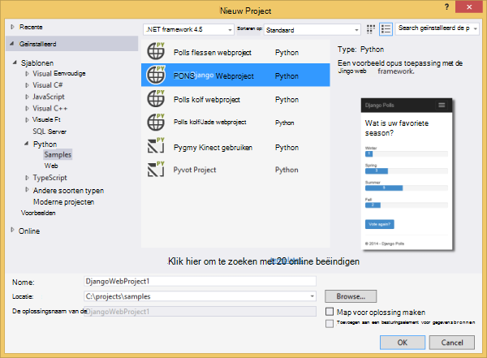

1.  U wordt gevraagd externe pakketten installeren. Selecteer **in een omgeving die is virtual installeren**.

    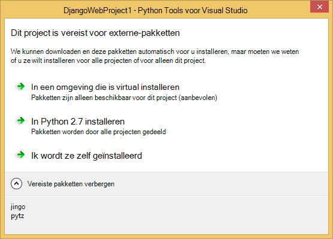

1.  Selecteer **Python 2.7** als de basis interpreter.

    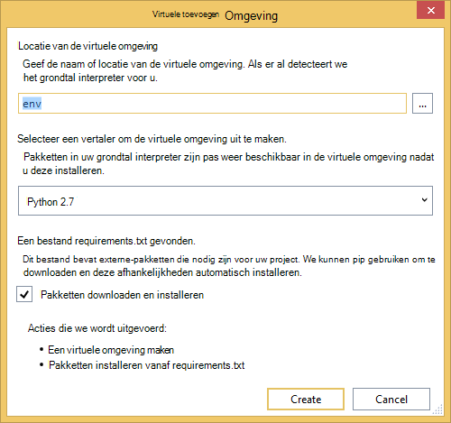

1.  In **Solution Explorer**met de rechtermuisknop op het projectknooppunt en selecteer **Python**en selecteer vervolgens **Django migreren**.  Selecteer vervolgens **Django maken beheerder**.

1.  Hiermee wordt een Django Management Console openen en een sqlite-database maken in de projectmap. Volg de aanwijzingen voor het maken van een gebruiker.

1.  Bevestig dat de toepassing werkt door op <kbd>F5</kbd>te drukken.

1.  Klik op **aanmelden** op de navigatiebalk aan de bovenkant van.

    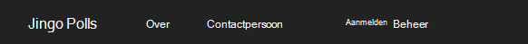

1.  Voer de referenties voor de gebruiker die u hebt gemaakt wanneer u de database hebt gesynchroniseerd.

    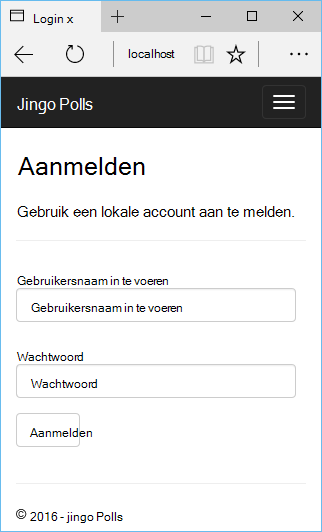

1.  Klik op **voorbeeld Polls te maken**.

    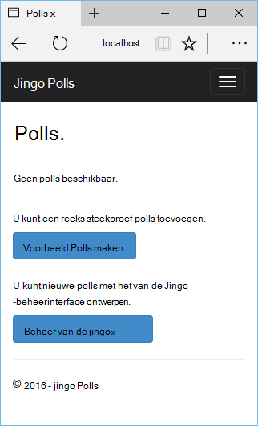

1.  Klik op een peiling en stemmen.

    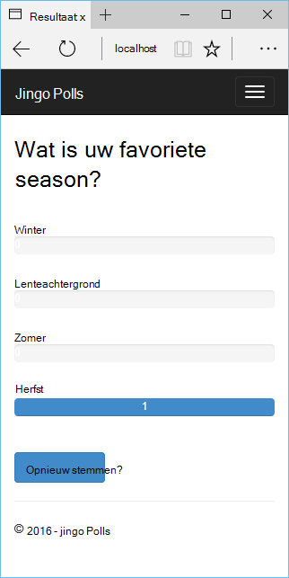

## Een SQL-Database maken

Voor de database, gaan we een Azure SQL-database maken.

U kunt een database maken door deze stappen uit.

1.  Meld u aan bij de [Portal van Azure].

1.  Onder aan het navigatiedeelvenster en klikt u op **Nieuw**. , klikt u op **gegevens + opslagruimte** > **SQL-Database**.

1.  De nieuwe SQL-Database configureren door te maken van een nieuwe resourcegroep en selecteer de gewenste locatie voor deze.

1.  Nadat de SQL-Database is gemaakt, klik op **openen in Visual Studio** in het blad database.
2.  Klik op **configureren uw firewall**.
3.  In het blad **Firewallinstellingen** toevoegen dat een firewallregel met **IP-begin** en **Einde IP** ingesteld op het openbare IP-adres van uw computer ontwikkeling. Klik op **Opslaan**.

    Hierdoor kunnen verbindingen met de databaseserver van uw computer ontwikkeling.

4.  Terug in het blad database, klikt u op **Eigenschappen**te en klik op **database-verbindingstekenreeksen weergeven**te klikken. 

2.  Gebruik de knop kopiëren naar de waarde van **ADO.NET** op het Klembord te plaatsen.

## Het Project configureren

In dit gedeelte wordt we onze web-app voor het gebruik van de SQL-database die we zojuist hebt gemaakt configureren. We wordt ook extra Python-pakketten vereist voor het gebruik van de SQL-databases met Django installeren. Vervolgens gaat we de web-app lokaal uitvoeren.

1.  Open in Visual Studio, **settings.py**, uit de map *ProjectName* . Plak tijdelijk de verbindingsreeks in de editor. De verbindingsreeks is in deze indeling:

        Server=<ServerName>,<ServerPort>;Database=<DatabaseName>;User ID=<UserName>;Password={your_password_here};Encrypt=True;TrustServerCertificate=False;Connection Timeout=30;

Bewerk de definitie van `DATABASES` gebruik van de bovenstaande waarden.

        DATABASES = {
            'default': {
                'ENGINE': 'sql_server.pyodbc',
                'NAME': '<DatabaseName>',
                'USER': '<UserName>',
                'PASSWORD': '{your_password_here}',
                'HOST': '<ServerName>',
                'PORT': '<ServerPort>',
                'OPTIONS': {
                    'driver': 'SQL Server Native Client 11.0',
                    'MARS_Connection': 'True',
                }
            }
        }

1.  In Solution Explorer onder **Python omgevingen**, met de rechtermuisknop op de virtuele omgeving en selecteer **Python-pakket installeren**.

1.  Installeer het pakket `pyodbc` **pip**gebruiken.

    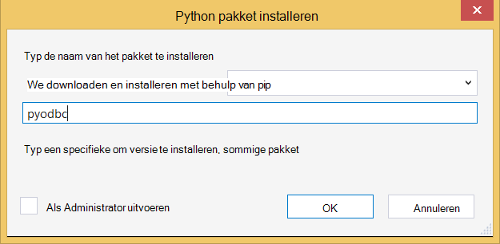

1.  Installeer het pakket `django-pyodbc-azure` **pip**gebruiken.

    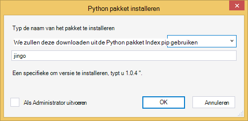

1.  In **Solution Explorer**met de rechtermuisknop op het projectknooppunt en selecteer **Python**en selecteer vervolgens **Django migreren**.  Selecteer vervolgens **Django maken beheerder**.

    Hiermee maakt u de tabellen voor de SQL-database die u hebt gemaakt in de vorige sectie. Volg de aanwijzingen voor het maken van een gebruiker, die niet moet overeenkomen met de gebruiker in de sqlite-database gemaakt in de eerste sectie.

1.  Voer de toepassing met `F5`. Polls die zijn gemaakt met **Steekproef Polls maken** en de gegevens van de stemmen wordt worden serienummer in de SQL-database.

## De webtoepassing publiceren naar Azure App-Service

De SDK van Azure .NET biedt een eenvoudige manier om uw web-web-app implementeren naar Azure App Service Web Apps.

1.  In **Solution Explorer**met de rechtermuisknop op het projectknooppunt en selecteer **publiceren**.

    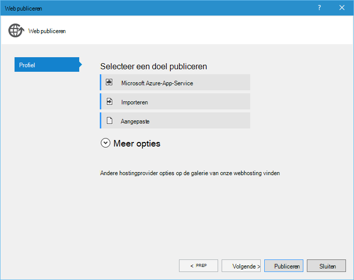

1.  Klik op **Microsoft Azure WebApps**.

1.  Klik op **Nieuw** om een nieuwe WebApp te maken.

1.  Vul de volgende velden en klik op **maken**.
    -   **De naam van de Web-App**
    -   **App-abonnement**
    -   **Resourcegroep**
    -   **Regio**
    -   **Database-server** is ingesteld op **geen database** verlaten

1.  Alle overige standaardwaarden accepteren en klik op **publiceren**.

1.  Uw webbrowser wordt automatisch de gepubliceerde WebApp geopend. Ziet u de web-app werkt zoals verwacht, met de **SQL** -database die worden gehost op Azure.

    Gefeliciteerd!

    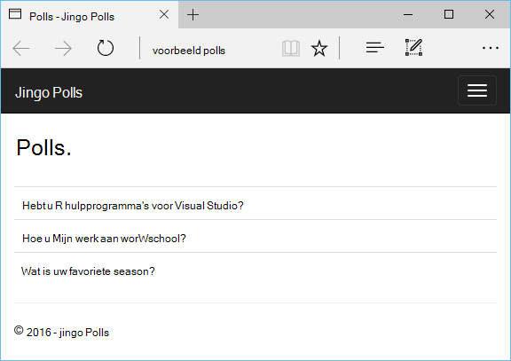

## Volgende stappen

Volg deze koppelingen voor meer informatie over de hulpmiddelen voor Python voor Visual Studio, Django en SQL-Database.

- [Python Tools voor Visual Studio-documentatie]
  - [Webprojecten]
  - [Cloud serviceprojecten]
  - [Externe foutopsporing op Microsoft Azure]
- [Django documentatie]
- [SQL-Database]

## Wat er gewijzigd
* Zie voor een handleiding voor het wijzigen van Websites naar App Service: [Azure App-Service en de invloed op bestaande Azure-Services](http://go.microsoft.com/fwlink/?LinkId=529714)

<!--Link references-->
[Python Developer Center]: /develop/python/
[Azure Cloudservices]: ../cloud-services-python-ptvs.md

<!--External Link references-->
[Azure-Portal]: https://portal.azure.com
[Python Tools voor Visual Studio]: http://aka.ms/ptvs
[Python Tools 2.2 voor Visual Studio]: http://go.microsoft.com/fwlink/?LinkID=624025
[Python Tools 2.2 voor Visual Studio voorbeelden VSIX]: http://go.microsoft.com/fwlink/?LinkID=624025
[Azure SDK hulpprogramma's voor tegenover 2015]: http://go.microsoft.com/fwlink/?LinkId=518003
[Python 2.7 32-bits]: http://go.microsoft.com/fwlink/?LinkId=517190 
[Python Tools voor Visual Studio-documentatie]: http://aka.ms/ptvsdocs
[Externe foutopsporing op Microsoft Azure]: http://go.microsoft.com/fwlink/?LinkId=624026
[Webprojecten]: http://go.microsoft.com/fwlink/?LinkId=624027
[Cloud serviceprojecten]: http://go.microsoft.com/fwlink/?LinkId=624028
[Django documentatie]: https://www.djangoproject.com/
[SQL-Database]: /documentation/services/sql-database/
