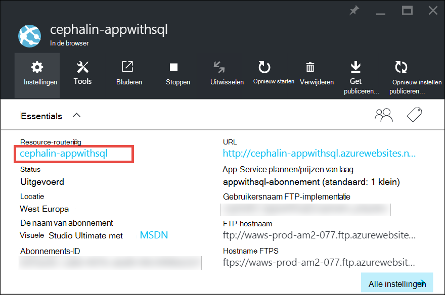
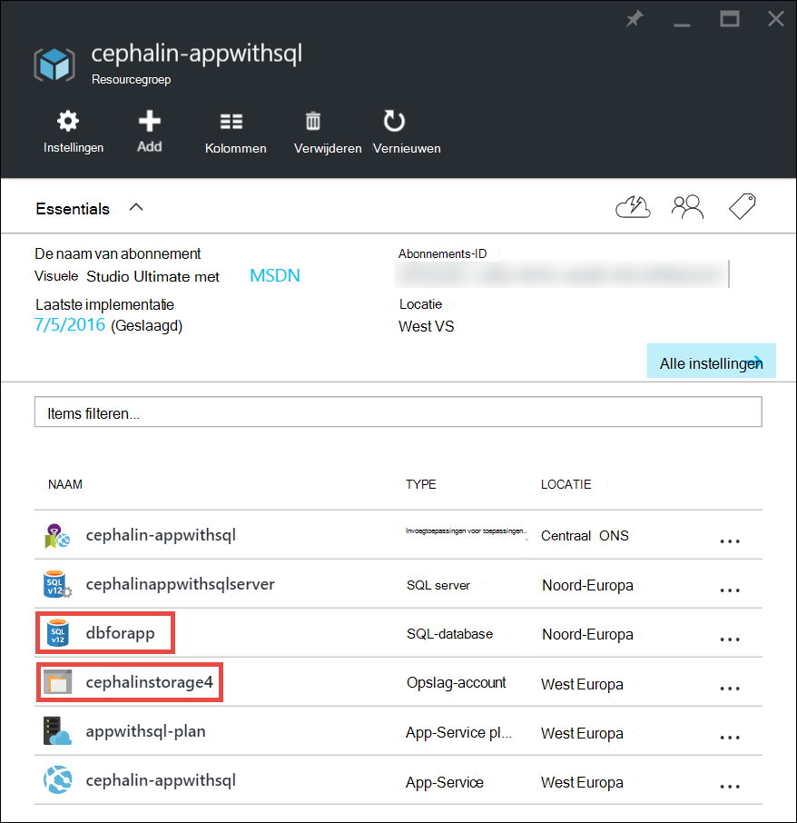
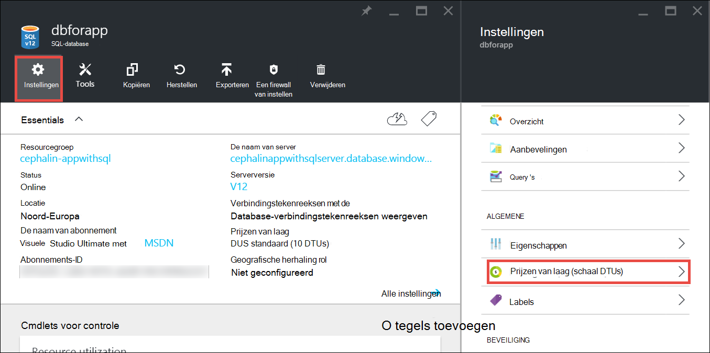
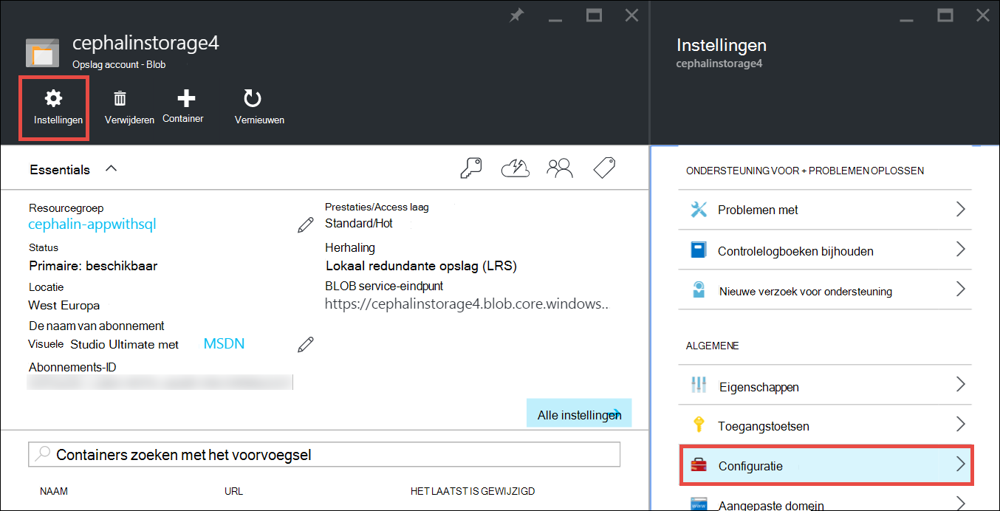

<properties
    pageTitle="Een app in Azure schalen | Microsoft Azure"
    description="Leer hoe u de schaal van een app in Azure App Service capaciteit en functies toevoegen."
    services="app-service"
    documentationCenter=""
    authors="cephalin"
    manager="wpickett"
    editor="mollybos"/>

<tags
    ms.service="app-service"
    ms.workload="na"
    ms.tgt_pltfrm="na"
    ms.devlang="na"
    ms.topic="article"
    ms.date="07/05/2016"
    ms.author="cephalin"/>

# Een app in Azure vergroten #

In dit artikel leest u hoe u de schaal van de app in Azure App-Service. Er zijn twee werkstromen voor schaal, schaal omhoog en schaal af en in dit artikel wordt uitgelegd de schaal van de werkstroom.

- [Schalen](https://en.wikipedia.org/wiki/Scalability#Horizontal_and_vertical_scaling): meer CPU, geheugen, schijfruimte en extra functies beschikbaar, zoals speciale virtuele machines (VMs), aangepaste domeinen en certificaten, tijdelijke sleuven, autoscaling en meer. U vergroten door te wijzigen van de prijzen laag van de App serviceplan waartoe uw app behoort.
- [Schaal af](https://en.wikipedia.org/wiki/Scalability#Horizontal_and_vertical_scaling): het aantal exemplaren van VM waarop uw app vergroten.
U kunt schalen af in maximaal 20-exemplaren, afhankelijk van uw prijzen laag. [App serviceomgevingen](../app-service/app-service-app-service-environments-readme.md) in **Premium** laag wordt het aantal schalen in 50 exemplaren verder vergroten. Voor meer informatie over het schalen, Zie [schalen dat exemplaar tellen handmatig of automatisch](../monitoring-and-diagnostics/insights-how-to-scale.md). Er vindt u informatie over het gebruik van autoscaling, wordt aan de nieuwe schaal exemplaar tellen automatisch op basis van de vooraf gedefinieerde regels en planningen.

De schaalinstellingen seconden duren voordat alleen gelden en invloed op alle apps in uw [App-abonnement](../app-service/azure-web-sites-web-hosting-plans-in-depth-overview.md).
Ze hoeven niet kunt wijzigen van uw code of de toepassing opnieuw distribueren.

Zie voor informatie over de prijzen en de functies van afzonderlijke App Service-abonnementen, [Prijzen Appdetails Service](/pricing/details/web-sites/).  

> [AZURE.NOTE] Voordat u een App-serviceplan uit de laag **gratis** overstapt, moet u eerst verwijderen de [limieten uitgaven](/pricing/spending-limits/) op hun plaats staan voor uw Azure-abonnement. Als u wilt weergeven of wijzigen van de opties voor uw App-Service van Microsoft Azure-abonnement, raadpleegt u [Abonnementen op Microsoft Azure][azuresubscriptions].

## De schaal van de prijzen laag aanpassen

1. Open de [portal van Azure]in uw browser[portal].

2. In van uw app blade, klikt u op **alle instellingen**en klik vervolgens op **Schaal omhoog**.

    ![Ga als u uw Azure-App wilt verkleinen.][ChooseWHP]

4. Kies de laag en klik vervolgens op **selecteren**.

    Het tabblad **meldingen** wordt een groene **SUCCESS** flash nadat de bewerking voltooid is.

## Verwante resources schaal
Als uw app is afhankelijk van andere services, zoals Azure SQL-Database of Azure-opslag, kunt u ook deze resources op basis van uw behoeften schalen. Deze resources worden geen schaal met het App-abonnement en afzonderlijk moeten worden aangepast.

1. **Essentials**, klik op de koppeling van het **resourceveld groep** .

    

2. Klik in het gedeelte **Overzicht** van het blad **resourcegroep** , op een resource die u wilt schalen. De volgende schermafbeelding ziet u een resource SQL-Database en een resource Azure Storage.

    

3. Klik op **Instellingen**voor een resource worden in SQL-Database > **prijzen laag** aan de nieuwe schaal de prijzen trapsgewijs.

    

    U kunt ook [geografische herhaling](../sql-database/sql-database-geo-replication-overview.md) inschakelen voor uw exemplaar van de SQL-Database.

    Klik op **Instellingen**voor een resource Azure Storage > **configuratie** te vergroten uw opslagopties.

    

## Meer informatie over functies voor ontwikkelaars
Afhankelijk van de prijzen laag zijn de volgende functies voor ontwikkelaars-georiënteerd beschikbaar:

### Bitness ###

- De lagen **Basic**, **Standard**en **Premium** ondersteuning voor 64-bits en 32-bits-toepassingen.
- De **gratis** en een **gedeeld** abonnement lagen ondersteuning voor alleen 32-bits-toepassingen.

### Ondersteuning voor foutopsporing ###

- Ondersteuning voor foutopsporing is beschikbaar voor de **gratis**, **gedeeld**en **eenvoudige** modi op één verbinding per App serviceplan.
- Ondersteuning voor foutopsporing is beschikbaar voor de **standaard** - en **Premium** modi op vijf verbindingen per App serviceplan.

## Meer informatie over andere functies

- Zie voor gedetailleerde informatie over alle resterende functies in de App Service-abonnementen, met inbegrip van prijzen en functies van belang zijn voor alle gebruikers (inclusief ontwikkelaars), [Prijzen Appdetails Service](/pricing/details/web-sites/).

>[AZURE.NOTE] Als u aan de slag met Azure App Service wilt voordat u zich aanmeldt voor een Azure-account, gaat u naar [De App-Service probeert](http://go.microsoft.com/fwlink/?LinkId=523751) waarop u direct een tijdelijk starter in de browser in de App-Service maken kunt. Er zijn geen creditcards vereist en er zijn geen verplichtingen.

## Volgende stappen

- Zie [Microsoft Azure gratis proefversie](/pricing/free-trial/)om aan de slag met Azure.
- Ga naar de volgende koppelingen voor informatie over prijzen, ondersteuning en SLA.

    [Gegevens worden overgebracht prijsgegevens](/pricing/details/data-transfers/)

    [Microsoft Azure ondersteuningsplannen](/support/plans/)

    [Serviceovereenkomsten](/support/legal/sla/)

    [SQL-Database prijzen Details](/pricing/details/sql-database/)

    [VM en Cloud-Service grootten voor Microsoft Azure][vmsizes]

    [App prijzen servicedetails](/pricing/details/app-service/)

    [App-Service prijzen Details - SSL-verbindingen](/pricing/details/web-sites/#ssl-connections)

- Zie voor informatie over Azure App Service aanbevolen procedures, inclusief het bouwen van een architectuur scalable en robuust [Aanbevolen procedures: Azure App Service Web Apps](http://blogs.msdn.com/b/windowsazure/archive/2014/02/10/best-practices-windows-azure-websites-waws.aspx).

- Zie de volgende bronnen voor video's over de schaal van de App Service apps:

    - [Wanneer u de schaal van Azure Websites - met Stefan Schackow aanpassen](/documentation/videos/azure-web-sites-free-vs-standard-scaling/)
    - [Automatisch schaalbaarheid van Azure Websites, processor of geplande - met Stefan Schackow](/documentation/videos/auto-scaling-azure-web-sites/)
    - [Hoe Azure Websites schalen - met Stefan Schackow](/documentation/videos/how-azure-web-sites-scale/)

<!-- LINKS -->
[vmsizes]:/pricing/details/app-service/
[SQLaccountsbilling]:http://go.microsoft.com/fwlink/?LinkId=234930
[azuresubscriptions]:http://go.microsoft.com/fwlink/?LinkID=235288
[portal]: https://portal.azure.com/

<!-- IMAGES -->
[ChooseWHP]: ./media/web-sites-scale/scale1ChooseWHP.png
[ChooseBasicInstances]: ./media/web-sites-scale/scale2InstancesBasic.png
[SaveButton]: ./media/web-sites-scale/05SaveButton.png
[BasicComplete]: ./media/web-sites-scale/06BasicComplete.png
[ScaleStandard]: ./media/web-sites-scale/scale3InstancesStandard.png
[Autoscale]: ./media/web-sites-scale/scale4AutoScale.png
[SetTargetMetrics]: ./media/web-sites-scale/scale5AutoScaleTargetMetrics.png
[SetFirstRule]: ./media/web-sites-scale/scale6AutoScaleFirstRule.png
[SetSecondRule]: ./media/web-sites-scale/scale7AutoScaleSecondRule.png
[SetThirdRule]: ./media/web-sites-scale/scale8AutoScaleThirdRule.png
[SetRulesFinal]: ./media/web-sites-scale/scale9AutoScaleFinal.png
[ResourceGroup]: ./media/web-sites-scale/scale10ResourceGroup.png
[ScaleDatabase]: ./media/web-sites-scale/scale11SQLScale.png
[GeoReplication]: ./media/web-sites-scale/scale12SQLGeoReplication.png
