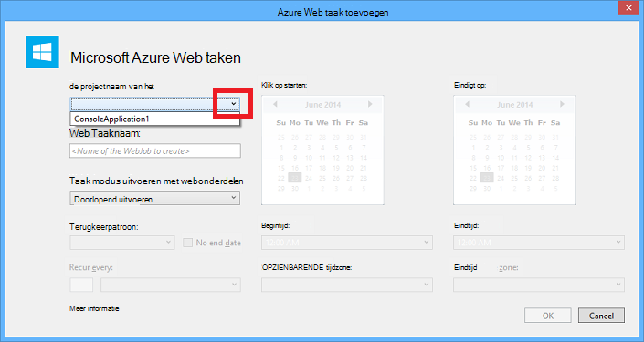

<properties 
    pageTitle="Gebruik van Visual Studio WebJobs implementeren" 
    description="Informatie over het implementeren van Azure WebJobs naar Azure-App Service Web Apps met behulp van Visual Studio." 
    services="app-service" 
    documentationCenter="" 
    authors="tdykstra" 
    manager="wpickett" 
    editor="jimbe"/>

<tags 
    ms.service="app-service" 
    ms.devlang="dotnet" 
    ms.topic="article" 
    ms.tgt_pltfrm="na" 
    ms.workload="na" 
    ms.date="04/27/2016" 
    ms.author="tdykstra"/>

# Gebruik van Visual Studio WebJobs implementeren

## Overzicht

In dit onderwerp wordt uitgelegd hoe u een project-Console-toepassing implementeren naar een WebApp in de [App Service](http://go.microsoft.com/fwlink/?LinkId=529714) als een [Azure WebJob](http://go.microsoft.com/fwlink/?LinkId=390226)met Visual Studio. Zie voor informatie over het implementeren van WebJobs met behulp van de [Portal van Azure](https://portal.azure.com) [achtergrondtaken met WebJobs uitvoeren](web-sites-create-web-jobs.md).

Als Visual Studio een project WebJobs Console-toepassingen implementeert, worden twee taken uitgevoerd:

* Kopieën runtime-bestanden naar de gewenste map in de web-app (*App_Data/taken/continue* voor doorlopende WebJobs, *App_Data/taken/geactiveerd* voor geplande en op aanvraag WebJobs).
* [Azure Scheduler taken](#scheduler) voor WebJobs die zijn gepland om uit te voeren op bepaalde momenten ingesteld. (Dit is niet nodig voor doorlopende WebJobs.)

Een project WebJobs ingeschakelde heeft de volgende items toegevoegd:

* Het pakket van [Microsoft.Web.WebJobs.Publish](http://www.nuget.org/packages/Microsoft.Web.WebJobs.Publish/) NuGet.
* Een [webjob-publiceren-settings.json](#publishsettings) -bestand met de implementatie- en scheduler-instellingen. 

U kunt deze items toevoegen aan een bestaand project in de Console-toepassing of een sjabloon gebruiken om een nieuwe WebJobs Console-toepassingen project te maken. 

U kunt een project te implementeren als een WebJob op zichzelf of koppelen aan een webproject zodanig dat deze automatisch geïmplementeerd wanneer u het webproject implementeren. De naam van het project WebJobs ingeschakelde worden in Visual Studio om projecten te koppelen, bevat in een bestand [webjobs-list.json](#webjobslist) in het webproject.

## Vereisten voor

WebJobs implementatiefuncties zijn beschikbaar in Visual Studio-2015 tijdens de installatie van de Azure-SDK voor .NET:

* [Azure SDK voor .NET (Visual Studio-2015)](http://go.microsoft.com/fwlink/?linkid=518003).

## WebJobs implementatie van een bestaand project in de Console-toepassing inschakelen

U hebt twee opties:

* [Automatische-implementatie waarbij een webproject inschakelen](#convertlink).

    Een bestaand project in de Console-toepassing zodanig configureren dat deze automatisch als een WebJob hebt geïmplementeerd, wanneer u een webproject implementeert. Gebruik deze optie als u wilt uw WebJob uitvoeren in dezelfde WebApp waarin u de gerelateerde webtoepassing uitvoeren.

* [Implementatie zonder een webproject inschakelen](#convertnolink).

    Een bestaand project Console-toepassing voor de implementatie als een WebJob door zelf, met geen koppeling naar een webproject configureren. Gebruik deze optie als u wilt uitvoeren van een WebJob in een WebApp op zichzelf, waarop geen webtoepassing wordt uitgevoerd in de WebApp. Het is raadzaam dit wilt doen om te kunnen schalen dat uw resources WebJob afzonderlijk van uw bronnen van webtoepassingen zoeken.

### Automatische WebJobs-implementatie waarbij een webproject inschakelen
  
1. Met de rechtermuisknop op het webproject in **Solution Explorer**en klik vervolgens op **toevoegen** > **Bestaand Project als Azure WebJob**.

    
    
    Het dialoogvenster [Azure WebJob toevoegen](#configure) wordt weergegeven.

1. Selecteer in de vervolgkeuzelijst **Projectnaam** het project Console-toepassing toe te voegen als een WebJob.

    

2. Het dialoogvenster [Toevoegen Azure WebJob](#configure) voltooien en klik vervolgens op **OK**. 

### WebJobs implementatie zonder een webproject inschakelen
  
1. Met de rechtermuisknop op het project-Console-toepassing in **Solution Explorer**en klik op **publiceren als Azure WebJob**. 

    
    
    Het dialoogvenster [Azure WebJob toevoegen](#configure) wordt weergegeven, met het project dat is geselecteerd in het vak **Projectnaam** .

2.  Vul het dialoogvenster [Azure WebJob toevoegen](#configure) en klik vervolgens op **OK**.

    De wizard **Publiceren** wordt weergegeven.  Als u niet dat onmiddellijk publiceren wilt, sluit u de wizard. De instellingen die u hebt ingevoerd voor opgeslagen wanneer u [implementeren van het project wilt](#deploy).

## Een nieuw WebJobs ingeschakelde project maken

U kunt een nieuwe WebJobs ingeschakelde als project wilt maken, gebruikt u de projectsjabloon Console-toepassing en inschakelen van WebJobs implementatie zoals beschreven in [de vorige sectie](#convert). Als alternatief, kunt u de WebJobs nieuw project-sjabloon gebruiken:

* [Gebruik van de WebJobs nieuw project-sjabloon voor een onafhankelijke WebJob](#createnolink)

    Een project maken en configureer deze voor de implementatie op zichzelf als een WebJob, met geen koppeling naar een webproject. Gebruik deze optie als u wilt uitvoeren van een WebJob in een WebApp op zichzelf, waarop geen webtoepassing wordt uitgevoerd in de WebApp. Het is raadzaam dit wilt doen om te kunnen schalen dat uw resources WebJob afzonderlijk van uw bronnen van webtoepassingen zoeken.

* [Gebruik van de WebJobs nieuw project-sjabloon voor een WebJob die is gekoppeld aan een webproject](#createlink)

    Maak een project dat is geconfigureerd voor het automatisch als een WebJob implementeren wanneer een webproject in dezelfde oplossing wordt geïmplementeerd. Gebruik deze optie als u wilt uw WebJob uitvoeren in dezelfde WebApp waarin u de gerelateerde webtoepassing uitvoeren.

> [AZURE.NOTE] De WebJobs nieuw project-sjabloon wordt automatisch NuGet-pakketten is geïnstalleerd en code bevat in *Program.cs* voor de [WebJobs SDK](http://www.asp.net/aspnet/overview/developing-apps-with-windows-azure/getting-started-with-windows-azure-webjobs). Als u niet wilt gebruiken de WebJobs SDK of wilt gebruiken van een geplande in plaats van continue WebJob, verwijderen of wijzigen de `host.RunAndBlock` -instructie in *Program.cs*.

### Gebruik van de WebJobs nieuw project-sjabloon voor een onafhankelijke WebJob
  
1. Klik op **bestand** > **Nieuw Project**, en klik vervolgens in het dialoogvenster **Nieuw Project** op **Cloud** > **Microsoft Azure WebJob**.

    
    
2. Volg de aanwijzingen getoond eerder, [zodat de Console-toepassing een onafhankelijke WebJobs project project](#convertnolink).

### Gebruik van de WebJobs nieuw project-sjabloon voor een WebJob die is gekoppeld aan een webproject

1. Met de rechtermuisknop op het webproject in **Solution Explorer**en klik vervolgens op **toevoegen** > **Nieuw Azure WebJob Project**.

    

    Het dialoogvenster [Azure WebJob toevoegen](#configure) wordt weergegeven.

2. Vul het dialoogvenster [Azure WebJob toevoegen](#configure) en klik vervolgens op **OK**.

## Het dialoogvenster Azure WebJob toevoegen

Het dialoogvenster **Azure WebJob toevoegen** kunt u WebJob naam en de instellingen voor uw WebJob plannen. 

De velden in dit dialoogvenster overeen met velden in het dialoogvenster **Nieuwe taak** van de Azure-Portal. Zie [achtergrondtaken met WebJobs uitvoeren](web-sites-create-web-jobs.md)voor meer informatie.

Visual Studio maakt voor een geplande WebJob (niet voor doorlopende WebJobs), een siteverzameling van de taak [Azure Scheduler](/services/scheduler/) als een nog niet bestaat en dat een taak in de siteverzameling wordt gemaakt:

* Het verzamelen van de taak scheduler heet *WebJobs-{regionname}* waarbij *{regionname}* naar het gebied het web verwijst app wordt gehost. Bijvoorbeeld: WebJobs-WestUS.
* De taak scheduler heet *{webappname}-{webjobname}*. Bijvoorbeeld: MyWebApp-MyWebJob. 
 
>[AZURE.NOTE]
> 
>* Zie voor informatie over de opdrachtregel implementatie, [opdrachtregel inschakelen of doorlopend bezorging van Azure WebJobs](/blog/2014/08/18/enabling-command-line-or-continuous-delivery-of-azure-webjobs/).
>* Als u een **Terugkerende taak** configureren en terugkeerfrequentie op een aantal minuten instellen, is de Scheduler Azure-service niet gratis. Andere frequentie (uur, dagen, enzovoort) zijn gratis.
>* Als u een WebJob implementeren en vervolgens besluit dat u wilt wijzigen van het type WebJob en opnieuw distribueren, moet u het bestand webjobs-publiceren-settings.json verwijderen. Hiermee maakt Visual Studio de publicatieopties opnieuw weergeven zodat u het type WebJob kunt wijzigen.
>* Als u een WebJob implementeren en later wijzigen van de modus voor het uitvoeren van continue in niet-doorlopende of vice versa, Visual Studio Hiermee maakt u een nieuwe WebJob in Azure wordt aangegeven wanneer u Implementeer deze opnieuw. Als u andere instellingen voor planning wijzigen, maar de voor- of schakelen tussen gepland en op aanvraag uitvoeren modus hetzelfde verlaten, Visual Studio de bestaande taak wordt bijgewerkt in plaats van een nieuwe record maken.

## webjob-publiceren-settings.json

Als u een Console-programma voor WebJobs implementatie configureert, wordt er in Visual Studio het [Microsoft.Web.WebJobs.Publish](http://www.nuget.org/packages/Microsoft.Web.WebJobs.Publish/) NuGet-pakket is geïnstalleerd en slaat planning gegevens in een bestand *webjob-publiceren-settings.json* in de projectmap *Eigenschappen* van het project WebJobs. Hier volgt een voorbeeld van het bestand:

        {
          "$schema": "http://schemastore.org/schemas/json/webjob-publish-settings.json",
          "webJobName": "WebJob1",
          "startTime": "2014-06-23T00:00:00-08:00",
          "endTime": "2014-06-27T00:00:00-08:00",
          "jobRecurrenceFrequency": "Minute",
          "interval": 5,
          "runMode": "Scheduled"
        }

U kunt dit bestand rechtstreeks bewerken en Visual Studio beschikt u over IntelliSense. Het schema van het bestand is opgeslagen in [http://schemastore.org](http://schemastore.org/schemas/json/webjob-publish-settings.json) en er kan worden weergegeven.  

>[AZURE.NOTE]
>
>* Als u een **Terugkerende taak** configureren en terugkeerfrequentie op een aantal minuten instellen, is de Scheduler Azure-service niet gratis. Andere frequentie (uur, dagen, enzovoort) zijn gratis.

## webjobs-list.json

Wanneer u een project WebJobs ingeschakelde aan een webproject koppelt, wordt de naam van het project WebJobs in Visual Studio opgeslagen in een bestand *webjobs-list.json* in van het webproject *Eigenschappen van* map. De lijst kan meerdere WebJobs projecten, bevatten, zoals wordt weergegeven in het volgende voorbeeld:

        {
          "$schema": "http://schemastore.org/schemas/json/webjobs-list.json",
          "WebJobs": [
            {
              "filePath": "../ConsoleApplication1/ConsoleApplication1.csproj"
            },
            {
              "filePath": "../WebJob1/WebJob1.csproj"
            }
          ]
        }

U kunt dit bestand rechtstreeks bewerken en Visual Studio beschikt u over IntelliSense. Het schema van het bestand is opgeslagen in [http://schemastore.org](http://schemastore.org/schemas/json/webjobs-list.json) en er kan worden weergegeven.
  
## Een project WebJobs implementeren

Een project WebJobs die u hebt gekoppeld aan een webproject implementeert automatisch met de webproject. Zie voor informatie over de implementatie van project web [implementeren naar Web Apps](web-sites-deploy.md).

Een project WebJobs implementeren door zelf, met de rechtermuisknop op het project in **Solution Explorer**en klik op **publiceren als Azure WebJob**. 

    
Voor een onafhankelijke WebJob, dezelfde **Web publiceren** wizard die wordt gebruikt voor webprojecten wordt weergegeven, maar met minder instellingen beschikbaar om te wijzigen.

## Volgende stappen

In dit artikel is het implementeren van WebJobs met behulp van Visual Studio beschreven. Zie voor meer informatie over het implementeren van Azure WebJobs [Azure WebJobs - Resources aanbevolen - implementatie](http://www.asp.net/aspnet/overview/developing-apps-with-windows-azure/azure-webjobs-recommended-resources#deploying).
