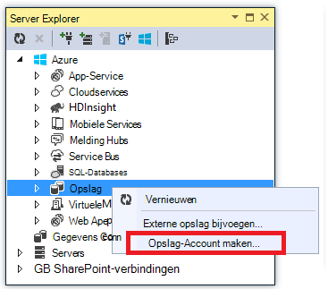
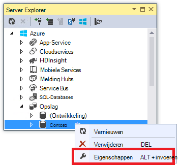

<properties
    pageTitle="Maken van een WebJob .NET in Azure App Service | Microsoft Azure"
    description="Een ASP.NET-MVC en Azure gebruiken met meerdere niveaus-app maken. De front einde wordt uitgevoerd in een web-app in Azure App-Service en de backend wordt uitgevoerd als een WebJob. De app wordt gebruikt voor entiteit Framework, SQL-Database, en Azure opslag wachtrijen en BLOB's."
    services="app-service"
    documentationCenter=".net"
    authors="tdykstra"
    manager="wpickett"
    editor="mollybos"/>

<tags
    ms.service="app-service"
    ms.workload="na"
    ms.tgt_pltfrm="na"
    ms.devlang="na"
    ms.topic="article"
    ms.date="10/28/2016"
    ms.author="tdykstra"/>

# Maken van een WebJob .NET in Azure App-Service

Deze zelfstudie wordt getoond hoe u schrijft code voor een eenvoudige meerlagige ASP.NET MVC 5-toepassing, waarin de [WebJobs SDK](websites-dotnet-webjobs-sdk.md).

Het doel van de [WebJobs SDK](websites-webjobs-resources.md) is om te vereenvoudigen de code die u voor algemene taken schrijft dat een WebJob kunt uitvoeren, zoals de verwerking van afbeeldingen, in de wachtrij processing, RSS aggregatie onderhoud van bestanden en e-mailberichten verzenden. De WebJobs SDK heeft ingebouwde functies voor het werken met Azure opslagcapaciteit en de Service Bus, voor het plannen van taken en foutafhandeling en voor groot aantal andere gebruikelijke scenario's. Daarnaast ontworpen moeten extensible en er is een [bron opslagplaats voor extensies openen](https://github.com/Azure/azure-webjobs-sdk-extensions/wiki/Binding-Extensions-Overview).

De toepassing van de steekproef is een BBS reclame. Gebruikers afbeeldingen voor advertenties kunnen uploaden en de afbeeldingen in een back-end-proces worden geconverteerd naar miniaturen. De pagina van de lijst met ad ziet u de miniaturen en de detailpagina van ad ziet u de afbeelding van de volledige grootte. Hier volgt een schermafbeelding:

In dit voorbeeldtoepassing werkt met [Azure wachtrijen](http://www.asp.net/aspnet/overview/developing-apps-with-windows-azure/building-real-world-cloud-apps-with-windows-azure/queue-centric-work-pattern) en [Azure BLOB's](http://www.asp.net/aspnet/overview/developing-apps-with-windows-azure/building-real-world-cloud-apps-with-windows-azure/unstructured-blob-storage). De zelfstudie leert hoe u het implementeren van de toepassing [Azure App-Service](http://go.microsoft.com/fwlink/?LinkId=529714) en [Azure SQL-Database](http://msdn.microsoft.com/library/azure/ee336279).

## Vereisten voor

De zelfstudie wordt ervan uitgegaan dat u hoe weet u werkt met [ASP.NET MVC 5](http://www.asp.net/mvc/tutorials/mvc-5/introduction/getting-started) projecten in Visual Studio.

De zelfstudie is geschreven voor Visual Studio-2013. Als u geen al Visual Studio, wordt deze u automatisch geïnstalleerd tijdens de installatie van de Azure-SDK voor .NET.

De zelfstudie kan worden gebruikt met Visual Studio-2015, maar voordat u de toepassing uitvoert lokaal u moet wijzigen de `Data Source` voor een deel van de verbindingsreeks van SQL Server LocalDB in de Web.config en App.config-bestanden vanuit `Data Source=(localdb)\v11.0` naar `Data Source=(LocalDb)\MSSQLLocalDB`. 

> [AZURE.NOTE] U hebt een Azure-account om te voltooien van deze zelfstudie nodig:
  >
  > + U kunt [een Azure-account gratis openen](https://azure.microsoft.com/pricing/free-trial/?WT.mc_id=A261C142F): U tegoeden krijgt u kunt uitproberen betaalde Azure services en zelfs nadat ze gebruikt afgerond kunt u het account en gebruik vrij te geven Azure services, zoals Websites. Uw creditcard nooit brengt, tenzij u expliciet uw instellingen wijzigen en vragen om te betalen.
  >
  > + U kunt [MSDN abonnee voordelen activeren](https://azure.microsoft.com/pricing/member-offers/msdn-benefits-details/?WT.mc_id=A261C142F): uw MSDN-abonnement kunt u tegoeden elke maand die u voor betaalde Azure-services gebruiken kunt.
  >
  >Als u aan de slag met Azure App Service wilt voordat u zich registreert voor een Azure-account, gaat u naar de [App-Service probeert](http://go.microsoft.com/fwlink/?LinkId=523751), waar u direct een tijdelijk starter in de browser in de App-Service maken kunt. Geen creditcards vereist; geen verplichtingen.

## Wat u leert

De zelfstudie ziet u hoe u de volgende taken uitvoeren:

* Uw computer voor de ontwikkeling van Azure inschakelen door het installeren van de Azure-SDK.
* Maak een project-Console-toepassing die automatisch wordt geïmplementeerd als een WebJob Azure wanneer u het webproject gekoppeld implementeert.
* Test een backend WebJobs SDK lokaal op de computer van de ontwikkeling.
* Een toepassing met een backend WebJobs publiceren naar een web-app in de App-Service.
* Bestanden uploaden en sla deze op in de service Azure Blob.
* Gebruik de SDK van Azure WebJobs voor gebruik met Azure Storage wachtrijen en BLOB's.

## Toepassingsarchitectuur

De voorbeeldtoepassing wordt de [wachtrij centraal werk patroon](http://www.asp.net/aspnet/overview/developing-apps-with-windows-azure/building-real-world-cloud-apps-with-windows-azure/queue-centric-work-pattern) tijdens stillegging de werklast CPU veel van het maken van miniaturen aan een back-end-proces.

Er worden advertenties opgeslagen in de app in een SQL-database, entiteit Framework Code eerste gebruik voor het maken van de tabellen en toegang tot de gegevens. Voor elke ad, twee URL's voor de database worden opgeslagen: één voor de afbeelding op volledig scherm en één voor de miniatuur.

Wanneer een gebruiker uploads een afbeelding, de web-app opslaan in een [Azure blob](http://www.asp.net/aspnet/overview/developing-apps-with-windows-azure/building-real-world-cloud-apps-with-windows-azure/unstructured-blob-storage)en de ad-informatie in de database met een URL die naar de blob verwijst is opgeslagen. Tegelijkertijd schrijft deze een bericht naar een Azure wachtrij. In een back-end-proces wordt uitgevoerd met een WebJob Azure, controleert de WebJobs SDK de wachtrij voor nieuwe berichten. Wanneer een nieuw bericht wordt weergegeven, wordt de WebJob een miniatuur voor die afbeelding gemaakt en de miniaturen URL databaseveld voor die ad worden bijgewerkt. Hier volgt een diagram waarin wordt aangegeven hoe de onderdelen van de toepassing werken:

[AZURE.INCLUDE [install-sdk](../../includes/install-sdk-2015-2013.md)]

De zelfstudie instructies toepassen op Azure SDK voor .NET 2.7.1 of hoger.

## Maak een account Azure Storage

Een account Azure opslag bevat bronnen voor wachtrij en blob gegevens opslaat in de cloud. Dit wordt ook gebruikt door de WebJobs SDK voor de opslag van gegevens van de logboekregistratie voor het dashboard.

In een echte-toepassing, moet u meestal afzonderlijke accounts voor de toepassing gegevens versus logboekgegevens, en afzonderlijke accounts voor testgegevens versus productiegegevens maken. Voor deze zelfstudie gebruikt u slechts één account.

1. Open het venster **Server Explorer** in Visual Studio.

2. Met de rechtermuisknop op het knooppunt **Azure** en klik vervolgens op **verbinding maken met Microsoft Azure**.

3. Meld u aan met uw referenties van Azure.

5. Met de rechtermuisknop op de **opslag** onder het knooppunt Azure en klik vervolgens op **Opslag-Account maken**.

3. Voer een naam voor de opslag-account in het dialoogvenster **Opslag-Account maken** .

    De naam moet uniek zijn (geen andere Azure opslag-account kan dezelfde naam hebben). Als de naam die u invoert, al in gebruik is krijgt u een kans te wijzigen.

    De URL voor toegang tot uw account opslag worden *{naam}*. core.windows.net.

5. Stel de vervolgkeuzelijst **regio of affiniteit groep** op het gebied dichtst bij u.

    Deze instelling bepaalt welke Azure datacenter wordt gehost in uw account opslag. Uw keuze won't een opvallend verschil zorg voor deze zelfstudie. Voor een productie WebApp wilt u echter de webserver en uw account opslag moeten in dezelfde regio te minimaliseren ten latentie en gegevens egress kosten. De web-app (dat u later wilt maken) datacenter moet zo dicht mogelijk aan de browsers die toegang krijgen tot de web-app om te kunnen Latentie minimaliseren.

6. Stel in de vervolgkeuzelijst **herhaling** op **lokaal overtollige**.

    Als geografische-replicatie is ingeschakeld voor een opslag-account, wordt het opgeslagen inhoud gerepliceerd naar een secundaire datacenter om in te schakelen failover naar die locatie voor het geval een primaire noodgevallen in de primaire locatie. Geografische herhaling kunt extra kosten. Test- en -accounts wilt u doorgaans niet betalen voor geografische-replicatie. Zie [maken, beheren, of een account opslagruimte verwijderen](../storage-create-storage-account/#replication-options)voor meer informatie.

5. Klik op **maken**.

    

## De toepassing downloaden

1. Download en pak de [oplossing voltooid](http://code.msdn.microsoft.com/Simple-Azure-Website-with-b4391eeb).

2. Visual Studio starten.

3. Kies in het menu **bestand** **openen > Project/oplossing**, navigeer naar waar u de oplossing hebt gedownload en open het oplossingsbestand.

4. Druk op CTRL + SHIFT + B de oplossing.

    Standaard herstelt Visual Studio automatisch u de inhoud voor het pakket van NuGet, die niet is opgenomen in het *zip-* bestand. Als de pakketten niet herstellen, installeert u deze handmatig door te gaan naar het dialoogvenster **NuGet-pakketten voor oplossing beheren** en te klikken op de knop **herstellen** rechtsboven.

5. Zorg dat **ContosoAdsWeb** is geselecteerd als het opstartproject in **Solution Explorer**.

## De toepassing configureren voor gebruik van uw account opslag

1. Open de toepassing *Web.config* -bestand in het project ContosoAdsWeb.

    Het bestand bevat een SQL-verbindingsreeks en een verbindingsreeks Azure opslag voor het werken met BLOB's en wachtrijen.

    De SQL-verbindingsreeks verwijst naar een [SQL Server Express LocalDB](http://msdn.microsoft.com/library/hh510202.aspx) -database.

    De verbindingsreeks opslag is een voorbeeld met tijdelijke aanduidingen voor de naam en access-toets voor de account voor opslag. U kunt dit vervangen door een verbindingsreeks met de naam en de toets van uw account opslag.  

    <pre class="prettyprint">&lt;connectionStrings&gt;
   &lt;naam toevoegen = "ContosoAdsContext" connectionString = "gegevensbron = (localdb) \v11.0; Initiële catalogus = ContosoAds; Geïntegreerde beveiliging = ONWAAR zijn. Voor MultipleActiveResultSets = True; "providerName="System.Data.SqlClient "/&gt;
   &lt;naam toevoegen ="AzureWebJobsStorage"connectionString =" DefaultEndpointsProtocol = https; Accountnaam =<mark>[accountnaam]</mark>; AccountKey<mark>[accesskey]</mark>= "/&gt; 
    &lt;/connectionStrings      &gt;</pre>

    De verbindingsreeks opslag heet AzureWebJobsStorage omdat dit de naam die gebruikmaakt van de WebJobs SDK al dan niet standaard. Dezelfde naam wordt hier gebruikt, zodat er slechts één verbinding tekenreekswaarde instellen in de Azure-omgeving.

2. Met de rechtermuisknop op uw account opslag onder het knooppunt **opslag** in **Server Explorer**en klik vervolgens op **Eigenschappen**.

    

3. Klik in het venster **Eigenschappen** **Opslag Account toetsen**op en klik vervolgens op de drie puntjes.

    

4. Kopieer de **verbindingsreeks**.

    

5. De verbindingsreeks van opslag in het bestand *Web.config* vervangen door de verbindingsreeks die u zojuist hebt gekopieerd. Zorg ervoor dat u selecteert alles tussen aanhalingstekens, maar niet inclusief de aanhalingstekens voordat u gaat plakken.

6. Open het bestand *App.config* in het project ContosoAdsWebJob.

    Dit bestand heeft twee tekenreeksen voor opslag-verbinding, één voor de toepassingsgegevens en één voor logboekregistratie. U kunt afzonderlijke opslag accounts gebruiken voor gegevens van toepassingen en logboekregistratie en kunt u [meerdere accounts van de opslagruimte voor gegevens](https://github.com/Azure/azure-webjobs-sdk/blob/master/test/Microsoft.Azure.WebJobs.Host.EndToEndTests/MultipleStorageAccountsEndToEndTests.cs). Voor deze zelfstudie gebruikt u een account één opslag. De verbindingstekenreeksen hebt tijdelijke aanduidingen voor de opslag-account te gebruiken. 
    <pre class="prettyprint">&lt;configuratie&gt; 
    &lt;connectionStrings&gt;
   &lt;naam toevoegen = "AzureWebJobsDashboard" connectionString = "DefaultEndpointsProtocol = https; Accountnaam =<mark>[accountnaam]</mark>; AccountKey<mark>[accesskey]</mark>= "/&gt;
   &lt;naam toevoegen ="AzureWebJobsStorage"connectionString =" DefaultEndpointsProtocol = https; Accountnaam =<mark>[accountnaam]</mark>; AccountKey<mark>[accesskey]</mark>= "/&gt;
   &lt;naam toevoegen ="ContosoAdsContext"connectionString =" gegevensbron = (localdb) \v11.0; Initiële catalogus = ContosoAds; Geïntegreerde beveiliging = ONWAAR zijn. Voor MultipleActiveResultSets = True; " /&gt; 
    &lt;/connectionStrings&gt;
   &lt;opstarten&gt;
   &lt;supportedRuntime versie = "v4.0" sku = ". NETFramework, versie v4.5 = "/&gt; 
    &lt;/startup&gt;
&lt;/Configuration                             &gt;</pre>

    Standaard de SDK WebJobs Hiermee wordt gezocht naar verbindingstekenreeksen met de met de naam AzureWebJobsStorage en AzureWebJobsDashboard. Als alternatief, kunt u [store de verbinding tekenreeks echter die u wilt en de doorgeeft in expliciet tot de `JobHost` object](websites-dotnet-webjobs-sdk-storage-queues-how-to.md#config).

7. Vervang beide opslag verbindingstekenreeksen met de verbindingsreeks die u eerder hebt gekopieerd.

8. Sla uw wijzigingen op.

## De toepassing lokaal uitvoeren

1. Klik op CTRL + F5 om de web-frontend van de toepassing.

    De standaardbrowser wordt geopend naar de startpagina. (Het webproject uitgevoerd omdat u deze hebt gemaakt, kunt u het opstartproject.)

    

2. Als u wilt de backend WebJob van de toepassing, met de rechtermuisknop op het project ContosoAdsWebJob in **Solution Explorer**en klik op **fouten opsporen in** > **nieuw exemplaar Start**.

    Een toepassingsvenster console geopend en weergegeven logboekregistratie berichten waarin wordt aangegeven dat het object WebJobs SDK JobHost is begonnen met om uit te voeren.

    

3. Klik op **maken een advertentie**in uw browser.

4. Enkele testgegevens invoeren en selecteer een afbeelding uploaden en klik vervolgens op **maken**.

    

    De app Hiermee gaat u naar de pagina Index, maar deze niet wordt een miniatuur voor de nieuwe ad weergegeven omdat deze verwerking is nog niet is gebleven.

    Ondertussen na een korte wachten logboekregistratie in een bericht in het toepassingsvenster console aangegeven dat een wachtrij bericht is ontvangen en is verwerkt.

    

5. Nadat u de berichten logboekregistratie in het toepassingsvenster console ziet, vernieuwt u de Index-pagina als u wilt zien van de miniatuur.

    

6. Klik op **Details** voor uw advertentie als u wilt zien van de afbeelding op volledig scherm.

    

U hebt uitvoert, de toepassing op uw lokale computer, en deze gebruik maakt van een SQL Server database op uw computer, maar deze werkt met wachtrijen en BLOB's de cloud. In de volgende sectie hebt u de toepassing uitvoert in de cloud, met een cloud-database, evenals cloud BLOB's en wachtrijen.  

## Voer de toepassing in de cloud

Voert u de volgende stappen voor het uitvoeren van de toepassing in de cloud:

* Dashboard implementeren naar Webapps. Een nieuwe WebApp Visual Studio automatisch gemaakt in App Service en een exemplaar van de SQL-Database.
* Configureer de web-app als u wilt gebruiken uw Azure SQL-database en opslag-account.

Nadat u sommige advertenties hebt gemaakt tijdens het uitvoeren van in de cloud, bekijkt u het dashboard WebJobs SDK als u wilt zien van de uitgebreide controlefuncties niet optimaal.

### Implementeren naar WebApps

1. Sluit de browser en het toepassingsvenster console.

2. Met de rechtermuisknop op het project ContosoAdsWeb in **Solution Explorer**en klik vervolgens op **publiceren**.

3. Klik op **Microsoft Azure-WebApps**stap in het **profiel** van de wizard **Publiceren** .

    

4. Meld u aan bij Azure als u nog niet bent aangemeld.

5. Klik op **Nieuw**.

    Het dialoogvenster er iets anders is afhankelijk van welke versie van de Azure SDK voor .NET die u hebt geïnstalleerd.

    

6. Voer in het dialoogvenster **de web-app maken op Microsoft Azure** een unieke naam in het vak **de naam van de Web-app** .

    De complete URL bestaat uit wat u hier invoert plus. azurewebsites.net (zoals wordt weergegeven naast het tekstvak **de naam van de Web-app** ). Als de naam van de web-app ContosoAds is, wordt de URL bijvoorbeeld ContosoAds.azurewebsites.net zijn.

7. Kies **nieuwe-App serviceplan maken**in de vervolgkeuzelijst van de [App-abonnement](../app-service/azure-web-sites-web-hosting-plans-in-depth-overview.md) . Voer een naam voor het App-abonnement, zoals ContosoAdsPlan.

8. Kies **nieuwe resourcegroep maken**in de vervolgkeuzelijst van het [resourceveld groep](../azure-resource-manager/resource-group-overview.md) .

9. Voer een naam voor de resourcegroep, zoals ContosoAdsGroup.

10. Kies de dezelfde regio die u hebt gekozen voor uw account opslag in de vervolgkeuzelijst **regio** .

    Deze instelling bepaalt welke Azure datacenter uw web-app wordt uitgevoerd in. De app en opslag van een webaccount onthouden in het dezelfde datacenter minimaliseert latentie en gegevens egress kosten.

11. Kies **nieuwe server maken**in de vervolgkeuzelijst van de **Database-server** .

12. Voer een naam voor de database-server, zoals contosoadsserver + een getal of de naam van uw tot de servernaam uniek. 

    Naam van de server moet uniek zijn. Dit kan kleine letters, cijfers en afbreekstreepjes bevatten. Het kan niet een streepje bevat. 

    Als uw abonnement al een server heeft, kunt u ook die server selecteren in de vervolgkeuzelijst.

12. Voer een beheerder **Database-gebruikersnaam** en **wachtwoord voor Database**.

    Als u **nieuwe SQL-databaseserver** u worden niet het invoeren van een bestaande gebruikersnaam en wachtwoord hier hebt geselecteerd, kunt u een nieuwe naam en het wachtwoord waarmee u bent nu definiëren om later te gebruiken wanneer u toegang de database tot bent invoeren. Als u een server die u eerder hebt gemaakt hebt geselecteerd, wordt u gevraagd het wachtwoord aan de administratieve gebruikersaccount dat u al hebt gemaakt.

13. Klik op **maken**.

    

    Visual Studio Hiermee maakt u de oplossing, het webproject, de web-app in Azure wordt aangegeven en het exemplaar Azure SQL-Database.

14. In de stap van de **verbinding** van de wizard **Publiceren** , klikt u op **volgende**.

    

15. Schakel het selectievakje **Gebruik deze verbindingsreeks gedurende runtime** in de stap koppeling de optie **Instellingen** en klik vervolgens op **volgende**.

    

    U hoeft niet te gebruiken van het dialoogvenster publiceren om in te stellen van de SQL-verbindingsreeks omdat u wordt die waarde later in het Azure-omgeving instellen.

    U kunt de waarschuwingen op deze pagina kunt negeren.

    * Normaal gesproken de opslag-account u gebruikt wanneer uitgevoerd in Azure van het account dat u gebruikt afwijken zou wanneer lokaal uitgevoerd, maar deze zelfstudie gebruikt u dezelfde dat in beide omgevingen. De verbindingsreeks AzureWebJobsStorage hoeft dus niet te worden getransformeerd. Zelfs als u een andere opslag-account in de cloud gebruiken wilt, moet u wouldn't de verbindingsreeks transformeren omdat de omgevingsinstelling voor een Azure-van de app wordt gebruikt wanneer deze wordt uitgevoerd in Azure wordt aangegeven. U ziet het volgende verderop in deze zelfstudie.

    * Voor deze zelfstudie die u wilt niet worden worden wijzigingen aanbrengt in het gegevensmodel dat is gebruikt voor de database ContosoAdsContext, dus bestaat niet nodig entiteit Framework Code eerste migraties gebruiken voor implementatie. Code maakt eerst automatisch een nieuw tijdstip voor de eerste database de app probeert te krijgen tot SQL-gegevens.

    Voor deze zelfstudie de standaardwaarden van de opties onder **Opties voor het publiceren van bestand** is er mis.

16. Klik op **Voorbeeld starten**in de stap koppeling de optie **Preview** .

    

    U kunt de waarschuwing over geen databases wordt gepubliceerd negeren. Entiteit Framework Code eerste wordt gemaakt van de database. Deze hoeft geen te worden gepubliceerd.

    Het voorbeeldvenster ziet u dat binaire bestanden en configuratiebestanden van het project WebJob worden gekopieerd naar de map *app_data\jobs\continuous* van de web-app.

    

17. Klik op **publiceren**.

    Visual Studio implementeren van de toepassing en de URL van de startpagina in de browser geopend.

    Niet mogelijk om de WebApp gebruiken totdat u verbindingstekenreeksen met de in de Azure-omgeving in het volgende gedeelte instellen. U ziet een foutpagina of de startpagina van Lotus afhankelijk van de app en een database maken Webopties die u eerder hebt gekozen.

### Configureer de web-app als u wilt gebruiken uw Azure SQL-database en opslag-account.

Veiligheidsoverwegingen om [te voorkomen dat vertrouwelijke gegevens zoals verbindingstekenreeksen in bestanden die zijn opgeslagen in de bron code opslagplaatsen plaatsen](http://www.asp.net/aspnet/overview/developing-apps-with-windows-azure/building-real-world-cloud-apps-with-windows-azure/source-control#secrets)is. Azure kunt u dat doen: u kunt de verbindingsreeks en andere instellingswaarden instellen in de Azure-omgeving en deze waarden ASP.NET-configuratie API's automatisch verdergaan wanneer de app wordt uitgevoerd in Azure wordt aangegeven. U kunt deze waarden instellen in Azure wordt aangegeven met behulp van de **Server Explorer**, de Portal Azure, Windows PowerShell of de opdrachtregel platforms. Zie [hoe tekenreeksen van toepassingen en verbinding tekenreeksen werk](/blog/2013/07/17/windows-azure-web-sites-how-application-strings-and-connection-strings-work/)voor meer informatie.

In dit gedeelte gebruikt u **Server Explorer** verbinding tekenreekswaarden instellen in Azure wordt aangegeven.

7. In **Server Explorer**met de rechtermuisknop op uw web-app onder **Azure > App Service > {uw resourcegroep}**, en klik vervolgens op **Weergave-instellingen**.

    Het venster **Azure Web App** wordt geopend op het tabblad **configuratie** .

9. Wijzig de naam van de verbindingsreeks DefaultConnection naar ContosoAdsContext.

    Deze verbindingsreeks Azure automatisch gemaakt wanneer u de web-app hebt gemaakt met een gekoppelde database, zodat deze de juiste verbinding tekenreekswaarde al heeft. U kunt alleen de naam wilt wijzigen naar wat uw code wordt gezocht.

9. Voeg twee nieuwe verbindingstekenreeksen met de naam AzureWebJobsStorage en AzureWebJobsDashboard. Type ingesteld op aangepast en stel de waarde van de tekenreeks verbinding op dezelfde waarde die u eerder hebt gebruikt voor de *Web.config* en *App.config* -bestanden. (Controleer of u de hele verbindingsreeks, niet alleen de access-toets, bevatten en geen aanhalingstekens bevatten.)

    Deze verbindingstekenreeksen worden gebruikt door de WebJobs SDK, één voor toepassingsgegevens en één voor logboekregistratie. Als u eerder hebt gezien, wordt het account voor toepassingsgegevens wordt ook gebruikt door de code van de front-end van web.

9. Klik op **Opslaan**.

    

10. Met de rechtermuisknop op de web-app in **Server Explorer**en klik vervolgens op **stoppen**.

12. Nadat de web-app stopt, opnieuw met de rechtermuisknop op de web-app en klik vervolgens op **starten**.

    De WebJob worden automatisch gestart wanneer u publiceert, maar wordt stopgezet wanneer u een configuratie wijzigen. Als u wilt het programma opnieuw kunt u de WebApp opnieuw starten of de WebJob opnieuw in de [Portal van Azure](http://go.microsoft.com/fwlink/?LinkId=529715). Het is gewoonlijk raadzaam naar de WebApp opnieuw starten na de configuratie aan te passen.

9. Vernieuw het browservenster met de URL van de web-app in de adresbalk van de browser.

    De startpagina van Lotus wordt weergegeven.

10. Maak een advertentie, zoals wanneer u de toepassing lokaal hebt uitgevoerd.

    Zonder een miniatuur aanvankelijk ziet u de Index-pagina.

11. De pagina vernieuwt na een paar seconden en de miniatuur weergegeven.

    Als u de miniatuur niet ziet, is het wellicht moet wacht ongeveer een minuut voor de WebJob om opnieuw te starten. Als na een tijd u nog steeds niet ziet de miniatuur wanneer u de pagina vernieuwt, de WebJob mogelijk niet automatisch gestart. In dat geval gaat u naar het tabblad WebJobs in de [klassieke portal](https://manage.windowsazure.com) -pagina voor uw web-app en klik vervolgens op **starten**.

### Het dashboard WebJobs SDK bekijken

1. Selecteer uw web-app in de [klassieke portal](https://manage.windowsazure.com).

2. Klik op het tabblad **WebJobs** .

3. Klik op de URL in de kolom logboeken voor uw WebJob.

    

    Er wordt een nieuw browsertabblad geopend op het dashboard WebJobs SDK. Het dashboard ziet u dat de WebJob wordt uitgevoerd en bevat een overzicht van functies in uw code die de SDK WebJobs geactiveerd.

4. Klik op een van de functies voor informatie over de uitvoering.

    

    

    Hiermee wordt de knop **Opnieuw afspelen functie** op deze pagina het kader WebJobs SDK om te bellen van de functie opnieuw en dit hebt u dan een mogelijkheid om de gegevens die zijn doorgegeven aan de functie eerst te wijzigen.

>[AZURE.NOTE] Wanneer u klaar bent testen, verwijdert u de web-app en het exemplaar van de SQL-Database. De WebApp is gratis, maar het exemplaar van de SQL-Database en opslag-account (minimale vanwege kleine grootte) kosten toenemen. Ook als u de web-app actief verlaten, kunt iedereen die vindt u de URL maken en weergeven advertenties. Ga naar het tabblad **Dashboard** voor uw web-app in de klassieke-portal en klik vervolgens op de knop **verwijderen** onder aan de pagina. Vervolgens kunt u het selectievakje het exemplaar van de SQL-Database op hetzelfde moment verwijderen. Als u alleen tijdelijk voorkomen dat anderen toegang krijgen tot de web-app wilt, klikt u op **stoppen** . Kosten blijft in dat geval toenemen voor het account SQL-Database en opslag. Een soortgelijke procedure als u wilt verwijderen van de SQL-database en opslag-account wanneer u deze niet meer nodig hebt, kunt u volgen.

## Maken van de toepassing maken

In deze sectie hebt u de volgende taken uitvoeren:

* Maak een Visual Studio-oplossing met een webproject.
* Een project class bibliotheek voor de data access-laag die wordt gedeeld tussen front-end en back-end toevoegen.
* Een project-Console-toepassing voor de back-end toevoegen WebJobs implementatie is ingeschakeld.
* NuGet pakketten toevoegen.
* Set projectverwijzingen.
* Kopieer toepassingsbestanden code en configuratie van de gedownloade-toepassing die u in de vorige sectie van de zelfstudie hebt gewerkt.
* Bekijk de onderdelen van de code die met Azure BLOB's en wachtrijen en de WebJobs SDK werken.

### Een Visual Studio-oplossing maken met een webproject en de bibliotheek lesproject

1. Kies in Visual Studio, de optie **Nieuw** > **Project** in het menu **bestand** .

2. Kies in het dialoogvenster **Nieuw Project** **Visual C#** > **Web** > **ASP.NET-webtoepassing**.

3. Naam van het project ContosoAdsWeb, de naam van de oplossing ContosoAdsWebJobsSDK (veranderen de naam van de oplossing als u deze wilt opslaan in dezelfde map als de gedownloade oplossing) en klik vervolgens op **OK**.

    

5. Klik in het dialoogvenster **Nieuw ASP.NET-Project** kiest u de sjabloon MVC en schakel het selectievakje **Host in de cloud** onder **Microsoft Azure**.

    Selecteren **Host in de cloud** , kunt Visual Studio om automatisch een nieuwe Azure WebApp maakt en SQL-Database. Aangezien u al eerder hebt gemaakt deze, moet u niet nu uitvoeren als u het project te maken. Als u een nieuwe record maken wilt, selecteert u het selectievakje in. U kunt vervolgens configureren de nieuwe WebApp en SQL-database dezelfde manier als eerder wanneer u de toepassing geïmplementeerd.

5. Klik op **verificatie wijzigen**.

    

7. Klik in het dialoogvenster **Wijzigen verificatie** kiest u **Nee verificatie**en klik vervolgens op **OK**.

    

8. Klik op **OK**in het dialoogvenster **Nieuw ASP.NET-Project** .

    Visual Studio de oplossing en het webproject gemaakt.

9. In **Solution Explorer**, met de rechtermuisknop op de oplossing (niet de project) en klikt u op **toevoegen** > **Nieuw Project**.

11. Kies in het dialoogvenster **Nieuw Project toevoegen** **Visual C#** > **Windows-bureaublad** > **Klassenbibliotheek** sjabloon.  

10. Naam van het project *ContosoAdsCommon*en klik vervolgens op **OK**.

    Dit project bevat de context entiteit Framework en het gegevensmodel zowel de front-end en back-end worden gebruikt. Als alternatief kunt u ook de EF-gerelateerde klassen definiëren in het webproject en overzicht van dat project uit het project WebJob. Maar klikt u vervolgens uw project WebJob aangewezen een verwijzing naar de web-samenstellen die deze niet nodig hebt.

### Een project-Console-toepassing met WebJobs implementatie ingeschakeld toevoegen

1. Met de rechtermuisknop op het webproject (niet de oplossing of de bibliotheek lesproject) en klik vervolgens op **toevoegen** > **Nieuw Azure WebJob Project**.

    

2. Voer in het dialoogvenster **Toevoegen Azure WebJob** ContosoAdsWebJob als de **naam van het Project** en de **naam van de WebJob**. Laat **WebJob uitvoeren modus** ingesteld op **Continu worden uitgevoerd**.

3.  Klik op **OK**.

    Visual Studio Hiermee maakt u een consoletoepassing die is geconfigureerd om te implementeren als een WebJob wanneer u het webproject implementeren. Als u wilt dat doet, wordt de volgende taken uitgevoerd na het maken van het project:

    * Een bestand *webjob-publiceren-settings.json* toegevoegd in de map WebJob project eigenschappen.
    * Een bestand *webjobs-list.json* toegevoegd in de webmap van het project-eigenschappen.
    * Het pakket Microsoft.Web.WebJobs.Publish NuGet in het project WebJob geïnstalleerd.

    Zie voor meer informatie over deze wijzigingen, [het implementeren van WebJobs met behulp van Visual Studio](websites-dotnet-deploy-webjobs.md).

### NuGet pakketten toevoegen

Het nieuwe project-sjabloon voor een project WebJob installeert automatisch het pakket WebJobs SDK NuGet [Microsoft.Azure.WebJobs](http://www.nuget.org/packages/Microsoft.Azure.WebJobs) en de bijbehorende afhankelijkheden.

Een van de WebJobs SDK afhankelijkheden die automatisch wordt geïnstalleerd in het project WebJob is Azure opslag Client bibliotheek (SCL). Echter, moet u deze toevoegen aan het webproject om te werken met BLOB's en wachtrijen.

1. Open het dialoogvenster **NuGet-pakketten beheren** voor de oplossing.

2. Selecteer in het linkerdeelvenster **geïnstalleerde-pakketten**.

3. Het pakket *Azure Storage* zoeken en klik vervolgens op **beheren**.

4. Schakel het selectievakje **ContosoAdsWeb** in het vak **Selecteer projecten** en klik vervolgens op **OK**.

    Alle drie projecten gebruiken het kader entiteit om te werken met gegevens in de SQL-Database.

5. Selecteer in het linkerdeelvenster **Online**.

6. Zoek het *EntityFramework* NuGet-pakket en installeer deze in alle drie projecten.

### Set projectverwijzingen

Web zowel WebJob projecten werken met de SQL-database, zodat beide een verwijzing naar de ContosoAdsCommon project nodig hebt.

1. In het project ContosoAdsWeb, moet u een verwijzing naar de ContosoAdsCommon-project instellen. (Met de rechtermuisknop op het project ContosoAdsWeb en klik vervolgens op **toevoegen** > **verwijzing**. Selecteer in het dialoogvenster **Verwijzing Manager** **oplossing** > **projecten** > **ContosoAdsCommon**, en klik vervolgens op **OK**.)

1. In het project ContosoAdsWebJob, moet u een verwijzing naar de ContosAdsCommon-project instellen.

    Het project WebJob moet verwijzingen voor het werken met afbeeldingen en voor toegang tot verbindingstekenreeksen met de.

3. In het project ContosoAdsWebJob, kiest u een verwijzing `System.Drawing` en `System.Configuration`.

### Code- en configuratieservices bestanden toevoegen

Deze zelfstudie wordt niet weergegeven het [MVC controllers en weergaven met steigers maken](http://www.asp.net/mvc/tutorials/mvc-5/introduction/getting-started), hoe u [entiteit Framework programmacode die met SQL Server-databases werkt schrijven](http://www.asp.net/mvc/tutorials/getting-started-with-ef-using-mvc)of [de basisbeginselen van asynchrone programmeren in ASP.NET 4.5](http://www.asp.net/aspnet/overview/developing-apps-with-windows-azure/building-real-world-cloud-apps-with-windows-azure/web-development-best-practices#async). Blijft moet is zodat de code- en configuratieservices bestanden kopiëren van de gedownloade oplossing in de nieuwe oplossing. Nadat u dat doet, wordt de volgende secties weergeven en wordt uitgelegd belangrijke punten in de code.

Bestanden toevoegen aan een project of een map, met de rechtermuisknop op het project of de map en klik op **toevoegen** > **Bestaand Item**. Selecteer de bestanden die u wilt en klikt u op **toevoegen**. Als wordt gevraagd of u wilt vervangen bestaande bestanden, klikt u op **Ja**.

1. In het project ContosoAdsCommon, verwijder het bestand *Class1.cs* en toevoegen in plaats daarvan de volgende bestanden uit de gedownloade project.

    - *AD.cs*
    - *ContosoAdscontext.cs*
    - *BlobInformation.cs*  

2. Klik in het project ContosoAdsWeb toevoegen de volgende bestanden uit de gedownloade project.

    - *Web.config*
    - *Global.asax.cs*  
    - In de map *Controllers* : *AdController.cs*
    - In de map *Views\Shared* : *_Layout.cshtml* -bestand
    - In de map *Views\Home* : *Index.cshtml*
    - In de map *Views\Ad* (de map eerst maken): vijf *.cshtml* -bestanden  

3. Klik in het project ContosoAdsWebJob toevoegen de volgende bestanden uit de gedownloade project.

    - *App.config* (wijzigen het filter van het type bestand in **Alle bestanden**)
    - *Program.cs*
    - *Functions.cs*

U kunt nu maken, uitvoeren en implementeren van de toepassing, zoals eerder in deze zelfstudie. Voordat u dat doet, moet u echter de WebJob die nog steeds wordt uitgevoerd op de eerste web-app die u geïmplementeerd op stoppen. Anders worden Wachtrijberichten lokaal of door de app uitgevoerd in een nieuwe WebApp sinds alles met behulp van hetzelfde opslag-account gemaakt worden verwerkt door deze WebJob.

## Controleert u de toepassingscode

De volgende secties wordt uitgelegd dat de code voor het werken met de WebJobs SDK en opslag van Azure BLOB's en wachtrijen.

> [AZURE.NOTE] Voor de code die specifiek zijn voor de WebJobs SDK, gaat u naar de secties [Program.cs en Functions.cs](#programcs) .

### ContosoAdsCommon - Ad.cs

Het bestand Ad.cs definieert een opsomming voor ad-categorieën en een klasse POCO entiteit voor ad-informatie.

        public enum Category
        {
            Cars,
            [Display(Name="Real Estate")]
            RealEstate,
            [Display(Name = "Free Stuff")]
            FreeStuff
        }

        public class Ad
        {
            public int AdId { get; set; }

            [StringLength(100)]
            public string Title { get; set; }

            public int Price { get; set; }

            [StringLength(1000)]
            [DataType(DataType.MultilineText)]
            public string Description { get; set; }

            [StringLength(1000)]
            [DisplayName("Full-size Image")]
            public string ImageURL { get; set; }

            [StringLength(1000)]
            [DisplayName("Thumbnail")]
            public string ThumbnailURL { get; set; }

            [DataType(DataType.Date)]
            [DisplayFormat(DataFormatString = "{0:yyyy-MM-dd}", ApplyFormatInEditMode = true)]
            public DateTime PostedDate { get; set; }

            public Category? Category { get; set; }
            [StringLength(12)]
            public string Phone { get; set; }
        }

### ContosoAdsCommon - ContosoAdsContext.cs

De klasse ContosoAdsContext geeft aan dat de Ad-klasse wordt gebruikt in een verzameling DbSet, waarin entiteit Framework worden opgeslagen in een SQL-database.

        public class ContosoAdsContext : DbContext
        {
            public ContosoAdsContext() : base("name=ContosoAdsContext")
            {
            }
            public ContosoAdsContext(string connString)
                : base(connString)
            {
            }
            public System.Data.Entity.DbSet<Ad> Ads { get; set; }
        }

De klas heeft twee constructors. De eerste wordt gebruikt door de webproject en bevat de naam van een verbindingsreeks die is opgeslagen in het bestand Web.config of de Azure runtime-omgeving. De tweede constructor kunt u in de werkelijke verbindingsreeks doorgeven. Dat is vereist voor het project WebJob aangezien er geen een Web.config-bestand. U eerder hebt gezien waar deze verbindingsreeks is opgeslagen, en ziet u hoe de code de verbindingsreeks opgehaald wanneer deze de klasse DbContext wordt.

### ContosoAdsCommon - BlobInformation.cs

De `BlobInformation` klasse wordt gebruikt voor informatie over een blob afbeelding opslaan in een bericht wachtrij.

        public class BlobInformation
        {
            public Uri BlobUri { get; set; }

            public string BlobName
            {
                get
                {
                    return BlobUri.Segments[BlobUri.Segments.Length - 1];
                }
            }
            public string BlobNameWithoutExtension
            {
                get
                {
                    return Path.GetFileNameWithoutExtension(BlobName);
                }
            }
            public int AdId { get; set; }
        }

### ContosoAdsWeb - Global.asax.cs

Code die wordt aangeroepen vanuit de `Application_Start` methode maakt een *afbeeldingen* blob container en een wachtrij *afbeeldingen* als ze niet bestaat. Dit zorgt ervoor dat wanneer u met een nieuwe opslag-account begint, de vereiste blob container en wachtrij worden automatisch gemaakt.

De code krijgt toegang tot het account opslagruimte met behulp van de verbindingsreeks van de opslag van het bestand *Web.config* of Azure runtimeomgeving.

        var storageAccount = CloudStorageAccount.Parse
            (ConfigurationManager.ConnectionStrings["AzureWebJobsStorage"].ToString());

Vervolgens krijgt een verwijzing naar de *afbeeldingen* blob container, maakt de container als deze nog niet bestaat, en machtigingen van de nieuwe container ingesteld. Standaard wordt met nieuwe containers alleen clients met accountreferenties opslag voor toegang tot BLOB's toe. De WebApp moet de BLOB's moeten openbare, zodat deze afbeeldingen met URL's die naar de afbeelding BLOB's verwijzen kunt weergeven.

        var blobClient = storageAccount.CreateCloudBlobClient();
        var imagesBlobContainer = blobClient.GetContainerReference("images");
        if (imagesBlobContainer.CreateIfNotExists())
        {
            imagesBlobContainer.SetPermissions(
                new BlobContainerPermissions
                {
                    PublicAccess = BlobContainerPublicAccessType.Blob
                });
        }

Vergelijkbare code wordt een verwijzing naar de wachtrij *thumbnailrequest* en maakt een nieuwe wachtrij. In dit geval is geen wijziging van de machtigingen nodig. 

        CloudQueueClient queueClient = storageAccount.CreateCloudQueueClient();
        var imagesQueue = queueClient.GetQueueReference("thumbnailrequest");
        imagesQueue.CreateIfNotExists();

### ContosoAdsWeb - _Layout.cshtml

Het bestand *_Layout.cshtml* Hiermee stelt u de app-naam in de koptekst en voettekst en maakt een "Advertenties" menu-item.

### ContosoAdsWeb - Views\Home\Index.cshtml

Het bestand *Views\Home\Index.cshtml* geeft categoriekoppelingen op de startpagina. De koppelingen geven de waarde geheel getal van de `Category` opsommen in een variabele queryreeks naar de pagina advertenties Index.

        <li>@Html.ActionLink("Cars", "Index", "Ad", new { category = (int)Category.Cars }, null)</li>
        <li>@Html.ActionLink("Real estate", "Index", "Ad", new { category = (int)Category.RealEstate }, null)</li>
        <li>@Html.ActionLink("Free stuff", "Index", "Ad", new { category = (int)Category.FreeStuff }, null)</li>
        <li>@Html.ActionLink("All", "Index", "Ad", null, null)</li>

### ContosoAdsWeb - AdController.cs

Bestanden in de *AdController.cs* de constructor roept de `InitializeStorage` methode Azure opslag clientbibliotheek objecten waarmee een API voor het werken met BLOB's en wachtrijen te maken.

De code wordt vervolgens een verwijzing naar de *afbeeldingen* blob container zoals u eerder in *Global.asax.cs*hebt gezien. Terwijl u dat doet, wordt een standaard- [beleid opnieuw](http://www.asp.net/aspnet/overview/developing-apps-with-windows-azure/building-real-world-cloud-apps-with-windows-azure/transient-fault-handling) geschikt te maken voor een web-app. Het standaardbeleid voor exponentiële backoff opnieuw kan de web-app voor meer dan een minuut op herhaalde pogingen van een tijdelijke fout vastlopen. Het opnieuw beleid hier opgegeven wacht 3 seconden nadat elk probeert voor maximaal 3 pogingen doen.

        var blobClient = storageAccount.CreateCloudBlobClient();
        blobClient.DefaultRequestOptions.RetryPolicy = new LinearRetry(TimeSpan.FromSeconds(3), 3);
        imagesBlobContainer = blobClient.GetContainerReference("images");

Vergelijkbare code wordt een verwijzing naar de wachtrij *afbeeldingen* .

        CloudQueueClient queueClient = storageAccount.CreateCloudQueueClient();
        queueClient.DefaultRequestOptions.RetryPolicy = new LinearRetry(TimeSpan.FromSeconds(3), 3);
        imagesQueue = queueClient.GetQueueReference("blobnamerequest");

Grootste deel van de controller-code is voor het werken met een Entity Framework gegevensmodel met behulp van een klasse DbContext typische. Een uitzondering is de HttpPost `Create` methode, die een bestand uploads en slaat het in-blobopslag. De binder model biedt een object [HttpPostedFileBase](http://msdn.microsoft.com/library/system.web.httppostedfilebase.aspx) met de methode.

        [HttpPost]
        [ValidateAntiForgeryToken]
        public async Task<ActionResult> Create(
            [Bind(Include = "Title,Price,Description,Category,Phone")] Ad ad,
            HttpPostedFileBase imageFile)

Als de gebruiker een bestand uploaden hebt geselecteerd, de code uploadt het bestand opgeslagen in een blob en de record van de database Ad bijwerkt met een URL die naar de blob verwijst.

        if (imageFile != null && imageFile.ContentLength != 0)
        {
            blob = await UploadAndSaveBlobAsync(imageFile);
            ad.ImageURL = blob.Uri.ToString();
        }

De code die de upload doet zich in de `UploadAndSaveBlobAsync` methode. Deze maakt een GUID-naam voor de blob uploads en slaat het bestand en geeft als resultaat een verwijzing naar de opgeslagen blob.

        private async Task<CloudBlockBlob> UploadAndSaveBlobAsync(HttpPostedFileBase imageFile)
        {
            string blobName = Guid.NewGuid().ToString() + Path.GetExtension(imageFile.FileName);
            CloudBlockBlob imageBlob = imagesBlobContainer.GetBlockBlobReference(blobName);
            using (var fileStream = imageFile.InputStream)
            {
                await imageBlob.UploadFromStreamAsync(fileStream);
            }
            return imageBlob;
        }

Na het HttpPost `Create` methode een blob uploads en updates van de database, dat wordt gemaakt van een bericht wachtrij op de hoogte brengt het back-enddatabase-proces dat een afbeelding gereed voor conversie naar een miniatuur is.

        BlobInformation blobInfo = new BlobInformation() { AdId = ad.AdId, BlobUri = new Uri(ad.ImageURL) };
        var queueMessage = new CloudQueueMessage(JsonConvert.SerializeObject(blobInfo));
        await thumbnailRequestQueue.AddMessageAsync(queueMessage);

De code voor het HttpPost `Edit` methode is vergelijkbaar, behalve dat als de gebruiker selecteert een nieuwe afbeeldingsbestand eventuele BLOB's die al aanwezig voor deze advertentie moeten worden verwijderd.

        if (imageFile != null && imageFile.ContentLength != 0)
        {
            await DeleteAdBlobsAsync(ad);
            imageBlob = await UploadAndSaveBlobAsync(imageFile);
            ad.ImageURL = imageBlob.Uri.ToString();
        }

Hier ziet u de code die Hiermee verwijdert u BLOB's wanneer u een advertentie verwijdert:

        private async Task DeleteAdBlobsAsync(Ad ad)
        {
            if (!string.IsNullOrWhiteSpace(ad.ImageURL))
            {
                Uri blobUri = new Uri(ad.ImageURL);
                await DeleteAdBlobAsync(blobUri);
            }
            if (!string.IsNullOrWhiteSpace(ad.ThumbnailURL))
            {
                Uri blobUri = new Uri(ad.ThumbnailURL);
                await DeleteAdBlobAsync(blobUri);
            }
        }
        private static async Task DeleteAdBlobAsync(Uri blobUri)
        {
            string blobName = blobUri.Segments[blobUri.Segments.Length - 1];
            CloudBlockBlob blobToDelete = imagesBlobContainer.GetBlockBlobReference(blobName);
            await blobToDelete.DeleteAsync();
        }

### ContosoAdsWeb - Views\Ad\Index.cshtml en Details.cshtml

Het bestand *Index.cshtml* miniaturen met de andere ad-gegevens worden weergegeven:

        

Het bestand *Details.cshtml* wordt de afbeelding op volledig scherm weergegeven:

        

### ContosoAdsWeb - Views\Ad\Create.cshtml en Edit.cshtml

De bestanden *Create.cshtml* en *Edit.cshtml* opgeven codering waarmee de controller uit om de `HttpPostedFileBase` object.

        @using (Html.BeginForm("Create", "Ad", FormMethod.Post, new { enctype = "multipart/form-data" }))

Een `<input>` element wordt aangegeven dat de browser op te geven van een dialoogvenster bestand selecteren.

        <input type="file" name="imageFile" accept="image/*" class="form-control fileupload" />

### ContosoAdsWebJob - Program.cs

Als de WebJob wordt gestart, wordt het `Main` methode roept de SDK WebJobs `JobHost.RunAndBlock` methode moet beginnen uitvoering van functies op de huidige thread geactiveerd.

        static void Main(string[] args)
        {
            JobHost host = new JobHost();
            host.RunAndBlock();
        }

### ContosoAdsWebJob - Functions.cs - GenerateThumbnail methode

De WebJobs SDK oproepen deze methode wanneer een wachtrij bericht is ontvangen. De methode maakt een miniatuur en de miniatuur plaatst URL in de database.

        public static void GenerateThumbnail(
        [QueueTrigger("thumbnailrequest")] BlobInformation blobInfo,
        [Blob("images/{BlobName}", FileAccess.Read)] Stream input,
        [Blob("images/{BlobNameWithoutExtension}_thumbnail.jpg")] CloudBlockBlob outputBlob)
        {
            using (Stream output = outputBlob.OpenWrite())
            {
                ConvertImageToThumbnailJPG(input, output);
                outputBlob.Properties.ContentType = "image/jpeg";
            }

            // Entity Framework context class is not thread-safe, so it must
            // be instantiated and disposed within the function.
            using (ContosoAdsContext db = new ContosoAdsContext())
            {
                var id = blobInfo.AdId;
                Ad ad = db.Ads.Find(id);
                if (ad == null)
                {
                    throw new Exception(String.Format("AdId {0} not found, can't create thumbnail", id.ToString()));
                }
                ad.ThumbnailURL = outputBlob.Uri.ToString();
                db.SaveChanges();
            }
        }

* De `QueueTrigger` kenmerk hostingprovider ervoor dat de WebJobs SDK om te bellen van deze methode wanneer een nieuw bericht is ontvangen in de wachtrij thumbnailrequest.

        [QueueTrigger("thumbnailrequest")] BlobInformation blobInfo,

    De `BlobInformation` object in het bericht wachtrij is automatisch gedeserialiseerde in de `blobInfo` parameter. Wanneer de methode is voltooid, wordt het bericht wachtrij verwijderd. Als de methode mislukt voordat is voltooid, wordt het bericht wachtrij niet verwijderd. Als een lease 10 minuten is verlopen, kan het bericht is uitgebracht om opnieuw worden opgenomen en verwerkt. Deze reeks won't voor onbepaalde tijd worden herhaald als een bericht altijd een uitzondering veroorzaakt. Na 5 mislukte pogingen verwerkingstijd van een bericht, het bericht wordt verplaatst naar een wachtrij met de naam {wachtrijnaam}-poison. Het maximum aantal pogingen kan worden geconfigureerd.

* De twee `Blob` kenmerken leveren objecten die zijn gekoppeld aan BLOB's: één tot de bestaande afbeelding label en een naar een nieuwe miniaturen blob die de methode maakt.

        [Blob("images/{BlobName}", FileAccess.Read)] Stream input,
        [Blob("images/{BlobNameWithoutExtension}_thumbnail.jpg")] CloudBlockBlob outputBlob)

    Namen van de BLOB is afkomstig van eigenschappen van de `BlobInformation` object in de wachtrij bericht hebt ontvangen (`BlobName` en `BlobNameWithoutExtension`). Om de volledige functionaliteit van de opslag-Client-bibliotheek kunt u de `CloudBlockBlob` class voor gebruik met BLOB's. Als u gebruiken code die is geschreven wilt voor gebruik met `Stream` objecten, kunt u de `Stream` class.

Zie de volgende bronnen voor meer informatie over het schrijven van functies die WebJobs SDK kenmerken gebruiken:

* [Het gebruik van Azure wachtrij opslagruimte met de WebJobs SDK](websites-dotnet-webjobs-sdk-storage-queues-how-to.md)
* [Hoe u met de WebJobs SDK Azure-blobopslag](websites-dotnet-webjobs-sdk-storage-blobs-how-to.md)
* [Hoe u met de WebJobs SDK Azure-tabelopslag](websites-dotnet-webjobs-sdk-storage-tables-how-to.md)
* [Het gebruik van Azure Service Bus met de WebJobs SDK](websites-dotnet-webjobs-sdk-service-bus.md)

> [AZURE.NOTE]
>
> * Als uw web-app op meerdere VMs wordt uitgevoerd, meerdere WebJobs tegelijk wordt uitgevoerd en in sommige gevallen kan dit resulteren in dezelfde gegevens meerdere keren wordt verwerkt. Dit is niet een probleem als u de ingebouwde wachtrij, blob en Service Bus triggers gebruikt. De SDK zorgt ervoor dat uw functies slechts één keer worden verwerkt voor elk bericht of blob.
>
> * Zie voor informatie over het implementeren van correcte afsluiten [Correcte afsluiten](websites-dotnet-webjobs-sdk-storage-queues-how-to.md#graceful).
>
> * De code in de `ConvertImageToThumbnailJPG` methode (niet wordt weergegeven) worden klassen gebruikt in de `System.Drawing` naamruimte voor eenvoudig. De klassen in deze naamruimte zijn echter ontworpen voor gebruik met Windows-formulieren. Ze worden niet ondersteund voor gebruik in een Windows- of ASP.NET-service. Zie voor meer informatie over de afbeelding van de opnameknop [Dynamische afbeelding generatie](http://www.hanselman.com/blog/BackToBasicsDynamicImageGenerationASPNETControllersRoutingIHttpHandlersAndRunAllManagedModulesForAllRequests.aspx) en [Uitgebreide binnen grootte van afbeeldingen aanpassen](http://www.hanselminutes.com/313/deep-inside-image-resizing-and-scaling-with-aspnet-and-iis-with-imageresizingnet-author-na).

## Volgende stappen

In deze zelfstudie hebt u een eenvoudige met meerdere niveaus-toepassing waarin de WebJobs SDK voor backend verwerking zichtbaar. In deze sectie vindt enkele suggesties voor meer informatie over ASP.NET meerlagige toepassingen en WebJobs.

### Ontbrekende functies

De toepassing gehouden eenvoudige voor een introductie zelfstudie. In een toepassing voor de echte zou u implementeren [afhankelijkheid webweergave](http://www.asp.net/mvc/tutorials/hands-on-labs/aspnet-mvc-4-dependency-injection) en de [bibliotheek en eenheid werken patronen](http://www.asp.net/mvc/tutorials/getting-started-with-ef-using-mvc/advanced-entity-framework-scenarios-for-an-mvc-web-application#repo), gebruikt u [een interface voor logboekregistratie](http://www.asp.net/aspnet/overview/developing-apps-with-windows-azure/building-real-world-cloud-apps-with-windows-azure/monitoring-and-telemetry#log) [EF Code eerste migraties](http://www.asp.net/mvc/tutorials/getting-started-with-ef-using-mvc/migrations-and-deployment-with-the-entity-framework-in-an-asp-net-mvc-application) gebruiken voor het beheren van veranderingen in gegevensmodel en [EF verbinding tolerantie](http://www.asp.net/mvc/tutorials/getting-started-with-ef-using-mvc/connection-resiliency-and-command-interception-with-the-entity-framework-in-an-asp-net-mvc-application) gebruiken voor het beheren van tijdelijke netwerkfouten.

### Schaalbaarheid van WebJobs

WebJobs uitvoeren in de context van een web-app en zijn niet afzonderlijk worden scalable. Bijvoorbeeld als u één exemplaar van de standaard web app hebt, hebt u slechts één exemplaar van uw achtergrondproces wordt uitgevoerd en dat er enkele van de server-resources (CPU, geheugen, enzovoort) die anders beschikbaar zijn zou voor webinhoud dienen worden gebruikt.

Als verkeer is afhankelijk van de tijd van of dag van week en als de backend-verwerking die u moet kunt wachten, kunt u uw WebJobs om uit te voeren op weinig verkeer momenten kan plannen. Als het selectievakje laden nog steeds te hoog is voor deze oplossing, kunt u de backend uitvoeren als een WebJob in een speciale afzonderlijk WebApp voor dat doel. U kunt uw backend-web-app vervolgens onafhankelijk schalen vanuit uw frontend WebApp.

Zie [WebJobs schaling](websites-webjobs-resources.md#scale)voor meer informatie.

### Web app time-out afsluiten-keuzelijsten voorkomen

Om ervoor te zorgen dat uw WebJobs altijd wordt uitgevoerd en uitgevoerd op alle exemplaren van uw web-app, moet u de functie [AlwaysOn](http://weblogs.asp.net/scottgu/archive/2014/01/16/windows-azure-staging-publishing-support-for-web-sites-monitoring-improvements-hyper-v-recovery-manager-ga-and-pci-compliance.aspx) inschakelen.

### Met behulp van de SDK WebJobs buiten WebJobs

Een programma dat gebruikmaakt van de WebJobs SDK heeft geen om uit te voeren in Azure wordt aangegeven in een WebJob. Deze lokaal kan worden afgespeeld en deze kan ook worden afgespeeld in andere omgevingen zoals een Cloudservice werknemer rol of een Windows-service. U kunt echter alleen het dashboard WebJobs SDK openen via een Azure web-app. U moet de webtoepassing verbinden met de opslag-account die u gebruikt door in te stellen van de verbindingsreeks AzureWebJobsDashboard op het tabblad **configureren** van de klassieke-portal als u wilt gebruiken het dashboard. U kunt vervolgens toegang tot het Dashboard met behulp van de volgende URL:

https://{webappname}.SCM.azurewebsites.NET/azurejobs/#/Functions

Voor meer informatie [een dashboard voor lokale ontwikkeling met de SDK WebJobs](http://blogs.msdn.com/b/jmstall/archive/2014/01/27/getting-a-dashboard-for-local-development-with-the-webjobs-sdk.aspx)ziet, maar houd er rekening mee dat deze ziet u de naam van een oude verbinding tekenreeks.

### Meer WebJobs documentatie

Zie [Azure WebJobs documentatiebronnen](http://go.microsoft.com/fwlink/?LinkId=390226)voor meer informatie.
