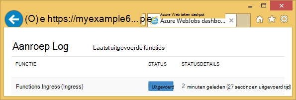
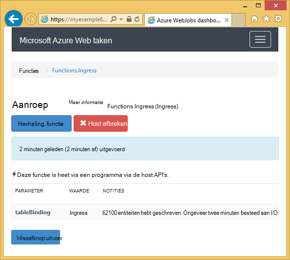
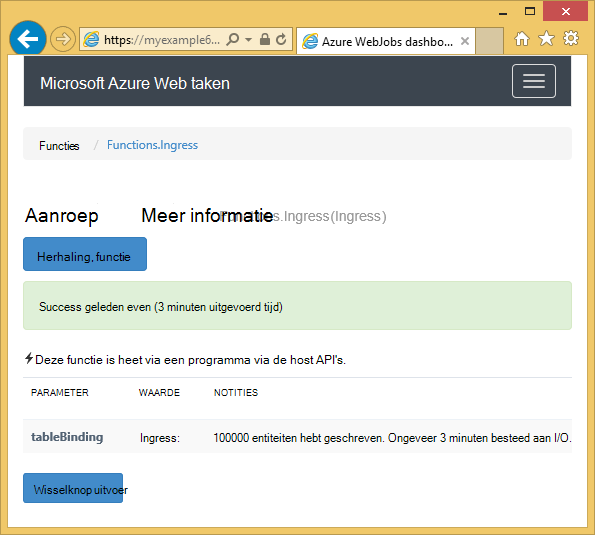

<properties 
    pageTitle="Hoe u met de WebJobs SDK Azure-tabelopslag" 
    description="Informatie over het gebruiken van Azure-tabelopslag met de WebJobs SDK. Tabellen maken, entiteiten toevoegen aan tabellen en bestaande tabellen lezen." 
    services="app-service\web, storage" 
    documentationCenter=".net" 
    authors="tdykstra" 
    manager="wpickett" 
    editor="jimbe"/>

<tags 
    ms.service="app-service-web" 
    ms.workload="web" 
    ms.tgt_pltfrm="na" 
    ms.devlang="dotnet" 
    ms.topic="article" 
    ms.date="06/01/2016" 
    ms.author="tdykstra"/>

# Hoe u met de WebJobs SDK Azure-tabelopslag

## Overzicht

Deze handleiding bevat voorbeelden C#-code die wordt aangegeven hoe lezen en schrijven van Azure opslag tabellen met behulp van [WebJobs SDK](websites-dotnet-webjobs-sdk.md) versie 1.x.

De handleiding wordt ervan uitgegaan dat u weet [hoe u een project WebJob in Visual Studio met verbindingstekenreeksen die naar uw account opslag verwijzen maakt](websites-dotnet-webjobs-sdk-get-started.md) of [meerdere opslag-accounts](https://github.com/Azure/azure-webjobs-sdk/blob/master/test/Microsoft.Azure.WebJobs.Host.EndToEndTests/MultipleStorageAccountsEndToEndTests.cs).
        
Enkele van de codefragmenten weergeven de `Table` kenmerk gebruikt in functies die [handmatig genoemd](websites-dotnet-webjobs-sdk-storage-queues-how-to.md#manual), dat wil zeggen niet zijn via een van de kenmerken trigger. 

## Entiteiten toevoegen aan een tabel

U kunt entiteiten toevoegen aan een tabel met de `Table` kenmerk met een `ICollector<T>` of `IAsyncCollector<T>` parameter waar `T` Hiermee geeft u het schema van de entiteiten die u wilt toevoegen. De attribuutconstructor kent een tekenreeksparameter waarmee de naam van de tabel. 

Het volgende voorbeeld wordt toegevoegd `Person` entiteiten aan een tabel met de naam *Ingress*.

        [NoAutomaticTrigger]
        public static void IngressDemo(
            [Table("Ingress")] ICollector<Person> tableBinding)
        {
            for (int i = 0; i < 100000; i++)
            {
                tableBinding.Add(
                    new Person() { 
                        PartitionKey = "Test", 
                        RowKey = i.ToString(), 
                        Name = "Name" }
                    );
            }
        }

Meestal het type u gebruikt met `ICollector` is afgeleid van `TableEntity` of implementeert `ITableEntity`, maar deze niet hoeft te worden. Een van de volgende `Person` klassen werk met de code die wordt weergegeven in de eerste `Ingress` methode.

        public class Person : TableEntity
        {
            public string Name { get; set; }
        }

        public class Person
        {
            public string PartitionKey { get; set; }
            public string RowKey { get; set; }
            public string Name { get; set; }
        }

Als u werken rechtstreeks met de Azure opslag API wilt, u kunt toevoegen een `CloudStorageAccount` -parameter voor de methodehandtekening.

## Realtime bewaken

Omdat ingress gegevensfuncties vaak grote hoeveelheden gegevens verwerken, vindt u het dashboard WebJobs SDK realtime controlegegevens. De sectie **Aanroep Log** weergegeven als de functie nog actief is.

De pagina **Details van de aanroep** van de functie voortgang (aantal entiteiten geschreven) rapporten terwijl deze wordt uitgevoerd en hebt u de mogelijkheid om af te breken deze. 

Wanneer de functie is voltooid, wordt in de pagina **Details van de aanroep** van het aantal rijen geschreven rapporten.

## Hoe u kunt meerdere entiteiten lezen uit een tabel

Als u wilt lezen van een tabel, gebruikt u de `Table` kenmerk met een `IQueryable<T>` parameter waar typt `T` is afgeleid van `TableEntity` of implementeert `ITableEntity`.

Het volgende voorbeeld leest en logboeken van alle rijen uit de `Ingress` tabel:
 
        public static void ReadTable(
            [Table("Ingress")] IQueryable<Person> tableBinding,
            TextWriter logger)
        {
            var query = from p in tableBinding select p;
            foreach (Person person in query)
            {
                logger.WriteLine("PK:{0}, RK:{1}, Name:{2}", 
                    person.PartitionKey, person.RowKey, person.Name);
            }
        }

### Een enkele entiteit lezen van een tabel

Er is een `Table` attribuutconstructor met twee aanvullende parameters waarmee u de partition en rijsleutel opgeven wanneer u wilt koppelen aan een entiteit één tabel.

Het volgende voorbeeld leest een tabelrij voor een `Person` entiteit op basis van partition sleutel en rij sleutelwaarden ontvangen in een bericht wachtrij:  

        public static void ReadTableEntity(
            [QueueTrigger("inputqueue")] Person personInQueue,
            [Table("persontable","{PartitionKey}", "{RowKey}")] Person personInTable,
            TextWriter logger)
        {
            if (personInTable == null)
            {
                logger.WriteLine("Person not found: PK:{0}, RK:{1}",
                        personInQueue.PartitionKey, personInQueue.RowKey);
            }
            else
            {
                logger.WriteLine("Person found: PK:{0}, RK:{1}, Name:{2}",
                        personInTable.PartitionKey, personInTable.RowKey, personInTable.Name);
            }
        }

De `Person` klasse in dit voorbeeld heeft geen willen implementeren `ITableEntity`.

## Het gebruik van de API voor .NET-opslag rechtstreeks naar het werken met een tabel

U kunt ook de `Table` kenmerk met een `CloudTable` object voor meer flexibiliteit bij het werken met een tabel.

De volgende code voorbeeld wordt een `CloudTable` object één enkele entiteit toevoegen aan de tabel *Ingress* . 
 
        public static void UseStorageAPI(
            [Table("Ingress")] CloudTable tableBinding,
            TextWriter logger)
        {
            var person = new Person()
                {
                    PartitionKey = "Test",
                    RowKey = "100",
                    Name = "Name"
                };
            TableOperation insertOperation = TableOperation.Insert(person);
            tableBinding.Execute(insertOperation);
        }

Voor meer informatie over het gebruik van de `CloudTable` object, raadpleegt u [het gebruik van Table Storage van .NET](../storage/storage-dotnet-how-to-use-tables.md). 

## Verwante onderwerpen bestrijkt het wachtrijen how-to artikel

Voor informatie over hoe u omgaat met de verwerking van de tabel is geactiveerd op een bericht wachtrij of voor WebJobs SDK scenario's die niet specifiek zijn voor de verwerking van een tabel, Zie [hoe u Azure wachtrij opslagruimte met de SDK WebJobs gebruiken](websites-dotnet-webjobs-sdk-storage-queues-how-to.md). 

Onderwerpen in dit artikel zijn:

* Asynchrone functies
* Meerdere exemplaren
* Correcte afsluiten
* WebJobs SDK kenmerken in de hoofdtekst van een functie gebruiken
* De SDK verbindingstekenreeksen in code instellen
* Waarden instellen voor WebJobs SDK constructor parameters in code
* Handmatig een functie activeren
* Logboeken schrijven

## Volgende stappen

Deze handleiding biedt voorbeelden van de code die wordt aangegeven hoe u omgaat met veelvoorkomende scenario's voor het werken met Azure tabellen. Zie voor meer informatie over het gebruik van Azure WebJobs en de SDK WebJobs [Azure WebJobs aanbevolen Resources](http://go.microsoft.com/fwlink/?linkid=390226).
 
