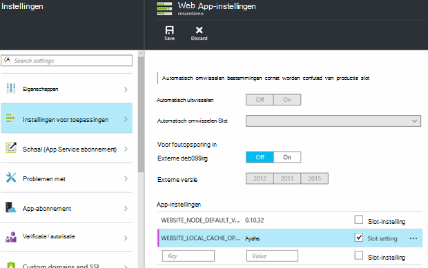

<properties
   pageTitle="Overzicht van Azure App Service lokale Cache | Microsoft Azure"
   description="In dit artikel wordt beschreven hoe inschakelen, het formaat wijzigen en de status van de functie Azure App Service lokale Cache opvragen"
   services="app-service"
   documentationCenter="app-service"
   authors="SyntaxC4"
   manager="yochayk"
   editor=""
   tags="optional"
   keywords=""/>

<tags
   ms.service="app-service"
   ms.devlang="multiple"
   ms.topic="article"
   ms.tgt_pltfrm="na"
   ms.workload="na"
   ms.date="03/04/2016"
   ms.author="cfowler"/>

# <a name="azure-app-service-local-cache-overview"></a>Overzicht van Azure lokale Cache voor App-Service

Azure web app-inhoud is opgeslagen op Azure Storage en zichtbaar is omhoog in een duurzame manier als een inhoud delen. Dit ontwerp is bedoeld om te werken met een verscheidenheid aan apps en heeft de volgende kenmerken:  

* De inhoud worden verdeeld over meerdere virtuele machine (VM) exemplaren van de web-app.
* De inhoud blijvend is en kan worden gewijzigd door de WebApps worden uitgevoerd.
* Logboekbestanden en diagnostische gegevensbestanden zijn beschikbaar onder dezelfde inhoud gedeelde map.
* De map inhoud publiceren van nieuwe inhoud direct worden bijgewerkt. U kunt direct dezelfde inhoud via de website SCM en de actieve WebApp weergeven (meestal enkele technologieën zoals ASP.NET starten een web-app opnieuw starten op enkele wijzigingen in bestand om de meest recente inhoud).

Hoewel veel WebApps gebruiken op een of meer van deze functies, hoeft sommige WebApps u alleen een krachtige, alleen-lezen inhoud store die ze kunnen worden uitgevoerd met hoge beschikbaarheid. Deze apps kunnen profiteren van een VM-exemplaar van een specifieke lokale cache.

De functie Azure App Service lokale Cache biedt een webweergave van de rol van uw inhoud. Deze inhoud is een cache schrijven-maar-verwijderen van de inhoud van uw opslagruimte dat asynchroon wordt gemaakt bij het opstarten van de site. Wanneer de cache klaar is, wordt de site veranderd om uit te voeren ten opzichte van de inhoud die in de cache opgeslagen. WebApps die worden uitgevoerd op de lokale Cache bestaan uit de volgende voordelen:

* Ze zijn gebaseerd op vertragingstijden die optreden wanneer ze toegang inhoud op Azure Storage tot.
* Ze zijn gebaseerd op de geplande upgrades of niet-geplande storingen en eventuele andere onderbrekingen met Azure opslagmedia die optreden op servers die de inhoud delen.
* Ze beschikken over minder app opnieuw is opgestart gevolg van wijzigingen in opslag delen.

## <a name="how-local-cache-changes-the-behavior-of-app-service"></a>Hoe lokale Cache verandert het gedrag van App-Service

* De lokale cache is een kopie van de mappen /site en /siteextensions van de web-app. Deze is gemaakt op het lokale VM exemplaar bij het opstarten van web app. De grootte van de lokale cache per WebApp is beperkt tot 300 MB al dan niet standaard, maar u kunt deze wel vergroten maximaal 1 GB.
* De lokale cache is alleen-lezen-schrijven. Echter moeten eventuele wijzigingen worden verwijderd wanneer de web-app wordt verplaatst van virtuele machines of opnieuw wordt gestart. U moet de lokale Cache niet gebruiken voor apps die belangrijke gegevens opslaan in de inhoud store.
* WebApps kunnen blijven schrijven logbestanden en diagnostische gegevens zoals ze momenteel doen. Logbestanden en gegevens echter zijn lokaal opgeslagen op de VM. Vervolgens worden ze gekopieerd via regelmatig naar de gedeelde inhoud store. Het kopiëren naar de gedeelde inhoud store is een gunstigste inspanning--achterzijde verloren einddatum een plotselinge loopt vast van een exemplaar VM kunnen gaan schrijven.
* Er is een wijziging in de mapstructuur van de mappen logboekbestanden en de gegevens voor de WebApps die gebruikmaken van de lokale Cache. Er zijn nu submappen in de opslagruimte logboekbestanden en gegevens mappen die de naming patroon "unieke id" + tijdstempel volgen. Alle submappen komt overeen met een exemplaar VM waar de web-app wordt uitgevoerd of is uitgevoerd.  
* Publicatie van wijzigingen in de WebApp via een van de publicerende regelingen worden gepubliceerd naar de gedeelde inhoud store. Dit is inherent aan het ontwerp omdat we de gepubliceerde inhoud horen moet kunnen gaan. Als u wilt vernieuwen van de lokale cache van de web-app, moet deze opnieuw worden gestart. Lijkt dit als een overtollige stap? Als u de levenscyclus van naadloze, raadpleegt u de informatie verderop in dit artikel.
* D:\Home verwijst naar de lokale cache. D:\Local blijft die wijst naar de tijdelijke VM specifieke opslag.
* De standaardweergave van de site SCM blijft van de gedeelde inhoud store.

## <a name="enable-local-cache-in-app-service"></a>Lokale Cache in App Service inschakelen

U kunt lokale Cache configureren met behulp van een combinatie van gereserveerde app-instellingen. U kunt deze app-instellingen configureren met behulp van de volgende methoden:

* [Azure-portal](#Configure-Local-Cache-Portal)
* [Azure bronbeheer](#Configure-Local-Cache-ARM)

### <a name="configure-local-cache-by-using-the-azure-portal"></a>Lokale Cache geconfigureerd met behulp van de Azure-portal
<a name="Configure-Local-Cache-Portal"></a>

U kunt lokale Cache inschakelen op basis van de per-web-app met behulp van de instelling van deze app:`WEBSITE_LOCAL_CACHE_OPTION` = `Always`  



### <a name="configure-local-cache-by-using-azure-resource-manager"></a>Lokale Cache geconfigureerd met behulp van Azure resourcemanager
<a name="Configure-Local-Cache-ARM"></a>

```
...

{
    "apiVersion": "2015-08-01",
    "type": "config",
    "name": "appsettings",
    "dependsOn": [
        "[resourceId('Microsoft.Web/sites/', variables('siteName'))]"
    ],
    "properties": {
        "WEBSITE_LOCAL_CACHE_OPTION": "Always",
        "WEBSITE_LOCAL_CACHE_SIZEINMB": "300"
    }
}

...
```

## <a name="change-the-size-setting-in-local-cache"></a>De grootte in de lokale Cache te wijzigen

Standaard is de grootte van de lokale cache **300 MB**. Dit geldt ook voor de /site en /siteextensions mappen die worden gekopieerd van de inhoud store, evenals de mappen van een lokaal gemaakt logboeken en gegevens. Als u wilt deze limiet verhoogt, gebruikt u de instelling van de app `WEBSITE_LOCAL_CACHE_SIZEINMB`. U kunt de vergroten maximaal **1 GB** (1000 MB) per WebApp.

## <a name="best-practices-for-using-app-service-local-cache"></a>Aanbevolen procedures voor het gebruik van de lokale Cache voor App-Service

Het is raadzaam dat u lokale Cache in combinatie met de functie [Tijdelijke omgevingen gebruiken](../app-service-web/web-sites-staged-publishing.md) .

* Voeg de _Plaktoetsen_ app-instelling `WEBSITE_LOCAL_CACHE_OPTION` met de waarde `Always` naar uw **productie** slot. Als u gebruikmaakt van `WEBSITE_LOCAL_CACHE_SIZEINMB`, ook als een Plaktoetsen instelling naar uw slot productie toevoegen.
* Een slot **tijdelijke** maken en publiceren naar uw tijdelijke slot. Het tijdelijk opslaan slot lokale Cache gebruiken om te schakelen van de levenscyclus van een naadloze opbouwen-implementeren-toets voor de gefaseerde als u de voordelen van het lokale Cache voor de productie slot doorgaans niet wordt ingesteld.
*   Test uw site ten opzichte van uw tijdelijke slot.  
*   Wanneer u klaar bent, moet u een [bewerking uitwisselen](../app-service-web/web-sites-staged-publishing.md#to-swap-deployment-slots) tussen uw ontwikkel- en sleuven.  
*   Plaktoetsen instellingen zijn naam en Plaktoetsen naar een slot. Dus wanneer de slot tijdelijke krijgt omgewisseld Exchange, worden overgenomen door de instellingen voor de lokale Cache-app. De zojuist verwisselde productie slot na een paar minuten ten opzichte van de lokale cache wordt uitgevoerd en worden op temperatuur worden als onderdeel van een slot warmup na uitwisselen. Als het omwisselen slot voltooid is, wordt er dus uw productie slot worden uitgevoerd ten opzichte van de lokale cache.

## <a name="frequently-asked-questions-faq"></a>Veelgestelde vragen (FAQ)

### <a name="how-can-i-tell-if-local-cache-applies-to-my-web-app"></a>Hoe kan ik zien als lokale Cache van toepassing op mijn WebApp?

Als uw web-app een krachtige, betrouwbare inhoud store moet, geen van de inhoud store gebruikmaakt bij het wegschrijven kritieke gegevens gedurende runtime en kleiner dan 1 GB in totale grootte is, is het antwoord 'Ja'! Als u de totale grootte van uw mappen /site en /siteextensions, kunt u de site-extensie "Azure Web Apps-schijfruimte".  

### <a name="how-can-i-tell-if-my-site-has-switched-to-using-local-cache"></a>Hoe kan ik zien als Mijn site voor het gebruik van de lokale Cache heeft veranderd?

Als u de functie lokale Cache met tijdelijke omgevingen gebruikt, de bewerking omwisselen kan pas worden voltooid lokale Cache op temperatuur is. Als u wilt controleren of uw site ten opzichte van de lokale Cache is gestart, kunt u de omgevingsvariabele van werknemer proces controleren `WEBSITE_LOCALCACHE_READY`. Volg de instructies op de pagina [werknemer proces omgevingsvariabele](https://github.com/projectkudu/kudu/wiki/Process-Threads-list-and-minidump-gcdump-diagsession#process-environment-variable) voor toegang tot de werknemer proces omgevingsvariabele op meerdere exemplaren.  

### <a name="i-just-published-new-changes-but-my-web-app-does-not-seem-to-have-them-why"></a>Ik heb net nieuwe wijzigingen gepubliceerd, maar mijn WebApp lijkt niet compatibel te laten instellen. Waarom?

Als u uw web-app lokale Cache gebruikt, moet u om uw site om de meest recente wijzigingen opnieuw te starten. Niet wilt dat wijzigingen publiceren naar een productielocatie? Zie de slot opties in de vorige sectie met aanbevolen procedures.

### <a name="where-are-my-logs"></a>Waar zijn mijn Logboeken?

Met lokale Cache, zien uw logboeken en gegevensmappen er iets anders. De structuur van uw submappen blijft echter hetzelfde, behalve dat de submappen zijn surfen onder een submap met de notatie "unieke VM id" + tijdstempel.

### <a name="i-have-local-cache-enabled-but-my-web-app-still-gets-restarted-why-is-that-i-thought-local-cache-helped-with-frequent-app-restarts"></a>Ik heb lokale Cache ingeschakeld, maar nog steeds mijn WebApp wordt gestart. Waarom is dit? Ik beschouwd dat lokale Cache heeft geholpen veelgebruikte app opnieuw opstarten.

Lokale Cache voorkomen dat opslag-gerelateerde web-app opnieuw opstarten. Uw web-app kan echter nog steeds opnieuw is opgestart worden tijdens de geplande infrastructuur upgrades van VM. De algehele app opnieuw opstart die met lokale Cache ingeschakeld optreden moet minder.
