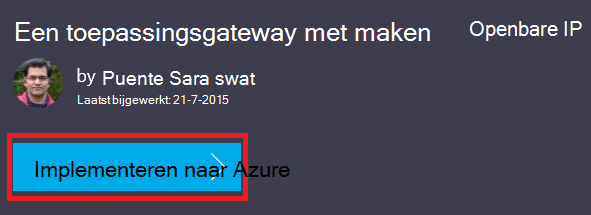

<properties
   pageTitle="Een toepassingsgateway maken met behulp van Azure resourcemanager sjablonen | Microsoft Azure"
   description="Deze pagina bevat instructies voor het maken van een toepassingsgateway Azure-met behulp van de resourcemanager Azure-sjabloon"
   documentationCenter="na"
   services="application-gateway"
   authors="georgewallace"
   manager="carmonm"
   editor="tysonn"/>
<tags
   ms.service="application-gateway"
   ms.devlang="na"
   ms.topic="article"
   ms.tgt_pltfrm="na"
   ms.workload="infrastructure-services"
   ms.date="10/25/2016"
   ms.author="gwallace"/>

# Een toepassingsgateway maken met behulp van de Azure resourcemanager-sjabloon

> [AZURE.SELECTOR]
- [Azure-portal](application-gateway-create-gateway-portal.md)
- [Azure resourcemanager PowerShell](application-gateway-create-gateway-arm.md)
- [Azure klassieke PowerShell](application-gateway-create-gateway.md)
- [Azure resourcemanager-sjabloon](application-gateway-create-gateway-arm-template.md)
- [Azure CLI](application-gateway-create-gateway-cli.md)

Azure-toepassingsgateway is een laag tot en met 7 taakverdeling. Deze biedt failover, performance-routing HTTP-aanvragen tussen verschillende servers, ongeacht of deze op de cloud of on-premises implementatie zijn. Toepassingsgateway bevat veel toepassing bezorging Controller (ADC) functies zoals HTTP van taakverdeling, cookie gebaseerde sessie affiniteit, Secure Sockets Layer (SSL) offload, aangepaste status sondes, ondersteuning voor multi-site en dergelijke. Ga voor een volledige lijst met ondersteunde functies naar [Toepassing Gateway-overzicht](application-gateway-introduction.md)

U informatie over het downloaden en een bestaande resourcemanager Azure-sjabloon van GitHub aanpassen en implementeren van de sjabloon in GitHub PowerShell en de CLI Azure.

Als u de sjabloon Azure resourcemanager rechtstreeks vanuit GitHub zonder wijzigingen gewoon implementeert, gaat u verder als u wilt implementeren van een sjabloon van GitHub.

## Scenario

In dit scenario zal u het volgende doen:

- Een toepassingsgateway maken met twee instanties.
- Maak een virtueel netwerk met de naam VirtualNetwork1 met een gereserveerde CIDR tekstblok 10.0.0.0/16.
- Maak een subnet Appgatewaysubnet die wordt gebruikt 10.0.0.0/28 als de blok CIDR genoemd.
- Back-enddatabase IP-adressen voor de endwebservers die u wilt laden saldo geconfigureerde instellen twee eerder het verkeer. In dit voorbeeld sjabloon zijn de IP-adressen voor de back-enddatabase 10.0.1.10 en 10.0.1.11.

>[AZURE.NOTE] Deze instellingen zijn de parameters voor deze sjabloon. Als u wilt aanpassen van de sjabloon, kunt u regels, de luisteraar ervan af en de SSL dat wordt geopend de azuredeploy.json wijzigen.

## Downloaden en meer informatie over de resourcemanager Azure-sjabloon

U kunt de bestaande resourcemanager Azure-sjabloon te maken van een virtueel netwerk en twee subnetten van GitHub, zorgt u wijzigingen die u mogelijk wilt en opnieuw downloaden. Gebruik hiervoor de volgende stappen uit:

1. Navigeer naar de [toepassingsgateway maken](https://github.com/Azure/azure-quickstart-templates/tree/master/101-application-gateway-create).
2. Klik op **azuredeploy.json**en klik vervolgens op **ONBEWERKTE**.
3. Sla het bestand op een lokale map op uw computer.
4. Als u bekend met Azure resourcemanager sjablonen bent, gaat u verder met stap 7.
5. Open het bestand dat u hebt opgeslagen en kijkt u naar de inhoud onder **parameters** in regel 5. Parameters van de sjabloon Azure resourcemanager bieden een tijdelijke aanduiding voor waarden die tijdens de installatie kunnen worden ingevuld.

  	| Parameter | Beschrijving |
  	|---|---|
  	| **locatie** | Azure regio waar de toepassingsgateway is gemaakt |
  	| **VirtualNetwork1** | Naam voor het nieuwe virtuele netwerk |
  	| **addressPrefix** | Adresruimte voor het virtuele netwerk, in CIDR indeling |
  	| **ApplicationGatewaysubnet** | Naam voor de toepassing gateway subnet |
  	| **subnetPrefix** | CIDR blokkeren voor de toepassing gateway subnet |
  	| **skuname** | SKU exemplaar grootte |
  	| **capaciteit** | Het aantal exemplaren |
  	| **backendaddress1** | IP-adres van de eerste webserver |
  	| **backendaddress2** | IP-adres van de tweede webserver |

    >[AZURE.IMPORTANT] Azure resourcemanager sjablonen onderhouden in GitHub kunnen na verloop van tijd wijzigen. Zorg ervoor dat u de sjabloon controleren voordat u deze gebruikt.

6. Controleer de inhoud onder **resources** en u ziet het volgende:

    - **type**. Type resource wordt gemaakt door de sjabloon. In dit geval is het type **Microsoft.Network/applicationGateways**, waarmee een toepassingsgateway.
    - **de naam**. De naam voor de resource. Zoals u ziet het gebruik van **[parameters('applicationGatewayName')]**, wat betekent dat de naam is opgegeven als invoer door u of door een parameterbestand tijdens de implementatie.
    - **Eigenschappen**. Lijst met eigenschappen voor de resource. Deze sjabloon maakt gebruik van de virtuele netwerk en het openbare IP-adres tijdens de gateway is gemaakt.

7. Ga terug naar [https://github.com/Azure/azure-quickstart-templates/blob/master/101-application-gateway-create/](https://github.com/Azure/azure-quickstart-templates/blob/master/101-application-gateway-create).
8. **Azuredeploy-paremeters.json**op en klik vervolgens op **ONBEWERKTE**.
9. Sla het bestand op een lokale map op uw computer.
10. Open het bestand dat u hebt opgeslagen en bewerk de waarden voor de parameters. Gebruik de volgende waarden wilt implementeren van de toepassingsgateway wordt beschreven in ons scenario.

        {
        "$schema": "http://schema.management.azure.com/schemas/2015-01-01/deploymentParameters.json#",
        {
        "location" : {
        "value" : "West US"
        },
        "addressPrefix": {
        "value": "10.0.0.0/16"
        },
        "subnetPrefix": {
        "value": "10.0.0.0/24"
        },
        "skuName": {
        "value": "Standard_Small"
        },
        "capacity": {
        "value": 2
        },
        "backendIpAddress1": {
        "value": "10.0.1.10"
        },
        "backendIpAddress2": {
        "value": "10.0.1.11"
        }
        }

11. Sla het bestand. U kunt de JSON parameter sjabloon en testen met behulp van online JSON validatie hulpmiddelen zoals [JSlint.com](http://www.jslint.com/).

## De sjabloon Azure resourcemanager implementeren via PowerShell

Als u nooit Azure PowerShell gebruikt nog, raadpleegt u [het installeren en configureren van Azure PowerShell](../powershell-install-configure.md) en volg de instructies om aan te melden bij Azure en selecteert u uw abonnement.

### Stap 1

    Login-AzureRmAccount

### Stap 2

Controleer de abonnementen voor het account.

    Get-AzureRmSubscription

U wordt gevraagd om te verifiëren met uw referenties.

### Stap 3

Kies welke van uw Azure-abonnementen te gebruiken.

    Select-AzureRmSubscription -Subscriptionid "GUID of subscription"

### Stap 4

Indien nodig een resourcegroep maken met behulp van de cmdlet **New-AzureResourceGroup** . In het volgende voorbeeld maakt u een resourcegroep AppgatewayRG in Oost-Amerikaanse locatie genoemd.

    New-AzureRmResourceGroup -Name AppgatewayRG -Location "East US"

Voer de cmdlet **New-AzureRmResourceGroupDeployment** als u wilt implementeren van het nieuwe virtuele netwerk met behulp van de voorgaande sjabloon en de parameterbestanden u hebt gedownload en gewijzigd.

    New-AzureRmResourceGroupDeployment -Name TestAppgatewayDeployment -ResourceGroupName AppgatewayRG `
        -TemplateFile C:\ARM\azuredeploy.json -TemplateParameterFile C:\ARM\azuredeploy-parameters.json

## De sjabloon Azure resourcemanager met behulp van de Azure CLI implementeren

Als u wilt de resourcemanager Azure-sjabloon die u hebt gedownload met behulp van Azure CLI implementeert, de volgende stappen uit te voeren:

### Stap 1

Als u nooit Azure CLI gebruikt nog, raadpleegt u [installeren en configureren van de Azure CLI](../xplat-cli-install.md) en volg de instructies tot aan het punt waar u uw Azure-account en een abonnement selecteren.

### Stap 2

Voer de opdracht **azure config modus** om te schakelen naar resourcemanager-modus, zoals hieronder wordt weergegeven.

    azure config mode arm

Hier ziet u de verwachte uitvoer voor de bovenstaande opdracht:

    info:   New mode is arm

### Stap 3

Als nodig is, voert u de opdracht **azure groep maken** om te maken van een nieuwe resourcegroep, zoals hieronder wordt weergegeven. Zoals u ziet de uitvoer van de opdracht. De lijst die wordt weergegeven na de uitvoer wordt uitgelegd van de parameters die worden gebruikt. Voor meer informatie over resourcegroepen, gaat u naar [Azure resourcemanager overzicht](../azure-resource-manager/resource-group-overview.md).

    azure group create -n appgatewayRG -l eastus

**-n (of--naam)**. De naam voor de nieuwe resourcegroep. In ons scenario is *appgatewayRG*.

**-l (of--locatie)**. Azure regio waar de nieuwe resourcegroep is gemaakt. In ons scenario is *eastus*.

### Stap 4

Voer de cmdlet **implementatie van azure groep maken** als u wilt implementeren van het nieuwe virtuele netwerk met behulp van de sjabloon en parameter bestanden die u hebt gedownload en gewijzigd hierboven. De lijst die wordt weergegeven na de uitvoer wordt uitgelegd van de parameters die worden gebruikt.

    azure group deployment create -g appgatewayRG -n TestAppgatewayDeployment -f C:\ARM\azuredeploy.json -e C:\ARM\azuredeploy-parameters.json

## De sjabloon Azure resourcemanager implementatie via klik te implementeren

Klik op te implementeren, is een andere manier om het Azure resourcemanager sjablonen gebruiken. Dit is een eenvoudige manier voor het gebruik van sjablonen in de portal van Azure.

### Stap 1

Ga naar [de toepassingsgateway van een met openbare IP-maken](https://azure.microsoft.com/documentation/templates/101-application-gateway-public-ip/).

### Stap 2

Klik op **implementeren naar Azure**.

### Stap 3

Vul de parameters voor de implementatiesjabloon op de portal en klik op **OK**.

### Stap 4

**Juridische voorwaarden** en klik op **kopen**.

### Stap 5

Klik op het blad aangepaste-implementatie op **maken**.

## Volgende stappen

Als u configureren SSL offload wilt, raadpleegt u [configureren de toepassingsgateway van een voor SSL offload](application-gateway-ssl.md).

Als u configureren van een toepassingsgateway wilt voor gebruik met een interne taakverdeling, raadpleegt u [een toepassingsgateway met een interne taakverdeling (ILB) maken](application-gateway-ilb.md).

Als u meer informatie over het laden taakverdeling opties in het algemeen wilt, gaat u naar:

- [Azure taakverdeling](https://azure.microsoft.com/documentation/services/load-balancer/)
- [Azure verkeer Manager](https://azure.microsoft.com/documentation/services/traffic-manager/)
