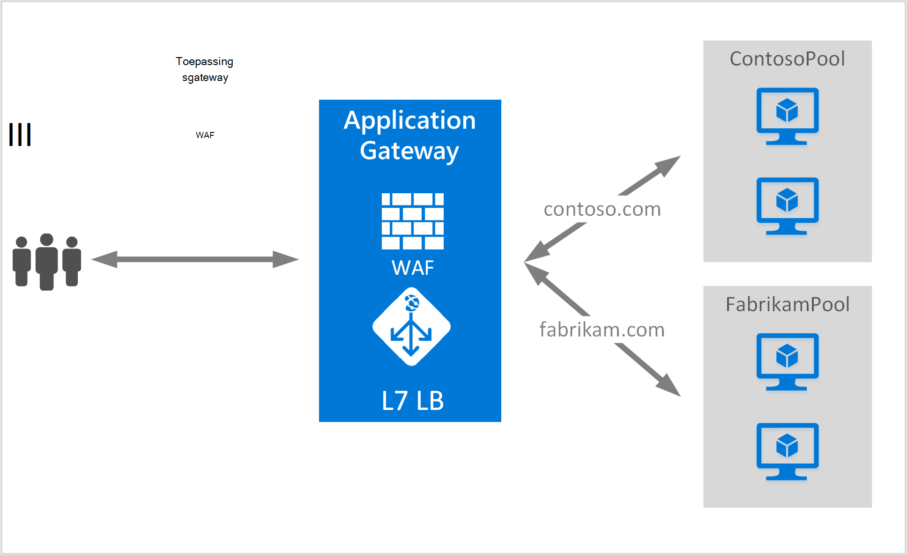

<properties
   pageTitle="Een toepassingsgateway voor het hosten van meerdere sites maken | Microsoft Azure"
   description="Deze pagina bevat instructies voor het maken en configureren van een toepassingsgateway Azure-voor het hosten van meerdere webtoepassingen op dezelfde gateway."
   documentationCenter="na"
   services="application-gateway"
   authors="amsriva"
   manager="rossort"
   editor="amsriva"/>
<tags
   ms.service="application-gateway"
   ms.devlang="na"
   ms.topic="article"
   ms.tgt_pltfrm="na"
   ms.workload="infrastructure-services"
   ms.date="10/25/2016"
   ms.author="amsriva"/>

# Een toepassingsgateway voor het hosten van meerdere webtoepassingen maken

> [AZURE.SELECTOR]
- [Azure-portal](application-gateway-create-multisite-portal.md)
- [Azure resourcemanager PowerShell](application-gateway-create-multisite-azureresourcemanager-powershell.md)

Meerdere site-host, kunt u meer dan één webtoepassing op dezelfde toepassingsgateway implementeren. Dit is afhankelijk van de aanwezigheid van host koptekst in de inkomende HTTP-aanvraag, om te bepalen welke luisteraar ervan af verkeer ontvangt. De luisteraar ervan af vervolgens wordt u omgeleid zodat verkeer naar de juiste backend-toepassingen zoals geconfigureerd in de definitie van de gateway. In webtoepassingen SSL is ingeschakeld, is de toepassingsgateway afhankelijk van de Server naam aanduiding (SNI)-extensie voor het kiezen van de juiste luisteraar ervan af voor de webverkeer. Er wordt vaak gebruikt voor het hosten van meerdere site balance '-verzoeken om verschillende webdomeinen naar andere back-enddatabase server pools laden. Meerdere subdomeinen van het dezelfde hoofddomein kunnen op dezelfde manier ook worden gehost op dezelfde toepassingsgateway.

## Scenario

In het volgende voorbeeld, toepassingsgateway wordt verkeer naar contoso.com en fabrikam.com fungeert met twee groepen van de back-end-server: contoso server-groep en fabrikam server-groep. Vergelijkbare setup kan worden gebruikt voor host subdomeinen, zoals app.contoso.com en blog.contoso.com.

## Voordat u begint

1. Installeer de meest recente versie van de Azure PowerShell-cmdlets met behulp van het installatieprogramma van de Web-Platform. U kunt downloaden en installeren van de meest recente versie van het **Windows PowerShell** -gedeelte van de [pagina Downloads](https://azure.microsoft.com/downloads/).
2. De servers die zijn toegevoegd aan de groep back-enddatabase gebruik van de toepassingsgateway moeten bestaan of hebt gemaakt hun eindpunten in het virtuele netwerk in een afzonderlijk subnet of met een openbare IP-/ VIP die zijn toegewezen.

## Vereisten

- **Back-enddatabase server-groep:** De lijst met IP-adressen van de back-end-servers. De IP-adressen vermeld ofwel moeten behoren tot de virtuele netwerk subnet of een openbare IP/VIP moeten worden. FQDN kan ook worden gebruikt.
- **Back-enddatabase groep serverinstellingen:** Elke groep heeft instellingen, zoals poort, protocol en cookie gebaseerde affiniteit. Deze instellingen zijn gekoppeld aan een groep en worden toegepast op alle servers in de groep.
- **Front poort:** Deze poort is de openbare poort dat is geopend in de toepassingsgateway. Verkeer raakt deze poort en vervolgens wordt omgeleid naar een van de back-end-servers.
- **Luisteraar ervan af:** De luisteraar ervan af heeft een front poort, een protocol (Http of Https, deze waarden zijn hoofdlettergevoelig), en de SSL-certificaat-naam (als SSL configureren offload). Voor meerdere locaties Toepassingsgateways, worden hostnaam en SNI indicatoren ook toegevoegd.
- **Regel:** De regel wordt gebonden de luisteraar ervan af, de back-enddatabase server-groep, en wordt gedefinieerd welke back-end-server-groep het verkeer moet worden doorgestuurd naar wanneer deze een bepaalde luisteraar ervan af.

## Een toepassingsgateway maken

Hier volgen de vereiste stappen voor het maken van een toepassingsgateway:

1. Een resourcegroep maken voor de Resource-Manager.
2. Maak een virtueel netwerk, subnetten en openbare IP-voor de toepassingsgateway.
3. Maak een application gateway configuratie-object.
4. Hiermee maakt u een bron van de gateway toepassing.

## Een resourcegroep maken voor bronbeheer

Zorg ervoor dat u de nieuwste versie van Azure PowerShell gebruikt. Meer informatie is beschikbaar op [Windows PowerShell gebruiken met bronbeheer](../powershell-azure-resource-manager.md).

### Stap 1

Meld u aan bij Azure

    Login-AzureRmAccount

U wordt gevraagd om te verifiëren met uw referenties.

### Stap 2

Controleer de abonnementen voor het account.

    Get-AzureRmSubscription

### Stap 3

Kies welke van uw Azure-abonnementen te gebruiken.

    Select-AzureRmSubscription -SubscriptionName "Name of subscription"

### Stap 4

Maak een resourcegroep (overslaan deze stap als u een bestaande resourcegroep gebruikt).

    New-AzureRmResourceGroup -Name appgw-RG -location "West US"

U kunt ook ook codes voor een resourcegroep voor toepassingsgateway maken:

    $resourceGroup = New-AzureRmResourceGroup -Name appgw-RG -Location "West US" -Tags @{Name = "testtag"; Value = "Application Gateway multiple site"}

Azure resourcemanager is vereist dat alle resourcegroepen Geef een locatie. Deze locatie wordt gebruikt als de standaardlocatie voor resources in die resourcegroep. Zorg ervoor dat alle opdrachten voor het maken van een toepassingsgateway dezelfde resourcegroep gebruiken.

In het voorbeeld hierboven, we hebben gemaakt een resourcegroep "appgw-RG" met een locatie van 'West ons' genoemd.

>[AZURE.NOTE] Als u nodig hebt voor het configureren van een aangepaste test voor uw toepassingsgateway, raadpleegt u [een toepassingsgateway met aangepaste sondes via PowerShell maken](application-gateway-create-probe-ps.md). Ga naar de [aangepaste sondes en de statuscontrole](application-gateway-probe-overview.md) voor meer informatie.

## Een virtueel netwerk en subnetten maken

Het volgende voorbeeld ziet u hoe u een virtueel netwerk maken met behulp van bronbeheer. Twee subnetten zijn gemaakt in deze stap. Het eerste subnet is voor de toepassingsgateway zelf. Toepassingsgateway is een eigen subnet, houdt u de exemplaren vereist. Alleen de Toepassingsgateways van andere kunnen worden geïmplementeerd in dat subnet. Het tweede subnet wordt gebruikt om de toepassing backend-servers.

### Stap 1

Het adres bereik 10.0.0.0/24 toewijzen aan de variabele subnet moet worden gebruikt voor het opslaan van de toepassingsgateway.

    $subnet = New-AzureRmVirtualNetworkSubnetConfig -Name appgatewaysubnet -AddressPrefix 10.0.0.0/24

### Stap 2

Het adres bereik 10.0.1.0/24 toewijzen aan de variabele subnet2 moet worden gebruikt voor de backend-toepassingen.

    $subnet2 = New-AzureRmVirtualNetworkSubnetConfig -Name backendsubnet -AddressPrefix 10.0.1.0/24

### Stap 3

Een virtueel netwerk met de naam 'appgwvnet' in resource groep "appgw-rg' voor een West Amerikaans gebied met het voorvoegsel 10.0.0.0/16 met subnet 10.0.0.0/24, maken en 10.0.1.0/24.

    $vnet = New-AzureRmVirtualNetwork -Name appgwvnet -ResourceGroupName appgw-RG -Location "West US" -AddressPrefix 10.0.0.0/16 -Subnet $subnet,$subnet2

### Stap 4

Een subnet variabele voor de volgende stappen die Hiermee maakt u een toepassingsgateway toewijzen.

    $appgatewaysubnet = Get-AzureRmVirtualNetworkSubnetConfig -Name appgatewaysubnet -VirtualNetwork $vnet
    $backendsubnet = Get-AzureRmVirtualNetworkSubnetConfig -Name backendsubnet -VirtualNetwork $vnet

## Maken van een openbare IP-adres van de front-configuratie

Een openbare IP-bron 'publicIP01' in de groep "appgw-rg van de resource" voor de regio West Amerikaans maken.

    $publicip = New-AzureRmPublicIpAddress -ResourceGroupName appgw-RG -name publicIP01 -location "West US" -AllocationMethod Dynamic

Een IP-adres is toegewezen aan de toepassingsgateway wanneer de service wordt gestart.

## Configuratie van de gateway toepassing maken

U moet alle configuratie-items instellen voordat u de toepassingsgateway maakt. De volgende stappen uit maken de configuratie-items die u nodig voor een resource van toepassing gateway hebt.

### Stap 1

Maak een toepassing gateway IP-configuratie met de naam 'gatewayIP01'. Wanneer toepassingsgateway wordt gestart, een IP-adres van het subnet geconfigureerd wordt opgehaald en netwerkverkeer doorsturen naar het IP-adressen in de groep van het IP-back-enddatabase. Houd er rekening mee dat elk exemplaar één IP-adres duurt.

    $gipconfig = New-AzureRmApplicationGatewayIPConfiguration -Name gatewayIP01 -Subnet $appgatewaysubnet

### Stap 2

De groep back-enddatabase IP-adressen met de naam "pool01" en "pool2" met IP-adressen configureren "10.0.1.100, 10.0.1.101,10.0.1.102 ' voor"pool1"en"10.0.1.103, 10.0.1.104, 10.0.1.105"voor"pool2".

    $pool1 = New-AzureRmApplicationGatewayBackendAddressPool -Name pool01 -BackendIPAddresses 10.0.1.100, 10.0.1.101, 10.0.1.102
    $pool2 = New-AzureRmApplicationGatewayBackendAddressPool -Name pool02 -BackendIPAddresses 10.0.1.103, 10.0.1.104, 10.0.1.105

In dit voorbeeld zijn er twee back-enddatabase van toepassingen om te leiden netwerkverkeer op basis van de gevraagde website. Een groep verkeer ontvangt van site 'contoso.com' en andere toepassingen verkeer ontvangt van de site "fabrikam.com". U hebt voor het vervangen van de voorgaande IP-adressen als u wilt toevoegen van uw eigen toepassing IP-adres eindpunten. In plaats van interne IP-adressen, kan u ook openbare IP-adressen, FQDN of van een VM NIC naar backend exemplaren gebruiken. Gebruik "-BackendFQDNs" parameter in PowerShell FQDN in plaats van IP-adressen opgeven.

### Stap 3

Toepassing gateway instelling "poolsetting01" en "poolsetting02" configureren voor het netwerkverkeer van taakverdeling in de groep back-enddatabase. In dit voorbeeld kunt u de instellingen van de verschillende back-enddatabase toepassingen voor de back-enddatabase van toepassingen configureren. Elke back-end-toepassingen kunt een eigen back-enddatabase groep instelling hebben.

    $poolSetting01 = New-AzureRmApplicationGatewayBackendHttpSettings -Name "besetting01" -Port 80 -Protocol Http -CookieBasedAffinity Disabled -RequestTimeout 120
    $poolSetting02 = New-AzureRmApplicationGatewayBackendHttpSettings -Name "besetting02" -Port 80 -Protocol Http -CookieBasedAffinity Enabled -RequestTimeout 240

### Stap 4

Configureer de front IP met openbare IP-eindpunt.

    $fipconfig01 = New-AzureRmApplicationGatewayFrontendIPConfig -Name "frontend1" -PublicIPAddress $publicip

### Stap 5

Configureer de front-poort voor de toepassingsgateway van een.

    $fp01 = New-AzureRmApplicationGatewayFrontendPort -Name "fep01" -Port 443

### Stap 6

Twee SSL-certificaten voor de twee websites gaan we ondersteuning in dit voorbeeld configureren. Een certificaat is bedoeld voor contoso.com verkeer en de andere voor fabrikam.com-verkeer is toegestaan. Deze certificaten moet een certificeringsinstantie certificaten voor uw websites. Zelfondertekende certificaten worden ondersteund, maar niet aanbevolen voor productie-verkeer is toegestaan.

    $cert01 = New-AzureRmApplicationGatewaySslCertificate -Name contosocert -CertificateFile <file path> -Password <password>
    $cert02 = New-AzureRmApplicationGatewaySslCertificate -Name fabrikamcert -CertificateFile <file path> -Password <password>

### Stap 7

Twee listeners voor de twee websites in dit voorbeeld configureren. Deze stap configureert de listeners voor openbare IP-adres, -poorten en -host gebruikt voor het ontvangen van binnenkomende verkeer. HostName parameter is vereist voor ondersteuning voor meerdere site en moet worden ingesteld op de juiste website waarvoor het verkeer wordt ontvangen. RequireServerNameIndication parameter moet worden ingesteld op waar voor websites die ondersteuning nodig voor SSL in een scenario voor meerdere host. Als het SSL-ondersteuning is vereist, moet u ook opgeven van het SSL-certificaat dat wordt gebruikt om verkeer voor die webtoepassing te beveiligen. De combinatie van FrontendIPConfiguration, FrontendPort en HostName moet uniek zijn voor een luisteraar ervan af. Een certificaat kan ondersteuning voor elke luisteraar ervan af.

    $listener01 = New-AzureRmApplicationGatewayHttpListener -Name "listener01" -Protocol Https -FrontendIPConfiguration $fipconfig01 -FrontendPort $fp01 -HostName "contoso11.com" -RequireServerNameIndication true  -SslCertificate $cert01
    $listener02 = New-AzureRmApplicationGatewayHttpListener -Name "listener02" -Protocol Https -FrontendIPConfiguration $fipconfig01 -FrontendPort $fp01 -HostName "fabrikam11.com" -RequireServerNameIndication true -SslCertificate $cert02

### Stap 8

Maak twee regel instellen voor de twee webtoepassingen in dit voorbeeld. Een regel verbindt samen listeners, backend-toepassingen en http-instellingen. Deze stap configureert de toepassingsgateway als u wilt gebruiken, eenvoudige doorstuurregel, één voor elke website. Verkeer naar elke website is ontvangen door de geconfigureerde luisteraar ervan af en vervolgens wordt doorgestuurd naar de geconfigureerde backend van toepassingen met de eigenschappen die zijn opgegeven in de BackendHttpSettings.

    $rule01 = New-AzureRmApplicationGatewayRequestRoutingRule -Name "rule01" -RuleType Basic -HttpListener $listener01 -BackendHttpSettings $poolSetting01 -BackendAddressPool $pool1
    $rule02 = New-AzureRmApplicationGatewayRequestRoutingRule -Name "rule02" -RuleType Basic -HttpListener $listener02 -BackendHttpSettings $poolSetting02 -BackendAddressPool $pool2

### Stap 9

Het aantal exemplaren en de grootte voor de toepassingsgateway configureren.

    $sku = New-AzureRmApplicationGatewaySku -Name "Standard_Medium" -Tier Standard -Capacity 2

## Toepassingsgateway maken

Een toepassingsgateway maken met alle configuratieobjecten in de voorgaande stappen.

    $appgw = New-AzureRmApplicationGateway -Name appgwtest -ResourceGroupName appgw-RG -Location "West US" -BackendAddressPools $pool1,$pool2 -BackendHttpSettingsCollection $poolSetting01, $poolSetting02 -FrontendIpConfigurations $fipconfig01 -GatewayIpConfigurations $gipconfig -FrontendPorts $fp01 -HttpListeners $listener01, $listener02 -RequestRoutingRules $rule01, $rule02 -Sku $sku -SslCertificates $cert01, $cert02

>[AZURE.IMPORTANT] Inrichting van toepassing Gateway is een langdurige bewerking en kan het enige tijd duren om te voltooien.

## Naam van de DNS-toepassing gateway ophalen

Nadat de gateway is gemaakt, is de volgende stap voor het configureren van de front-end voor communicatie. Wanneer u een openbare IP-adres, geeft toepassingsgateway een dynamisch toegewezen DNS-naam, dat wil niet geschikt zeggen is vereist. Om ervoor te zorgen eindgebruikers druk de toepassingsgateway een CNAME-record kunnen worden gebruikt zodat deze verwijzen naar de openbare eindpunt van de toepassingsgateway. [Het configureren van een aangepaste domeinnaam voor in Azure wordt aangegeven](../cloud-services/cloud-services-custom-domain-name-portal.md). Klik hiertoe ophalen details van de toepassingsgateway en de bijbehorende IP-/ DNS-naam met het PublicIPAddress-element dat is gekoppeld aan de toepassingsgateway. De van de toepassingsgateway DNS-naam moet worden gebruikt voor het maken van een CNAME-record, die wijst van de twee webtoepassingen naar deze DNS-naam. Het gebruik van de A-records wordt niet aanbevolen, omdat de VIP op opnieuw starten van toepassingsgateway kan veranderen.
    
    Get-AzureRmPublicIpAddress -ResourceGroupName appgw-RG -Name publicIP01
        
    Name                     : publicIP01
    ResourceGroupName        : appgw-RG
    Location                 : westus
    Id                       : /subscriptions/<subscription_id>/resourceGroups/appgw-RG/providers/Microsoft.Network/publicIPAddresses/publicIP01
    Etag                     : W/"00000d5b-54ed-4907-bae8-99bd5766d0e5"
    ResourceGuid             : 00000000-0000-0000-0000-000000000000
    ProvisioningState        : Succeeded
    Tags                     : 
    PublicIpAllocationMethod : Dynamic
    IpAddress                : xx.xx.xxx.xx
    PublicIpAddressVersion   : IPv4
    IdleTimeoutInMinutes     : 4
    IpConfiguration          : {
                                 "Id": "/subscriptions/<subscription_id>/resourceGroups/appgw-RG/providers/Microsoft.Network/applicationGateways/appgwtest/frontendIP
                               Configurations/frontend1"
                               }
    DnsSettings              : {
                                 "Fqdn": "00000000-0000-xxxx-xxxx-xxxxxxxxxxxx.cloudapp.net"
                               }

## Volgende stappen

Meer informatie over het beveiligen van uw websites met [Toepassingsgateway - Web Application Firewall](application-gateway-webapplicationfirewall-overview.md)