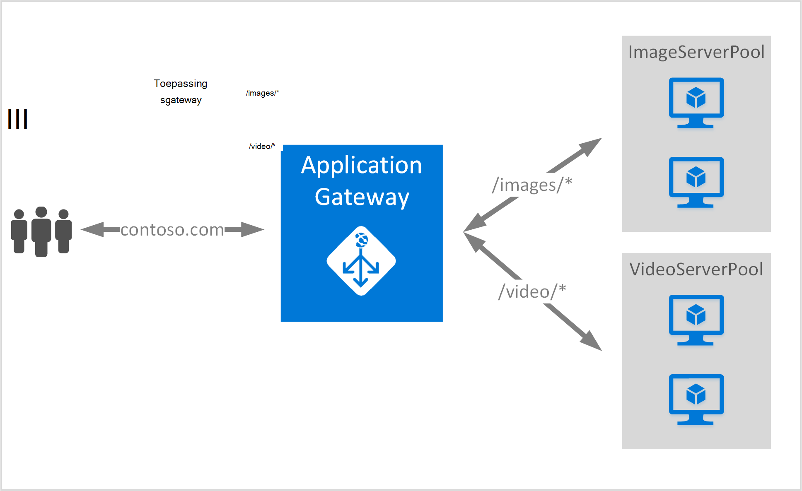

<properties
   pageTitle="Maken van een toepassingsgateway met regels voor het doorsturen van URL | Microsoft Azure"
   description="Deze pagina bevat instructies voor het maken en configureren van een Azure-toepassingsgateway met regels voor het doorsturen van URL"
   documentationCenter="na"
   services="application-gateway"
   authors="georgewallace"
   manager="jdial"
   editor="tysonn"/>
<tags
   ms.service="application-gateway"
   ms.devlang="na"
   ms.topic="article"
   ms.tgt_pltfrm="na"
   ms.workload="infrastructure-services"
   ms.date="10/25/2016"
   ms.author="gwallace"/>

# Een toepassingsgateway met pad gebaseerde routering maken 

> [AZURE.SELECTOR]
- [Azure-portal](application-gateway-create-url-route-portal.md)
- [Azure resourcemanager PowerShell](application-gateway-create-url-route-arm-ps.md)

URL-pad gebaseerde routering, kunt u routes op basis van het URL-pad van HTTP-aanvraag koppelen. Er wordt gecontroleerd of er is een doorsturen naar een groep met back-enddatabase geconfigureerd voor het URL-lijsten in Gateway-toepassing en het netwerkverkeer verzenden naar de gedefinieerde back-endpool. Er wordt een vaak gebruikt voor URL-e-mailroutering balance '-verzoeken om verschillende inhoudstypen aan groepen van verschillende back-end-server te laden.

URL-e-mailroutering maakt u kennis met een nieuwe regeltype tot toepassingsgateway. Toepassingsgateway heeft twee regeltypen: eenvoudige en PathBasedRouting. Eenvoudige regeltype biedt round robin-service voor het back-enddatabase van toepassingen terwijl PathBasedRouting naast round robin distributie, ook rekening pad patroon van de aanvraag-URL tijdens het kiezen van de backend-toepassingen.

>[AZURE.IMPORTANT] PathPattern: De lijst met pad patronen om aan te passen. Elk moet beginnen met / en alleen een '\*"is toegestaan is aan het einde. Geldige voorbeelden zijn/xyz, / XYZ* of /xyz/*. De tekenreeks die is ingevoerd in het pad matcher geen tekst bevatten na de eerste '? ' of '#', en deze tekens zijn niet toegestaan. 

## Scenario
In het volgende voorbeeld, toepassingsgateway wordt verkeer naar contoso.com fungeert met twee groepen van de back-end-server: video server-groep en afbeelding van de server-groep.

Aanvragen voor http://contoso.com/image* worden doorgestuurd naar de afbeelding van de server-groep (pool1), en http://contoso.com/video* worden gerouteerd naar video server-groep (pool2). Een standaard-server-groep (pool1) is geselecteerd als geen van de patronen pad overeenkomen met.

## Voordat u begint

1. Installeer de meest recente versie van de Azure PowerShell-cmdlets met behulp van het installatieprogramma van de Web-Platform. U kunt downloaden en installeren van de meest recente versie van het **Windows PowerShell** -gedeelte van de [pagina Downloads](https://azure.microsoft.com/downloads/).
2. U maakt een virtueel netwerk en subnet voor de Gateway-toepassing. Zorg ervoor dat er geen virtuele machines of cloud-implementaties het subnet worden gebruikt. De toepassingsgateway moet op zichzelf in een virtueel netwerk subnet.
3. De servers die zijn toegevoegd aan de groep back-enddatabase gebruik van de toepassingsgateway moeten bestaan of hebt gemaakt hun eindpunten in het virtuele netwerk of met een openbare IP-/ VIP die zijn toegewezen.

## Wat is vereist voor het maken van een toepassingsgateway?

- **Back-enddatabase server-groep:** De lijst met IP-adressen van de back-end-servers. De IP-adressen vermeld ofwel moeten behoren tot de virtuele netwerk subnet of een openbare IP/VIP moeten worden.
- **Back-enddatabase groep serverinstellingen:** Elke groep heeft instellingen, zoals poort, protocol en cookie gebaseerde affiniteit. Deze instellingen zijn gekoppeld aan een groep en worden toegepast op alle servers in de groep.
- **Front poort:** Deze poort is de openbare poort dat is geopend in de toepassingsgateway. Verkeer raakt deze poort en vervolgens wordt omgeleid naar een van de back-end-servers.
- **Luisteraar ervan af:** De luisteraar ervan af heeft een front poort, een protocol (Http of Https, dit zijn hoofdlettergevoelig), en de SSL-certificaat-naam (als SSL configureren offload).
- **Regel:** De regel de luisteraar ervan af, de back-enddatabase server-groep gekoppeld en wordt gedefinieerd welke back-end-server-groep het verkeer moet worden doorgestuurd naar wanneer deze een bepaalde luisteraar ervan af.

## Een toepassingsgateway maken

Het verschil tussen het gebruik van Azure klassieke en Azure Resource Manager is de volgorde waarin u de toepassingsgateway en de items die moeten worden geconfigureerd maken.

Met resourcemanager, alle items die deel uitmaken van een toepassingsgateway zijn geconfigureerd afzonderlijk en zet vervolgens samen om te maken van de gateway-resource van toepassing.

Hier volgen de stappen die nodig zijn voor het maken van een toepassingsgateway:

1. Een resourcegroep maken voor de Resource-Manager.
2. Maak een virtueel netwerk, subnet, en openbare IP-voor de toepassingsgateway.
3. Maak een application gateway configuratie-object.
4. Hiermee maakt u een bron van de gateway toepassing.

## Een resourcegroep maken voor bronbeheer

Zorg ervoor dat u de nieuwste versie van Azure PowerShell gebruikt. Meer informatie is beschikbaar op [Windows PowerShell gebruiken met bronbeheer](../powershell-azure-resource-manager.md).

### Stap 1

Meld u aan bij Azure

    Login-AzureRmAccount

U wordt gevraagd om te verifiëren met uw referenties. 

### Stap 2

Controleer de abonnementen voor het account.

    Get-AzureRmSubscription

### Stap 3

Kies welke van uw Azure-abonnementen te gebruiken.  

    Select-AzureRmSubscription -Subscriptionid "GUID of subscription"

### Stap 4

Maak een resourcegroep (overslaan deze stap als u een bestaande resourcegroep gebruikt).

    New-AzureRmResourceGroup -Name appgw-RG -Location "West US"

U kunt ook ook codes voor een resourcegroep voor toepassingsgateway maken:
    
    $resourceGroup = New-AzureRmResourceGroup -Name appgw-RG -Location "West US" -Tags @{Name = "testtag"; Value = "Application Gateway URL routing"} 

Azure resourcemanager is vereist dat alle resourcegroepen Geef een locatie. Dit wordt gebruikt als de standaardlocatie voor resources in die resourcegroep. Zorg ervoor dat alle opdrachten voor het maken van een toepassingsgateway dezelfde resourcegroep gebruiken.

In het voorbeeld hierboven, we hebben gemaakt een resourcegroep 'appgw-RG' en de locatie 'West ons' genoemd.

>[AZURE.NOTE] Als u nodig hebt voor het configureren van een aangepaste test voor uw toepassingsgateway, raadpleegt u [een toepassingsgateway met aangepaste sondes via PowerShell maken](application-gateway-create-probe-ps.md). Bekijk de [aangepaste sondes en de statuscontrole](application-gateway-probe-overview.md) voor meer informatie.

## Een virtueel netwerk en een subnet voor de toepassingsgateway maken

Het volgende voorbeeld ziet u hoe u een virtueel netwerk maken met behulp van bronbeheer.

### Stap 1

Het adres bereik 10.0.0.0/24 toewijzen aan de variabele subnet moet worden gebruikt om te maken van een virtueel netwerk.

    $subnet = New-AzureRmVirtualNetworkSubnetConfig -Name subnet01 -AddressPrefix 10.0.0.0/24

### Stap 2

Maak een virtueel netwerk met de naam 'appgwvnet' in resource groep "appgw-rg' voor een West Amerikaans gebied met het voorvoegsel 10.0.0.0/16 met subnet 10.0.0.0/24.

    $vnet = New-AzureRmVirtualNetwork -Name appgwvnet -ResourceGroupName appgw-RG -Location "West US" -AddressPrefix 10.0.0.0/16 -Subnet $subnet

### Stap 3

Een subnet variabele voor de volgende stappen die Hiermee maakt u een toepassingsgateway toewijzen.

    $subnet=$vnet.Subnets[0]

## Maken van een openbare IP-adres van de front-configuratie

Een openbare IP-bron 'publicIP01' in de groep "appgw-rg van de resource" voor de regio West Amerikaans maken.

    $publicip = New-AzureRmPublicIpAddress -ResourceGroupName appgw-RG -name publicIP01 -location "West US" -AllocationMethod Dynamic

Een IP-adres is toegewezen aan de toepassingsgateway wanneer de service wordt gestart.

## Configuratie van de gateway toepassing maken

Alle configuratie-items moeten worden ingesteld voordat u de toepassingsgateway maakt. De volgende stappen uit maken de configuratie-items die u nodig voor een resource van toepassing gateway hebt.

### Stap 1

Maak een toepassing gateway IP-configuratie met de naam 'gatewayIP01'. Wanneer toepassingsgateway wordt gestart, een IP-adres van het subnet geconfigureerd wordt opgehaald en netwerkverkeer doorsturen naar het IP-adressen in de groep van het IP-back-enddatabase. Houd er rekening mee dat elk exemplaar één IP-adres duurt.

    $gipconfig = New-AzureRmApplicationGatewayIPConfiguration -Name gatewayIP01 -Subnet $subnet

### Stap 2

Configureren van de back-enddatabase IP-adres van toepassingen met de naam "pool01" en "pool2" met IP-adressen "134.170.185.46, 134.170.188.221,134.170.185.50 ' voor 'pool1' en ' 134.170.186.46, 134.170.189.221,134.170.186.50 ' voor 'pool2'.

    $pool1 = New-AzureRmApplicationGatewayBackendAddressPool -Name pool01 -BackendIPAddresses 134.170.185.46, 134.170.188.221,134.170.185.50

    $pool2 = New-AzureRmApplicationGatewayBackendAddressPool -Name pool02 -BackendIPAddresses 134.170.186.46, 134.170.189.221,134.170.186.50

In dit voorbeeld zijn er twee back-enddatabase van toepassingen om te leiden netwerkverkeer op basis van de URL-pad. Een groep verkeer ontvangt van URL-pad '/ video' en andere toepassingen verkeer ontvangt van pad "/ image". Vervang de voorgaande IP-adressen als u wilt toevoegen van uw eigen toepassing IP-adres eindpunten. 

### Stap 3

Toepassing gateway instelling "poolsetting01" en "poolsetting02" configureren voor het netwerkverkeer van taakverdeling in de groep back-enddatabase. In dit voorbeeld kunt u de instellingen van de verschillende back-enddatabase toepassingen voor de back-enddatabase van toepassingen configureren. Elke back-end-toepassingen kunt een eigen instelling back-enddatabase groep hebben.

    $poolSetting01 = New-AzureRmApplicationGatewayBackendHttpSettings -Name "besetting01" -Port 80 -Protocol Http -CookieBasedAffinity Disabled -RequestTimeout 120

    $poolSetting02 = New-AzureRmApplicationGatewayBackendHttpSettings -Name "besetting02" -Port 80 -Protocol Http -CookieBasedAffinity Enabled -RequestTimeout 240

### Stap 4

Configureer de front IP met openbare IP-eindpunt.

    $fipconfig01 = New-AzureRmApplicationGatewayFrontendIPConfig -Name "frontend1" -PublicIPAddress $publicip

### Stap 5 

Configureer de front-poort voor de toepassingsgateway van een.

    $fp01 = New-AzureRmApplicationGatewayFrontendPort -Name "fep01" -Port 80
### Stap 6

Configureer de luisteraar ervan af. Deze stap configureert de luisteraar ervan af voor het openbare IP-adres en poort die wordt gebruikt voor het ontvangen van binnenkomende netwerkverkeer. 
 
    $listener = New-AzureRmApplicationGatewayHttpListener -Name "listener01" -Protocol Http -FrontendIPConfiguration $fipconfig01 -FrontendPort $fp01

### Stap 7 

URL-regel paden voor de back-enddatabase van toepassingen configureren. Deze stap configureert het relatieve pad wordt gebruikt door de toepassingsgateway voor de toewijzing tussen URL-pad en welke back-enddatabase-groep is toegewezen aan het verwerken van de binnenkomende verkeer definiëren.

Twee regels Hiermee maakt u het volgende voorbeeld: één voor '/ afbeelding /' pad routeren verkeer naar back-enddatabase "pool1" en '/ video /' pad routeren van verkeer naar de back-enddatabase "pool2" een tijdelijke aanduiding.
    
    $imagePathRule = New-AzureRmApplicationGatewayPathRuleConfig -Name "pathrule1" -Paths "/image/*" -BackendAddressPool $pool1 -BackendHttpSettings $poolSetting01

    $videoPathRule = New-AzureRmApplicationGatewayPathRuleConfig -Name "pathrule2" -Paths "/video/*" -BackendAddressPool $pool2 -BackendHttpSettings $poolSetting02

De configuratie van regel pad map ook een back-enddatabase adres standaardgroep geconfigureerd als het pad niet overeenkomen met een van de regels vooraf gedefinieerd pad. 

    $urlPathMap = New-AzureRmApplicationGatewayUrlPathMapConfig -Name "urlpathmap" -PathRules $videoPathRule, $imagePathRule -DefaultBackendAddressPool $pool1 -DefaultBackendHttpSettings $poolSetting02

### Stap 8

De instelling van een regel maken. Deze stap configureert de toepassingsgateway als u wilt gebruiken met URL-pad gebaseerde routering.

    $rule01 = New-AzureRmApplicationGatewayRequestRoutingRule -Name "rule1" -RuleType PathBasedRouting -HttpListener $listener -UrlPathMap $urlPathMap

### Stap 9

Het aantal exemplaren en de grootte voor de toepassingsgateway configureren.

    $sku = New-AzureRmApplicationGatewaySku -Name "Standard_Small" -Tier Standard -Capacity 2

## Toepassingsgateway maken

Een toepassingsgateway maken met alle configuratieobjecten in de voorgaande stappen.

    $appgw = New-AzureRmApplicationGateway -Name appgwtest -ResourceGroupName appgw-RG -Location "West US" -BackendAddressPools $pool1,$pool2 -BackendHttpSettingsCollection $poolSetting01, $poolSetting02 -FrontendIpConfigurations $fipconfig01 -GatewayIpConfigurations $gipconfig -FrontendPorts $fp01 -HttpListeners $listener -UrlPathMaps $urlPathMap -RequestRoutingRules $rule01 -Sku $sku

## Naam van de DNS-toepassing gateway ophalen

Nadat de gateway is gemaakt, is de volgende stap voor het configureren van de front-end voor communicatie. Wanneer u een openbare IP-adres, geeft toepassingsgateway een dynamisch toegewezen DNS-naam, dat wil niet geschikt zeggen is vereist. Om ervoor te zorgen eindgebruikers druk de toepassingsgateway een CNAME-record kunnen worden gebruikt zodat deze verwijzen naar de openbare eindpunt van de toepassingsgateway. [Het configureren van een aangepaste domeinnaam voor in Azure wordt aangegeven](../cloud-services/cloud-services-custom-domain-name-portal.md). Klik hiertoe ophalen details van de toepassingsgateway en de bijbehorende IP-/ DNS-naam met het PublicIPAddress-element dat is gekoppeld aan de toepassingsgateway. De van de toepassingsgateway DNS-naam moet worden gebruikt voor het maken van een CNAME-record, die wijst van de twee webtoepassingen naar deze DNS-naam. Het gebruik van de A-records wordt niet aanbevolen, omdat de VIP op opnieuw starten van toepassingsgateway kan veranderen.
    
    Get-AzureRmPublicIpAddress -ResourceGroupName appgw-RG -Name publicIP01
        
    Name                     : publicIP01
    ResourceGroupName        : appgw-RG
    Location                 : westus
    Id                       : /subscriptions/<subscription_id>/resourceGroups/appgw-RG/providers/Microsoft.Network/publicIPAddresses/publicIP01
    Etag                     : W/"00000d5b-54ed-4907-bae8-99bd5766d0e5"
    ResourceGuid             : 00000000-0000-0000-0000-000000000000
    ProvisioningState        : Succeeded
    Tags                     : 
    PublicIpAllocationMethod : Dynamic
    IpAddress                : xx.xx.xxx.xx
    PublicIpAddressVersion   : IPv4
    IdleTimeoutInMinutes     : 4
    IpConfiguration          : {
                                 "Id": "/subscriptions/<subscription_id>/resourceGroups/appgw-RG/providers/Microsoft.Network/applicationGateways/appgwtest/frontendIP
                               Configurations/frontend1"
                               }
    DnsSettings              : {
                                 "Fqdn": "00000000-0000-xxxx-xxxx-xxxxxxxxxxxx.cloudapp.net"
                               }

## Volgende stappen

Als u wilt leren offload Secure Sockets Layer (SSL), raadpleegt u [configureren de toepassingsgateway van een voor SSL offload](application-gateway-ssl-arm.md).