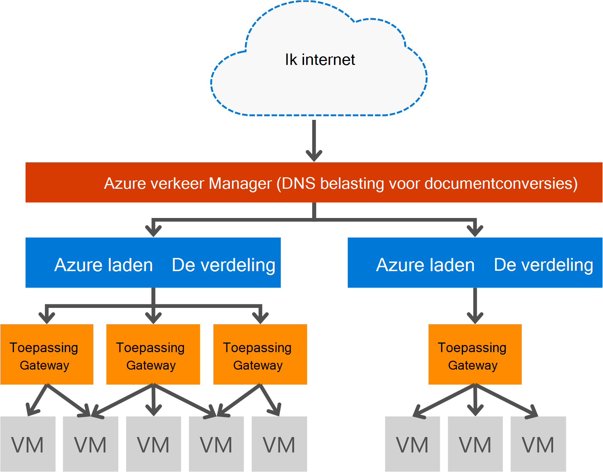

<properties
   pageTitle="Inleiding tot toepassingsgateway | Microsoft Azure"
   description="Deze pagina bevat een overzicht van de toepassingsgateway-service voor de laag 7 taakverdeling, inclusief de grootte van de gateway, HTTP affiniteit van taakverdeling, op basis van cookie-sessie te laden en SSL offload."
   documentationCenter="na"
   services="application-gateway"
   authors="georgewallace"
   manager="carmonm"
   editor="tysonn"/>
<tags
   ms.service="application-gateway"
   ms.devlang="na"
   ms.topic="hero-article"
   ms.tgt_pltfrm="na"
   ms.workload="infrastructure-services"
   ms.date="10/25/2016"
   ms.author="gwallace"/>

# Overzicht van de Gateway toepassing

## Wat is de Gateway-toepassing

Microsoft Azure-toepassingsgateway biedt toepassing bezorging Controller (ADC) als een service, via van verschillende lagen 7 taakverdeling mogelijkheden voor uw toepassing. Hiermee kunnen klanten web-farm productiviteit optimaliseren door offloading CPU intensief SSL-beëindiging op de Gateway-toepassing. Ook vindt u hier andere laag 7-functies routeren inclusief round robin distributie van binnenkomende verkeer, cookie op basis van sessie affiniteit, het URL-pad op basis van Routering en de mogelijkheid voor het hosten van meerdere websites achter één toepassingsgateway. Toepassingsgateway, heeft ook een web-toepassing firewall (WAF) die uw toepassing ten opzichte van de grootste deel van de OWASP bovenste 10 algemene web problemen beschermen. De toepassingsgateway kan worden geconfigureerd als internet omlaag gateway, interne enige gateway of een combinatie van beide. Toepassingsgateway is volledig Azure beheerd, scalable en ten zeerste beschikbaar. Deze biedt uitgebreide reeks diagnostisch hulpprogramma en mogelijkheden voor logboekregistratie voor betere beheerbaarheid. Toepassingsgateway werkt met virtuele machines, cloudservices en interne en externe omlaag webtoepassingen.

Toepassingsgateway is een speciale virtuele toestel voor uw toepassing en omvat van meerdere exemplaren van de werknemer voor schaalbaarheid en betere beschikbaarheid. Wanneer u een toepassingsgateway maakt, is een eindpunt (openbare VIP of interne ILB IP) die zijn gekoppeld en die wordt gebruikt voor netwerkverkeer ingress. Deze VIP of ILB IP krijgt u van taakverdeling Azure op het transportniveau van (TCP/UDP) en die alle binnenkomende netwerkverkeer wordt verdeeld in de toepassingsgateway-exemplaren werknemer. De Gateway-toepassing en de HTTP-/ HTTPS-verkeer is toegestaan op basis van de configuratie of u nu een virtuele machine, routes cloud-service, interne of een extern IP-adres. Voor de SLA en prijzen, raadpleegt u de pagina's [SLA](https://azure.microsoft.com/support/legal/sla/) en [prijzen](https://azure.microsoft.com/pricing/details/application-gateway/) .

## Functies

Toepassingsgateway worden momenteel ondersteund laag 7-toepassing bezorging met de volgende functies:

- **[Web Application Firewall (Preview)](application-gateway-webapplicationfirewall-overview.md)** - de firewall-toepassing (WAF) in het vak Azure-toepassingsgateway voorkomt webtoepassingen algemene aanvallen zoals SQL webweergave, uitvoeren van scripts op meerdere sites-aanvallen en sessie hijacks.
- **HTTP van taakverdeling** - toepassingsgateway biedt round robin van taakverdeling. Taakverdeling is gedaan te laag 7 en wordt gebruikt voor alleen HTTP (S)-verkeer is toegestaan.
- **Cookie gebaseerde sessie affiniteit** - met deze functie is handig als u wilt bewaren van de sessie van een gebruiker op de dezelfde back-enddatabase. Met behulp van de gateway beheerde cookies kan de Gateway-toepassing verkeer latere van een gebruikerssessie naar dezelfde back-end voor verwerking. Deze functie is belangrijk in gevallen waarin sessie staat lokaal op de server back-enddatabase voor een gebruikerssessie opgeslagen.
- **[Secure Sockets Layer (SSL) offload](application-gateway-ssl-arm.md)** - deze functie duurt de taak dure HTTPS-verkeer uit uw endwebservers decoderen van. Door de verbinding wordt verbroken SSL in de Gateway-toepassing en doorsturen van de aanvraag naar niet-versleutelde server, wordt de webserver unburdened door de ontsleutelen.  Het antwoord toepassingsgateway opnieuw gecodeerd voordat u deze verzendt terug naar de klant. Deze functie is handig in scenario's waarin de back-enddatabase bevindt zich in hetzelfde beveiligde virtuele netwerk als de Gateway-toepassing in Azure wordt aangegeven.
- **[End-to-End-SSL](application-gateway-backend-ssl.md)** - toepassingsgateway ondersteunt end-to-end-versleuteling verkeer. Toepassingsgateway wordt de verbinding wordt verbroken SSL in de toepassingsgateway. De gateway vervolgens regels voor de routering is van toepassing op het verkeer, opnieuw worden gecodeerd het pakket en de doorgestuurd naar de juiste backend op basis van de regels voor de routering gedefinieerd. Geen antwoord van de webserver doorloopt hetzelfde proces terug naar de eindgebruiker.
- **[Inhoud routering op basis van een URL](application-gateway-url-route-overview.md)** - deze functie biedt de mogelijkheid voor het gebruik van verschillende backend-servers voor verschillende verkeer. Netwerkverkeer voor een map op de webserver of voor een CDN kan worden doorgestuurd naar een andere back-end, overbodige belasting op backends die geen specifieke inhoud dienen verkleinen.
- **[Omleiding van meerdere site](application-gateway-multi-site-overview.md)** - toepassing gateway kan voor u om samen te voegen maximaal 20 websites op een gateway één toepassing.
- **[Ondersteuning voor Websocket](application-gateway-websocket.md)** - een andere handige functie van de Gateway-toepassing, is de systeemeigen ondersteuning voor Websocket.
- **[Statuscontrole](application-gateway-probe-overview.md)** - toepassingsgateway biedt standaard statuscontrole backend resources en aangepaste controleert of als u wilt controleren voor meer informatie over scenario's.

## Voordelen

Toepassingsgateway is handig voor:

- Toepassingen waarvoor aanmeldingsaanvragen van dezelfde gebruiker/client sessie naar dezelfde back-enddatabase virtuele machine hebt bereikt. Voorbeelden van deze toepassingen zou worden winkelen winkelwagen apps en e-mail-endwebservers.
- Toepassingen die u wilt vrijgeven webserver-farms van SSL beë boven.
- Toepassingen, zoals een netwerk voor contentlevering, waarvoor u moet meerdere HTTP-aanvragen op de dezelfde langdurige TCP-verbinding met worden gerouteerd of laden naar verschillende back-enddatabase servers verdeeld.
- Toepassingen die ondersteuning bieden voor websocket verkeer
- Beveiligen webtoepassingen van algemene aanvallen zoals SQL webweergave uitvoeren van scripts op meerdere sites-aanvallen en sessie hijacks.

Toepassingsgateway taakverdeling als een beheerde Azure-service kan de inrichting van een laag 7 taakverdeling achter de taakverdeling Azure software. Verkeer manager kan worden gebruikt om te voltooien het scenario zoals gezien in de volgende afbeelding. Wanneer verkeer Manager omleiding en beschikbaarheid, taakverdeling vindt u in de regio schaalbaarheid en beschikbaarheid en toepassingsgateway bevat cross regio layer 7-taakverdeling.

[AZURE.INCLUDE [load-balancer-compare-tm-ag-lb-include.md](../../includes/load-balancer-compare-tm-ag-lb-include.md)]

## Gateway-grootte en exemplaren

Toepassingsgateway is momenteel verkrijgbaar in drie grootte: klein, normaal en groot. Kleine exemplaar grootten zijn bedoeld voor de ontwikkeling en testen scenario's.

Er zijn momenteel twee SKU's voor de Gateway-toepassing: WAF en standaard.

U kunt maximaal 50 Toepassingsgateways per abonnement maken en de toepassingsgateway van elke kan maximaal 10 exemplaren hebben. Elke toepassingsgateway kan bestaan uit 20 http listeners. Ga naar de pagina [Service limieten](../azure-subscription-service-limits.md#application-gateway) voor een volledige lijst van toepassing gateway limieten.

De volgende tabel ziet u een gemiddelde prestaties doorvoer voor elk exemplaar van de gateway toepassing:

| Back-enddatabase pagina antwoord | Kleine | Gemiddeld | Grote|
|---|---|---|---|
| 6K | 7.5 Mbps | 13 Mbps | 50 Mbps |
|100K | 35 Mbps | 100 Mbps| 200 Mbps |

>[AZURE.NOTE] Deze waarden zijn niet-geheel exacte waarden een toepassing gateway worden verwerkt. De werkelijke doorvoer is afhankelijk van verschillende omgeving details, zoals gemiddelde paginaformaat, locatie van de back-enddatabase exemplaren, en de verwerkingstijd moet fungeren van een pagina. Voor getallen met een exacte prestaties, moet u uw eigen tests uitvoeren, deze waarden zijn alleen beschikbaar voor capaciteit, planning richtlijnen.

## Statuscontrole

Azure-toepassingsgateway wordt automatisch de status van de back-enddatabase exemplaren via basic of aangepaste status controleert. Met behulp van de servicestatus sondes dit het zorgt ervoor dat alleen correct hosts op verkeer reageren. Zie de [toepassingsgateway systeemstatus controleren-overzicht](application-gateway-probe-overview.md)voor meer informatie.

## Configureren en beheren

Toepassingsgateway kunt voor het eindpunt hebben een openbare IP-adres, particuliere IP- of beide wanneer deze is geconfigureerd. Toepassingsgateway is geconfigureerd binnen een virtueel netwerk in een eigen subnet. Het subnet gemaakt of die wordt gebruikt voor de toepassingsgateway mogen geen andere soorten resources bevatten, de enige resources die zijn toegestaan in het subnet andere Toepassingsgateways zijn. Als u wilt beveiligen van uw resources backend de backend kunnen servers worden opgenomen in een ander subnet in hetzelfde virtuele netwerk als de toepassingsgateway. Dit extra subnet die deze niet zijn vereist voor de backend-toepassingen, zolang de toepassingsgateway het IP-adres bereiken kunt, toepassingsgateway kan ADC mogelijkheden bieden voor de backend-servers.

U kunt maken en beheren van een toepassingsgateway met behulp van de REST API's, PowerShell-cmdlets, Azure CLI of [Azure-portal](https://portal.azure.com/).

## Volgende stappen

Na het leren over de toepassingsgateway, kunt u [een toepassingsgateway maken](application-gateway-create-gateway-portal.md) of u kunt [maken van een toepassingsgateway SSL offload](application-gateway-ssl-arm.md) Verdeel de werklast HTTPS verbindingen aan.

Informatie over het maken van een toepassingsgateway met URL gebaseerde inhoud routering, gaat u naar [een toepassingsgateway met URL-e-mailroutering maken](application-gateway-create-url-route-arm-ps.md) voor meer informatie.

