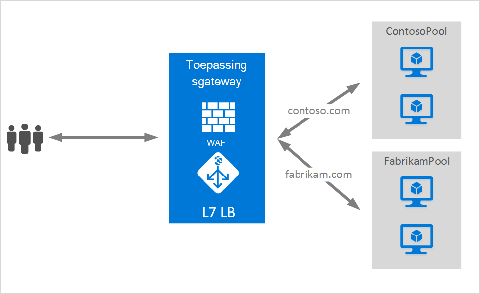

<properties
   pageTitle="Meerdere sites op Gateway-toepassing | Microsoft Azure"
   description="Deze pagina bevat een overzicht van de toepassingsgateway-ondersteuning voor meerdere site."
   documentationCenter="na"
   services="application-gateway"
   authors="amsriva"
   manager="rossort"
   editor="amsriva"/>
<tags
   ms.service="application-gateway"
   ms.devlang="na"
   ms.topic="hero-article"
   ms.tgt_pltfrm="na"
   ms.workload="infrastructure-services"
   ms.date="10/25/2016"
   ms.author="amsriva"/>

# Toepassingsgateway meerdere site-host

Meerdere site-host, kunt u meer dan één webtoepassing configureren op dezelfde gateway-toepassing sessie. Deze functie kunt u een efficiënter topologie voor uw implementaties configureren door maximaal 20 websites toe te voegen tot één toepassingsgateway. Elke website kunt doorgestuurd naar een eigen backend-toepassingen. In het volgende voorbeeld fungeert toepassingsgateway wordt verkeer naar contoso.com en fabrikam.com van twee back-end-server pools genaamd ContosoServerPool en FabrikamServerPool van.

Verzoeken om http://contoso.com worden doorgestuurd naar ContosoServerPool en http://fabrikam.com worden doorgestuurd naar FabrikamServerPool.

Twee subdomeinen van hetzelfde bovenliggende domein kunnen ook worden gehost op de dezelfde toepassing gateway-implementatie. Voorbeelden van het gebruik van subdomeinen kunnen zijn http://blog.contoso.com en http://app.contoso.com die worden gehost op een één toepassing gateway-implementatie.

## Host kop- en Server naam aanduiding (SNI)

Er zijn drie algemene regelingen voor het inschakelen van meerdere site-host op dezelfde infrastructuur.

1. Hosten meerdere webtoepassingen elke op een unieke IP-adres.
2. Hostnaam gebruiken voor het hosten van meerdere webtoepassingen op hetzelfde IP-adres.
3. Verschillende poorten gebruiken voor het hosten van meerdere webtoepassingen op hetzelfde IP-adres.

Een toepassingsgateway krijgt momenteel één openbare IP-adres waarop deze naar verkeer luistert. Daarom ondersteunende meerdere toepassingen, is elk voorzien van een eigen IP-adres momenteel niet ondersteund. Toepassingsgateway ondersteunt meerdere toepassingen hostingprovider elke luisteren op verschillende poorten, maar dit scenario moet de toepassingen naar de verkeer op niet-standaard poorten accepteren en is het meestal niet een gewenste configuratie. Toepassingsgateway is afhankelijk van HTTP 1.1 host-headers voor het hosten van meer dan één website op hetzelfde openbare IP-adres en dezelfde poort. De sites die worden gehost op toepassingsgateway kunnen ook ondersteuning SSL offload met Server naam aanduiding (SNI) TLS extensie. Dit scenario betekent dat de client-browser en backend web-farm moet ondersteuning bieden voor HTTP/1.1 en TLS extensie zoals gedefinieerd in RFC 6066.

## Luisteraar ervan af configuratie-element

Bestaande HTTPListener configuratie-element is uitgebreid om te ondersteunen van host naam en server naam vermelding elementen, die wordt gebruikt door de toepassingsgateway bij naar route-verkeer naar de juiste backend-toepassingen. Het volgende voorbeeld is het fragment van het sjabloonbestand HttpListeners-element.

    "httpListeners": [
                {
                    "name": "appGatewayHttpsListener1",
                    "properties": {
                        "FrontendIPConfiguration": {
                            "Id": "/subscriptions/<subid>/resourceGroups/<rgName>/providers/Microsoft.Network/applicationGateways/applicationGateway1/frontendIPConfigurations/DefaultFrontendPublicIP"
                        },
                        "FrontendPort": {
                            "Id": "/subscriptions/<subid>/resourceGroups/<rgName>/providers/Microsoft.Network/applicationGateways/applicationGateway1/frontendPorts/appGatewayFrontendPort443'"
                        },
                        "Protocol": "Https",
                        "SslCertificate": {
                            "Id": "/subscriptions/<subid>/resourceGroups/<rgName>/providers/Microsoft.Network/applicationGateways/applicationGateway1/sslCertificates/appGatewaySslCert1'"
                        },
                        "HostName": "contoso.com",
                        "RequireServerNameIndication": "true"
                    }
                },
                {
                    "name": "appGatewayHttpListener2",
                    "properties": {
                        "FrontendIPConfiguration": {
                            "Id": "/subscriptions/<subid>/resourceGroups/<rgName>/providers/Microsoft.Network/applicationGateways/applicationGateway1/frontendIPConfigurations/appGatewayFrontendIP'"
                        },
                        "FrontendPort": {
                            "Id": "/subscriptions/<subid>/resourceGroups/<rgName>/providers/Microsoft.Network/applicationGateways/applicationGateway1/frontendPorts/appGatewayFrontendPort80'"
                        },
                        "Protocol": "Http",
                        "HostName": "fabrikam.com",
                        "RequireServerNameIndication": "false"
                    }
                }
            ],

U kunt [resourcemanager-sjabloon met meerdere site hostingprovider](https://github.com/Azure/azure-quickstart-templates/blob/master/201-application-gateway-multihosting) bezoeken voor een end-to-end op basis van een sjabloon-implementatie.

## Doorstuurregel

Er is geen wijziging vereist in de regel routering. De doorstuurregel 'Basic' moet blijven worden gekozen om te koppelen van de juiste site luisteraar ervan af met de bijbehorende backend adresgroep.

    "requestRoutingRules": [
    {
        "name": "<ruleName1>",
        "properties": {
            "RuleType": "Basic",
            "httpListener": {
                "id": "/subscriptions/<subid>/resourceGroups/<rgName>/providers/Microsoft.Network/applicationGateways/applicationGateway1/httpListeners/appGatewayHttpsListener1')]"
            },
            "backendAddressPool": {
                "id": "/subscriptions/<subid>/resourceGroups/<rgName>/providers/Microsoft.Network/applicationGateways/applicationGateway1/backendAddressPools/ContosoServerPool')]"
            },
            "backendHttpSettings": {
                "id": "/subscriptions/<subid>/resourceGroups/<rgName>/providers/Microsoft.Network/applicationGateways/applicationGateway1/backendHttpSettingsCollection/appGatewayBackendHttpSettings')]"
            }
        }

    },
    {
        "name": "<ruleName2>",
        "properties": {
            "RuleType": "Basic",
            "httpListener": {
                "id": "/subscriptions/<subid>/resourceGroups/<rgName>/providers/Microsoft.Network/applicationGateways/applicationGateway1/httpListeners/appGatewayHttpListener2')]"
            },
            "backendAddressPool": {
                "id": "/subscriptions/<subid>/resourceGroups/<rgName>/providers/Microsoft.Network/applicationGateways/applicationGateway1/backendAddressPools/FabrikamServerPool')]"
            },
            "backendHttpSettings": {
                "id": "/subscriptions/<subid>/resourceGroups/<rgName>/providers/Microsoft.Network/applicationGateways/applicationGateway1/backendHttpSettingsCollection/appGatewayBackendHttpSettings')]"
            }
        }

    }
    ]

## Volgende stappen

Na het leren werken met meerdere site-host, gaat u naar [een toepassingsgateway met meerdere site hostingprovider maken](application-gateway-create-multisite-azureresourcemanager-powershell.md) om te maken van een toepassingsgateway met ondersteuning voor meer dan één webtoepassing.
