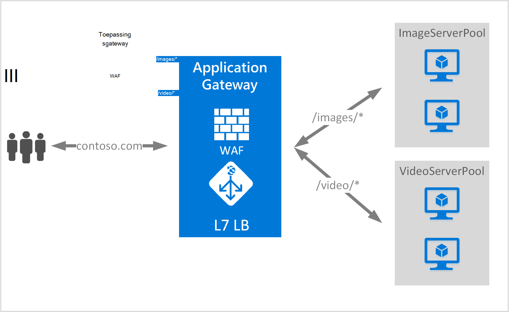

<properties
   pageTitle="Overzicht van routeren voor inhoud op basis van een URL | Microsoft Azure"
   description="Deze pagina bevat een overzicht van de URL van de Gateway toepassing gebaseerde inhoud routering, UrlPathMap configuratie en PathBasedRouting regel."
   documentationCenter="na"
   services="application-gateway"
   authors="georgewallace"
   manager="carmonm"
   editor="tysonn"/>
<tags
   ms.service="application-gateway"
   ms.devlang="na"
   ms.topic="hero-article"
   ms.tgt_pltfrm="na"
   ms.workload="infrastructure-services"
   ms.date="10/25/2016"
   ms.author="gwallace"/>

# URL-pad op basis van Routing-overzicht

URL-pad op basis van routering kunt u route-verkeer naar de back-end-server van toepassingen op basis van URL-pad van de aanvraag kunt invullen. Een scenario's beschreven is route verzoeken om verschillende inhoudstypen aan groepen van verschillende backend-server.
In het volgende voorbeeld wordt de Gateway-toepassing fungeert verkeer naar contoso.com van drie back-end-server pools van bijvoorbeeld: VideoServerPool, ImageServerPool en DefaultServerPool.

Aanvragen voor http://contoso.com/video* worden doorgestuurd naar VideoServerPool, en http://contoso.com/images* worden gerouteerd naar ImageServerPool. DefaultServerPool is geselecteerd als geen van de patronen pad overeenkomen met.

## UrlPathMap configuratie-element

UrlPathMap element wordt gebruikt om op te geven patronen pad naar de toewijzingen van de groep back-end-server. Het volgende voorbeeld is het fragment van het sjabloonbestand urlPathMap-element.

    "urlPathMaps": [
    {
    "name": "<urlPathMapName>",
    "id": "/subscriptions/<subscriptionId>/../microsoft.network/applicationGateways/<gatewayName>/ urlPathMaps/<urlPathMapName>",
    "properties": {
        "defaultBackendAddressPool": {
            "id": "/subscriptions/<subscriptionId>/../microsoft.network/applicationGateways/<gatewayName>/backendAddressPools/<poolName>"
        },
        "defaultBackendHttpSettings": {
            "id": "/subscriptions/<subscriptionId>/../microsoft.network/applicationGateways/<gatewayName>/backendHttpSettingsList/<settingsName>"
        },
        "pathRules": [
            {
                "paths": [
                    <pathPattern>
                ],
                "backendAddressPool": {
                    "id": "/subscriptions/<subscriptionId>/../microsoft.network/applicationGateways/<gatewayName>/backendAddressPools/<poolName2>"
                },
                "backendHttpsettings": {
                    "id": "/subscriptions/<subscriptionId>/../microsoft.network/applicationGateways/<gatewayName>/backendHttpsettingsList/<settingsName2>"
                },

            },

        ],

    }
    }
    

>[AZURE.NOTE] PathPattern: Deze instelling is een lijst met pad patronen om aan te passen. Elk moet beginnen met / en alleen een "*" is toegestaan op de volgende einde is een "/". De tekenreeks die is ingevoerd in het pad matcher bevat geen tekst na de eerste? of # en deze tekens worden hier niet toegestaan. 

U kunt een [resourcemanager-sjabloon met URL-e-mailroutering](https://azure.microsoft.com/documentation/templates/201-application-gateway-url-path-based-routing) voor meer informatie raadplegen.

## PathBasedRouting regel

RequestRoutingRule van het type PathBasedRouting wordt gebruikt voor het verbinden van een luisteraar ervan af met een urlPathMap. Alle aanvragen die zijn ontvangen voor deze luisteraar ervan af worden gerouteerd op basis van beleid die zijn opgegeven in urlPathMap.
Het codefragment van PathBasedRouting regel:

    "requestRoutingRules": [
    {

    "name": "<ruleName>",
    "id": "/subscriptions/<subscriptionId>/../microsoft.network/applicationGateways/<gatewayName>/requestRoutingRules/<ruleName>",
    "properties": {
        "ruleType": "PathBasedRouting",
        "httpListener": {
            "id": "/subscriptions/<subscriptionId>/../microsoft.network/applicationGateways/<gatewayName>/httpListeners/<listenerName>"
        },
        "urlPathMap": {
            "id": "/subscriptions/<subscriptionId>/../microsoft.network/applicationGateways/<gatewayName>/ urlPathMaps/<urlPathMapName>"
        },

    }
    
## Volgende stappen

Na het leren werken met URL gebaseerde inhoud routering, gaat u naar [een toepassingsgateway met URL-e-mailroutering maken](application-gateway-create-url-route-portal.md) om te maken van een toepassingsgateway met regels voor het doorsturen van URL.
