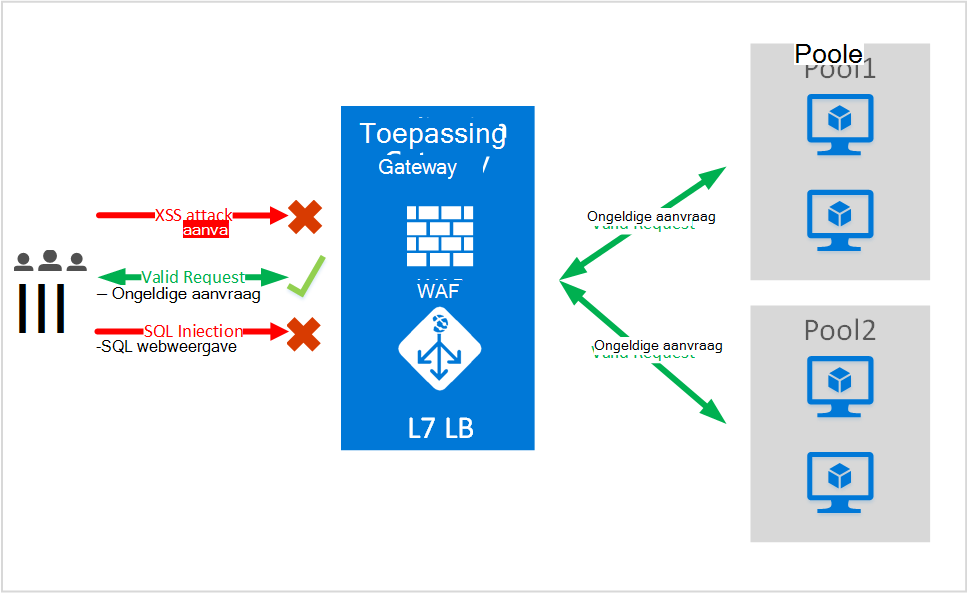
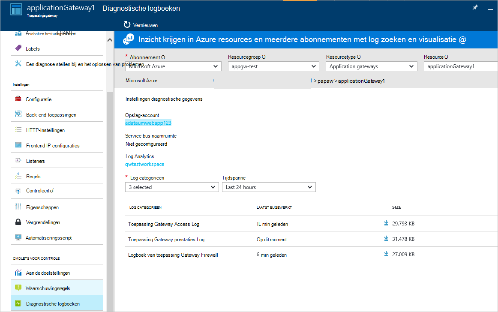

<properties
   pageTitle="Inleiding tot Web Application Firewall (WAF) voor de toepassingsgateway | Microsoft Azure"
   description="Deze pagina bevat een overzicht van Web Application Firewall (WAF) voor de Gateway-toepassing "
   documentationCenter="na"
   services="application-gateway"
   authors="amsriva"
   manager="rossort"
   editor="amsriva"/>
<tags
   ms.service="application-gateway"
   ms.devlang="na"
   ms.topic="hero-article"
   ms.tgt_pltfrm="na"
   ms.workload="infrastructure-services"
   ms.date="10/25/2016"
   ms.author="amsriva"/>

# Toepassing Gateway Web Application Firewall (preview)

Web application firewall (WAF) is een functie van azure-toepassingsgateway vindt u beveiliging voor webtoepassingen die gebruikmaken van toepassingsgateway voor standaardfuncties van toepassing bezorging besturingselement (ADC). Web application firewall doet dit door deze ten opzichte van de grootste deel van de OWASP bovenste 10 algemene web problemen te beschermen. Webtoepassingen zijn steeds doelen van aanvallen die gebruikmaken van algemene bekende problemen. Algemene tussen dit misbruik zijn SQL webweergave aanvallen, scripts op meerdere sites aanvallen als u wilt een paar te noemen. Voorkomen van dergelijke aanvallen in toepassingscode kan lastig zijn en mogelijk strikte onderhoud vereisen, herstellen en op meerdere lagen van de topologie zoektoepassing controleert. Een firewall van de toepassing gecentraliseerde web bescherming tegen web aanvallen beveiligingsbeheer veel eenvoudiger maakt en biedt betere assurance naar het programma ten opzichte van de risico's van hackers. Een oplossing WAF kunt ook reageren op een snellere beveiligingsrisico door het herstellen van een bekende beveiligingsprobleem met een centrale locatie versus het beveiligen van elk van afzonderlijke webtoepassingen. Bestaande toepassingsgateways kunnen worden geconverteerd naar een toepassingsgateway met web application firewall eenvoudig.

Toepassingsgateway werkt als een toepassing bezorging controller en biedt SSL-beëindiging, cookie gebaseerde sessie affiniteit, round robin laden verdeling, inhoud op basis-mailroutering mogelijkheid voor het hosten van meerdere verbeteringen voor websites en beveiliging. Verbeterde beveiliging aangeboden door toepassingsgateway opnemen SSL in beheer van complete SSL-ondersteuning. We zijn toepassing beveiligingsmogelijkheden van onze service versterking door de introductie van WAF (web-toepassing firewall) rechtstreeks geïntegreerd in de ADC aanbod. Dit biedt een eenvoudig te configureren centrale locatie voor het beheren en beveiligen van uw webtoepassingen ten opzichte van de algemene web problemen.

WAF bij toepassingsgateway configureren biedt de volgende voordeel u:

- Bescherm uw webtoepassing in web problemen en aanvallen ongewijzigd naar backend-code.
- Meerdere webtoepassingen op hetzelfde moment achter een toepassingsgateway beveiligen. Toepassingsgateway ondersteunt maximaal 20 websites achter één gateway die kan worden alle beveiligd tegen web aanvallen hostingprovider.
- Bewaak uw webtoepassing tegen aanvallen met realtime rapport gegenereerd door toepassing gateway WAF Logboeken.
- Bepaalde besturingselementen naleving vereisen alle internet omlaag eindpunten te beschermen door een WAF-oplossing. Met behulp van toepassingsgateway met WAF ingeschakeld, kunt u aan deze nalevingsvereisten voldoet.

## Overzicht

Toepassing Gateway WAF wordt aangeboden in een nieuwe SKU (WAF SKU) en wordt geleverd vooraf geconfigureerde met ModSecurity en OWASP Core regel instellen voor het aanbieden van basislijn bescherming tegen grootste deel van de OWASP bovenste 10 algemene web problemen.

- SQL webweergave beveiliging
- Cross site uitvoeren van scripts beveiliging
- Algemene Web aanvallen beveiliging zoals opdracht webweergave, HTTP-aanvraag smokkelen, HTTP-antwoord splitsen, en deze op te nemen aanval van extern bestand
- Bescherming tegen HTTP-protocol schending
- Bescherming tegen HTTP-protocol afwijkingen zoals ontbreken gebruikersagent hosten en kopteksten accepteren
- HTTP DoS bescherming inclusief overbelasting HTTP en traag HTTP DoS preventie
- Preventie tegen bots, crawlers en scanners
- Detectie van algemene toepassing gebruikers (dat wil zeggen Apache, IIS, enzovoort)

## WAF modi

Toepassing Gateway WAF kan worden geconfigureerd om uit te voeren in de volgende twee modi:

- **Modus voor detectie** – wanneer geconfigureerd om te worden uitgevoerd in de modus voor detectie, toepassing Gateway WAF bewaakt en alle meldingen van bedreiging die zich aanmeldt bij een logboekbestand. Moet u ervoor zorgen dat vastleggen van diagnostische hulpprogramma's voor de Gateway-toepassing is ingeschakeld voor het gebruik van de sectie diagnostische hulpprogramma's. U moet ook om ervoor te zorgen dat het logboek WAF is geselecteerd en is ingeschakeld.
- **Modus voor preventie** – wanneer geconfigureerd om uit te voeren in de modus voor preventie, toepassingsgateway actief blokkeert aanvallen en indringers gedetecteerd door de regels. De hacker ontvangt een uitzondering 403 onbevoegde toegang en de verbinding is verbroken. Modus voor preventie blijft dergelijke aanvallen aanmelden in de logboeken WAF.

## Toepassing Gateway WAF-rapporten

Toepassing Gateway WAF vindt u gedetailleerde rapporten op elke bedreiging die wordt vastgesteld. Logboekregistratie is geïntegreerd met Azure diagnostische logboeken en waarschuwingen zijn opgenomen in een indeling van json.

    {
        "resourceId": "/SUBSCRIPTIONS/<subscriptionId>/RESOURCEGROUPS/<resourceGroupName>/PROVIDERS/MICROSOFT.NETWORK/APPLICATIONGATEWAYS/<applicationGatewayName>",
        "operationName": "ApplicationGatewayFirewall",
        "time": "2016-09-20T00:40:04.9138513Z",
        "category": "ApplicationGatewayFirewallLog",
        "properties":     {
            "instanceId":"ApplicationGatewayRole_IN_0",
            "clientIp":"108.41.16.164",
            "clientPort":1815,
            "requestUri":"/wavsep/active/RXSS-Detection-Evaluation-POST/",
            "ruleId":"OWASP_973336",
            "message":"XSS Filter - Category 1: Script Tag Vector",
            "action":"Logged",
            "site":"Global",
            "message":"XSS Filter - Category 1: Script Tag Vector",
            "details":{"message":" Warning. Pattern match "(?i)(<script","file":"/owasp_crs/base_rules/modsecurity_crs_41_xss_attacks.conf","line":"14"}}
    }

## Toepassing Gateway WAF SKU prijzen

In voorbeeldweergave, zijn er geen extra kosten voor gebruik van de toepassing Gateway WAF. U gaat u verder met het aan bestaande eenvoudige SKU kosten in rekening worden gebracht. We zullen de kosten die worden WAF SKU communiceren GA tegelijk. Klanten die u wilt implementeren van de Gateway-toepassing in WAF SKU begint welke WAF SKU prijzen alleen na GA aankondiging.

## Volgende stappen

Nadat u hebt meer leren over de mogelijkheden van WAF, Ga naar [het configureren van Web Application Firewall op Application Gateway](application-gateway-web-application-firewall-portal.md).
