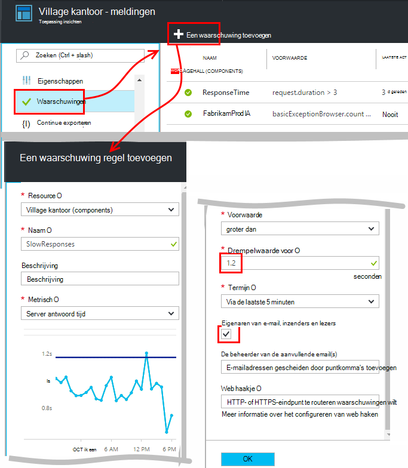
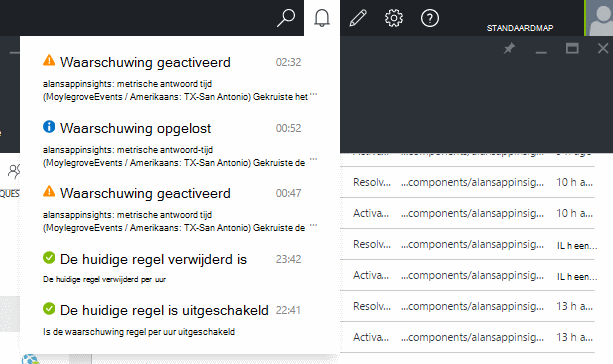
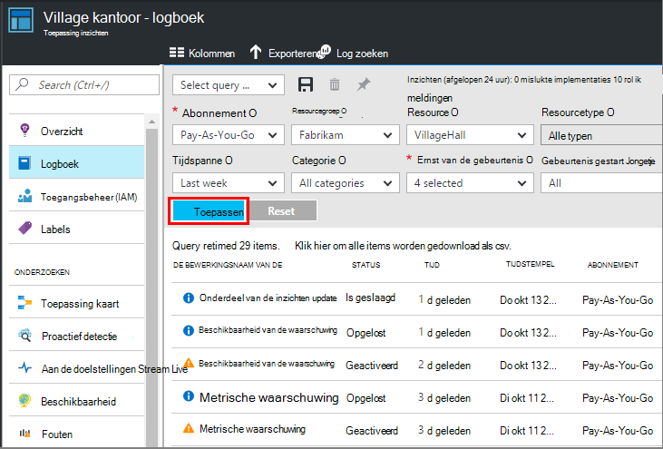

<properties 
    pageTitle="Waarschuwingen instellen in de toepassing inzichten | Microsoft Azure" 
    description="Een melding ontvangen over traag antwoord tijden, uitzonderingen, en andere prestaties of gebruik wijzigingen in uw web-app." 
    services="application-insights" 
    documentationCenter=""
    authors="alancameronwills" 
    manager="douge"/>

<tags 
    ms.service="application-insights" 
    ms.workload="tbd" 
    ms.tgt_pltfrm="ibiza" 
    ms.devlang="na" 
    ms.topic="article" 
    ms.date="10/14/2016" 
    ms.author="awills"/>
 
# Waarschuwingen instellen in de toepassing inzichten

[Visual Studio-toepassing inzichten] [ start] kunt u attent op wijzigingen in werking of gebruik de doelstellingen in uw web-app. 

Toepassing inzichten bewaakt uw live-app op een [breed scala van platforms] [ platforms] waarmee u kunt een diagnose stellen bij prestatieproblemen en gebruikspatronen begrijpen.

Er zijn drie soorten waarschuwingen:

* **Metrische meldingen** geven wanneer een meetwaarde de drempelwaarde voor een bepaalde periode - zoals antwoord tijden, uitzondering telt, CPU-gebruik of paginaweergaven kruist. 
* [**Tests met webonderdelen** ] [ availability] zien wanneer uw site is niet beschikbaar op internet, of reageert langzaam af. [Meer informatie][availability].
* [**Proactief diagnostische gegevens**](app-insights-proactive-diagnostics.md) automatisch geconfigureerd om u te waarschuwen over ongebruikelijke prestatiepatronen.

We richten op metrische waarschuwingen in dit artikel.

## Een metrische melding instellen

Open het blad waarschuwingsregels en gebruik vervolgens de knop toevoegen. 

* Stel de resource voordat u de andere eigenschappen. **Kies de resource '(components)'** als u wilt waarschuwingen instellen op prestaties of gebruik de doelstellingen.
* De naam die u aan de waarschuwing toewijst moet uniek zijn binnen de resourcegroep (niet alleen uw toepassing).
* Zorg ervoor dat de eenheden waarin u wordt gevraagd of Voer de drempelwaarde opmerking.
* Als u het selectievakje '... e-eigenaars', waarschuwingen ontvangt per e-mail naar iedereen die toegang tot deze resourcegroep heeft. Als u wilt deze reeks personen uitvouwen, ze toevoegen aan de [resourcegroep of -abonnement](app-insights-resources-roles-access-control.md) (niet de bron).
* Als u "Extra e-mailberichten" opgeeft, wordt meldingen worden verzonden naar deze personen of groepen (of u hebt geselecteerd het vak 'e-eigenaars...'). 
* Stel een [webhook adres](../monitoring-and-diagnostics/insights-webhooks-alerts.md) als u een web-app moet op waarschuwingen reageren hebt ingesteld. Het wordt aangeroepen wanneer de waarschuwing is geactiveerd (die is geactiveerd) en wanneer het probleem is opgelost. (Maar houd er rekening mee dat op dit moment, queryparameters niet via als webhook eigenschappen doorgegeven worden).
* U kunt uitschakelen of de melding inschakelen: Zie de knoppen boven aan het blad.

*Ik zie niet de knop Waarschuwing toevoegen.* 

- Gebruikt u een organisatie-account? Als u de eigenaar of Inzender toegang tot de bron van deze toepassing hebt, kunt u waarschuwingen instellen. Bekijk het blad beheren in Access. [Meer informatie over toegangsbeheer][roles].

> [AZURE.NOTE] In het blad waarschuwingen, ziet u dat er al een waarschuwing set up bestaat: [Proactief diagnostische gegevens](app-insights-proactive-failure-diagnostics.md). Dit is een melding voor een automatische die één bepaalde metrische, verzoek mislukt tarief bewaakt. Tenzij u ervoor kiest om uit te schakelen van de melding voor een proactief, moet u niet uw eigen melding instellen op aanvraag is mislukt tarief. 

## Zie uw waarschuwingen

Krijgt u een e-mailbericht wanneer de status van een waarschuwing wijzigingen tussen inactief en actieve. 

De huidige status van elke melding wordt weergegeven in het blad waarschuwingsregels.

Er is een samenvatting van recente activiteiten in de waarschuwingen vervolgkeuzelijst:

De geschiedenis van wijzigingen is in het gebeurtenissenlogboek:

## De werking van meldingen

* Een waarschuwing heeft drie staten: "Nooit geactiveerd", "Geactiveerd" en "Opgelost." Geactiveerde betekent dat de voorwaarde die u hebt opgegeven is voldaan, als deze voor het laatst is geëvalueerd.

* Een melding wordt gegenereerd wanneer een waarschuwing status wordt gewijzigd. (Als de waarschuwing voorwaarde al true is wanneer u de melding hebt gemaakt, krijgt u mogelijk niet een melding totdat de voorwaarde onwaar hoort.)

* Elk bericht genereert een e-mailbericht als u het vak e-mailberichten ingeschakeld of e-mailadressen opgegeven. U kunt ook de vervolgkeuzelijst meldingen bekijken.

* Een melding wordt telkens wanneer die een meting, maar niet anders binnenkomt geëvalueerd.

* De evaluatie de meetwaarde is samengevoegd in de voorgaande periode en wordt deze vergeleken aan de drempelwaarde om de nieuwe status te bepalen.

* De periode die u kiest, wordt het interval aanduidt waarop worden de doelstellingen samengevoegd. Deze heeft geen invloed op hoe vaak de melding wordt geëvalueerd: dat hangt af van de frequentie van ontvangst van de doelstellingen.

* Als u geen gegevens binnenkomt voor een bepaalde waarde voor enige tijd, heeft de tussenruimte verschillende effecten van de evaluatie van de waarschuwing en de grafieken in metrische Verkenner. Als u geen gegevens is zichtbaar voor langer dan van de grafiek steekproeven interval, geeft de grafiek in metrische explorer een waarde van 0. Maar een waarschuwing op basis van de dezelfde meetwaarde is niet opnieuw worden beoordeeld en de status van de melding blijft ongewijzigd. 

    Wanneer gegevens uiteindelijk binnenkomt, wordt de grafiek springt terug naar een andere waarde dan nul. Evalueert de waarschuwing op basis van de gegevens die beschikbaar zijn voor de periode die u hebt opgegeven. Als het nieuwe gegevenspunt de enige die beschikbaar zijn in de periode is, de aggregatie gebaseerd alleen op dat gegevenspunt.

* Een waarschuwing kunt regelmatig knipperen tussen waarschuwing en orde toestand, zelfs als u een lange periode instelt. Dit kan gebeuren als de metrische waarde rust rond de drempelwaarde voor. Er is geen hysteresis in de drempelwaarde: de overgang naar melding gebeurt er met dezelfde waarde als de overgang naar orde.

## Wat zijn goede waarschuwingen wilt instellen?

Dit is afhankelijk van uw toepassing. Beginnen met, is het beste niet te veel aan de doelstellingen instellen. Even kijken naar uw metrische grafieken terwijl uw app wordt uitgevoerd als u wilt voor hoe deze zich normaal gedraagt zodat u weet. Hiermee kunt u zoeken naar de prestaties verbeteren. Stel waarschuwingen te geven wanneer de aan de doelstellingen buiten de normale zone gaan. 

Populaire waarschuwingen opnemen:

* [De doelstellingen van de browser][client], met name Browser **laadtijden van pagina**, zijn handig voor webtoepassingen. Als uw pagina een groot aantal scripts bevat, gaat u voor **browser uitzonderingen**Let wilt. Om te krijgen van deze doelstellingen en waarschuwingen, die u hebt voor het instellen van de [pagina met webonderdelen monitoring][client].
* **Server antwoord tijd** voor de serverzijde van webtoepassingen. Door het instellen van waarschuwingen, houd gaten op deze metrisch om te zien als deze niet goed met hoge verzoek tarieven varieert: die mogelijk aangeven dat uw app heeft bijna geen resources. 
* **Serveruitzonderingen** - kunt bekijken, u moet doen enkele [aanvullende instellingen](app-insights-asp-net-exceptions.md).

Vergeet niet dat [proactief mislukt tarief diagnostische gegevens](app-insights-proactive-failure-diagnostics.md) automatisch controleren het tarief weer dat waarop uw app moet op vergaderverzoeken met mislukt codes reageren. 

## Automatisering

* [PowerShell gebruiken om te automatiseren bij het instellen van waarschuwingen](app-insights-powershell-alerts.md)
* [Webhooks gebruiken om te reageren op waarschuwingen automatiseren](../monitoring-and-diagnostics/insights-webhooks-alerts.md)

## Zie ook

* [Beschikbaarheid van web tests](app-insights-monitor-web-app-availability.md)
* [Bij het instellen van waarschuwingen automatiseren](app-insights-powershell-alerts.md)
* [Proactief diagnostische gegevens](app-insights-proactive-diagnostics.md) 

<!--Link references-->

[availability]: app-insights-monitor-web-app-availability.md
[client]: app-insights-javascript.md
[platforms]: app-insights-platforms.md
[roles]: app-insights-resources-roles-access-control.md
[start]: app-insights-overview.md

 