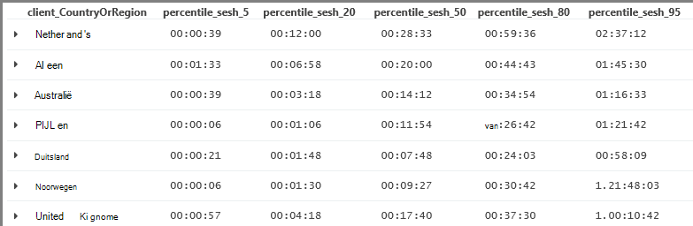

<properties 
    pageTitle="Een rondleiding door Analytics in de toepassing inzichten | Microsoft Azure" 
    description="Korte voorbeelden van alle belangrijke query's in analyses, de krachtige zoekfunctie van toepassing inzichten." 
    services="application-insights" 
    documentationCenter=""
    authors="alancameronwills" 
    manager="douge"/>

<tags 
    ms.service="application-insights" 
    ms.workload="tbd" 
    ms.tgt_pltfrm="ibiza" 
    ms.devlang="na" 
    ms.topic="article" 
    ms.date="10/15/2016" 
    ms.author="awills"/>


 
# <a name="a-tour-of-analytics-in-application-insights"></a>Een rondleiding door Analytics in toepassing inzichten


[Analytics](app-insights-analytics.md) is de krachtige zoekfunctie van [Toepassing inzichten](app-insights-overview.md). Deze pagina's worden de Analytics query lanquage beschreven.


* **[Bekijk de inleidende video](https://applicationanalytics-media.azureedge.net/home_page_video.mp4)**.
* **[Uitproberen analyses van onze gesimuleerd gegevens](https://analytics.applicationinsights.io/demo)** als uw app is niet gegevens inzicht krijgen in toepassing nog verzendt.


U gaat nu een beknopt overzicht van enkele eenvoudige query's kunt u aan de slag.

## <a name="connect-to-your-application-insights-data"></a>Verbinding maken met uw gegevens toepassing inzichten

Open Analytics uit van uw app [Overzicht blade](app-insights-dashboards.md) in inzichten van toepassing:


    
## <a name="takeapp-insights-analytics-referencemdtake-operator-show-me-n-rows"></a>[Nemen](app-insights-analytics-reference.md#take-operator): n rijen weergeven

Gegevenspunten die zich gebruiker bewerkingen (meestal HTTP aanvragen ontvangen door uw web-app aanmelden) zijn opgeslagen in een tabel met de naam `requests`. Elke rij is een telemetrielogboek gegevenspunt hebt ontvangen van de toepassing inzichten SDK in uw app.

Laten we eerst een paar steekproef rijen van de tabel:


> [AZURE.NOTE] Zet de cursor ergens in de instructie voordat u op Start. U kunt een instructie splitsen op meer dan één regel, maar geen lege regels in een instructie hebt opgeslagen. Lege regels zijn handig voor het behouden van meerdere afzonderlijke query's in het venster.


Kiezen welke kolommen, sleept u deze, groeperen op kolommen, en te filteren: 


Een item als u wilt zien van de details uitvouwen:
 


> [AZURE.NOTE] Klik op de kop van een kolom volgorde van de resultaten die beschikbaar zijn in de webbrowser. Maar houd er rekening mee dat voor een grote resultatenset, het aantal rijen dan ook gedownload naar de browser beperkt wordt. Sorteren op deze manier niet altijd u de werkelijke hoogste of laagste items weergeven. Gebruiken om items te sorteren betrouwbaar, de `top` of `sort` operator. 

## <a name="topapp-insights-analytics-referencemdtop-operator-and-sortapp-insights-analytics-referencemdsort-operator"></a>[Boven](app-insights-analytics-reference.md#top-operator) - en [sorteren](app-insights-analytics-reference.md#sort-operator)

`take`is handig om een snel voorbeeld van een resultaat, maar rijen uit de tabel in een willekeurige volgorde worden weergegeven. Als u een geordende weergave, gebruikt `top` (voor een steekproef) of `sort` (via de hele tabel).

De eerste n rijen, gesorteerd op een bepaalde kolom weergeven:

```AIQL

    requests | top 10 by timestamp desc 
```

* *Syntaxis:* De meeste operators hebben trefwoord parameters, zoals `by`.
* `desc`= aflopende volgorde, `asc` = oplopend.


`top...`kan ik een meer zodat soort `sort ... | take...`. We kunnen schrijven:

```AIQL

    requests | sort by timestamp desc | take 10
```

Het resultaat is hetzelfde, maar het iets langzamer wordt uitgevoerd. (U kunt ook schrijven `order`, namelijk een alias van `sort`.)

De kolomkoppen in de tabelweergave kunnen ook worden gebruikt om te sorteren van de resultaten op het scherm. Maar van cursus, als u hebt gebruikt `take` of `top` om op te halen slechts een deel van een tabel, u kunt alleen volgorde van de records die u hebt opgehaald.


## <a name="projectapp-insights-analytics-referencemdproject-operator-select-rename-and-compute-columns"></a>[Project](app-insights-analytics-reference.md#project-operator): selecteren, wijzigen en berekenen van kolommen

Gebruik [`project`](app-insights-analytics-reference.md#project-operator) als volgt te werk om alleen de gewenste kolommen:

```AIQL

    requests | top 10 by timestamp desc
             | project timestamp, name, resultCode
```


U kunt ook de naam van kolommen wijzigen en nieuwe bestanden definiëren:

```AIQL

    requests 
  	| top 10 by timestamp desc 
  	| project  
            name, 
            response = resultCode,
            timestamp, 
            ['time of day'] = floor(timestamp % 1d, 1s)
```


* [Kolomnamen](app-insights-analytics-reference.md#names) mogen spaties bevatten of symbolen als ze worden tussen haakjes zo uit: `['...']` of`["..."]`
* `%`is de gebruikelijke modulo operator. 
* `1d`(dit is een cijfer één, en vervolgens een had') is een letterlijke tijdspanne waarbij één dag. Hier volgen enkele meer tijdspanne letterlijke waarden: `12h`, `30m`, `10s`, `0.01s`.
* `floor`(alias `bin`) wordt een waarde naar beneden af op het dichtstbijzijnde veelvoud van de basiswaarde die u opgeeft. Dus `floor(aTime, 1s)` per keer naar beneden af op het dichtstbijzijnde tweede Rondt.

[Expressies](app-insights-analytics-reference.md#scalars) kunt alle gebruikelijke operatoren opnemen (`+`, `-`,...), en er is een bereik van handige functies.

    

## <a name="extendapp-insights-analytics-referencemdextend-operator-compute-columns"></a>[Uitbreiden](app-insights-analytics-reference.md#extend-operator): kolommen berekenen

Als u alleen kolommen toevoegen aan een bestaande wilt, gebruikt u [`extend`](app-insights-analytics-reference.md#extend-operator):

```AIQL

    requests 
  	| top 10 by timestamp desc
  	| extend timeOfDay = floor(timestamp % 1d, 1s)
```

Met [`extend`](app-insights-analytics-reference.md#extend-operator) minder dan een uitgebreide [`project`](app-insights-analytics-reference.md#project-operator) als u wilt bewaren van alle bestaande kolommen.


## <a name="summarizeapp-insights-analytics-referencemdsummarize-operator-aggregate-groups-of-rows"></a>[Summarize](app-insights-analytics-reference.md#summarize-operator): aggregeren groepen rijen

`Summarize`een *Aggregatiefunctie* worden toegepast op groepen rijen. 

Bijvoorbeeld het duurt voordat uw web-app om te reageren op een aanvraag is gerapporteerd in het veld `duration`. Laten we eens kijken de tijd gemiddelde antwoord naar alle aanvragen:


Of we kan het resultaat Verdeel in aanvragen van verschillende namen:


`Summarize`de gegevenspunten in de stream verzamelt in groepen waarvoor de `by` component gelijkmatig evalueert. Elke waarde in de `by` - elke bewerkingsnaam in het bovenstaande voorbeeld - expressie resulteert in een rij in de resultatentabel. 

Of we kan resultaten groeperen op tijd van de dag:


Zoals u ziet hoe gebruiken we de `bin` functie (of `floor`). Als we zojuist hebt gebruikt `by timestamp`, elke invoer rij zou terechtkomen in een eigen weinig groep. Voor een doorlopend scalaire zoals tijden of getallen, wat u hoeft te Splits de aaneengesloten bereik in een beheerbare aantal afzonderlijke waarden, en `bin` -welke is echt alleen de vertrouwde afronding omlaag `floor` , functie - is de eenvoudigste manier om te doen.

We kunt dezelfde methode gebruiken om te bereiken van reeksen beperken:


U ziet dat u hebt de beschikking `name=` voor het instellen van de naam van een resultaatkolom, in de aggregatie-expressies of de door-component.

## <a name="counting-sampled-data"></a>Gegevens tellen dat

`sum(itemCount)`is de aanbevolen aggregatie om te tellen van gebeurtenissen. In veel gevallen itemCount == 1, zodat de functie gewoon het aantal rijen in de groep telt. Maar wanneer [steekproeven](app-insights-sampling.md) betrekking heeft is, alleen een deel van de oorspronkelijke gebeurtenissen blijven behouden als gegevenspunten in de toepassing inzichten, zodat er voor elk gegevenspunt u ziet, `itemCount` gebeurtenissen. 

Bijvoorbeeld als steekproeven 75% van de oorspronkelijke gebeurtenissen en klik vervolgens op itemCount negeert == 4 in de behouden records - dat wil zeggen, voor elke record behouden er zijn vier oorspronkelijke records. 

Geavanceerde steekproeven zorgt ervoor dat itemCount moeten hoger tijdens perioden wanneer uw toepassing intensief wordt gebruikt.

Een goede schatting van het oorspronkelijke aantal gebeurtenissen opsommen om itemCount daarom worden biedt.


Er is ook een `count()` aggregatie (en een aantal bewerking), voor situaties waarin u echt wilt tellen, het aantal rijen in een groep.


Er is een bereik van [aggregatiefuncties](app-insights-analytics-reference.md#aggregations).


## <a name="charting-the-results"></a>De resultaten voor grafieken


```AIQL

    exceptions 
       | summarize count()  
         by bin(timestamp, 1d)
```

Resultaten worden standaard weergegeven als een tabel:


We kunt beter dan de tabelweergave doen. Bekijk de resultaten in de diagramweergave met de verticale balk optie:


U ziet dat hoewel we niet sorteren de resultaten tijd (zoals u ziet in de weergave van de tabel), datum/tijd in de grafiekweergave altijd worden weergegeven in de juiste volgorde staan.


## <a name="whereapp-insights-analytics-referencemdwhere-operator-filtering-on-a-condition"></a>[Waar](app-insights-analytics-reference.md#where-operator): filteren op een voorwaarde

Als u toepassing inzichten monitoring voor de [client](app-insights-javascript.md) en server zijden van de app hebt ingesteld, sommige van de telemetrielogboek in de database afkomstig zijn van browsers.

Laten we eens kijken alleen uitzonderingen gerapporteerd browsers:

```AIQL

    exceptions 
  	| where client_Type == "Browser" 
  	|  summarize count() 
       by client_Browser, outerMessage 
```


De `where` operator werkt met een Booleaanse expressie. Hier volgen enkele belangrijke punten met betrekking tot deze:

 * `and`, `or`: Booleaans operatoren
 * `==`, `<>` : gelijk en niet gelijk aan
 * `=~`, `!=` : niet hoofdlettergevoelig tekenreeks gelijk en niet gelijk. Zijn er veel meer tekenreeks vergelijkingsoperatoren.

Lees meer over [scalaire expressies](app-insights-analytics-reference.md#scalars).

### <a name="filtering-events"></a>Gebeurtenissen filteren

Niet geslaagd aanvragen vinden:

```AIQL

    requests 
  	| where isnotempty(resultCode) and toint(resultCode) >= 400
```

`responseCode`heeft type tekenreeks, zodat we [deze](app-insights-analytics-reference.md#casts) voor een numerieke vergelijking moet.

Samenvatting van de verschillende antwoorden:

```AIQL

    requests
  	| where isnotempty(resultCode) and toint(resultCode) >= 400
  	| summarize count() 
      by resultCode
```

## <a name="timecharts"></a>Timecharts

Weergeven hoe veel gebeurtenissen er elke dag zijn:

```AIQL

    requests
      | summarize event_count=count()
        by bin(timestamp, 1d)
```

Selecteer de optie grafiek weergeven:


## <a name="multiple-series"></a>Meerdere reeksen 

Meerdere expressies in de `summarize` wordt gemaakt van meerdere kolommen.

Meerdere expressies in de `by` component Hiermee maakt u meerdere rijen, één voor elke combinatie van waarden.


```AIQL

    requests
  	| summarize count(), avg(duration) 
      by bin(timestamp, 1d), client_StateOrProvince, client_City 
  	| order by timestamp asc, client_StateOrProvince, client_City
```


### <a name="segment-a-chart-by-dimensions"></a>Een grafiek door afmetingen in segmenten

Als u een tabel die een kolom tekenreeks en een numerieke kolom heeft een grafiek, kan de tekenreeks worden gebruikt voor het splitsen van numerieke gegevens in afzonderlijke reeks punten. Als er meer dan één tekenreeks kolom, kunt u kiezen welke kolom wilt gebruiken als de discriminator. 


### <a name="display-multiple-metrics"></a>Meerdere aan de doelstellingen weergeven

Als u een tabel grafiek die meer dan één numerieke kolom, naast de tijdstempel, kunt u elke combinatie van deze kunt weergeven.


U kunt niet gesplitste moet selecteren voordat u kunt meerdere numerieke kolommen die u kunt niet splitsen op de kolom van een tekenreeks op hetzelfde moment als het weergeven van meer dan één numerieke kolom selecteren. 


## <a name="daily-average-cycle"></a>Dagelijkse gemiddelde cyclus

Hoe gebruik variëren loop van de gemiddelde dag?

Aantal aanvragen door de tijd modulo één dag is binned in uren:

```AIQL

    requests
  	| extend hour = floor(timestamp % 1d , 1h) 
          + datetime("2016-01-01")
  	| summarize event_count=count() by hour
```


>[AZURE.NOTE] Ziet u wat u momenteel hoeft te tijdsduur van de converteren naar datum/tijd om te kunnen weergeven op de een grafiek.


## <a name="compare-multiple-daily-series"></a>Meerdere dagelijkse reeks vergelijken

Hoe gebruik variëren loop van de tijd van de dag in het buitenland?

```AIQL

 requests  | where tostring(operation_SyntheticSource)
     | extend hour= floor( timestamp % 1d , 1h)
           + datetime("2001-01-01")
     | summarize event_count=count() 
       by hour, client_CountryOrRegion 
     | render timechart
```


## <a name="plot-a-distribution"></a>Uitzetten van een verdeling

Hoeveel sessies zijn er van een andere lengte?

```AIQL

    requests 
  	| where isnotnull(session_Id) and isnotempty(session_Id) 
  	| summarize min(timestamp), max(timestamp) 
      by session_Id 
  	| extend sessionDuration = max_timestamp - min_timestamp 
  	| where sessionDuration > 1s and sessionDuration < 3m 
  	| summarize count() by floor(sessionDuration, 3s) 
  	| project d = sessionDuration + datetime("2016-01-01"), count_
```

De laatste regel is vereist voor het converteren naar datetime. De x-as van een grafiek wordt momenteel weergegeven als een scalaire alleen als dit een datum/tijd is.

De `where` one-shot sessies grootste component niet is opgenomen (sessionDuration == 0) en Hiermee stelt u de lengte van de x-as.


## <a name="percentilesapp-insights-analytics-referencemdpercentiles"></a>[Percentielen](app-insights-analytics-reference.md#percentiles)

Welke bereiken van de duur van begeleidende verschillende percentages van sessies?

De bovenstaande query gebruiken, maar de laatste regel vervangen:

```AIQL

    requests 
  	| where isnotnull(session_Id) and isnotempty(session_Id) 
  	| summarize min(timestamp), max(timestamp) 
      by session_Id 
  	| extend sesh = max_timestamp - min_timestamp 
  	| where sesh > 1s
  	| summarize count() by floor(sesh, 3s) 
  	| summarize percentiles(sesh, 5, 20, 50, 80, 95)
```

We de bovengrens ook verwijderd in de where-component, kunnen de juiste cijfers, inclusief alle sessies met meer dan één verzoek om ophalen:


Waaruit kunnen we die zien:

* 5% van sessies hebben een looptijd van minder dan 3 minuten 34s; 
* 50% van sessies laatst minder dan 36 minnutes;
* 5% van sessies laatst meer dan zeven dagen

Als u een aparte uitgesplitste voor elk land we alleen om over te brengen Samenvatting de kolom client_CountryOrRegion afzonderlijk tot en met beide operatoren:

```AIQL

    requests 
  	| where isnotnull(session_Id) and isnotempty(session_Id) 
  	| summarize min(timestamp), max(timestamp) 
      by session_Id, client_CountryOrRegion
  	| extend sesh = max_timestamp - min_timestamp 
  	| where sesh > 1s
  	| summarize count() by floor(sesh, 3s), client_CountryOrRegion
  	| summarize percentiles(sesh, 5, 20, 50, 80, 95)
      by client_CountryOrRegion
```




## <a name="joinapp-insights-analytics-referencemdjoin"></a>[Deelnemen aan](app-insights-analytics-reference.md#join)

We hebben toegang tot meerdere tabellen, inclusief aanvragen en uitzonderingen.

Als u zoekt de uitzonderingen die betrekking hebben op een aanvraag die de reactie van een fout geretourneerd, kunnen we deelnemen aan de tabellen op `session_Id`:

```AIQL

    requests 
  	| where toint(responseCode) >= 500 
  	| join (exceptions) on operation_Id 
  	| take 30
```


Het is raadzaam om te gebruiken `project` om te selecteren van alleen de kolommen die we nodig hebt voordat het uitvoeren van de join definieert.
In de dezelfde componenten we de naam van de tijdstempelkolom.


## <a name="letapp-insights-analytics-referencemdlet-clause-assign-a-result-to-a-variable"></a>[Laat](app-insights-analytics-reference.md#let-clause): een resultaat toewijzen aan een variabele

Gebruik [laten](./app-insights-analytics-reference.md#let-statements) te scheiden de onderdelen van de vorige expressie. De resultaten zijn ongewijzigd:

```AIQL

    let bad_requests = 
      requests
        | where  toint(resultCode) >= 500  ;
    bad_requests
  	| join (exceptions) on session_Id 
  	| take 30
```

> Tip: In de Analytics-client niet plaatsen lege regels tussen de onderdelen van dit. Controleer of alles uitvoeren.


## <a name="accessing-nested-objects"></a>Geneste objecten openen

Geneste objecten kunnen gemakkelijk worden geopend. Bijvoorbeeld, in de stream uitzonderingen ziet u gestructureerde objecten als volgt:


U kunt deze samenvoegen door te kiezen de eigenschappen die u geïnteresseerd bent:

```AIQL

    exceptions | take 10
  	| extend method1 = tostring(details[0].parsedStack[1].method)
```

Houd er rekening mee dat u moet een [cast](app-insights-analytics-reference.md#casts) met het juiste type gebruiken.

## <a name="custom-properties-and-measurements"></a>Aangepaste eigenschappen en afmetingen

Als uw toepassing gevoegd [aangepaste afmetingen (eigenschappen) en aangepaste afmetingen](app-insights-api-custom-events-metrics.md#properties) op gebeurtenissen en ziet u ze in de `customDimensions` en `customMeasurements` objecten.


Stel dat uw app bevat:

```C#

    var dimensions = new Dictionary<string, string> 
                     {{"p1", "v1"},{"p2", "v2"}};
    var measurements = new Dictionary<string, double>
                     {{"m1", 42.0}, {"m2", 43.2}};
    telemetryClient.TrackEvent("myEvent", dimensions, measurements);
```

Deze waarden in Analytics extraheren:

```AIQL

    customEvents
  	| extend p1 = customDimensions.p1, 
      m1 = todouble(customMeasurements.m1) // cast to expected type

``` 

## <a name="tables"></a>Tabellen

De stroom van telemetrielogboek hebt ontvangen van uw app is toegankelijk is via verschillende tabellen. Het schema van eigenschappen die beschikbaar zijn voor elke tabel is aan de linkerkant van het venster zichtbaar.

### <a name="requests-table"></a>Tabel verzoeken

Aantal HTTP-aanvragen voor uw WebApp en segment door de paginanaam van de:


De aanvragen waarvan de meeste is mislukt vinden:


### <a name="custom-events-table"></a>Aangepaste gebeurtenissentabel

Als u [TrackEvent()](app-insights-api-custom-events-metrics.md#track-event) verzendt, uw eigen gebeurtenissen gebruikt, kunt u ze kunt lezen uit deze tabel. 

We nemen een voorbeeld waar uw app-code bevat deze regels:

```C#

    telemetry.TrackEvent("Query", 
       new Dictionary<string,string> {{"query", sqlCmd}},
       new Dictionary<string,double> {
           {"retry", retryCount},
           {"querytime", totalTime}})
```

De frequentie van deze gebeurtenissen weergeven:
 


Metingen en dimensies uit de gebeurtenissen halen:


### <a name="custom-metrics-table"></a>Aangepast aan de doelstellingen tabel

Als u uw eigen metrieke waarden verzenden via [TrackMetric()](app-insights-api-custom-events-metrics.md#track-metric) , vindt u de resultaten in de stream **customMetrics** . Bijvoorbeeld:  


> [AZURE.NOTE] In [De doelstellingen Explorer](app-insights-metrics-explorer.md)alle aangepaste afmetingen die zijn bijgevoegd bij een willekeurig type telemetrielogboek weergegeven samen in het blad de doelstellingen samen met de doelstellingen verzonden via `TrackMetric()`. Maar in Analytics, aangepaste afmetingen nog steeds gekoppeld aan wat voor soort telemetrielogboek zij op - gebeurtenissen of aanvragen, enzovoort -zijn geladen, terwijl de doelstellingen is verzonden door TrackMetric worden weergegeven in hun eigen stream.

### <a name="performance-counters-table"></a>Prestatiemeteritems tabel

[Items](app-insights-performance-counters.md) weergeven u eenvoudige systeem aan de doelstellingen voor de app, zoals processor en geheugen netwerk in gebruik. U kunt de SDK als u wilt verzenden als u meer items, met inbegrip van uw eigen aangepaste items configureren.

Het schema **performanceCounters** beschrijft de `category`, `counter` naam, en `instance` naam van elk prestatiemeteritem. Item exemplaarnamen zijn alleen van toepassing op sommige prestatiemeteritems en de naam van het proces waarop het aantal betrekking heeft meestal vermeld. Klik in het telemetrielogboek voor elke toepassing ziet u alleen de items voor de toepassing. Bijvoorbeeld zijn om te zien welke items zijn beschikbaar: 


Een grafiek van beschikbare geheugen opvragen over de afgelopen periode: 


Als andere telemetrielogboek, **performanceCounters** , heeft ook een kolom `cloud_RoleInstance` die aangeeft dat de identiteit van de hostcomputer waarop uw app wordt uitgevoerd. Als u bijvoorbeeld de prestaties van uw app op de verschillende computers vergelijken: 


### <a name="exceptions-table"></a>Uitzonderingentabel

[Uitzonderingen gemeld door uw app](app-insights-asp-net-exceptions.md) zijn beschikbaar in deze tabel. 

Als u het HTTP-verzoek dat uw app is in behandeling wanneer de uitzondering voorgedaan zoekt, deelnemen aan op operation_Id:


### <a name="browser-timings-table"></a>Browser tijdsinstellingen tabel

`browserTimings`ziet u pagina laden gegevens die worden verzameld in uw gebruikers-browsers.

[Uw app voor aan de clientzijde telemetrielogboek instellen](app-insights-javascript.md) om te bekijken van deze gegevens. 

Het schema bevat [de doelstellingen die aangeeft dat de lengte berekend van de verschillende fasen van de pagina laden](app-insights-javascript.md#page-load-performance). (Ze niet de tijdsduur dat uw gebruikers een pagina lezen aangeeft.)  

De popularities van verschillende pagina's weergeven en laden voor elke pagina:


### <a name="availbility-results-table"></a>De tabel resultaten Availbility

`availabilityResults`Geeft de resultaten van uw [web tests](app-insights-monitor-web-app-availability.md). Elke uitvoering van de tests vanaf elke testlocatie is afzonderlijk gerapporteerd. 


### <a name="dependencies-table"></a>Afhankelijkheden tabel

Resultaten van oproepen dat uw app aanbrengt in databases en REST API's en andere naar TrackDependency() oproepen bevat.

### <a name="traces-table"></a>Traces tabel

Bevat de telemetrielogboek door uw app met TrackTrace() of [andere kaders logboekregistratie](app-insights-asp-net-trace-logs.md)verzonden.

## <a name="dashboards"></a>Dashboards

U kunt uw resultaten aan een dashboard vastmaken om aan te brengen samen uw belangrijkste grafieken en tabellen.

* [Azure gedeelde dashboard](app-insights-dashboards.md#share-dashboards): klik op het pictogram pincode. Voordat u dit doet, moet u een gedeelde dashboard hebben. Klik in de portal Azure open of maak ik een dashboard en klikt u op delen.
* [Power BI-dashboard](app-insights-export-power-bi.md): klik op exporteren, Power BI-Query. Een voordeel van dit alternatief is dat u uw query samen met een andere resultaten van een zeer breed scala van gegevensbronnen kunt weergeven.


## <a name="next-steps"></a>Volgende stappen

* [Naslaggids voor Analytics](app-insights-analytics-reference.md)

[AZURE.INCLUDE [app-insights-analytics-footer](../../includes/app-insights-analytics-footer.md)]


