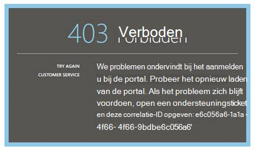
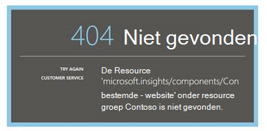
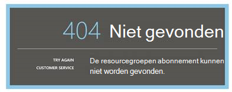

<properties 
    pageTitle="Problemen oplossen Analytics - de krachtige zoekfunctie van toepassing inzichten | Microsoft Azure" 
    description="Problemen met de toepassing inzichten analytics? Begin hier. " 
    services="application-insights" 
    documentationCenter=""
    authors="alancameronwills" 
    manager="douge"/>

<tags 
    ms.service="application-insights" 
    ms.workload="tbd" 
    ms.tgt_pltfrm="ibiza" 
    ms.devlang="na" 
    ms.topic="article" 
    ms.date="07/11/2016" 
    ms.author="awills"/>

# Problemen met Analytics in toepassing inzichten

Problemen met de [toepassing inzichten Analytics](app-insights-analytics.md)? Begin hier. Analytics is een krachtige zoekprogramma van Visual Studio-toepassing inzichten.

## Limieten

* Queryresultaten zijn op dit moment, beperkt tot het zojuist hebt gedurende een week afgelopen gegevens.
* Browsers die we testen op: meest recente edities van Chrome, rand en Internet Explorer.

## Browserextensies voor bekende incompatibele

* Ghostery

De extensie uitschakelen of een andere browser gebruikt.

##"Onverwachte fout"

Er is een interne fout opgetreden tijdens de portal runtime – onverwerkte uitzondering.

* Maak schoon cache van de browser. 

## 403... Probeer opnieuw laden

Een verificatie gerelateerde er is een fout opgetreden (tijdens de verificatie of tijdens het token genereren voor access). De portal mogelijk geen enkele manier zonder browserinstellingen te wijzigen.

* Controleer of [cookies van derden zijn ingeschakeld](#cookies) in de browser. 

## 403... beveiligingszone verifiëren

Een verificatie gerelateerde er is een fout opgetreden (tijdens de verificatie of tijdens het token genereren voor access). De portal mogelijk geen enkele manier zonder browserinstellingen te wijzigen.

1. Controleer of [cookies van derden zijn ingeschakeld](#cookies) in de browser. 

2. Hebt u een favoriet, de bladwijzer of de opgeslagen koppeling gebruikt om de analyse-portal te openen? Bent u aangemeld met andere referenties dan u gebruikt wanneer u de koppeling hebt opgeslagen?

2. Gebruik een in-privé/incognito browservenster (na het sluiten van alle vensters van dergelijke). U hebt uw referenties op te geven. 

2. Open een andere (gewone) browservenster en Ga naar [Azure](https://portal.azure.com). Meld u af. Open de koppeling en meld u aan met de juiste referenties.

2. Rand en Internet Explorer-gebruikers kunnen ook dit foutbericht krijgt wanneer vertrouwde zone-instellingen worden niet ondersteund.

    Controleer of zowel [Analytics-portal](https://analytics.applicationinsights.io) en [Azure Active Directory-portal](https://portal.azure.com) zijn in de zone hetzelfde:

 * Open **Internet-opties**, **beveiliging**, **Vertrouwde websites**, **Sites**in Internet Explorer:

    

    Klik in de lijst Websites als een van de volgende URL's opgenomen zijn, controleert u of dat de andere zijn opgenomen:

    https://Analytics.applicationinsights.IO 
   https://login.microsoftonline.com 
   https://login.Windows.NET

## 404... Bron is niet gevonden

Bron van toepassing is verwijderd uit de toepassing inzichten en niet meer beschikbaar is. Dit kan gebeuren als u de URL naar de pagina Analytics hebt opgeslagen.

## 403... Geen autorisatie

U bent niet gemachtigd voor het openen van deze toepassing in Analytics.

* U de koppeling ophalen van iemand anders? Vraag deze om ervoor te zorgen dat u zich in de [lezers of inzenders voor deze resourcegroep](app-insights-resources-roles-access-control.md).
* U de koppeling met verschillende referenties opslaan? Open de [portal van Azure](https://portal.azure.com), meld u af en probeert u deze koppeling nogmaals de juiste referenties opgeeft.

## 403... HTML5-opslag

HTML5 localStorage en sessionStorage worden gebruikt door onze portal.

* Chrome: Instellingen voor privacy, instellingen voor inhoud.
* Internet Explorer: Internet-opties, tabblad Geavanceerd, beveiliging, DOM-opslag inschakelen

## 404... Abonnement niet gevonden

De URL is ongeldig. 

* Open de app-resource in de [toepassing inzichten portal](https://portal.azure.com). Gebruik vervolgens de knop Analytics.

## 404... pagina bevat geen

De URL is ongeldig.

* Open de app-resource in de [toepassing inzichten portal](https://portal.azure.com). Gebruik vervolgens de knop Analytics.

## Indirecte cookies inschakelen

  Zie [het uitschakelen van cookies van derden](http://www.digitalcitizen.life/how-disable-third-party-cookies-all-major-browsers), maar zoals u ziet, moeten we **inschakelen** ze.

## Als het probleem niet    

[Contact met ons opnemen](app-insights-get-dev-support.md).
 
[AZURE.INCLUDE [app-insights-analytics-footer](../../includes/app-insights-analytics-footer.md)]

