<properties 
    pageTitle="Analytics - de krachtige zoekfunctie van toepassing inzichten gebruik | Microsoft Azure" 
    description="De analytische gegevens, de krachtige diagnostische zoekfunctie van toepassing inzichten gebruik. " 
    services="application-insights" 
    documentationCenter=""
    authors="danhadari" 
    manager="douge"/>

<tags 
    ms.service="application-insights" 
    ms.workload="tbd" 
    ms.tgt_pltfrm="ibiza" 
    ms.devlang="na" 
    ms.topic="article" 
    ms.date="10/21/2016" 
    ms.author="awills"/>

# Door middel van analyses in toepassing inzichten

[Analytics](app-insights-analytics.md) is de krachtige zoekfunctie van [Toepassing inzichten](app-insights-overview.md). Deze pagina's worden de querytaal Analytics beschreven.

* **[Bekijk de inleidende video](https://applicationanalytics-media.azureedge.net/home_page_video.mp4)**.
* **[Uitproberen analyses van onze gesimuleerd gegevens](https://analytics.applicationinsights.io/demo)** als uw app is niet gegevens inzicht krijgen in toepassing nog verzendt.

## Open Analytics

Klik op analyse van thuis resource in de toepassing inzichten van uw app.

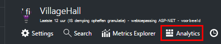

De zelfstudie inline kunt u sommige ideeën over wat u kunt doen.

Er is een [uitgebreidere rondleiding hier](app-insights-analytics-tour.md).

## Uw telemetrielogboek query

### Een query

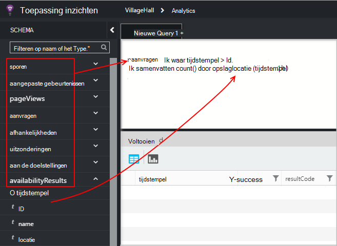

Beginnen met de namen van een van de tabellen vermeld op de linker-(of het [bereik](app-insights-analytics-reference.md#range-operator) of de [Unie](app-insights-analytics-reference.md#union-operator) operatoren). Gebruik `|` maken van een pijplijn [operators](app-insights-analytics-reference.md#queries-and-operators). IntelliSense vraagt u met de operatoren en enkele van de expressie-elementen die u kunt gebruiken.

Zie de [Analytics taal overzicht](app-insights-analytics-tour.md) en [Naslaggids](app-insights-analytics-reference.md).

### Query's uitvoeren

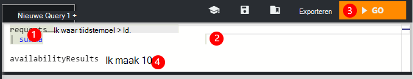

1. U kunt één regeleinden gebruiken in een query.
2. Plaats de cursor binnen of aan het einde van de query die u wilt uitvoeren.
3. Klik op Start om de query uitvoert.
4. Plaats geen lege regels in uw query. U kunt verschillende gescheiden query's in één querytabblad houden door deze te scheiden met lege regels. Alleen de tabel met de cursor wordt uitgevoerd.

### Een query opslaan

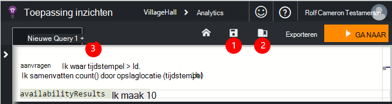

1. De huidige querybestand opslaan.
2. Een opgeslagen query-bestand openen.
3. Een nieuwe querybestand maken.

## De details kan zien

Vouw uit elke rij in de zoekresultaten om de volledige lijst met eigenschappen weer te geven. Verder kunt u een eigenschap die is bijvoorbeeld een gestructureerde waarde -, aangepaste afmetingen of de stapel vermelding in een uitzondering uitbreiden.

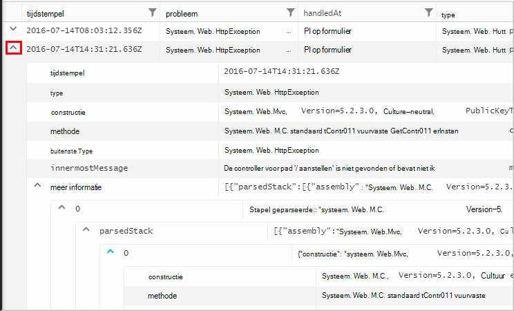

 

## De resultaten te rangschikken

U kunt sorteren, filteren, pagineren en groeperen van de resultaten van uw query.

> [AZURE.NOTE] Sorteren, groeperen en filteren in de browser, niet de query opnieuw uitvoeren. Ze alleen de resultaten die zijn geretourneerd door uw laatste query opnieuw te rangschikken. 
> 
> Als u wilt uitvoeren van deze taken in de server voordat de resultaten worden geretourneerd, schrijf uw query met de operatoren [sorteren](app-insights-analytics-reference.md#sort-operator), [samenvatten](app-insights-analytics-reference.md#summarize-operator) en [waar](app-insights-analytics-reference.md#where-operator) .

Kies de kolommen die u wilt zien, sleept u de kolomkoppen om te rangschikken en het formaat van kolommen wijzigen door de randen te slepen.

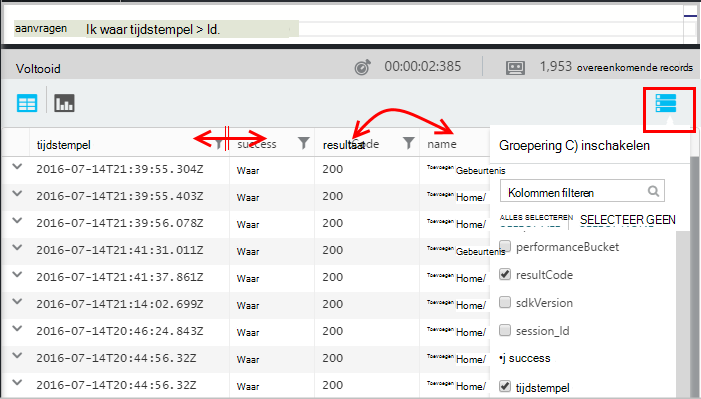

### Items sorteren en filteren

Uw resultaten sorteren door te klikken op de kop van een kolom. Klik op opnieuw als u wilt sorteren van de andere manier en klikt u op een derde tijd om te keren naar de oorspronkelijke volgorde die door uw query geretourneerd.

Gebruik het filterpictogram uw zoekopdracht beperken.

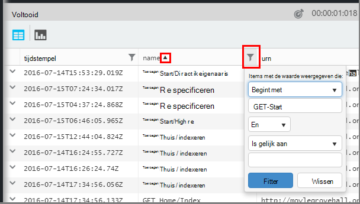

### Items groeperen

Gebruik op meer dan één kolom wilt sorteren, groeperen. De functie eerst inschakelen en sleep vervolgens kolomkoppen in de ruimte boven de tabel.

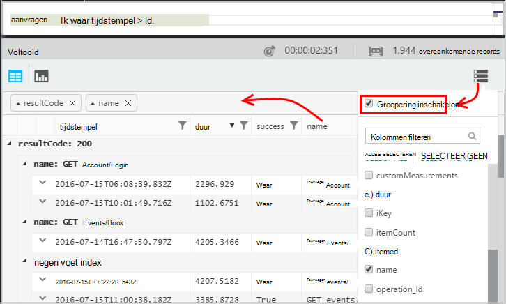

### Ontbrekende sommige resultaten?

Er is een limiet van 10 k rijen in de resultaten van de portal. Een waarschuwing ziet als u de limiet overschreden gaan. Als in dat geval won't sorteren van uw resultaten in de tabel altijd weergegeven de werkelijke eerste of laatste resultaten te bekijken. 

Het is een goede gewoonte om te voorkomen dat de limiet raken. Gebruik operatoren, zoals:

* [waar tijdstempel > ago(3d)](app-insights-analytics-reference.md#where-operator)
* [bovenste 100 door tijdstempel](app-insights-analytics-reference.md#top-operator) 
* [100 uitvoeren](app-insights-analytics-reference.md#take-operator)
* [samenvatten](app-insights-analytics-reference.md#summarize-operator) 

## Diagrammen

Selecteer het type diagram dat u wilt dat:

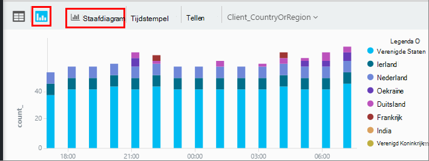

Als u meerdere kolommen van de juiste typen hebt, kunt u de x en y-as en een kolom met afmetingen ingesteld op de resultaten op splitsen.

Standaard resultaten in eerste instantie worden weergegeven als een tabel en u het diagram handmatig selecteren. Maar u kunt de [weergave van Richtlijn](app-insights-analytics-reference.md#render-directive) aan het einde van een query selecteren een diagram.

## Vastmaken aan het dashboard

U kunt een diagram vastmaken of tabel naar een van uw [gedeelde dashboards](app-insights-dashboards.md) - alleen op de pincode. (Mogelijk moet [upgrade dat uw app bevindt zich pakket prijzen](app-insights-pricing.md) deze functie te schakelen.) 

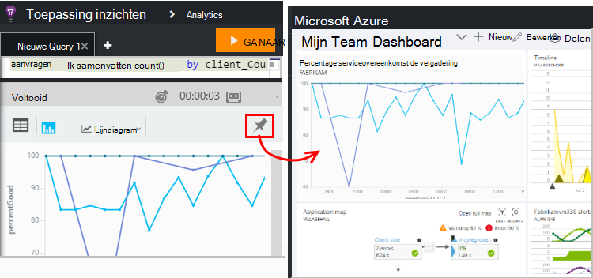

Dit betekent dat wanneer u een dashboard om te controleren van de prestaties of het gebruik van uw webservices samenstellen, kunt u ook helemaal complexe analyse samen met de andere doelstellingen. 

Als deze vier of minder kolommen bevat, kunt u een tabel naar het dashboard vastmaken. Alleen de bovenste zeven rijen worden weergegeven.

#### Dashboard vernieuwen

De grafiek die zijn vastgemaakt aan het dashboard wordt automatisch vernieuwd door de query opnieuw nagenoeg elk half uur wordt uitgevoerd.

#### Automatische vereenvoudigen

Bepaalde vereenvoudigen worden toegepast op een grafiek in sommige gevallen, wanneer u deze aan een dashboard vastmaakt.

Wanneer u een grafiek met een groot aantal afzonderlijke opslaglocaties (meestal een staafdiagram), de opslaglocaties van de minder gevulde pincode automatisch worden gegroepeerd in één veld "anderen" opslaglocatie. Bijvoorbeeld: deze query:

    requests | summarize count_search = count() by client_CountryOrRegion

ziet er zo uit in Analytics:

maar wanneer u deze aan een dashboard vastmaakt, ziet er zo uit:

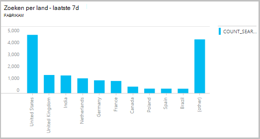

## Exporteren naar Excel

Nadat u een query hebt uitgevoerd, kunt u een CSV-bestand downloaden. Klik op **exporteren naar Excel**.

## Exporteren naar Power BI

Zet de cursor in een query en kies **exporteren naar Power BI**.

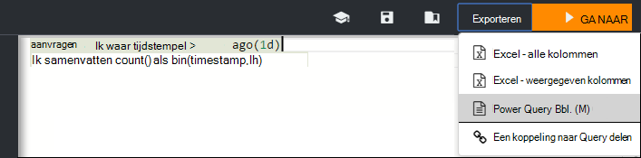

U kunt de query uitvoert in Power BI. U kunt instellen om te vernieuwen volgens een schema.

Met Power BI, kunt u dashboards die samenbrengen van gegevens uit een grote verscheidenheid aan bronnen.

[Meer informatie over het exporteren naar Power BI](app-insights-export-power-bi.md)

[AZURE.INCLUDE [app-insights-analytics-footer](../../includes/app-insights-analytics-footer.md)]

