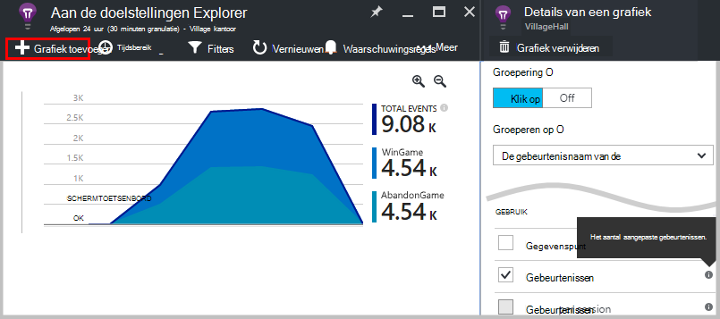
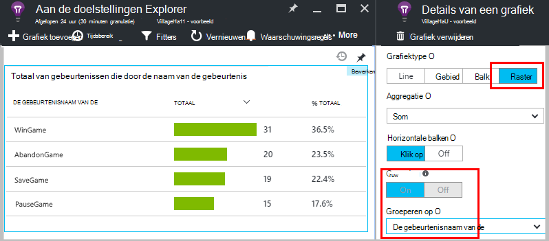
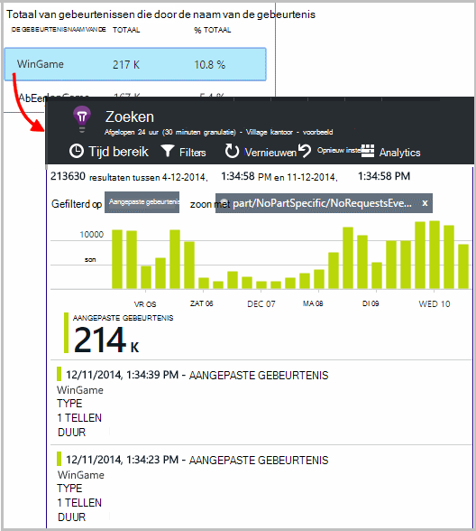
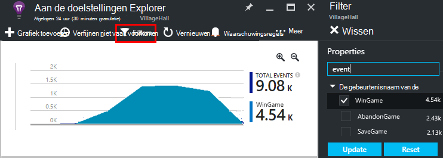
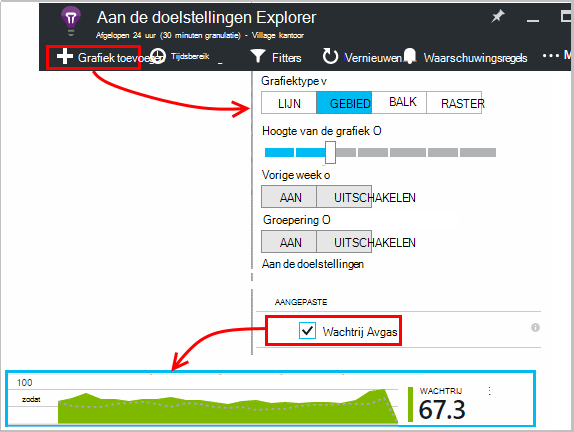
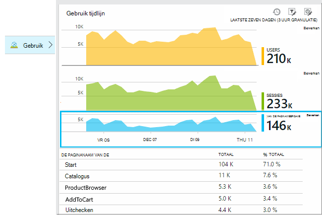
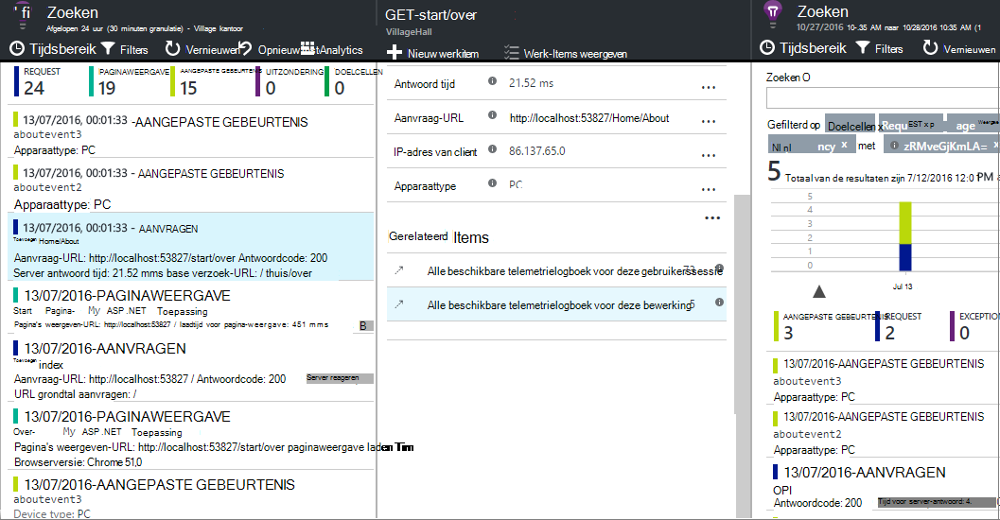
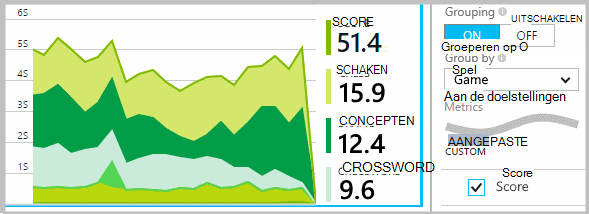
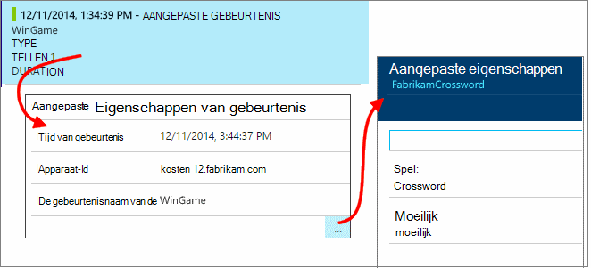
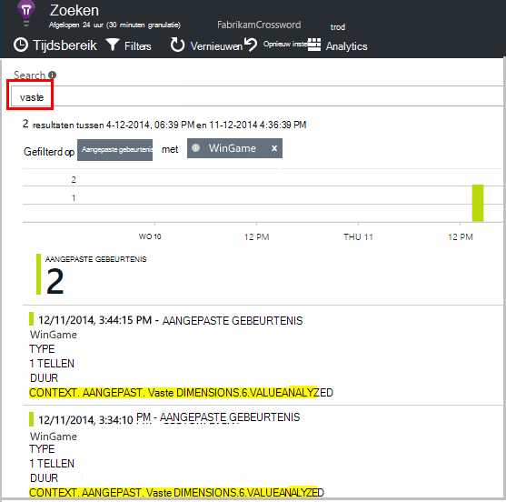

<properties 
    pageTitle="Toepassing inzichten API voor aangepaste gebeurtenissen en aan de doelstellingen | Microsoft Azure" 
    description="Voeg een paar regels met code in uw apparaat of een bureaublad-app, webpagina of service, te houden en diagnose van problemen." 
    services="application-insights"
    documentationCenter="" 
    authors="alancameronwills" 
    manager="douge"/>
 
<tags 
    ms.service="application-insights" 
    ms.workload="tbd" 
    ms.tgt_pltfrm="ibiza" 
    ms.devlang="multiple" 
    ms.topic="article" 
    ms.date="10/19/2016" 
    ms.author="awills"/>

# <a name="application-insights-api-for-custom-events-and-metrics"></a>Toepassing inzichten API voor aangepaste gebeurtenissen en aan de doelstellingen 

*Er is een toepassing inzichten in de proefversie.*

Voeg een paar regels met code in uw toepassing om vast te stellen wat gebruikers ermee doen of om u te helpen bij het vaststellen van problemen. U kunt telemetrielogboek verzenden van apparaat en de bureaublad-apps, webclients en -endwebservers. De [Visual Studio toepassing inzichten](app-insights-overview.md) core telemetrielogboek API kunt u aangepaste gebeurtenissen en maatstaven en uw eigen versies van standaard telemetrielogboek verzenden. Deze API is de dezelfde API die wordt gebruikt door de standaard-toepassing inzichten gegevensverzamelaars.

## <a name="api-summary"></a>API-overzicht

De API is uniform voor alle platforms, met uitzondering van een paar kleine variaties.

Methode | Wordt gebruikt voor
---|---
[`TrackPageView`](#page-views) | Pagina's, schermen, bladen of formulieren
[`TrackEvent`](#track-event) | Gebruikersacties en andere gebeurtenissen. Wordt gebruikt voor het bijhouden van de gebruikersgedrag of om de prestaties te houden.
[`TrackMetric`](#track-metric) | Prestatiemetingen zoals wachtrij lengte berekend niet zijn gerelateerd aan specifieke gebeurtenissen
[`TrackException`](#track-exception)|Meld u uitzonderingen voor diagnose. Waar ze zich voordoen ten opzichte van andere gebeurtenissen en onderzoeken stapel sporen aanwijzen.
[`TrackRequest`](#track-request)| Meld u aan de frequentie en duur van de serveraanvragen voor prestatieanalyse.
[`TrackTrace`](#track-trace)|Diagnostische logboekberichten. U kunt ook 3e derden logboeken vastleggen.
[`TrackDependency`](#track-dependency)|Meld u aan de duur en de frequentie van aanroepen voor externe onderdelen waarop uw, bepaalt welke app.

U kunt [Eigenschappen en aan de doelstellingen toevoegen](#properties) naar de meest van deze telemetrielogboek van oproepen. 


## <a name="prep"></a>Voordat u begint

Als u deze nog niet hebt gedaan:

* De toepassing inzichten SDK toevoegen aan uw project:
 * [ASP.NET-project][greenbrown]
 * [Java-project][java] 
 * [JavaScript in elke pagina met webonderdelen][client]   

* Neem in uw apparaat of web server-code:

    *C#:*`using Microsoft.ApplicationInsights;`

    *VB:*`Imports Microsoft.ApplicationInsights`

    *Java:*`import com.microsoft.applicationinsights.TelemetryClient;`

## <a name="construct-a-telemetryclient"></a>Een TelemetryClient maken

Samenstellen van een exemplaar van TelemetryClient (behalve in JavaScript in webpagina's):

*C#:* 

    private TelemetryClient telemetry = new TelemetryClient();

*VB:* 

    Private Dim telemetry As New TelemetryClient

*Java*

    private TelemetryClient telemetry = new TelemetryClient();

TelemetryClient is thread-veilig.

We raden u aan om een exemplaar van `TelemetryClient` voor elke module van uw app. Bijvoorbeeld, moet u wellicht een `TelemetryClient` in uw webservice binnenkomende HTTP-aanvragen, en een andere in een klas middleware om aan te melden rapport zakelijke logica gebeurtenissen. U kunt eigenschappen instellen, zoals `TelemetryClient.Context.User.Id` voor het bijhouden van gebruikers en sessies, of `TelemetryClient.Context.Device.Id` om aan te geven van de computer. Deze informatie is gekoppeld aan alle gebeurtenissen die zijn verzonden door het exemplaar.


## <a name="track-event"></a>Evenement bijhouden

In de toepassing inzichten, een *aangepaste gebeurtenis* is een gegevenspunt dat u beide in in [De doelstellingen Explorer] kunt weergeven[ metrics] als een geaggregeerde aantal en als afzonderlijke vermeldingen in [Diagnostische zoeken][diagnostic]. (Dit is niet gerelateerd zijn aan MVC of andere framework "gebeurtenissen.") 

TrackEvent oproepen invoegen in uw code om te tellen hoe vaak gebruikers kiest u een bepaalde functie, hoe vaak zij bepaalde doelstellingen, bereiken of wellicht zorg bepaalde soorten fout. 

Bijvoorbeeld in een spel-app, stuurt u een gebeurtenis wanneer een gebruiker gewonnen: 

*JavaScript*

    appInsights.trackEvent("WinGame");

*C#*
    
    telemetry.TrackEvent("WinGame");

*VB*


    telemetry.TrackEvent("WinGame")

*Java*

    telemetry.trackEvent("WinGame");


### <a name="view-your-events-in-the-azure-portal"></a>Uw gebeurtenissen in de Azure portal weergeven

Als u wilt zien van een telling van uw gebeurtenissen, opent u een blade [Metrisch Explorer](app-insights-metrics-explorer.md) , een nieuwe grafiek toevoegen en selecteer gebeurtenissen.  



Als u wilt vergelijken de aantallen verschillende gebeurtenissen, stelt u het grafiektype op raster en groep door de gebeurtenisnaam van de:




Klik op het raster, klikt u op tot en met de naam van een gebeurtenis om afzonderlijke vermeldingen van die gebeurtenis weer te geven.



Klik op een exemplaar om meer details zichtbaar.

Instellen van het blad filteren om u te richten op specifieke gebeurtenissen in zoeken of meetwaarde Explorer, de gebeurtenisnamen waarin u geïnteresseerd bent:



## <a name="track-metric"></a>Metrisch bijhouden

Gebruik TrackMetric om te verzenden aan de doelstellingen die niet zijn gekoppeld aan bepaalde gebeurtenissen. U kunt bijvoorbeeld de lengte van een wachtrij kan bewaken met regelmatige tussenpozen. 

Aan de doelstellingen worden weergegeven als statistische grafieken in metrische explorer, maar in tegenstelling tot gebeurtenissen, u kunt niet zoeken op afzonderlijke vermeldingen in diagnostische zoeken.

Metrische waarden moet > = 0 moet correct worden weergegeven.


*JavaScript*

    appInsights.trackMetric("Queue", queue.Length);

*C#*

    telemetry.TrackMetric("Queue", queue.Length);

*VB*

    telemetry.TrackMetric("Queue", queue.Length)

*Java*

    telemetry.trackMetric("Queue", queue.Length);

U kunt dit in feite doen in een achtergrondthread:

*C#*

    private void Run() {
     var appInsights = new TelemetryClient();
     while (true) {
      Thread.Sleep(60000);
      appInsights.TrackMetric("Queue", queue.Length);
     }
    }


De resultaten weer te geven, aan de doelstellingen Explorer openen en een nieuwe grafiek. Instellen om uw metrisch weer te geven.



Zijn er enkele [beperkingen ten aanzien van het aantal cijfers](#limits) die u kunt gebruiken.

## <a name="page-views"></a>Paginaweergaven

Pagina weergave telemetrielogboek wordt in een apparaat of webpagina-app, al dan niet standaard verzonden als elke scherm of de pagina wordt geladen. Maar u kunt deze instelling wijzigen om bij te houden paginaweergaven op extra of op verschillende momenten. Bijvoorbeeld in een app die tabbladen of bladen wordt weergegeven, u mogelijk wilt bijhouden een 'pagina' wanneer de gebruiker een nieuwe blade wordt geopend. 



Gebruikers-en-sessie is verzonden als eigenschappen samen met paginaweergaven, zodat de gebruiker en sessie grafieken leven tot wanneer er sprake is van pagina weergave telemetrielogboek.

#### <a name="custom-page-views"></a>Aangepaste pagina-weergaven

*JavaScript*

    appInsights.trackPageView("tab1");

*C#*

    telemetry.TrackPageView("GameReviewPage");

*VB*

    telemetry.TrackPageView("GameReviewPage")


Als er meerdere tabbladen binnen verschillende HTML-pagina's, kunt u ook de URL opgeven:

    appInsights.trackPageView("tab1", "http://fabrikam.com/page1.htm");

#### <a name="timing-page-views"></a>Tijdsinstellingen paginaweergaven

Standaard de tijden gemeld "Pagina weergave laden time" worden gemeten vanaf wanneer de browser de aanvraag stuurt totdat gebeurtenis voor het laden van pagina van de browser wordt genoemd.

In plaats daarvan kunt u:

* Hiermee stelt u een expliciete duur in het gesprek [trackPageView](https://github.com/Microsoft/ApplicationInsights-JS/blob/master/API-reference.md#trackpageview) .
 * `appInsights.trackPageView("tab1", null, null, null, durationInMilliseconds);`
* Gebruik van de paginaweergave Diatijdsduur oproepen `startTrackPage` en `stopTrackPage`.

*JavaScript*

    // To start timing a page:
    appInsights.startTrackPage("Page1");

... 

    // To stop timing and log the page:
    appInsights.stopTrackPage("Page1", url, properties, measurements);

De naam die u gebruikt als eerste parameter de start en beëindiging oproepen koppelt. Wordt standaard de naam van de huidige pagina. 

De resulterende pagina laden duur weergegeven in de Verkenner metrisch zijn afgeleid van het interval tussen de start en beëindiging oproepen. Is het aan u welke interval die u daadwerkelijk tijd.

## <a name="track-request"></a>Aanvraag bijhouden

Gebruikt door de server SDK HTTP aanvragen moeten worden geregistreerd. 

U kunt ook bellen deze uzelf als u wilt simuleren aanvragen in een context waarin u de web-service-module uitgevoerd geen hebt.

*C#*

    // At start of processing this request:

    // Operation Id and Name are attached to all telemetry and help you identify
    // telemetry associated with one request:
    telemetry.Context.Operation.Id = Guid.NewGuid().ToString();
    telemetry.Context.Operation.Name = requestName;
    
    var stopwatch = System.Diagnostics.Stopwatch.StartNew();

    // ... process the request ...

    stopwatch.Stop();
    telemetry.TrackRequest(requestName, DateTime.Now,
       stopwatch.Elapsed, 
       "200", true);  // Response code, success


## <a name="operation-context"></a>Bewerking context

Telemetrielogboek items kunnen samen worden gekoppeld door te koppelen aan een algemene bewerking. De standaard aanvraag voor het bijhouden van module doet dit voor uitzonderingen en andere gebeurtenissen tijdens het verwerken van een HTTP-aanvraag verzonden. In [Zoeken](app-insights-diagnostic-search.md) en [analyses](app-insights-analytics.md), kunt u de ID van de gebeurtenissen die zijn gekoppeld aan het verzoek gemakkelijk te vinden. 

De eenvoudigste manier om in te stellen van de ID is voor het instellen van de context van een bewerking met behulp van dit patroon:

    // Establish an operation context and associated telemetry item:
    using (var operation = telemetry.StartOperation<RequestTelemetry>("operationName"))
    {
        // Telemetry sent in here will use the same operation ID.
        ...
        telemetry.TrackEvent(...); // or other Track* calls
        ...
        // Set properties of containing telemetry item - for example:
        operation.Telemetry.ResponseCode = "200";
        
        // Optional: explicitly send telemetry item:
        telemetry.StopOperation(operation);

    } // When operation is disposed, telemetry item is sent.

Door het instellen van een context bewerking `StartOperation` Hiermee maakt u een item telemetrielogboek van het type die u opgeeft en verzendt deze wanneer de bewerking buitengebruikstelling of als u expliciet belt `StopOperation`. Als u `RequestTelemetry` als het type telemetrielogboek, klikt u vervolgens de duur is ingesteld op het vervaging interval tussen start en beëindiging.

Bewerking contexten kunnen niet worden genest. Als er al een context betrekking heeft, klikt u vervolgens is de ID gekoppeld aan alle hierin ook items, waaronder het item dat is gemaakt met StartOperation.

De bewerking context wordt in zoeken gebruikt om de lijst met verwante Items te maken:




## <a name="track-exception"></a>Uitzondering bijhouden

Uitzonderingen verzenden naar toepassing inzichten: [allemaal][metrics], als de vermelding van de frequentie van probleem. en om te [bekijken van afzonderlijke vermeldingen][diagnostic]. De rapporten bevatten de stapel traces.

*C#*

    try
    {
        ...
    }
    catch (Exception ex)
    {
       telemetry.TrackException(ex);
    }

*JavaScript*

    try
    {
       ...
    }
    catch (ex)
    {
       appInsights.trackException(ex);
    }

De SDK's variabel aantal uitzonderingen automatisch, zodat u altijd niet hoeft aan te roepen TrackException expliciet.

* ASP.NET: [programmacode uitzonderingen onderschept schrijven](app-insights-asp-net-exceptions.md)
* J2EE: [uitzonderingen automatisch worden onderschept](app-insights-java-get-started.md#exceptions-and-request-failures)
* JavaScript: Automatisch onderschept. Als u uitschakelen automatische siteverzameling wilt, kunt u een lijn toevoegen in het codefragment die u in uw webpagina's invoegt:

    ```
    ({
      instrumentationKey: "your key"
      , disableExceptionTracking: true
    })
    ```


## <a name="track-trace"></a>Doelcellen bijhouden 

Gebruik deze opdracht om te helpen problemen door te sturen van een spoor' breadcrumb' inzicht krijgen in toepassing. U kunt delen van diagnostische gegevens verzenden en ze controleren in [Diagnostische zoeken][diagnostic]. 

 

[Meld u adapters] [ trace] deze API gebruiken om te verzenden van derden Logboeken bij de portal.


*C#*

    telemetry.TrackTrace(message, SeverityLevel.Warning, properties);


U kunt zoeken op inhoud van het bericht, maar (in tegenstelling tot eigenschapswaarden) u kunt niet filteren op is geïnstalleerd.

De maximale grootte op `message` is veel hoger dan de limiet voor eigenschappen.
Een voordeel van TrackTrace is dat u relatief lange gegevens in het bericht kunt plaatsen. U kunt bijvoorbeeld er POST-gegevens coderen.  


Bovendien kunt u een prioriteitsniveau toevoegen aan uw bericht. En, zoals andere telemetrielogboek, kunt u eigenschapwaarden die u gebruiken kunt om te filteren of in de zoekresultaten voor verschillende groepen sporen toevoegen. Bijvoorbeeld:


    var telemetry = new Microsoft.ApplicationInsights.TelemetryClient();
    telemetry.TrackTrace("Slow database response",
                   SeverityLevel.Warning,
                   new Dictionary<string,string> { {"database", db.ID} });

Hiermee kunt u, zou in [Zoeken][diagnostic], uitfilteren eenvoudig alle berichten van een bepaalde prioriteitsniveau met betrekking tot een bepaalde database.

## <a name="track-dependency"></a>Afhankelijkheid bijhouden

Gebruik dit gesprek om de reactietijden en success tarieven van oproepen naar een externe deel van een code te houden. De resultaten worden weergegeven in de grafieken afhankelijkheid in de portal. 

```C#

            var success = false;
            var startTime = DateTime.UtcNow;
            var timer = System.Diagnostics.Stopwatch.StartNew();
            try
            {
                success = dependency.Call();
            }
            finally
            {
                timer.Stop();
                telemetry.TrackDependency("myDependency", "myCall", startTime, timer.Elapsed, success);
            }
```

Vergeet niet dat de server die SDK 's bevatten een [afhankelijkheid module](app-insights-dependencies.md) die wordt gevonden en wordt bijgehouden bepaalde afhankelijkheid belt automatisch - bijvoorbeeld databases en REST API's. U moet een agent installeren op de server waarmee de module werken. U kunt dit gesprek wilt gebruiken als u wilt bijhouden oproepen dat door de geautomatiseerd bijhouden worden niet onderschept, of als u niet wilt dat de agent installeren.

Als u wilt de standaard afhankelijkheid bijhouden module uitschakelt, [ApplicationInsights.config](app-insights-configuration-with-applicationinsights-config.md) bewerken en verwijderen van de verwijzing naar `DependencyCollector.DependencyTrackingTelemetryModule`.


## <a name="flushing-data"></a>Gegevens leegmaken

Normaal gesproken verzendt de SDK gegevens soms wilt minimaliseren van invloed op de gebruiker. Echter in sommige gevallen u mogelijk wilt leegmaken van de buffer - bijvoorbeeld als u de SDK gebruikt in een toepassing die afgesloten.

*C#*

    telemetry.Flush();

    // Allow some time for flushing before shutdown.
    System.Threading.Thread.Sleep(1000);

Houd er rekening mee dat de functie is asynchroon voor de [server telemetrielogboek kanaal](https://www.nuget.org/packages/Microsoft.ApplicationInsights.WindowsServer.TelemetryChannel/), maar synchroon als u ervoor kiest in het geheugen kanaal of [permanente kanaal](app-insights-api-filtering-sampling.md#persistence-channel)te gebruiken.


## <a name="authenticated-users"></a>Geverifieerde gebruikers

In een WebApp zijn gebruikers al dan niet standaard die wordt aangeduid met cookie. Een gebruiker kan meer dan één keer worden geteld als ze toegang uw app uit een andere computer of de browser tot of verwijderen van cookies. 

Maar als gebruikers zich bij uw app aanmelden, kunt u een nauwkeuriger telling verkrijgen door in te stellen van de geverifieerde gebruikers-id in de browser-code:

*JavaScript*

```JS
    // Called when my app has identified the user.
    function Authenticated(signInId) {
      var validatedId = signInId.replace(/[,;=| ]+/g, "_");
      appInsights.setAuthenticatedUserContext(validatedId);
      ...
    }
```

In een ASP.NET-webpagina MVC-toepassing, bijvoorbeeld:

*Razor*

        @if (Request.IsAuthenticated)
        {
            <script>
                appInsights.setAuthenticatedUserContext("@User.Identity.Name
                   .Replace("\\", "\\\\")"
                   .replace(/[,;=| ]+/g, "_"));
            </script>
        }

Het is niet nodig is voor het gebruik van de werkelijke aanmeldingsproblemen gebruikersnaam. Deze heeft alleen een gebruikersnaam is die uniek is voor die gebruiker. Mag geen spaties of een van de tekens bevatten `,;=|`. 

De gebruikers-id wordt ook instellen in een sessiecookie en verzonden naar de server. Als de server SDK is geïnstalleerd, de geverifieerde gebruikers-id wordt verzonden als onderdeel van de contexteigenschappen van zowel clients en servers telemetrielogboek, zodat u kunt filteren en zoeken op is geïnstalleerd.

Als uw app gegroepeerd gebruikers in accounts, kunt u ook een id voor de account (met dezelfde teken beperkingen) doorgeven.


      appInsights.setAuthenticatedUserContext(validatedId, accountId);

U kunt een grafiek waarbij de **gebruikers, geverifieerd** en **gebruikersaccounts**maken in [de doelstellingen explorer](app-insights-metrics-explorer.md). 

U kunt ook [Zoeken] [ diagnostic] voor de gegevenspunten client met specifieke gebruikersnamen en -accounts.

## <a name="properties"></a>Filteren, zoeken en segmenteren van uw gegevens met eigenschappen

U kunt eigenschappen en afmetingen toevoegen aan uw gebeurtenissen (en ook naar de doelstellingen, de pagina weergaven, uitzonderingen en andere telemetriegegevens).

**Eigenschappen** zijn tekenreekswaarden die u kunt uw telemetrielogboek in de gebruiksrapporten filteren. Bijvoorbeeld als uw app diverse spellen biedt, wordt moet de naam van het spel als bijlage toevoegen aan elke gebeurtenis, zodat u kunt zien welke spellen meer populair zijn. 

Er is een limiet van ongeveer 1k op de lengte van de tekenreeks. (Als u verzenden van grote delen van gegevens wilt, gebruikt u de bericht-parameter van [TrackTrace](#track-trace).)

**Aan de doelstellingen** zijn numerieke waarden die kunnen worden weergegeven als geïllustreerd. Bijvoorbeeld als u wilt zien of er is een geleidelijke toename van de scores die uw gamers bereiken. De grafieken kunnen worden gesegmenteerd door de eigenschappen die is verzonden met de gebeurtenis, zodat u afzonderlijk bereiken kan of in een gestapeld grafieken voor verschillende spellen.

Metrische waarden moet > = 0 moet correct worden weergegeven.


Zijn er enkele [beperkingen ten aanzien van het aantal eigenschappen, eigenschapswaarden, en doelstellingen](#limits) die u kunt gebruiken.


*JavaScript*

    appInsights.trackEvent
      ("WinGame",
         // String properties:
         {Game: currentGame.name, Difficulty: currentGame.difficulty},
         // Numeric metrics:
         {Score: currentGame.score, Opponents: currentGame.opponentCount}
         );

    appInsights.trackPageView
        ("page name", "http://fabrikam.com/pageurl.html",
          // String properties:
         {Game: currentGame.name, Difficulty: currentGame.difficulty},
         // Numeric metrics:
         {Score: currentGame.score, Opponents: currentGame.opponentCount}
         );
          

*C#*

    // Set up some properties and metrics:
    var properties = new Dictionary <string, string> 
       {{"game", currentGame.Name}, {"difficulty", currentGame.Difficulty}};
    var metrics = new Dictionary <string, double>
       {{"Score", currentGame.Score}, {"Opponents", currentGame.OpponentCount}};

    // Send the event:
    telemetry.TrackEvent("WinGame", properties, metrics);


*VB*

    ' Set up some properties:
    Dim properties = New Dictionary (Of String, String)
    properties.Add("game", currentGame.Name)
    properties.Add("difficulty", currentGame.Difficulty)

    Dim metrics = New Dictionary (Of String, Double)
    metrics.Add("Score", currentGame.Score)
    metrics.Add("Opponents", currentGame.OpponentCount)

    ' Send the event:
    telemetry.TrackEvent("WinGame", properties, metrics)


*Java*
    
    Map<String, String> properties = new HashMap<String, String>();
    properties.put("game", currentGame.getName());
    properties.put("difficulty", currentGame.getDifficulty());
    
    Map<String, Double> metrics = new HashMap<String, Double>();
    metrics.put("Score", currentGame.getScore());
    metrics.put("Opponents", currentGame.getOpponentCount());
    
    telemetry.trackEvent("WinGame", properties, metrics);


> [AZURE.NOTE] Handelingen kunt verrichten niet om persoonlijke gegevens aanmelden op Eigenschappen.

**Als u aan de doelstellingen hebt gebruikt**, open metrisch Verkenner en selecteer de meetwaarde in de aangepaste groep:


*Als uw metrisch niet wordt weergegeven of als de kop aangepast er niet, sluit u het blad selectie en probeer het later. Het kan soms een uur aan de doelstellingen worden samengevoegd tot en met de pijplijn duren.*

**Als u eigenschappen en aan de doelstellingen hebt gebruikt**, segment de meetwaarde door de eigenschap:





**In diagnostische zoeken**, kunt u de eigenschappen en aan de doelstellingen van afzonderlijke vermeldingen van een gebeurtenis weergeven.





Gebruik het zoekveld om gebeurtenissen die hebben plaatsgevonden met de waarde van een bepaald onroerend goed weer te geven.




[Meer informatie over zoeken expressies][diagnostic].

#### <a name="alternative-way-to-set-properties-and-metrics"></a>Andere manier voor het instellen van eigenschappen en aan de doelstellingen

Als het handiger, kunt u de parameters van een gebeurtenis in een afzonderlijk object verzamelen:

    var event = new EventTelemetry();

    event.Name = "WinGame";
    event.Metrics["processingTime"] = stopwatch.Elapsed.TotalMilliseconds;
    event.Properties["game"] = currentGame.Name;
    event.Properties["difficulty"] = currentGame.Difficulty;
    event.Metrics["Score"] = currentGame.Score;
    event.Metrics["Opponents"] = currentGame.Opponents.Length;

    telemetry.TrackEvent(event);

> [AZURE.WARNING] Hetzelfde telemetrielogboek item exemplaar niet opnieuw (`event` in dit voorbeeld) om te bellen Track*() meerdere keren. Hierdoor kunnen telemetrielogboek met onjuiste configuratie worden verzonden.


## <a name="timed"></a>Tijdsinstellingen gebeurtenissen

Soms wilt u weergeven in een grafiek hoe lang het duurt enkele actie wordt uitgevoerd. Bijvoorbeeld wellicht wilt u weten hoe lang gebruikers zelf u rekening moet houden keuzen in een spel. Dit is een handige voorbeeld van gebruik van de maat-parameter.


*C#*

    var stopwatch = System.Diagnostics.Stopwatch.StartNew();

    // ... perform the timed action ...

    stopwatch.Stop();

    var metrics = new Dictionary <string, double>
       {{"processingTime", stopwatch.Elapsed.TotalMilliseconds}};

    // Set up some properties:
    var properties = new Dictionary <string, string> 
       {{"signalSource", currentSignalSource.Name}};

    // Send the event:
    telemetry.TrackEvent("SignalProcessed", properties, metrics);


## <a name="defaults"></a>Standaardeigenschappen voor aangepaste telemetrielogboek

Als u standaard eigenschapswaarden instellen voor een deel van de aangepaste gebeurtenissen die u schrijft wilt, kunt u ze kunt instellen in een TelemetryClient. Ze zijn gekoppeld aan elke telemetrielogboek-item dat is verzonden vanuit die client. 

*C#*

    using Microsoft.ApplicationInsights.DataContracts;

    var gameTelemetry = new TelemetryClient();
    gameTelemetry.Context.Properties["Game"] = currentGame.Name;
    // Now all telemetry will automatically be sent with the context property:
    gameTelemetry.TrackEvent("WinGame");
    
*VB*

    Dim gameTelemetry = New TelemetryClient()
    gameTelemetry.Context.Properties("Game") = currentGame.Name
    ' Now all telemetry will automatically be sent with the context property:
    gameTelemetry.TrackEvent("WinGame")

*Java*

    import com.microsoft.applicationinsights.TelemetryClient;
    import com.microsoft.applicationinsights.TelemetryContext;
    ...


    TelemetryClient gameTelemetry = new TelemetryClient();
    TelemetryContext context = gameTelemetry.getContext();
    context.getProperties().put("Game", currentGame.Name);
    
    gameTelemetry.TrackEvent("WinGame");


    
Afzonderlijke telemetrielogboek oproepen kunnen overschreven door de standaardwaarden in hun eigenschap woordenlijsten.

**Voor JavaScript-webclients**, [JavaScript telemetrielogboek begin gebruiken](#js-initializer).

**Eigenschappen die u kunt alle telemetrielogboek toevoegen** de gegevens van de standaard-collectie modules, inclusief [implementeren `ITelemetryInitializer` ](app-insights-api-filtering-sampling.md#add-properties).


## <a name="sampling-filtering-and-processing-telemetry"></a>Meting, filteren en telemetrielogboek verwerken 

U kunt de code te verwerken van uw telemetrielogboek voordat deze is verzonden vanuit de SDK schrijven. De verwerking omvat gegevens van de standaard telemetrielogboek modules zoals HTTP-verzoek verzamelen en afhankelijkheid siteverzameling verzonden.

* [Eigenschappen toevoegen](app-insights-api-filtering-sampling.md#add-properties) aan telemetrielogboek door te implementeren `ITelemetryInitializer` - bijvoorbeeld om toe te voegen versie getallen, of waarden berekend vanaf andere eigenschappen. 
* [Filtering](app-insights-api-filtering-sampling.md#filtering) kunt wijzigen of verwijderen van telemetrielogboek voordat deze is verzonden vanuit de SDK door te implementeren `ITelemetryProcesor`. U bepalen wat wordt verzonden of verwijderd, maar u wel rekening te houden met het effect van uw gegevens. Afhankelijk van hoe u items verwijderen, kunt u de mogelijkheid om te navigeren tussen verwante items gaan verloren.
* [Meting](app-insights-api-filtering-sampling.md#sampling) is een verpakt oplossing verkleinen van de hoeveelheid gegevens die zijn verzonden vanuit uw app bij de portal. Dit gebeurt handhaven de doelstellingen van de weergegeven en zonder dat dit gevolgen heeft de mogelijkheid diagnosticeren door te schuiven tussen verwante items zoals uitzonderingen, aanvragen en paginaweergaven.

[Meer informatie](app-insights-api-filtering-sampling.md)


## <a name="disabling-telemetry"></a>Telemetrielogboek uitschakelen

**Dynamisch stoppen en starten** de verzameling en overdracht van telemetrielogboek:

*C#*

```C#

    using  Microsoft.ApplicationInsights.Extensibility;

    TelemetryConfiguration.Active.DisableTelemetry = true;
```

Voor het **uitschakelen van geselecteerde standaard voorwerpen voor verzamelingen** - bijvoorbeeld prestatie-items, HTTP-aanvragen of afhankelijkheden - verwijderen of de desbetreffende regels in [ApplicationInsights.config][config]. U kunt dit doet, bijvoorbeeld als u wilt uw eigen gegevens TrackRequest verzenden.

## <a name="debug"></a>Modus voor ontwikkelaars

Tijdens de foutopsporing, is het handig om uw telemetrielogboek versneld door de pijplijn, zodat u direct de resultaten kunt zien. U ook get extra berichten waarmee u aanwijzen problemen ondervindt met het telemetrielogboek. Schakel deze uitschakelen in de productie, zoals deze uw app kan vertragen.


*C#*
    
    TelemetryConfiguration.Active.TelemetryChannel.DeveloperMode = true;

*VB*

    TelemetryConfiguration.Active.TelemetryChannel.DeveloperMode = True


## <a name="ikey"></a>De sleutel instrumentation voor geselecteerde aangepaste telemetrielogboek instellen

*C#*
    
    var telemetry = new TelemetryClient();
    telemetry.InstrumentationKey = "---my key---";
    // ...


## <a name="dynamic-ikey"></a>Dynamische instrumentation-toets

Om te voorkomen mixen van telemetrielogboek van ontwikkeling, testen en productieomgevingen, kunt u [afzonderlijke toepassing inzichten resources maken] [ create] en wijzigt u de toetsen afhankelijk van de omgeving.

In plaats van de toets instrumentation via het configuratiebestand ontvangt, kunt u deze instellen in uw code. De sleutel instellen in een initialisatiemethode, zoals global.aspx.cs in een ASP.NET-service:

*C#*

    protected void Application_Start()
    {
      Microsoft.ApplicationInsights.Extensibility.
        TelemetryConfiguration.Active.InstrumentationKey = 
          // - for example -
          WebConfigurationManager.Settings["ikey"];
      ...

*JavaScript*

    appInsights.config.instrumentationKey = myKey; 


In webpagina's, is het raadzaam deze in te stellen van de webserver staat, in plaats van letterlijk kleurcodering in het script. Bijvoorbeeld in een webpagina in een ASP.NET-app gegenereerd:

*JavaScript in Razor*

    <script type="text/javascript">
    // Standard Application Insights web page script:
    var appInsights = window.appInsights || function(config){ ...
    // Modify this part:
    }({instrumentationKey:  
      // Generate from server property:
      @Microsoft.ApplicationInsights.Extensibility.
         TelemetryConfiguration.Active.InstrumentationKey"
    }) // ...


## <a name="telemetrycontext"></a>TelemetryContext

TelemetryClient heeft een contexteigenschap, die bevat een aantal waarden die samen met alle telemetriegegevens worden verzonden. Normaal gesproken zijn ingesteld door de standaard telemetrielogboek modules, maar u kunt ook deze zelf instellen. Bijvoorbeeld:

    telemetry.Context.Operation.Name = "MyOperationName";

Als u een van deze waarden zelf instellen, kunt u de betreffende regel verwijderen uit [ApplicationInsights.config][config], zodat uw waarden en de waarden die niet veranderen.

* **Onderdeel** Geeft aan wat de app en de versie
* **Apparaat** Gegevens over het apparaat waarop u de app wordt uitgevoerd (dit is in web-apps, de server of client apparaat waaruit het telemetrielogboek wordt verzonden)
* **InstrumentationKey** Geeft de bron-toepassing inzichten in Azure wordt aangegeven waar het telemetrielogboek wordt weergegeven. Meestal opgehaald uit ApplicationInsights.config
* **Locatie** Geeft de geografische locatie van het apparaat.
* **Bewerking** In web-apps, de huidige HTTP-aanvraag. In andere typen app, kunt u dit groepsgebeurtenissen samen instellen.
 * **Id**: een gegenereerde waarde die verschillende gebeurtenissen, zodat wanneer u een willekeurige gebeurtenis in diagnostische zoeken controleren, kunt u vinden 'gerelateerde items"
 * **Naam**: een id, meestal de URL van de HTTP-aanvraag. 
 * **SyntheticSource**: als niet null of leeg, deze tekenreeks wordt aangegeven dat de bron van de aanvraag is geïdentificeerd als een robot of web-toets. Standaard het bestandstype wordt uitgesloten van berekeningen in aan de doelstellingen Explorer.
* **Eigenschappen** Eigenschappen die worden verzonden met alle telemetriegegevens. Kan worden overschreven in afzonderlijke bijhouden * oproepen.
* **Sessie** Geeft aan wat een sessie van de gebruiker. De Id is ingesteld op een waarde wordt gegenereerd, waarin wordt gewijzigd wanneer de gebruiker niet actief tijd geweest is.
* **Gebruiker** Gebruikersgegevens. 

## <a name="limits"></a>Limieten


[AZURE.INCLUDE [application-insights-limits](../../includes/application-insights-limits.md)]

*Hoe voorkom ik kunt u door de limiet?*

* Gebruik [steekproeven](app-insights-sampling.md).

*Hoe lang wordt gegevens bewaard?*

* Zie [Gegevensretentie en privacy][data].


## <a name="reference-docs"></a>Verwijzing-documenten

* [ASP.NET-verwijzing](https://msdn.microsoft.com/library/dn817570.aspx)
* [Java-verwijzing](http://dl.windowsazure.com/applicationinsights/javadoc/)
* [JavaScript-verwijzing](https://github.com/Microsoft/ApplicationInsights-JS/blob/master/API-reference.md)
* [Android SDK](https://github.com/Microsoft/ApplicationInsights-Android)
* [iOS SDK](https://github.com/Microsoft/ApplicationInsights-iOS)


## <a name="sdk-code"></a>SDK-Code

* [ASP.NET-Core SDK](https://github.com/Microsoft/ApplicationInsights-dotnet)
* [ASP.NET 5](https://github.com/Microsoft/ApplicationInsights-aspnet5)
* [Windows Server-pakketten](https://github.com/Microsoft/applicationInsights-dotnet-server)
* [Java SDK](https://github.com/Microsoft/ApplicationInsights-Java)
* [JavaScript-SDK](https://github.com/Microsoft/ApplicationInsights-JS)
* [Alle platforms](https://github.com/Microsoft?utf8=%E2%9C%93&query=applicationInsights)

## <a name="questions"></a>Vragen

* *Welke uitzonderingen's Track_() oproepen weggooien?*
    
    Geen. U hoeft niet te laten teruglopen ze in proberen variabel componenten. Als de SDK van problemen, worden deze berichten die u ziet aanmelden de foutopsporing console-uitvoer, en, als de berichten via - in diagnostische zoeken ophalen.


* *Is er een REST API gegevens ophalen van de portal?*

    Ja, binnenkort beschikbaar. Ondertussen [continue exporteren](app-insights-export-telemetry.md)gebruiken.

## <a name="next"></a>Volgende stappen


[Zoeken gebeurtenissen en Logboeken][diagnostic]

[Voorbeelden en scenario 's](app-insights-code-samples.md)

[Problemen oplossen][qna]


<!--Link references-->

[client]: app-insights-javascript.md
[config]: app-insights-configuration-with-applicationinsights-config.md
[create]: app-insights-create-new-resource.md
[data]: app-insights-data-retention-privacy.md
[diagnostic]: app-insights-diagnostic-search.md
[exceptions]: app-insights-asp-net-exceptions.md
[greenbrown]: app-insights-asp-net.md
[java]: app-insights-java-get-started.md
[metrics]: app-insights-metrics-explorer.md
[qna]: app-insights-troubleshoot-faq.md
[trace]: app-insights-search-diagnostic-logs.md

 
