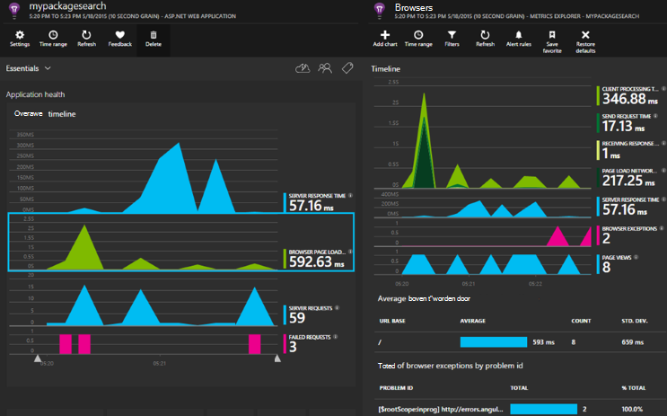

<properties 
    pageTitle="Toepassing inzichten voor ASP.NET Core" 
    description="Webtoepassingen voor beschikbaarheid, prestaties en het gebruik controleren." 
    services="application-insights" 
    documentationCenter=".net"
    authors="alancameronwills" 
    manager="douge"/>

<tags 
    ms.service="application-insights" 
    ms.workload="tbd" 
    ms.tgt_pltfrm="ibiza" 
    ms.devlang="na" 
    ms.topic="article" 
    ms.date="08/30/2016" 
    ms.author="awills"/>

# Toepassing inzichten voor ASP.NET Core

[Visual Studio toepassing inzichten](app-insights-overview.md) kunt u uw webtoepassing voor beschikbaarheid, prestaties en het gebruik controleren. Met het soort feedback dat u over de prestaties en de effectiviteit van uw app in de natuur krijgen, kunt u beslissen de richting van het ontwerp dat in elke ontwikkelingscyclus.

U hebt een abonnement op [Microsoft Azure](http://azure.com)nodig. Meld u aan met een Microsoft-account, die u misschien voor Windows, XBox Live of andere Microsoft-cloudservices. Uw team mogelijk een organisatie-abonnement op Azure: vraag de eigenaar van de toe te voegen aan met uw Microsoft-account.

## Aan de slag

Volg de [handleiding aan de slag](https://github.com/Microsoft/ApplicationInsights-aspnetcore/wiki/Getting-Started).

## Toepassing inzichten gebruik

Meld u aan bij de [portal van Microsoft Azure](https://portal.azure.com) en blader naar de bron die u hebt gemaakt om te controleren van uw app.

Gebruik uw app een tijdje in een afzonderlijk browservenster. Hier ziet u gegevens weergegeven in de toepassing inzichten-grafieken. (U mogelijk moet klikt u op vernieuwen.) Er wordt een kleine hoeveelheid gegevens terwijl u ontwikkelt, maar deze grafieken echt tot leven wanneer u uw app publiceert en veel gebruikers hebt. 

De overzichtspagina van de grafieken prestaties ziet u waarschijnlijk in geïnteresseerd bent: server antwoord tijd, laadtijd voor pagina en aantallen mislukte aanvragen. Klik op een grafiek om te zien meer grafieken en gegevens.

Weergaven in de portal vallen in twee belangrijkste categorieën:

* Grafieken en tabellen van de doelstellingen en aantallen, zoals antwoord tijden, mislukt tarieven of aan de doelstellingen maakt u zelf met de [API](app-insights-api-custom-events-metrics.md)worden weergegeven in [De doelstellingen Explorer](app-insights-metrics-explorer.md) . Filteren en de gegevens onderverdelen door eigenschapswaarden om een beter begrip van de app en de gebruikers.
* [Search Explorer](app-insights-diagnostic-search.md) worden afzonderlijke gebeurtenissen, zoals specifieke verzoeken, uitzonderingen, log sporen of gebeurtenissen die u zelf hebt gemaakt met de [API](app-insights-api-custom-events-metrics.md). Navigeren door gerelateerde gebeurtenissen worden onderzoek problemen filteren en zoeken in de gebeurtenissen.
* [Analytics](app-insights-analytics.md) kunt u via uw telemetrielogboek SQL-achtige query's worden uitgevoerd en is een krachtige analytische en diagnostische hulpprogramma.

## Waarschuwingen

* U krijgt automatisch [proactief diagnostische waarschuwingen](app-insights-proactive-diagnostics.md) waarmee u over afwijkende wijzigingen in mislukt tarieven en andere statistieken wordt verteld.
* [Beschikbaarheid van de tests](app-insights-monitor-web-app-availability.md) instellen voor het testen van uw website continu van locaties overal ter wereld, en vind e-mailberichten zodra een test mislukt.
* [Metrische waarschuwingen](app-insights-monitor-web-app-availability.md) instellen om te weten als de doelstellingen zoals antwoord tijden of uitzondering tarieven buiten aanvaardbaar limieten gaat.

## Meer telemetrielogboek ophalen

* [Telemetrielogboek toevoegen aan uw webpagina's](app-insights-javascript.md) in gebruik van de pagina controleren en prestaties.
* [Monitor afhankelijkheden](app-insights-dependencies.md) om te zien als REST, SQL of andere externe bronnen u vertragen.
* [Gebruik de API](app-insights-api-custom-events-metrics.md) om uw eigen gebeurtenissen en aan de doelstellingen voor een gedetailleerde weergave van de prestaties en het gebruik van de app te verzenden.
* [Beschikbaarheid van de tests](app-insights-monitor-web-app-availability.md) controleert u de app voortdurend van de wereld. 

## Bron openen

[Lezen en bijdragen aan de code](https://github.com/Microsoft/ApplicationInsights-aspnetcore#recent-updates)

